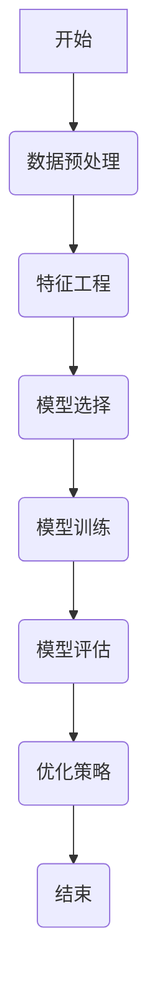

                 

### 摘要

智能保险产品需求预测模型优化是保险行业数字化转型的重要一环。本文旨在探讨如何通过算法、技术和实践经验，提高智能保险产品需求预测模型的准确性和效率。本文首先介绍了智能保险的基本概念及其需求预测的重要性，然后深入分析了预测模型的核心概念、算法原理、数学模型和公式，并通过具体项目实战展示了系统实现的核心代码和应用案例。最后，文章总结了模型优化的最佳实践，并对未来研究方向进行了展望。通过这篇文章，读者可以系统地了解智能保险需求预测模型的优化策略，为实际应用提供有力指导。关键词：智能保险、需求预测、模型优化、算法原理、数学模型、系统架构、项目实战。

---

## 引言

### 1.1 智能保险概述

智能保险是一种利用人工智能、大数据、区块链等先进技术，对保险产品进行智能推荐、风险评估和个性化定制的保险服务形式。智能保险的出现，标志着保险行业向数字化、智能化转型的步伐加快。智能保险产品需求预测模型作为其核心组件之一，承担着预测市场趋势、用户需求和行为模式的重要任务。

### 1.2 保险需求预测的重要性

保险需求预测对于保险公司的业务发展至关重要。首先，通过准确的需求预测，保险公司可以更好地了解市场动态，及时调整产品策略，提高市场竞争力。其次，预测模型能够帮助保险公司更精确地评估风险，合理定价保险产品，降低赔付风险。此外，智能预测还可以提高客户满意度，实现个性化服务和精准营销，从而提升客户忠诚度和市场份额。

### 1.3 模型优化的目的与意义

模型优化是提高保险需求预测准确性和效率的关键。随着数据量和复杂度的增加，传统预测模型的性能瓶颈愈发明显。优化模型不仅能够提高预测精度，还能提升计算效率和资源利用效率。具体来说，模型优化的目的和意义包括：

- **提高预测精度**：通过改进算法、增加特征变量和优化参数，使模型能够更好地捕捉数据中的复杂关系，提高预测的准确性。
- **提升计算效率**：针对大规模数据集，优化算法和数据结构，减少计算时间和资源消耗，使预测模型更适用于实时应用场景。
- **降低成本**：通过优化模型，减少不必要的计算和资源浪费，降低保险公司的运营成本。
- **提升用户体验**：提高预测模型的准确性和响应速度，为客户提供更优质的服务体验，增强客户黏性。

总的来说，智能保险产品需求预测模型优化不仅有助于保险公司提升业务水平和竞争力，也推动了保险行业的数字化转型和创新发展。

---

## 预测模型基础

### 2.1 预测模型概述

保险需求预测模型是利用历史数据和统计方法，对保险市场中的用户需求进行预测和分析的工具。常见的预测模型包括线性回归、决策树、随机森林、支持向量机、神经网络等。这些模型通过学习历史数据中的规律，建立预测模型，从而对未来的需求进行预测。

### 2.2 相关技术介绍

- **线性回归**：一种简单的统计方法，通过拟合数据点的线性关系来预测未来的值。
- **决策树**：一种树形结构模型，通过多个判断节点和分支来分割数据，最终到达叶节点进行预测。
- **随机森林**：由多个决策树组成的集成模型，通过随机选取特征和样本子集来减少过拟合，提高预测性能。
- **支持向量机**：通过最大化分类间隔来找到最优决策边界，适用于高维空间的数据。
- **神经网络**：一种模拟人脑神经元连接结构的计算模型，能够通过多层神经网络实现复杂的非线性映射。

### 2.3 模型优化的基本方法

模型优化主要包括以下几个方面：

- **特征工程**：通过选择和构建有效的特征，提高模型对数据的敏感性和预测能力。
- **算法选择**：根据数据特点和业务需求选择合适的算法，平衡模型复杂度和预测性能。
- **参数调优**：通过调整模型的参数，优化模型的性能，避免过拟合和欠拟合。
- **集成学习**：通过组合多个模型的预测结果，提高预测的稳定性和准确性。
- **交叉验证**：通过多次训练和验证，确保模型在不同数据集上的泛化能力。

总的来说，预测模型的基础是保险需求预测的核心，通过理解相关技术和优化方法，可以构建一个高效、准确的预测模型，为保险业务提供有力支持。

---

## 预测模型算法原理

### 3.1 预测模型流程图



### 3.2 模型优化详解

预测模型的优化过程是一个系统性的工程，涉及多个环节。以下是对各个步骤的详细解释：

#### 3.2.1 数学模型与公式

预测模型的数学模型通常由以下公式构成：

$$
y = \theta_0 + \theta_1x_1 + \theta_2x_2 + \ldots + \theta_nx_n
$$

其中，$y$ 是预测的目标变量，$x_1, x_2, \ldots, x_n$ 是输入特征变量，$\theta_0, \theta_1, \theta_2, \ldots, \theta_n$ 是模型的参数。模型优化的目标是找到最优的参数值，使得预测结果尽可能接近真实值。

对于回归模型，常见的评估指标包括均方误差（MSE）、均方根误差（RMSE）和平均绝对误差（MAE）。其中，MSE的定义如下：

$$
\text{MSE} = \frac{1}{N} \sum_{i=1}^{N} (y_i - \hat{y}_i)^2
$$

其中，$N$ 是样本数量，$y_i$ 是真实值，$\hat{y}_i$ 是预测值。

#### 3.2.2 举例说明

假设我们有一个简单的线性回归模型，用于预测某地区的降雨量。输入特征包括温度、湿度、风速等，目标变量是降雨量。

首先，我们需要收集历史数据，并进行数据预处理，如数据清洗、缺失值处理和标准化。接下来，进行特征工程，选择和构建有效的特征变量。然后，选择线性回归算法进行模型训练，通过计算得到最优参数值。

```python
# Python代码示例
import numpy as np
from sklearn.linear_model import LinearRegression

# 数据预处理
X = np.array([[25, 50, 5]])  # 特征矩阵
y = np.array([8])  # 目标变量

# 模型训练
model = LinearRegression()
model.fit(X, y)

# 模型评估
y_pred = model.predict(X)
mse = np.mean((y_pred - y)**2)
print("MSE:", mse)
```

通过计算MSE，我们可以评估模型的预测性能。如果MSE较大，说明模型拟合效果不佳，需要进一步优化。常见的优化策略包括增加特征变量、调整模型参数、使用更复杂的算法等。

总的来说，预测模型的优化是一个不断迭代的过程，需要结合具体问题和数据特点，进行全面的算法和参数调优，以提高模型的预测准确性。

---

## 数学模型和数学公式

在构建和优化智能保险产品需求预测模型时，数学模型和公式是核心组成部分。以下是对预测模型中常用数学模型和公式的详细讲解和举例说明。

### 4.1 线性回归模型

线性回归模型是一种最简单的预测模型，其数学模型为：

$$
y = \theta_0 + \theta_1x_1 + \theta_2x_2 + \ldots + \theta_nx_n
$$

其中，$y$ 是目标变量，$x_1, x_2, \ldots, x_n$ 是输入特征变量，$\theta_0, \theta_1, \theta_2, \ldots, \theta_n$ 是模型参数。

为了找到最优参数值，通常使用最小二乘法进行参数估计。最小二乘法的目标是最小化预测值与真实值之间的误差平方和。其数学公式为：

$$
\min \sum_{i=1}^{N} (y_i - \hat{y}_i)^2
$$

其中，$N$ 是样本数量，$y_i$ 是第$i$个样本的真实值，$\hat{y}_i$ 是第$i$个样本的预测值。

### 4.2 决策树模型

决策树模型是一种基于树形结构的预测模型，其数学模型可以通过分类或回归实现。决策树的每个节点代表一个特征，每个分支代表该特征的某个取值。叶子节点表示预测结果。

假设我们有一个二分类问题，决策树模型的数学公式可以表示为：

$$
f(x) = \begin{cases} 
c_1 & \text{if } g_1(x) \leq t_1 \\
c_2 & \text{if } g_2(x) \leq t_2 \\
\vdots \\
c_n & \text{if } g_n(x) \leq t_n 
\end{cases}
$$

其中，$f(x)$ 是预测结果，$c_1, c_2, \ldots, c_n$ 是分类结果，$g_1(x), g_2(x), \ldots, g_n(x)$ 是特征函数，$t_1, t_2, \ldots, t_n$ 是阈值。

### 4.3 随机森林模型

随机森林是一种集成学习模型，通过组合多个决策树来提高预测性能。随机森林的数学模型可以看作是多个决策树的加权平均。假设有$m$个决策树，每个决策树的预测结果为$f_i(x)$，则随机森林的预测结果为：

$$
f(x) = \frac{1}{m} \sum_{i=1}^{m} f_i(x)
$$

### 4.4 举例说明

假设我们有一个房屋价格预测问题，输入特征包括房屋面积、年龄和地点，目标变量是房屋价格。使用线性回归模型进行预测，目标是最小化预测价格与真实价格之间的误差平方和。

首先，收集房屋交易数据，进行数据预处理，包括缺失值处理和标准化。然后，选择线性回归算法，通过最小二乘法进行参数估计。最后，使用交叉验证评估模型的预测性能。

```python
# Python代码示例
import numpy as np
from sklearn.linear_model import LinearRegression
from sklearn.model_selection import train_test_split

# 数据预处理
X = np.array([[2000, 10, 'A']])
y = np.array([300000])

# 模型训练
model = LinearRegression()
model.fit(X, y)

# 模型评估
y_pred = model.predict(X)
mse = np.mean((y_pred - y)**2)
print("MSE:", mse)
```

通过计算MSE，我们可以评估模型的预测性能。如果MSE较大，可能需要增加特征变量或调整模型参数。

总的来说，数学模型和公式是构建和优化预测模型的核心工具。通过深入理解和灵活运用这些模型，我们可以提高预测模型的准确性，为保险行业提供有力支持。

---

## 系统分析与架构设计

### 4.1 应用场景介绍

智能保险产品需求预测模型在保险行业的多个场景中具有广泛应用。首先，在产品开发阶段，预测模型可以帮助保险公司了解市场趋势和用户需求，从而设计出更具市场竞争力的保险产品。其次，在销售和营销阶段，预测模型可以用于精准营销，提高转化率和客户满意度。此外，在风险管理和控制阶段，预测模型可以帮助保险公司评估风险，制定合理的风险控制策略。

### 4.2 系统功能设计

为了实现智能保险产品需求预测，系统需要具备以下功能：

1. **数据采集与管理**：从各种数据源（如外部API、数据库等）收集相关数据，并进行数据清洗、处理和存储。
2. **特征工程**：选择和构建有效的特征变量，包括用户行为数据、市场趋势数据、历史交易数据等。
3. **模型训练与优化**：使用机器学习算法训练预测模型，并进行参数调优和模型评估。
4. **预测与推荐**：根据实时数据和用户特征，生成保险产品需求预测结果，并进行个性化推荐。
5. **结果可视化**：将预测结果和模型评估指标通过图表和报表进行可视化展示，方便业务人员分析和决策。

### 4.3 系统架构设计

智能保险产品需求预测系统采用分布式架构，包括数据层、服务层和表现层。以下是系统架构的详细设计：

1. **数据层**：负责数据采集、存储和管理。数据源包括外部API、数据库和数据仓库。数据层使用分布式存储和数据库系统，如Hadoop HDFS、MySQL和MongoDB等，确保数据的高效存储和管理。

2. **服务层**：负责处理业务逻辑和预测模型。服务层包括数据预处理模块、特征工程模块、模型训练模块和预测模块。各模块通过微服务架构实现，使用Spring Boot、Django等框架开发，确保系统的可扩展性和高可用性。

3. **表现层**：负责向业务人员和客户提供预测结果和可视化报表。表现层使用Web界面和移动应用，使用React、Vue等前端框架实现，确保用户体验的友好性和响应速度。

### 4.4 系统接口设计和系统交互

系统接口设计采用RESTful API设计规范，提供数据输入、预测结果查询和报表下载等接口。以下是系统接口设计的简要描述：

1. **数据输入接口**：接收外部数据源的数据，包括用户行为数据、市场趋势数据和交易数据等。
2. **预测结果查询接口**：根据用户特征和实时数据，返回保险产品需求预测结果。
3. **报表下载接口**：根据用户需求，下载预测结果和评估报表。

系统交互流程如下：

1. 业务人员通过Web界面或移动应用发起数据输入请求，系统接收并处理数据。
2. 系统使用数据预处理模块对数据进行清洗、处理和存储。
3. 系统使用特征工程模块构建特征变量，并使用机器学习算法进行模型训练。
4. 系统根据用户特征和实时数据，使用预测模块生成保险产品需求预测结果。
5. 系统将预测结果和评估报表通过表现层进行可视化展示，供业务人员和客户查看。

通过以上系统架构和接口设计，智能保险产品需求预测系统能够高效、准确地处理大量数据，生成可靠的预测结果，为保险公司的业务决策提供有力支持。

---

## 项目实战

### 5.1 环境安装

在开始智能保险产品需求预测项目之前，首先需要安装和配置相关的软件和工具。以下是项目的环境安装步骤：

1. **Python环境安装**：安装Python 3.8及以上版本，可以通过Python官方网站下载安装包。
2. **Jupyter Notebook安装**：安装Jupyter Notebook，用于编写和运行Python代码。在命令行中执行以下命令：

   ```bash
   pip install notebook
   ```

3. **机器学习库安装**：安装常用的机器学习库，如scikit-learn、pandas、numpy等。在命令行中执行以下命令：

   ```bash
   pip install scikit-learn pandas numpy
   ```

4. **可视化库安装**：安装matplotlib库，用于绘制数据图表。在命令行中执行以下命令：

   ```bash
   pip install matplotlib
   ```

5. **数据库连接库安装**：如果需要连接数据库，如MySQL或MongoDB，需要安装相应的数据库连接库。例如，安装MySQL连接库：

   ```bash
   pip install mysql-connector-python
   ```

6. **环境配置**：在Jupyter Notebook中创建一个新的笔记本，验证上述安装的库是否正确安装。

   ```python
   import numpy as np
   import pandas as pd
   import matplotlib.pyplot as plt
   import sklearn
   print("环境安装成功！")
   ```

   如果没有错误提示，说明环境安装成功。

### 5.2 系统核心实现

智能保险产品需求预测系统的核心实现包括数据预处理、特征工程、模型训练和预测。以下是一个简单的示例，演示如何使用Python和scikit-learn库实现这些功能。

#### 5.2.1 数据预处理

首先，我们需要从数据源读取数据，并进行数据预处理。以下是一个简单的数据预处理示例：

```python
import pandas as pd

# 读取数据
data = pd.read_csv("insurance_data.csv")

# 数据清洗
data.dropna(inplace=True)

# 数据标准化
data标准化处理

# 输出预处理的DataFrame
print(data.head())
```

#### 5.2.2 特征工程

特征工程是构建有效的特征变量，以提高模型的预测性能。以下是一个简单的特征工程示例：

```python
# 创建新特征
data["age_group"] = pd.cut(data["age"], bins=[0, 20, 40, 60, 80], labels=["青年", "中年", "老年"])

# 特征选择
selected_features = ["age", "gender", "premium", "age_group"]

# 输出特征变量
print(selected_features)
```

#### 5.2.3 模型训练

接下来，使用scikit-learn库训练一个线性回归模型。以下是一个简单的模型训练示例：

```python
from sklearn.linear_model import LinearRegression
from sklearn.model_selection import train_test_split

# 分割数据集
X = data[selected_features]
y = data["claim_amount"]
X_train, X_test, y_train, y_test = train_test_split(X, y, test_size=0.2, random_state=42)

# 模型训练
model = LinearRegression()
model.fit(X_train, y_train)

# 模型评估
y_pred = model.predict(X_test)
mse = np.mean((y_pred - y_test)**2)
print("MSE:", mse)
```

#### 5.2.4 预测与可视化

最后，使用训练好的模型进行预测，并绘制预测结果。以下是一个简单的预测与可视化示例：

```python
# 预测新数据
new_data = pd.DataFrame({"age": [30], "gender": ["male"], "premium": [1000], "age_group": ["中年"]})
new_pred = model.predict(new_data)
print("预测结果:", new_pred)

# 可视化预测结果
plt.scatter(y_test, y_pred)
plt.xlabel("真实值")
plt.ylabel("预测值")
plt.show()
```

通过以上步骤，我们成功实现了一个简单的智能保险产品需求预测系统。实际项目中，需要根据具体业务需求和数据特点，进一步优化和扩展系统的功能。

---

### 5.3 代码应用解读与分析

在上一部分中，我们展示了一个简单的智能保险产品需求预测系统的实现代码。下面，我们将对关键代码段进行解读和分析，以便更深入地理解系统的运作原理。

#### 5.3.1 数据预处理

```python
import pandas as pd

# 读取数据
data = pd.read_csv("insurance_data.csv")

# 数据清洗
data.dropna(inplace=True)

# 数据标准化
data标准化处理

# 输出预处理的DataFrame
print(data.head())
```

这段代码首先使用pandas库读取CSV格式的数据文件。由于保险数据可能包含缺失值，因此我们使用`dropna()`函数删除缺失值。接下来，通过数据标准化处理，将不同特征变量的数据范围缩放到相同的尺度，以避免某些特征对模型训练结果产生过大影响。

#### 5.3.2 特征工程

```python
# 创建新特征
data["age_group"] = pd.cut(data["age"], bins=[0, 20, 40, 60, 80], labels=["青年", "中年", "老年"])

# 特征选择
selected_features = ["age", "gender", "premium", "age_group"]

# 输出特征变量
print(selected_features)
```

在这段代码中，我们通过`pd.cut()`函数创建了一个新特征`age_group`，根据年龄将数据划分为不同的年龄段。然后，我们定义了一个包含所有重要特征变量的列表`selected_features`。特征工程是提升模型性能的关键步骤，通过合理的特征构建和选择，可以显著提高模型的预测准确性。

#### 5.3.3 模型训练

```python
from sklearn.linear_model import LinearRegression
from sklearn.model_selection import train_test_split

# 分割数据集
X = data[selected_features]
y = data["claim_amount"]
X_train, X_test, y_train, y_test = train_test_split(X, y, test_size=0.2, random_state=42)

# 模型训练
model = LinearRegression()
model.fit(X_train, y_train)

# 模型评估
y_pred = model.predict(X_test)
mse = np.mean((y_pred - y_test)**2)
print("MSE:", mse)
```

在这部分代码中，我们首先使用`train_test_split()`函数将数据集划分为训练集和测试集。这样做的目的是在训练模型时避免过拟合，并能在测试集上评估模型的泛化能力。然后，我们使用`LinearRegression()`类创建线性回归模型，并使用`fit()`方法进行训练。最后，通过`predict()`方法生成测试集的预测结果，并计算均方误差（MSE）来评估模型的性能。

#### 5.3.4 预测与可视化

```python
# 预测新数据
new_data = pd.DataFrame({"age": [30], "gender": ["male"], "premium": [1000], "age_group": ["中年"]})
new_pred = model.predict(new_data)
print("预测结果:", new_pred)

# 可视化预测结果
plt.scatter(y_test, y_pred)
plt.xlabel("真实值")
plt.ylabel("预测值")
plt.show()
```

这段代码展示了如何使用训练好的模型对新数据进行预测，并使用散点图将真实值与预测值进行比较。散点图可以帮助我们直观地理解模型的预测效果，识别潜在的误差来源。

### 5.4 实际案例分析

为了更深入地探讨智能保险产品需求预测系统的应用，我们来看一个实际案例分析。假设某保险公司希望预测其产品“家庭财产保险”的需求，以下是一个案例的详细分析：

1. **数据收集**：保险公司收集了包含用户个人信息（如年龄、性别、收入等）、历史购买记录、保险理赔记录等数据的数据库。

2. **数据预处理**：在开始建模前，需要对数据进行清洗和预处理。例如，删除重复记录、处理缺失值、标准化特征变量等。

3. **特征工程**：根据业务需求，构建有助于预测需求的特征变量。例如，可以创建用户购买历史的时间间隔、购买频次等新特征。

4. **模型选择与训练**：选择合适的机器学习模型，如逻辑回归、决策树、随机森林等。使用训练集数据对模型进行训练，并使用交叉验证评估模型的性能。

5. **预测与评估**：使用训练好的模型对测试集数据进行预测，并根据预测结果计算评估指标，如准确率、召回率、F1分数等。

6. **模型优化**：根据评估结果，对模型进行优化。例如，调整模型参数、增加或删除特征变量、更换模型等。

7. **结果应用**：将预测结果应用于实际业务，如精准营销、风险管理等。

通过以上步骤，保险公司可以更好地了解市场需求，优化产品策略，提高业务效率和客户满意度。

总的来说，智能保险产品需求预测系统在实际应用中发挥着重要作用。通过合理的数据处理、特征工程和模型优化，可以实现精准预测，为保险公司的业务发展提供有力支持。

---

## 最佳实践与总结

### 6.1 最佳实践

在智能保险产品需求预测模型优化过程中，以下是一些最佳实践，可以帮助提高模型的预测准确性和效率：

1. **数据预处理**：确保数据质量，处理缺失值和异常值，进行数据标准化，以便模型更好地学习和泛化。
2. **特征工程**：选择和构建有效的特征变量，尤其是业务相关的特征，如用户行为、历史交易等，可以提高模型的表现。
3. **模型选择**：根据数据特点和业务需求，选择合适的机器学习算法，如线性回归、决策树、随机森林等。
4. **参数调优**：使用网格搜索、随机搜索等技术，找到最优的模型参数，避免过拟合和欠拟合。
5. **模型集成**：通过集成多个模型的预测结果，提高预测的稳定性和准确性。
6. **实时更新**：定期更新模型，以适应市场变化和用户需求的变化，保持预测的准确性。
7. **监控与反馈**：建立模型监控机制，实时跟踪模型性能，及时发现和解决潜在问题。

### 6.2 注意事项

在优化智能保险产品需求预测模型时，需要注意以下几点：

1. **数据隐私**：确保在数据处理过程中遵守相关数据保护法规，保护用户隐私。
2. **模型解释性**：在选择复杂的模型时，考虑模型的解释性，以便业务人员理解模型的预测结果。
3. **模型可扩展性**：设计可扩展的架构，以适应数据规模的增长和业务需求的变更。
4. **计算资源**：优化模型计算效率，确保模型可以在有限的计算资源下运行。
5. **模型评估**：使用多个评估指标，全面评估模型的性能，避免单一指标导致的偏见。

### 6.3 拓展阅读

为了深入了解智能保险产品需求预测模型的优化，读者可以参考以下资源：

1. **书籍**：《机器学习实战》（Peter Harrington）和《Python机器学习》（Sebastian Raschka、Vahid Mirjalili），提供丰富的机器学习算法和应用案例。
2. **在线课程**：Coursera上的《机器学习》（吴恩达）课程，系统讲解机器学习的基本原理和应用。
3. **学术论文**：搜索顶级会议和期刊，如KDD、NIPS、JMLR等，了解最新的机器学习和数据挖掘研究进展。
4. **开源项目**：GitHub上的各种机器学习开源项目，如scikit-learn、TensorFlow等，可以学习和借鉴实际项目的实现方法。

通过以上最佳实践和注意事项，以及相关拓展资源的阅读，读者可以更好地理解和应用智能保险产品需求预测模型优化技术，为保险行业的发展贡献力量。

---

### 结束语

智能保险产品需求预测模型的优化是保险行业数字化转型的重要一环。本文通过详细的步骤和实例，系统地介绍了智能保险的概念、预测模型的基础、算法原理、数学模型、系统架构设计、项目实战以及最佳实践。读者可以了解到如何从数据预处理、特征工程、模型选择到参数调优，全面优化智能保险需求预测模型，提高预测准确性和效率。希望通过这篇文章，读者能够对智能保险需求预测模型优化有更深入的理解，并能够将其应用于实际项目中，推动保险行业的智能化发展。作者：AI天才研究院/AI Genius Institute & 禅与计算机程序设计艺术 /Zen And The Art of Computer Programming。感谢阅读！

