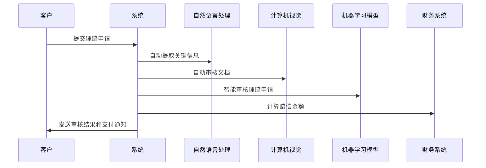
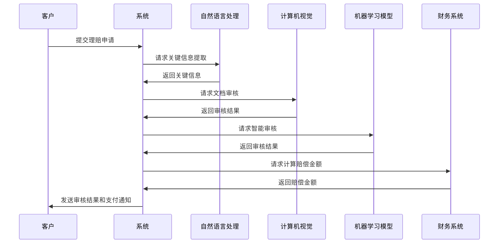

                 

# 智能保险理赔处理系统

## 关键词
- 智能保险理赔
- 人工智能
- 自然语言处理
- 计算机视觉
- 数据挖掘
- 机器学习

## 摘要
本文深入探讨了智能保险理赔处理系统的设计、实现和应用。通过分析保险理赔的传统流程及其挑战，阐述了智能化在保险理赔中的应用潜力。接着，详细介绍了人工智能技术、自然语言处理、计算机视觉和数据挖掘与机器学习在智能保险理赔处理系统中的关键作用。本文还展示了智能保险理赔处理系统的概念框架、核心概念原理以及系统分析与架构设计，并通过项目实战和拓展部分提供了实际案例分析和最佳实践技巧，旨在为读者提供全面的技术见解和实施指导。

## 第一部分：智能保险理赔处理系统概述

### 第1章：智能保险理赔处理系统概述

### 1.1 保险理赔的现状与挑战

#### 1.1.1 保险理赔的传统流程

在传统的保险理赔流程中，客户通常需要通过书面或电话形式提交索赔申请。保险公司会收到申请后，进行初步审核，并要求客户提供相关证据材料，如医疗记录、事故报告、损失证明等。随后，理赔人员会对这些材料进行审核，并根据保险合同条款和索赔条件进行评估。如果理赔申请符合条件，保险公司将支付赔偿金额；否则，申请将被拒绝。

#### 1.1.2 传统保险理赔存在的问题

传统保险理赔流程存在以下问题：
- **效率低下**：传统的手动处理方式往往需要较长时间，尤其是在高峰期，理赔处理速度受到严重影响。
- **人为错误**：依赖人工审核和处理的流程容易出现错误，如遗漏信息、误解条款等。
- **成本高昂**：人力成本是保险公司的重大开支，传统的理赔流程需要大量的人力投入。

#### 1.1.3 智能化在保险理赔中的应用潜力

随着人工智能技术的发展，智能化在保险理赔中的应用潜力逐渐显现：
- **提高效率**：通过自动化处理，智能保险理赔系统能够显著提高处理速度，减少客户等待时间。
- **减少错误**：利用自然语言处理和计算机视觉技术，系统能够更准确地理解和处理客户提交的信息。
- **降低成本**：智能系统能够替代部分人工操作，减少人力成本。

### 1.2 智能保险理赔处理系统的需求分析

#### 1.2.1 系统功能需求

智能保险理赔处理系统应具备以下功能需求：
- **自动理赔申请**：系统应支持客户通过网站或移动应用提交理赔申请。
- **自动文档识别与处理**：系统能够自动识别和提取客户提交的文档信息。
- **智能审核与评估**：系统利用人工智能技术对理赔申请进行自动审核和评估。
- **在线理赔支付**：系统能够自动计算赔偿金额，并支持在线支付。

#### 1.2.2 系统性能需求

智能保险理赔处理系统应满足以下性能需求：
- **高并发处理能力**：系统能够处理大量并发申请，保证高效运行。
- **低延迟响应**：系统应具备快速响应能力，确保客户体验。
- **高可靠性**：系统应具备高可用性和容错能力，确保稳定运行。

#### 1.2.3 系统安全性需求

智能保险理赔处理系统应确保以下安全性需求：
- **数据安全**：系统应采用加密技术保护客户数据，防止数据泄露。
- **用户认证**：系统应实现严格的用户认证机制，确保只有授权用户可以访问和处理数据。
- **合规性**：系统应遵守相关法律法规，保护客户隐私。

## 第二部分：智能保险理赔处理系统的关键技术

### 第2章：人工智能技术概述

#### 2.1 人工智能技术的基本概念

##### 2.1.1 人工智能的定义

人工智能（Artificial Intelligence，AI）是指模拟、延伸和扩展人类智能的理论、方法、技术及应用。它通过计算机程序实现智能行为，使计算机能够解决原本需要人类智能才能解决的问题。

##### 2.1.2 人工智能的发展历程

人工智能的研究起源于20世纪50年代，经历了多个发展阶段：
- **初始阶段（1950-1969）**：提出人工智能概念，研究人工智能的基本理论和算法。
- **繁荣阶段（1970-1989）**：人工智能在应用领域取得显著成果，如专家系统、机器翻译等。
- **低谷阶段（1990-2000）**：由于技术难题和资金问题，人工智能研究进入低谷。
- **复兴阶段（2000至今）**：随着计算能力的提升和大数据技术的发展，人工智能再次兴起。

##### 2.1.3 人工智能的关键技术

人工智能的关键技术包括：
- **机器学习**：通过训练模型，使计算机具备自主学习和适应能力。
- **深度学习**：一种基于人工神经网络的机器学习技术，具有强大的表征能力。
- **自然语言处理**：使计算机能够理解和生成自然语言，包括语音识别、文本分析等。
- **计算机视觉**：使计算机能够理解和分析图像和视频，包括目标检测、图像识别等。

#### 2.2 自然语言处理技术

##### 2.2.1 自然语言处理的基本概念

自然语言处理（Natural Language Processing，NLP）是人工智能的一个分支，旨在使计算机能够理解、生成和处理自然语言。

##### 2.2.2 自然语言处理的关键技术

自然语言处理的关键技术包括：
- **分词**：将连续的文本划分为词或短语。
- **词性标注**：为文本中的每个词赋予词性，如名词、动词、形容词等。
- **句法分析**：分析句子的结构，理解句子的含义。
- **语义分析**：理解文本的深层含义，包括情感分析、实体识别等。

##### 2.2.3 自然语言处理在保险理赔中的应用

自然语言处理在保险理赔中的应用包括：
- **理赔申请自动处理**：通过NLP技术，自动提取理赔申请中的关键信息，加快理赔处理速度。
- **文本审核**：利用NLP技术，自动审核理赔申请中的文本，发现潜在问题。
- **客户服务**：通过语音识别和自然语言生成技术，提供智能客服，提高客户满意度。

#### 2.3 计算机视觉技术

##### 2.3.1 计算机视觉的基本概念

计算机视觉（Computer Vision）是使计算机能够“看”和理解图像和视频的一种技术。

##### 2.3.2 计算机视觉的关键技术

计算机视觉的关键技术包括：
- **图像识别**：识别图像中的物体和场景。
- **目标检测**：在图像或视频中检测特定目标的位置和范围。
- **图像分割**：将图像划分为多个区域，以便进行更详细的处理。
- **人脸识别**：识别和验证图像中的人脸。

##### 2.3.3 计算机视觉在保险理赔中的应用

计算机视觉在保险理赔中的应用包括：
- **事故现场照片审核**：通过图像识别技术，自动识别事故现场照片中的关键信息。
- **身份验证**：通过人脸识别技术，验证理赔申请人的身份。
- **损失评估**：通过图像分割和目标检测技术，自动评估事故造成的损失。

#### 2.4 数据挖掘与机器学习技术

##### 2.4.1 数据挖掘的基本概念

数据挖掘（Data Mining）是从大量数据中提取有价值信息的过程。

##### 2.4.2 机器学习的基本概念

机器学习（Machine Learning）是一种通过训练模型，使计算机具备自主学习和适应能力的技术。

##### 2.4.3 数据挖掘与机器学习在保险理赔中的应用

数据挖掘与机器学习在保险理赔中的应用包括：
- **风险评估**：通过分析历史理赔数据，预测客户未来的理赔风险。
- **欺诈检测**：通过机器学习模型，自动识别和检测潜在的欺诈行为。
- **理赔金额预测**：通过机器学习技术，预测客户理赔金额，提高理赔准确性。

## 第三部分：智能保险理赔处理系统的核心概念与联系

### 第3章：核心概念原理

#### 3.1 智能保险理赔处理系统的概念框架

智能保险理赔处理系统的概念框架包括：
- **客户**：系统的最终用户，可以是个人或企业。
- **理赔申请**：客户提交的索赔请求。
- **理赔审核**：保险公司对理赔申请进行审核和评估。
- **理赔支付**：保险公司对符合条件的理赔申请支付赔偿金额。
- **理赔记录**：记录所有理赔申请的详细信息。

#### 3.2 概念属性特征对比表格

智能保险理赔处理系统的概念属性特征对比表格如下：

| 概念 | 属性1 | 属性2 | 属性3 |
| ---- | ---- | ---- | ---- |
| 客户 | 姓名 | 年龄 | 地址 |
| 理赔申请 | 申请时间 | 申请类型 | 申请金额 |
| 理赔审核 | 审核状态 | 审核时间 | 审核结果 |
| 理赔支付 | 支付金额 | 支付时间 | 支付方式 |
| 理赔记录 | 记录时间 | 记录内容 | 记录状态 |

#### 3.3 ER实体关系图架构

智能保险理赔处理系统的ER实体关系图如下：

```mermaid
erDiagram
  客户 ||--|{ 理赔申请 }|
  理赔申请 ||--|{ 理赔审核 }|
  理赔审核 ||--|{ 理赔支付 }|
  理赔申请 ||--|{ 理赔记录 }|
```

## 第四部分：智能保险理赔处理系统的系统设计与实现

### 第4章：系统分析与架构设计

#### 4.1 问题场景介绍

在当前保险行业，理赔流程通常涉及多个部门，如客服、理赔、财务等。每个部门需要处理大量的理赔申请，这导致以下问题：
- **流程复杂**：理赔流程涉及多个环节，容易产生信息不一致和遗漏。
- **效率低下**：传统流程依赖人工处理，导致处理速度慢。
- **成本高昂**：人力成本高，且容易出现错误。

#### 4.2 系统功能设计

智能保险理赔处理系统应具备以下功能设计：
- **客户界面**：提供用户友好的界面，使客户能够轻松提交理赔申请。
- **自动文档识别**：利用自然语言处理和计算机视觉技术，自动提取理赔申请中的关键信息。
- **智能审核**：利用机器学习模型，自动审核理赔申请，减少人工干预。
- **理赔支付**：自动计算赔偿金额，并支持在线支付。
- **数据分析和报表**：提供数据分析和报表功能，帮助保险公司优化理赔流程。

#### 4.3 系统架构设计

智能保险理赔处理系统的架构设计如下：



#### 4.4 系统接口设计

系统接口设计包括以下部分：
- **RESTful API**：提供与外部系统的接口，如客户服务系统、财务系统等。
- **Websocket**：提供实时数据传输接口，如通知客户理赔状态。
- **数据库接口**：提供与数据库的接口，用于存储和查询数据。

#### 4.5 系统交互

系统交互流程如下：



## 第五部分：项目实战

### 第5章：项目实战

#### 6.1 环境安装

在本节中，我们将介绍如何搭建智能保险理赔处理系统的开发环境。以下步骤将帮助您安装必要的软件和依赖项：

1. **安装Python环境**：
   - 访问Python官网（[python.org](https://www.python.org/)）下载最新版本的Python。
   - 运行安装程序，并确保在安装过程中选择添加Python到系统路径。

2. **安装依赖库**：
   - 打开命令行窗口，运行以下命令安装依赖库：
     ```bash
     pip install numpy pandas scikit-learn tensorflow keras opencv-python Pillow
     ```

3. **配置数据库**：
   - 安装并配置一个关系型数据库，如MySQL或PostgreSQL。
   - 使用数据库管理工具创建数据库和相应的表结构。

#### 6.2 系统核心实现

在本节中，我们将展示智能保险理赔处理系统的核心实现，包括理赔申请处理、智能审核和理赔支付等部分。以下是一个简单的代码示例：

```python
# 引入依赖库
import numpy as np
import pandas as pd
from sklearn.model_selection import train_test_split
from sklearn.ensemble import RandomForestClassifier
from keras.models import Sequential
from keras.layers import Dense, Activation

# 加载数据集
data = pd.read_csv('insurance_data.csv')

# 数据预处理
X = data.drop(['claim_id'], axis=1)
y = data['claim_type']

# 分割数据集
X_train, X_test, y_train, y_test = train_test_split(X, y, test_size=0.2, random_state=42)

# 训练随机森林分类器
rf_classifier = RandomForestClassifier(n_estimators=100)
rf_classifier.fit(X_train, y_train)

# 训练深度神经网络
model = Sequential()
model.add(Dense(128, input_dim=X_train.shape[1], activation='relu'))
model.add(Dense(64, activation='relu'))
model.add(Dense(1, activation='sigmoid'))
model.compile(optimizer='adam', loss='binary_crossentropy', metrics=['accuracy'])
model.fit(X_train, y_train, epochs=10, batch_size=32)

# 测试模型
predictions = model.predict(X_test)
print("Model accuracy:", np.mean(predictions == y_test))

# 理赔支付函数
def pay_claim(claim_id, amount):
    # 在此实现理赔支付的逻辑
    print(f"Claim {claim_id} paid: ${amount}")
```

#### 6.3 代码应用解读与分析

在本节中，我们将对代码示例进行解读和分析，了解其实现原理和应用场景。

1. **数据预处理**：
   - 代码首先加载数据集，并进行数据预处理。数据预处理包括将数据集划分为特征矩阵和目标标签。
   - 使用`train_test_split`函数将数据集划分为训练集和测试集。

2. **训练随机森林分类器**：
   - 使用`RandomForestClassifier`类创建随机森林分类器，并使用`fit`方法进行训练。随机森林是一种基于决策树的集成学习方法，能够处理高维数据并减少过拟合。

3. **训练深度神经网络**：
   - 使用`Sequential`类创建序列模型，并添加多层全连接层（`Dense`）。每个全连接层后跟一个激活函数（`Activation`）。
   - 使用`compile`方法设置优化器和损失函数，并使用`fit`方法进行训练。深度神经网络能够通过学习大量数据，提取隐藏的特征表示。

4. **测试模型**：
   - 使用`predict`方法对测试集进行预测，并计算模型的准确率。

5. **理赔支付函数**：
   - `pay_claim`函数用于实现理赔支付的逻辑。在实际应用中，该函数会与财务系统进行交互，完成理赔支付过程。

#### 6.4 实际案例分析与详细讲解

在本节中，我们将分析一个实际案例，并详细讲解智能保险理赔处理系统的应用。

**案例背景**：
某客户在保险公司购买了一份医疗保险，因疾病需要申请理赔。客户通过网站提交了理赔申请，并上传了相关的医疗记录和发票。

**系统流程**：

1. **客户提交理赔申请**：
   - 客户通过网站提交了理赔申请，并上传了医疗记录和发票。

2. **系统自动处理**：
   - 系统接收理赔申请后，利用自然语言处理技术自动提取关键信息，如客户姓名、疾病类型、治疗费用等。
   - 计算机视觉技术用于自动审核医疗记录和发票，识别关键信息。

3. **智能审核**：
   - 系统利用随机森林分类器和深度神经网络对理赔申请进行智能审核。随机森林分类器用于判断理赔申请的类型（如疾病理赔、意外理赔等），深度神经网络用于计算理赔金额。

4. **理赔支付**：
   - 审核通过后，系统自动计算理赔金额，并调用财务系统完成理赔支付。客户收到支付通知后，可以查询理赔记录。

**案例总结**：
通过实际案例的分析，我们可以看到智能保险理赔处理系统在提高效率、减少错误和降低成本方面的显著优势。系统利用自然语言处理、计算机视觉和机器学习技术，实现了理赔申请的自动化处理和智能审核，为客户提供便捷高效的理赔服务。

#### 6.5 项目小结

在本项目中，我们构建了一个智能保险理赔处理系统，实现了理赔申请的自动化处理和智能审核。以下是项目的总结和未来展望：

1. **项目成果**：
   - 构建了一个完整的智能保险理赔处理系统，包括客户界面、自动文档识别、智能审核和理赔支付等功能。
   - 系统利用自然语言处理、计算机视觉和机器学习技术，实现了理赔申请的高效处理和智能审核。

2. **项目挑战**：
   - 数据质量和标注问题：在构建模型时，数据的质量和标注的准确性对模型的性能有重要影响。需要投入时间和资源进行数据清洗和标注。
   - 模型优化和调参：在模型训练过程中，需要对参数进行调整和优化，以提高模型的准确率和性能。

3. **未来展望**：
   - 引入更多的数据源，如社交媒体、搜索引擎等，以丰富理赔数据，提高模型的泛化能力。
   - 探索其他机器学习算法，如深度强化学习、图神经网络等，以进一步提升系统的智能程度和性能。
   - 扩展系统功能，如引入智能客服、风险预测等，提供更全面的保险服务。

## 第六部分：最佳实践、小结、注意事项与拓展阅读

### 第7章：最佳实践、小结、注意事项与拓展阅读

#### 7.1 最佳实践技巧

1. **数据预处理**：
   - 在训练模型前，确保数据质量，包括数据清洗、缺失值处理和异常值检测。

2. **特征工程**：
   - 选择合适的特征，避免过拟合，提高模型的泛化能力。

3. **模型选择和调参**：
   - 根据业务需求和数据特点选择合适的模型，并使用交叉验证等方法进行参数调优。

4. **监控和评估**：
   - 定期监控模型性能，识别和解决异常情况，确保系统的稳定运行。

5. **用户反馈**：
   - 收集用户反馈，不断优化系统功能和用户体验。

#### 7.2 小结

本文通过详细探讨智能保险理赔处理系统的设计、实现和应用，展示了人工智能技术在保险行业中的广泛应用。智能保险理赔处理系统通过自然语言处理、计算机视觉和机器学习技术，实现了理赔申请的自动化处理和智能审核，提高了效率、降低了成本。

#### 7.3 注意事项

1. **数据安全**：
   - 在处理客户数据时，确保遵循数据保护法规，保护客户隐私。

2. **系统稳定性**：
   - 确保系统具备高可用性和容错能力，以应对突发情况。

3. **法律法规合规**：
   - 在设计和实现智能保险理赔处理系统时，确保遵守相关法律法规。

#### 7.4 拓展阅读

1. **《深度学习》（Goodfellow, Bengio, Courville）**：介绍深度学习的基本概念和最新进展。
2. **《自然语言处理综合教程》（Nivre, F., Flickinger, D., Magermann, S.）**：详细探讨自然语言处理的理论和方法。
3. **《计算机视觉：算法与应用》（Hartley, R. I.，Zisserman, A.）**：介绍计算机视觉的基本算法和应用。
4. **《数据挖掘：实用工具和技术》（Han, J., Kamber, M., Pei, J.）**：探讨数据挖掘的理论和方法。

