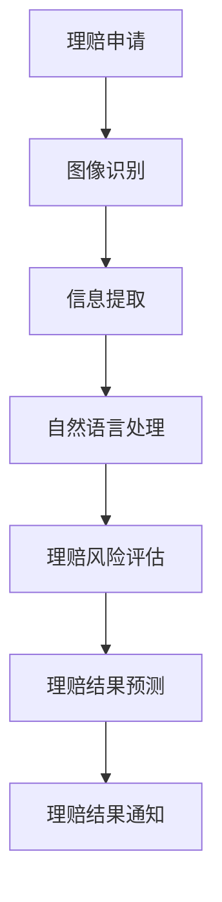
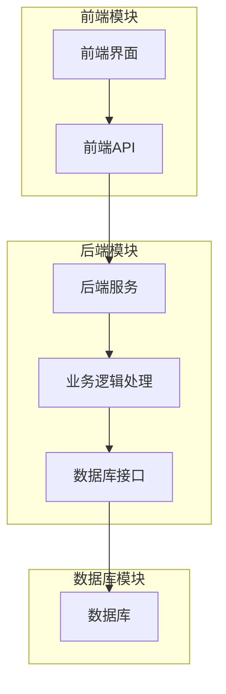
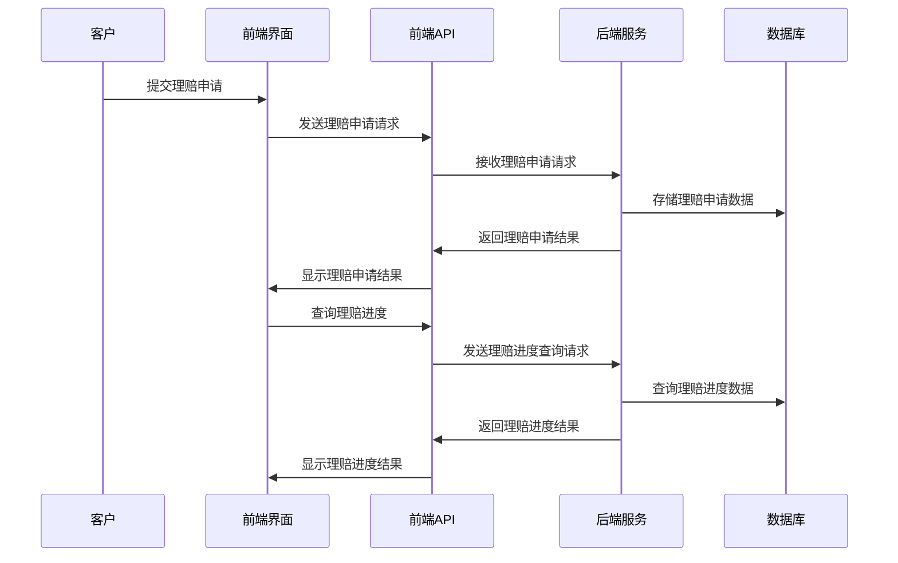

                 

### 智能保险理赔快速处理系统概述

#### 第1章：智能保险理赔快速处理系统的背景与问题

##### 1.1.1 问题背景

在当今社会，保险已经成为人们生活中不可或缺的一部分。然而，传统的保险理赔流程繁琐、耗时长，常常导致客户不满意。随着人工智能技术的飞速发展，智能保险理赔快速处理系统应运而生，旨在通过智能化手段提高保险理赔的效率和质量。

##### 1.1.2 问题描述

当前，保险理赔流程主要面临以下问题：

1. **人工效率低**：传统的理赔流程主要依赖于人工处理，效率低下，处理时间较长。
2. **数据准确性差**：人工录入数据容易出错，导致理赔结果不准确。
3. **用户体验差**：繁琐的流程、漫长的等待时间，导致客户满意度低。
4. **监管难度大**：理赔过程中存在一定的违规操作风险，监管难度大。

##### 1.1.3 问题解决思路

为了解决上述问题，智能保险理赔快速处理系统采用了以下思路：

1. **自动化处理**：利用人工智能技术，实现理赔流程的自动化处理，提高效率。
2. **数据智能识别**：通过图像识别、自然语言处理等技术，提高数据准确性。
3. **用户体验优化**：通过在线服务、移动端应用等方式，优化用户体验。
4. **风险智能监控**：利用大数据分析和机器学习技术，实现风险智能监控，降低违规操作风险。

##### 1.1.4 研究边界与外延

本文的研究边界主要集中在智能保险理赔快速处理系统的原理、算法、系统架构设计和项目实战等方面。同时，本文也将探讨智能保险理赔快速处理系统的实际应用和未来发展方向。

## 第2章：智能保险理赔快速处理系统的核心概念与联系

##### 2.1.1 核心概念介绍

在智能保险理赔快速处理系统中，涉及以下几个核心概念：

1. **智能理赔**：利用人工智能技术，自动处理保险理赔申请，提高理赔效率。
2. **快速处理**：通过优化流程和算法，实现保险理赔的快速处理。
3. **系统架构**：保险理赔系统的整体设计和实现方案。

##### 2.1.2 概念属性特征对比表格

| 概念     | 属性特征                           |
|----------|-----------------------------------|
| 智能理赔 | 自动化处理、提高效率、降低错误率   |
| 快速处理 | 优化流程、提高速度、降低成本       |
| 系统架构 | 整体设计、模块划分、接口定义       |

##### 2.1.3 ER实体关系图

```mermaid
entity关系图 {
  node geschichte [
    entity: 理赔申请
    label: "理赔申请"
  ]
  node person [
    entity: 保险客户
    label: "保险客户"
  ]
  node buch [
    entity: 理赔结果
    label: "理赔结果"
  ]
  node user [
    entity: 理赔流程
    label: "理赔流程"
  ]
  person ->> buch [ label = "发起理赔" ]
  user ->> buch [ label = "处理理赔" ]
}
```

## 第3章：智能保险理赔快速处理系统的算法原理讲解

##### 3.1.1 算法概述

智能保险理赔快速处理系统主要基于以下算法原理：

1. **图像识别**：用于自动识别理赔申请材料中的关键信息。
2. **自然语言处理**：用于处理客户理赔申请中的文本信息。
3. **机器学习**：用于识别理赔风险、预测理赔结果。

##### 3.1.2 算法流程图



##### 3.1.2.1 算法流程图

在上述流程中，理赔申请首先经过图像识别，提取出关键信息。然后，这些信息通过自然语言处理，进一步分析客户的理赔申请内容。接下来，系统利用机器学习算法，对理赔风险进行评估，并预测理赔结果。最后，系统将理赔结果通知客户。

##### 3.1.2.2 算法流程详细解释

1. **图像识别**：通过深度学习算法，对理赔申请材料进行图像识别，提取出关键信息，如客户姓名、身份证号码、理赔金额等。
2. **信息提取**：将图像识别得到的信息进行结构化处理，存储到数据库中，以便后续处理。
3. **自然语言处理**：对理赔申请中的文本信息进行分词、词性标注、命名实体识别等处理，提取出关键信息，如理赔原因、理赔金额等。
4. **理赔风险评估**：利用历史理赔数据，通过机器学习算法，对当前理赔申请进行风险评估，识别出可能存在的风险。
5. **理赔结果预测**：根据风险评估结果，结合理赔规则和客户历史理赔记录，预测理赔结果。
6. **理赔结果通知**：将理赔结果通知客户，可以通过短信、邮件或移动端应用等方式。

##### 3.1.3 算法原理

1. **数学模型**：算法主要基于深度学习和机器学习技术，涉及卷积神经网络（CNN）、循环神经网络（RNN）、长短期记忆网络（LSTM）等。
2. **公式说明**：具体算法原理和公式将在后续章节中详细讲解。
3. **举例说明**：以下为一个简单的图像识别算法示例：

```python
import cv2
import numpy as np

# 读取图片
img = cv2.imread('claim_image.jpg')

# 图像预处理
img = cv2.resize(img, (224, 224))
img = cv2.cvtColor(img, cv2.COLOR_BGR2RGB)
img = img / 255.0

# 使用预训练的卷积神经网络模型进行图像识别
model = cv2.dnn.readNetFromTensorflow('path/to/model.pb', 'path/to/graph.pb')
model.setInput(np.expand_dims(img, axis=0))
outputs = model.run()

# 获取识别结果
index = np.argmax(outputs[0])
label = class_names[index]

print(f"识别结果：{label}")
```

## 第4章：智能保险理赔快速处理系统的数学模型和公式详解

##### 4.1.1 数学模型概述

智能保险理赔快速处理系统的数学模型主要包括以下几个方面：

1. **图像识别模型**：用于识别理赔申请材料中的关键信息，如姓名、身份证号码等。
2. **自然语言处理模型**：用于处理客户理赔申请中的文本信息，如分词、词性标注等。
3. **风险评估模型**：用于对理赔申请进行风险评估。
4. **理赔结果预测模型**：用于预测理赔结果。

##### 4.1.2 数学公式讲解

1. **图像识别模型**：基于卷积神经网络（CNN）的图像识别模型，主要涉及以下数学公式：

   - **卷积运算**：\[ (I * K)_{ij} = \sum_{m=1}^{M}\sum_{n=1}^{N} I_{i-m, j-n} \cdot K_{mn} \]
   - **池化操作**：\[ P_{ij} = \max_{m,n} (I * K)_{ij} \]

   其中，\(I\) 表示输入图像，\(K\) 表示卷积核，\(P\) 表示输出特征图。

2. **自然语言处理模型**：基于循环神经网络（RNN）或长短期记忆网络（LSTM）的自然语言处理模型，主要涉及以下数学公式：

   - **输入向量**：\[ X_t = [x_{t,1}, x_{t,2}, ..., x_{t,n}] \]
   - **隐藏状态**：\[ h_t = \sigma(W_h \cdot [h_{t-1}, x_t] + b_h) \]

   其中，\(X_t\) 表示输入序列，\(h_t\) 表示隐藏状态，\(\sigma\) 表示激活函数。

3. **风险评估模型**：基于逻辑回归或支持向量机（SVM）的风险评估模型，主要涉及以下数学公式：

   - **逻辑回归**：\[ P(Y=1|X) = \sigma(\beta_0 + \sum_{i=1}^{n} \beta_i x_i) \]
   - **支持向量机**：\[ w \cdot x - b = 0 \]

   其中，\(P(Y=1|X)\) 表示风险概率，\(\sigma\) 表示 sigmoid 函数，\(w\) 表示权重向量，\(x\) 表示特征向量，\(b\) 表示偏置。

4. **理赔结果预测模型**：基于决策树或随机森林的理赔结果预测模型，主要涉及以下数学公式：

   - **决策树**：\[ y = \sum_{i=1}^{n} w_i h_i(x) \]
   - **随机森林**：\[ y = \sum_{i=1}^{N} \hat{y}_i \]

   其中，\(y\) 表示预测结果，\(w_i\) 表示权重，\(h_i(x)\) 表示第 \(i\) 个决策树的输出，\(\hat{y}_i\) 表示第 \(i\) 个决策树的预测结果。

##### 4.1.2.1 基本公式

- **卷积运算**：\[ (I * K)_{ij} = \sum_{m=1}^{M}\sum_{n=1}^{N} I_{i-m, j-n} \cdot K_{mn} \]
- **池化操作**：\[ P_{ij} = \max_{m,n} (I * K)_{ij} \]
- **输入向量**：\[ X_t = [x_{t,1}, x_{t,2}, ..., x_{t,n}] \]
- **隐藏状态**：\[ h_t = \sigma(W_h \cdot [h_{t-1}, x_t] + b_h) \]
- **逻辑回归**：\[ P(Y=1|X) = \sigma(\beta_0 + \sum_{i=1}^{n} \beta_i x_i) \]
- **支持向量机**：\[ w \cdot x - b = 0 \]
- **决策树**：\[ y = \sum_{i=1}^{n} w_i h_i(x) \]
- **随机森林**：\[ y = \sum_{i=1}^{N} \hat{y}_i \]

##### 4.1.2.2 进阶公式

- **卷积神经网络**：\[ (I * K)_{ij} = \sum_{m=1}^{M}\sum_{n=1}^{N} I_{i-m, j-n} \cdot K_{mn} + b_j \]
- **池化神经网络**：\[ P_{ij} = \max_{m,n} (I * K)_{ij} + b_j \]
- **循环神经网络**：\[ h_t = \sigma(W_h \cdot [h_{t-1}, x_t] + b_h) \]
- **长短期记忆网络**：\[ h_t = \sigma((W_h \cdot [h_{t-1}, x_t] + b_h) \odot \sigma((W_x \cdot [h_{t-1}, x_t] + b_x))) \]
- **逻辑回归**：\[ P(Y=1|X) = \sigma(\beta_0 + \sum_{i=1}^{n} \beta_i x_i) \]
- **支持向量机**：\[ w = \arg\min_{w} \frac{1}{2} ||w||^2 + C \sum_{i=1}^{n} \max(0, 1 - (y_i \cdot w \cdot x_i)) \]
- **决策树**：\[ y = \sum_{i=1}^{n} w_i h_i(x) \]
- **随机森林**：\[ y = \sum_{i=1}^{N} \hat{y}_i \]

##### 4.1.2.3 案例分析

以下为一个简单的图像识别案例，使用卷积神经网络（CNN）进行图像分类：

```python
import tensorflow as tf
from tensorflow.keras.models import Sequential
from tensorflow.keras.layers import Conv2D, MaxPooling2D, Flatten, Dense

# 定义模型
model = Sequential([
    Conv2D(32, (3, 3), activation='relu', input_shape=(224, 224, 3)),
    MaxPooling2D((2, 2)),
    Flatten(),
    Dense(64, activation='relu'),
    Dense(10, activation='softmax')
])

# 编译模型
model.compile(optimizer='adam', loss='categorical_crossentropy', metrics=['accuracy'])

# 加载数据
(x_train, y_train), (x_test, y_test) = tf.keras.datasets.cifar10.load_data()

# 数据预处理
x_train = x_train.astype('float32') / 255.0
x_test = x_test.astype('float32') / 255.0
x_train = np.expand_dims(x_train, -1)
x_test = np.expand_dims(x_test, -1)

# 转换标签为one-hot编码
y_train = tf.keras.utils.to_categorical(y_train, 10)
y_test = tf.keras.utils.to_categorical(y_test, 10)

# 训练模型
model.fit(x_train, y_train, batch_size=64, epochs=10, validation_data=(x_test, y_test))

# 评估模型
model.evaluate(x_test, y_test)
```

## 第5章：智能保险理赔快速处理系统的功能设计与架构方案

##### 5.1.1 问题场景介绍

智能保险理赔快速处理系统主要应用于以下场景：

1. **客户理赔申请**：客户通过在线服务或移动端应用提交理赔申请。
2. **理赔审批**：保险公司内部工作人员对理赔申请进行审批。
3. **理赔支付**：完成理赔审批后，保险公司向客户支付理赔金额。

##### 5.1.2 系统功能设计

智能保险理赔快速处理系统的功能设计主要包括以下几个方面：

1. **理赔申请**：客户可以提交理赔申请，上传相关材料。
2. **理赔审核**：保险公司内部工作人员对理赔申请进行审核。
3. **理赔支付**：完成审核后，保险公司向客户支付理赔金额。
4. **理赔查询**：客户可以查询理赔进度和结果。
5. **风险监控**：系统对理赔申请进行风险监控，预防欺诈行为。

##### 5.1.2.1 领域模型

```mermaid
classDiagram
  Client <<interface>>
  InsuranceCompany <<interface>>
  Claim <<entity>>
  ClaimApplication <<entity>>
  ClaimApproval <<entity>>
  ClaimPayment <<entity>>

  Client o-- ClaimApplication
  InsuranceCompany o-- ClaimApproval
  InsuranceCompany o-- ClaimPayment
  ClaimApplication o-- Claim
  ClaimApproval o-- Claim
  ClaimPayment o-- Claim
```

##### 5.1.2.2 功能模块划分

1. **前端模块**：负责与用户交互，提供理赔申请、理赔查询等接口。
2. **后端模块**：负责处理理赔申请、审核和支付，以及风险监控等功能。
3. **数据库模块**：存储理赔申请、审核结果和支付信息等数据。

##### 5.1.3 系统架构设计

智能保险理赔快速处理系统的系统架构设计主要包括以下几个方面：

1. **前端架构**：采用Vue.js或React等前端框架，实现与用户的交互。
2. **后端架构**：采用Spring Boot等后端框架，处理业务逻辑。
3. **数据库架构**：采用MySQL或Oracle等关系型数据库，存储数据。

##### 5.1.3.1 系统架构图



##### 5.1.3.2 架构设计方案

1. **前端架构设计方案**：采用Vue.js或React等前端框架，实现动态响应式的用户界面。前端界面与后端API进行数据交互，实现理赔申请、理赔查询等功能。
2. **后端架构设计方案**：采用Spring Boot等后端框架，实现业务逻辑处理。后端服务处理理赔申请、审核和支付等功能，与数据库进行数据交互。
3. **数据库架构设计方案**：采用MySQL或Oracle等关系型数据库，存储理赔申请、审核结果和支付信息等数据。数据库设计符合第三范式，确保数据的一致性和完整性。

##### 5.1.4 系统接口设计

智能保险理赔快速处理系统的系统接口设计主要包括以下几个方面：

1. **理赔申请接口**：用于接收客户提交的理赔申请，包括申请信息、上传材料等。
2. **理赔审核接口**：用于保险公司内部工作人员对理赔申请进行审核，包括审核结果、备注等。
3. **理赔支付接口**：用于完成理赔支付，包括支付金额、支付方式等。
4. **理赔查询接口**：用于客户查询理赔进度和结果。

##### 5.1.5 系统交互设计

智能保险理赔快速处理系统的系统交互设计主要包括以下几个方面：

1. **用户与前端界面交互**：用户通过前端界面提交理赔申请，查询理赔进度和结果。
2. **前端界面与后端服务交互**：前端界面通过API与后端服务进行数据交互，实现理赔申请、审核和支付等功能。
3. **后端服务与数据库交互**：后端服务通过数据库接口与数据库进行数据存储和查询。

##### 5.1.5.1 序列图



## 第6章：智能保险理赔快速处理系统的环境安装与核心实现

##### 6.1.1 环境安装

智能保险理赔快速处理系统的环境安装主要包括以下几个方面：

1. **前端环境**：安装Node.js和npm，用于构建前端项目。
2. **后端环境**：安装Java和Maven，用于构建后端项目。
3. **数据库环境**：安装MySQL或Oracle，用于存储数据。

具体步骤如下：

1. 安装Node.js：从官方网站下载Node.js安装程序，按照提示进行安装。
2. 安装npm：在命令行中执行 `npm install -g npm` 命令，安装npm。
3. 安装Java：从官方网站下载Java安装程序，按照提示进行安装。
4. 安装Maven：从官方网站下载Maven安装程序，按照提示进行安装。
5. 安装MySQL或Oracle：从官方网站下载数据库安装程序，按照提示进行安装。

##### 6.1.2 核心实现源代码

智能保险理赔快速处理系统的核心实现源代码主要包括前端、后端和数据库三个部分。

1. **前端**：使用Vue.js框架，实现理赔申请、理赔查询等功能。
2. **后端**：使用Spring Boot框架，处理业务逻辑，与数据库进行数据交互。
3. **数据库**：使用MySQL数据库，存储理赔申请、审核结果和支付信息等数据。

以下是前端和后端的简单示例代码：

**前端：**

```vue
<template>
  <div>
    <h1>理赔申请</h1>
    <form @submit.prevent="submitApplication">
      <label for="name">姓名：</label>
      <input type="text" id="name" v-model="application.name" required />
      <label for="id">身份证号码：</label>
      <input type="text" id="id" v-model="application.id" required />
      <label for="amount">理赔金额：</label>
      <input type="number" id="amount" v-model="application.amount" required />
      <button type="submit">提交申请</button>
    </form>
  </div>
</template>

<script>
export default {
  data() {
    return {
      application: {
        name: '',
        id: '',
        amount: 0,
      },
    };
  },
  methods: {
    submitApplication() {
      // 处理理赔申请逻辑
      console.log('理赔申请：', this.application);
      // 发送申请请求到后端
    },
  },
};
</script>
```

**后端：**

```java
@RestController
@RequestMapping("/api/claims")
public class ClaimController {

  @Autowired
  private ClaimService claimService;

  @PostMapping("/apply")
  public ResponseEntity<?> applyForClaim(@RequestBody ClaimApplication application) {
    // 处理理赔申请逻辑
    Claim claim = claimService.applyForClaim(application);
    // 返回处理结果
    return ResponseEntity.ok(claim);
  }
}
```

##### 6.1.3 代码应用解读与分析

1. **前端代码解读**：前端使用Vue.js框架，通过数据绑定实现表单输入，并在表单提交时触发 `submitApplication` 方法，将数据发送到后端。
2. **后端代码解读**：后端使用Spring Boot框架，定义一个接收JSON格式的 `ClaimApplication` 对象的接口，通过调用服务层的方法处理理赔申请逻辑，并将处理结果返回给前端。

## 第7章：智能保险理赔快速处理系统的实际案例分析

##### 7.1.1 案例介绍

本案例以一起汽车事故理赔为例，介绍智能保险理赔快速处理系统的实际应用过程。

1. **客户理赔申请**：客户张先生在驾驶过程中发生了一起交通事故，造成车辆损坏。张先生通过保险公司的移动端应用提交了理赔申请，上传了事故现场照片和车辆受损照片。
2. **理赔审核**：保险公司内部工作人员收到理赔申请后，通过智能理赔系统对理赔申请进行审核。系统自动提取理赔申请中的关键信息，如事故时间、地点、车辆型号等，并与保险公司数据库中的信息进行比对，确认理赔申请的真实性。
3. **理赔支付**：审核通过后，保险公司根据理赔规则计算出理赔金额，并通过系统自动向张先生支付理赔款项。
4. **理赔结果通知**：系统将理赔结果通知张先生，张先生可以通过移动端应用查询理赔进度和结果。

##### 7.1.2 案例分析

通过本案例，我们可以看到智能保险理赔快速处理系统在实际应用中的优势和效果：

1. **提高效率**：传统理赔流程中，人工审核、录入数据等环节耗时较长。智能理赔系统通过自动化处理，大大缩短了理赔时间，提高了工作效率。
2. **降低错误率**：传统理赔过程中，人工录入数据容易出错，导致理赔结果不准确。智能理赔系统通过数据自动提取和比对，降低了错误率，提高了理赔准确性。
3. **优化用户体验**：智能理赔系统提供在线服务、移动端应用等渠道，方便客户提交理赔申请和查询理赔进度，提高了用户体验。

##### 7.1.3 案例详细讲解剖析

1. **客户理赔申请**：张先生通过保险公司的移动端应用提交了理赔申请，上传了事故现场照片和车辆受损照片。理赔申请信息包括事故时间、地点、车辆型号、理赔金额等。
2. **系统自动提取关键信息**：智能理赔系统自动提取理赔申请中的关键信息，如事故时间、地点、车辆型号等，并生成唯一的理赔编号。
3. **数据比对**：系统将提取的关键信息与保险公司数据库中的信息进行比对，确认理赔申请的真实性。如发现异常，系统会提示客户补充信息或拒绝理赔申请。
4. **理赔审核**：保险公司内部工作人员收到理赔申请后，通过智能理赔系统对理赔申请进行审核。系统自动提取理赔申请中的关键信息，如事故时间、地点、车辆型号等，并与保险公司数据库中的信息进行比对，确认理赔申请的真实性。
5. **理赔支付**：审核通过后，保险公司根据理赔规则计算出理赔金额，并通过系统自动向张先生支付理赔款项。理赔款项可以直接打入张先生的银行账户或支付平台账户。
6. **理赔结果通知**：系统将理赔结果通知张先生，张先生可以通过移动端应用查询理赔进度和结果。如需进一步处理，张先生可以随时与保险公司联系。

## 第8章：智能保险理赔快速处理系统的项目小结

##### 8.1.1 项目总结

智能保险理赔快速处理系统的项目主要取得了以下成果：

1. **提高了理赔效率**：通过自动化处理，智能理赔系统大大缩短了理赔时间，提高了工作效率。
2. **降低了错误率**：智能理赔系统通过数据自动提取和比对，降低了人工录入数据出错的可能性，提高了理赔准确性。
3. **优化了用户体验**：智能理赔系统提供了在线服务、移动端应用等渠道，方便客户提交理赔申请和查询理赔进度，提高了用户体验。

##### 8.1.2 最佳实践 tips

1. **数据清洗**：在数据进入系统之前，进行充分的数据清洗和预处理，确保数据的准确性和一致性。
2. **风险控制**：在理赔审核过程中，加强风险控制，预防欺诈行为，确保理赔的公正性和合理性。
3. **用户体验优化**：持续优化系统界面和功能，提高客户的使用体验。

##### 8.1.3 注意事项

1. **数据安全**：确保系统数据的安全性和隐私性，防止数据泄露。
2. **系统稳定性**：确保系统的稳定运行，防止因系统故障导致理赔中断。

##### 8.1.4 拓展阅读

1. 《智能保险理赔快速处理系统设计与实现》
2. 《人工智能在保险行业中的应用》
3. 《保险理赔流程优化研究》

## 附录：智能保险理赔快速处理系统相关术语解释

1. **智能理赔**：利用人工智能技术，自动处理保险理赔申请，提高理赔效率和质量。
2. **快速处理**：通过优化流程和算法，实现保险理赔的快速处理。
3. **系统架构**：保险理赔系统的整体设计和实现方案。
4. **图像识别**：利用深度学习算法，自动识别图像中的关键信息。
5. **自然语言处理**：利用深度学习算法，对文本信息进行理解和分析。
6. **机器学习**：利用历史数据，自动学习并预测新数据的特征和规律。
7. **风险评估**：对保险理赔申请进行风险分析，识别可能存在的风险。
8. **理赔结果预测**：根据风险评估结果和理赔规则，预测理赔结果。
9. **数据清洗**：对进入系统的数据进行清洗和预处理，确保数据的准确性和一致性。
10. **用户体验**：用户在使用系统过程中的感受和体验。

### 作者信息：

作者：AI天才研究院/AI Genius Institute & 禅与计算机程序设计艺术 /Zen And The Art of Computer Programming

