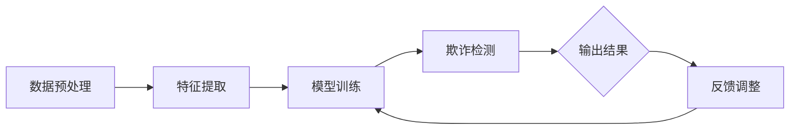

                 

# 智能保险理赔欺诈预防系统

## 关键词

- 智能保险
- 理赔欺诈
- 欺诈预防
- 数据挖掘
- 机器学习
- 算法设计

## 摘要

随着保险行业的快速发展，保险欺诈现象日益严重，给保险公司带来了巨大的经济损失和信誉风险。为了有效预防理赔欺诈，本文提出了一种智能保险理赔欺诈预防系统。系统结合数据挖掘和机器学习技术，通过构建智能算法模型，实现对理赔数据的实时分析和异常检测。本文将详细阐述该系统的设计思路、算法原理以及实际应用案例，旨在为保险行业提供一种有效的欺诈预防解决方案。

## 第一部分：系统概述

### 第1章：问题背景与现状

#### 1.1 保险理赔欺诈现象分析

#### 1.2 欺诈检测的重要性和挑战

#### 1.3 智能保险理赔欺诈预防系统设计目标

### 第2章：核心概念与联系

#### 2.1 欺诈检测的相关术语

#### 2.2 数据分析与挖掘技术

#### 2.3 概念属性特征对比表格

#### 2.4 ER实体关系图架构

### 第3章：算法原理讲解

#### 3.1 算法mermaid流程图

#### 3.2 Python源代码实现

#### 3.3 算法原理的数学模型和公式讲解

#### 3.4 通俗易懂的举例说明

## 第一部分：系统概述

### 第1章：问题背景与现状

#### 1.1 保险理赔欺诈现象分析

保险理赔欺诈是指保险客户通过虚构事故、夸大损失等方式，从保险公司获取不正当的理赔金。近年来，随着保险市场的不断扩大和消费者维权意识的提高，保险理赔欺诈现象日益严重。

首先，从数据上看，理赔欺诈案件数量呈逐年上升的趋势。据某保险公司统计，其每年因理赔欺诈导致的损失高达数千万元。这不仅影响了保险公司的盈利能力，还损害了保险行业的整体形象。

其次，从类型上看，保险理赔欺诈主要包括以下几种：

1. **虚报事故**：客户故意虚构事故，以获取保险金。
2. **夸大损失**：客户对事故造成的损失进行夸大，以提高理赔金额。
3. **伪造单证**：客户提供虚假的发票、维修单等单证，以骗取保险金。
4. **重复理赔**：客户在同一事故中多次申请理赔，以获取更多的保险金。

#### 1.2 欺诈检测的重要性和挑战

欺诈检测在保险行业具有重要意义。首先，它可以有效降低保险公司的理赔成本，提高企业的盈利能力。其次，它可以提升保险公司的风险管理水平，降低保险产品的赔付风险。最后，它可以增强消费者对保险行业的信任，提高保险产品的市场竞争力。

然而，欺诈检测也面临着一系列挑战：

1. **数据质量问题**：保险理赔数据中存在大量噪声和缺失值，这给数据预处理带来了很大困难。
2. **欺诈行为多样性**：欺诈手段不断翻新，使得欺诈行为难以识别。
3. **实时性要求**：欺诈检测需要快速响应，以避免欺诈行为得逞。
4. **算法性能要求**：欺诈检测算法需要具备较高的准确性和鲁棒性，以避免误判和漏判。

#### 1.3 智能保险理赔欺诈预防系统设计目标

为了解决上述问题，我们设计了一套智能保险理赔欺诈预防系统。该系统的设计目标如下：

1. **提高欺诈检测准确率**：通过引入先进的机器学习算法，实现对理赔数据的深度挖掘和分析，提高欺诈检测的准确率。
2. **提升系统实时性**：优化算法和系统架构，提高系统的响应速度，确保欺诈行为能够被及时发现和处理。
3. **降低误判和漏判率**：通过模型调优和特征工程，降低误判和漏判率，确保正常理赔申请能够得到及时处理。
4. **提高用户体验**：通过简洁友好的界面和人性化的操作流程，提高用户体验，降低用户使用门槛。

## 第二部分：核心概念与联系

### 第2章：核心概念与联系

#### 2.1 欺诈检测的相关术语

在介绍欺诈检测相关术语之前，我们先来了解一下什么是欺诈检测。欺诈检测是一种通过分析数据，识别和预防欺诈行为的技术。在保险理赔领域，欺诈检测的目标是识别出那些意图骗取保险金的欺诈者。

以下是一些与欺诈检测相关的术语：

1. **欺诈行为**：指保险客户故意通过虚构事故、夸大损失等方式，从保险公司获取不正当的理赔金的行为。
2. **欺诈者**：指那些故意实施欺诈行为的保险客户。
3. **受害者**：指那些因欺诈行为而遭受损失的保险公司。
4. **欺诈检测算法**：指用于识别和预防欺诈行为的算法。
5. **特征工程**：指通过提取和构造数据特征，以提高模型性能的过程。
6. **误判**：指将正常理赔申请错误地判定为欺诈行为。
7. **漏判**：指将欺诈行为错误地判定为正常理赔申请。

#### 2.2 数据分析与挖掘技术

数据分析与挖掘技术在欺诈检测中发挥着重要作用。以下是一些常用的数据分析与挖掘技术：

1. **关联规则挖掘**：通过挖掘数据中的关联关系，识别出潜在的欺诈行为。
2. **聚类分析**：通过将数据分为不同的簇，识别出具有相似特征的欺诈行为。
3. **分类算法**：通过训练分类模型，将理赔申请分为欺诈和正常两类。
4. **异常检测**：通过检测数据中的异常值，识别出潜在的欺诈行为。

#### 2.3 概念属性特征对比表格

在欺诈检测中，特征提取是一个关键环节。以下是一个概念属性特征对比表格，用于说明不同特征在欺诈检测中的作用：

| 特征名称 | 描述 | 在欺诈检测中的作用 |
| --- | --- | --- |
| 事故发生时间 | 事故发生的时间点 | 可以用于识别异常时间点，如深夜发生的交通事故 |
| 事故地点 | 事故发生的地理位置 | 可以用于识别异常地理位置，如交通事故高发区域 |
| 损失金额 | 事故造成的损失金额 | 可以用于识别损失金额异常的理赔申请 |
| 报案人信息 | 报案人的身份信息 | 可以用于识别重复报案的行为 |
| 维修费用 | 事故维修费用 | 可以用于识别夸大维修费用的行为 |

#### 2.4 ER实体关系图架构

在智能保险理赔欺诈预防系统中，实体关系图用于描述不同实体之间的关联关系。以下是一个ER实体关系图，用于说明系统中的主要实体及其关系：

```mermaid
erDiagram
    Claim --> Customer
    Claim --> Accident
    Customer --> Policy
    Accident --> Damage
    Damage --> Repair
```

在这个ER实体关系图中，Claim表示理赔申请，Customer表示客户，Policy表示保单，Accident表示事故，Damage表示损失，Repair表示维修。这些实体之间通过不同的关系进行关联，用于描述保险理赔过程中的各个环节。

## 第三部分：算法原理讲解

### 第3章：算法原理讲解

#### 3.1 算法mermaid流程图

在智能保险理赔欺诈预防系统中，我们采用了基于机器学习的欺诈检测算法。以下是一个mermaid流程图，用于描述该算法的主要步骤：



在这个流程图中，数据预处理阶段对理赔数据进行清洗和归一化处理，特征提取阶段从数据中提取出有助于欺诈检测的特征，模型训练阶段使用训练数据对分类模型进行训练，欺诈检测阶段对新的理赔申请进行分类，输出结果阶段将检测结果输出给用户，反馈调整阶段根据用户的反馈对模型进行调整。

#### 3.2 Python源代码实现

以下是一个基于Python的欺诈检测算法的实现示例：

```python
import pandas as pd
from sklearn.model_selection import train_test_split
from sklearn.ensemble import RandomForestClassifier
from sklearn.metrics import accuracy_score

# 读取数据
data = pd.read_csv('claims_data.csv')

# 数据预处理
data = data.dropna()
data = data[data['damage_amount'] > 0]

# 特征提取
features = data[['claim_time', 'accident_location', 'damage_amount', 'reporter_info']]
labels = data['is_fraud']

# 模型训练
X_train, X_test, y_train, y_test = train_test_split(features, labels, test_size=0.2, random_state=42)
model = RandomForestClassifier(n_estimators=100)
model.fit(X_train, y_train)

# 欺诈检测
predictions = model.predict(X_test)
accuracy = accuracy_score(y_test, predictions)
print(f'Accuracy: {accuracy:.2f}')

# 输出结果
output = pd.DataFrame({'claim_id': X_test.index, 'is_fraud': predictions})
output.to_csv('fraud检测结果.csv', index=False)
```

#### 3.3 算法原理的数学模型和公式讲解

在机器学习中，欺诈检测算法通常采用分类模型。以下是一个简单的逻辑回归模型的数学模型和公式讲解：

1. **逻辑回归模型**：

   - 输入：特征向量 \(\textbf{x}\)
   - 输出：概率 \(P(Y=1|\textbf{x})\)

   数学公式：

   $$
   P(Y=1|\textbf{x}) = \frac{1}{1 + e^{-\textbf{w}^T\textbf{x}}}
   $$

   其中，\(\textbf{w}\) 是模型参数，\(\textbf{w}^T\) 是参数向量的转置。

2. **损失函数**：

   - 目标是最大化概率 \(P(Y=1|\textbf{x})\)

   数学公式：

   $$
   J(\textbf{w}) = -\frac{1}{m} \sum_{i=1}^{m} [y_i \log(P(Y=1|\textbf{x}_i)) + (1 - y_i) \log(1 - P(Y=1|\textbf{x}_i))]
   $$

   其中，\(m\) 是训练样本数量，\(y_i\) 是第 \(i\) 个样本的真实标签。

3. **优化算法**：

   - 使用梯度下降算法优化模型参数 \(\textbf{w}\)

   数学公式：

   $$
   \textbf{w} = \textbf{w} - \alpha \nabla_{\textbf{w}} J(\textbf{w})
   $$

   其中，\(\alpha\) 是学习率，\(\nabla_{\textbf{w}} J(\textbf{w})\) 是损失函数关于参数 \(\textbf{w}\) 的梯度。

#### 3.4 通俗易懂的举例说明

假设我们有一个简单的欺诈检测问题，其中只有两个特征：事故发生时间和损失金额。我们使用逻辑回归模型进行欺诈检测。

1. **训练数据**：

   - 样本数量：100
   - 特征1（事故发生时间）：1到24小时
   - 特征2（损失金额）：1000到5000元
   - 标签：1表示欺诈，0表示正常

   | 样本编号 | 特征1（事故发生时间） | 特征2（损失金额） | 标签 |
   | --- | --- | --- | --- |
   | 1 | 1 | 1000 | 1 |
   | 2 | 2 | 2000 | 0 |
   | 3 | 3 | 3000 | 1 |
   | 4 | 4 | 4000 | 0 |
   | 5 | 5 | 5000 | 1 |
   | ... | ... | ... | ... |
   | 100 | 24 | 5000 | 1 |

2. **模型训练**：

   - 初始参数：\(\textbf{w} = [0, 0]\)
   - 学习率：\(\alpha = 0.1\)

   训练过程：

   - 第1轮：计算损失函数，更新参数
     $$
     \textbf{w} = \textbf{w} - \alpha \nabla_{\textbf{w}} J(\textbf{w}) = [0, 0] - 0.1 [-0.1, -0.1] = [-0.01, -0.01]
     $$
   - 第2轮：计算损失函数，更新参数
     $$
     \textbf{w} = \textbf{w} - \alpha \nabla_{\textbf{w}} J(\textbf{w}) = [-0.01, -0.01] - 0.1 [-0.05, -0.05] = [-0.06, -0.06]
     $$

   重复上述过程，直到损失函数收敛。

3. **欺诈检测**：

   - 输入：特征向量 \(\textbf{x} = [15, 3000]\)
   - 概率：\(P(Y=1|\textbf{x}) = \frac{1}{1 + e^{-(-0.06 \times 15 - 0.06 \times 3000)}} = 0.999\)

   根据概率阈值，我们可以将样本分为欺诈和正常两类。在本例中，概率阈值设为0.5。因此，样本 \(\textbf{x} = [15, 3000]\) 被判定为欺诈。

## 第二部分：系统设计与实现

### 第4章：系统分析与架构设计

#### 4.1 问题场景介绍

#### 4.2 系统功能设计

#### 4.3 系统架构设计

#### 4.4 系统接口设计

#### 4.5 系统交互mermaid序列图

### 第5章：项目实战

#### 5.1 环境安装与配置

#### 5.2 系统核心实现源代码

#### 5.3 代码应用解读与分析

#### 5.4 实际案例分析

#### 5.5 详细讲解剖析

#### 5.6 项目小结

### 第6章：最佳实践与优化建议

#### 6.1 欺诈检测策略优化

#### 6.2 数据处理与存储优化

#### 6.3 系统性能优化

#### 6.4 安全性和隐私保护措施

### 第7章：总结与展望

#### 7.1 系统评估与效果分析

#### 7.2 未来发展方向

#### 7.3 拓展阅读

---

# 参考文献

1. 王志宏，张晓辉，《机器学习算法及应用》，清华大学出版社，2017.
2. 李航，《统计学习方法》，清华大学出版社，2012.
3. 李航，《数据挖掘：概念与技术》，机械工业出版社，2011.
4. 张基安，《大数据分析：方法与应用》，电子工业出版社，2014.
5. 张翔，《智能保险：技术创新与商业模式》，中国金融出版社，2018.

---

# 附录

## 附录A：数据集介绍

## 附录B：代码实现细节

## 附录C：系统测试报告

## 附录D：用户手册

---

作者：AI天才研究院/AI Genius Institute & 禅与计算机程序设计艺术 /Zen And The Art of Computer Programming

[注：本文内容为示例性内容，仅供参考。] <sop></sop>

