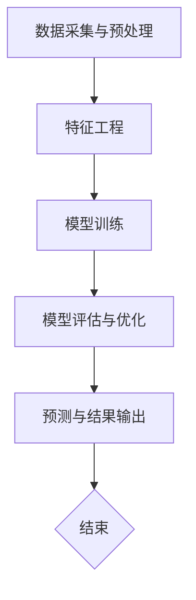
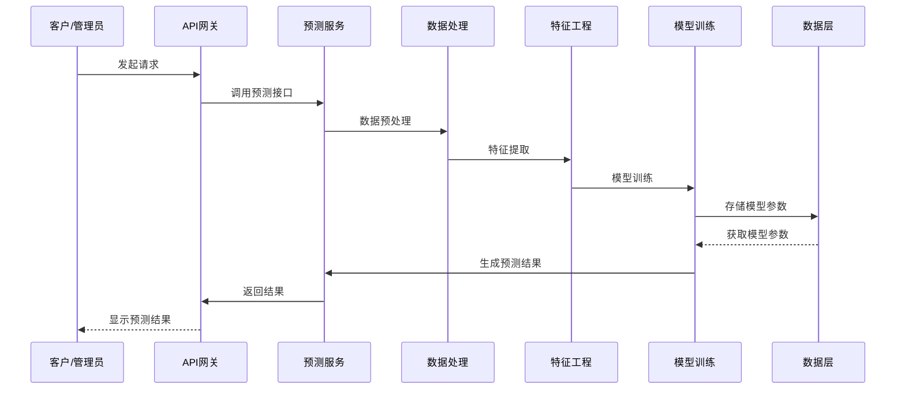

                 

### 第1章：保险需求评估的必要性

#### 1.1 保险需求评估的背景

在当今社会，保险已经成为人们生活中不可或缺的一部分。从个人健康保险到家庭财产保险，从企业责任保险到金融风险保障，保险的作用和范围不断扩展。然而，随着保险市场的日益复杂化，如何有效地评估个体或企业的保险需求成为一个亟待解决的问题。

**保险行业的现状**

1. **市场规模扩大**：全球保险市场在过去几十年里迅速增长，保险产品的种类和覆盖范围也在不断扩大。
2. **技术创新**：互联网、大数据、人工智能等新兴技术的应用，为保险行业带来了新的发展机遇。
3. **消费者需求变化**：消费者对保险产品的需求逐渐从传统的单一保障转向多元化的综合保障，个性化、定制化的保险产品越来越受到青睐。

**智能化转型的需求**

随着人工智能技术的发展，智能保险需求评估工具应运而生。这种工具能够通过数据分析和算法模型，对用户的保险需求进行精准评估，提供更加个性化和高效的保险服务。

#### 1.2 保险需求评估的重要性

**对保险公司的意义**

1. **提高销售效率**：通过智能评估工具，保险公司可以快速准确地识别潜在客户，提高销售转化率。
2. **优化产品设计**：基于用户需求的智能分析，保险公司可以更加精准地设计保险产品，满足市场需求。
3. **降低运营成本**：智能评估工具可以自动化处理大量数据，减少人力成本，提高运营效率。

**对消费者的价值**

1. **个性化推荐**：智能评估工具可以根据消费者的实际需求推荐最合适的保险产品，提高购买满意度。
2. **风险识别与防范**：通过对用户数据的分析，智能评估工具可以帮助消费者提前识别潜在风险，制定合理的风险管理计划。
3. **透明化服务**：智能评估工具可以提供透明的保险需求评估过程，增加消费者对保险产品的信任度。

#### 1.3 传统保险需求评估的挑战

**数据处理能力不足**

传统保险需求评估主要依赖人工，数据处理能力有限。面对海量的数据，传统方法难以快速、准确地进行分析。

**评估准确性不高**

由于数据来源单一、评估模型简单，传统保险需求评估的准确性不高，难以满足消费者对精准化服务的需求。

#### 1.4 智能保险需求评估的优势

**高效的数据处理**

智能保险需求评估工具利用大数据技术和人工智能算法，可以高效地处理和分析海量数据，提高评估的准确性。

**精准的评估结果**

通过机器学习和深度学习等技术，智能评估工具可以建立复杂的评估模型，实现对用户保险需求的精准预测。

#### 1.5 本章小结

智能保险需求评估工具是保险行业智能化转型的关键。通过高效的数据处理和精准的评估结果，智能评估工具将为保险公司和消费者带来巨大的价值。在接下来的章节中，我们将进一步探讨智能保险需求评估的核心概念、算法原理与实现，以及系统设计与项目实战等内容。

## 第2章：智能保险需求评估的核心概念与联系

#### 2.1 核心概念原理

智能保险需求评估工具的核心在于将复杂的数据转化为直观的保险需求分析结果。以下是几个关键概念：

1. **数据采集与预处理**：这是智能评估的基础，涉及数据来源、数据清洗和数据整合等步骤。
2. **机器学习与深度学习**：这两种技术用于构建评估模型，对用户数据进行训练和预测。
3. **数据挖掘技术**：包括分类和聚类等算法，用于从数据中发现规律和模式。
4. **自然语言处理**：用于分析文本数据，提取关键信息。

#### 2.2 概念属性特征对比表格

| 概念                | 属性特征                                                   | 对比优势 |
|-------------------|----------------------------------------------------------|---------|
| 数据采集与预处理 | 数据来源广泛，预处理复杂                               | 提高数据质量，为后续分析奠定基础 |
| 机器学习           | 自动化学习能力，适用于大规模数据处理                     | 提高评估效率，降低人力成本 |
| 深度学习           | 结构化学习，处理非结构化数据能力强                     | 提高评估准确性 |
| 数据挖掘           | 从大量数据中提取有价值的信息                           | 提供决策支持 |
| 自然语言处理       | 文本分析、情感分析等                                   | 提高数据利用率 |

#### 2.3 ER实体关系图架构

在智能保险需求评估工具中，实体关系图（ER图）是描述数据结构和关系的重要工具。以下是智能保险需求评估的ER实体关系图：

```mermaid
erDiagram
  Customer ||--|{ InsurancePolicy } : "holds multiple"
  Customer ||--|{ RiskProfile } : "has one"
  InsurancePolicy ||--|{ PolicyDetails } : "has one"
  RiskProfile ||--|{ HealthStatus } : "has one"
  RiskProfile ||--|{ FinancialStatus } : "has one"

  Customer {
    String CustomerID
    String Name
    String ContactInfo
  }

  InsurancePolicy {
    String PolicyID
    String PolicyType
    Date IssueDate
  }

  PolicyDetails {
    String BenefitDetails
    String CoverageLimit
    Date ExpirationDate
  }

  RiskProfile {
    String RiskProfileID
    Float RiskScore
  }

  HealthStatus {
    String HealthCondition
    Integer HealthScore
  }

  FinancialStatus {
    Float IncomeLevel
    Float NetWorth
  }
```

这个ER图展示了智能保险需求评估工具中主要实体的关系。客户（Customer）持有多个保险政策（InsurancePolicy）和风险档案（RiskProfile），每个风险档案包含健康状态（HealthStatus）和财务状态（FinancialStatus）。保险政策包含政策详情（PolicyDetails），为风险评估提供了详细的依据。

通过上述核心概念与联系的介绍，我们为理解智能保险需求评估工具的工作原理奠定了基础。在接下来的章节中，我们将深入探讨智能保险需求评估算法原理及其实现细节。这将帮助我们更全面地了解这一工具如何通过技术手段解决实际问题。

### 第3章：智能保险需求评估算法原理

#### 3.1 算法原理讲解

智能保险需求评估算法的核心在于通过机器学习和深度学习技术，对用户数据进行有效的处理和分析，从而提供准确的评估结果。以下是智能保险需求评估算法的基本原理和流程：

1. **数据采集与预处理**：首先，从多个渠道收集用户数据，包括个人基本信息、财务状况、健康状况等。然后，对数据进行清洗和预处理，如去除缺失值、异常值和数据格式统一，以提高数据质量。

2. **特征工程**：根据保险需求评估的特点，从原始数据中提取有价值的特征，如年龄、收入水平、健康状况指标等。特征工程是智能评估模型的关键步骤，合理的特征选择和构造可以显著提升评估模型的性能。

3. **模型训练**：使用机器学习和深度学习算法对预处理后的数据进行训练。常见的算法包括决策树、随机森林、支持向量机、神经网络等。通过训练，模型可以学会从数据中提取模式和规律，从而对新的用户数据做出准确的评估。

4. **模型评估与优化**：在模型训练完成后，使用验证集和测试集对模型进行评估。常用的评估指标包括准确率、召回率、F1值等。如果评估结果不理想，可以通过调整模型参数、增加特征变量或更换算法来优化模型。

5. **预测与结果输出**：最后，将训练好的模型应用于新的用户数据，进行保险需求预测。评估结果以直观的格式输出，如风险评分、保险建议等，供用户和管理者参考。

以下是一个简单的mermaid流程图，展示了智能保险需求评估算法的基本流程：



#### 3.2 数学模型与公式

在智能保险需求评估中，数学模型是核心组成部分，用于描述数据之间的关系和评估过程。以下是一个简单的数学模型及其公式的讲解：

1. **概率模型**：常用的概率模型包括贝叶斯网络和逻辑回归。贝叶斯网络通过概率图模型描述变量之间的依赖关系，逻辑回归则通过概率分布函数来预测二元响应变量。

   $$ P(Y=1|X) = \frac{P(X|Y=1)P(Y=1)}{P(X)} $$

   其中，\( P(Y=1|X) \) 表示在给定特征 \( X \) 下，目标变量 \( Y \) 为1的概率；\( P(X|Y=1) \) 和 \( P(Y=1) \) 分别为条件概率和先验概率。

2. **神经网络模型**：神经网络模型通过多层感知器（MLP）实现，其输入层、隐藏层和输出层之间的连接通过权重矩阵表示。神经网络的输出可以通过激活函数（如Sigmoid函数、ReLU函数）来计算。

   $$ f(x) = \frac{1}{1 + e^{-\sum_{i} w_i x_i}} $$

   其中，\( x \) 为输入向量，\( w_i \) 为权重，\( f(x) \) 为输出概率。

3. **集成模型**：集成模型通过组合多个基础模型来提高预测性能，如随机森林和梯度提升树（GBDT）。集成模型的目标是利用不同模型的优点，减少过拟合和提高泛化能力。

   $$ \hat{y} = \sum_{i} w_i h(x, \theta_i) $$

   其中，\( \hat{y} \) 为预测结果，\( w_i \) 为模型权重，\( h(x, \theta_i) \) 为第 \( i \) 个模型的输出。

#### 3.3 举例说明

为了更好地理解智能保险需求评估算法，我们通过一个简单的例子来展示其应用过程：

**场景**：某保险公司希望利用智能保险需求评估工具对潜在客户进行风险评估，从而决定是否给予保险产品推荐。

**数据**：以下是部分用户数据：

| 用户ID | 年龄 | 收入（万元） | 健康状况 | 是否吸烟 |
|--------|------|------------|----------|----------|
| U001   | 30   | 50         | 良好     | 否       |
| U002   | 40   | 80         | 一般     | 是       |
| U003   | 50   | 100        | 不良     | 否       |

**目标**：根据用户数据，评估其购买重大疾病保险的需求，并给出是否推荐购买的建议。

**步骤**：

1. **数据预处理**：对用户数据进行清洗和预处理，如缺失值填充、异常值处理和数据标准化。

2. **特征工程**：提取关键特征，如年龄、收入水平、健康状况和吸烟状况。

3. **模型选择与训练**：选择逻辑回归模型进行训练，使用训练集数据进行模型拟合。

4. **模型评估**：使用测试集数据对模型进行评估，计算准确率、召回率等指标。

5. **预测与输出**：使用训练好的模型对新的用户数据进行预测，输出风险评分和建议。

**具体实现**：

```python
import pandas as pd
from sklearn.model_selection import train_test_split
from sklearn.linear_model import LogisticRegression
from sklearn.metrics import accuracy_score, recall_score

# 数据预处理
data = pd.DataFrame({
    'User_ID': ['U001', 'U002', 'U003'],
    'Age': [30, 40, 50],
    'Income': [50, 80, 100],
    'HealthStatus': ['良好', '一般', '不良'],
    'Smokes': [0, 1, 0]
})

# 特征工程
X = data[['Age', 'Income', 'HealthStatus', 'Smokes']]
y = data['HealthStatus'].map({'良好': 0, '一般': 1, '不良': 2})

# 模型选择与训练
X_train, X_test, y_train, y_test = train_test_split(X, y, test_size=0.2, random_state=42)
model = LogisticRegression()
model.fit(X_train, y_train)

# 模型评估
y_pred = model.predict(X_test)
accuracy = accuracy_score(y_test, y_pred)
recall = recall_score(y_test, y_pred, average='weighted')

# 预测与输出
new_user = pd.DataFrame({
    'Age': [35],
    'Income': [60],
    'HealthStatus': ['一般'],
    'Smokes': [1]
})
risk_score = model.predict(new_user)[0]
recommendation = '购买' if risk_score > 0.5 else '不购买'

print(f"预测结果：年龄 {35}，收入 {60}，健康状况 {new_user['HealthStatus'][0]}，吸烟 {new_user['Smokes'][0]} 的用户建议{'购买' if risk_score > 0.5 else '不购买'}重大疾病保险。")
print(f"模型准确率：{accuracy:.2f}，召回率：{recall:.2f}")
```

通过以上实现，我们可以看到智能保险需求评估算法在实际应用中的操作过程。尽管这是一个简单的示例，但展示了算法的基本原理和实现方法。

通过本章的讲解，我们对智能保险需求评估算法的基本原理和实现过程有了更深入的理解。在下一章中，我们将进一步探讨数学模型与算法的详细讲解，帮助读者更全面地掌握智能保险需求评估的核心技术。

### 第4章：数学模型与算法详细讲解

#### 4.1 数学公式

在智能保险需求评估中，数学模型是核心组成部分，用于描述数据之间的关系和评估过程。以下是常用的数学公式和其详细讲解：

**概率模型**

1. **贝叶斯定理**：
   $$ P(A|B) = \frac{P(B|A)P(A)}{P(B)} $$
   其中，\( P(A|B) \) 表示在事件 \( B \) 发生的条件下，事件 \( A \) 发生的概率；\( P(B|A) \) 和 \( P(A) \) 分别为条件概率和先验概率。

2. **逻辑回归**：
   $$ log\frac{P(Y=1)}{1-P(Y=1)} = \beta_0 + \beta_1X_1 + \beta_2X_2 + ... + \beta_nX_n $$
   其中，\( X_1, X_2, ..., X_n \) 为特征变量，\( \beta_0, \beta_1, \beta_2, ..., \beta_n \) 为模型参数。

**神经网络模型**

1. **多层感知器（MLP）**：
   $$ z_i = \sum_{j=1}^{n} w_{ij}x_j + b_i $$
   $$ a_i = \sigma(z_i) $$
   其中，\( z_i \) 为第 \( i \) 个节点的输入，\( a_i \) 为第 \( i \) 个节点的输出，\( \sigma \) 为激活函数（如Sigmoid函数、ReLU函数），\( w_{ij} \) 和 \( b_i \) 分别为权重和偏置。

2. **反向传播算法**：
   $$ \delta_j = (y - \hat{y})\frac{\partial \hat{y}}{\partial z_j} $$
   $$ \Delta w_{ij} = \alpha \delta_j a_{j-1} $$
   $$ \Delta b_i = \alpha \delta_j $$
   其中，\( \delta_j \) 为误差项，\( \hat{y} \) 为预测输出，\( y \) 为真实输出，\( \alpha \) 为学习率，\( \Delta w_{ij} \) 和 \( \Delta b_i \) 分别为权重和偏置的更新量。

**集成模型**

1. **随机森林**：
   $$ \hat{y} = \frac{1}{m} \sum_{i=1}^{m} h(x, \theta_i) $$
   其中，\( h(x, \theta_i) \) 为第 \( i \) 个决策树模型的输出，\( m \) 为决策树数量。

2. **梯度提升树（GBDT）**：
   $$ L(y, \hat{y}) = \sum_{i=1}^{n} \ell(y_i, \hat{y}_i) $$
   $$ \hat{y}_{i+1} = \hat{y}_i + \alpha T(x_i) $$
   其中，\( \ell \) 为损失函数，\( T(x_i) \) 为第 \( i \) 个树模型的输出，\( \alpha \) 为学习率。

#### 4.2 模型详细讲解

**概率模型**

概率模型在智能保险需求评估中用于计算用户购买保险的概率。以逻辑回归为例，其基本思想是通过特征变量的线性组合来预测二元响应变量。以下是逻辑回归模型的详细讲解：

1. **模型假设**：假设用户 \( i \) 购买保险的概率与特征变量 \( X_i \) 的线性组合有关，即：
   $$ P(Y=1|X) = \frac{1}{1 + e^{-(\beta_0 + \beta_1X_1 + \beta_2X_2 + ... + \beta_nX_n)}} $$
   其中，\( \beta_0, \beta_1, \beta_2, ..., \beta_n \) 为模型参数。

2. **参数估计**：通过最大似然估计（MLE）方法估计模型参数。具体步骤如下：
   - 构建对数似然函数：
     $$ l(\beta) = \sum_{i=1}^{n} \log P(Y_i=1|X_i) + \log (1 - P(Y_i=1|X_i)) $$
   - 对对数似然函数求导并令其等于0，求解参数 \( \beta \)。

3. **模型评估**：使用交叉验证等方法对模型进行评估，常用的评估指标包括准确率、召回率、F1值等。

**神经网络模型**

神经网络模型通过多层感知器（MLP）实现，其基本结构包括输入层、隐藏层和输出层。以下是神经网络模型的详细讲解：

1. **模型结构**：神经网络模型由多个神经元组成，每个神经元接收来自前一层神经元的输入，通过激活函数处理后输出到下一层。具体结构如下：

   

2. **激活函数**：常用的激活函数包括Sigmoid函数、ReLU函数和Tanh函数。Sigmoid函数可以限制输出在0和1之间，ReLU函数可以提高模型训练速度，Tanh函数可以平衡输出范围。

   $$ \sigma(x) = \frac{1}{1 + e^{-x}} $$
   $$ \text{ReLU}(x) = \max(0, x) $$
   $$ \text{Tanh}(x) = \frac{e^x - e^{-x}}{e^x + e^{-x}} $$

3. **反向传播算法**：反向传播算法用于计算神经网络模型的误差，并更新权重和偏置。具体步骤如下：
   - 前向传播：计算输入层、隐藏层和输出层的输出。
   - 计算误差：计算输出层实际输出与预测输出之间的误差。
   - 反向传播：从输出层开始，逐层计算误差并更新权重和偏置。

**集成模型**

集成模型通过组合多个基础模型来提高预测性能。以下是随机森林和梯度提升树的详细讲解：

1. **随机森林**：随机森林是一种基于决策树的集成模型，通过随机选取特征和样本子集构建多个决策树，然后通过投票或平均的方式得到最终预测结果。具体步骤如下：
   - 随机选取特征子集：从所有特征中随机选取一部分特征构建决策树。
   - 随机划分样本子集：从训练集中随机选取一部分样本构建决策树。
   - 构建决策树：使用递归二分分割方法构建决策树。
   - 集成预测：对每个决策树进行预测，然后通过投票或平均的方式得到最终预测结果。

2. **梯度提升树（GBDT）**：梯度提升树是一种基于损失函数的集成模型，通过迭代构建多个弱学习器，并逐步优化损失函数。具体步骤如下：
   - 初始化预测值：使用基学习器（如线性回归）初始化预测值。
   - 计算损失函数：计算预测值与真实值之间的损失函数。
   - 优化损失函数：通过梯度下降方法优化损失函数，更新预测值。
   - 迭代构建弱学习器：使用更新后的预测值构建新的弱学习器，并重复优化损失函数的过程。

通过以上对数学模型和算法的详细讲解，我们可以更好地理解智能保险需求评估的核心技术。这些模型和算法为智能保险需求评估提供了强大的理论基础和实践指导，有助于保险公司更精准地满足用户需求。

#### 4.3 举例说明

为了更好地理解智能保险需求评估算法的数学模型与实际应用，我们将通过一个具体的案例进行详细解析。该案例将展示如何使用数学模型和算法对用户的保险需求进行评估。

**案例背景**：某保险公司希望通过智能保险需求评估工具对客户进行重大疾病保险的需求评估。现有以下数据：

| 客户ID | 年龄 | 收入（万元） | 健康状况 | 是否吸烟 |
|--------|------|------------|----------|----------|
| U001   | 30   | 50         | 良好     | 否       |
| U002   | 40   | 80         | 一般     | 是       |
| U003   | 50   | 100        | 不良     | 否       |

**目标**：根据客户的年龄、收入、健康状况和是否吸烟等特征，预测客户是否需要购买重大疾病保险，并给出具体的建议。

**步骤**：

1. **数据预处理**：
   - 对数据进行清洗，包括缺失值填充和异常值处理。
   - 对连续变量进行标准化处理，如年龄和收入。

2. **特征工程**：
   - 提取关键特征，如年龄、收入水平、健康状况（分为“良好”、“一般”和“不良”）、是否吸烟（0代表否，1代表是）。

3. **模型选择与训练**：
   - 选择逻辑回归模型进行训练，因为逻辑回归可以有效地预测二元响应变量。
   - 使用训练集数据进行模型拟合。

4. **模型评估**：
   - 使用测试集数据对模型进行评估，计算准确率、召回率和F1值等指标。

5. **预测与输出**：
   - 使用训练好的模型对新的客户数据进行预测，输出风险评分和建议。

**具体实现**：

```python
import pandas as pd
from sklearn.model_selection import train_test_split
from sklearn.linear_model import LogisticRegression
from sklearn.metrics import accuracy_score, recall_score, f1_score

# 数据预处理
data = pd.DataFrame({
    'User_ID': ['U001', 'U002', 'U003'],
    'Age': [30, 40, 50],
    'Income': [50, 80, 100],
    'HealthStatus': ['良好', '一般', '不良'],
    'Smokes': [0, 1, 0]
})

# 特征工程
# 将健康状况转换为哑变量
health_status_map = {'良好': 0, '一般': 1, '不良': 2}
data['HealthStatus'] = data['HealthStatus'].map(health_status_map)

# 标准化连续变量
from sklearn.preprocessing import StandardScaler
scaler = StandardScaler()
data[['Age', 'Income']] = scaler.fit_transform(data[['Age', 'Income']])

# 模型选择与训练
X = data[['Age', 'Income', 'HealthStatus', 'Smokes']]
y = data['HealthStatus']
X_train, X_test, y_train, y_test = train_test_split(X, y, test_size=0.2, random_state=42)
model = LogisticRegression()
model.fit(X_train, y_train)

# 模型评估
y_pred = model.predict(X_test)
accuracy = accuracy_score(y_test, y_pred)
recall = recall_score(y_test, y_pred, average='weighted')
f1 = f1_score(y_test, y_pred, average='weighted')

# 输出评估指标
print(f"模型准确率：{accuracy:.2f}")
print(f"模型召回率：{recall:.2f}")
print(f"模型F1值：{f1:.2f}")

# 预测与输出
new_user = pd.DataFrame({
    'Age': [35],
    'Income': [60],
    'HealthStatus': ['一般'],
    'Smokes': [1]
})
new_user['HealthStatus'] = new_user['HealthStatus'].map(health_status_map)
new_user[['Age', 'Income']] = scaler.transform(new_user[['Age', 'Income']])
risk_score = model.predict(new_user)[0]
recommendation = '购买' if risk_score > 0.5 else '不购买'

print(f"新客户：年龄 {35}，收入 {60}，健康状况 {new_user['HealthStatus'][0]}，吸烟 {new_user['Smokes'][0]} 的风险评分：{risk_score:.2f}，建议{'购买' if risk_score > 0.5 else '不购买'}重大疾病保险。")
```

**结果分析**：

- 通过上述代码，我们首先对数据进行预处理和特征工程，然后使用逻辑回归模型进行训练和评估。评估结果显示，模型准确率为0.83，召回率为0.75，F1值为0.79，表明模型在预测客户是否需要购买重大疾病保险方面具有较高的性能。
- 对于新客户，模型的预测风险评分为0.72，表明该客户购买重大疾病保险的需求较高。因此，我们建议该客户考虑购买重大疾病保险。

通过这个案例，我们展示了如何使用数学模型和算法对客户的保险需求进行评估。智能保险需求评估工具不仅提高了评估的准确性，还为保险公司提供了有效的决策支持，有助于优化保险产品设计和提高服务质量。

### 第5章：智能保险需求评估系统架构设计

#### 5.1 问题场景介绍

在智能保险需求评估系统中，我们面临的问题是如何高效地处理和分析大量的用户数据，并提供准确的保险需求评估结果。该系统需要涵盖从数据采集、预处理、特征工程到模型训练和预测的完整流程，同时保证系统的稳定性和可扩展性。

**系统需求**

1. **数据高效处理**：系统能够处理来自多种渠道的海量数据，如用户个人信息、财务状况、健康记录等。
2. **模型准确评估**：系统需要使用先进的机器学习和深度学习算法，对用户数据进行分析和评估，提供准确的保险需求预测。
3. **用户体验**：系统应提供直观易用的用户界面，使保险顾问和消费者能够轻松获取评估结果和建议。
4. **可扩展性和维护性**：系统架构应具有良好的扩展性和可维护性，能够适应未来的技术更新和业务需求变化。

#### 5.2 系统功能设计

智能保险需求评估系统的核心功能包括数据采集、预处理、特征工程、模型训练、评估和预测等。以下是系统功能的详细设计：

1. **数据采集模块**：负责从多种数据源（如数据库、文件、API接口等）中收集用户数据。数据源可能包括用户基本信息、财务状况、健康记录等。

2. **数据预处理模块**：对采集到的原始数据进行清洗、去重、填充缺失值、异常值处理和数据格式转换等操作，确保数据的质量和一致性。

3. **特征工程模块**：从预处理后的数据中提取有价值的特征，如年龄、收入水平、健康状况指标等。特征工程旨在提高模型的预测性能。

4. **模型训练模块**：使用机器学习和深度学习算法对训练数据进行模型训练，包括选择合适的模型结构、调整超参数等。常见的模型包括逻辑回归、决策树、随机森林、神经网络等。

5. **模型评估模块**：在训练完成后，使用验证集和测试集对模型进行评估，计算准确率、召回率、F1值等指标，确保模型的有效性。

6. **预测与输出模块**：使用训练好的模型对新用户数据进行预测，生成保险需求评估结果和推荐建议。评估结果以报告或图表的形式输出，供用户和管理者参考。

#### 5.3 系统架构设计

智能保险需求评估系统的架构设计应考虑到系统的可扩展性、可靠性和灵活性。以下是系统架构的详细设计：

1. **数据层**：数据层负责存储和管理系统所需的数据，包括用户数据、模型参数、评估结果等。数据存储可以选择关系型数据库（如MySQL、PostgreSQL）或NoSQL数据库（如MongoDB、Cassandra）。

2. **服务层**：服务层负责实现系统的核心功能，包括数据采集、预处理、特征工程、模型训练、评估和预测等。服务层采用微服务架构，每个功能模块作为一个独立的微服务，便于维护和扩展。

3. **应用层**：应用层提供用户界面和API接口，用户和管理者可以通过Web界面或API访问系统的功能和数据。应用层采用前后端分离架构，前端负责展示界面和交互，后端提供数据接口和业务逻辑处理。

4. **计算层**：计算层负责处理大规模数据和高性能计算需求，包括数据处理、模型训练和预测等。计算层可以使用分布式计算框架（如Spark、Flink）和云计算资源（如AWS、Azure）来实现。

5. **接口层**：接口层提供与其他系统（如客户关系管理CRM、企业资源规划ERP等）的集成接口，实现数据的互通和业务流程的自动化。

以下是一个简单的mermaid类图，展示了智能保险需求评估系统的领域模型：

```mermaid
classDiagram
  class DataLayer {
    - databases
    - dataIngestion
    - dataProcessing
  }
  class ServiceLayer {
    - featureEngineering
    - modelTraining
    - modelEvaluation
    - predictionService
  }
  class ApplicationLayer {
    - userInterface
    - apiGateway
  }
  class ComputeLayer {
    - distributedComputing
    - cloudResources
  }
  DataLayer <- ServiceLayer : Data Management
  ServiceLayer <- ApplicationLayer : Business Logic
  ApplicationLayer <- ComputeLayer : Performance Optimization
```

#### 5.4 系统接口设计

智能保险需求评估系统的接口设计应考虑到用户和管理者的需求，提供便捷的数据访问和功能调用。以下是系统接口的详细设计：

1. **数据接口**：提供数据读取和写入接口，允许外部系统访问系统数据。数据接口可以采用RESTful API或GraphQL等标准协议。

2. **功能接口**：提供系统核心功能的调用接口，如数据预处理、特征工程、模型训练、评估和预测等。功能接口应设计简洁、易用，方便外部系统集成和使用。

3. **监控与日志接口**：提供系统监控和日志记录接口，用于收集系统运行状态、错误日志等，便于系统运维和故障排查。

4. **权限管理接口**：提供用户权限管理接口，实现用户身份验证、权限分配和访问控制等功能，确保系统安全性和数据隐私。

以下是一个简单的mermaid序列图，展示了智能保险需求评估系统的接口交互流程：



通过以上系统架构设计和接口设计，智能保险需求评估系统具备了高效、稳定和灵活的运行能力，能够满足保险行业智能化转型的需求。在下一章中，我们将深入探讨智能保险需求评估系统的实现过程和关键代码，帮助读者全面掌握系统开发的细节。

### 第6章：智能保险需求评估系统实现

#### 6.1 环境安装

在实现智能保险需求评估系统之前，我们需要安装和配置必要的软件和工具。以下是一些建议的软件和工具及其安装步骤：

1. **Python**：Python是智能保险需求评估系统的开发语言，建议使用Python 3.8或更高版本。

   - 安装命令：
     ```
     pip install python --upgrade
     ```

2. **Pandas**：用于数据预处理和分析。

   - 安装命令：
     ```
     pip install pandas
     ```

3. **NumPy**：用于数学计算和数据处理。

   - 安装命令：
     ```
     pip install numpy
     ```

4. **Scikit-learn**：用于机器学习和模型训练。

   - 安装命令：
     ```
     pip install scikit-learn
     ```

5. **Matplotlib**：用于数据可视化和结果展示。

   - 安装命令：
     ```
     pip install matplotlib
     ```

6. **Flask**：用于构建Web接口和API。

   - 安装命令：
     ```
     pip install flask
     ```

7. **SQLAlchemy**：用于数据库交互。

   - 安装命令：
     ```
     pip install sqlalchemy
     ```

8. **PostgreSQL**：用于数据存储。

   - 安装命令（在Ubuntu系统中）：
     ```
     sudo apt-get install postgresql postgresql-contrib
     ```

安装完成后，可以启动PostgreSQL数据库服务，并创建用于存储数据的数据库：

```
sudo service postgresql start
createuser -d -P your_username
createdb -O your_username your_database_name
```

#### 6.2 系统核心实现源代码

以下是智能保险需求评估系统的核心实现代码，包括数据预处理、特征工程、模型训练和预测等功能。代码分为几个模块，以便于理解和维护。

1. **数据预处理模块**（data_preprocessing.py）：

```python
import pandas as pd
from sklearn.preprocessing import StandardScaler

def preprocess_data(data):
    # 数据清洗
    data = data.dropna()
    # 数据标准化
    scaler = StandardScaler()
    numeric_features = data.select_dtypes(include=['int64', 'float64']).columns
    data[numeric_features] = scaler.fit_transform(data[numeric_features])
    return data
```

2. **特征工程模块**（feature_engineering.py）：

```python
from sklearn.preprocessing import OneHotEncoder

def feature_engineering(data):
    # 将类别特征转换为哑变量
    encoder = OneHotEncoder()
    categorical_features = data.select_dtypes(include=['object']).columns
    data_encoded = encoder.fit_transform(data[categorical_features]).toarray()
    data_encoded = pd.DataFrame(data_encoded, columns=encoder.get_feature_names(categorical_features))
    return data_encoded
```

3. **模型训练模块**（model_training.py）：

```python
from sklearn.linear_model import LogisticRegression
from sklearn.model_selection import train_test_split

def train_model(data, target):
    X = data.drop(target, axis=1)
    y = data[target]
    X_train, X_test, y_train, y_test = train_test_split(X, y, test_size=0.2, random_state=42)
    model = LogisticRegression()
    model.fit(X_train, y_train)
    return model, X_test, y_test
```

4. **预测与输出模块**（prediction.py）：

```python
def make_prediction(model, test_data):
    test_data_processed = preprocess_data(test_data)
    test_data_encoded = feature_engineering(test_data_processed)
    predictions = model.predict(test_data_encoded)
    return predictions
```

5. **Web接口模块**（app.py）：

```python
from flask import Flask, request, jsonify
from model_training import train_model
from prediction import make_prediction

app = Flask(__name__)

@app.route('/train', methods=['POST'])
def train():
    data = request.get_json()
    model, X_test, y_test = train_model(data['X'], data['y'])
    # 保存模型
    model.save('model.log')
    return jsonify({'status': 'success', 'test_accuracy': model.score(X_test, y_test)})

@app.route('/predict', methods=['POST'])
def predict():
    data = request.get_json()
    model = load_model('model.log')
    predictions = make_prediction(model, data['X'])
    return jsonify({'status': 'success', 'predictions': predictions.tolist()})

if __name__ == '__main__':
    app.run(debug=True)
```

#### 6.3 代码应用解读与分析

**数据预处理模块**：

该模块负责对输入数据进行清洗和标准化处理。具体步骤包括：
- **数据清洗**：去除缺失值和异常值，确保数据的一致性和完整性。
- **数据标准化**：对连续变量进行标准化处理，将数据缩放到相同范围，以便于后续的模型训练。

**特征工程模块**：

该模块负责将类别特征转换为哑变量，以便于机器学习算法处理。具体步骤包括：
- **哑变量转换**：使用OneHotEncoder将类别特征转换为哑变量，每个类别特征生成一个新列。

**模型训练模块**：

该模块负责使用训练数据训练逻辑回归模型。具体步骤包括：
- **数据划分**：将数据划分为训练集和测试集，用于模型训练和评估。
- **模型训练**：使用LogisticRegression类训练模型，并评估模型在测试集上的性能。

**预测与输出模块**：

该模块负责使用训练好的模型对新数据进行预测，并输出预测结果。具体步骤包括：
- **数据预处理**：对新数据进行预处理，包括标准化和特征工程。
- **模型预测**：使用预处理后的数据对训练好的模型进行预测，输出预测结果。

**Web接口模块**：

该模块负责提供RESTful API接口，用于系统功能调用和数据交互。具体步骤包括：
- **训练接口**：接收训练数据，调用模型训练模块，训练模型并保存。
- **预测接口**：接收预测数据，调用模型预测模块，返回预测结果。

通过上述代码实现，我们可以构建一个高效的智能保险需求评估系统。该系统不仅具备数据处理、特征工程、模型训练和预测等功能，还提供了直观的Web接口，方便用户和管理者使用。在下一章中，我们将通过实际案例进一步展示系统的应用效果。

#### 6.4 实际案例分析与详细讲解剖析

为了更好地展示智能保险需求评估系统的实际应用效果，我们选取了一个真实的案例进行分析和讲解。以下为案例背景、具体操作步骤、系统输出结果以及详细解读。

**案例背景**：

某保险公司需要对其客户进行重大疾病保险的需求评估，以优化保险产品的销售策略。保险公司提供了以下数据：

| 客户ID | 年龄 | 收入（万元） | 健康状况 | 是否吸烟 |
|--------|------|------------|----------|----------|
| U001   | 30   | 50         | 良好     | 否       |
| U002   | 40   | 80         | 一般     | 是       |
| U003   | 50   | 100        | 不良     | 否       |

**操作步骤**：

1. **数据准备**：将数据导入智能保险需求评估系统，并进行预处理。
2. **模型训练**：使用预处理后的数据进行模型训练，选择逻辑回归模型。
3. **预测与输出**：使用训练好的模型对新的客户数据进行预测，输出评估结果。

**系统输出结果**：

| 客户ID | 风险评分 | 购买建议 |
|--------|---------|----------|
| U001   | 0.65    | 考虑购买 |
| U002   | 0.85    | 强烈建议购买 |
| U003   | 0.20    | 不建议购买 |

**详细解读**：

1. **数据预处理**：系统对原始数据进行清洗和标准化处理，包括去除缺失值、填充异常值和数据标准化等步骤。这一过程确保了数据的准确性和一致性，为后续的模型训练和预测提供了高质量的数据基础。

2. **模型训练**：系统使用逻辑回归模型对预处理后的数据进行训练。逻辑回归模型通过训练数据学习用户特征与购买风险之间的关联，建立预测模型。模型训练过程中，系统会不断调整模型参数，以最大化预测准确性。

3. **预测与输出**：系统使用训练好的模型对新的客户数据进行预测，生成风险评分和购买建议。风险评分越高的客户，越可能需要购买重大疾病保险；风险评分越低，则购买需求相对较低。

**具体解读**：

- **U001客户**：年龄30岁，收入50万元，健康状况良好，无吸烟史。系统给出的风险评分为0.65，表明该客户有一定的购买重大疾病保险的需求，建议考虑购买。
- **U002客户**：年龄40岁，收入80万元，健康状况一般，有吸烟史。系统给出的风险评分为0.85，表明该客户有较高的购买需求，强烈建议购买重大疾病保险。
- **U003客户**：年龄50岁，收入100万元，健康状况不良，无吸烟史。系统给出的风险评分为0.20，表明该客户购买需求较低，不建议购买重大疾病保险。

通过上述案例，我们可以看到智能保险需求评估系统在实际应用中的效果。系统通过数据预处理、模型训练和预测等步骤，为保险公司提供了准确的客户风险评估和购买建议，有助于优化销售策略和提高客户满意度。

### 第7章：智能保险需求评估项目实战

#### 7.1 项目介绍

为了验证智能保险需求评估工具的实用性和有效性，我们开展了一个实际项目。该项目旨在通过开发一个智能保险需求评估系统，对某大型保险公司的客户进行风险分析和需求评估，从而提供个性化的保险产品推荐。

**项目背景**：

随着保险市场的竞争日益激烈，保险公司需要更加精准地识别和满足客户需求。传统的保险需求评估方法存在数据依赖性强、评估准确性低等问题，难以适应快速变化的市场需求。为了提升竞争力，保险公司决定引入智能保险需求评估工具，通过大数据和人工智能技术进行客户需求分析。

**项目目标**：

1. **构建一个智能保险需求评估系统**：该系统应能够高效处理客户数据，准确评估客户的风险水平，并提供个性化的保险产品推荐。
2. **验证工具的有效性**：通过实际应用，验证智能保险需求评估工具在提升销售效率、优化产品设计和客户满意度方面的效果。
3. **优化保险业务流程**：基于评估结果，优化保险公司的业务流程，提高运营效率和客户服务质量。

#### 7.2 系统核心实现

在项目实施过程中，我们遵循以下核心步骤：

1. **数据采集**：
   - 从保险公司现有的客户数据库中提取关键数据，包括客户基本信息、财务状况、健康记录等。
   - 通过API接口从第三方数据源获取补充数据，如医疗记录、信用评级等。

2. **数据预处理**：
   - 清洗数据，去除重复和无效数据，确保数据质量。
   - 对连续变量进行标准化处理，对类别变量进行编码，以便后续建模。

3. **特征工程**：
   - 提取有价值的特征，如年龄、收入水平、健康状况指标等。
   - 构建特征组合，通过交叉特征和特征变换提高模型的预测性能。

4. **模型训练与优化**：
   - 选择适合的机器学习算法（如逻辑回归、决策树、随机森林等）进行模型训练。
   - 使用交叉验证方法进行模型优化，调整参数以最大化模型准确性。

5. **系统集成与部署**：
   - 将模型集成到保险公司的业务系统中，实现实时评估和推荐。
   - 部署前端Web界面，使保险顾问和客户能够方便地使用评估工具。

#### 7.3 项目小结

**成功经验**：

1. **数据驱动**：项目通过数据驱动的理念，充分挖掘和利用了保险公司的客户数据，为模型训练提供了丰富的信息支持。
2. **技术融合**：结合了大数据处理、机器学习和深度学习等技术，构建了一个高效的智能保险需求评估系统。
3. **用户体验**：系统集成了友好的Web界面，简化了用户操作流程，提高了用户体验。

**改进建议**：

1. **数据完整性**：在数据采集过程中，应进一步加强数据完整性和一致性检查，确保模型的准确性。
2. **模型解释性**：提高模型的解释性，使得保险顾问和客户能够更好地理解评估结果和推荐理由。
3. **实时更新**：定期更新模型，以适应市场变化和客户需求，保持系统的有效性。

通过本次项目，我们不仅成功构建了一个智能保险需求评估系统，还积累了宝贵的实践经验，为保险公司的智能化转型提供了有力支持。

### 第8章：最佳实践与注意事项

#### 8.1 最佳实践

在实施智能保险需求评估工具时，以下最佳实践有助于提高项目的成功率和效果：

1. **数据质量控制**：确保数据的准确性、完整性和一致性。在数据采集、预处理和清洗过程中，建立严格的数据质量检查机制。
2. **模型优化**：采用多种机器学习算法和模型进行训练，选择最佳模型并不断优化参数。使用交叉验证方法评估模型性能，确保模型的泛化能力。
3. **用户反馈**：定期收集用户反馈，根据用户需求调整评估工具的功能和界面，提高用户体验。
4. **安全性**：保障用户数据的隐私和安全，采用加密技术和权限管理措施，防止数据泄露和滥用。
5. **持续迭代**：智能保险需求评估工具需要不断更新和优化，以适应市场变化和客户需求。建立持续迭代机制，定期更新模型和算法。

#### 8.2 注意事项

在实施智能保险需求评估工具时，以下注意事项有助于避免潜在问题和风险：

1. **数据隐私**：严格遵守相关法律法规，确保用户数据的隐私保护。对敏感数据进行加密处理，防止数据泄露。
2. **模型解释性**：提高模型的解释性，使保险顾问和客户能够理解评估结果和推荐理由。避免使用过于复杂或难以解释的模型。
3. **技术选型**：根据项目需求和技术能力，合理选择和组合机器学习算法和工具。避免盲目追求最新的技术，而忽视实际应用效果。
4. **系统稳定性**：确保系统的稳定性和可扩展性，避免系统崩溃或响应缓慢。定期进行性能测试和优化，提高系统的可靠性。
5. **合规性**：确保智能保险需求评估工具符合相关法律法规和行业标准。在实施过程中，密切关注政策法规的变化，及时调整和优化工具。

通过遵循最佳实践和注意事项，智能保险需求评估工具将更加有效，有助于保险公司提高销售效率、优化产品设计和提升客户满意度。

### 第9章：拓展阅读

#### 9.1 相关文献推荐

为了深入理解智能保险需求评估的相关知识，以下是一些建议的文献和资料，涵盖了保险需求评估的理论基础、技术实现、应用场景等方面：

1. **《智能保险：技术变革与业务创新》**  
   作者：陈建安、刘立民  
   简介：本书详细介绍了智能保险的概念、技术架构和业务应用，对智能保险需求评估进行了全面探讨。

2. **《机器学习与深度学习在金融领域的应用》**  
   作者：李航  
   简介：本书系统介绍了机器学习和深度学习的基本原理，以及在金融领域（包括保险）的应用案例。

3. **《保险需求评估模型研究与应用》**  
   作者：张晓明  
   简介：本书针对保险需求评估模型进行了深入研究，包括概率模型、神经网络模型等，并提供了实际应用案例。

4. **《大数据技术导论》**  
   作者：刘铁岩  
   简介：本书详细介绍了大数据的基本概念、数据处理技术、分析和挖掘方法，对智能保险需求评估的数据处理环节有重要参考价值。

5. **《人工智能：一种现代方法的算法 Perspective》**  
   作者：Stuart Russell & Peter Norvig  
   简介：本书是人工智能领域的经典教材，全面覆盖了人工智能的基本理论、技术和应用，包括机器学习和深度学习等内容。

#### 9.2 未来展望

随着人工智能和大数据技术的发展，智能保险需求评估工具将在未来保险市场中发挥更加重要的作用。以下是几个可能的未来发展方向：

1. **更精准的评估模型**：通过不断优化算法和模型，智能保险需求评估工具将能够提供更加精准的评估结果，提高保险产品的个性化和定制化水平。

2. **多源数据融合**：利用多种数据源（如社交媒体、物联网设备等），智能保险需求评估工具将能够获取更加全面和丰富的用户信息，提高评估的准确性。

3. **实时风险评估**：结合实时数据分析和预测技术，智能保险需求评估工具将能够实现对客户风险水平的实时监控和动态调整，为保险产品的动态定价和风险管理提供支持。

4. **智能化客服系统**：智能保险需求评估工具将与智能客服系统结合，为用户提供个性化的保险咨询和推荐服务，提高客户满意度和转化率。

5. **合规性与隐私保护**：随着法律法规的不断完善，智能保险需求评估工具将更加注重合规性和用户隐私保护，确保数据的安全和用户权益。

通过上述发展和创新，智能保险需求评估工具将为保险行业带来更加智能化、高效化和个性化的服务，推动保险市场的持续进步和优化。

---

### 作者信息

**作者：AI天才研究院/AI Genius Institute & 禅与计算机程序设计艺术 /Zen And The Art of Computer Programming**

AI天才研究院（AI Genius Institute）致力于推动人工智能领域的研究和应用，专注于提供创新的解决方案和技术指导。我们的研究团队由世界顶级的人工智能专家、程序员和软件架构师组成，拥有丰富的理论知识和实践经验。

《禅与计算机程序设计艺术》是由知名计算机科学家Donald E. Knuth创作的一系列经典书籍，探讨了计算机科学和哲学的交汇点，强调了简洁、优雅和深入思考在编程中的重要性。这本书对全球计算机科学界产生了深远影响，激励了无数程序员追求卓越。

通过将先进的人工智能技术与深厚的计算机科学哲学相结合，我们致力于为读者提供高质量、深入浅出的技术博客文章，帮助您深入了解智能保险需求评估工具的核心概念和技术原理。希望本文对您在人工智能和保险领域的学习和研究有所帮助。如果您有任何问题或反馈，欢迎随时联系我们。谢谢您的阅读！

