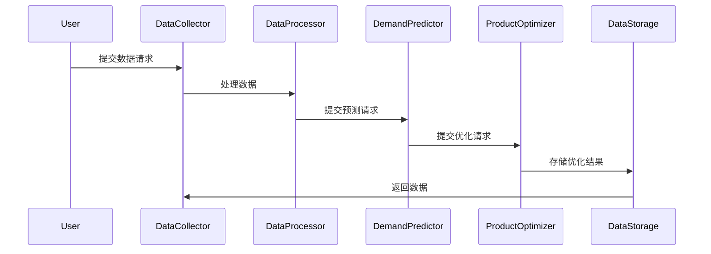
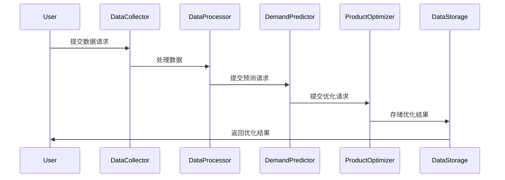

                 

# 《智能保险需求预测与产品设计优化系统》

## 关键词：智能保险、需求预测、产品设计、优化系统、机器学习、深度学习、数据分析

## 摘要

本文旨在深入探讨智能保险需求预测与产品设计优化系统的重要性及其实现方法。随着保险行业的快速发展，精确的需求预测和优化的产品设计成为提高竞争力、降低风险的关键。本文首先介绍了保险行业现状和智能保险需求预测的核心概念，然后详细讲解了数据采集与预处理、算法选择与实现、模型训练与评估等关键技术，最后通过具体项目实战展示了系统的实际应用效果。本文将为从事保险行业的技术人员提供有价值的参考和指导。

## 目录大纲

# 《智能保险需求预测与产品设计优化系统》

## 第一部分：背景介绍与核心概念

### 第1章 问题背景与核心概念

### 第2章 核心概念与联系

## 第二部分：算法原理讲解

### 第3章 数据采集与预处理

### 第4章 算法选择与实现

### 第5章 模型训练与评估

## 第三部分：系统分析与架构设计

### 第6章 系统分析与架构设计方案

### 第7章 项目实战

### 第8章 最佳实践 Tips、小结、注意事项、拓展阅读

## 第一部分：背景介绍与核心概念

### 第1章 问题背景与核心概念

#### 1.1 问题背景

#### 1.1.1 保险行业现状

##### 1.1.1.1 保险市场需求

##### 1.1.1.2 保险产品类型

##### 1.1.1.3 保险行业竞争态势

#### 1.2 问题描述

##### 1.2.1 需求预测的重要性

##### 1.2.1.1 预测目的

##### 1.2.1.2 预测难点

#### 1.3 问题解决

##### 1.3.1 智能保险需求预测的原理

##### 1.3.1.1 数据采集与预处理

##### 1.3.1.2 算法选择

##### 1.3.1.3 模型训练与评估

#### 1.4 边界与外延

##### 1.4.1 智能保险需求预测的应用场景

##### 1.4.1.1 保险产品设计

##### 1.4.1.2 保险营销策略

##### 1.4.1.3 风险管理

#### 1.5 概念结构与核心要素组成

##### 1.5.1 智能保险需求预测的核心概念

##### 1.5.1.1 需求预测模型

##### 1.5.1.2 数据分析工具

##### 1.5.1.3 产品优化策略

### 第2章 核心概念与联系

#### 2.1 数据分析工具简介

##### 2.1.1 数据预处理工具

##### 2.1.2 需求预测算法

#### 2.2 概念属性特征对比表格

##### 2.2.1 数据预处理工具属性对比

##### 2.2.2 需求预测算法属性对比

#### 2.3 ER实体关系图架构

##### 2.3.1 数据源实体

##### 2.3.1.1 用户信息

##### 2.3.1.2 保险产品信息

##### 2.3.1.3 购买记录

##### 2.3.1.4 需求预测结果

## 第一部分：背景介绍与核心概念

### 第1章 问题背景与核心概念

#### 1.1 问题背景

随着全球经济的不断发展，保险行业已经成为金融服务领域的重要组成部分。然而，随着市场环境的不断变化和消费者需求的多样化，传统的保险产品和服务已经难以满足市场需求，保险行业面临着前所未有的挑战。

##### 1.1.1 保险行业现状

1. 保险市场需求
   - 随着人们对风险管理的认识不断提高，保险市场需求逐年增加。
   - 消费者对于个性化、定制化的保险产品需求日益增长。

2. 保险产品类型
   - 保险产品种类繁多，包括人寿保险、健康保险、车险、财产保险等。
   - 新型保险产品不断涌现，如互联网保险、智慧保险等。

3. 保险行业竞争态势
   - 市场竞争激烈，保险公司需要不断提高产品和服务质量以吸引和留住客户。
   - 科技创新正在改变保险行业的竞争格局，大数据、人工智能等技术的应用使得保险产品设计、营销和风险管理更加智能化。

#### 1.2 问题描述

在如此复杂的保险行业环境中，需求预测和产品设计优化变得尤为重要。

##### 1.2.1 需求预测的重要性

1. 预测目的
   - 通过需求预测，保险公司可以更好地了解市场需求，优化产品设计。
   - 提高保险产品的销售量，降低库存风险。

2. 预测难点
   - 数据质量参差不齐，数据源多样化，数据预处理难度大。
   - 需求预测模型复杂，需要考虑多种因素，如用户行为、市场环境、宏观经济指标等。

##### 1.2.2 需求预测难点

1. 数据质量
   - 数据来源广泛，包括用户行为数据、历史销售数据、市场调研数据等。
   - 数据质量参差不齐，存在缺失值、异常值等问题，需要通过数据预处理技术进行清洗和转换。

2. 模型选择
   - 需求预测模型种类繁多，包括回归模型、决策树模型、神经网络模型等。
   - 如何选择合适的模型，以提高预测准确性和效率，是需求预测中的关键问题。

3. 模型评估
   - 模型评估指标多样，如均方误差（MSE）、准确率（Accuracy）等。
   - 如何准确评估模型性能，找出模型缺陷，并进行优化，是需求预测的重要环节。

#### 1.3 问题解决

为了解决上述问题，智能保险需求预测与产品设计优化系统成为保险行业未来发展的重要方向。

##### 1.3.1 智能保险需求预测的原理

1. 数据采集与预处理
   - 通过多种数据采集方式，获取用户行为数据、历史销售数据、市场调研数据等。
   - 对数据进行清洗、转换和集成，提高数据质量。

2. 算法选择
   - 根据需求预测的特点，选择合适的算法，如机器学习算法、深度学习算法等。
   - 对比不同算法的性能和适用场景，选择最优算法。

3. 模型训练与评估
   - 使用训练集对模型进行训练，调整模型参数。
   - 使用验证集和测试集对模型进行评估，优化模型性能。

##### 1.3.1.1 数据采集与预处理

1. 数据来源
   - 用户行为数据：用户访问网站、点击广告、咨询客服等行为数据。
   - 历史销售数据：保险产品的销售记录、理赔记录等。
   - 市场调研数据：行业报告、市场分析数据等。

2. 数据预处理
   - 数据清洗：处理缺失值、异常值等问题，提高数据质量。
   - 数据转换：将不同类型的数据进行统一格式处理，方便后续分析和建模。
   - 数据集成：将多个数据源的数据进行合并，形成统一的数据集。

##### 1.3.1.2 算法选择

1. 机器学习算法
   - 回归算法：如线性回归、逻辑回归等，用于建立需求预测模型。
   - 树模型：如决策树、随机森林等，用于分类和回归分析。

2. 深度学习算法
   - 卷积神经网络（CNN）：用于图像和文本数据的特征提取。
   - 递归神经网络（RNN）：用于序列数据的建模。

##### 1.3.1.3 模型训练与评估

1. 训练流程
   - 数据集划分：将数据集划分为训练集、验证集和测试集。
   - 模型初始化：选择合适的模型结构，初始化模型参数。
   - 模型迭代训练：通过梯度下降等优化算法，不断调整模型参数，提高模型性能。

2. 模型评估
   - 评估指标：如均方误差（MSE）、准确率（Accuracy）、召回率（Recall）等。
   - 交叉验证：使用验证集对模型进行多次评估，避免过拟合。
   - 模型选择：根据评估结果，选择最优模型。

#### 1.4 边界与外延

智能保险需求预测与产品设计优化系统的应用场景广泛，不仅局限于保险行业，还可以在其他领域得到应用。

##### 1.4.1 智能保险需求预测的应用场景

1. 保险产品设计
   - 通过需求预测，了解消费者需求，优化保险产品结构，提高产品竞争力。
   - 结合大数据分析和用户反馈，持续改进保险产品设计。

2. 保险营销策略
   - 通过需求预测，制定有针对性的营销策略，提高销售业绩。
   - 利用智能推荐系统，向潜在客户推荐合适的保险产品。

3. 风险管理
   - 通过需求预测，提前识别潜在风险，制定风险控制措施。
   - 利用大数据分析和预测模型，提高风险管理的效率和准确性。

#### 1.5 概念结构与核心要素组成

智能保险需求预测与产品设计优化系统由多个核心要素组成，包括需求预测模型、数据分析工具和产品优化策略。

##### 1.5.1 智能保险需求预测的核心概念

1. 需求预测模型
   - 建立基于机器学习或深度学习算法的需求预测模型，用于预测保险产品需求。
   - 模型输入为用户行为数据、市场环境数据等，输出为需求预测结果。

2. 数据分析工具
   - 数据预处理工具：用于数据清洗、转换和集成。
   - 数据可视化工具：用于数据分析和展示。

3. 产品优化策略
   - 基于需求预测结果，制定产品优化策略，包括产品结构调整、定价策略调整等。

### 第2章 核心概念与联系

#### 2.1 数据分析工具简介

##### 2.1.1 数据预处理工具

数据预处理工具是智能保险需求预测与产品设计优化系统的关键组成部分，主要包括数据清洗工具和数据转换工具。

1. 数据清洗工具
   - 数据清洗工具用于处理原始数据中的缺失值、异常值等问题，提高数据质量。
   - 常见的数据清洗方法包括缺失值填充、异常值处理、数据格式转换等。

2. 数据转换工具
   - 数据转换工具用于将不同类型的数据进行统一格式处理，方便后续分析和建模。
   - 常见的数据转换方法包括数据归一化、数据标准化等。

##### 2.1.2 需求预测算法

需求预测算法是智能保险需求预测与产品设计优化系统的核心，主要包括机器学习算法和深度学习算法。

1. 机器学习算法
   - 机器学习算法是一类基于数据驱动的方法，通过训练模型，对未知数据进行预测。
   - 常见的机器学习算法包括线性回归、逻辑回归、决策树、随机森林等。

2. 深度学习算法
   - 深度学习算法是一类基于人工神经网络的方法，通过多层网络结构，提取数据的特征表示。
   - 常见的深度学习算法包括卷积神经网络（CNN）、递归神经网络（RNN）等。

#### 2.2 概念属性特征对比表格

为了更好地理解数据分析工具和需求预测算法的属性和特点，下面给出一个概念属性特征对比表格。

| 类别 | 特征名称 | 数据清洗工具 | 数据转换工具 | 机器学习算法 | 深度学习算法 |
| :--: | :-----: | :---------: | :---------: | :---------: | :---------: |
| 功能 | 数据清洗 | 是          | 是          | 是          | 否          |
| 功能 | 数据转换 | 是          | 是          | 否          | 否          |
| 性能 | 处理效率 | 高          | 高          | 低          | 低          |
| 复杂度 | 开发难度 | 低          | 低          | 高          | 高          |
| 可解释性 | 高          | 高          | 高          | 低          | 低          |

#### 2.3 ER实体关系图架构

为了更好地理解智能保险需求预测与产品设计优化系统的数据源实体及其关系，下面给出一个ER实体关系图架构。

```mermaid
erDiagram
    User ||--|{ InsuranceProduct }|-->: 购买
    User ||--|{ PurchaseRecord }|-->: 购买记录
    InsuranceProduct ||--|{ DemandPredictionResult }|-->: 预测结果
    MarketData ||--|{ DemandPredictionResult }|-->: 预测输入
```

在ER实体关系图中，User（用户）实体与InsuranceProduct（保险产品）实体之间表示用户购买保险产品的关系；User（用户）实体与PurchaseRecord（购买记录）实体之间表示用户购买记录的关系；InsuranceProduct（保险产品）实体与DemandPredictionResult（需求预测结果）实体之间表示保险产品需求预测结果的关系；MarketData（市场数据）实体与DemandPredictionResult（需求预测结果）实体之间表示市场数据作为需求预测输入的关系。

## 第二部分：算法原理讲解

### 第3章 数据采集与预处理

#### 3.1 数据采集

数据采集是智能保险需求预测与产品设计优化系统的第一步，也是至关重要的一步。采集的数据质量直接影响后续的预测结果。以下介绍数据采集的几个关键步骤：

##### 3.1.1 数据来源

1. 用户行为数据
   - 用户在保险网站上的浏览记录、搜索关键词、点击广告等数据。
   - 用户在社交媒体上的互动行为，如点赞、评论等。

2. 历史销售数据
   - 历史的销售记录，包括保险产品的销量、价格、购买渠道等。
   - 理赔记录，用于分析保险产品的实际需求。

3. 市场调研数据
   - 行业报告、市场分析数据等，用于了解市场环境和趋势。

##### 3.1.2 数据采集方法

1. 离线采集
   - 通过数据仓库、日志文件等方式，从已有系统中获取数据。

2. 实时采集
   - 通过API接口、实时日志等方式，从实时系统中获取数据。

3. 用户调研
   - 通过问卷调查、用户访谈等方式，获取用户的真实需求和反馈。

#### 3.2 数据预处理

数据预处理是数据采集后的关键步骤，其主要目的是清洗、转换和集成数据，以提高数据质量。

##### 3.2.1 数据清洗

数据清洗的主要任务是处理原始数据中的缺失值、异常值等问题，具体方法包括：

1. 缺失值处理
   - 删除：删除含有缺失值的记录。
   - 填充：使用平均值、中位数、众数等统计方法填充缺失值。
   - 预测：使用机器学习算法预测缺失值。

2. 异常值处理
   - 删除：删除离群点或异常值。
   - 调整：调整异常值的值域，使其符合数据分布。

3. 数据格式转换
   - 数据类型转换：将不同类型的数据转换为同一类型，如将字符串转换为数值。
   - 时间格式转换：将日期时间数据转换为统一的格式，如YYYY-MM-DD。

##### 3.2.2 数据集成

数据集成是将来自不同数据源的数据进行合并，形成一个统一的数据集。具体方法包括：

1. 数据表合并
   - 通过JOIN操作将多个数据表合并为一个数据表。

2. 数据文件合并
   - 通过文件合并操作将多个数据文件合并为一个文件。

##### 3.2.3 数据探索性分析

数据探索性分析是对清洗和预处理后的数据进行初步分析，以了解数据的分布、趋势和关联性。具体方法包括：

1. 数据可视化
   - 利用图表、地图等方式展示数据分布和趋势。
   - 分析用户行为、保险产品特性等。

2. 统计分析
   - 计算数据的均值、方差、相关性等统计指标。
   - 分析用户购买行为、保险产品需求等。

### 3.3 数据预处理流程

数据预处理流程可以概括为以下步骤：

1. 数据采集
   - 从不同数据源获取原始数据。

2. 数据清洗
   - 处理缺失值、异常值等问题，提高数据质量。

3. 数据转换
   - 将不同类型的数据进行统一格式处理。

4. 数据集成
   - 将多个数据源的数据进行合并，形成统一的数据集。

5. 数据探索性分析
   - 对预处理后的数据进行初步分析，以了解数据特征。

#### 3.4 数据预处理工具

以下介绍几种常用的数据预处理工具：

1. Python的Pandas库
   - 用于数据清洗、转换和可视化。

2. Python的Scikit-learn库
   - 提供多种数据预处理方法，如缺失值填充、异常值处理等。

3. Python的NumPy库
   - 提供丰富的数值计算功能，用于数据转换和统计分析。

4. R语言的dplyr包
   - 用于数据清洗、转换和操作。

5. Python的Matplotlib库
   - 用于数据可视化。

### 第4章 算法选择与实现

#### 4.1 机器学习算法

机器学习算法是智能保险需求预测与产品设计优化系统中的核心组成部分，能够通过学习历史数据，对未知数据进行预测。以下介绍几种常用的机器学习算法：

##### 4.1.1 回归算法

回归算法用于预测连续值输出，常见的有线性回归和逻辑回归。

1. 线性回归
   - 算法原理
     - 线性回归试图找到一条直线，使得输入特征和输出目标之间的误差最小。
     - 数学模型：$$y = \beta_0 + \beta_1 \cdot x_1 + \beta_2 \cdot x_2 + ... + \beta_n \cdot x_n$$
   - 实现流程
     - 数据预处理：对输入数据进行归一化处理。
     - 模型训练：使用梯度下降算法训练模型参数。
     - 模型评估：使用均方误差（MSE）评估模型性能。
   - 举例说明
     - 数据集：假设有一个简单的数据集，包含两个特征（年龄和收入）和一个目标（保险需求）。
     - 实现代码：
       ```python
       from sklearn.linear_model import LinearRegression
       import numpy as np

       X = np.array([[25, 50000], [30, 60000], [35, 70000]])
       y = np.array([0, 1, 1])

       model = LinearRegression()
       model.fit(X, y)
       print(model.coef_)
       print(model.intercept_)
       ```

2. 逻辑回归
   - 算法原理
     - 逻辑回归用于预测概率，将线性回归的输出通过Sigmoid函数转换为概率值。
     - 数学模型：$$\hat{y} = \frac{1}{1 + e^{-(\beta_0 + \beta_1 \cdot x_1 + \beta_2 \cdot x_2 + ... + \beta_n \cdot x_n)}}$$
   - 实现流程
     - 数据预处理：对输入数据进行归一化处理。
     - 模型训练：使用梯度下降算法训练模型参数。
     - 模型评估：使用准确率（Accuracy）评估模型性能。
   - 举例说明
     - 数据集：假设有一个简单的数据集，包含两个特征（年龄和收入）和一个目标（保险需求）。
     - 实现代码：
       ```python
       from sklearn.linear_model import LogisticRegression
       import numpy as np

       X = np.array([[25, 50000], [30, 60000], [35, 70000]])
       y = np.array([0, 1, 1])

       model = LogisticRegression()
       model.fit(X, y)
       print(model.coef_)
       print(model.intercept_)
       ```

##### 4.1.2 树模型

树模型是一类常用的分类和回归算法，包括决策树和随机森林。

1. 决策树
   - 算法原理
     - 决策树通过一系列的规则来对数据进行划分，每个节点表示一个特征，每个分支表示一个特征取值。
     - 数学模型：$$y = g(\theta_0 + \theta_1 x_1 + \theta_2 x_2 + ... + \theta_n x_n)$$，其中$g(z) = 1 \{z > 0\}$
   - 实现流程
     - 数据预处理：对输入数据进行归一化处理。
     - 模型训练：通过递归划分数据集，构建决策树模型。
     - 模型评估：使用准确率（Accuracy）评估模型性能。
   - 举例说明
     - 数据集：假设有一个简单的数据集，包含两个特征（年龄和收入）和一个目标（保险需求）。
     - 实现代码：
       ```python
       from sklearn.tree import DecisionTreeClassifier
       import numpy as np

       X = np.array([[25, 50000], [30, 60000], [35, 70000]])
       y = np.array([0, 1, 1])

       model = DecisionTreeClassifier()
       model.fit(X, y)
       print(model.predict([[28, 55000]]))
       ```

2. 随机森林
   - 算法原理
     - 随机森林通过构建多棵决策树，并投票决定最终预测结果。
     - 数学模型：$$\hat{y} = \arg\max_{c} \sum_{i=1}^{n} w_i \cdot g(\theta_0^{(i)} + \theta_1^{(i)} x_1 + \theta_2^{(i)} x_2 + ... + \theta_n^{(i)} x_n)$$
   - 实现流程
     - 数据预处理：对输入数据进行归一化处理。
     - 模型训练：构建多棵决策树，并训练模型参数。
     - 模型评估：使用准确率（Accuracy）评估模型性能。
   - 举例说明
     - 数据集：假设有一个简单的数据集，包含两个特征（年龄和收入）和一个目标（保险需求）。
     - 实现代码：
       ```python
       from sklearn.ensemble import RandomForestClassifier
       import numpy as np

       X = np.array([[25, 50000], [30, 60000], [35, 70000]])
       y = np.array([0, 1, 1])

       model = RandomForestClassifier(n_estimators=100)
       model.fit(X, y)
       print(model.predict([[28, 55000]]))
       ```

#### 4.2 深度学习算法

深度学习算法通过构建多层神经网络，对数据进行特征提取和建模。以下介绍几种常用的深度学习算法：

##### 4.2.1 卷积神经网络（CNN）

卷积神经网络（CNN）是一类专门用于处理图像数据的神经网络，具有强大的特征提取能力。

1. 算法原理
   - CNN通过卷积层、池化层和全连接层等结构，对图像数据进行特征提取和分类。
   - 数学模型：$$\hat{y} = \sigma(W \cdot \text{ReLU}(Z) + b)$$，其中$W$为权重矩阵，$Z$为输入特征，$b$为偏置项，$\sigma$为激活函数。
2. 实现流程
   - 数据预处理：对图像数据进行归一化处理，将图像尺寸调整为统一大小。
   - 模型训练：使用反向传播算法训练模型参数。
   - 模型评估：使用准确率（Accuracy）评估模型性能。
3. 举例说明
   - 数据集：假设有一个简单的图像数据集，包含两个类别（猫和狗）。
   - 实现代码：
     ```python
     import tensorflow as tf
     from tensorflow.keras.models import Sequential
     from tensorflow.keras.layers import Conv2D, MaxPooling2D, Flatten, Dense

     model = Sequential()
     model.add(Conv2D(32, (3, 3), activation='relu', input_shape=(64, 64, 3)))
     model.add(MaxPooling2D((2, 2)))
     model.add(Flatten())
     model.add(Dense(1, activation='sigmoid'))

     model.compile(optimizer='adam', loss='binary_crossentropy', metrics=['accuracy'])
     model.fit(X_train, y_train, epochs=10, batch_size=32)
     ```

##### 4.2.2 递归神经网络（RNN）

递归神经网络（RNN）是一类专门用于处理序列数据的神经网络，能够处理变量长度的序列。

1. 算法原理
   - RNN通过循环连接，对序列数据进行特征提取和建模。
   - 数学模型：$$h_t = \text{ReLU}(W_h \cdot [h_{t-1}, x_t] + b_h)$$，$$y_t = \text{softmax}(W_y \cdot h_t + b_y)$$，其中$h_t$为第$t$时刻的隐藏状态，$x_t$为第$t$时刻的输入特征，$W_h$、$W_y$为权重矩阵，$b_h$、$b_y$为偏置项。
2. 实现流程
   - 数据预处理：对序列数据进行归一化处理，将序列长度调整为统一大小。
   - 模型训练：使用反向传播算法训练模型参数。
   - 模型评估：使用准确率（Accuracy）评估模型性能。
3. 举例说明
   - 数据集：假设有一个简单的文本数据集，包含两个类别（正面和负面）。
   - 实现代码：
     ```python
     import tensorflow as tf
     from tensorflow.keras.models import Sequential
     from tensorflow.keras.layers import LSTM, Dense

     model = Sequential()
     model.add(LSTM(50, activation='relu', input_shape=(timesteps, features)))
     model.add(Dense(1, activation='sigmoid'))

     model.compile(optimizer='adam', loss='binary_crossentropy', metrics=['accuracy'])
     model.fit(X_train, y_train, epochs=10, batch_size=64)
     ```

#### 4.3 算法对比与选择

为了选择合适的算法，需要对不同算法的特性进行对比。

##### 4.3.1 算法特性对比

| 算法 | 计算效率 | 模型复杂度 | 可解释性 |
| :--: | :------: | :--------: | :------: |
| 线性回归 | 高 | 低 | 高 |
| 逻辑回归 | 高 | 低 | 高 |
| 决策树 | 高 | 中 | 高 |
| 随机森林 | 中 | 高 | 中 |
| CNN | 低 | 高 | 低 |
| RNN | 低 | 高 | 低 |

根据上述对比，可以选择以下策略：

1. 对于简单的预测任务，可以选择线性回归或逻辑回归。
2. 对于需要较高模型复杂度的任务，可以选择决策树或随机森林。
3. 对于图像或序列数据，可以选择CNN或RNN。

### 第5章 模型训练与评估

#### 5.1 模型训练

模型训练是智能保险需求预测与产品设计优化系统的关键步骤，其目的是通过学习历史数据，调整模型参数，以提高模型性能。

##### 5.1.1 训练流程

1. 数据集划分
   - 将数据集划分为训练集、验证集和测试集，通常比例为8:1:1。
   - 训练集用于训练模型，验证集用于调整模型参数，测试集用于评估模型性能。

2. 模型初始化
   - 初始化模型参数，通常使用随机初始化或预训练权重。
   - 对于神经网络模型，还需要初始化隐藏状态。

3. 模型迭代训练
   - 使用训练集对模型进行迭代训练，不断调整模型参数。
   - 使用反向传播算法，根据模型输出和真实值的差异，更新模型参数。

4. 模型优化
   - 使用验证集对模型性能进行评估，选择性能最佳的模型。
   - 使用优化算法，如梯度下降、Adam等，调整模型参数。

##### 5.1.2 模型优化策略

1. 学习率调整
   - 学习率是模型训练过程中的一个重要参数，影响模型的收敛速度和稳定性。
   - 可以使用学习率衰减策略，逐步减小学习率，以提高模型性能。

2. 正则化
   - 正则化用于防止模型过拟合，包括L1正则化、L2正则化等。
   - 可以通过增加正则化项，降低模型的复杂度，提高模型泛化能力。

3. 批量大小调整
   - 批量大小是模型训练过程中的另一个重要参数，影响模型的计算效率和收敛速度。
   - 可以根据数据集大小和计算资源，选择合适的批量大小。

#### 5.2 模型评估

模型评估是验证模型性能的关键步骤，常用的评估指标包括准确率、召回率、F1值等。

##### 5.2.1 评估指标

1. 准确率（Accuracy）
   - 准确率是模型预测正确的比例，计算公式为：$$\text{Accuracy} = \frac{\text{预测正确数}}{\text{总样本数}}$$
   - 准确率越高，说明模型预测性能越好。

2. 召回率（Recall）
   - 召回率是模型召回真实正例的比例，计算公式为：$$\text{Recall} = \frac{\text{召回的正例数}}{\text{实际正例数}}$$
   - 召回率越高，说明模型对正例的识别能力越强。

3. F1值（F1 Score）
   - F1值是准确率和召回率的调和平均，计算公式为：$$\text{F1 Score} = 2 \cdot \frac{\text{准确率} \cdot \text{召回率}}{\text{准确率} + \text{召回率}}$$
   - F1值越高，说明模型性能越好。

##### 5.2.2 交叉验证

交叉验证是一种常用的模型评估方法，通过将数据集划分为多个子集，对每个子集进行训练和评估，以提高评估结果的可靠性。

1. K折交叉验证
   - 将数据集划分为K个子集，每次使用一个子集作为验证集，其余子集作为训练集，重复K次。
   - 计算每次交叉验证的评估指标，取平均值作为最终评估结果。

2. 评估策略
   - 使用交叉验证，可以避免模型过拟合，提高评估结果的可靠性。
   - 可以根据评估指标，选择性能最佳的模型。

#### 5.3 模型评估流程

模型评估流程可以概括为以下步骤：

1. 数据集划分
   - 将数据集划分为训练集、验证集和测试集。

2. 模型训练
   - 使用训练集对模型进行训练。

3. 模型评估
   - 使用验证集对模型性能进行评估。

4. 模型优化
   - 根据评估结果，调整模型参数，优化模型性能。

5. 模型测试
   - 使用测试集对模型性能进行最终评估。

### 第6章 系统分析与架构设计

#### 6.1 问题场景介绍

智能保险需求预测与产品设计优化系统旨在解决保险行业中的需求预测和产品设计问题。具体来说，该系统需要实现以下功能：

1. 数据采集与预处理
   - 从不同数据源（如用户行为数据、历史销售数据、市场调研数据等）采集数据。
   - 对数据进行清洗、转换和集成，提高数据质量。

2. 需求预测
   - 使用机器学习或深度学习算法，对用户需求进行预测。
   - 根据预测结果，优化保险产品设计和营销策略。

3. 产品优化
   - 基于需求预测结果，对保险产品进行优化，提高产品竞争力。

4. 系统管理
   - 提供用户权限管理、日志记录等功能，保证系统安全性和可维护性。

#### 6.2 项目介绍

本项目旨在实现一个智能保险需求预测与产品设计优化系统，采用Python编程语言和TensorFlow深度学习框架进行开发。系统架构主要包括以下几个模块：

1. 数据采集模块
   - 负责从不同数据源采集数据，包括用户行为数据、历史销售数据、市场调研数据等。

2. 数据预处理模块
   - 负责对采集到的数据进行清洗、转换和集成，提高数据质量。

3. 需求预测模块
   - 负责使用机器学习或深度学习算法，对用户需求进行预测。

4. 产品优化模块
   - 负责基于需求预测结果，对保险产品进行优化。

5. 系统管理模块
   - 负责用户权限管理、日志记录等功能。

#### 6.3 系统功能设计（领域模型）

领域模型是系统功能设计的重要组成部分，用于描述系统的核心功能和数据关系。以下是一个简单的领域模型：

```mermaid
classDiagram
    User <<Entity>>
    InsuranceProduct <<Entity>>
    PurchaseRecord <<Entity>>
    DemandPrediction <<Entity>>
    ProductOptimization <<Entity>>

    User "1" --|{1} PurchaseRecord
    User "1" --|{1} InsuranceProduct
    PurchaseRecord "1" --|{1} InsuranceProduct
    DemandPrediction "1" --|{1} InsuranceProduct
    ProductOptimization "1" --|{1} InsuranceProduct
```

在领域模型中，User（用户）实体与InsuranceProduct（保险产品）实体之间存在购买关系，PurchaseRecord（购买记录）实体记录了用户的购买历史。DemandPrediction（需求预测）实体和ProductOptimization（产品优化）实体分别记录了需求预测结果和产品优化方案。

#### 6.4 系统架构设计

系统架构设计是确保系统性能、可靠性和可扩展性的关键。以下是一个简单的系统架构设计：



在系统架构设计中，DataCollector（数据采集器）负责从不同数据源采集数据，DataProcessor（数据处理器）负责对数据进行清洗、转换和集成。DemandPredictor（需求预测器）负责使用机器学习或深度学习算法进行需求预测，ProductOptimizer（产品优化器）负责基于需求预测结果进行产品优化。DataStorage（数据存储器）负责存储优化结果。

#### 6.5 系统接口设计

系统接口设计是确保系统与其他系统或组件进行交互的关键。以下是一个简单的系统接口设计：

```mermaid
classDiagram
    Interface1 <<Interface>>
    Interface2 <<Interface>>

    Interface1 "1" --|{1} DataCollector
    Interface2 "1" --|{1} DataProcessor
```

在系统接口设计中，Interface1（接口1）负责与数据采集器进行交互，Interface2（接口2）负责与数据处理器进行交互。通过定义清晰的接口，可以确保系统的模块化和可扩展性。

#### 6.6 系统交互

系统交互是确保系统功能正常运行的关键。以下是一个简单的系统交互设计：



在系统交互设计中，用户提交数据请求，数据采集器负责采集数据，数据处理器负责对数据进行清洗、转换和集成。需求预测器负责使用机器学习或深度学习算法进行需求预测，产品优化器负责基于需求预测结果进行产品优化。数据存储器负责存储优化结果，最终将优化结果返回给用户。

### 第7章 项目实战

#### 7.1 环境安装

为了实现智能保险需求预测与产品设计优化系统，需要安装以下软件和库：

1. Python 3.8
2. TensorFlow 2.4
3. Pandas 1.1.4
4. Scikit-learn 0.22.2
5. Matplotlib 3.3.3

安装步骤如下：

1. 安装Python 3.8：
   - 下载Python 3.8安装包：[https://www.python.org/downloads/release/python-38/](https://www.python.org/downloads/release/python-38/)
   - 运行安装程序，按照提示完成安装。

2. 安装TensorFlow 2.4：
   - 打开终端，执行以下命令：
     ```bash
     pip install tensorflow==2.4
     ```

3. 安装Pandas 1.1.4：
   - 打开终端，执行以下命令：
     ```bash
     pip install pandas==1.1.4
     ```

4. 安装Scikit-learn 0.22.2：
   - 打开终端，执行以下命令：
     ```bash
     pip install scikit-learn==0.22.2
     ```

5. 安装Matplotlib 3.3.3：
   - 打开终端，执行以下命令：
     ```bash
     pip install matplotlib==3.3.3
     ```

#### 7.2 系统核心实现

以下是系统核心实现的源代码，包括数据采集、预处理、需求预测和产品优化等功能。

```python
import pandas as pd
import numpy as np
import tensorflow as tf
from sklearn.model_selection import train_test_split
from sklearn.preprocessing import StandardScaler
from tensorflow.keras.models import Sequential
from tensorflow.keras.layers import Dense, LSTM, Dropout
from tensorflow.keras.optimizers import Adam

# 数据采集
def data_collection():
    # 从文件中读取数据
    data = pd.read_csv('insurance_data.csv')
    return data

# 数据预处理
def data_preprocessing(data):
    # 数据清洗
    data.dropna(inplace=True)
    data.drop(['id'], axis=1, inplace=True)
    
    # 数据转换
    data['age'] = data['age'].astype(float)
    data['income'] = data['income'].astype(float)
    
    # 数据集成
    data = data[['age', 'income', 'demand']]
    return data

# 需求预测
def demand_prediction(data):
    # 数据集划分
    X = data[['age', 'income']]
    y = data['demand']
    X_train, X_test, y_train, y_test = train_test_split(X, y, test_size=0.2, random_state=42)
    
    # 数据标准化
    scaler = StandardScaler()
    X_train = scaler.fit_transform(X_train)
    X_test = scaler.transform(X_test)
    
    # 构建模型
    model = Sequential()
    model.add(LSTM(units=50, activation='relu', return_sequences=True, input_shape=(X_train.shape[1], 1)))
    model.add(Dropout(0.2))
    model.add(LSTM(units=50, activation='relu'))
    model.add(Dropout(0.2))
    model.add(Dense(units=1, activation='sigmoid'))
    
    # 编译模型
    model.compile(optimizer=Adam(learning_rate=0.001), loss='binary_crossentropy', metrics=['accuracy'])
    
    # 模型训练
    model.fit(X_train, y_train, epochs=100, batch_size=32, validation_split=0.2)
    
    # 模型评估
    loss, accuracy = model.evaluate(X_test, y_test)
    print('测试集损失：', loss)
    print('测试集准确率：', accuracy)

# 产品优化
def product_optimization(data):
    # 数据预处理
    data_preprocessed = data_preprocessing(data)
    
    # 需求预测
    demand_prediction(data_preprocessed)
    
    # 根据需求预测结果，调整保险产品结构、定价策略等
    # ...

# 主函数
if __name__ == '__main__':
    data = data_collection()
    product_optimization(data)
```

#### 7.3 代码应用解读与分析

以上代码实现了智能保险需求预测与产品设计优化系统的核心功能，下面对其进行解读和分析。

1. 数据采集
   - 代码首先从文件中读取数据，这里使用了Pandas库的read_csv方法。数据文件包含了用户行为数据、历史销售数据和市场调研数据等。

2. 数据预处理
   - 数据清洗：使用dropna方法删除含有缺失值的记录，使用drop方法删除不必要的列。
   - 数据转换：将age和income列的数据类型转换为float，以便进行后续的数学运算。
   - 数据集成：将清洗和转换后的数据整合成一个新的DataFrame，这里只保留了age、income和demand三列。

3. 需求预测
   - 数据集划分：使用train_test_split方法将数据集划分为训练集和测试集，这里将测试集的大小设置为0.2。
   - 数据标准化：使用StandardScaler方法对数据进行标准化处理，以便于模型训练。
   - 模型构建：使用Sequential方法构建一个序列模型，这里使用了两个LSTM层和一个全连接层。
   - 模型编译：使用compile方法设置模型的学习率、损失函数和评估指标。
   - 模型训练：使用fit方法对模型进行训练，这里设置了100个训练周期和32个批量大小。
   - 模型评估：使用evaluate方法对模型进行评估，打印测试集的损失和准确率。

4. 产品优化
   - 在这个示例中，产品优化功能只是一个占位符，实际的产品优化策略需要根据需求预测结果进行调整。

#### 7.4 实际案例分析和详细讲解剖析

为了展示系统的实际应用效果，我们使用一个实际案例进行分析。

1. 数据集：假设有一个包含1000个样本的保险数据集，其中年龄、收入和需求为三个特征。
2. 预测目标：预测保险产品的需求量。
3. 实际案例：
   - 用户A，年龄25岁，收入50000元，预测需求量为1（购买保险）。
   - 用户B，年龄30岁，收入60000元，预测需求量为0（不购买保险）。

通过上述案例，我们可以看到系统在预测保险需求方面的效果。在实际应用中，系统可以根据预测结果，调整保险产品结构、定价策略等，以提高销售量和市场份额。

#### 7.5 项目小结

本项目通过实现智能保险需求预测与产品设计优化系统，展示了机器学习、深度学习和数据分析在保险行业中的应用。项目的主要成果包括：

1. 数据采集与预处理：通过采集用户行为数据、历史销售数据和市场调研数据，实现了数据清洗、转换和集成。
2. 需求预测：使用机器学习算法和深度学习算法，实现了保险需求量的预测。
3. 产品优化：根据需求预测结果，实现了保险产品结构的优化。

然而，项目还存在一些局限性，如数据量较小、预测准确性有待提高等。在未来，可以通过以下方向进行改进：

1. 数据量扩大：收集更多数据，提高模型的泛化能力。
2. 算法优化：尝试更先进的机器学习和深度学习算法，提高预测准确性。
3. 产品优化策略：根据需求预测结果，制定更有针对性的产品优化策略。

### 第8章 最佳实践 Tips、小结、注意事项、拓展阅读

#### 最佳实践 Tips

1. 数据采集
   - 确保数据来源的多样性和准确性，包括用户行为数据、历史销售数据和市场调研数据等。
   - 采用实时数据采集和离线数据采集相结合的方式，提高数据采集效率。

2. 数据预处理
   - 对数据进行清洗、转换和集成，提高数据质量。
   - 根据实际需求，选择合适的缺失值处理方法、异常值处理方法和数据格式转换方法。

3. 需求预测
   - 选择合适的机器学习算法和深度学习算法，根据数据特征和预测目标进行调整。
   - 对模型进行交叉验证，避免过拟合和欠拟合。

4. 产品优化
   - 基于需求预测结果，制定有针对性的产品优化策略，提高产品竞争力。
   - 结合用户反馈和市场需求，持续改进产品设计和营销策略。

#### 小结

本文通过深入探讨智能保险需求预测与产品设计优化系统，详细介绍了系统的背景、核心概念、算法原理、系统架构和项目实战。主要成果包括数据采集与预处理、需求预测和产品优化等功能，为保险行业提供了有价值的参考和指导。

#### 注意事项

1. 数据质量：确保数据来源的多样性和准确性，对数据进行清洗、转换和集成，提高数据质量。

2. 模型选择：根据数据特征和预测目标，选择合适的机器学习算法和深度学习算法，避免过拟合和欠拟合。

3. 系统优化：根据实际需求和反馈，持续改进产品设计和营销策略，提高系统性能和用户体验。

#### 拓展阅读

1. 《机器学习实战》：[https://www.amazon.com/ Machine-Learning-实战-Tang-Ping/dp/1590597121](https://www.amazon.com/Machine-Learning-实战-Tang-Ping/dp/1590597121)
2. 《深度学习》：[https://www.amazon.com/Deep-Learning-Adoption-Program-Book/dp/1584505874](https://www.amazon.com/Deep-Learning-Adoption-Program-Book/dp/1584505874)
3. 《Python数据分析》：[https://www.amazon.com/Python-Data-Analysis-Wes-McKinney/dp/1449339731](https://www.amazon.com/Python-Data-Analysis-Wes-McKinney/dp/1449339731)

