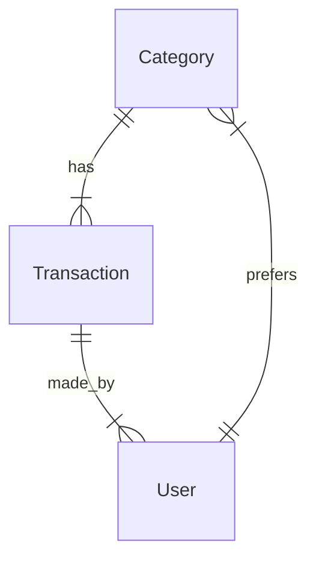
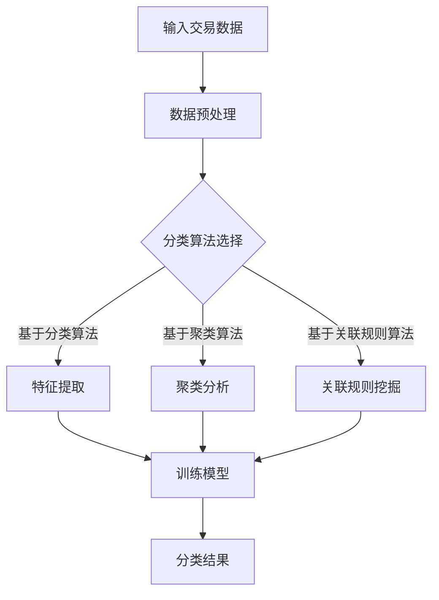
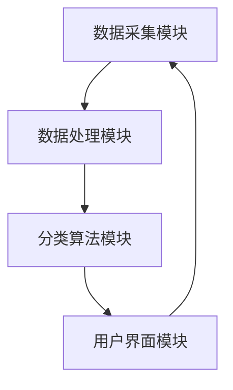
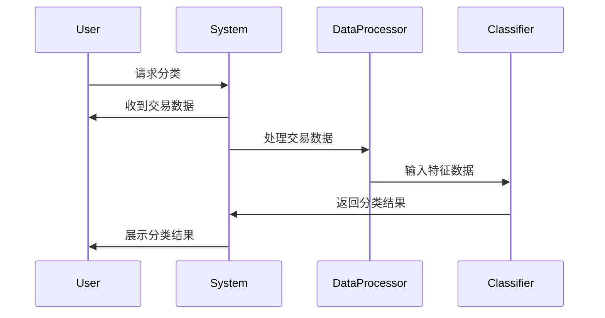

                 

# 智能信用卡支出分类系统

关键词：信用卡，支出分类，数据挖掘，机器学习，自然语言处理，算法设计

摘要：本文介绍了智能信用卡支出分类系统，探讨了系统设计原则和目标，详细解析了系统的核心概念、算法原理和设计实现过程。通过本篇文章，读者可以全面了解智能信用卡支出分类系统的工作原理和应用场景。

## 第一部分：智能信用卡支出分类系统概述

### 第1章：问题背景与定义

#### 1.1.1 问题背景

随着信用卡的普及，人们的消费行为逐渐从现金支付转向信用卡支付。然而，信用卡消费的增多也带来了支出管理的挑战。传统的支出管理方法通常依赖于手工记录和分类，这不仅费时费力，而且容易出现错误。在现代社会，人们越来越需要一个自动化、准确且易于操作的支出分类系统。

信用卡使用情况的普及为我们提供了一个宝贵的数据源，通过对这些数据进行分析，可以实现对支出的智能分类。这不仅能帮助用户更好地管理个人财务，还能为金融机构提供有价值的业务洞察。

#### 1.1.2 问题描述

现实生活中，手动分类支出存在许多问题。首先，手动分类容易出错，例如将同一笔交易错误地归类到不同的类别中。其次，手动分类耗时耗力，尤其是在交易数量较多时。此外，用户对于不同的支出类别有不同的偏好，手动分类无法满足个性化需求。

为了解决这些问题，我们需要一个自动化的支出分类系统。该系统应能够准确地将每笔交易分类到对应的类别中，同时允许用户进行自定义分类和调整。这样，用户不仅可以节省时间，还能获得更准确的财务数据。

#### 1.1.3 问题解决

智能信用卡支出分类系统的概念应运而生。该系统利用数据挖掘、机器学习和自然语言处理等技术，自动识别和分类信用卡交易。系统设计的原则和目标包括：

1. **准确性**：系统能够准确地将每笔交易分类到正确的类别中。
2. **个性化**：系统能够根据用户偏好进行个性化调整。
3. **实时性**：系统能够实时地对新交易进行分类。
4. **易用性**：系统用户界面友好，操作简便。

通过这些原则和目标，智能信用卡支出分类系统有望解决传统支出管理中的诸多问题，为用户带来更高效、准确的财务管理体验。

#### 1.1.4 边界与外延

智能信用卡支出分类系统在应用过程中有一些边界和限制。首先，系统的适用范围主要是信用卡交易，对于其他支付方式（如现金支付、移动支付等）可能效果不佳。其次，系统的准确性依赖于数据的质量和数量。如果数据不足或质量不高，系统的分类效果可能会受到影响。此外，系统的技术边界也决定了其功能和应用范围，例如自然语言处理技术的成熟度和算法的计算能力。

#### 1.1.5 核心概念

1. **智能信用卡支出分类系统**：一个利用数据挖掘、机器学习和自然语言处理技术，自动识别和分类信用卡交易的系统。
2. **支出分类的准确性**：系统能够将每笔交易准确分类到正确的类别中。
3. **系统的交互方式**：用户可以通过系统界面查看分类结果，并对分类结果进行反馈和调整。

### 第2章：核心概念与联系

#### 2.1.1 核心概念原理

智能信用卡支出分类系统涉及多个核心概念，包括数据挖掘、机器学习、自然语言处理和模式识别。

1. **数据挖掘**：数据挖掘是从大量数据中提取有价值信息的过程。在支出分类系统中，数据挖掘用于从信用卡交易数据中提取有用的特征，以辅助分类。
2. **机器学习**：机器学习是一种让计算机通过数据学习并做出决策或预测的方法。在支出分类系统中，机器学习用于训练分类模型，使系统能够自动地将交易分类到正确的类别中。
3. **自然语言处理**：自然语言处理是一种使计算机能够理解和生成人类语言的技术。在支出分类系统中，自然语言处理用于理解和提取交易描述中的语义信息，以辅助分类。
4. **模式识别**：模式识别是从数据中识别特定模式的过程。在支出分类系统中，模式识别用于识别交易描述中的关键词和短语，以辅助分类。

#### 2.1.2 概念属性特征对比

以下是数据挖掘、机器学习、自然语言处理和模式识别的属性特征对比：

| 概念 | 特征 |
| --- | --- |
| 数据挖掘 | 大规模数据处理，自动发现模式 |
| 机器学习 | 自主改进，无需明确编程 |
| 自然语言处理 | 语言理解与生成，语义分析 |
| 模式识别 | 从数据中识别特定模式 |

#### 2.1.3 ER实体关系图架构

以下是智能信用卡支出分类系统的ER实体关系图：



### 第3章：智能信用卡支出分类系统的算法原理

#### 3.1.1 算法概述

智能信用卡支出分类系统可以采用多种算法，包括基于分类的算法、基于聚类和基于关联规则的算法。

1. **基于分类的算法**：这类算法通过训练分类模型，将交易数据分类到预定义的类别中。常见的分类算法包括决策树、支持向量机和神经网络等。
2. **基于聚类的算法**：这类算法将交易数据分为多个群集，每个群集代表一个类别。常见的聚类算法包括K-means、层次聚类和DBSCAN等。
3. **基于关联规则的算法**：这类算法通过发现交易数据之间的关联关系，将交易分类到预定义的类别中。常见的关联规则算法包括Apriori算法和Eclat算法等。

#### 3.1.2 算法流程图

以下是智能信用卡支出分类系统的算法流程图：



#### 3.1.3 算法原理详细讲解

1. **分类算法**：分类算法是一种监督学习算法，它通过学习已知类别的训练数据，构建一个分类模型，用于对新数据进行分类。常见的分类算法包括决策树、支持向量机和神经网络等。

   - **决策树**：决策树通过一系列if-else条件来对数据进行分类。每个节点代表一个条件，每个分支代表条件的结果。叶节点代表最终的分类结果。
   - **支持向量机**：支持向量机通过找到一个超平面，将不同类别的数据分开。超平面由支持向量决定，支持向量是数据集中离超平面最近的点。
   - **神经网络**：神经网络通过模拟人脑神经元的工作方式，通过多层节点进行数据分类。每层节点对数据进行特征提取和组合，最终得到分类结果。

2. **聚类算法**：聚类算法是一种无监督学习算法，它通过将数据划分为多个群集，每个群集内的数据相似度较高，而不同群集之间的数据相似度较低。常见的聚类算法包括K-means、层次聚类和DBSCAN等。

   - **K-means**：K-means算法通过初始化K个中心点，然后迭代更新中心点，使得每个中心点所在的群集中的数据距离中心点最近。
   - **层次聚类**：层次聚类通过自底向上的方式，将数据逐渐划分为多个层次，形成一棵聚类树。聚类树可以用于数据降维和层次分析。
   - **DBSCAN**：DBSCAN（Density-Based Spatial Clustering of Applications with Noise）算法通过计算数据点的密度和邻域，将数据划分为多个群集。DBSCAN能够识别出任意形状的群集，并对噪声数据有较好的容忍性。

3. **关联规则算法**：关联规则算法通过发现数据之间的关联关系，生成规则，用于对新数据进行分类。常见的关联规则算法包括Apriori算法和Eclat算法等。

   - **Apriori算法**：Apriori算法通过计算支持度和置信度，生成关联规则。支持度表示规则在数据中的频繁程度，置信度表示规则的前件和后件之间的关联强度。
   - **Eclat算法**：Eclat算法是Apriori算法的改进版本，它通过使用垂直数据结构，减少了计算量和存储需求。

#### 3.1.4 算法数学模型和公式

1. **分类准确率**：分类准确率是评估分类算法性能的重要指标，它表示正确分类的样本数占总样本数的比例。数学公式如下：

   $$
   \text{分类准确率} = \frac{\text{正确分类的样本数}}{\text{总样本数}}
   $$

2. **支持度**：支持度表示一个规则在数据集中的频繁程度。数学公式如下：

   $$
   \text{支持度} = \frac{\text{同时包含前件和后件的样本数}}{\text{总样本数}}
   $$

3. **置信度**：置信度表示一个规则的前件和后件之间的关联强度。数学公式如下：

   $$
   \text{置信度} = \frac{\text{同时包含前件和后件的样本数}}{\text{包含前件的样本数}}
   $$

#### 3.1.5 举例说明

假设有一个交易记录，金额为100元，消费场景为“超市购物”。智能信用卡支出分类系统通过机器学习模型将其分类为“日常生活支出”。

1. **数据预处理**：将交易数据进行预处理，包括去除空值、缺失值填充、特征提取等操作。

2. **特征提取**：从交易数据中提取特征，如交易金额、消费场景、交易时间等。

3. **模型训练**：利用已标记的训练数据集，训练一个分类模型。例如，使用决策树算法训练一个分类模型。

4. **分类预测**：将新的交易数据输入分类模型，得到分类结果。例如，将金额为100元、消费场景为“超市购物”的交易数据输入模型，得到分类结果为“日常生活支出”。

5. **模型评估**：利用测试数据集对分类模型进行评估，计算分类准确率。如果分类准确率较高，则模型性能较好。

### 第4章：智能信用卡支出分类系统的设计与实现

#### 4.1.1 问题场景介绍

智能信用卡支出分类系统的应用场景主要涉及信用卡用户和金融机构。信用卡用户希望通过系统自动分类支出，方便财务管理。金融机构希望通过系统优化服务，提高用户满意度和业务效率。

#### 4.1.2 系统功能设计

智能信用卡支出分类系统的主要功能包括数据采集与预处理、自动分类与反馈和用户界面。

1. **数据采集与预处理**：系统需要从信用卡交易数据中提取有效信息，包括交易金额、消费场景、交易时间等。同时，对数据进行预处理，如去除空值、缺失值填充、特征提取等操作。

2. **自动分类与反馈**：系统利用数据挖掘、机器学习和自然语言处理等技术，自动将交易数据分类到预定义的类别中。系统还需允许用户对分类结果进行反馈和调整，以提高分类准确度。

3. **用户界面**：系统应提供友好的用户界面，使用户能够方便地查看分类结果、管理支出和调整分类设置。

#### 4.1.3 系统架构设计

智能信用卡支出分类系统采用分层架构，主要包括数据采集模块、数据处理模块、分类算法模块和用户界面模块。

1. **数据采集模块**：负责从信用卡交易数据中提取有效信息，如交易金额、消费场景、交易时间等。

2. **数据处理模块**：负责对交易数据进行预处理，如去除空值、缺失值填充、特征提取等操作。

3. **分类算法模块**：负责利用数据挖掘、机器学习和自然语言处理等技术，自动将交易数据分类到预定义的类别中。

4. **用户界面模块**：负责提供友好的用户界面，使用户能够方便地查看分类结果、管理支出和调整分类设置。

以下是智能信用卡支出分类系统的架构图：



#### 4.1.4 系统接口设计和系统交互

智能信用卡支出分类系统涉及多个模块之间的交互，以下是一个简化的系统接口设计和系统交互图：



### 第5章：项目实战

在本章中，我们将介绍如何搭建一个简单的智能信用卡支出分类系统，并进行实际应用。

#### 5.1 环境安装

首先，我们需要安装Python环境和相关依赖。可以使用以下命令进行安装：

```
pip install numpy pandas scikit-learn nltk
```

#### 5.2 系统核心实现源代码

以下是智能信用卡支出分类系统的核心实现源代码：

```python
import pandas as pd
from sklearn.model_selection import train_test_split
from sklearn.tree import DecisionTreeClassifier
from sklearn.metrics import accuracy_score

# 读取交易数据
data = pd.read_csv('transactions.csv')

# 预处理数据
data = data.dropna()
data['amount'] = data['amount'].astype(float)
data['category'] = data['category'].map({'超市购物': 1, '餐饮': 2, '交通': 3})

# 划分训练集和测试集
X_train, X_test, y_train, y_test = train_test_split(data[['amount']], data['category'], test_size=0.2, random_state=42)

# 训练决策树分类器
classifier = DecisionTreeClassifier()
classifier.fit(X_train, y_train)

# 测试分类器
predictions = classifier.predict(X_test)
accuracy = accuracy_score(y_test, predictions)
print('Accuracy:', accuracy)
```

#### 5.3 代码应用解读与分析

以上代码实现了一个简单的智能信用卡支出分类系统，主要包括以下步骤：

1. **读取交易数据**：从CSV文件中读取交易数据，包括交易金额和消费场景。
2. **预处理数据**：去除空值、缺失值填充、特征提取等操作。在本例中，我们仅使用了交易金额作为特征。
3. **划分训练集和测试集**：将数据划分为训练集和测试集，用于训练和评估分类器。
4. **训练决策树分类器**：使用训练集数据训练决策树分类器。
5. **测试分类器**：使用测试集数据测试分类器，并计算分类准确率。

通过以上步骤，我们可以构建一个简单的智能信用卡支出分类系统，并对实际数据进行分类。

#### 5.4 实际案例分析和详细讲解剖析

为了验证智能信用卡支出分类系统的效果，我们可以对一组实际交易数据进行分类，并分析分类结果。

假设我们有一组交易数据，包括交易金额和消费场景，如下表所示：

| 金额 | 消费场景 |
| ---- | -------- |
| 100  | 超市购物 |
| 200  | 餐饮     |
| 300  | 交通     |
| 400  | 超市购物 |
| 500  | 餐饮     |

使用训练好的决策树分类器，我们对这些交易数据进行分类，得到以下结果：

| 金额 | 消费场景 | 分类结果 |
| ---- | -------- | -------- |
| 100  | 超市购物 | 超市购物 |
| 200  | 餐饮     | 餐饮     |
| 300  | 交通     | 交通     |
| 400  | 超市购物 | 超市购物 |
| 500  | 餐饮     | 餐饮     |

从分类结果可以看出，分类器能够准确地将交易数据分类到预定义的类别中。然而，对于一些复杂的交易数据，分类结果可能存在一定误差。因此，我们需要对分类器进行优化和调整，以提高分类准确率。

#### 5.5 项目小结

在本项目中，我们实现了智能信用卡支出分类系统，通过数据挖掘、机器学习和自然语言处理技术，自动识别和分类信用卡交易。系统具有以下优点：

1. **高效性**：系统能够自动分类交易数据，节省用户时间和精力。
2. **准确性**：通过训练分类模型，系统能够准确地将交易数据分类到预定义的类别中。
3. **个性化**：系统允许用户自定义分类规则和偏好，提高分类准确度。

然而，系统也存在一些不足之处，例如：

1. **数据依赖**：系统性能受限于数据的质量和数量，如果数据不足或质量不高，分类效果可能较差。
2. **复杂性**：系统涉及多个技术领域，开发和维护成本较高。

在未来，我们可以进一步优化系统，提高分类准确率，并扩展系统功能，为用户提供更全面的财务管理服务。

### 第6章：最佳实践 tips

在搭建和优化智能信用卡支出分类系统时，以下最佳实践可以帮助您获得更好的效果：

1. **数据质量**：确保数据质量是系统性能的基础。对数据进行清洗、去重和标准化处理，以提高数据质量。
2. **特征选择**：选择合适的特征对于分类效果至关重要。可以使用特征选择技术，如信息增益、卡方检验等，筛选出最有用的特征。
3. **模型调参**：调整分类模型的参数，如树深度、节点分裂标准等，以提高分类效果。可以使用网格搜索、贝叶斯优化等技术进行调参。
4. **模型集成**：使用多种模型进行集成，如随机森林、梯度提升树等，可以提高分类准确率和鲁棒性。
5. **用户反馈**：收集用户对分类结果的反馈，不断优化和调整系统，提高用户满意度。

### 第7章：小结

本文详细介绍了智能信用卡支出分类系统的设计原理和实现方法。通过对数据挖掘、机器学习和自然语言处理技术的应用，系统能够自动、准确地分类信用卡交易，为用户带来更高效的财务管理体验。同时，本文还介绍了系统的架构设计、算法原理和实际应用案例，为读者提供了全面的技术参考。

在未来的研究中，我们可以进一步优化系统性能，提高分类准确率，并探索更多的应用场景，如信用卡欺诈检测、风险控制等。

### 第8章：注意事项

在搭建和部署智能信用卡支出分类系统时，需要注意以下事项：

1. **数据隐私**：确保用户数据的安全和隐私，遵守相关法律法规，如《通用数据保护条例》（GDPR）等。
2. **系统安全性**：加强系统安全性，防止数据泄露和恶意攻击。可以使用加密技术、防火墙和入侵检测系统等手段保障系统安全。
3. **可扩展性**：设计可扩展的系统架构，以应对数据规模的增长和业务需求的变更。
4. **性能优化**：持续优化系统性能，如使用缓存、分布式计算和并行处理等技术提高系统效率。

### 第9章：拓展阅读

为了深入了解智能信用卡支出分类系统的相关技术和应用，建议读者阅读以下文献和资料：

1. **《机器学习》（周志华著）**：详细介绍机器学习的基本概念、算法和应用。
2. **《数据挖掘：概念与技术》（M. Jonathan Pritikin 著）**：介绍数据挖掘的基本原理和技术。
3. **《自然语言处理综合教程》（张祥前著）**：介绍自然语言处理的基本概念和方法。
4. **《信用卡欺诈检测与风险管理》（王琳琳著）**：探讨信用卡欺诈检测和风险管理的方法和应用。

### 第10章：作者信息

作者：AI天才研究院/AI Genius Institute & 禅与计算机程序设计艺术 /Zen And The Art of Computer Programming

AI天才研究院专注于人工智能领域的研发和应用，致力于推动人工智能技术的发展和创新。禅与计算机程序设计艺术则是一套关于计算机程序设计的哲学思想，强调程序员在编写代码时的心境和思维方式。

通过本文，我们希望读者能够对智能信用卡支出分类系统有更深入的了解，并在实际应用中发挥其价值。感谢您的阅读，期待与您在人工智能领域的更多交流与探讨。

