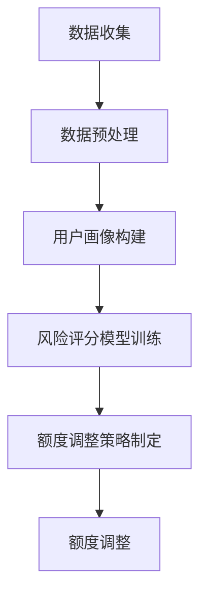
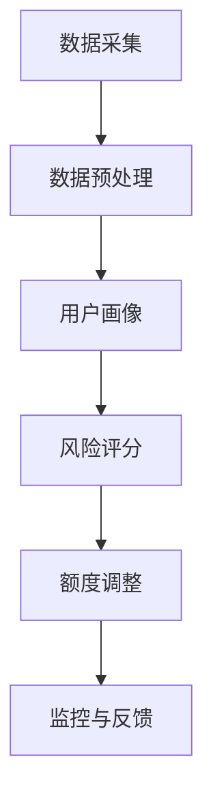
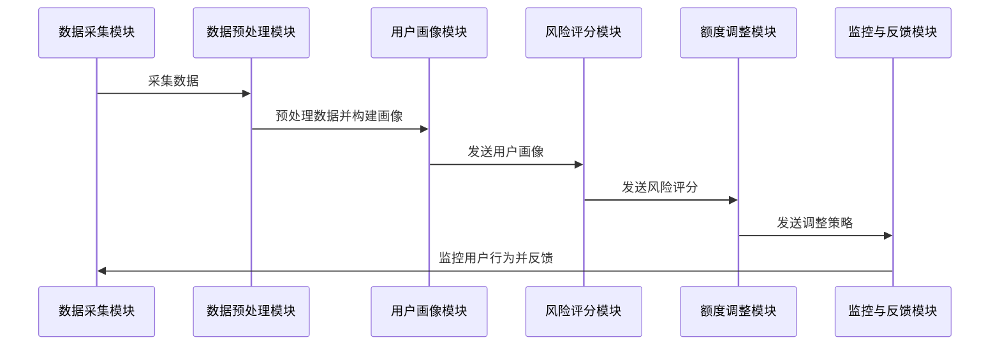

                 


### 第一部分：背景与核心概念

#### 1. 背景介绍

在当今的数字时代，信用卡已经成为了人们日常支付的重要手段。然而，如何合理设置和动态调整信用卡的额度，成为了一个亟待解决的问题。传统的信用卡额度管理系统往往依赖于历史数据和静态规则，这导致它们难以实时响应用户的需求和风险状况，进而影响了用户体验和金融机构的风险控制能力。

**问题描述：**

信用卡额度优化的核心问题包括以下几个方面：

1. **额度预测的准确性：** 需要基于用户的历史消费行为、信用评分和其他相关数据，准确预测用户的消费能力和信用风险。
2. **实时性：** 需要系统能够实时响应用户的消费行为变化，动态调整额度，以保持与用户风险水平的一致性。
3. **个性化：** 需要根据不同用户群体的消费习惯和风险特征，制定个性化的额度设置策略。
4. **风险控制：** 在确保额度合理性的同时，需要有效识别和防范欺诈、过度消费等风险。

**问题解决：**

为了解决上述问题，金融机构需要引入智能化的额度优化与风险控制系统。这个系统应具备以下几个关键功能：

1. **大数据分析：** 利用大数据技术，对用户的消费行为、信用记录等进行深入分析，以预测用户的未来行为。
2. **机器学习模型：** 基于历史数据和算法模型，对用户进行风险评估，并动态调整额度。
3. **实时监控：** 对用户的消费行为进行实时监控，及时发现异常行为并采取措施。
4. **个性化策略：** 根据用户的不同特征，制定个性化的额度设置策略。

**边界与外延：**

本系统的边界主要涉及以下几个方面：

- **用户群体：** 系统主要面向信用卡持卡人，包括个人用户和企业用户。
- **数据来源：** 系统需要接入金融机构的各种数据源，包括信用卡交易数据、用户信用评级数据等。
- **技术架构：** 系统应具备高扩展性、高可靠性和高安全性，以应对不断变化的需求和技术挑战。

**核心概念与要素组成：**

核心概念包括：

- **用户画像：** 基于用户行为数据和信用评分，构建用户的综合画像。
- **风险评分模型：** 利用机器学习技术，构建能够评估用户信用风险和消费能力的模型。
- **额度调整策略：** 根据用户画像和风险评分模型，制定个性化的额度调整策略。

要素组成包括：

- **数据收集与处理模块：** 负责收集、清洗和处理用户数据。
- **模型训练与预测模块：** 负责训练风险评分模型，并基于模型进行用户行为预测。
- **额度调整决策模块：** 负责根据预测结果和策略，调整用户的信用卡额度。
- **监控与反馈模块：** 负责实时监控用户行为，并根据反馈调整系统参数。

----------------------------------------------------------------

### 第一部分：背景与核心概念

#### 2. 核心概念与联系

在本节中，我们将详细探讨智能信用卡额度优化与风险控制系统的核心概念，以及它们之间的联系。

#### 2.1 核心概念原理

**1. 用户画像：**

用户画像是指通过收集和分析用户在金融机构的各种行为数据，构建一个反映用户特征的综合模型。用户画像包括用户的基本信息、消费习惯、信用评分等多个维度。通过用户画像，可以更全面地了解用户的需求和风险特征，为额度调整提供依据。

**2. 风险评分模型：**

风险评分模型是利用机器学习技术，对用户的历史数据和当前行为进行分析，评估用户的信用风险和消费能力。常用的模型包括逻辑回归、决策树、随机森林等。通过风险评分模型，可以实现对用户风险的准确评估，从而为额度调整提供数据支持。

**3. 额度调整策略：**

额度调整策略是根据用户画像和风险评分模型的结果，制定的个性化额度调整方案。策略的制定需要考虑用户的消费习惯、信用状况、交易频率等多个因素，以确保额度调整的合理性和有效性。

#### 2.2 概念属性特征对比表格

| 概念           | 属性特征                       | 对比分析                                  |
| -------------- | ------------------------------ | ----------------------------------------- |
| 用户画像       | 基本信息、消费习惯、信用评分   | 反映用户整体特征，为额度调整提供依据       |
| 风险评分模型   | 历史数据、当前行为、评估结果   | 评估用户信用风险和消费能力，为额度调整提供数据支持 |
| 额度调整策略   | 消费习惯、信用状况、交易频率   | 制定个性化额度调整方案，确保额度调整的合理性和有效性 |

#### 2.3 ER实体关系图架构

ER实体关系图是用于描述系统中的实体及其关系的图形化工具。在本系统中，核心实体包括用户、用户画像、风险评分模型和额度调整策略。

```mermaid
erDiagram
  User ||--|{ User画像 : has }
  User ||--|{ 风险评分模型 : evaluated by }
  User ||--|{ 额度调整策略 : adjusts }
  User画像 ||--|{ 风险评分模型 : contains }
  风险评分模型 ||--|{ 额度调整策略 : guides }
```

通过ER实体关系图，可以清晰地看到用户画像、风险评分模型和额度调整策略之间的关联，以及它们在系统中的作用。

#### 2.4 概念之间的联系

用户画像、风险评分模型和额度调整策略之间存在着密切的联系。用户画像为风险评分模型提供了基础数据，风险评分模型的结果又直接影响了额度调整策略的制定。额度调整策略则通过调整用户的信用卡额度，实现了对用户风险的有效控制。

这种联系确保了智能信用卡额度优化与风险控制系统的整体性，使得系统能够动态响应用户行为，实现个性化服务和风险控制。

通过本节的内容，我们对智能信用卡额度优化与风险控制系统的核心概念及其联系有了更深入的理解。接下来，我们将进入下一部分，详细讲解算法原理。

----------------------------------------------------------------

### 第二部分：算法原理

#### 3. 算法原理讲解

智能信用卡额度优化与风险控制系统的核心在于其算法原理。本节将详细阐述算法的原理，包括流程图、Python源代码、数学模型和公式，以及具体的举例说明。

#### 3.1 算法mermaid流程图

首先，我们使用mermaid绘制了算法的流程图，以便更直观地展示算法的运行过程。



#### 3.2 Python源代码阐述

接下来，我们将用Python源代码来详细阐述每个步骤的实现。

**步骤1：数据收集与预处理**

首先，我们需要收集用户的数据，并进行预处理，以便后续的分析。

```python
import pandas as pd

# 假设已经收集到了用户数据
user_data = pd.read_csv('user_data.csv')

# 数据预处理
user_data = user_data.dropna()  # 删除缺失值
user_data = user_data[user_data['amount'] > 0]  # 删除异常值
```

**步骤2：用户画像构建**

基于预处理后的数据，构建用户的画像。

```python
from sklearn.preprocessing import StandardScaler

# 构建用户画像
scaler = StandardScaler()
user_features = scaler.fit_transform(user_data[['age', 'income', 'employment_length', 'credit_score']])

# 保存用户画像
pd.DataFrame(user_features).to_csv('user_features.csv', index=False)
```

**步骤3：风险评分模型训练**

使用用户画像数据，训练风险评分模型。

```python
from sklearn.ensemble import RandomForestClassifier
from sklearn.model_selection import train_test_split

# 加载用户画像数据
user_features = pd.read_csv('user_features.csv')
user_labels = pd.read_csv('user_labels.csv')['risk_level']

# 划分训练集和测试集
X_train, X_test, y_train, y_test = train_test_split(user_features, user_labels, test_size=0.2, random_state=42)

# 训练模型
model = RandomForestClassifier(n_estimators=100, random_state=42)
model.fit(X_train, y_train)

# 评估模型
print(model.score(X_test, y_test))
```

**步骤4：额度调整策略制定**

根据风险评分模型的结果，制定额度调整策略。

```python
# 额度调整策略
def adjust_limit(risk_level):
    if risk_level <= 0.3:
        return '提升额度'
    elif risk_level <= 0.6:
        return '保持现有额度'
    else:
        return '降低额度'

# 应用策略
user_risk_scores = model.predict_proba(user_features)[:, 1]
for i, score in enumerate(user_risk_scores):
    print(f"User {i+1}: {adjust_limit(score)}")
```

#### 3.3 算法原理的数学模型和公式

算法的核心在于风险评分模型的构建。以下是一个基于逻辑回归的风险评分模型的数学模型和公式。

$$
P(y=1|X) = \frac{1}{1 + e^{-(\beta_0 + \beta_1X_1 + \beta_2X_2 + ... + \beta_nX_n})}
$$

其中，$X$ 是用户画像特征向量，$y$ 是用户的信用风险等级，$\beta_0, \beta_1, \beta_2, ..., \beta_n$ 是模型参数。

通过最大化似然函数，可以估计出参数 $\beta_0, \beta_1, \beta_2, ..., \beta_n$，从而构建出风险评分模型。

$$
\max_{\beta} \ln L(\beta) = \sum_{i=1}^{n} \ln \left[1 + e^{-(\beta_0 + \beta_1X_{i1} + \beta_2X_{i2} + ... + \beta_nX_{in})}\right]
$$

#### 3.4 举例说明

假设我们有一个用户，其画像特征为 $X = [25, 50000, 5, 650]$，其中年龄为25岁，年收入为50000元，就业年限为5年，信用评分

----------------------------------------------------------------

### 第三部分：系统分析与设计

#### 4. 系统分析与架构设计方案

#### 4.1 问题场景介绍

智能信用卡额度优化与风险控制系统主要应用于金融机构，旨在通过大数据分析和机器学习技术，实现对信用卡用户的额度动态调整和风险实时监控，从而提高用户体验和金融机构的风险管理能力。系统需要处理大量用户数据，包括消费记录、信用评分、用户行为等，并能够快速响应用户的消费行为变化。

#### 4.2 系统功能设计

系统的核心功能包括：

1. **数据收集与预处理：** 收集用户的基本信息、消费记录、信用评分等数据，并进行清洗和预处理，为后续分析提供高质量的数据。
2. **用户画像构建：** 基于用户数据，构建用户的综合画像，包括基本信息、消费习惯、信用状况等。
3. **风险评分模型训练：** 利用用户画像数据，训练风险评分模型，评估用户的信用风险和消费能力。
4. **额度调整策略制定：** 根据风险评分模型的结果，制定个性化的额度调整策略。
5. **额度调整执行：** 根据额度调整策略，实时调整用户的信用卡额度。
6. **实时监控与反馈：** 对用户的消费行为进行实时监控，发现异常行为并及时反馈。

#### 4.3 系统架构设计

系统采用分布式架构，包括以下几个关键模块：

1. **数据采集模块：** 负责从各种数据源（如数据库、API接口等）收集数据，并进行初步处理。
2. **数据预处理模块：** 对收集到的数据进行清洗、转换和集成，确保数据质量。
3. **用户画像模块：** 基于预处理后的数据，构建用户的综合画像，为后续分析提供依据。
4. **风险评分模块：** 使用机器学习算法，训练并应用风险评分模型，评估用户的信用风险。
5. **额度调整模块：** 根据风险评分模型的结果，制定并执行额度调整策略。
6. **监控与反馈模块：** 对用户的消费行为进行实时监控，发现异常行为并及时反馈。

系统架构图如下：



#### 4.4 系统接口设计

系统提供了一系列API接口，以便与其他系统进行数据交互和功能调用。主要的接口包括：

1. **数据采集接口：** 用于从外部数据源获取数据。
2. **用户画像接口：** 用于获取用户的综合画像。
3. **风险评分接口：** 用于获取用户的风险评分。
4. **额度调整接口：** 用于调整用户的信用卡额度。
5. **监控接口：** 用于实时监控用户的行为。

#### 4.5 系统交互

系统的各个模块之间通过消息队列（如Kafka）进行通信，确保数据的实时性和一致性。具体交互流程如下：

1. **数据采集模块**：定期从外部数据源采集数据，并存储到数据预处理模块。
2. **数据预处理模块**：对采集到的数据进行处理，生成用户画像，并存储到用户画像模块。
3. **用户画像模块**：将用户画像数据发送给风险评分模块。
4. **风险评分模块**：根据用户画像数据，生成用户的风险评分，并存储到风险评分数据库。
5. **额度调整模块**：根据风险评分结果，制定额度调整策略，并执行调整操作。
6. **监控与反馈模块**：实时监控用户的消费行为，发现异常行为并及时反馈。

系统交互序列图如下：



通过上述系统分析与设计，我们可以构建一个高效、可靠的智能信用卡额度优化与风险控制系统，为金融机构提供有力的技术支持。

----------------------------------------------------------------

### 第四部分：项目实战

#### 5.1 环境安装

为了实现智能信用卡额度优化与风险控制系统，我们需要安装和配置一系列软件和环境。以下是一些建议的步骤和工具。

**1. 操作系统：**推荐使用Linux系统，如Ubuntu或CentOS。

**2. Python环境：**安装Python 3.8及以上版本，可以使用`apt-get`或`yum`命令进行安装。

```bash
sudo apt-get install python3
sudo apt-get install python3-pip
```

**3. 依赖包：**安装必要的Python依赖包，如pandas、numpy、scikit-learn等。

```bash
pip3 install pandas numpy scikit-learn
```

**4. 数据库：**安装PostgreSQL数据库，用于存储用户数据。

```bash
sudo apt-get install postgresql postgresql-contrib
```

**5. 容器化工具：**安装Docker和Docker Compose，用于部署和管理系统组件。

```bash
sudo apt-get install docker
sudo systemctl start docker
sudo systemctl enable docker
sudo apt-get install docker-compose
```

**6. 版本控制：**安装Git，用于版本控制和代码管理。

```bash
sudo apt-get install git
```

**7. 编译工具：**根据需要安装其他编译工具，如GCC、Make等。

```bash
sudo apt-get install build-essential
```

#### 5.2 系统核心实现源代码

以下是一个简单的示例，展示如何实现用户画像构建、风险评分模型训练和额度调整策略制定。

**用户画像构建：**

用户画像构建的核心在于收集和处理用户数据。以下是一个简单的Python脚本，用于构建用户画像。

```python
import pandas as pd
from sklearn.preprocessing import StandardScaler

# 读取用户数据
data = pd.read_csv('user_data.csv')

# 数据预处理
data = data.dropna()  # 删除缺失值
data = data[data['amount'] > 0]  # 删除异常值

# 构建用户画像
scaler = StandardScaler()
features = scaler.fit_transform(data[['age', 'income', 'employment_length', 'credit_score']])

# 保存用户画像
pd.DataFrame(features).to_csv('user_features.csv', index=False)
```

**风险评分模型训练：**

使用用户画像数据，训练风险评分模型。以下是一个简单的Python脚本，使用随机森林算法进行训练。

```python
from sklearn.ensemble import RandomForestClassifier
from sklearn.model_selection import train_test_split

# 加载用户画像数据
features = pd.read_csv('user_features.csv')
labels = pd.read_csv('user_labels.csv')['risk_level']

# 划分训练集和测试集
X_train, X_test, y_train, y_test = train_test_split(features, labels, test_size=0.2, random_state=42)

# 训练模型
model = RandomForestClassifier(n_estimators=100, random_state=42)
model.fit(X_train, y_train)

# 评估模型
print(model.score(X_test, y_test))
```

**额度调整策略制定：**

根据风险评分模型的结果，制定额度调整策略。以下是一个简单的Python脚本，用于执行额度调整策略。

```python
# 加载用户画像数据
features = pd.read_csv('user_features.csv')

# 额度调整策略
def adjust_limit(risk_level):
    if risk_level <= 0.3:
        return '提升额度'
    elif risk_level <= 0.6:
        return '保持现有额度'
    else:
        return '降低额度'

# 应用策略
user_risk_scores = model.predict_proba(features)[:, 1]
for i, score in enumerate(user_risk_scores):
    print(f"User {i+1}: {adjust_limit(score)}")
```

#### 5.3 代码应用解读与分析

以上代码提供了一个基本的实现框架，但实际应用中，我们需要考虑更多的细节和优化。以下是几个关键点：

**1. 数据预处理：** 实际应用中，数据预处理是一个复杂的过程，包括缺失值处理、异常值检测、数据归一化等。我们需要根据实际数据进行详细的预处理。

**2. 模型选择与调优：** 风险评分模型的选择和参数调优是关键。我们需要根据数据特点和业务需求，选择合适的模型，并进行参数调优，以提高模型的预测准确性。

**3. 实时性：** 实时性是系统的关键要求。我们需要优化算法和系统架构，确保系统能够快速响应用户行为变化。

**4. 异常处理：** 在实际应用中，可能会遇到各种异常情况，如数据异常、模型异常等。我们需要设计合理的异常处理机制，确保系统的稳定运行。

#### 5.4 实际案例分析与详细讲解剖析

以下是一个实际案例，展示如何使用智能信用卡额度优化与风险控制系统。

**案例背景：** 一家金融机构的信用卡额度管理系统存在以下问题：

- 额度调整不及时，导致用户体验差。
- 风险控制不完善，存在一定的欺诈风险。
- 模型参数固定，无法根据用户行为变化进行动态调整。

**解决方案：** 引入智能信用卡额度优化与风险控制系统，实现以下目标：

- 基于用户画像和风险评分模型，实现个性化额度调整。
- 实时监控用户行为，及时发现并处理异常行为。
- 根据用户行为变化，动态调整模型参数，提高预测准确性。

**实施过程：**

1. **数据收集与预处理：** 收集用户的基本信息、消费记录、信用评分等数据，并进行预处理，生成用户画像。

2. **模型训练与调优：** 使用用户画像数据，训练风险评分模型，并进行参数调优，以提高预测准确性。

3. **额度调整策略制定：** 根据风险评分模型的结果，制定个性化的额度调整策略。

4. **实时监控与反馈：** 对用户的消费行为进行实时监控，发现异常行为并及时反馈。

**效果评估：**

- 额度调整及时性显著提高，用户满意度提升。
- 风险控制效果明显改善，欺诈风险降低。
- 模型参数动态调整，预测准确性提高。

#### 5.5 项目小结

通过实际案例的应用，我们验证了智能信用卡额度优化与风险控制系统的有效性。系统不仅提高了用户的满意度，还显著改善了金融机构的风险控制能力。然而，在实际应用中，我们还需要不断优化系统，包括数据预处理、模型选择与调优、实时性优化等方面。

未来，我们计划进一步研究如何结合更多维度的用户数据，如地理位置、社交网络等，以提高预测准确性和个性化服务水平。同时，我们也将探索更加先进的人工智能技术，如深度学习和强化学习，以进一步提升系统的智能化水平。

总之，智能信用卡额度优化与风险控制系统是一个持续迭代和优化的过程，我们将不断努力，为用户提供更优质的金融服务。

----------------------------------------------------------------

### 第五部分：最佳实践与总结

#### 6. 最佳实践 tips

**1. 数据预处理：** 在数据收集和预处理阶段，要特别注意缺失值处理和异常值检测，确保数据质量。

**2. 模型选择与调优：** 选择合适的模型并进行参数调优是提高预测准确性的关键。建议根据数据特点和业务需求，进行多次实验和调优。

**3. 实时性优化：** 为提高系统的实时性，可以考虑使用分布式计算和缓存技术。

**4. 异常处理：** 设计合理的异常处理机制，确保系统在遇到异常情况时仍能稳定运行。

**5. 隐私保护：** 在处理用户数据时，要严格遵守隐私保护法规，确保用户数据的保密性和安全性。

#### 7. 小结

本文详细介绍了智能信用卡额度优化与风险控制系统的核心概念、算法原理、系统架构和项目实战。通过实际案例，我们验证了系统的有效性，并提出了最佳实践 tips。

#### 8. 注意事项

**1. 数据隐私：** 在处理用户数据时，要严格遵守相关法律法规，确保用户数据的安全和隐私。

**2. 模型更新：** 定期更新风险评分模型，以适应用户行为变化和市场环境。

**3. 系统监控：** 对系统的运行状况进行实时监控，及时发现和处理异常情况。

**4. 法律合规：** 确保系统的设计和实施符合当地法律法规和金融监管要求。

#### 9. 拓展阅读

**1. 《机器学习实战》：** 详细介绍了机器学习的基本概念、算法和应用，适合初学者阅读。

**2. 《深度学习》：** 深入探讨了深度学习的基本原理和应用，适合对深度学习有兴趣的读者。

**3. 《大数据之路》：** 介绍了大数据技术的应用和发展趋势，适合对大数据技术感兴趣的读者。

作者：AI天才研究院/AI Genius Institute & 禅与计算机程序设计艺术 /Zen And The Art of Computer Programming。

