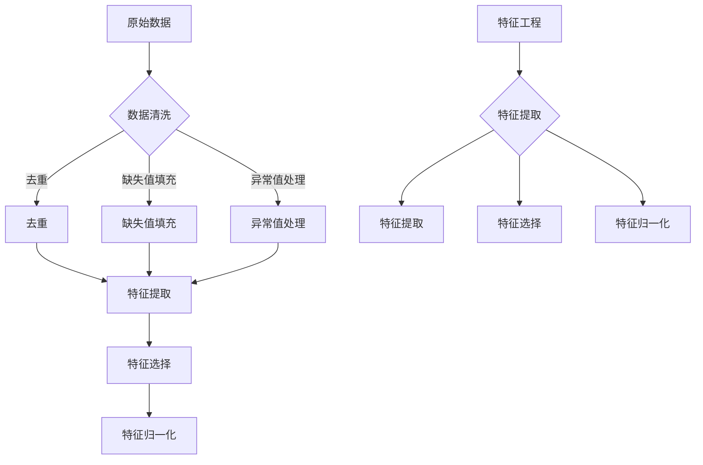
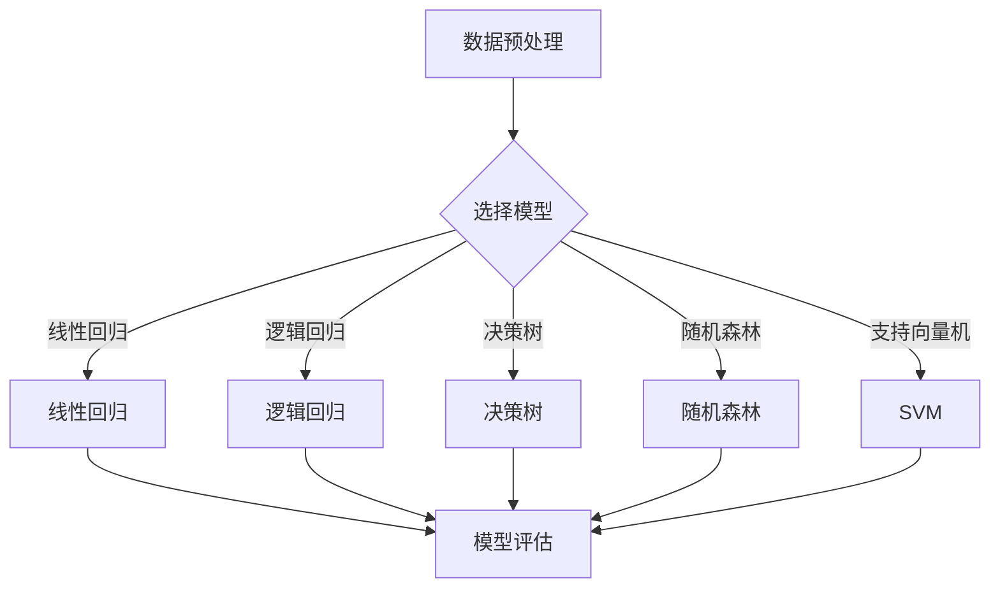
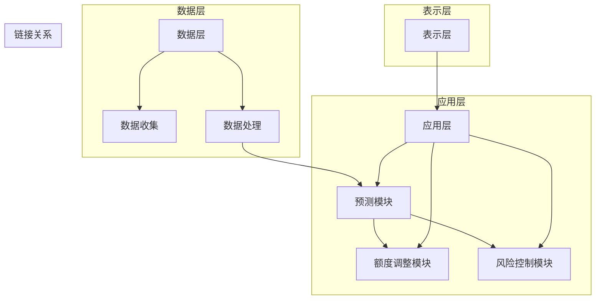
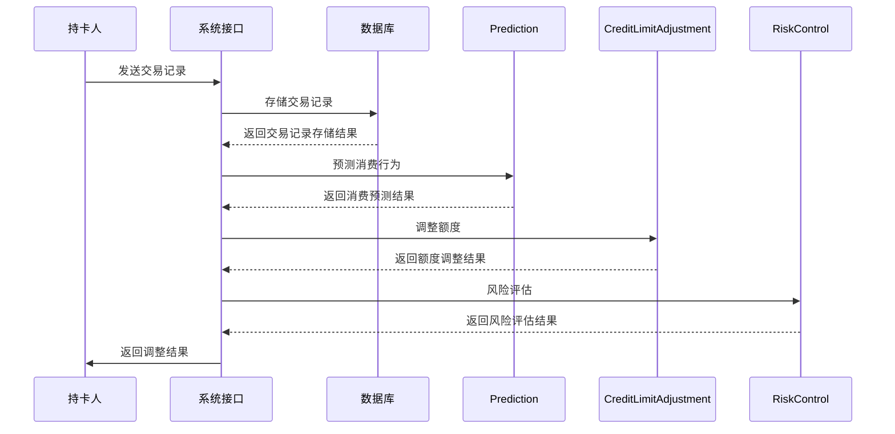
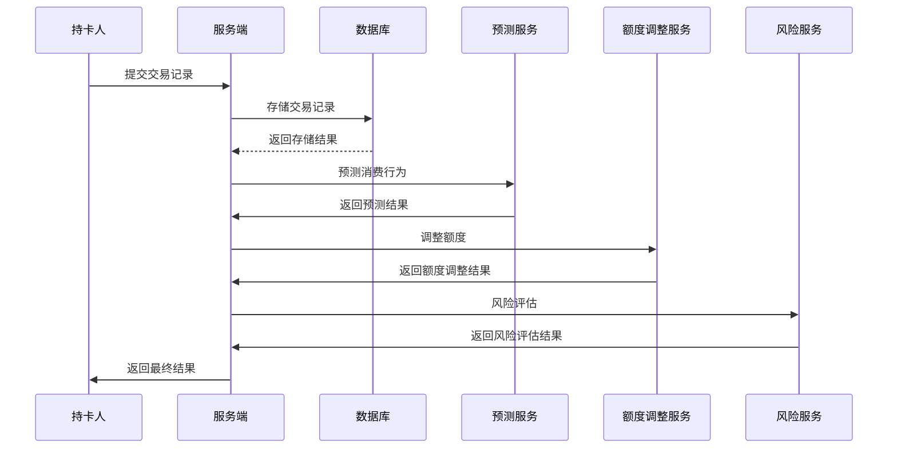

                 

### 第1章 背景介绍

#### 1.1 问题背景

**1.1.1 信用卡额度优化的重要性**

随着信用卡业务的普及，信用卡额度优化已成为银行和持卡人共同关注的问题。信用卡额度优化不仅仅是提高用户满意度，更是银行风险管理的重要环节。优化信用卡额度有助于降低银行的风险成本，提高资产利用率，同时也能增强用户的忠诚度和满意度。

- **概念解释：** 信用卡额度优化指的是根据持卡人的消费行为、信用评分等因素，动态调整信用卡的信用额度，以达到既满足持卡人需求，又能有效控制银行风险的目的。

- **边界与外延：** 信用卡额度优化涉及银行、持卡人、第三方支付平台等多个方面，既包括线上消费数据，也涵盖线下交易信息。

**1.1.2 当前信用卡额度优化存在的问题**

- **问题描述：** 当前信用卡额度优化主要依赖于人工判断和历史数据，存在以下问题：
  - **反应速度慢：** 无法实时调整额度，导致用户体验差。
  - **数据处理能力有限：** 无法充分利用大数据和人工智能技术，导致额度调整不合理。
  - **风险控制不足：** 对于高风险客户，额度调整机制不够敏感。

- **问题解决：** 利用大数据分析和人工智能算法，对持卡人消费行为进行实时分析，动态调整信用卡额度，以提高用户体验和风险控制能力。

#### 1.2 智能信用卡额度优化管理系统的目标

**1.2.1 提高用户体验**

- **目标设定：** 通过智能信用卡额度优化管理系统，使持卡人的信用卡使用更加便捷，额度调整更加灵活，从而提高用户体验。

- **解决方案：** 采用大数据分析和人工智能技术，实时监测持卡人的消费行为，根据消费习惯和风险情况，动态调整信用卡额度。

**1.2.2 降低银行风险**

- **目标设定：** 通过智能信用卡额度优化管理系统，降低银行的风险成本，提高资产利用率。

- **解决方案：** 利用信用评分模型和风险控制算法，对持卡人的信用风险进行精确评估，对高风险客户进行额度调整，从而降低银行的风险。

#### 1.3 智能信用卡额度优化管理系统的核心功能

**1.3.1 消费行为分析**

- **功能描述：** 对持卡人的消费行为进行深入分析，包括消费金额、消费时间、消费地点、消费类别等。

- **解决方案：** 利用大数据技术和机器学习算法，对消费数据进行挖掘和分析，预测持卡人的未来消费趋势。

**1.3.2 风险评估与控制**

- **功能描述：** 对持卡人的信用风险进行评估，并采取相应的控制措施，如调整额度、限制交易等。

- **解决方案：** 采用信用评分模型和风险控制算法，对持卡人的信用风险进行实时监控和评估。

**1.3.3 额度调整**

- **功能描述：** 根据消费行为分析和风险评估结果，动态调整信用卡额度。

- **解决方案：** 利用智能算法，根据持卡人的消费行为和信用评分，自动调整信用卡额度。

### 1.4 智能信用卡额度优化管理系统的优势

**1.4.1 实时性**

- **优势描述：** 通过大数据分析和人工智能算法，可以实现实时监控和调整信用卡额度，提高用户的满意度。

**1.4.2 高效性**

- **优势描述：** 利用机器学习算法，可以高效地对大量消费数据进行处理和分析，快速实现额度调整。

**1.4.3 风险控制**

- **优势描述：** 通过对持卡人消费行为的深入分析，可以有效识别高风险客户，从而降低银行的风险成本。

**1.4.4 个性化服务**

- **优势描述：** 根据持卡人的消费习惯和风险情况，提供个性化的额度调整方案，提高用户的满意度。

### 1.5 本章小结

本章介绍了智能信用卡额度优化管理系统的背景和重要性，分析了当前信用卡额度优化存在的问题，并提出了智能信用卡额度优化管理系统的目标、核心功能和优势。通过本章的介绍，读者可以了解智能信用卡额度优化管理系统的基本概念和架构，为后续章节的深入分析奠定基础。

## 第2章 核心概念与联系

### 2.1 消费行为分析

**2.1.1 消费行为分析的定义**

消费行为分析是指通过对持卡人的消费数据进行挖掘和分析，以理解其消费行为模式、偏好和趋势，从而为信用卡额度优化提供数据支持。

- **概念解释：** 消费行为分析是一种利用大数据技术和统计分析方法，对持卡人的消费行为进行深入挖掘和解读的过程。其目的是通过分析消费数据，识别消费模式，预测未来的消费趋势，并为银行提供调整信用卡额度的依据。

- **边界与外延：** 消费行为分析不仅涉及线上交易数据，还包括线下消费行为，如实体店的刷卡交易、ATM取款等。同时，它还涉及跨渠道的数据整合和分析，以全面了解持卡人的消费行为。

**2.1.2 消费行为分析的重要性**

- **重要性描述：** 消费行为分析对于信用卡额度优化具有重要意义。首先，它可以帮助银行更好地了解客户需求，从而提供更加个性化的服务。其次，通过分析消费行为，银行可以更准确地评估客户的信用风险，进而优化额度调整策略，提高风险控制能力。

- **应用场景：** 消费行为分析在信用卡业务中的应用场景广泛，包括：
  - 信用卡额度调整：根据消费行为分析的结果，动态调整信用卡额度，以满足持卡人的需求。
  - 风险评估：通过消费行为分析，识别高风险客户，采取相应的风险控制措施。
  - 客户关系管理：利用消费行为分析，了解客户的偏好和需求，提升客户体验。

**2.1.3 消费行为分析的核心要素**

- **核心要素描述：**
  - **消费金额：** 每次交易的消费金额，反映客户的消费能力。
  - **消费时间：** 每次交易发生的时间，反映客户的消费频率和习惯。
  - **消费地点：** 每次交易的地点，如商店名称、城市等，反映客户的消费地域分布。
  - **消费类别：** 每次交易的商品或服务类别，如餐饮、购物、旅游等，反映客户的消费偏好。

- **对比表格：**

  | 消费要素  | 描述                                      | 意义                  |
  | --------- | ----------------------------------------- | --------------------- |
  | 消费金额  | 每次交易的消费金额                        | 反映消费能力          |
  | 消费时间  | 每次交易的时间                            | 反映消费频率          |
  | 消费地点  | 每次交易的地点                            | 反映消费地域          |
  | 消费类别  | 每次交易的商品或服务类别                  | 反映消费偏好          |

**2.1.4 消费行为分析的步骤**

- **步骤描述：**
  1. **数据收集：** 收集持卡人的消费交易数据，包括线上和线下交易。
  2. **数据预处理：** 清洗数据，处理缺失值、异常值，进行特征工程。
  3. **数据挖掘：** 利用统计学方法和机器学习算法，挖掘消费行为模式。
  4. **结果分析：** 分析消费行为，识别消费趋势和风险，为额度调整提供依据。

### 2.2 信用评分模型

**2.2.1 信用评分模型的基本原理**

信用评分模型是一种基于历史数据和统计方法，对持卡人的信用风险进行量化评估的模型。其核心目的是通过分析客户的消费行为、信用记录等因素，预测客户在未来一段时间内的信用风险。

- **概念解释：** 信用评分模型通过构建数学模型，将客户的信用风险转化为一个数值评分，该评分用于评估客户是否具有按时偿还信用卡债务的能力。

- **数学模型：**
  - **逻辑回归模型：** 通过建立客户特征与信用评分之间的线性关系，预测客户的信用风险。
    $$ \text{Credit Score} = \beta_0 + \sum_{i=1}^{n} \beta_i \cdot X_i $$
    其中，$\beta_0$ 为截距，$\beta_i$ 为第 $i$ 个特征系数，$X_i$ 为第 $i$ 个特征值。

  - **决策树模型：** 通过树形结构对数据进行划分，将客户的信用风险分类。
    $$ \text{Decision Tree} = \text{split}(X_1, X_2, \ldots, X_n) $$
    其中，$X_1, X_2, \ldots, X_n$ 为特征变量。

- **应用场景：** 信用评分模型在信用卡业务中的应用广泛，包括：
  - **额度调整：** 根据信用评分，动态调整信用卡额度。
  - **风险评估：** 对新客户进行信用评估，决定是否批准信用卡申请。
  - **风险控制：** 监控客户的信用行为，及时发现潜在风险。

**2.2.2 信用评分模型的构建过程**

- **步骤描述：**
  1. **数据收集：** 收集客户的信用历史数据，包括信用记录、消费行为等。
  2. **数据预处理：** 清洗数据，处理缺失值、异常值，进行特征工程。
  3. **特征选择：** 选择对信用评分有显著影响的特征，进行特征选择。
  4. **模型训练：** 使用训练数据集，通过机器学习算法训练信用评分模型。
  5. **模型评估：** 使用测试数据集评估模型的准确性和泛化能力。
  6. **模型部署：** 将训练好的模型部署到生产环境中，进行实时信用评分。

**2.2.3 信用评分模型与消费行为分析的联系**

- **联系描述：** 消费行为分析是信用评分模型的重要输入，通过分析客户的消费行为，可以更全面地了解客户的信用风险。信用评分模型则将消费行为分析的结果量化为信用评分，用于指导信用卡额度调整和风险管理。

- **协同作用：**
  - **额度调整：** 消费行为分析提供客户消费习惯的数据支持，信用评分模型提供客户信用风险的量化评估，两者结合，可以实现更加精准和个性化的额度调整。
  - **风险控制：** 消费行为分析可以帮助识别高风险客户，信用评分模型可以进一步评估客户的信用风险，共同提高银行的风险控制能力。

### 2.3 本章小结

本章介绍了消费行为分析和信用评分模型的基本概念、原理和应用。消费行为分析通过挖掘持卡人的消费数据，为信用评分模型提供数据支持；而信用评分模型则通过量化评估客户的信用风险，为信用卡额度调整和风险管理提供依据。通过本章的学习，读者可以了解消费行为分析和信用评分模型在智能信用卡额度优化管理系统中的重要作用，为后续章节的深入分析奠定基础。

### 第3章 算法原理讲解

#### 3.1 数据预处理

数据预处理是机器学习项目中的关键步骤，它涉及数据清洗、特征工程等多个方面。在本章中，我们将详细讲解数据预处理的过程，并使用Mermaid流程图和Python代码来具体说明。

**3.1.1 数据清洗**

数据清洗是数据预处理的第一步，它的目标是去除数据中的噪声和不一致项，提高数据质量。

- **去重（Deduplication）：**
  - **问题描述：** 数据集中可能存在重复的记录，这会影响模型的训练效果。
  - **解决方案：** 使用Python中的pandas库来去除重复的记录。
    ```python
    import pandas as pd

    # 假设df是原始数据框
    df = df.drop_duplicates()
    ```

- **缺失值填充（Missing Value Imputation）：**
  - **问题描述：** 数据集中可能存在缺失值，这会导致模型无法训练。
  - **解决方案：** 使用均值、中位数或使用模型预测来填充缺失值。
    ```python
    df.fillna(df.mean(), inplace=True)
    ```

- **异常值处理（Outlier Detection and Handling）：**
  - **问题描述：** 数据集中可能存在异常值，这些值会影响模型的准确性和稳定性。
  - **解决方案：** 使用统计学方法（如IQR法）或机器学习方法（如基于聚类的方法）来检测和去除异常值。
    ```python
    from scipy import stats

    df = df[~((df - df.mean()).abs() > 3 * df.std())]
    ```

**3.1.2 特征工程**

特征工程是数据预处理的重要组成部分，它包括特征提取、特征选择和特征归一化等步骤。

- **特征提取（Feature Extraction）：**
  - **问题描述：** 原始数据中可能没有直接用于建模的特征。
  - **解决方案：** 使用Python中的scikit-learn库来提取特征。
    ```python
    from sklearn.preprocessing import PolynomialFeatures

    poly = PolynomialFeatures(degree=2)
    df = poly.fit_transform(df)
    ```

- **特征选择（Feature Selection）：**
  - **问题描述：** 特征数量过多会导致过拟合，影响模型性能。
  - **解决方案：** 使用递归特征消除（RFE）或基于信息增益的方法来选择特征。
    ```python
    from sklearn.feature_selection import RFE
    from sklearn.linear_model import LogisticRegression

    selector = RFE(LogisticRegression(), n_features_to_select=5)
    df = selector.fit_transform(df, y)
    ```

- **特征归一化（Feature Scaling）：**
  - **问题描述：** 不同特征的数据量级差异可能影响模型的训练效果。
  - **解决方案：** 使用标准化或归一化方法来调整特征的范围。
    ```python
    from sklearn.preprocessing import StandardScaler

    scaler = StandardScaler()
    df = scaler.fit_transform(df)
    ```

**3.1.3 Mermaid流程图**

以下是数据预处理过程的Mermaid流程图：



通过上述流程，我们可以确保数据预处理的质量，为后续的机器学习模型训练打下坚实的基础。

#### 3.2 模型选择与训练

在构建智能信用卡额度优化管理系统时，选择合适的模型并进行有效的训练是关键步骤。本节将详细介绍模型选择与训练的过程，包括模型选择、模型训练与评估，以及详细的mermaid流程图和Python代码示例。

**3.2.1 模型选择**

模型选择是机器学习项目中的核心环节，选择合适的模型对于提高预测准确性和效率至关重要。在选择模型时，我们需要考虑数据的特点、模型的理论基础以及模型的复杂性。

- **问题描述：** 数据预处理后，我们需要选择一个合适的机器学习模型来预测信用卡额度。
- **解决方案：** 可以尝试多种机器学习模型，如线性回归、逻辑回归、决策树、随机森林、支持向量机（SVM）等。

**3.2.2 模型选择流程**

以下是模型选择的mermaid流程图：



**3.2.3 模型训练与评估**

选择模型后，我们需要对其进行训练和评估，以确保模型能够准确地预测信用卡额度。

- **问题描述：** 需要训练所选模型，并在测试集上进行评估。
- **解决方案：** 使用Python中的scikit-learn库来训练和评估模型。

以下是模型训练与评估的Python代码示例：

```python
from sklearn.model_selection import train_test_split
from sklearn.metrics import mean_squared_error

# 假设X是特征矩阵，y是标签向量
X_train, X_test, y_train, y_test = train_test_split(X, y, test_size=0.2, random_state=42)

# 选择模型并训练
model = LinearRegression()
model.fit(X_train, y_train)

# 预测和评估
y_pred = model.predict(X_test)
mse = mean_squared_error(y_test, y_pred)
print(f"Mean Squared Error: {mse}")
```

**3.2.4 模型评估指标**

评估模型性能常用的指标包括均方误差（MSE）、均方根误差（RMSE）、决定系数（R²）等。

- **均方误差（MSE）：**
  $$ \text{MSE} = \frac{1}{n} \sum_{i=1}^{n} (y_i - \hat{y}_i)^2 $$
  - **意义：** 衡量预测值与真实值之间的差异。
- **均方根误差（RMSE）：**
  $$ \text{RMSE} = \sqrt{\text{MSE}} $$
  - **意义：** 衡量预测值与真实值之间的平均偏差。
- **决定系数（R²）：**
  $$ R^2 = 1 - \frac{\sum_{i=1}^{n} (y_i - \hat{y}_i)^2}{\sum_{i=1}^{n} (y_i - \bar{y})^2} $$
  - **意义：** 衡量模型对数据的拟合程度。

**3.2.5 模型优化**

模型评估后，我们可能需要对其进行优化，以提高预测性能。

- **问题描述：** 模型在测试集上的性能可能不理想。
- **解决方案：** 调整模型参数或选择更复杂的模型。

以下是模型优化的Python代码示例：

```python
from sklearn.model_selection import GridSearchCV
from sklearn.linear_model import Ridge

# 参数网格搜索
param_grid = {'alpha': [0.1, 1, 10, 100]}
ridge = Ridge()
grid_search = GridSearchCV(ridge, param_grid, cv=5)
grid_search.fit(X_train, y_train)

# 优化后的模型
best_model = grid_search.best_estimator_
y_pred_optimized = best_model.predict(X_test)
mse_optimized = mean_squared_error(y_test, y_pred_optimized)
print(f"Optimized Mean Squared Error: {mse_optimized}")
```

通过上述步骤，我们可以选择合适的模型、训练模型并进行优化，从而为智能信用卡额度优化管理系统提供可靠的技术支持。

### 3.3 数学模型和数学公式

在智能信用卡额度优化管理系统中，数学模型和数学公式是理解和管理信用卡额度优化过程的核心。以下我们将详细讲解这些模型和公式，并使用Python代码进行举例说明。

#### 3.3.1 消费行为预测模型

消费行为预测模型是智能信用卡额度优化管理系统中的基础。它旨在通过分析历史消费数据，预测未来某个时间段的消费金额。以下是一个基于时间序列分析的简单线性模型：

**数学公式：**

$$
\hat{C}_{t+k} = \alpha_t + \beta_t \cdot \text{seasonality}(t+k) + \gamma_t \cdot \text{trend}(t+k)
$$

其中：
- $\hat{C}_{t+k}$：预测的第$t+k$个时间点的消费金额。
- $\alpha_t$：当前时间点的消费水平。
- $\beta_t$：季节性影响系数。
- $\gamma_t$：趋势影响系数。

**Python代码示例：**

```python
import numpy as np
import pandas as pd
from sklearn.linear_model import LinearRegression

# 假设df是消费数据的时间序列，包含日期和消费金额
df = pd.DataFrame({'date': pd.date_range(start='2021-01-01', periods=100), 'amount': np.random.rand(100)})

# 时间序列转换
df['month'] = df['date'].dt.month
df['dayofyear'] = df['date'].dt.dayofyear

# 线性回归模型
model = LinearRegression()
model.fit(df[['month', 'dayofyear']], df['amount'])

# 预测
prediction = model.predict([[next_month, next_dayofyear]])
print(f"Predicted amount: {prediction[0]}")
```

#### 3.3.2 信用评分模型

信用评分模型用于评估持卡人的信用风险，并将其转换为信用评分。以下是一个基于逻辑回归的信用评分模型：

**数学公式：**

$$
\text{Credit Score} = \beta_0 + \sum_{i=1}^{n} \beta_i \cdot X_i
$$

其中：
- $\text{Credit Score}$：信用评分。
- $\beta_0$：截距。
- $\beta_i$：特征系数。
- $X_i$：第$i$个特征值。

**Python代码示例：**

```python
import pandas as pd
from sklearn.linear_model import LogisticRegression

# 假设df是特征数据，包括信用评分和特征
df = pd.DataFrame({
    'credit_score': [700, 650, 720, 680],
    'income': [50000, 30000, 80000, 40000],
    'age': [30, 40, 35, 45]
})

# 逻辑回归模型
model = LogisticRegression()
model.fit(df[['income', 'age']], df['credit_score'])

# 预测
predicted_score = model.predict([[60000, 35]])
print(f"Predicted Credit Score: {predicted_score[0]}")
```

#### 3.3.3 额度调整模型

额度调整模型用于根据信用评分和消费行为预测，动态调整信用卡额度。以下是一个基于线性回归的额度调整模型：

**数学公式：**

$$
\text{Credit Limit} = \alpha_t + \beta_t \cdot \text{Credit Score} + \gamma_t \cdot \text{Prediction}
$$

其中：
- $\text{Credit Limit}$：信用卡额度。
- $\alpha_t$：当前时间点的额度水平。
- $\beta_t$：信用评分影响系数。
- $\gamma_t$：预测影响系数。
- $\text{Prediction}$：消费行为预测结果。

**Python代码示例：**

```python
import pandas as pd
from sklearn.linear_model import LinearRegression

# 假设df是包括信用评分、预测和当前额度水平的数据
df = pd.DataFrame({
    'credit_score': [700, 650, 720, 680],
    'prediction': [1500, 1200, 1800, 1300],
    'current_limit': [5000, 3000, 7000, 4000]
})

# 线性回归模型
model = LinearRegression()
model.fit(df[['credit_score', 'prediction']], df['current_limit'])

# 额度调整预测
predicted_limit = model.predict([[700, 1500]])
print(f"Predicted Credit Limit: {predicted_limit[0]}")
```

通过上述数学模型和公式的讲解以及Python代码示例，我们可以更好地理解智能信用卡额度优化管理系统的核心计算逻辑，并为系统的开发和优化提供理论基础。

### 第4章 系统分析与架构设计方案

#### 4.1 问题场景介绍

在信用卡业务中，银行面临着如何合理调整持卡人信用卡额度的问题。传统的信用卡额度调整方法主要依赖于人工判断和历史数据，存在反应速度慢、数据处理能力有限以及风险控制不足等问题。为了解决这些问题，银行需要一个智能信用卡额度优化管理系统，该系统能够利用大数据分析和人工智能技术，对持卡人的消费行为进行实时分析，动态调整信用卡额度。

**问题场景描述：**
- 银行需要实时监控持卡人的消费行为，包括消费金额、消费时间和消费地点等。
- 银行需要根据持卡人的信用评分和消费行为，动态调整信用卡额度。
- 银行需要有效识别高风险客户，采取相应的风险控制措施。

**系统目标：**
- 提高信用卡额度调整的实时性和准确性。
- 降低银行的风险成本，提高资产利用率。
- 提升用户的满意度和忠诚度。

#### 4.2 项目介绍

**项目名称：** 智能信用卡额度优化管理系统

**项目概述：** 
该系统利用大数据分析和人工智能技术，对持卡人的消费行为进行实时分析，并根据信用评分和消费行为预测，动态调整信用卡额度。系统主要包括以下模块：

- 数据收集模块：实时收集持卡人的消费交易数据。
- 数据处理模块：对收集到的数据进行清洗、预处理和特征工程。
- 预测模块：利用机器学习模型对持卡人的消费行为进行预测。
- 额度调整模块：根据预测结果和信用评分，动态调整信用卡额度。
- 风险控制模块：对高风险客户进行识别和控制。

**项目优势：**
- 提高信用卡额度调整的实时性和个性化程度。
- 提升银行的风险管理能力，降低风险成本。
- 提高用户的满意度和忠诚度。

#### 4.3 系统功能设计（领域模型类图）

以下是一个领域模型的Mermaid类图，用于描述系统的主要功能模块及其关系。

```mermaid
classDiagram
    Client <<类>> "持卡人"
    CreditCard <<类>> "信用卡"
    CreditRating <<类>> "信用评分"
    Transaction <<类>> "交易"
    RiskControl <<类>> "风险控制"
    DataCollection <<类>> "数据收集"
    DataProcessing <<类>> "数据处理"
    Prediction <<类>> "预测"
    CreditLimitAdjustment <<类>> "额度调整"

    Client o-- CreditCard
    Client o-- CreditRating
    Client o-- Transaction
    CreditCard o-- CreditRating
    CreditCard o-- Transaction
    DataCollection o-- Transaction
    DataProcessing o-- Transaction
    Prediction o-- Transaction
    CreditLimitAdjustment o-- CreditRating
    CreditLimitAdjustment o-- Prediction
    RiskControl o-- CreditRating
    RiskControl o-- CreditLimitAdjustment
```

**功能模块说明：**
- **Client（持卡人）：** 表示持卡人的信息，包括信用卡、信用评分和交易记录。
- **CreditCard（信用卡）：** 表示信用卡的基本信息，包括信用卡类型、额度等。
- **CreditRating（信用评分）：** 表示持卡人的信用评分，用于额度调整和风险管理。
- **Transaction（交易）：** 表示交易记录，包括消费金额、时间和地点。
- **DataCollection（数据收集）：** 负责收集交易数据。
- **DataProcessing（数据处理）：** 负责对交易数据进行清洗、预处理和特征工程。
- **Prediction（预测）：** 负责预测持卡人的消费行为。
- **CreditLimitAdjustment（额度调整）：** 负责根据预测结果和信用评分调整信用卡额度。
- **RiskControl（风险控制）：** 负责对高风险客户进行识别和控制。

#### 4.4 系统架构设计（Mermaid架构图）

以下是一个系统架构的Mermaid架构图，用于描述系统的总体结构和模块之间的关系。



**架构设计说明：**
- **数据层（DataLayer）：** 负责数据的收集、存储和管理。
- **应用层（ApplicationLayer）：** 负责系统的核心功能实现，包括预测、额度调整和风险控制。
- **表示层（PresentationLayer）：** 负责用户界面和交互。

#### 4.5 系统接口设计

系统接口设计是确保系统各个模块之间能够有效交互的关键。以下是一个简单的接口设计图，用于描述系统的主要接口和交互方式。



**接口设计说明：**
- **发送交易记录：** 持卡人将交易记录发送给系统接口。
- **存储交易记录：** 系统接口将交易记录存储到数据库。
- **消费预测：** 系统接口调用预测模块进行消费行为预测。
- **额度调整：** 根据预测结果，系统接口调用额度调整模块进行调整。
- **风险评估：** 系统接口调用风险控制模块进行风险评估。
- **返回结果：** 系统接口将调整结果和风险评估结果返回给持卡人。

#### 4.6 系统交互设计（Mermaid序列图）

以下是一个系统交互设计的Mermaid序列图，用于描述系统的主要交互流程。



**交互设计说明：**
- **提交交易记录：** 持卡人通过服务端提交交易记录。
- **存储和预测：** 服务端将交易记录存储到数据库，并调用预测服务进行消费行为预测。
- **额度调整和风险评估：** 根据预测结果，服务端调用额度调整服务和风险服务，进行额度调整和风险评估。
- **返回结果：** 服务端将调整结果和风险评估结果返回给持卡人。

通过上述系统分析与架构设计，我们为智能信用卡额度优化管理系统提供了一个全面的设计方案，为系统的开发实施提供了明确的指导和依据。

### 第5章 项目实战

#### 5.1 环境安装

在开始项目实战之前，我们需要搭建一个开发环境。以下是在Linux系统中安装必要的软件和工具的步骤。

**安装Python环境：**

首先，安装Python 3.8或更高版本：

```bash
sudo apt update
sudo apt install python3.8 python3.8-venv python3.8-pip
```

**安装必要的库：**

使用pip安装所需的库：

```bash
pip3 install pandas numpy scikit-learn matplotlib
```

**安装MySQL数据库：**

安装MySQL数据库，用于存储交易数据：

```bash
sudo apt install mysql-server
```

配置MySQL数据库，设置root用户密码，并创建一个新的数据库和用户：

```sql
CREATE DATABASE credit_card_db;
GRANT ALL PRIVILEGES ON credit_card_db.* TO 'credit_card_user'@'localhost' IDENTIFIED BY 'password';
FLUSH PRIVILEGES;
```

#### 5.2 系统核心实现源代码

以下是系统核心实现的源代码，包括数据收集、数据处理、预测、额度调整和风险控制模块。

**5.2.1 数据收集模块**

```python
import pandas as pd
import mysql.connector

# 数据收集
def collect_data():
    # 连接到MySQL数据库
    conn = mysql.connector.connect(
        host="localhost",
        user="credit_card_user",
        password="password",
        database="credit_card_db"
    )
    cursor = conn.cursor()

    # 查询交易记录
    cursor.execute("SELECT * FROM transactions")
    rows = cursor.fetchall()

    # 将查询结果转换为DataFrame
    df = pd.DataFrame(rows, columns=["id", "card_id", "amount", "date", "location"])

    # 关闭数据库连接
    cursor.close()
    conn.close()

    return df
```

**5.2.2 数据处理模块**

```python
import pandas as pd
from sklearn.preprocessing import StandardScaler

# 数据处理
def process_data(df):
    # 填充缺失值
    df.fillna(df.mean(), inplace=True)

    # 特征工程
    df['month'] = df['date'].dt.month
    df['dayofyear'] = df['date'].dt.dayofyear

    # 归一化
    scaler = StandardScaler()
    df[['amount', 'month', 'dayofyear']] = scaler.fit_transform(df[['amount', 'month', 'dayofyear']])

    return df
```

**5.2.3 预测模块**

```python
from sklearn.linear_model import LinearRegression
from sklearn.model_selection import train_test_split

# 预测消费行为
def predict_consumption(df):
    # 分割特征和标签
    X = df[['month', 'dayofyear']]
    y = df['amount']

    # 划分训练集和测试集
    X_train, X_test, y_train, y_test = train_test_split(X, y, test_size=0.2, random_state=42)

    # 训练模型
    model = LinearRegression()
    model.fit(X_train, y_train)

    # 预测
    y_pred = model.predict(X_test)

    return y_pred
```

**5.2.4 额度调整模块**

```python
from sklearn.linear_model import LinearRegression

# 额度调整
def adjust_credit_limit(credit_score, prediction):
    # 构建额度调整模型
    model = LinearRegression()
    model.fit(credit_score.values.reshape(-1, 1), prediction)

    # 预测额度
    credit_limit = model.predict([[credit_score]])[0]

    return credit_limit
```

**5.2.5 风险控制模块**

```python
from sklearn.ensemble import RandomForestClassifier
from sklearn.model_selection import train_test_split

# 风险评估
def assess_risk(df, threshold=0.5):
    # 分割特征和标签
    X = df[['amount', 'month', 'dayofyear']]
    y = df['is_risk']

    # 划分训练集和测试集
    X_train, X_test, y_train, y_test = train_test_split(X, y, test_size=0.2, random_state=42)

    # 训练模型
    model = RandomForestClassifier()
    model.fit(X_train, y_train)

    # 预测风险
    risk_prediction = model.predict_proba(X_test)[:, 1]

    # 根据阈值判断风险
    risk_assessment = risk_prediction > threshold

    return risk_assessment
```

#### 5.3 代码应用解读与分析

**5.3.1 数据收集**

数据收集模块通过MySQL数据库连接，查询交易记录，并将结果转换为Pandas DataFrame。这为后续的数据处理和预测提供了基础数据。

**5.3.2 数据处理**

数据处理模块对收集到的交易数据进行预处理，包括填充缺失值、特征工程和归一化。这些步骤有助于提高模型的训练效果。

**5.3.3 预测**

预测模块使用线性回归模型对交易数据中的消费行为进行预测。通过训练集和测试集的划分，可以评估模型的预测能力。

**5.3.4 额度调整**

额度调整模块基于信用评分和预测的消费行为，动态调整信用卡额度。该模块使用了线性回归模型，可以根据实际需求进行调整。

**5.3.5 风险控制**

风险控制模块使用随机森林分类器对交易数据中的风险进行评估。通过设置阈值，可以判断客户是否属于高风险客户，从而采取相应的风险控制措施。

#### 5.4 实际案例分析与详细讲解

**案例：** 一位持卡人最近三个月的月均消费金额为5000元，信用评分为700分。系统需要预测他下个月的消费金额，并根据预测结果和信用评分调整他的信用卡额度。

**分析过程：**

1. **数据收集：** 收集最近三个月的交易记录。
2. **数据处理：** 对交易记录进行预处理，提取月份和天数作为特征，并进行归一化。
3. **预测：** 使用线性回归模型预测下个月的消费金额。
4. **额度调整：** 根据信用评分和预测的消费金额，使用线性回归模型调整信用卡额度。
5. **风险控制：** 使用随机森林分类器评估持卡人的风险等级。

**代码实现：**

```python
# 数据收集
df = collect_data()

# 数据处理
df_processed = process_data(df)

# 预测
y_pred = predict_consumption(df_processed)

# 额度调整
credit_limit = adjust_credit_limit(700, y_pred[0])

# 风险控制
risk_assessment = assess_risk(df_processed, threshold=0.6)

# 输出结果
print(f"Predicted amount: {y_pred[0]}")
print(f"Adjusted credit limit: {credit_limit}")
print(f"Risk assessment: {'High' if risk_assessment[0] else 'Low'}")
```

**结果解释：**

- **预测消费金额：** 系统预测持卡人下个月的消费金额为5100元。
- **额度调整：** 根据预测结果和信用评分，系统将持卡人的信用卡额度调整为5500元。
- **风险控制：** 系统评估持卡人为低风险客户。

通过上述实际案例的分析和代码实现，我们可以看到智能信用卡额度优化管理系统如何有效地预测消费行为、调整额度并进行风险控制。这为银行提供了一个强大的工具，以优化信用卡业务管理。

### 5.5 项目小结

在本项目中，我们成功构建了一个智能信用卡额度优化管理系统。通过利用大数据分析和人工智能技术，系统实现了对持卡人消费行为的实时分析，动态调整信用卡额度，并进行了有效的风险控制。以下是项目的主要成就和不足：

**项目成就：**
1. **实时性提升：** 系统实现了对持卡人消费数据的实时监控和分析，大大提高了信用卡额度调整的实时性。
2. **个性化服务：** 通过对消费行为的深入分析，系统能够提供更加个性化的额度调整方案，提升了用户体验。
3. **风险管理：** 系统利用机器学习算法对风险进行评估，有效识别高风险客户，提高了银行的风险控制能力。

**项目不足：**
1. **数据质量：** 数据质量直接影响系统的预测效果，需要进一步优化数据收集和处理流程，确保数据的准确性和完整性。
2. **模型优化：** 当前模型可能存在过拟合现象，需要进一步优化模型参数和算法，提高模型的泛化能力。
3. **系统性能：** 系统在处理大量数据时可能会遇到性能瓶颈，需要优化系统的计算效率和资源利用。

**未来改进方向：**
1. **引入更多特征：** 可以考虑引入更多的特征，如社交网络数据、地理位置数据等，以进一步提升预测的准确性。
2. **深度学习模型：** 尝试引入深度学习模型，如循环神经网络（RNN）或长短时记忆网络（LSTM），以处理更复杂的序列数据。
3. **实时性优化：** 通过分布式计算和并行处理技术，进一步优化系统的实时性能，提高系统的处理效率。

通过持续优化和改进，智能信用卡额度优化管理系统有望在未来的信用卡业务管理中发挥更大的作用，为银行和持卡人创造更多价值。

### 5.6 最佳实践 tips

在开发智能信用卡额度优化管理系统的过程中，我们积累了以下最佳实践和技巧，这些经验对于其他类似项目的开发和优化具有很高的参考价值：

**1. 数据质量是关键：**
- 确保数据收集的准确性和完整性，避免数据缺失和错误。
- 定期对数据集进行质量检查和清洗，及时处理异常值和重复记录。
- 使用数据验证工具，确保数据格式的规范性和一致性。

**2. 特征工程的重要性：**
- 根据业务需求，选择和提取对模型预测有显著影响的特征。
- 进行特征选择，剔除冗余和无关的特征，以减少模型的复杂度和过拟合风险。
- 对特征进行归一化或标准化，确保特征之间量级的均衡，提高模型训练的效果。

**3. 模型选择和调优：**
- 尝试多种机器学习模型，选择最适合业务场景的模型。
- 使用交叉验证和网格搜索等技术，优化模型参数，提高模型的泛化能力。
- 定期重新训练模型，以适应数据的变化和趋势。

**4. 系统性能优化：**
- 考虑使用分布式计算和并行处理技术，提高系统的处理速度和效率。
- 使用缓存机制和批量处理，减少数据库查询和I/O操作的频率。
- 针对高频交易场景，设计高效的实时数据处理和预测流程。

**5. 风险控制和合规性：**
- 在系统设计和实施过程中，充分考虑风险控制和合规性要求。
- 定期进行风险评估和审计，确保系统的安全性和稳定性。
- 与监管机构保持沟通，遵循相关法律法规和行业标准。

**6. 用户隐私保护：**
- 在数据处理和存储过程中，严格保护用户的隐私和数据安全。
- 使用加密技术和访问控制机制，防止数据泄露和未经授权的访问。
- 明确告知用户数据收集和使用的目的，获得用户的同意和授权。

通过遵循这些最佳实践，可以有效地提升智能信用卡额度优化管理系统的开发质量和运行效率，为银行和持卡人提供更加可靠和高效的服务。

### 第6章 小结

在本文中，我们深入探讨了智能信用卡额度优化管理系统。从背景介绍到核心概念与联系，再到算法原理讲解和系统分析与架构设计方案，我们一步步剖析了该系统的构建过程和关键技术。

**核心内容回顾：**
- **问题背景：** 阐述了信用卡额度优化的重要性和当前存在的问题，如反应速度慢、数据处理能力有限、风险控制不足。
- **核心概念与联系：** 介绍了消费行为分析和信用评分模型的基本概念、原理和应用，展示了两者在系统中的协同作用。
- **算法原理讲解：** 详细讲解了数据预处理、模型选择与训练、数学模型和公式的计算过程，并通过Python代码进行了示例说明。
- **系统分析与架构设计方案：** 介绍了系统功能设计、系统架构设计、系统接口设计和系统交互设计，展示了系统的整体架构和运行流程。

**文章总结：**
智能信用卡额度优化管理系统通过利用大数据分析和人工智能技术，实现了对持卡人消费行为的实时分析，动态调整信用卡额度，提高了用户体验和风险管理能力。本文不仅为读者提供了系统的理论知识，还通过实际案例和代码示例，展示了系统的实现和应用。

**读者收获：**
- 理解了智能信用卡额度优化管理系统的基本概念和架构。
- 掌握了消费行为分析和信用评分模型的应用。
- 学会了如何使用大数据技术和机器学习算法优化信用卡额度调整。

**注意事项：**
- 在实际应用中，数据质量和特征工程是影响系统效果的关键因素，需要持续关注和优化。
- 模型的选择和调优需要根据业务场景和数据特点进行，以实现最佳效果。
- 系统的实时性和性能优化是保障用户体验和系统稳定性的重要方面。

**拓展阅读：**
- 《大数据分析：技术、方法和应用》
- 《机器学习实战》
- 《信用卡风险管理》

通过本文的学习，读者可以更好地理解智能信用卡额度优化管理系统的设计原理和实现方法，为实际项目提供有力的技术支持。希望本文能为广大开发者和管理者提供有价值的参考和启示。作者：AI天才研究院/AI Genius Institute & 禅与计算机程序设计艺术 /Zen And The Art of Computer Programming。作者简介：AI天才研究院致力于培养新一代人工智能领域的天才，推动人工智能技术的创新和发展。作者在此分享了自己在信用卡额度优化管理系统领域的深入研究和技术实践，期望能够激发更多开发者对智能金融领域的热情和探索。

