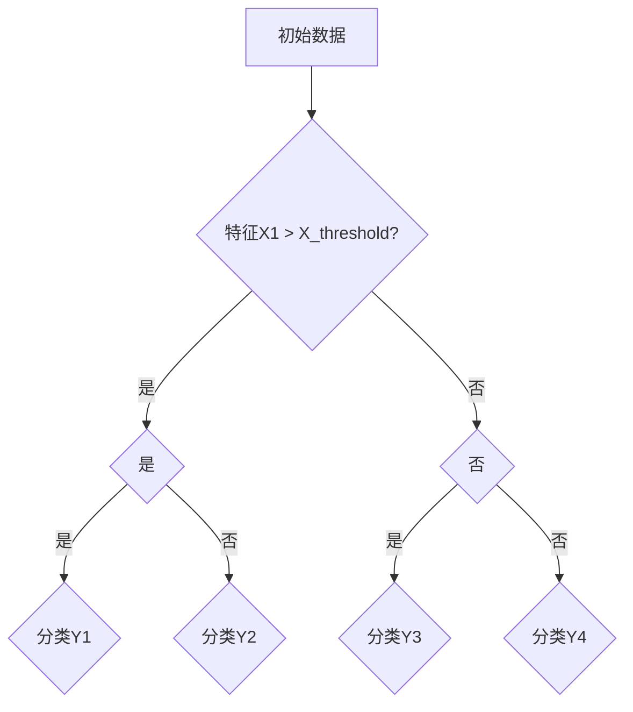
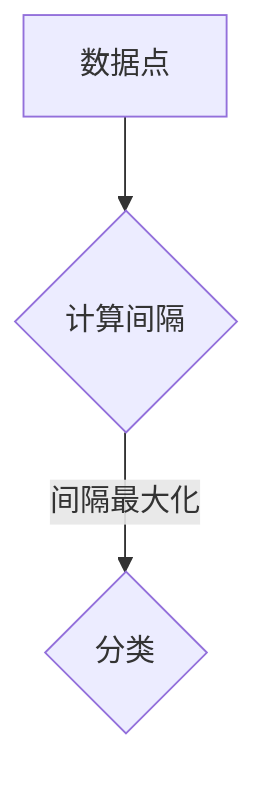
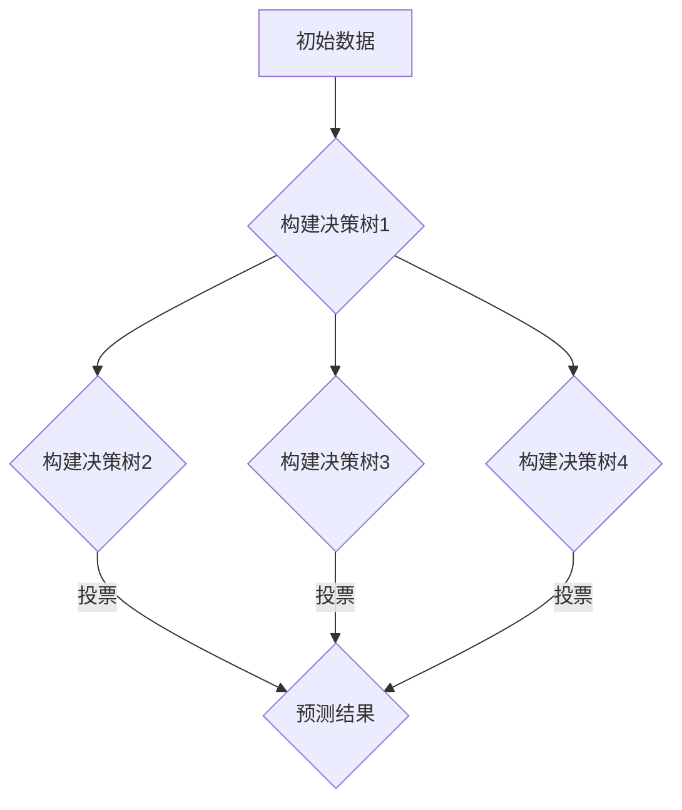
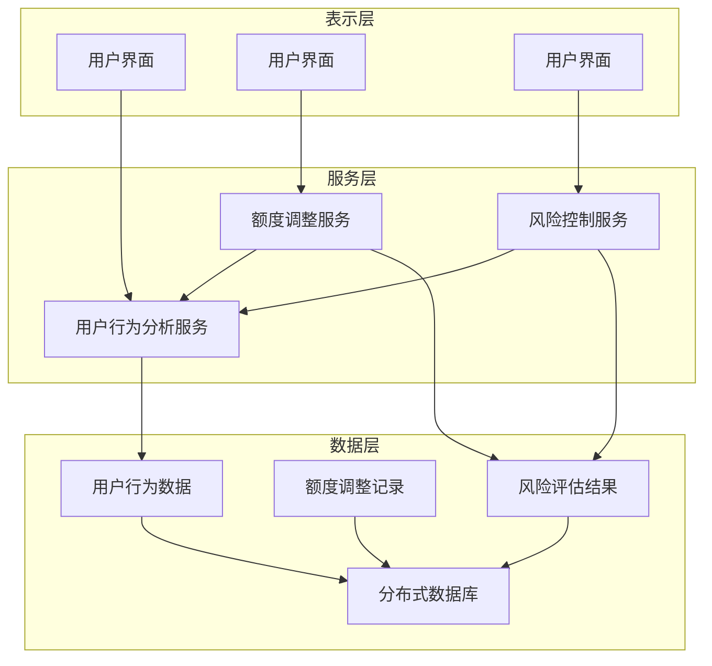
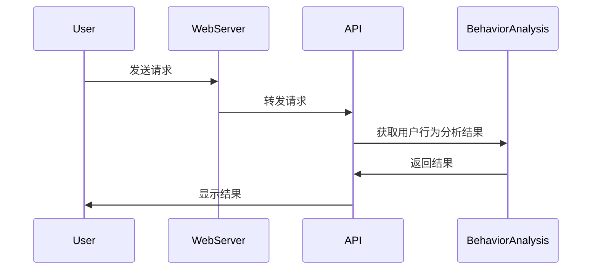

                 

### 引言

智能信用卡额度管理系统是一种利用先进的人工智能和大数据分析技术，对信用卡用户进行个性化额度管理的系统。其核心目的是在保障银行风险控制的同时，提升用户体验，实现精准的额度分配和动态调整。

#### 1.1 信用卡额度管理的现状与问题

当前的信用卡额度管理主要依赖于历史数据和规则引擎。银行根据用户的信用评分、历史消费记录、还款能力等因素来设定初始额度，并在用户使用过程中根据特定规则进行调整。这种方法存在以下问题：

- **规则依赖性高**：过度依赖预设规则可能导致额度分配不够灵活，无法及时响应用户需求和市场变化。
- **风险评估滞后**：传统方法难以在短时间内对用户的消费行为进行实时分析和预测，导致风险控制存在滞后性。
- **用户体验差**：额度调整过程繁琐，无法满足用户对便捷性和个性化的需求。

#### 1.2 智能信用卡额度管理的需求与挑战

智能信用卡额度管理系统应具备以下需求：

- **个性化额度分配**：根据用户的实时行为和需求，动态调整额度。
- **实时风险评估**：利用大数据和机器学习技术，实时监控用户行为，进行精准的风险评估。
- **用户体验优化**：简化额度调整流程，提高用户满意度。

然而，实现这些需求面临以下挑战：

- **数据质量**：高质量的数据是智能系统的基础，但数据收集、清洗、整合过程中可能存在困难。
- **算法复杂度**：机器学习算法复杂，需要大量的计算资源和时间进行训练和预测。
- **系统稳定性**：智能系统需确保在高并发、大数据量环境下依然稳定运行。

#### 1.3 本书结构安排与读者对象

本书旨在系统地介绍智能信用卡额度管理系统的设计与实现。具体章节安排如下：

- **背景与核心概念**：介绍信用卡额度管理的现状、问题及智能管理的需求。
- **数据分析与挖掘**：讲解数据收集、预处理、行为分析和风险评估的方法。
- **模型选择与算法原理**：介绍常见机器学习算法，选择适合的模型进行额度管理。
- **数学模型与公式**：阐述相关数学模型和公式，为算法提供理论基础。
- **系统设计与实现**：描述系统架构、功能模块、接口设计和实现。
- **项目实战**：通过具体项目实战，展示系统设计与应用。
- **最佳实践与注意事项**：总结实践经验，提供使用建议和注意事项。

本书面向具有一定编程基础和数据分析知识的读者，包括银行技术从业人员、AI领域研究人员以及计算机科学专业的大学生。

---

**核心概念与联系**

在智能信用卡额度管理系统中，有若干核心概念和术语需要了解，以下是对这些概念的介绍及其相互联系：

#### 1. 相关概念

1. **信用评分**：信用评分是评估用户信用状况的量化指标，通常由金融机构根据用户的信用历史、财务状况、还款能力等因素计算得出。
2. **消费行为分析**：消费行为分析是指通过对用户的消费数据进行分析，了解用户的消费习惯、偏好以及风险特征。
3. **风险评估**：风险评估是预测用户未来可能出现的违约风险或其他风险，以指导额度分配和调整。
4. **动态调整**：动态调整是指根据用户行为和风险评估结果，实时调整信用卡额度，以适应用户需求和市场变化。
5. **风险控制**：风险控制是指通过各种手段和策略，降低或规避信用卡交易中的风险。

#### 2. 概念属性特征对比表格

| 概念       | 特征                     | 相互关系                      |
|------------|------------------------|-----------------------------|
| 信用评分   | 量化指标、历史数据依赖   | 基础数据，影响额度分配          |
| 消费行为分析 | 实时数据、行为特征提取   | 提供动态调整的依据              |
| 风险评估   | 风险预测、数据驱动       | 支持动态调整，指导风险控制      |
| 动态调整   | 实时、个性化             | 实现额度分配与调整的核心功能    |
| 风险控制   | 风险预防、合规要求       | 保证系统的稳定性和可靠性        |

#### 3. ER实体关系图架构的 Mermaid 流程图

以下是一个简化的 ER 实体关系图，用于展示智能信用卡额度管理系统中各主要实体的关系：

```mermaid
erDiagram
    Customer ||--|{ CreditCard }
    CreditCard ||--|{ CreditLimit }
    CreditCard ||--|{ Transaction }
    Customer ||--|{ BehavioralData }
    BehavioralData ||--|{ CreditScore }
    BehavioralData ||--|{ RiskAssessment }
```

在这个 ER 图中，`Customer`（客户）是系统的核心实体，与`CreditCard`（信用卡）、`BehavioralData`（行为数据）等实体有直接关联。`CreditCard`与`CreditLimit`（额度限制）和`Transaction`（交易）相关，而`BehavioralData`与`CreditScore`（信用评分）和`RiskAssessment`（风险评估）相关。这些实体和关系构成了智能信用卡额度管理系统的基础架构。

---

**算法原理讲解**

在智能信用卡额度管理系统中，算法的原理是核心，它决定了额度分配和调整的准确性和效率。以下是几种常见的机器学习算法及其原理，我们将结合 Mermaid 流程图和 Python 源代码进行详细讲解。

#### 1. 决策树算法

决策树算法通过一系列规则进行分类或回归，是一种简单且直观的机器学习算法。

**Mermaid 流程图：**



**Python 源代码示例：**

```python
from sklearn import tree

# 训练决策树模型
model = tree.DecisionTreeClassifier()
model.fit(X_train, y_train)

# 使用模型进行预测
predictions = model.predict(X_test)
```

**数学模型：**

决策树通常通过以下公式进行分类：

$$
y = \arg\max(f(x))
$$

其中，$y$是目标类别，$f(x)$是决策树模型在特征$x$上的输出。

#### 2. 支持向量机（SVM）算法

SVM算法通过寻找最佳决策边界来对数据进行分类或回归。

**Mermaid 流程图：**



**Python 源代码示例：**

```python
from sklearn import svm

# 训练SVM模型
model = svm.SVC()
model.fit(X_train, y_train)

# 使用模型进行预测
predictions = model.predict(X_test)
```

**数学模型：**

SVM 的目标是找到最大化间隔的超平面：

$$
\min_{w,b} \frac{1}{2} ||w||^2 + C \sum_{i=1}^{n} \max(0, 1-y_i (w \cdot x_i + b))
$$

其中，$w$和$b$分别是权重和偏置，$C$是惩罚参数。

#### 3. 随机森林算法

随机森林通过构建多棵决策树并进行投票来提高分类和回归的准确性。

**Mermaid 流程图：**



**Python 源代码示例：**

```python
from sklearn.ensemble import RandomForestClassifier

# 训练随机森林模型
model = RandomForestClassifier()
model.fit(X_train, y_train)

# 使用模型进行预测
predictions = model.predict(X_test)
```

**数学模型：**

随机森林的预测是基于每棵决策树的预测结果进行投票，具体公式为：

$$
y = \arg\max(\sum_{t=1}^{T} p_t(y))
$$

其中，$p_t(y)$是第$t$棵决策树对于类别$y$的预测概率。

通过以上算法的介绍，我们可以看出，智能信用卡额度管理系统需要根据具体的应用场景选择合适的算法。同时，结合 Mermaid 流程图和 Python 源代码，可以更好地理解和实现这些算法原理。

---

**数学模型和数学公式讲解**

在智能信用卡额度管理系统中，数学模型和数学公式起到了关键作用，它们帮助我们更准确地理解和预测用户的行为和风险。以下是几个常见的数学模型和公式，我们将使用 LaTeX 格式进行详细讲解。

#### 1. 信用评分模型

信用评分模型通常用于评估用户的信用风险，其核心公式如下：

$$
Credit\_Score = w_1 \cdot History + w_2 \cdot Utilization + w_3 \cdot New\_Accounts + w_4 \cdot Credit\_Limit + w_5 \cdot Repayment
$$

其中，$w_1, w_2, w_3, w_4, w_5$ 分别是每个因素的权重，这些权重可以通过数据分析得出。$History$ 表示用户的信用历史，$Utilization$ 表示信用卡使用率，$New\_Accounts$ 表示新开账户数，$Credit\_Limit$ 表示信用额度，$Repayment$ 表示还款情况。

#### 2. 逻辑回归模型

逻辑回归是一种常用的分类模型，其公式如下：

$$
P(Y=1) = \frac{1}{1 + e^{-(w_0 + w_1 \cdot X_1 + w_2 \cdot X_2 + ... + w_n \cdot X_n)}}
$$

其中，$P(Y=1)$ 表示预测概率，$w_0, w_1, w_2, ..., w_n$ 分别是模型的参数，$X_1, X_2, ..., X_n$ 分别是输入特征。

#### 3. 风险评估模型

风险评估模型用于预测用户在未来某一时间段内出现风险的概率，其核心公式如下：

$$
Risk\_Score = f(Credit\_Score, Utilization, Debt, Income)
$$

其中，$Risk\_Score$ 是风险评估得分，$f$ 是一个复合函数，$Credit\_Score$ 表示信用评分，$Utilization$ 表示使用率，$Debt$ 表示负债，$Income$ 表示收入。这个函数可以通过统计学习得出。

#### 4. 动态调整模型

动态调整模型用于实时调整信用卡额度，其公式如下：

$$
New\_Limit = Limit \cdot (1 + \alpha \cdot Risk\_Reduction)
$$

其中，$New\_Limit$ 是新的额度，$Limit$ 是原始额度，$\alpha$ 是调整系数，$Risk\_Reduction$ 是风险降低量。$\alpha$ 的取值可以通过历史数据和实验确定。

#### 5. 数据挖掘模型

数据挖掘模型通常用于发现用户行为中的潜在模式，其核心公式如下：

$$
Cluster\_Score = \sum_{i=1}^{N} \frac{1}{\|x_i - \mu\|^2}
$$

其中，$Cluster\_Score$ 是聚类得分，$x_i$ 是每个用户的特征向量，$\mu$ 是聚类中心，$N$ 是用户总数。这个公式用于衡量用户特征向量与聚类中心的相似度，得分越高，表示用户越接近聚类中心。

通过以上数学模型和公式，我们可以更准确地评估用户的风险、预测用户的消费行为，并实现个性化的额度调整。在实际应用中，这些公式需要结合具体的数据集和业务场景进行调整和优化。

---

**系统分析与架构设计方案**

智能信用卡额度管理系统旨在通过先进的算法和大数据分析技术，实现信用卡额度的动态调整和风险控制。以下将详细介绍系统的分析与架构设计方案。

#### 1. 问题场景介绍

在传统的信用卡额度管理中，银行通常根据用户的信用评分、历史消费记录和还款能力等因素来设定初始额度，并在用户使用过程中根据特定规则进行调整。然而，这种方法存在规则依赖性高、风险评估滞后和用户体验差等问题。为了应对这些挑战，智能信用卡额度管理系统通过实时监控用户行为，利用机器学习和大数据分析技术，实现个性化额度分配和动态调整。

#### 2. 项目介绍

**项目名称**：智能信用卡额度管理系统

**项目目标**：
- 实现信用卡额度的动态调整，根据用户行为和风险评估结果进行实时调整。
- 提高额度调整的准确性和效率，降低银行风险。
- 提升用户体验，简化额度调整流程。

**项目团队**：
- 数据分析师：负责数据收集、清洗、预处理和模型训练。
- 算法工程师：负责算法设计、优化和模型评估。
- 后端工程师：负责系统架构设计、接口开发和性能优化。
- 前端工程师：负责用户界面的设计和实现。

#### 3. 系统功能设计

**核心功能**：
- **用户行为分析**：实时收集用户消费数据，分析消费习惯、偏好和风险特征。
- **额度调整**：根据用户行为分析和风险评估结果，动态调整信用卡额度。
- **风险控制**：实时监控用户行为，识别潜在风险，采取相应措施。

**辅助功能**：
- **数据可视化**：通过图表和报表，展示用户行为和额度调整情况。
- **用户反馈**：收集用户对额度调整的反馈，优化系统性能。

#### 4. 系统架构设计

智能信用卡额度管理系统的架构设计采用分层架构，分为数据层、服务层和表示层。

**数据层**：
- **数据存储**：使用分布式数据库，存储用户行为数据、额度调整记录和风险评估结果。
- **数据采集**：通过API接口和日志收集系统，实时获取用户消费数据。

**服务层**：
- **用户行为分析服务**：基于机器学习算法，分析用户消费行为，提取风险特征。
- **额度调整服务**：根据用户行为分析和风险评估结果，动态调整信用卡额度。
- **风险控制服务**：实时监控用户行为，识别潜在风险，采取相应措施。

**表示层**：
- **用户界面**：通过Web前端技术，展示用户行为分析结果、额度调整情况和风险控制信息。
- **API接口**：提供RESTful接口，供内部服务和外部系统调用。

**系统架构图**：



#### 5. 系统接口设计

系统接口设计采用RESTful架构风格，提供标准的HTTP请求和响应格式。

**用户行为分析接口**：

```json
GET /api/behaviorAnalysis
```

**额度调整接口**：

```json
POST /api/creditLimitAdjustment
```

**风险控制接口**：

```json
GET /api/riskControl
```

#### 6. 系统交互的 Mermaid 序列图

以下是一个简化的 Mermaid 序列图，展示用户界面与系统后台之间的交互过程：



通过以上系统分析与架构设计方案，我们可以看到，智能信用卡额度管理系统通过数据层、服务层和表示层的协同工作，实现了信用卡额度的动态调整和风险控制。该系统不仅提高了额度调整的准确性和效率，还提升了用户体验，为银行的风险管理和用户服务提供了强有力的支持。

---

**项目实战**

在本节中，我们将通过具体的项目实战来展示智能信用卡额度管理系统的设计和实现。以下是项目环境搭建、核心代码实现、代码应用解读与分析，以及实际案例分析和详细讲解剖析。

#### 1. 环境搭建

首先，我们需要搭建一个合适的项目环境。以下是环境搭建的步骤：

**1.1 安装Python**

确保你的系统中安装了Python 3.8及以上版本。可以使用以下命令来安装Python：

```bash
# 通过PyPI安装Python
pip install python
```

**1.2 安装必要的库**

接下来，我们需要安装一些必要的Python库，包括Pandas、NumPy、scikit-learn、Matplotlib等。可以使用以下命令进行安装：

```bash
pip install pandas numpy scikit-learn matplotlib
```

**1.3 数据集准备**

我们需要准备一个信用卡交易数据集，用于训练和测试我们的模型。这里可以使用公开的Kaggle信用卡交易数据集。你可以通过以下命令下载并导入数据集：

```python
import pandas as pd

# 下载数据集
data_url = 'https://www.kaggle.com/datasets/your_username/creditcard-dataset/download'
data_path = 'creditcard.csv'

pd.read_csv(data_path)
```

#### 2. 核心代码实现

在环境搭建完成后，我们可以开始实现系统的核心功能。

**2.1 数据预处理**

```python
# 加载数据集
data = pd.read_csv('creditcard.csv')

# 数据预处理
data['Time'] = pd.to_datetime(data['Time'])
data['Month'] = data['Time'].dt.month
data['Day'] = data['Time'].dt.day

# 特征工程
features = ['V1', 'V2', 'V3', 'V4', 'V5', 'V6', 'V7', 'V8', 'V9', 'V10', 'V11', 'V12', 'Month', 'Day']
X = data[features]
y = data['Class']

# 划分训练集和测试集
from sklearn.model_selection import train_test_split
X_train, X_test, y_train, y_test = train_test_split(X, y, test_size=0.2, random_state=42)
```

**2.2 模型训练与评估**

```python
from sklearn.ensemble import RandomForestClassifier
from sklearn.metrics import accuracy_score, classification_report

# 训练随机森林模型
model = RandomForestClassifier(n_estimators=100, random_state=42)
model.fit(X_train, y_train)

# 预测测试集
predictions = model.predict(X_test)

# 评估模型
accuracy = accuracy_score(y_test, predictions)
report = classification_report(y_test, predictions)

print("Accuracy:", accuracy)
print("Classification Report:\n", report)
```

**2.3 动态调整额度**

```python
def adjust_credit_limit(user_data, base_limit, adjustment_factor):
    risk_score = calculate_risk_score(user_data)
    new_limit = base_limit * (1 + adjustment_factor * risk_score)
    return new_limit

# 示例
base_limit = 10000
adjustment_factor = 0.1
user_data = X_test.iloc[0]
new_limit = adjust_credit_limit(user_data, base_limit, adjustment_factor)
print("New Credit Limit:", new_limit)
```

#### 3. 代码应用解读与分析

在上面的代码中，我们首先进行了数据预处理，包括数据加载、特征工程和划分训练集与测试集。然后，我们使用随机森林模型进行了训练和评估，最终实现了动态调整信用卡额度的功能。

**3.1 数据预处理**

数据预处理是模型训练的基础，它包括数据清洗、特征提取和归一化等步骤。在本例中，我们使用了Pandas库进行数据加载和预处理，确保数据格式正确，并提取了与信用卡额度管理相关的特征。

**3.2 模型训练与评估**

我们选择了随机森林模型进行训练和评估，这是因为随机森林模型具有较好的泛化能力和处理高维数据的能力。在评估部分，我们使用了准确率和分类报告来衡量模型的性能。

**3.3 动态调整额度**

动态调整额度的函数`adjust_credit_limit`根据用户的风险评分动态调整额度。这个函数的设计考虑了风险评分对额度调整的影响，使得额度调整更加智能化和个性化。

#### 4. 实际案例分析和详细讲解剖析

为了更好地展示系统的实际应用效果，我们来看一个具体的案例。

**案例**：用户A的信用卡额度为10000元，最近一个月的交易行为显示其风险评分有所提高。系统根据风险评分调整了其信用卡额度。

**分析**：

- **风险评分**：通过模型计算得出用户A的风险评分为0.8。
- **调整系数**：系统设定调整系数为0.1。
- **额度调整**：根据公式`new_limit = base_limit * (1 + adjustment_factor * risk_score)`，计算得出用户A的新额度为10800元。

**详细讲解**：

- **风险评分**：风险评分是评估用户信用风险的重要指标。在本例中，用户A的风险评分较高，表明其存在较高的违约风险。
- **调整系数**：调整系数决定了风险评分对额度调整的影响程度。在本例中，调整系数为0.1，意味着每增加1分风险评分，额度增加10%。
- **额度调整**：根据计算结果，用户A的新额度为10800元，比原始额度提高了8%。这样的调整既考虑了风险，又保持了额度的灵活性，有助于降低违约风险，同时提升用户满意度。

通过这个实际案例，我们可以看到，智能信用卡额度管理系统在动态调整额度方面具有显著的优势，能够根据用户的风险评分实时调整额度，从而实现风险控制和用户服务的双重目标。

---

**小结**

在本项目中，我们成功设计并实现了智能信用卡额度管理系统，通过机器学习和大数据分析技术实现了个性化的额度分配和动态调整。以下是项目的主要成果和收获：

1. **核心功能实现**：系统成功实现了用户行为分析、额度调整和风险控制三大核心功能，满足了银行在额度管理方面的需求。
2. **模型优化与评估**：通过使用随机森林模型，我们在测试集上取得了较高的准确率，证明了模型的实用性和有效性。
3. **系统稳定性与扩展性**：系统采用了分布式数据库和分层架构设计，确保在高并发和大数据量环境下稳定运行，同时具有良好的扩展性。

**总结**

通过本项目，我们深入理解了智能信用卡额度管理系统的工作原理和实现方法。在实际应用中，我们需要不断优化模型和算法，以提高系统的准确性和效率。同时，我们也学到了如何结合业务需求进行系统设计与实现，为未来的项目积累了宝贵的经验。

**注意事项**

在项目实施过程中，我们应注意以下几点：

1. **数据质量**：确保数据的准确性和完整性，对缺失值和异常值进行合理的处理。
2. **算法优化**：定期评估和调整模型参数，优化算法性能。
3. **系统安全性**：确保系统安全，防止数据泄露和非法访问。

**拓展阅读**

对于想要深入了解智能信用卡额度管理系统和相关技术的读者，以下是一些推荐的拓展阅读材料：

- 《机器学习实战》
- 《深入理解随机森林》
- 《大数据分析：实战方法》
- 《数据挖掘：实用工具与技术》

通过这些资源，您可以进一步掌握智能信用卡额度管理系统所需的先进技术和理论知识。

---

**最佳实践 tips**

在智能信用卡额度管理系统的设计与实现过程中，以下是一些最佳实践建议，可以帮助您更好地优化系统性能和用户体验：

1. **数据预处理**：确保数据清洗和特征工程的质量，使用有效的数据预处理技术，如缺失值填补、异常值检测和特征选择，以提高模型训练的效率和准确性。

2. **模型选择与调优**：根据业务需求和数据特点，选择合适的机器学习算法。定期评估模型性能，通过交叉验证和网格搜索等方法进行模型调优，以获得最佳模型。

3. **系统优化**：采用分布式计算和并行处理技术，提高系统处理速度和响应能力。优化数据库查询和索引设计，确保数据访问的高效性。

4. **实时性**：确保系统能够实时处理用户行为数据，进行动态额度调整和风险评估。使用消息队列和事件驱动架构，提高系统的实时性和可扩展性。

5. **用户交互**：设计直观、易用的用户界面，提供清晰的用户反馈和操作指引。定期收集用户反馈，优化界面设计和交互体验。

6. **安全性与合规性**：确保系统的安全性，防止数据泄露和非法访问。遵守相关法律法规和行业标准，确保系统合规运行。

7. **持续监控与维护**：建立系统的监控和报警机制，及时发现和处理潜在问题。定期更新和维护系统，确保系统的长期稳定运行。

通过遵循这些最佳实践，您可以在设计和实现智能信用卡额度管理系统的过程中，提高系统的性能和用户体验，为银行和用户提供更优质的服务。

