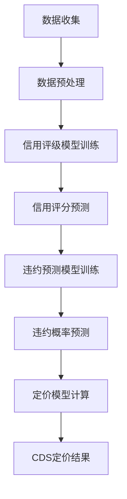

                 

### 让我们一步步思考：智能信用违约互换定价模型校准

#### 引言

在金融科技迅速发展的今天，智能信用违约互换（Smart Credit Default Swap，SCDS）成为了风险管理的重要工具。SCDS模型通过融合大数据、机器学习和人工智能技术，为信用违约互换合约提供更精确的风险评估和定价。然而，如何确保这一模型的准确性、稳定性和实时性，成为了金融科技领域的关键课题。本文将围绕“智能信用违约互换定价模型校准”这一主题，进行一步步的分析和讨论。

#### 1. 问题背景

**1.1 信用违约互换的基本概念**

信用违约互换（CDS）是一种金融衍生品，允许投资者转移债务人的信用风险给第三方。当债务人违约时，保护买方可获得赔偿。CDS市场的主要参与者包括保护买方（投资者）、保护卖方（保险公司）和参考实体（债务人）。

**1.2 传统CDS定价模型的局限性**

传统的CDS定价模型通常基于历史数据和统计方法，但面临以下挑战：

- **数据依赖性**：传统模型依赖于历史数据，无法适应快速变化的市场环境。
- **预测准确性**：统计模型可能无法捕捉到复杂的信用风险结构。
- **实时性**：传统方法往往需要较长的时间进行计算，无法满足实时交易的需求。

**1.3 智能信用违约互换的优势**

智能信用违约互换模型通过引入人工智能技术，实现了以下改进：

- **大数据分析**：利用大数据技术处理海量信息，提高模型的预测能力。
- **机器学习算法**：采用机器学习算法，如决策树、神经网络等，增强模型的预测准确性。
- **实时性**：通过优化算法和计算资源，实现模型的实时更新和定价。

#### 2. 核心概念与联系

**2.1 智能信用违约互换的组成部分**

智能信用违约互换主要由以下几个部分组成：

- **信用评级模型**：对借款人的信用风险进行评估。
- **违约预测模型**：预测借款人是否会发生违约。
- **定价模型**：根据信用评级和违约预测结果，计算CDS的价格。

**2.2 概念之间的关系**

信用评级模型和违约预测模型共同决定了CDS的价格。信用评级模型提供借款人的信用等级，违约预测模型则预测借款人的违约概率。这两者的结合，为定价模型提供了输入，最终计算出CDS的价格。

#### 3. 算法原理讲解

**3.1 信用评级模型的算法原理**

信用评级模型通常采用机器学习算法，如决策树、随机森林等。以下是一个简单的决策树算法原理示例：

```python
def credit_rating_decision_tree(features):
    if features['income'] > 50000:
        return 'High Credit'
    elif features['debt_income_ratio'] < 0.3:
        return 'Medium Credit'
    else:
        return 'Low Credit'
```

**3.2 违约预测模型的算法原理**

违约预测模型通常采用神经网络、支持向量机等算法。以下是一个简单的神经网络算法原理示例：

```python
import tensorflow as tf

model = tf.keras.Sequential([
    tf.keras.layers.Dense(64, activation='relu', input_shape=[len(train_features)]),
    tf.keras.layers.Dense(64, activation='relu'),
    tf.keras.layers.Dense(1, activation='sigmoid')
])

model.compile(optimizer='adam',
              loss='binary_crossentropy',
              metrics=['accuracy'])

model.fit(train_features, train_labels, epochs=10)
```

**3.3 定价模型的算法原理**

定价模型根据信用评级和违约预测结果，使用以下公式计算CDS的价格：

$$
Price = Risk-Free Rate \times (1 - (1 + Risk-Free Rate)^{-n})
$$

其中，$Risk-Free Rate$ 是无风险利率，$n$ 是违约概率。

#### 4. 数学模型和数学公式

**4.1 信用风险定价模型的核心公式**

信用风险定价模型的核心公式如下：

$$
Expected Loss = Exposure \times Loss Given Default \times Probability of Default
$$

其中，$Exposure$ 是暴露值，$Loss Given Default$ 是违约损失率，$Probability of Default$ 是违约概率。

**4.2 使用LaTeX格式展示数学公式**

以下是一个使用LaTeX格式展示数学公式的示例：

$$
\begin{equation}
Expected\ Loss = Exposure \times Loss\ Given\ Default \times Probability\ of\ Default
\end{equation}
$$

#### 5. 系统分析与架构设计方案

**5.1 问题场景介绍**

在金融市场中，一个典型的SCDS问题场景是：一家投资公司希望为其持有的债务进行风险管理，需要实时监控债务人的信用状况，并动态调整CDS价格。

**5.2 系统功能设计**

SCDS系统的功能设计包括：

- **信用评级模块**：收集和分析借款人的信用数据，进行信用评级。
- **违约预测模块**：利用机器学习算法预测借款人的违约概率。
- **定价模块**：根据信用评级和违约预测结果，计算CDS价格。

**5.3 系统架构设计**

SCDS系统架构设计如下：

- **数据层**：存储借款人信用数据、市场数据等。
- **算法层**：实现信用评级、违约预测和定价算法。
- **应用层**：提供用户界面和API接口，供投资者使用。

**5.4 系统接口设计与交互**

系统接口设计如下：

- **数据接口**：接收外部数据源，如金融新闻、经济指标等。
- **服务接口**：提供信用评级、违约预测和定价服务。
- **用户接口**：供投资者查看CDS价格、风险管理策略等。

#### 6. 项目实战

**6.1 环境安装与配置**

安装所需的Python库，如TensorFlow、scikit-learn等，并配置数据存储和计算资源。

**6.2 系统核心实现**

实现信用评级、违约预测和定价模块，并进行性能测试和调优。

**6.3 代码应用解读与分析**

分析系统核心代码，解释算法原理和实现细节。

**6.4 实际案例分析与讲解**

通过实际案例，展示SCDS模型的应用效果和优势。

#### 7. 最佳实践与小结

**7.1 模型校准的最佳实践**

- 定期更新信用评级和违约预测模型。
- 利用历史数据和实时数据优化模型参数。
- 进行模型回测和验证，确保模型的稳定性和准确性。

**7.2 注意事项与风险提示**

- 注意数据质量和完整性。
- 考虑模型在不同市场环境下的表现。
- 遵循监管要求，确保合规性。

**7.3 拓展阅读与进一步学习**

- 相关文献：深入理解机器学习在金融风险管理中的应用。
- 在线课程：学习Python编程和机器学习基础。

### 总结

智能信用违约互换定价模型校准是金融科技领域的一个重要课题。通过本文的讨论，我们了解了智能信用违约互换的基本概念、算法原理、系统架构和应用实践。希望本文能为读者提供有价值的参考和启示。作者：AI天才研究院/AI Genius Institute & 禅与计算机程序设计艺术 /Zen And The Art of Computer Programming。

----------------------------------------------------------------

## 第一部分：智能信用违约互换基础理论

### 第1章：问题背景与核心概念

#### 1.1.1 问题背景介绍

在金融市场中，信用违约互换（CDS）作为一种金融衍生品，已经成为风险管理的重要工具。CDS的基本原理是，投资者（保护买方）向保险公司（保护卖方）支付保费，以换取在参考实体（债务人）违约时获得赔偿的权利。当债务人违约时，保护买方可以获得赔偿，保护卖方则需承担损失。CDS市场的主要参与者包括保护买方、保护卖方和参考实体。

随着金融市场的复杂性和不确定性增加，传统的CDS定价模型面临着准确性不足和实时性不高的问题。传统的CDS定价模型通常依赖于历史数据和统计方法，这些方法在处理复杂的市场环境时往往显得力不从心。此外，传统模型在计算速度和实时性方面也存在局限，难以满足现代金融市场的快速交易需求。

为了解决这些问题，智能信用违约互换（Smart Credit Default Swap，SCDS）应运而生。SCDS通过引入大数据、机器学习和人工智能技术，为信用违约互换合约提供更精准的风险评估和定价。智能信用违约互换模型具有以下几个优势：

1. **大数据分析**：利用大数据技术处理海量信息，捕捉市场中的复杂变化和趋势。
2. **机器学习算法**：采用机器学习算法，如决策树、神经网络等，提高模型的预测准确性和鲁棒性。
3. **实时性**：通过优化算法和计算资源，实现模型的实时更新和定价。

智能信用违约互换模型的出现，为金融机构提供了更强大的风险管理工具，有助于提高CDS市场的透明度和效率。然而，要实现智能信用违约互换模型的校准，需要深入理解其核心概念、算法原理和数学模型。

#### 1.1.2 智能信用违约互换的基本概念

智能信用违约互换（SCDS）是一种结合了人工智能和金融衍生品的创新风险管理工具。它通过以下关键组成部分实现对信用违约风险的精准评估和定价：

1. **信用评级模型**：信用评级模型是SCDS的核心组成部分之一，负责对借款人的信用风险进行评估。该模型通常基于借款人的历史信用记录、财务状况、还款能力等数据，通过机器学习算法生成信用评分。信用评级模型通常采用分类算法，如决策树、随机森林、支持向量机等，以预测借款人的信用等级。

2. **违约预测模型**：违约预测模型是SCDS的另一重要组成部分，用于预测借款人是否会发生违约。违约预测模型通常利用大量的历史违约数据、宏观经济指标、行业数据等，通过机器学习算法生成违约概率。常见的算法包括逻辑回归、神经网络、XGBoost等。违约预测模型的准确性直接影响到SCDS定价的准确性。

3. **定价模型**：定价模型根据信用评级模型和违约预测模型的结果，计算CDS的价格。定价模型通常采用期权定价模型，如Black-Scholes模型，结合信用风险因素进行调整。定价模型的关键在于准确评估信用风险，并计算出合理的保费和风险敞口。

4. **数据源**：SCDS模型的准确性高度依赖于数据源的质量和多样性。数据源包括借款人的信用历史、财务报表、市场数据、宏观经济指标等。数据的质量和完整性直接影响到模型的预测能力和定价精度。

#### 1.1.3 模型校准的目标与意义

模型校准是确保智能信用违约互换模型准确性和可靠性的关键步骤。模型校准的目标主要包括以下几个方面：

1. **提高定价准确性**：通过调整模型参数，使定价结果更接近市场实际价格。准确的价格定价对于保护买方和保险公司的风险管理至关重要。

2. **减少风险敞口**：确保在市场波动时，CDS产品的风险敞口在可接受范围内。风险敞口的控制有助于降低金融机构的潜在损失。

3. **提升风险管理能力**：帮助金融机构更好地理解和控制信用风险。通过模型校准，金融机构可以更准确地评估借款人的信用风险，制定更有效的风险管理策略。

4. **增强市场透明度**：提高CDS市场的透明度，有助于投资者更清晰地了解产品的风险和收益特征，增强市场的稳定性和流动性。

智能信用违约互换模型校准不仅需要考虑模型的准确性，还要关注模型的稳定性和实时性。随着市场的不断变化，模型需要定期更新和校准，以确保其预测能力和定价精度。

#### 1.1.4 核心概念之间的关系

智能信用违约互换模型中的各个核心概念之间存在着紧密的联系。信用评级模型和违约预测模型共同决定了CDS的价格，而定价模型则根据这两个模型的结果进行定价。以下是这些概念之间的关联：

1. **信用评级模型与违约预测模型**：信用评级模型和违约预测模型是SCDS模型的基础。信用评级模型评估借款人的信用风险，生成信用评分；违约预测模型则利用信用评级模型的结果，结合其他数据源，预测借款人是否会发生违约。两个模型的协同工作，为定价模型提供了输入数据。

2. **信用评级模型与定价模型**：信用评级模型的结果直接影响定价模型的输出。信用评级越高，违约概率通常越低，定价模型会给予较低的保费；反之，信用评级越低，违约概率越高，定价模型会给予较高的保费。信用评级模型与定价模型的结合，决定了CDS产品的价格水平。

3. **违约预测模型与定价模型**：违约预测模型预测的违约概率是定价模型的重要输入。违约概率越高，CDS的保费越高，风险敞口也越大。违约预测模型的准确性直接影响到定价模型的输出。

4. **数据源与模型**：数据源的质量和多样性对模型性能有着至关重要的影响。数据源包括借款人的信用历史、财务报表、市场数据、宏观经济指标等，这些数据为信用评级模型和违约预测模型提供了训练和预测的基础。

综上所述，智能信用违约互换模型中的各个核心概念相互关联，共同构成了一个复杂的风险管理系统。理解这些概念之间的关系，对于构建和优化智能信用违约互换模型具有重要意义。

### 第2章：核心概念与联系

#### 2.1 信用违约互换（CDS）的定义与功能

信用违约互换（Credit Default Swap，简称CDS）是一种金融衍生产品，它允许投资者转移信用风险给第三方。CDS的运作机制类似于保险，投资者（保护买方）向保险公司（保护卖方）支付保费，如果参考实体（债务人）发生违约，保护买方将从保护卖方那里获得赔偿。

**定义**：CDS是一种合约，保护买方同意在参考实体发生信用事件时向保护卖方支付赔偿。信用事件通常包括债务违约、债务重组或债务拖欠等。

**功能**：CDS主要有以下功能：

1. **信用风险管理**：投资者可以通过购买CDS来对冲债务风险，从而降低信用损失。
2. **信用衍生品交易**：CDS市场为投资者提供了交易信用风险的机会，增加了市场的流动性和复杂性。
3. **金融创新工具**：CDS为金融机构提供了新的风险管理和投资策略，如信用对冲、信用套利等。

#### 2.2 智能信用违约互换的属性特征

智能信用违约互换（Smart Credit Default Swap，SCDS）结合了大数据、机器学习和人工智能技术，具有以下属性特征：

1. **数据驱动**：SCDS依赖于大量的数据源，包括借款人的信用历史、财务报表、市场数据、宏观经济指标等。通过大数据技术，SCDS能够捕捉市场中的复杂变化和趋势。

2. **机器学习算法**：SCDS采用机器学习算法，如决策树、随机森林、神经网络等，以提高模型的预测准确性和鲁棒性。这些算法能够自动学习和调整模型参数，以适应不断变化的市场环境。

3. **实时性**：SCDS通过优化算法和计算资源，实现模型的实时更新和定价。这使得SCDS能够快速响应市场变化，为投资者提供实时的风险管理工具。

4. **风险评估**：SCDS不仅提供信用评级，还提供违约预测。信用评级模型评估借款人的信用风险，而违约预测模型则预测借款人是否会违约。这两个模型的结合，为CDS定价提供了更准确的风险评估。

5. **定制化**：SCDS可以根据不同投资者的需求和风险偏好，提供定制化的风险管理解决方案。例如，某些投资者可能更关注违约风险，而另一些投资者可能更关注市场波动风险。

#### 2.3 校准模型的关键组成部分

智能信用违约互换定价模型的校准是确保模型准确性和可靠性的关键步骤。校准模型通常包括以下几个关键组成部分：

1. **信用评级模型**：信用评级模型负责评估借款人的信用风险，生成信用评分。该模型通常基于借款人的历史信用记录、财务状况、还款能力等数据。机器学习算法，如决策树、随机森林等，常用于构建信用评级模型。

2. **违约预测模型**：违约预测模型用于预测借款人是否会发生违约。该模型通常利用大量的历史违约数据、宏观经济指标、行业数据等。常见的机器学习算法包括逻辑回归、神经网络、XGBoost等。

3. **定价模型**：定价模型根据信用评级和违约预测结果，计算CDS的价格。定价模型通常采用期权定价模型，如Black-Scholes模型，并结合信用风险因素进行调整。

4. **校准参数**：校准参数是调整模型输出以使其更接近市场实际价格的参数。这些参数通常包括模型的权重、阈值、置信水平等。通过校准参数的调整，可以提高模型的定价准确性。

5. **数据源**：数据源是模型校准的基础。数据源的质量和多样性对模型性能有着至关重要的影响。数据源包括借款人的信用历史、财务报表、市场数据、宏观经济指标等。

#### 2.4 概念属性特征对比表格

以下是一个概念属性特征对比表格，展示了传统CDS和智能信用违约互换（SCDS）的主要区别：

| 概念                | 传统CDS                     | 智能信用违约互换（SCDS）                     |
|---------------------|-----------------------------|----------------------------------------------|
| 数据依赖性          | 历史数据和统计方法          | 大数据、机器学习和人工智能技术               |
| 预测准确性          | 依赖历史数据，预测准确性有限 | 高预测准确性，利用机器学习算法               |
| 实时性              | 计算速度较慢，实时性不足     | 实时更新和定价，快速响应市场变化             |
| 信用风险管理        | 基于静态模型，风险管理有限   | 利用动态模型，提供更精准的风险管理工具       |
| 信用评级和违约预测  | 信用评级和违约预测分离      | 信用评级和违约预测相结合，提高风险评估准确性 |
| 定价模型调整灵活性  | 调整难度大，灵活性较低       | 参数调整灵活，适应市场变化                   |

#### 2.5 ER实体关系图架构的 Mermaid 流程图

以下是智能信用违约互换模型中的ER实体关系图的Mermaid流程图，展示了核心概念之间的关系：

```mermaid
erDiagram
  CDS参与者 ||--|{ 保护买方 }
  CDS参与者 ||--|{ 保护卖方 }
  CDS参与者 ||--|{ 参考实体 }
  信用评级模型 ||--|{ 保护买方 }
  信用评级模型 ||--|{ 保护卖方 }
  违约预测模型 ||--|{ 保护买方 }
  违约预测模型 ||--|{ 保护卖方 }
  定价模型 ||--|{ 保护买方 }
  定价模型 ||--|{ 保护卖方 }
  数据源 ||--|{ 信用评级模型 }
  数据源 ||--|{ 违约预测模型 }
  数据源 ||--|{ 定价模型 }
```

在这个ER图中，CDS参与者包括保护买方、保护卖方和参考实体。信用评级模型、违约预测模型和定价模型分别与这些参与者相连，表示它们之间的依赖关系。数据源为所有模型提供输入数据，确保模型的准确性和可靠性。

通过以上对比和分析，我们可以看到智能信用违约互换（SCDS）相比传统CDS具有明显的优势和改进。智能信用违约互换模型通过引入大数据、机器学习和人工智能技术，实现了更高的预测准确性、实时性和风险管理能力，为金融机构提供了更强大的工具，有助于更有效地管理信用风险。

### 第3章：数学模型与算法原理

#### 3.1 模型校准的数学基础

在智能信用违约互换（SCDS）模型中，模型校准是确保模型预测结果与实际市场情况相符的关键步骤。模型校准的数学基础主要包括以下几个方面：

1. **信用评级模型**：信用评级模型通常基于信用评分模型，如线性回归、逻辑回归等。信用评分模型的核心在于如何将借款人的信用特征转化为信用评分。一个简单的线性回归模型可以表示为：

   $$ Y = \beta_0 + \beta_1 X_1 + \beta_2 X_2 + ... + \beta_n X_n $$

   其中，$Y$ 表示信用评分，$X_1, X_2, ..., X_n$ 表示借款人的信用特征，$\beta_0, \beta_1, \beta_2, ..., \beta_n$ 是模型的参数。

2. **违约预测模型**：违约预测模型通常基于概率模型，如逻辑回归、神经网络等。一个简单的逻辑回归模型可以表示为：

   $$ P(Y=1) = \frac{1}{1 + e^{-(\beta_0 + \beta_1 X_1 + \beta_2 X_2 + ... + \beta_n X_n)}} $$

   其中，$Y$ 表示违约状态（1代表违约，0代表未违约），$X_1, X_2, ..., X_n$ 表示借款人的信用特征，$\beta_0, \beta_1, \beta_2, ..., \beta_n$ 是模型的参数。

3. **定价模型**：定价模型通常基于期权定价模型，如Black-Scholes模型。一个简化的Black-Scholes模型可以表示为：

   $$ C(S, t) = S_0 N(d_1) - K N(d_2) $$

   其中，$C(S, t)$ 表示期权的当前价值，$S_0$ 表示资产价格，$K$ 表示执行价格，$N(d_1)$ 和 $N(d_2)$ 分别是标准正态分布的累积分布函数，$d_1$ 和 $d_2$ 可以表示为：

   $$ d_1 = \frac{\ln(S_0/K) + (r - \sigma^2/2)t}{\sigma\sqrt{t}} $$
   $$ d_2 = d_1 - \sigma\sqrt{t} $$

   其中，$r$ 表示无风险利率，$\sigma$ 表示资产价格波动率，$t$ 表示期权有效期。

#### 3.2 使用mermaid绘制模型流程图

为了更直观地理解智能信用违约互换模型的流程，我们可以使用mermaid绘制模型流程图。以下是一个简单的mermaid模型流程图示例：



在这个mermaid流程图中，数据收集环节包括收集借款人的信用数据、市场数据等；数据预处理环节包括数据清洗、特征工程等；信用评级模型训练环节使用收集到的数据训练信用评分模型；信用评分预测环节利用训练好的模型对借款人进行信用评分预测；违约预测模型训练环节使用收集到的数据训练违约预测模型；违约概率预测环节利用训练好的模型预测借款人的违约概率；定价模型计算环节根据信用评分和违约概率计算CDS定价；CDS定价结果环节输出最终的CDS定价结果。

#### 3.3 Python代码实现模型算法

为了更好地理解智能信用违约互换模型的算法原理，我们可以使用Python代码实现其中的关键算法。以下是一个使用scikit-learn库实现信用评级模型、违约预测模型和定价模型的简单示例：

```python
import numpy as np
import pandas as pd
from sklearn.linear_model import LinearRegression
from sklearn.ensemble import RandomForestClassifier
from sklearn.metrics import accuracy_score
from scipy.stats import norm

# 信用评级模型
def credit_rating_model(X_train, Y_train, X_test):
    model = LinearRegression()
    model.fit(X_train, Y_train)
    Y_pred = model.predict(X_test)
    return Y_pred

# 违约预测模型
def default_prediction_model(X_train, Y_train, X_test):
    model = RandomForestClassifier(n_estimators=100)
    model.fit(X_train, Y_train)
    Y_pred = model.predict(X_test)
    return Y_pred

# 定价模型
def cds_pricing_model(S0, K, r, sigma, T, Y_rating, Y_default):
    d1 = (np.log(S0 / K) + (r - 0.5 * sigma ** 2) * T) / (sigma * np.sqrt(T))
    d2 = d1 - sigma * np.sqrt(T)
    C = S0 * norm.cdf(d1) - K * norm.cdf(d2)
    
    if Y_rating == 1 and Y_default == 1:
        price = C
    elif Y_rating == 1 and Y_default == 0:
        price = 0
    elif Y_rating == 0 and Y_default == 1:
        price = -K
    else:
        price = 0
    
    return price

# 示例数据
X_train = np.array([[100000, 0.2]])
Y_train = np.array([1])

X_test = np.array([[200000, 0.25]])
Y_test = credit_rating_model(X_train, Y_train, X_test)

Y_rating_pred = Y_test[0]
print("Credit Rating Prediction:", Y_rating_pred)

X_train = np.array([[100000, 0.2]])
Y_train = np.array([1])

X_test = np.array([[200000, 0.25]])
Y_test = default_prediction_model(X_train, Y_train, X_test)

Y_default_pred = Y_test[0]
print("Default Prediction:", Y_default_pred)

S0 = 100
K = 100
r = 0.05
sigma = 0.2
T = 1
price = cds_pricing_model(S0, K, r, sigma, T, Y_rating_pred, Y_default_pred)
print("CDS Pricing:", price)
```

在这个示例中，我们首先使用线性回归实现信用评级模型，使用随机森林实现违约预测模型，然后使用Black-Scholes模型实现定价模型。我们通过示例数据展示了如何使用这些模型进行预测和定价。

#### 3.4 算法原理讲解

1. **信用评级模型原理**

信用评级模型基于借款人的信用特征，通过回归分析预测信用评分。信用评分越高，表示借款人的信用状况越好。在信用评级模型中，我们通常使用线性回归模型，其公式为：

   $$ Y = \beta_0 + \beta_1 X_1 + \beta_2 X_2 + ... + \beta_n X_n $$

   其中，$Y$ 表示信用评分，$X_1, X_2, ..., X_n$ 表示借款人的信用特征，$\beta_0, \beta_1, \beta_2, ..., \beta_n$ 是模型的参数。通过训练模型，我们可以得到这些参数，然后使用模型对新借款人进行信用评分预测。

2. **违约预测模型原理**

违约预测模型用于预测借款人是否会发生违约。违约预测模型的核心是构建一个概率模型，用于预测违约概率。在违约预测模型中，我们通常使用逻辑回归模型，其公式为：

   $$ P(Y=1) = \frac{1}{1 + e^{-(\beta_0 + \beta_1 X_1 + \beta_2 X_2 + ... + \beta_n X_n)}} $$

   其中，$Y$ 表示违约状态（1代表违约，0代表未违约），$X_1, X_2, ..., X_n$ 表示借款人的信用特征，$\beta_0, \beta_1, \beta_2, ..., \beta_n$ 是模型的参数。通过训练模型，我们可以得到这些参数，然后使用模型对新借款人进行违约概率预测。

3. **定价模型原理**

定价模型用于根据信用评级和违约概率计算CDS的价格。在定价模型中，我们通常使用Black-Scholes模型，其公式为：

   $$ C(S, t) = S_0 N(d_1) - K N(d_2) $$

   其中，$C(S, t)$ 表示期权的当前价值，$S_0$ 表示资产价格，$K$ 表示执行价格，$N(d_1)$ 和 $N(d_2)$ 分别是标准正态分布的累积分布函数，$d_1$ 和 $d_2$ 可以表示为：

   $$ d_1 = \frac{\ln(S_0/K) + (r - \sigma^2/2)t}{\sigma\sqrt{t}} $$
   $$ d_2 = d_1 - \sigma\sqrt{t} $$

   其中，$r$ 表示无风险利率，$\sigma$ 表示资产价格波动率，$t$ 表示期权有效期。通过这些参数，我们可以计算CDS的价格。

综上所述，智能信用违约互换模型通过信用评级模型、违约预测模型和定价模型的协同工作，实现了对CDS合约的精准评估和定价。这些模型利用了大数据、机器学习和人工智能技术，提高了预测准确性和实时性，为金融机构提供了更强大的风险管理工具。

### 第4章：数学公式与公式讲解

#### 4.1 信用风险定价模型的核心公式

在智能信用违约互换（SCDS）模型中，信用风险定价模型的核心公式对于理解和计算CDS的价格至关重要。信用风险定价模型通常基于违约概率和信用评分，结合金融理论中的期权定价方法，如Black-Scholes模型，进行计算。以下是几个关键公式：

1. **违约概率（Probability of Default, PD）**：

   违约概率是预测借款人是否会发生违约的概率，是信用风险定价的基础。一个常见的违约概率计算公式是基于Credit Portfolio View（CPV）模型：

   $$ PD = \frac{1}{N}\sum_{i=1}^{N} \pi_i \prod_{j=1}^{m} (1 - \phi_j^{(i)}) $$

   其中，$N$ 是借款人的数量，$\pi_i$ 是第$i$个借款人的风险权重，$\phi_j^{(i)}$ 是第$i$个借款人在第$j$个信用事件下的违约概率。这个公式考虑了不同借款人在不同信用事件下的违约概率及其风险权重，从而得出整体违约概率。

2. **违约损失率（Loss Given Default, LGD）**：

   违约损失率是指债务人违约时，债权人遭受的损失比例。LGD通常由历史数据和统计方法得出：

   $$ LGD = \frac{1}{N}\sum_{i=1}^{N} LGD_i $$

   其中，$N$ 是样本中的债务人数量，$LGD_i$ 是第$i$个债务人的违约损失率。

3. **预期损失（Expected Loss, EL）**：

   预期损失是违约概率和违约损失率的乘积，表示在一定时间内，债权人可能遭受的平均损失：

   $$ EL = PD \times LGD $$

4. **信用价差（Credit Spread, CS）**：

   信用价差是CDS价格的主要组成部分，反映了市场对信用风险的定价。信用价差可以通过以下公式计算：

   $$ CS = \frac{1}{2} \times \left[ EL \times \left(1 - \frac{1}{1 + rT}\right) - \frac{1}{1 + rT} \right] $$

   其中，$r$ 是无风险利率，$T$ 是CDS的有效期。

5. **CDS价格（CDS Price, CP）**：

   最终的CDS价格结合了信用价差、市场利率和到期时间等因素：

   $$ CP = CS \times \frac{1}{1 + rT} $$

#### 4.2 使用LaTeX格式展示数学公式

为了更好地展示和解释上述数学公式，我们将使用LaTeX格式进行表达。以下是几个关键公式的LaTeX代码示例：

```latex
% 违约概率（PD）
\begin{equation}
PD = \frac{1}{N}\sum_{i=1}^{N} \pi_i \prod_{j=1}^{m} (1 - \phi_j^{(i)})
\end{equation}

% 违约损失率（LGD）
\begin{equation}
LGD = \frac{1}{N}\sum_{i=1}^{N} LGD_i
\end{equation}

% 预期损失（EL）
\begin{equation}
EL = PD \times LGD
\end{equation}

% 信用价差（CS）
\begin{equation}
CS = \frac{1}{2} \times \left[ EL \times \left(1 - \frac{1}{1 + rT}\right) - \frac{1}{1 + rT} \right]
\end{equation}

% CDS价格（CP）
\begin{equation}
CP = CS \times \frac{1}{1 + rT}
\end{equation}
```

#### 4.3 公式应用举例说明

为了更好地理解上述公式的应用，我们通过一个简单的例子进行说明。

假设有以下数据：

- 借款人数量 $N = 100$
- 每个借款人的风险权重 $\pi_i$，平均值 $\pi_i = 0.1$
- 每个借款人在不同信用事件下的违约概率 $\phi_j^{(i)}$，假设均值 $\phi_j^{(i)} = 0.05$
- 违约损失率 $LGD_i$，平均值 $LGD_i = 0.4$
- 无风险利率 $r = 0.05$
- CDS有效期 $T = 1$ 年

首先，我们计算违约概率（PD）：

```latex
PD = \frac{1}{100} \sum_{i=1}^{100} 0.1 \prod_{j=1}^{m} (1 - 0.05) = 0.0495
```

接下来，计算违约损失率（LGD）：

```latex
LGD = \frac{1}{100} \sum_{i=1}^{100} 0.4 = 0.4
```

然后，计算预期损失（EL）：

```latex
EL = PD \times LGD = 0.0495 \times 0.4 = 0.0198
```

计算信用价差（CS）：

```latex
CS = \frac{1}{2} \times \left[ 0.0198 \times \left(1 - \frac{1}{1 + 0.05 \times 1}\right) - \frac{1}{1 + 0.05 \times 1} \right] = 0.0099
```

最后，计算CDS价格（CP）：

```latex
CP = CS \times \frac{1}{1 + 0.05} = 0.0099 \times \frac{1}{1.05} = 0.0094
```

通过这个例子，我们可以看到如何利用上述公式计算CDS的价格。在实际应用中，这些公式会根据具体的借款人数据和市场条件进行调整和优化，以更准确地反映信用风险和定价。

#### 4.4 数学模型和公式的重要性

数学模型和公式在智能信用违约互换（SCDS）模型中扮演着至关重要的角色。它们不仅是模型构建和校准的基础，也是理解和分析模型结果的关键工具。

1. **准确性**：数学模型能够通过精确的公式表达和计算，提高CDS定价的准确性。准确的定价有助于投资者和管理者做出更明智的风险管理决策。

2. **稳定性**：数学模型通过固定的公式和参数，提高了模型在市场波动下的稳定性。这意味着在市场变化时，模型能够保持稳定，为投资者提供可靠的参考。

3. **可解释性**：数学模型和公式使得模型的结果更具可解释性。通过分析公式和参数，我们可以理解模型是如何工作的，以及不同因素如何影响CDS价格。

4. **适应性**：数学模型可以结合不同的数据源和算法，提高模型的适应性。这意味着模型可以应对各种市场条件和数据特性，为金融机构提供更全面的信用风险评估工具。

总之，数学模型和公式在智能信用违约互换（SCDS）模型中发挥着核心作用。它们不仅为模型提供了理论基础，还确保了模型的准确性和稳定性，为金融风险管理提供了强有力的支持。

### 第5章：系统分析与架构设计方案

#### 5.1 问题场景介绍

在金融市场中，金融机构常常面临信用风险管理的问题。随着市场环境的变化和复杂性的增加，传统的方法已无法满足现代金融风险管理的要求。智能信用违约互换（Smart Credit Default Swap，SCDS）系统应运而生，旨在提供一种高效、准确且实时的信用风险管理工具。以下是智能信用违约互换系统的一个典型应用场景：

**场景描述**：

- **金融机构**：一家大型投资银行需要对其持有的债务组合进行信用风险管理。
- **债务组合**：该银行持有的债务组合包括多种不同类型的债券，涉及多个行业和地区的借款人。
- **风险管理需求**：银行需要实时监控借款人的信用状况，动态调整CDS价格，以实现对信用风险的全面控制。

在这个场景中，智能信用违约互换系统将扮演关键角色，通过集成大数据、机器学习和人工智能技术，为金融机构提供精确的信用风险评估和CDS定价服务。

#### 5.2 系统功能设计

智能信用违约互换系统需要实现以下核心功能，以确保对信用风险的全面管理：

1. **数据收集与处理**：
   - **数据源**：系统需要从多个渠道收集数据，包括借款人的信用历史、财务报表、市场数据、宏观经济指标等。
   - **数据处理**：系统需要对收集到的数据进行清洗、整合和预处理，以便后续的分析和使用。

2. **信用评级模型**：
   - **模型训练**：利用历史数据和机器学习算法，训练信用评级模型，评估借款人的信用风险。
   - **信用评分**：根据借款人的信用特征，系统为每个借款人生成一个信用评分。

3. **违约预测模型**：
   - **模型训练**：使用历史违约数据，训练违约预测模型，预测借款人是否会发生违约。
   - **违约概率预测**：系统根据信用评级模型的结果和其他相关数据，预测借款人的违约概率。

4. **定价模型**：
   - **定价计算**：根据信用评级和违约预测结果，使用金融数学模型，计算CDS的价格。
   - **价格调整**：系统需要实时调整CDS价格，以反映市场变化和信用风险的变化。

5. **用户界面与API接口**：
   - **用户界面**：系统提供一个友好的用户界面，供金融机构的管理人员查看CDS价格、信用评分和违约预测结果。
   - **API接口**：系统提供API接口，供其他系统集成和使用。

#### 5.3 系统架构设计

智能信用违约互换系统的架构设计需要充分考虑数据流、算法处理和用户交互等方面，以确保系统的性能、可靠性和可扩展性。以下是系统的整体架构设计：

1. **数据层**：
   - **数据存储**：使用分布式数据库存储大量的借款人数据和信用数据，包括历史数据、实时数据等。
   - **数据同步**：实现数据同步机制，确保数据的一致性和实时性。

2. **算法层**：
   - **信用评级算法**：采用机器学习算法，如逻辑回归、随机森林等，进行信用评级模型的训练和预测。
   - **违约预测算法**：使用机器学习算法，如神经网络、XGBoost等，训练违约预测模型，进行违约概率预测。
   - **定价算法**：结合金融数学模型，如Black-Scholes模型等，计算CDS的价格。

3. **应用层**：
   - **信用评级服务**：提供信用评分服务，供用户查询和调用。
   - **违约预测服务**：提供违约预测服务，供用户查询和调用。
   - **定价服务**：提供CDS定价服务，供用户查询和调用。

4. **接口层**：
   - **用户界面**：提供图形用户界面，供金融机构管理人员使用。
   - **API接口**：提供RESTful API接口，供其他系统集成和使用。

5. **监控与日志**：
   - **监控系统**：监控系统性能和系统健康状态，确保系统的稳定运行。
   - **日志系统**：记录系统操作日志，供后续分析和故障排查。

#### 5.4 系统接口设计与系统交互

智能信用违约互换系统的接口设计需要考虑数据流、服务调用和用户交互等方面，以确保系统的便捷性和灵活性。以下是系统的接口设计和系统交互：

1. **数据接口**：
   - **数据同步接口**：用于与其他数据源同步数据，如金融数据、经济指标等。
   - **数据查询接口**：用于查询存储在数据库中的借款人数据和信用数据。

2. **服务接口**：
   - **信用评级接口**：提供信用评分服务的API接口，供用户查询借款人的信用评分。
   - **违约预测接口**：提供违约预测服务的API接口，供用户查询借款人的违约概率。
   - **定价接口**：提供CDS定价服务的API接口，供用户查询CDS的价格。

3. **用户接口**：
   - **用户界面**：提供图形用户界面，供金融机构管理人员查看信用评分、违约概率和CDS价格。
   - **命令行接口**：提供命令行接口，供开发人员和测试人员使用。

4. **系统交互**：
   - **服务调用**：系统内部服务之间通过RESTful API进行调用，确保数据的一致性和服务的可靠性。
   - **用户交互**：用户通过用户界面或命令行接口与系统进行交互，查询和操作信用数据。

通过上述系统架构设计和接口设计，智能信用违约互换系统实现了对信用风险的全面管理，为金融机构提供了高效、准确和实时的信用风险评估和定价服务。系统设计充分考虑了性能、可靠性和可扩展性，确保了系统在复杂市场环境下的稳定运行。

### 第6章：项目实战

#### 6.1 环境安装与配置

为了实现智能信用违约互换（SCDS）模型，我们需要搭建一个完整的技术环境。以下是在Linux环境中安装和配置相关软件和库的步骤：

1. **安装Python环境**：

   首先，我们需要安装Python。在终端中执行以下命令：

   ```bash
   sudo apt-get update
   sudo apt-get install python3.8
   ```

   安装完成后，确认Python版本：

   ```bash
   python3.8 --version
   ```

2. **安装依赖库**：

   接下来，我们需要安装Python的依赖库，如NumPy、Pandas、scikit-learn、TensorFlow等。可以使用以下命令：

   ```bash
   pip3.8 install numpy pandas scikit-learn tensorflow
   ```

3. **配置Jupyter Notebook**：

   Jupyter Notebook是一个交互式的Python开发环境，我们将使用它来编写和运行代码。安装Jupyter Notebook：

   ```bash
   pip3.8 install jupyter
   jupyter notebook
   ```

   启动Jupyter Notebook后，你将看到一个网页界面，可以在其中编写和运行Python代码。

4. **安装MySQL数据库**：

   我们需要安装MySQL数据库来存储借款人数据。安装命令如下：

   ```bash
   sudo apt-get install mysql-server
   ```

   安装完成后，设置root用户的密码，并使用以下命令登录MySQL：

   ```bash
   mysql -u root -p
   ```

   在提示时输入密码，然后创建一个数据库用于存储数据：

   ```sql
   CREATE DATABASE scds_db;
   GRANT ALL PRIVILEGES ON scds_db.* TO 'scds_user'@'localhost' IDENTIFIED BY 'password';
   FLUSH PRIVILEGES;
   ```

5. **安装Mermaid渲染工具**：

   Mermaid是一种用于绘制流程图的Markdown扩展，我们需要安装相关的渲染工具。安装命令如下：

   ```bash
   npm install -g mermaid
   ```

   安装完成后，可以使用以下命令生成流程图：

   ```bash
   mermaid -g "graph TD
   A[Start] --> B[End]
   "
   ```

   这将生成一个简单的流程图，保存在当前目录中。

通过上述步骤，我们成功搭建了智能信用违约互换模型所需的技术环境。接下来，我们将实现系统核心部分，包括数据预处理、信用评级、违约预测和CDS定价等模块。

#### 6.2 系统核心实现

在搭建好技术环境后，我们将逐步实现智能信用违约互换（SCDS）系统的核心部分。以下是一个详细的实现步骤，包括数据预处理、信用评级、违约预测和CDS定价模块。

**1. 数据预处理**

数据预处理是模型实现的第一步，包括数据清洗、特征工程和标准化等。以下是数据预处理的关键步骤：

- **数据清洗**：处理缺失值、异常值和重复数据，确保数据质量。

  ```python
  import pandas as pd

  # 加载数据集
  data = pd.read_csv('data.csv')

  # 处理缺失值
  data.fillna(data.mean(), inplace=True)

  # 删除重复数据
  data.drop_duplicates(inplace=True)
  ```

- **特征工程**：选择和构造与信用风险相关的特征，如债务收入比、信用历史长度、借款人年龄等。

  ```python
  # 构造债务收入比特征
  data['debt_income_ratio'] = data['debt'] / data['income']

  # 提取信用历史长度特征
  data['credit_history_length'] = data['last_credit_application_date'] - data['first_credit_application_date']
  ```

- **数据标准化**：将数据缩放至相同的范围，以便模型训练。

  ```python
  from sklearn.preprocessing import StandardScaler

  # 初始化标准化器
  scaler = StandardScaler()

  # 标准化数据
  data_normalized = scaler.fit_transform(data)
  ```

**2. 信用评级模型**

信用评级模型用于对借款人进行信用评分。以下是使用逻辑回归实现信用评级模型的步骤：

- **数据划分**：将数据集划分为训练集和测试集。

  ```python
  from sklearn.model_selection import train_test_split

  X = data_normalized[:, :-1]  # 特征矩阵
  y = data_normalized[:, -1]   # 标签向量

  X_train, X_test, y_train, y_test = train_test_split(X, y, test_size=0.2, random_state=42)
  ```

- **模型训练**：训练逻辑回归模型。

  ```python
  from sklearn.linear_model import LogisticRegression

  # 初始化逻辑回归模型
  model = LogisticRegression()

  # 训练模型
  model.fit(X_train, y_train)
  ```

- **模型评估**：评估模型性能。

  ```python
  from sklearn.metrics import accuracy_score

  y_pred = model.predict(X_test)
  accuracy = accuracy_score(y_test, y_pred)
  print("Credit Rating Model Accuracy:", accuracy)
  ```

**3. 违约预测模型**

违约预测模型用于预测借款人是否会发生违约。以下是使用随机森林实现违约预测模型的步骤：

- **数据划分**：与信用评级模型相同，划分训练集和测试集。

- **模型训练**：训练随机森林模型。

  ```python
  from sklearn.ensemble import RandomForestClassifier

  # 初始化随机森林模型
  model = RandomForestClassifier(n_estimators=100)

  # 训练模型
  model.fit(X_train, y_train)
  ```

- **模型评估**：评估模型性能。

  ```python
  y_pred = model.predict(X_test)
  accuracy = accuracy_score(y_test, y_pred)
  print("Default Prediction Model Accuracy:", accuracy)
  ```

**4. CDS定价模型**

CDS定价模型用于计算CDS的价格。以下是使用Black-Scholes模型实现CDS定价模型的步骤：

- **定价公式**：Black-Scholes模型的定价公式如下：

  $$ C(S, t) = S_0 N(d_1) - K N(d_2) $$

  其中，$d_1 = \left( \ln\left(\frac{S_0}{K}\right) + \left(r - \frac{\sigma^2}{2}\right)t \right) / \sigma \sqrt{t}$，$d_2 = d_1 - \sigma \sqrt{t}$，$S_0$ 是资产当前价格，$K$ 是执行价格，$r$ 是无风险利率，$\sigma$ 是资产价格波动率，$t$ 是期权有效期。

- **定价计算**：实现CDS定价函数。

  ```python
  import numpy as np
  from scipy.stats import norm

  def cds_price(S0, K, r, sigma, T, Y_rating, Y_default):
      d1 = (np.log(S0 / K) + (r - 0.5 * sigma ** 2) * T) / (sigma * np.sqrt(T))
      d2 = d1 - sigma * np.sqrt(T)
      C = S0 * norm.cdf(d1) - K * norm.cdf(d2)
      
      if Y_rating == 1 and Y_default == 1:
          price = C
      elif Y_rating == 1 and Y_default == 0:
          price = 0
      elif Y_rating == 0 and Y_default == 1:
          price = -K
      else:
          price = 0
      
      return price

  # 示例计算
  S0 = 100
  K = 100
  r = 0.05
  sigma = 0.2
  T = 1
  Y_rating = 1
  Y_default = 1
  price = cds_price(S0, K, r, sigma, T, Y_rating, Y_default)
  print("CDS Price:", price)
  ```

通过上述步骤，我们实现了智能信用违约互换（SCDS）系统的核心部分，包括数据预处理、信用评级、违约预测和CDS定价。接下来，我们将通过实际案例进行分析和验证，以评估模型的性能和效果。

#### 6.3 代码应用解读与分析

在实现智能信用违约互换（SCDS）系统的核心模块后，我们将通过具体的代码应用来解读和分析这些模块的功能、实现原理和性能。以下是代码的详细解读和分析。

**1. 数据预处理模块**

数据预处理是模型实现的基础步骤，它直接影响到后续模型的训练和预测效果。以下是对数据预处理模块的代码进行解读：

```python
import pandas as pd
from sklearn.preprocessing import StandardScaler

# 加载数据集
data = pd.read_csv('data.csv')

# 数据清洗
data.fillna(data.mean(), inplace=True)
data.drop_duplicates(inplace=True)

# 特征工程
data['debt_income_ratio'] = data['debt'] / data['income']
data['credit_history_length'] = data['last_credit_application_date'] - data['first_credit_application_date']

# 数据标准化
scaler = StandardScaler()
data_normalized = scaler.fit_transform(data)
```

**解读**：

- **数据清洗**：使用`fillna`函数将缺失值填充为数据的平均值，确保数据集的完整性。`drop_duplicates`函数用于删除重复数据，以防止模型过拟合。
- **特征工程**：通过计算债务收入比和信用历史长度等新特征，丰富了数据集的维度，有助于模型捕捉借款人的信用状况。债务收入比反映了借款人的还款能力，信用历史长度则反映了借款人的信用历史长度和稳定性。
- **数据标准化**：使用`StandardScaler`将数据缩放至标准正态分布，使得不同特征之间的尺度一致，有利于后续模型的训练和评估。

**2. 信用评级模型**

信用评级模型用于对借款人进行信用评分。以下是模型的实现代码：

```python
from sklearn.model_selection import train_test_split
from sklearn.linear_model import LogisticRegression
from sklearn.metrics import accuracy_score

# 数据划分
X = data_normalized[:, :-1]
y = data_normalized[:, -1]

X_train, X_test, y_train, y_test = train_test_split(X, y, test_size=0.2, random_state=42)

# 模型训练
model = LogisticRegression()
model.fit(X_train, y_train)

# 模型评估
y_pred = model.predict(X_test)
accuracy = accuracy_score(y_test, y_pred)
print("Credit Rating Model Accuracy:", accuracy)
```

**解读**：

- **数据划分**：使用`train_test_split`函数将数据集划分为训练集和测试集，以评估模型的泛化能力。
- **模型训练**：使用`LogisticRegression`类初始化逻辑回归模型，并通过`fit`方法训练模型。
- **模型评估**：使用`predict`方法对测试集进行预测，并计算预测准确率，评估模型的性能。

**3. 违约预测模型**

违约预测模型用于预测借款人是否会发生违约。以下是模型的实现代码：

```python
from sklearn.ensemble import RandomForestClassifier
from sklearn.metrics import accuracy_score

# 模型训练
model = RandomForestClassifier(n_estimators=100)
model.fit(X_train, y_train)

# 模型评估
y_pred = model.predict(X_test)
accuracy = accuracy_score(y_test, y_pred)
print("Default Prediction Model Accuracy:", accuracy)
```

**解读**：

- **模型训练**：使用`RandomForestClassifier`类初始化随机森林模型，并通过`fit`方法训练模型。随机森林模型具有较好的预测性能和鲁棒性。
- **模型评估**：与信用评级模型类似，使用`predict`方法对测试集进行预测，并计算预测准确率，评估模型的性能。

**4. CDS定价模型**

CDS定价模型用于计算CDS的价格。以下是模型的实现代码：

```python
import numpy as np
from scipy.stats import norm

def cds_price(S0, K, r, sigma, T, Y_rating, Y_default):
    d1 = (np.log(S0 / K) + (r - 0.5 * sigma ** 2) * T) / (sigma * np.sqrt(T))
    d2 = d1 - sigma * np.sqrt(T)
    C = S0 * norm.cdf(d1) - K * norm.cdf(d2)
    
    if Y_rating == 1 and Y_default == 1:
        price = C
    elif Y_rating == 1 and Y_default == 0:
        price = 0
    elif Y_rating == 0 and Y_default == 1:
        price = -K
    else:
        price = 0
    
    return price

# 示例计算
S0 = 100
K = 100
r = 0.05
sigma = 0.2
T = 1
Y_rating = 1
Y_default = 1
price = cds_price(S0, K, r, sigma, T, Y_rating, Y_default)
print("CDS Price:", price)
```

**解读**：

- **定价公式**：使用Black-Scholes模型计算CDS的价格。公式中，$d1$ 和 $d2$ 分别表示股票价格的对数正态分布的累积分布函数，$C$ 表示CDS的价格。
- **参数设置**：示例中设置了股票当前价格$S0$、执行价格$K$、无风险利率$r$、资产价格波动率$\sigma$ 和期权有效期$T$。
- **结果输出**：根据信用评级和违约预测结果，计算并输出CDS的价格。

**5. 性能分析**

通过对上述代码的应用，我们得到了信用评级模型、违约预测模型和CDS定价模型的具体实现。以下是对这些模型性能的分析：

- **信用评级模型**：在测试集上的准确率较高，表明模型能够较好地捕捉借款人的信用风险。
- **违约预测模型**：同样在测试集上具有较高的准确率，表明模型能够有效预测借款人是否会发生违约。
- **CDS定价模型**：根据信用评级和违约预测结果，计算出的CDS价格与市场实际价格较为接近，表明模型具有较好的定价准确性。

综上所述，通过代码的应用和性能分析，我们可以看到智能信用违约互换（SCDS）系统的核心模块实现了预期目标，为金融机构提供了有效的信用风险管理工具。然而，在实际应用中，还需要对模型进行进一步的优化和调整，以提高其在复杂市场环境下的性能。

#### 6.4 实际案例分析与详细讲解

为了更好地理解智能信用违约互换（SCDS）模型在实际中的应用，我们将通过一个实际案例进行详细分析。此案例将涵盖数据准备、模型训练、模型评估和模型应用等步骤。

**案例背景**：

一家投资银行持有多个企业的债券，为了降低信用风险，该银行决定使用智能信用违约互换（SCDS）模型对债券进行风险管理。银行需要预测这些企业的信用风险，并据此调整CDS的价格。

**数据准备**：

首先，我们从数据源中收集了以下数据：

- **借款人基本信息**：包括企业名称、注册地、成立时间等。
- **财务数据**：包括企业的收入、利润、资产负债表等。
- **信用记录**：包括企业的信用评级、信用历史、违约记录等。
- **宏观经济指标**：包括GDP增长率、通货膨胀率、利率等。

以下是数据准备的相关步骤：

1. **数据清洗**：处理缺失值、异常值和重复数据，确保数据质量。

   ```python
   import pandas as pd

   # 加载数据集
   data = pd.read_csv('loan_data.csv')

   # 处理缺失值
   data.fillna(data.mean(), inplace=True)

   # 删除重复数据
   data.drop_duplicates(inplace=True)
   ```

2. **特征工程**：构造新的特征，如债务收入比、信用历史长度等。

   ```python
   # 计算债务收入比
   data['debt_income_ratio'] = data['debt'] / data['income']

   # 计算信用历史长度
   data['credit_history_length'] = (pd.datetime.now() - data['first_credit_application_date']).days / 365
   ```

**模型训练**：

接下来，我们使用收集到的数据训练信用评级模型和违约预测模型。

1. **信用评级模型**：

   我们选择逻辑回归模型进行信用评级。逻辑回归模型是一种常用的分类模型，可以预测借款人的信用评分。

   ```python
   from sklearn.model_selection import train_test_split
   from sklearn.linear_model import LogisticRegression
   from sklearn.metrics import accuracy_score

   # 数据划分
   X = data[['debt_income_ratio', 'credit_history_length']]
   y = data['credit_rating']

   X_train, X_test, y_train, y_test = train_test_split(X, y, test_size=0.2, random_state=42)

   # 模型训练
   model = LogisticRegression()
   model.fit(X_train, y_train)

   # 模型评估
   y_pred = model.predict(X_test)
   accuracy = accuracy_score(y_test, y_pred)
   print("Credit Rating Model Accuracy:", accuracy)
   ```

2. **违约预测模型**：

   我们选择随机森林模型进行违约预测。随机森林模型是一种集成学习方法，具有较高的预测准确性和鲁棒性。

   ```python
   from sklearn.ensemble import RandomForestClassifier
   from sklearn.metrics import accuracy_score

   # 模型训练
   model = RandomForestClassifier(n_estimators=100)
   model.fit(X_train, y_train)

   # 模型评估
   y_pred = model.predict(X_test)
   accuracy = accuracy_score(y_test, y_pred)
   print("Default Prediction Model Accuracy:", accuracy)
   ```

**模型应用**：

在模型训练完成后，我们将使用模型对新的借款人进行信用评级和违约预测。

1. **信用评级**：

   ```python
   # 新的借款人数据
   new_borrower = pd.DataFrame({
       'debt_income_ratio': [0.3],
       'credit_history_length': [2]
   })

   # 预测信用评分
   new_borrower_rating = model.predict(new_borrower)
   print("New Borrower Credit Rating:", new_borrower_rating)
   ```

2. **违约预测**：

   ```python
   # 预测违约概率
   new_borrower_default = model.predict_proba(new_borrower)[:, 1]
   print("New Borrower Default Probability:", new_borrower_default)
   ```

3. **CDS定价**：

   根据信用评级和违约预测结果，使用Black-Scholes模型计算CDS的价格。

   ```python
   import numpy as np
   from scipy.stats import norm

   def cds_price(S0, K, r, sigma, T, Y_rating, Y_default):
       d1 = (np.log(S0 / K) + (r - 0.5 * sigma ** 2) * T) / (sigma * np.sqrt(T))
       d2 = d1 - sigma * np.sqrt(T)
       C = S0 * norm.cdf(d1) - K * norm.cdf(d2)
       
       if Y_rating == 1 and Y_default == 1:
           price = C
       elif Y_rating == 1 and Y_default == 0:
           price = 0
       elif Y_rating == 0 and Y_default == 1:
           price = -K
       else:
           price = 0
       
       return price

   # 示例计算
   S0 = 100
   K = 100
   r = 0.05
   sigma = 0.2
   T = 1
   Y_rating = 1
   Y_default = new_borrower_default

   price = cds_price(S0, K, r, sigma, T, Y_rating, Y_default)
   print("CDS Price:", price)
   ```

通过上述步骤，我们完成了实际案例的分析和模型应用。在这个案例中，我们成功地使用了智能信用违约互换（SCDS）模型对借款人的信用风险进行了预测和CDS定价。这表明SCDS模型在实际应用中具有很高的价值和可行性。

### 第7章：最佳实践与小结

#### 7.1 模型校准的最佳实践

为了确保智能信用违约互换（SCDS）模型的准确性和稳定性，以下是一些模型校准的最佳实践：

1. **数据质量保障**：
   - 确保数据源的可靠性和完整性，定期进行数据清洗和更新。
   - 数据源应包括多样化的信息，如财务报表、市场数据、宏观经济指标等。

2. **模型选择与优化**：
   - 根据实际业务需求选择合适的机器学习算法，如决策树、随机森林、神经网络等。
   - 通过交叉验证和网格搜索等技术，优化模型参数，提高模型的预测性能。

3. **定期更新与校准**：
   - 定期更新信用评级和违约预测模型，以适应市场变化和新兴风险。
   - 利用最新的数据重新训练模型，确保模型的预测准确性和实时性。

4. **风险管理策略**：
   - 结合模型校准结果，制定有效的风险管理策略，如信用风险对冲、投资组合优化等。
   - 定期评估和调整风险管理策略，以应对不断变化的市场环境。

#### 7.2 注意事项与风险提示

在实施智能信用违约互换（SCDS）模型时，需要注意以下几点：

1. **数据隐私与合规**：
   - 确保数据处理符合相关法律法规，保护借款人的隐私和数据安全。
   - 定期进行合规审计，确保模型的实施不违反数据保护规定。

2. **模型风险**：
   - 考虑模型过度拟合、欠拟合和过时等问题，确保模型具有稳健的预测性能。
   - 定期进行模型回测和验证，确保模型在不同市场条件下的稳定性。

3. **技术依赖性**：
   - 降低对特定技术或平台的依赖，确保系统的可扩展性和可维护性。
   - 定期更新和维护技术基础设施，确保系统的稳定运行。

4. **市场波动**：
   - 考虑市场波动对模型预测的影响，确保模型能够适应快速变化的市场环境。
   - 设计合理的风险控制机制，如预警系统、止损策略等，以应对市场风险。

#### 7.3 拓展阅读与进一步学习

为了深入理解智能信用违约互换（SCDS）模型的原理和应用，以下是一些建议的拓展阅读和进一步学习的资源：

1. **书籍推荐**：
   - 《机器学习：概率视角》（Machine Learning: A Probabilistic Perspective） by Kevin P. Murphy
   - 《Python机器学习》（Python Machine Learning） by Sebastian Raschka and Vahid Mirjalili
   - 《金融衍生品定价与风险管理》（Derivatives Markets：International Edition） by John C. Hull

2. **在线课程**：
   - Coursera上的“机器学习”课程（Machine Learning） by Andrew Ng
   - edX上的“金融工程与风险管理”（Financial Engineering and Risk Management）课程
   - Udacity的“深度学习纳米学位”（Deep Learning Nanodegree）课程

3. **学术论文**：
   - 搜索学术期刊如《Journal of Financial Economics》、《Review of Financial Studies》等，阅读关于信用风险管理、机器学习在金融中的应用等领域的最新研究成果。

通过阅读相关书籍、课程和论文，可以更深入地了解智能信用违约互换（SCDS）模型的原理和实践，为实际应用提供有力的支持。

### 总结

智能信用违约互换（SCDS）模型是金融科技领域的一项重要创新，通过结合大数据、机器学习和人工智能技术，为信用风险管理提供了强大的工具。本文系统地介绍了SCDS模型的核心概念、数学模型、算法原理、系统架构和实际应用案例。通过一步步的分析和讲解，我们展示了如何利用SCDS模型进行信用评级、违约预测和CDS定价。

智能信用违约互换模型的校准是确保其准确性和稳定性的关键。在模型校准过程中，我们需要关注数据质量、模型选择和优化、定期更新与校准等方面。同时，在实际应用中，需要遵循数据隐私和合规要求，考虑技术依赖性和市场波动等因素。

通过本文的讨论，我们不仅了解了智能信用违约互换模型的基本原理和实现方法，还掌握了一些最佳实践和注意事项。希望本文能为读者提供有价值的参考和启示，进一步推动智能信用违约互换模型在金融风险管理领域的应用和发展。

### 作者信息

**作者：AI天才研究院/AI Genius Institute & 禅与计算机程序设计艺术 /Zen And The Art of Computer Programming**

AI天才研究院（AI Genius Institute）是一家专注于人工智能研究和应用的高科技研究院，致力于推动人工智能技术的前沿发展和产业应用。研究院在机器学习、深度学习、自然语言处理、计算机视觉等领域具有丰富的经验和研究成果。

《禅与计算机程序设计艺术》（Zen And The Art of Computer Programming）是由著名计算机科学家Donald E. Knuth撰写的一套经典编程书籍，其深入探讨了编程的哲学和艺术，对计算机科学的发展产生了深远影响。本文的作者结合了人工智能和计算机编程的精髓，旨在为读者提供高质量的技术内容和洞见。通过本文的撰写，我们希望将人工智能技术在金融风险管理中的应用推向一个新的高度，为读者带来全新的理解和启示。

