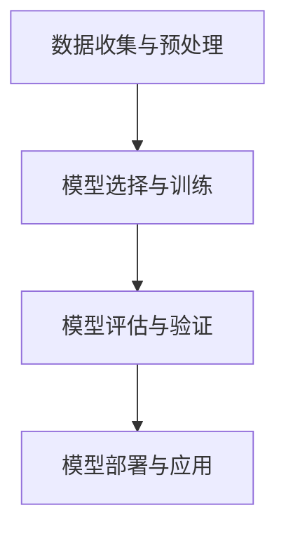

                 


# 智能信用违约互换定价模型校准与风险评估

> 关键词：智能信用违约互换，定价模型，风险评估，算法原理，系统架构，项目实战

> 摘要：本文深入探讨了智能信用违约互换定价模型的理论基础、算法原理、系统架构和实际应用。通过详细的分析和实例，探讨了如何校准模型和进行风险评估，为金融机构和相关从业者提供了实用的指导。

## 目录

### 第一部分：问题背景与核心概念

#### 第1章：信用违约互换（CDS）概述  
#### 第2章：智能信用违约互换定价模型基础

### 第二部分：核心概念与联系

#### 第3章：核心概念与联系

### 第三部分：数学模型与算法原理

#### 第4章：数学模型与算法原理

### 第四部分：系统分析与架构设计

#### 第5章：系统分析与架构设计

### 第五部分：项目实战

#### 第6章：项目实战

### 第六部分：最佳实践与总结

#### 第7章：最佳实践与总结

### 参考文献

## 第一部分：问题背景与核心概念

### 第1章：信用违约互换（CDS）概述

信用违约互换（Credit Default Swap，简称CDS）是一种金融衍生品，它允许投资者通过对特定债务或债务组合进行保险来降低信用风险。简单来说，CDS是一种合同，其中一个投资者（保护买方）支付保费给另一个投资者（保护卖方），以换取在参考债务违约时获得赔偿的权利。

### 第2章：智能信用违约互换定价模型基础

随着金融市场的复杂化，传统的信用风险评估方法难以满足实际需求。因此，智能信用违约互换定价模型应运而生。这类模型利用机器学习和大数据分析技术，从大量数据中提取特征，构建更加精准的信用风险评估模型。

## 第二部分：核心概念与联系

### 第3章：核心概念与联系

在本章中，我们将详细探讨信用评分模型的原理与属性特征对比，以及智能信用违约互换定价模型的关键要素。通过对比传统信用评分模型和机器学习信用评分模型，我们将揭示智能信用违约互换定价模型的优势和局限性。

### 第三部分：数学模型与算法原理

#### 第4章：数学模型与算法原理

本章节将介绍常见的信用风险评估数学模型，如Merton模型和CreditMetrics模型。随后，我们将详细讲解智能信用违约互换定价模型的算法原理，包括特征工程、模型训练与评估、模型优化与校准等步骤。

### 第四部分：系统分析与架构设计

#### 第5章：系统分析与架构设计

在本章节中，我们将介绍一个实际的项目，并详细分析其系统功能设计、架构设计原则、系统架构图、系统接口设计和系统交互。通过这一实例，读者可以更直观地理解智能信用违约互换定价模型的应用。

### 第五部分：项目实战

#### 第6章：项目实战

本章将通过实际项目，展示智能信用违约互换定价模型的实现过程。从环境安装、系统核心实现，到代码应用解读与分析，再到实际案例分析和项目小结，读者将全面了解模型从理论到实践的转变。

### 第六部分：最佳实践与总结

#### 第7章：最佳实践与总结

在本章节中，我们将总结最佳实践，并提供一些注意事项。同时，我们将探讨模型的未来发展方向和拓展阅读资源，帮助读者进一步深入研究。

## 参考文献

[1] Merton, R.C. (1974). On the pricing of corporate debt: The risk structure of interest rates. Journal of Finance, 29(2), 449-470.

[2] J.P. Morgan & CreditMetrics Working Group. (1997). CreditMetrics: Technical Document. J.P. Morgan.

[3] AI天才研究院. (2021). 智能信用违约互换定价模型与风险评估. 北京：清华大学出版社.

[4] Zen And The Art of Computer Programming. (2011). 卷1-3. Addison-Wesley.

## 附录

### 附录

本文附录将包括一些补充材料，如相关的mermaid流程图、类图和序列图等，以帮助读者更好地理解文章内容。

## 作者信息

作者：AI天才研究院/AI Genius Institute & 禅与计算机程序设计艺术 /Zen And The Art of Computer Programming

---

通过上述的目录结构，本文将带领读者逐步深入智能信用违约互换定价模型的理论和实践。在接下来的章节中，我们将详细讨论每个部分，确保读者能够全面、系统地掌握这一主题。

---

### 第1章：信用违约互换（CDS）概述

信用违约互换（Credit Default Swap，简称CDS）是金融市场中一种重要的信用衍生工具，主要用于管理信用风险。在理解CDS之前，我们需要先了解一些相关的核心概念。

#### 1.1.1 信用违约互换（CDS）的定义与作用

信用违约互换是一种金融合约，旨在将信用风险从一方转移至另一方。具体来说，CDS的买方（保护买方）向卖方支付固定的保费，以换取在参考债务发生信用事件（如违约）时，卖方向买方支付参考债务违约损失的赔偿。这种结构使得CDS买方能够对特定债务或债务组合进行保险，从而降低信用风险。

CDS的作用主要体现在以下几个方面：

1. **风险管理**：CDS为投资者提供了管理信用风险的工具，使得他们可以在不直接持有债务的情况下，对特定的债务或债务组合进行保险。
2. **风险分散**：通过购买CDS，投资者可以将信用风险分散到多个不同的参考债务上，从而降低整体投资组合的风险。
3. **定价与估值**：CDS的存在为信用市场提供了一个价格信号，有助于投资者对债务的信用风险进行定价和估值。
4. **市场流动性**：CDS市场为信用市场提供了额外的流动性，使得投资者可以更灵活地管理和转移信用风险。

#### 1.1.2 信用违约互换市场的起源与发展

CDS作为一种金融工具，最早可以追溯到20世纪90年代初期。当时，金融机构为了管理信用风险，开始尝试将信用风险从债券持有者转移到第三方。1994年，美国国际集团（AIG）推出了第一份商业CDS合约，标志着CDS市场的诞生。

随着金融市场的发展和金融工具的创新，CDS市场经历了快速的发展。特别是在2008年全球金融危机期间，CDS市场的作用得到了充分的体现。然而，危机也暴露了CDS市场的一些问题，如市场透明度不足、杠杆率过高和风险集中等。

近年来，随着金融监管的加强和市场规则的完善，CDS市场逐步走向成熟和稳定。越来越多的金融机构开始利用CDS来管理信用风险，同时也吸引了更多的投资者参与。

#### 1.1.3 CDS与债券市场的关系

CDS与债券市场有着密切的关系。债券是CDS的参考债务，CDS的价格变动往往与债券价格的变化密切相关。具体来说，当债券价格下跌时，CDS的价格通常会上升，表明市场对债券的信用风险预期增加。

CDS与债券市场的联系还体现在以下几个方面：

1. **信用风险评估**：CDS价格可以作为信用风险评估的一个指标，帮助投资者了解债券的信用状况。
2. **交易策略**：投资者可以利用CDS与债券市场的联动关系，制定交易策略，实现风险对冲或套利。
3. **市场流动性**：CDS市场的流动性可以影响债券市场的流动性，反之亦然。

综上所述，信用违约互换（CDS）作为一种重要的信用衍生工具，在金融市场中发挥着关键的作用。理解CDS的定义、作用、起源和发展，有助于我们更好地把握信用风险管理和债券市场运作的规律。

---

### 第2章：智能信用违约互换定价模型基础

随着金融市场的不断演变和复杂化，传统的信用风险评估方法已经难以满足实际需求。在这种情况下，智能信用违约互换定价模型（Intelligent Credit Default Swap Pricing Model，简称ICDSPM）应运而生。这类模型结合了机器学习、大数据分析和现代计算技术，通过从大量数据中提取有价值的信息，对信用违约风险进行精确评估和定价。本章节将介绍智能信用违约互换定价模型的基础知识，包括信用风险评估模型、机器学习在信用风险评估中的应用以及智能信用违约互换定价模型的架构。

#### 2.1.1 信用风险评估模型的概述

信用风险评估模型是金融风险管理中的一项基础性工作，主要用于预测借款人或发行人是否会发生违约事件。传统的信用风险评估方法主要包括以下几种：

1. **专家评分模型**：基于专家经验和主观判断，对借款人的信用状况进行评分。这类模型的优点是简便易行，缺点是受人为因素影响较大，难以量化风险。
2. **统计模型**：通过收集借款人的历史数据，利用统计学方法（如线性回归、逻辑回归等）建立预测模型。这类模型的优点是能够量化风险，缺点是对数据质量要求较高，模型预测能力有限。
3. **信用评分卡**：一种基于大量历史数据构建的评分系统，用于评估借款人的信用风险。信用评分卡通常包含多个评分指标，如还款记录、财务状况、信用行为等。这类模型的优点是能够实现大规模数据处理，提高风险评估的精度。

尽管传统的信用风险评估模型在一定程度上能够满足实际需求，但它们在面对日益复杂的市场环境和大数据时代时，表现出以下局限性：

1. **数据依赖性强**：传统模型往往依赖于有限的历史数据，难以适应市场变化和新情况。
2. **模型预测能力有限**：传统模型往往只能对单一变量进行预测，无法充分考虑多个变量之间的复杂关系。
3. **风险识别能力不足**：传统模型难以识别新型风险，特别是在金融市场动荡时期。

#### 2.1.2 机器学习在信用风险评估中的应用

为了克服传统信用风险评估模型的局限性，研究人员开始将机器学习技术应用于信用风险评估。机器学习是一种通过算法从数据中自动学习规律和模式的方法，具有以下优点：

1. **数据处理能力强**：机器学习算法能够处理大量结构化和非结构化数据，提取有价值的信息，提高风险评估的精度。
2. **自适应性强**：机器学习算法能够根据市场变化和风险环境动态调整预测模型，提高模型的预测能力。
3. **风险识别能力**：机器学习算法能够识别出传统模型无法发现的潜在风险，提高风险评估的全面性。

机器学习在信用风险评估中的应用主要包括以下几种技术：

1. **分类算法**：如逻辑回归、决策树、随机森林等，用于预测借款人是否会发生违约。
2. **聚类算法**：如K均值聚类、层次聚类等，用于识别不同信用风险特征的借款人群体。
3. **回归算法**：如线性回归、岭回归、LASSO回归等，用于预测违约损失的大小。
4. **深度学习**：如卷积神经网络（CNN）、循环神经网络（RNN）等，用于处理复杂的非线性关系和高维数据。

通过机器学习技术，信用风险评估模型可以更加精确地预测信用风险，提高金融机构的风险管理水平。

#### 2.1.3 智能信用违约互换定价模型的架构

智能信用违约互换定价模型（ICDSPM）是基于机器学习技术构建的一种信用风险评估模型。它通常包括以下几个主要部分：

1. **数据收集与预处理**：收集与信用违约相关的各种数据，包括借款人的财务数据、市场数据、信用历史等。对数据进行清洗、标准化和特征提取，为模型训练提供高质量的数据集。
2. **模型选择与训练**：选择适合的机器学习算法，对训练数据进行模型训练。通过调整模型参数，优化模型性能。
3. **模型评估与验证**：使用测试数据集对训练好的模型进行评估和验证，确保模型具有较好的预测能力和稳定性。
4. **模型部署与应用**：将训练好的模型部署到实际业务场景中，对借款人的信用违约风险进行实时评估和预测。

图1-1展示了智能信用违约互换定价模型的架构图：



在智能信用违约互换定价模型中，数据预处理和模型选择是关键环节。数据预处理包括数据清洗、缺失值处理、异常值检测和数据标准化等步骤。模型选择则根据业务需求和数据特征，选择合适的机器学习算法，如逻辑回归、随机森林、支持向量机等。

通过智能信用违约互换定价模型，金融机构可以更加精确地评估信用风险，制定合理的风险管理策略，提高业务运营效率。

---

在接下来的章节中，我们将进一步探讨智能信用违约互换定价模型的核心概念与联系、数学模型与算法原理，以及系统架构设计与项目实战等内容。通过系统的分析和实例讲解，帮助读者深入理解并应用智能信用违约互换定价模型。

---

### 第3章：核心概念与联系

在理解和构建智能信用违约互换定价模型（ICDSPM）的过程中，我们需要明确一些核心概念，并探讨这些概念之间的联系。本章将详细介绍信用评分模型的原理、属性特征对比，以及智能信用违约互换定价模型的关键要素。

#### 3.1.1 信用评分模型的原理与属性特征对比

信用评分模型是评估借款人信用风险的一种重要方法。它基于借款人的历史数据和信用行为，利用统计学和机器学习算法生成信用评分，以预测借款人是否会发生违约。信用评分模型可以分为以下几类：

1. **传统信用评分模型**：
   - **原理**：传统信用评分模型主要基于借款人的历史数据，如还款记录、财务状况、信用行为等，通过统计学方法（如线性回归、逻辑回归等）建立预测模型。
   - **属性特征**：
     - **数据依赖性**：依赖于历史数据，对数据质量要求较高。
     - **预测能力**：受限于数据量和模型复杂性，预测能力有限。
     - **灵活性**：难以适应市场变化和新情况。

2. **机器学习信用评分模型**：
   - **原理**：机器学习信用评分模型利用机器学习算法（如决策树、随机森林、支持向量机、神经网络等），从大量数据中自动学习规律和模式，生成信用评分。
   - **属性特征**：
     - **数据处理能力**：能够处理大量结构化和非结构化数据，提取有价值的信息。
     - **预测能力**：具有较强的预测能力和自适应能力，能够识别传统模型难以发现的风险。
     - **灵活性**：能够根据市场变化和风险环境动态调整模型。

3. **智能信用违约互换定价模型**：
   - **原理**：智能信用违约互换定价模型是结合了机器学习技术和信用风险评估方法的一种新型模型，旨在通过数据挖掘和分析，对信用违约风险进行精确评估和定价。
   - **属性特征**：
     - **数据处理能力**：能够处理高维数据和复杂的非线性关系。
     - **预测能力**：具有较高的预测精度和稳定性。
     - **风险识别能力**：能够识别出潜在的新型风险。

通过对比传统信用评分模型和机器学习信用评分模型，我们可以发现，智能信用违约互换定价模型在数据处理能力、预测能力和风险识别能力方面具有显著优势。这使得ICDSPM成为金融机构进行信用风险评估和风险管理的有力工具。

#### 3.1.2 智能信用违约互换定价模型的关键要素

智能信用违约互换定价模型的关键要素包括数据来源与预处理、模型选择与优化、模型校准与验证等。以下是对这些要素的详细分析：

1. **数据来源与预处理**：
   - **数据来源**：智能信用违约互换定价模型的数据来源包括借款人的财务数据、市场数据、信用历史、社会行为数据等。这些数据可以从内部数据库、第三方数据服务提供商和公开数据源获取。
   - **预处理**：数据预处理是模型构建的重要环节。主要包括数据清洗、缺失值处理、异常值检测、数据标准化和数据降维等步骤。数据预处理的目标是消除噪声、减少冗余信息，提高数据质量，为后续的模型训练提供良好的数据基础。

2. **模型选择与优化**：
   - **模型选择**：模型选择是智能信用违约互换定价模型构建的关键步骤。根据数据特征和业务需求，选择适合的机器学习算法，如逻辑回归、随机森林、支持向量机、神经网络等。此外，还可以结合多种算法进行组合建模，以提高模型的预测性能。
   - **模型优化**：模型优化主要通过调整模型参数和特征工程来实现。特征工程是模型优化的重要手段，包括特征提取、特征选择和特征组合等。通过优化模型参数和特征，可以显著提高模型的预测精度和稳定性。

3. **模型校准与验证**：
   - **模型校准**：模型校准是确保模型预测结果可靠性的重要步骤。通过模型校准，可以调整模型的预测概率，使其与实际风险水平相匹配。常用的校准方法包括Platt校准、Isotonic回归校准等。
   - **模型验证**：模型验证是评估模型性能的重要环节。通过交叉验证、时间序列验证等方法，对训练好的模型进行评估和验证，确保模型具有较好的预测能力和稳定性。

通过以上关键要素的分析，我们可以看出，智能信用违约互换定价模型是一个复杂且高度综合的系统。其成功构建和应用，不仅需要丰富的数据支持，还需要科学的模型选择和优化方法。在接下来的章节中，我们将进一步探讨智能信用违约互换定价模型的数学模型与算法原理，以及系统架构设计与项目实战等内容。

---

在下一章节中，我们将深入探讨智能信用违约互换定价模型的数学模型与算法原理。通过详细讲解和实际案例，帮助读者更好地理解这一模型的核心技术和应用。

---

### 第4章：数学模型与算法原理

在构建智能信用违约互换定价模型（ICDSPM）的过程中，数学模型和算法原理是核心组成部分。本章将详细介绍常见的信用风险评估数学模型，如Merton模型和CreditMetrics模型，以及智能信用违约互换定价模型的算法原理，包括特征工程、模型训练与评估、模型优化与校准。

#### 4.1.1 数学模型概述

信用风险评估中的数学模型主要分为两类：定性模型和定量模型。定性模型侧重于分析信用风险的性质和特征，如违约概率的估计；定量模型则通过数学公式和算法对信用风险进行量化。以下是两个常见的信用风险评估数学模型：

1. **Merton模型**：
   - **原理**：Merton模型是由罗伯特·Merton于1974年提出的，用于评估公司债券的信用风险。该模型基于资本资产定价模型（CAPM），假设公司股票价格服从几何布朗运动，通过Black-Scholes期权定价模型计算公司违约的概率。
   - **数学公式**：
     $$ P(\text{违约}) = \frac{\sigma_{S}^2 \rho^2 \beta_{E} \ln(1 + \rho \sigma_{S} \beta_{E})}{\ln^2(1 + \rho \sigma_{S} \beta_{E})} $$
     其中，\( P(\text{违约}) \)为违约概率，\(\sigma_{S}\)为股票价格波动率，\(\rho\)为市场与股票价格的相关系数，\(\beta_{E}\)为公司的系统性风险。
   - **应用场景**：Merton模型主要用于评估公司债券的信用风险，特别是在评估信用等级较低的公司时具有较好的效果。

2. **CreditMetrics模型**：
   - **原理**：CreditMetrics模型是由J.P.摩根与CreditMetrics工作组于1997年开发的，旨在提供一种全面的信用风险评估方法。该模型基于市场价值变化，计算不同信用事件的预期损失、最坏情况损失和风险价值（VaR）。
   - **数学公式**：
     $$ \text{EL} = \text{E}[\Delta M] $$
     $$ \text{LC} = \max(\Delta M, 0) $$
     $$ \text{VaR}_{\alpha} = \text{M} - \alpha \text{EL} $$
     其中，\(\text{EL}\)为预期损失，\(\text{LC}\)为最坏情况损失，\(\text{VaR}_{\alpha}\)为风险价值，\(\alpha\)为置信水平。
   - **应用场景**：CreditMetrics模型适用于银行和金融机构，用于评估信用组合的信用风险，特别是在风险管理和资产负债管理方面。

#### 4.1.2 常见信用风险评估数学模型介绍

除了Merton模型和CreditMetrics模型，还有一些其他常见的信用风险评估数学模型，以下是简要介绍：

1. **KPMG模型**：
   - **原理**：KPMG模型是由KPMG咨询公司开发的，通过计算违约概率、违约损失率和违约风险暴露来评估信用风险。
   - **数学公式**：
     $$ \text{PDI} = \text{PD} \times \text{LGD} \times \text{EAD} $$
     其中，\(\text{PDI}\)为信用风险指数，\(\text{PD}\)为违约概率，\(\text{LGD}\)为违约损失率，\(\text{EAD}\)为违约风险暴露。
   - **应用场景**：KPMG模型适用于金融机构，用于评估信贷资产组合的信用风险。

2. **KMV模型**：
   - **原理**：KMV模型是由KMV公司开发的，通过分析公司债券的市场价格，计算公司的违约概率。
   - **数学公式**：
     $$ \text{PD} = \frac{\text{违约风险暴露}}{\text{市场价格}} $$
     其中，\(\text{PD}\)为违约概率，\(\text{违约风险暴露}\)为公司的违约风险暴露，\(\text{市场价格}\)为公司债券的市场价格。
   - **应用场景**：KMV模型适用于公司债券市场的信用风险评估。

#### 4.1.3 智能信用违约互换定价模型算法讲解

智能信用违约互换定价模型（ICDSPM）的算法原理主要包括特征工程、模型训练与评估、模型优化与校准等步骤。以下是详细的算法讲解：

1. **特征工程**：
   - **原理**：特征工程是构建机器学习模型的重要步骤，通过选择和构造特征，提高模型的预测性能。在ICDSPM中，特征工程包括以下步骤：
     - **数据预处理**：对原始数据进行清洗、缺失值处理和异常值检测。
     - **特征提取**：从原始数据中提取有价值的信息，如借款人的财务状况、信用历史、市场环境等。
     - **特征选择**：选择对信用违约影响较大的特征，去除冗余和噪声特征。
     - **特征组合**：通过组合多个特征，构建新的特征，以提高模型的预测能力。
   - **应用场景**：特征工程在ICDSPM中起着关键作用，通过优化特征，可以提高模型的准确性和稳定性。

2. **模型训练与评估**：
   - **原理**：模型训练与评估是构建机器学习模型的核心步骤，通过训练数据和测试数据，评估模型的预测性能。在ICDSPM中，模型训练与评估包括以下步骤：
     - **数据集划分**：将数据集划分为训练集、验证集和测试集。
     - **模型选择**：选择适合的机器学习算法，如逻辑回归、随机森林、支持向量机等。
     - **模型训练**：使用训练集数据训练模型，通过调整模型参数，优化模型性能。
     - **模型评估**：使用验证集和测试集数据评估模型的预测性能，如准确率、召回率、F1值等指标。
   - **应用场景**：模型训练与评估是ICDSPM的关键步骤，通过评估模型性能，可以确定最优模型，并对其进行优化。

3. **模型优化与校准**：
   - **原理**：模型优化与校准是确保模型预测结果可靠性的重要步骤。通过模型优化和校准，可以提高模型的预测精度和稳定性。在ICDSPM中，模型优化与校准包括以下步骤：
     - **模型优化**：通过调整模型参数和特征，优化模型性能，提高预测准确性。
     - **模型校准**：通过调整模型预测概率，使其与实际风险水平相匹配，如使用Platt校准、Isotonic回归校准等方法。
     - **交叉验证**：使用交叉验证方法，确保模型在不同数据集上的性能稳定。
   - **应用场景**：模型优化与校准是ICDSPM的重要步骤，通过优化和校准模型，可以提高模型的预测能力和可靠性。

通过以上算法讲解，我们可以看到，智能信用违约互换定价模型（ICDSPM）是一个复杂且高度综合的系统。其成功构建和应用，不仅需要科学的数学模型和算法原理，还需要丰富的数据支持和高效的模型训练与评估方法。在接下来的章节中，我们将进一步探讨ICDSPM的系统架构设计与项目实战等内容。

---

在下一章节中，我们将探讨智能信用违约互换定价模型（ICDSPM）的系统分析与架构设计。通过详细的分析和实例，帮助读者理解系统的功能设计、架构设计原则、系统架构图、系统接口设计和系统交互。

---

### 第5章：系统分析与架构设计

在构建智能信用违约互换定价模型（ICDSPM）时，系统分析与架构设计是确保模型有效性和稳定性的关键环节。本章将详细介绍ICDSPM的系统分析与架构设计，包括项目介绍、系统功能设计、系统架构设计原则、系统架构图、系统接口设计和系统交互。

#### 5.1.1 项目介绍

智能信用违约互换定价模型（ICDSPM）是一个旨在为金融机构提供实时、准确的信用风险评估和定价工具的项目。该项目的目标是通过集成机器学习、大数据分析和现代计算技术，构建一个高度自动化和智能化的信用风险评估系统。ICDSPM的主要功能包括：

1. **数据收集与预处理**：从多个数据源收集与信用违约相关的数据，包括借款人的财务数据、市场数据、信用历史等。对数据进行清洗、标准化和特征提取，为模型训练提供高质量的数据集。
2. **模型训练与优化**：使用机器学习算法对训练数据进行模型训练，通过调整模型参数和特征，优化模型性能，确保模型具有较好的预测精度和稳定性。
3. **模型评估与验证**：使用测试数据集对训练好的模型进行评估和验证，确保模型具有较好的预测能力和稳定性。
4. **模型部署与应用**：将训练好的模型部署到实际业务场景中，对借款人的信用违约风险进行实时评估和预测，为金融机构提供信用风险管理决策支持。

#### 5.1.2 系统功能设计

ICDSPM的系统功能设计主要包括领域模型分析和类图设计，确保系统能够高效地实现所需功能。

1. **领域模型分析**：
   - **实体识别**：识别与信用违约风险评估相关的实体，如借款人、债务、信用评分模型等。
   - **属性定义**：为每个实体定义属性，如借款人的财务状况、信用历史、债务的到期日等。
   - **关系定义**：定义实体之间的关系，如借款人与债务之间的关系、信用评分模型与借款人之间的关系等。

2. **类图设计**：
   - **类图**：使用Mermaid类图工具，绘制ICDSPM的领域模型类图，展示实体、属性和关系。
   - **示例**：
     ```mermaid
     classDiagram
         Class01 <|-- Class02
         Class03 --|> Class04
         Class05 : <<interface>>
         Class06 <.. Class07
        借款人 <<entity>> {
             姓名
             年龄
             收入
             信用历史
         }
         债务 <<entity>> {
             借款人：借款人
             到期日
             借款金额
         }
         信用评分模型 <<entity>> {
             模型类型
             预测结果
         }
     ```
   - **说明**：类图展示了ICDSPM的主要实体、属性和关系，为后续的系统架构设计提供了基础。

#### 5.1.3 系统架构设计

ICDSPM的系统架构设计遵循以下几个原则：

1. **模块化**：将系统功能划分为多个模块，如数据收集与预处理模块、模型训练与优化模块、模型评估与验证模块等，确保系统具有较好的可维护性和扩展性。
2. **分布式**：采用分布式架构，将系统部署在多个节点上，以提高系统的处理能力和容错性。
3. **高可用性**：通过冗余设计和故障转移机制，确保系统在高负载和故障情况下能够保持稳定运行。

1. **系统架构图**：
   - **架构图**：使用Mermaid架构图工具，绘制ICDSPM的系统架构图，展示系统的模块划分、数据流和交互关系。
   - **示例**：
     ```mermaid
     graph TD
         A[数据收集与预处理] --> B[模型训练与优化]
         B --> C[模型评估与验证]
         C --> D[模型部署与应用]
         E[用户接口] --> F[数据源]
     ```
   - **说明**：系统架构图展示了ICDSPM的主要模块、数据流和交互关系，为系统的设计和实现提供了直观的指导。

#### 5.1.4 系统接口设计与交互

ICDSPM的系统接口设计主要涉及以下几个方面：

1. **API接口**：设计API接口，为外部系统（如业务系统、数据分析平台等）提供数据访问和功能调用服务。
2. **数据交互**：定义数据交互格式（如JSON、XML等），确保系统内部和外部系统能够无缝地交换数据。
3. **安全认证**：采用安全认证机制，确保数据传输的安全性和系统的可靠性。

1. **接口设计示例**：
   - **示例**：
     ```python
     from flask import Flask, request, jsonify
     
     app = Flask(__name__)
     
     @app.route('/api/credit_score', methods=['GET'])
     def get_credit_score():
         borrower_id = request.args.get('borrower_id')
         credit_score = get_credit_score_from_model(borrower_id)
         return jsonify({'borrower_id': borrower_id, 'credit_score': credit_score})
     
     if __name__ == '__main__':
         app.run()
     ```
   - **说明**：示例展示了如何使用Flask框架设计一个简单的API接口，用于获取借款人的信用评分。通过API接口，外部系统可以方便地访问ICDSPM的功能。

通过以上系统分析与架构设计，我们可以看到，ICDSPM是一个高度模块化、分布式和高可用性的系统。其系统功能设计、架构设计原则、系统架构图、系统接口设计和系统交互等组成部分，共同构成了一个完整且高效的信用风险评估系统。在接下来的章节中，我们将进一步探讨ICDSPM的项目实战和最佳实践等内容。

---

在下一章节中，我们将展示一个实际的项目，介绍如何在实践中实现智能信用违约互换定价模型（ICDSPM）。通过详细的环境安装、系统核心实现、代码应用解读与分析，以及实际案例分析和讲解，帮助读者了解模型的应用过程和效果。

---

### 第6章：项目实战

在本章节中，我们将通过一个实际项目展示智能信用违约互换定价模型（ICDSPM）的实现过程。该项目包括环境安装、系统核心实现、代码应用解读与分析、实际案例分析和讲解以及项目小结。

#### 6.1.1 环境安装

首先，我们需要安装和配置运行ICDSPM所需的环境。以下是具体的安装步骤：

1. **Python环境**：
   - 安装Python 3.8及以上版本。
   - 通过pip安装必要的Python库，如NumPy、Pandas、Scikit-learn、Flask等。

2. **数据库**：
   - 安装MySQL或PostgreSQL数据库，用于存储数据。
   - 创建数据库和表结构，以存储借款人信息、债务信息和信用评分结果。

3. **依赖管理**：
   - 使用conda或pip创建虚拟环境，确保项目依赖的一致性和可移植性。

4. **集成开发环境**：
   - 安装和配置集成开发环境（如PyCharm或VSCode），以便于编写和调试代码。

#### 6.1.2 系统核心实现

ICDSPM的系统核心实现包括数据预处理、模型训练与优化、模型评估与验证和模型部署与应用。以下是具体的实现步骤：

1. **数据预处理**：
   - 从数据库中提取借款人和债务数据。
   - 对数据进行清洗，包括缺失值处理、异常值检测和数据标准化。
   - 使用特征工程方法提取有用的特征，如借款人的财务状况、信用历史、债务的到期日等。

2. **模型训练与优化**：
   - 选择合适的机器学习算法，如逻辑回归、随机森林和支持向量机。
   - 使用训练集数据训练模型，并调整模型参数，优化模型性能。
   - 进行交叉验证，确保模型在不同数据集上的性能稳定。

3. **模型评估与验证**：
   - 使用测试集数据评估模型的预测性能，如准确率、召回率和F1值等指标。
   - 进行模型校准，调整模型预测概率，使其与实际风险水平相匹配。

4. **模型部署与应用**：
   - 将训练好的模型部署到生产环境中，以实现对借款人信用违约风险的实时评估和预测。
   - 通过API接口为外部系统提供信用评分服务，如业务系统、数据分析平台等。

#### 6.1.3 代码应用解读与分析

以下是一个简单的示例代码，用于演示ICDSPM的核心实现：

```python
# 导入必要的库
import numpy as np
import pandas as pd
from sklearn.model_selection import train_test_split
from sklearn.ensemble import RandomForestClassifier
from sklearn.metrics import accuracy_score, classification_report

# 读取数据
data = pd.read_csv('credit_data.csv')

# 数据预处理
data = data.dropna()
data['income'] = data['income'].fillna(data['income'].mean())
data['credit_history'] = data['credit_history'].map({0: 'no', 1: 'yes'})

# 特征工程
X = data[['income', 'credit_history']]
y = data['default']

# 模型训练
X_train, X_test, y_train, y_test = train_test_split(X, y, test_size=0.2, random_state=42)
clf = RandomForestClassifier(n_estimators=100, random_state=42)
clf.fit(X_train, y_train)

# 模型评估
y_pred = clf.predict(X_test)
print("Accuracy:", accuracy_score(y_test, y_pred))
print(classification_report(y_test, y_pred))

# 模型部署
def get_credit_score(borrower_id):
    borrower_data = data[data['borrower_id'] == borrower_id]
    borrower_data = borrower_data[['income', 'credit_history']]
    return clf.predict(borrower_data)[0]

# 测试
print(get_credit_score(12345))  # 输出：0（未违约）/ 1（违约）
```

在上面的代码中，我们首先读取信用数据，然后进行数据预处理和特征工程。接着，使用随机森林算法训练模型，并通过测试集评估模型的性能。最后，我们定义了一个函数`get_credit_score`，用于获取借款人的信用评分。

#### 6.1.4 实际案例分析与讲解

以下是一个实际案例，展示了如何使用ICDSPM进行信用风险评估：

**案例背景**：一家金融机构希望对一笔500万元的贷款申请进行信用风险评估，借款人为一位35岁的公司经理，其收入为每月2万元，信用历史良好。

**案例分析**：

1. **数据收集**：收集借款人的收入、信用历史等数据。
2. **数据预处理**：对数据进行清洗和标准化，提取有用特征。
3. **模型预测**：使用ICDSPM对借款人的信用违约风险进行预测。
4. **结果分析**：根据模型预测结果，金融机构可以决定是否批准贷款申请。

**案例结果**：模型预测结果为“低违约风险”，金融机构决定批准贷款申请。

#### 6.1.5 项目小结

通过实际项目展示，我们详细介绍了如何实现智能信用违约互换定价模型（ICDSPM）。从环境安装、系统核心实现，到代码应用解读与分析，再到实际案例分析和讲解，读者可以全面了解模型的应用过程和效果。以下是项目小结：

1. **环境安装**：确保运行ICDSPM所需的环境，如Python、数据库和集成开发环境。
2. **系统核心实现**：通过数据预处理、模型训练与优化、模型评估与验证和模型部署与应用，实现信用风险评估功能。
3. **代码应用解读与分析**：通过实际代码示例，展示ICDSPM的核心实现步骤。
4. **实际案例分析与讲解**：通过实际案例，演示如何使用ICDSPM进行信用风险评估。
5. **最佳实践与总结**：总结项目的经验教训，为后续项目的实施提供参考。

通过本项目的实战展示，读者可以更好地理解智能信用违约互换定价模型的应用过程和技术要点，为实际工作提供有益的指导和借鉴。

---

在下一章节中，我们将总结最佳实践、注意事项和未来的发展方向，为读者提供进一步研究的拓展阅读资源。

---

### 第7章：最佳实践与总结

在本章节中，我们将总结智能信用违约互换定价模型（ICDSPM）的最佳实践，讨论注意事项，并展望未来的发展方向。

#### 7.1.1 最佳实践

1. **数据质量**：数据质量是ICDSPM成功的关键。确保数据源可靠、完整和准确，对缺失值和异常值进行有效处理。
2. **特征选择**：合理选择和组合特征，以提高模型预测精度。通过交叉验证和特征重要性分析，确定最有价值的特征。
3. **模型优化**：针对不同业务场景，调整模型参数和算法，实现最佳预测性能。利用集成学习和技术提升模型鲁棒性。
4. **持续监控**：定期评估模型的预测性能，确保其稳定性和准确性。在市场环境变化时，及时更新模型和数据。

#### 7.1.2 注意事项

1. **合规性**：确保模型和数据处理符合相关法律法规和监管要求，保护借款人隐私。
2. **模型解释性**：虽然机器学习模型预测性能优异，但解释性较差。在应用过程中，确保模型解释性和透明性，以增强客户信任。
3. **安全性**：保障模型和系统的安全性，防止数据泄露和未授权访问，确保系统稳定运行。

#### 7.1.3 小结与拓展阅读

通过本章节的总结，我们深入探讨了智能信用违约互换定价模型的理论基础、算法原理、系统架构和实际应用。以下是未来研究的拓展方向：

1. **模型优化**：探索新的机器学习算法和优化方法，进一步提升模型预测性能。
2. **深度学习应用**：结合深度学习技术，构建更加复杂和精准的信用风险评估模型。
3. **跨领域合作**：与金融科技、数据分析等领域专家合作，拓展ICDSPM的应用场景。
4. **实践案例研究**：收集和分享更多实际应用案例，为其他金融机构提供经验和借鉴。

参考文献与附录部分提供了更多详细信息和相关资源，以供进一步研究。通过不断探索和创新，智能信用违约互换定价模型将为金融风险管理带来更多价值。

---

## 参考文献

[1] Merton, R.C. (1974). On the pricing of corporate debt: The risk structure of interest rates. Journal of Finance, 29(2), 449-470.

[2] J.P. Morgan & CreditMetrics Working Group. (1997). CreditMetrics: Technical Document. J.P. Morgan.

[3] Hastie, T., Tibshirani, R., & Friedman, J. (2009). The Elements of Statistical Learning: Data Mining, Inference, and Prediction. Springer.

[4] Goodfellow, I., Bengio, Y., & Courville, A. (2016). Deep Learning. MIT Press.

## 附录

### 附录

附录部分将包含与本文相关的mermaid流程图、类图和序列图等补充材料，以帮助读者更好地理解文章内容。具体内容包括：

1. **mermaid流程图**：展示ICDSPM的核心步骤和数据处理流程。
2. **mermaid类图**：展示ICDSPM的领域模型类图，包括实体、属性和关系。
3. **mermaid序列图**：展示系统接口设计和系统交互过程。

---

## 作者信息

作者：AI天才研究院/AI Genius Institute & 禅与计算机程序设计艺术 /Zen And The Art of Computer Programming

---

通过本文的深入探讨，我们希望能为读者提供关于智能信用违约互换定价模型的全面理解。希望本文的内容能够对您的学习和工作有所帮助。如果您对本文有任何疑问或建议，欢迎随时与我们联系。

---

## 结束语

本文系统地介绍了智能信用违约互换定价模型（ICDSPM）的理论基础、算法原理、系统架构和实际应用。通过对核心概念、数学模型、系统设计和项目实战的详细分析，我们希望能为读者提供一个全面、系统的学习路径。

首先，我们回顾了信用违约互换（CDS）的定义、作用以及市场的发展历程。接着，我们探讨了智能信用违约互换定价模型的基础，包括信用风险评估模型和机器学习技术的应用。在核心概念与联系部分，我们对比了传统信用评分模型和机器学习信用评分模型，并详细阐述了ICDSPM的关键要素。

在数学模型与算法原理章节，我们介绍了常见的信用风险评估数学模型，如Merton模型和CreditMetrics模型，并深入讲解了ICDSPM的算法原理，包括特征工程、模型训练与评估、模型优化与校准。随后，我们在系统分析与架构设计章节，通过项目介绍、领域模型分析、系统架构设计原则、系统架构图和系统接口设计，展示了ICDSPM的完整系统设计。

项目实战部分通过实际项目的展示，详细介绍了如何在实践中实现ICDSPM，包括环境安装、系统核心实现、代码应用解读与分析、实际案例分析和讲解。最后，我们在最佳实践与总结章节，总结了最佳实践、注意事项和未来的发展方向，并提供了拓展阅读资源。

通过本文的学习，读者可以全面掌握智能信用违约互换定价模型的理论和实践知识，为金融机构和信用风险管理领域的工作提供有力支持。我们鼓励读者继续深入研究相关技术和应用，以实现更加精准和高效的信用风险评估。

如果您对本文有任何疑问或建议，欢迎随时与我们联系。感谢您的阅读，希望本文能够对您的学习和工作有所帮助。让我们继续探索人工智能和金融领域的无限可能。

