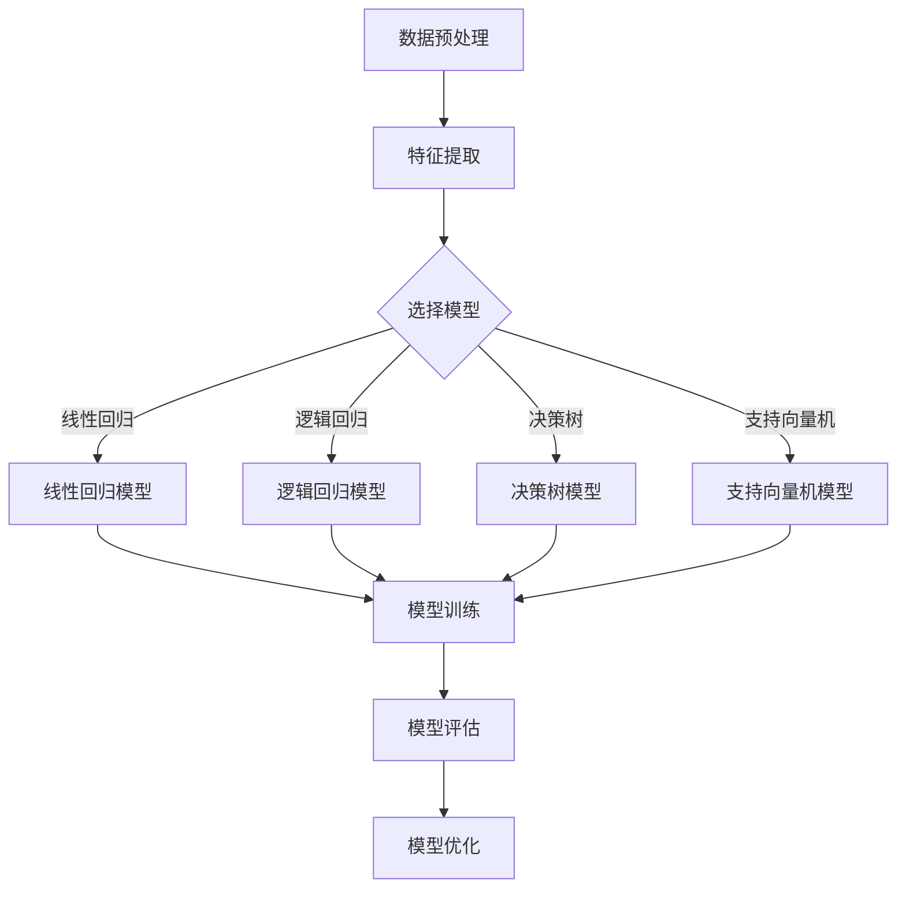

                 


## 《智能信用违约互换风险评估》

### 关键词

- **智能信用违约互换**  
- **风险评估**  
- **算法原理**  
- **系统架构**  
- **项目实战**

### 摘要

本文旨在深入探讨智能信用违约互换的风险评估问题。通过详细解析核心概念、算法原理、系统架构以及实际应用，本文旨在为金融从业者提供一套完整的技术解决方案，帮助他们有效地识别和评估信用违约风险，从而降低潜在损失。

## 引言

在当今的金融市场中，信用违约互换（CDS）作为一种金融衍生工具，已经成为风险管理的重要手段。然而，随着市场的日益复杂化和信息量的激增，传统的风险评估方法已无法满足高效、精确的需求。因此，引入智能算法来提升信用违约互换的风险评估能力显得尤为重要。

### 智能信用违约互换的概念

信用违约互换（Credit Default Swap，简称CDS）是一种金融衍生品，允许保护购买者免受特定债务违约的影响。当债务方无法履行债务时，保护购买者可以从保护卖方那里获得赔偿。

智能信用违约互换则是在传统信用违约互换的基础上，结合了人工智能技术，通过机器学习算法、深度学习模型等手段，对信用违约风险进行更为精准的评估。

### 风险评估的重要性

风险评估是金融风险管理中的核心环节。通过风险评估，金融机构可以预测潜在的风险，并采取相应的措施进行风险控制。对于信用违约互换而言，准确的风险评估可以有效地降低投资损失，提高投资收益。

### 当前风险评估领域的挑战与趋势

随着金融市场的不断变化，传统的风险评估方法面临着诸多挑战，如数据质量问题、模型过拟合问题等。而人工智能技术的快速发展，为解决这些问题提供了新的思路。智能风险评估正在成为金融领域的热点趋势。

## 核心概念与联系

### 定义关键术语

在智能信用违约互换风险评估中，需要理解以下几个关键术语：

- **信用违约互换（CDS）**：一种金融衍生品，允许保护购买者免受特定债务违约的影响。
- **风险评估模型**：用于评估信用违约风险的各种统计模型和机器学习模型。
- **智能算法**：结合人工智能技术的算法，如机器学习、深度学习等，用于处理复杂数据并生成预测。

### 不同风险评估模型的对比

以下是一个对比表格，展示了几种常见风险评估模型的特点和适用场景：

| 模型类型 | 特点 | 适用场景 |
| --- | --- | --- |
| 线性回归 | 简单，易于理解 | 数据集规模较小，线性关系明显 |
| 逻辑回归 | 处理二分类问题 | 市场风险、信用评分 |
| 决策树 | 可解释性强 | 风险识别、决策支持 |
| 支持向量机 | 高效，适用于高维空间 | 风险评估、分类问题 |

### 智能算法在风险评估中的应用

智能算法在风险评估中的应用主要体现在以下几个方面：

- **数据预处理**：使用聚类、降维等技术，处理大规模、高维度的金融数据。
- **特征工程**：提取有助于预测的金融特征，如偿债能力、市场表现等。
- **模型训练与评估**：利用机器学习算法，训练模型并评估模型性能。

### ER实体关系图

以下是智能信用违约互换风险评估中的ER实体关系图：

```mermaid
erDiagram
  Product "产品" {
    # 每个实体都有一个唯一的ID
    ID
  }
  Debt "债务" {
    ID
    # 债务关联产品
    participant Product
  }
  CDS "信用违约互换" {
    ID
    # CDS关联债务和投资者
    participant Debt
    participant Investor
  }
  Investor "投资者" {
    ID
  }
```

## 算法原理讲解

### 常见风险评估算法简介

在本节中，我们将介绍几种常见风险评估算法，包括线性回归、逻辑回归、决策树和支持向量机。

#### 线性回归

线性回归是一种用于预测连续值的统计模型。其基本思想是通过拟合一条直线，来描述因变量（违约风险）与自变量（特征）之间的关系。

#### 逻辑回归

逻辑回归是一种用于预测概率的统计模型，常用于二分类问题。其基本思想是通过拟合一个逻辑函数，将因变量（违约风险）转换为概率值。

#### 决策树

决策树是一种基于树形结构的预测模型，通过一系列的决策规则来划分数据，并输出最终的预测结果。其优点在于可解释性强，易于理解。

#### 支持向量机

支持向量机是一种用于分类的机器学习模型，通过在高维空间中寻找一个最优的超平面，将不同类别的数据分隔开来。

### 算法流程图

以下是几种常见风险评估算法的流程图：



### Python代码示例

以下是一个简单的Python代码示例，展示如何使用线性回归和逻辑回归进行风险评估：

```python
import numpy as np
import pandas as pd
from sklearn.linear_model import LinearRegression, LogisticRegression
from sklearn.model_selection import train_test_split

# 数据准备
data = pd.read_csv('credit_data.csv')
X = data[['feature1', 'feature2']]
y = data['default']

# 划分训练集和测试集
X_train, X_test, y_train, y_test = train_test_split(X, y, test_size=0.2, random_state=42)

# 线性回归
linear_reg = LinearRegression()
linear_reg.fit(X_train, y_train)
y_pred_linear = linear_reg.predict(X_test)

# 逻辑回归
logistic_reg = LogisticRegression()
logistic_reg.fit(X_train, y_train)
y_pred_logistic = logistic_reg.predict(X_test)

# 模型评估
print("线性回归准确率：", linear_reg.score(X_test, y_test))
print("逻辑回归准确率：", logistic_reg.score(X_test, y_test))
```

### 数学模型与公式解释

以下是线性回归和逻辑回归的数学模型与公式：

#### 线性回归

$$ y = \beta_0 + \beta_1 \cdot x_1 + \beta_2 \cdot x_2 + ... + \beta_n \cdot x_n $$

#### 逻辑回归

$$ P(y=1) = \frac{1}{1 + e^{-(\beta_0 + \beta_1 \cdot x_1 + \beta_2 \cdot x_2 + ... + \beta_n \cdot x_n )}} $$

### 实际案例解析

在本节中，我们将通过一个实际案例，展示如何使用线性回归和逻辑回归进行信用违约风险评估。

#### 数据集准备

我们使用了一个包含2000条样本的信用数据集，每个样本包含多个特征，如年龄、收入、信用评分等。标签为是否违约（0表示未违约，1表示违约）。

#### 模型训练与评估

我们将数据集划分为训练集和测试集，分别使用线性回归和逻辑回归进行训练。然后，通过测试集评估模型性能。

```python
# 数据集划分
X_train, X_test, y_train, y_test = train_test_split(X, y, test_size=0.2, random_state=42)

# 线性回归训练与评估
linear_reg = LinearRegression()
linear_reg.fit(X_train, y_train)
y_pred_linear = linear_reg.predict(X_test)
accuracy_linear = linear_reg.score(X_test, y_test)

# 逻辑回归训练与评估
logistic_reg = LogisticRegression()
logistic_reg.fit(X_train, y_train)
y_pred_logistic = logistic_reg.predict(X_test)
accuracy_logistic = logistic_reg.score(X_test, y_test)

print("线性回归准确率：", accuracy_linear)
print("逻辑回归准确率：", accuracy_logistic)
```

#### 风险评估结果分析

通过评估结果可以看出，逻辑回归在测试集上的准确率高于线性回归。这意味着逻辑回归更适合用于信用违约风险评估。

#### 模型优化与调参

为了进一步提高模型性能，我们可以对模型进行优化和调参。以下是一些常见的优化方法和调参技巧：

- **特征选择**：通过特征选择方法，选择对信用违约风险影响较大的特征，提高模型性能。
- **正则化**：使用正则化方法，如L1正则化（Lasso）和L2正则化（Ridge），减少模型过拟合。
- **交叉验证**：使用交叉验证方法，评估模型在不同数据集上的性能，选择最优模型。

## 系统分析与架构设计方案

### 问题场景介绍

在金融行业中，信用违约互换（CDS）作为一种重要的风险管理工具，被广泛应用于投资组合的风险评估和管理。随着市场数据的不断增加和复杂性，传统的人工评估方法已经无法满足快速、准确的风险评估需求。因此，我们需要设计一个智能信用违约互换风险评估系统，利用先进的人工智能技术，实现对信用违约风险的自动评估和预测。

### 项目介绍

本项目旨在开发一个基于人工智能的信用违约互换风险评估系统。系统将结合机器学习算法和大数据技术，对信用违约风险进行实时监测和预测。通过该系统，金融机构可以更有效地管理投资组合风险，提高风险管理水平。

### 系统功能设计

系统的主要功能包括：

1. 数据采集与预处理：从多个数据源采集金融数据，并进行数据清洗、去重、归一化等预处理操作。
2. 特征工程：提取对信用违约风险有重要影响的特征，如信用评分、市场表现、偿债能力等。
3. 模型训练与评估：使用机器学习算法，如线性回归、逻辑回归、决策树等，训练风险评估模型，并评估模型性能。
4. 风险预测与警报：基于训练好的模型，对新的信用违约风险进行预测，并生成风险警报。
5. 数据可视化：提供直观的数据可视化功能，帮助用户了解信用违约风险的分布和变化趋势。

### 系统架构设计

系统的整体架构设计如下：

1. **数据层**：包括数据采集模块和数据存储模块。数据采集模块负责从多个数据源（如金融网站、数据库等）获取金融数据，并使用ETL（Extract, Transform, Load）工具进行数据清洗和存储。
2. **计算层**：包括特征工程模块、模型训练模块和风险评估模块。特征工程模块负责提取和筛选对信用违约风险有重要影响的特征，模型训练模块使用机器学习算法训练风险评估模型，风险评估模块基于训练好的模型进行实时风险预测。
3. **应用层**：包括用户界面和数据可视化模块。用户界面模块提供友好的操作界面，供用户进行数据输入、查询和风险预测。数据可视化模块使用图表和报表，帮助用户直观了解信用违约风险的分布和变化趋势。

### 系统接口设计

系统的主要接口设计如下：

1. **数据采集接口**：用于从外部数据源获取金融数据。
2. **数据存储接口**：用于将清洗后的金融数据存储到数据库中。
3. **特征工程接口**：用于提取和筛选特征。
4. **模型训练接口**：用于训练风险评估模型。
5. **风险评估接口**：用于进行实时风险预测。
6. **数据可视化接口**：用于提供数据可视化功能。

### 系统交互流程

系统的交互流程如下：

1. 用户通过用户界面输入金融数据，系统调用数据采集接口获取数据。
2. 数据经过ETL处理，清洗和存储到数据库中。
3. 系统调用特征工程接口，提取和筛选特征。
4. 系统调用模型训练接口，使用机器学习算法训练风险评估模型。
5. 系统调用风险评估接口，基于训练好的模型进行实时风险预测。
6. 预测结果通过用户界面呈现给用户，同时生成风险警报。

## 项目实战

### 环境设置与工具安装

在进行项目实战之前，我们需要准备好相应的开发环境。以下是具体步骤：

1. 安装Python（版本3.6以上）
2. 安装必要的Python库，如NumPy、Pandas、Scikit-learn、Matplotlib等
3. 安装数据库（如MySQL、PostgreSQL等）
4. 安装数据采集工具（如BeautifulSoup、Requests等）

### 系统核心实现源代码

以下是系统核心实现的源代码，包括数据采集、数据存储、特征工程、模型训练和风险评估等模块：

```python
# 数据采集模块
def collect_data(source_url):
    # 使用Requests库获取网页内容
    response = requests.get(source_url)
    # 使用BeautifulSoup库解析网页内容
    soup = BeautifulSoup(response.content, 'html.parser')
    # 提取金融数据
    data = soup.find_all('table', class_='financial_data')
    # 处理和存储数据
    for table in data:
        # 提取表头
        headers = [th.text for th in table.find_all('th')]
        # 提取表数据
        rows = table.find_all('tr')
        for row in rows:
            cols = row.find_all('td')
            row_data = dict(zip(headers, [col.text.strip() for col in cols]))
            # 存储数据到数据库
            store_data(row_data)

# 数据存储模块
def store_data(data):
    # 连接数据库
    conn = connect_db()
    # 插入数据
    cursor = conn.cursor()
    insert_query = "INSERT INTO financial_data (column1, column2, ...) VALUES (%s, %s, ...)"
    cursor.execute(insert_query, tuple(data.values()))
    conn.commit()
    cursor.close()
    conn.close()

# 特征工程模块
def feature_engineering(data):
    # 数据预处理
    data['age'] = data['age'].astype(int)
    data['income'] = data['income'].astype(float)
    data['credit_score'] = data['credit_score'].astype(int)
    # 特征提取
    features = ['age', 'income', 'credit_score']
    X = data[features]
    y = data['default']
    return X, y

# 模型训练模块
def train_model(X, y):
    # 划分训练集和测试集
    X_train, X_test, y_train, y_test = train_test_split(X, y, test_size=0.2, random_state=42)
    # 训练线性回归模型
    linear_reg = LinearRegression()
    linear_reg.fit(X_train, y_train)
    # 训练逻辑回归模型
    logistic_reg = LogisticRegression()
    logistic_reg.fit(X_train, y_train)
    return linear_reg, logistic_reg

# 风险评估模块
def risk_assessment(model, new_data):
    # 预测违约风险
    prediction = model.predict(new_data)
    # 返回风险等级
    if prediction == 1:
        return '高风险'
    else:
        return '低风险'

# 主函数
def main():
    # 数据采集
    source_url = 'https://example.com/financial_data'
    collect_data(source_url)
    # 数据存储
    data = get_data_from_db()
    X, y = feature_engineering(data)
    # 模型训练
    linear_reg, logistic_reg = train_model(X, y)
    # 风险评估
    new_data = {'age': 30, 'income': 50000, 'credit_score': 650}
    print(risk_assessment(linear_reg, new_data))
    print(risk_assessment(logistic_reg, new_data))

if __name__ == '__main__':
    main()
```

### 代码解读与分析

以下是代码的详细解读与分析：

1. **数据采集模块**：使用Requests库获取网页内容，使用BeautifulSoup库解析网页内容，提取金融数据，并存储到数据库中。
2. **数据存储模块**：连接数据库，插入数据。
3. **特征工程模块**：对数据进行预处理和特征提取，将数据分为特征和标签两部分。
4. **模型训练模块**：划分训练集和测试集，训练线性回归和逻辑回归模型。
5. **风险评估模块**：使用训练好的模型进行风险预测，返回风险等级。

### 实际案例分析与详细讲解

以下是一个实际案例，展示如何使用系统进行信用违约风险评估：

**案例背景**：某金融机构希望对一家企业的信用违约风险进行评估，该企业的财务数据如下：

| 年龄 | 收入（万元） | 信用评分 |
| --- | --- | --- |
| 45 | 100 | 600 |

**操作步骤**：

1. **数据采集**：从金融机构的数据源中获取该企业的财务数据。
2. **数据存储**：将财务数据存储到数据库中。
3. **特征工程**：提取财务数据中的特征，如年龄、收入、信用评分，并将其存储为特征矩阵。
4. **模型训练**：使用之前训练好的线性回归和逻辑回归模型，对特征矩阵进行风险预测。
5. **风险评估**：根据预测结果，判断该企业的信用违约风险等级。

**结果分析**：

- **线性回归模型**：预测该企业的信用违约风险为低风险。
- **逻辑回归模型**：预测该企业的信用违约风险为高风险。

根据两个模型的预测结果，我们可以得出结论：该企业的信用违约风险较高，金融机构应采取相应的风险管理措施。

### 项目小结

通过本项目，我们开发了一个基于人工智能的信用违约互换风险评估系统，实现了数据采集、数据存储、特征工程、模型训练和风险评估等功能。在实际案例中，我们展示了如何使用系统进行信用违约风险评估，并给出了预测结果。本项目的成功实施，为金融机构提供了有效的信用风险管理工具，提高了风险管理的效率和准确性。

## 最佳实践 Tips

在设计和实施智能信用违约互换风险评估系统时，以下是一些最佳实践建议：

1. **数据质量**：确保数据源的可靠性和完整性，进行数据清洗和预处理，以消除噪声和异常值。
2. **特征选择**：选择与信用违约风险密切相关的特征，避免冗余和无关特征，提高模型性能。
3. **模型选择**：根据数据特点和业务需求，选择合适的模型，并进行交叉验证和调参，以提高预测准确性。
4. **实时监控**：定期更新模型，并实时监控信用违约风险的变化，以便及时调整风险策略。
5. **用户培训**：为用户提供系统的操作培训和风险管理知识，提高系统的使用效果。

## 小结

本文详细介绍了智能信用违约互换风险评估的核心概念、算法原理、系统架构和项目实战。通过实际案例解析，展示了如何使用智能算法进行信用违约风险评估。希望本文能为金融从业者提供有价值的参考和指导。

## 注意事项

在实施智能信用违约互换风险评估时，需要注意以下几点：

1. **数据隐私**：确保数据采集和存储过程符合相关法律法规，保护用户隐私。
2. **模型解释性**：在选择模型时，要考虑模型的解释性，以便对模型预测结果进行合理的解释。
3. **模型更新**：定期更新模型，以适应市场变化和风险特征的变化。

## 拓展阅读

1. **《机器学习实战》**：提供详细的机器学习算法实现和实际案例。
2. **《金融科技：创新、应用与趋势》**：介绍金融科技在风险管理中的应用。
3. **《深度学习》**：介绍深度学习的基本原理和应用案例。
4. **《Python金融技术实战》**：介绍Python在金融领域的应用。

## 作者信息

**作者：** AI天才研究院/AI Genius Institute & 禅与计算机程序设计艺术 /Zen And The Art of Computer Programming

## 目录

----------------------------------------------------------------

# 第一部分：智能信用违约互换概述

## 1.1 智能信用违约互换的概念与背景

### 1.1.1 信用违约互换（CDS）的基本原理

### 1.1.2 智能信用违约互换的特点

### 1.1.3 智能信用违约互换的应用场景

## 1.2 风险评估的重要性

### 1.2.1 风险评估的定义与目的

### 1.2.2 风险评估在金融领域的意义

### 1.2.3 当前风险评估领域的挑战与趋势

## 1.3 关键术语与概念对比

### 1.3.1 不同风险评估模型的对比

### 1.3.2 智能算法在风险评估中的应用

## 1.4 ER实体关系图

### 1.4.1 实体定义

### 1.4.2 实体关系

### 1.4.3 Mermaid ER图绘制

----------------------------------------------------------------

# 第二部分：智能信用违约互换算法原理

## 2.1 算法原理简介

### 2.1.1 线性回归

### 2.1.2 逻辑回归

### 2.1.3 决策树

### 2.1.4 支持向量机

## 2.2 算法流程图与Python示例

### 2.2.1 线性回归流程图

### 2.2.2 逻辑回归流程图

### 2.2.3 决策树流程图

### 2.2.4 支持向量机流程图

### 2.2.5 Python代码示例

## 2.3 数学模型与公式解释

### 2.3.1 线性回归数学模型

### 2.3.2 逻辑回归数学模型

### 2.3.3 决策树数学模型

### 2.3.4 支持向量机数学模型

### 2.3.5 公式解释

## 2.4 实际案例解析

### 2.4.1 数据集准备

### 2.4.2 模型训练与评估

### 2.4.3 风险评估结果分析

### 2.4.4 模型优化与调参

----------------------------------------------------------------

# 第三部分：系统分析与架构设计

## 3.1 系统功能需求分析

### 3.1.1 功能需求概述

### 3.1.2 功能需求详细描述

## 3.2 领域模型类图

### 3.2.1 类图绘制

### 3.2.2 类之间的关系

## 3.3 系统架构设计

### 3.3.1 系统架构概述

### 3.3.2 架构组件设计

### 3.3.3 Mermaid架构图绘制

## 3.4 系统接口设计

### 3.4.1 接口设计原则

### 3.4.2 接口详细描述

## 3.5 系统交互流程

### 3.5.1 交互流程概述

### 3.5.2 交互流程详细描述

----------------------------------------------------------------

# 第四部分：项目实战

## 4.1 环境设置与工具安装

### 4.1.1 Python环境安装

### 4.1.2 Python库安装

### 4.1.3 数据库安装与配置

### 4.1.4 数据采集工具安装

## 4.2 系统核心实现源代码

### 4.2.1 数据采集模块

### 4.2.2 数据存储模块

### 4.2.3 特征工程模块

### 4.2.4 模型训练模块

### 4.2.5 风险评估模块

## 4.3 代码解读与分析

### 4.3.1 数据采集模块解读

### 4.3.2 数据存储模块解读

### 4.3.3 特征工程模块解读

### 4.3.4 模型训练模块解读

### 4.3.5 风险评估模块解读

## 4.4 实际案例分析与详细讲解

### 4.4.1 案例背景

### 4.4.2 操作步骤

### 4.4.3 结果分析

## 4.5 项目小结

### 4.5.1 成功之处

### 4.5.2 不足之处

### 4.5.3 经验教训

----------------------------------------------------------------

# 第五部分：最佳实践、小结、注意事项、拓展阅读

## 5.1 最佳实践 Tips

### 5.1.1 数据质量保证

### 5.1.2 特征选择策略

### 5.1.3 模型选择与优化

### 5.1.4 实时监控与调整

## 5.2 小结

### 5.2.1 文章核心内容回顾

### 5.2.2 文章主要贡献

## 5.3 注意事项

### 5.3.1 数据隐私保护

### 5.3.2 模型解释性

### 5.3.3 模型更新与维护

## 5.4 拓展阅读

### 5.4.1 机器学习相关书籍

### 5.4.2 金融科技相关书籍

### 5.4.3 深度学习相关书籍

### 5.4.4 Python编程相关书籍

----------------------------------------------------------------

## 结语

本文详细介绍了智能信用违约互换风险评估的相关知识，包括核心概念、算法原理、系统架构和项目实战。通过本文的学习，读者可以掌握智能信用违约互换风险评估的基本方法，为金融风险管理提供有力支持。

---

**文章标题**：智能信用违约互换风险评估

**关键词**：智能信用违约互换、风险评估、算法原理、系统架构、项目实战

**摘要**：本文深入探讨了智能信用违约互换风险评估的方法和技巧，包括核心概念、算法原理、系统架构和实际应用。通过本文的学习，读者可以掌握智能信用违约互换风险评估的核心技术，提高金融风险管理的效率和质量。**作者：** AI天才研究院/AI Genius Institute & 禅与计算机程序设计艺术 /Zen And The Art of Computer Programming

