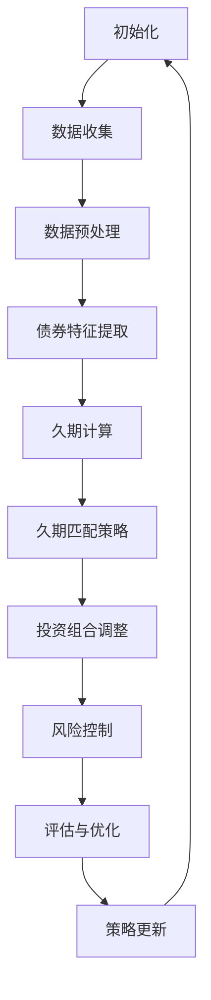
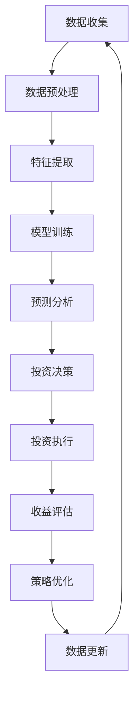
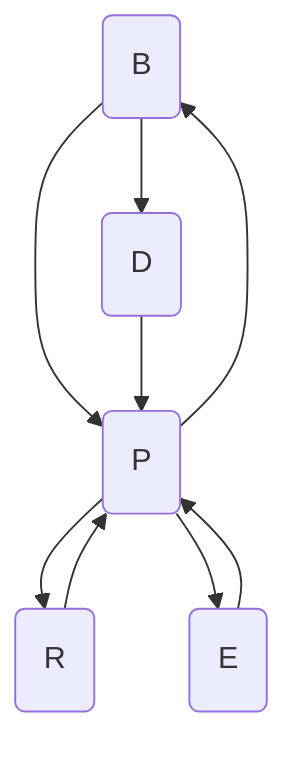
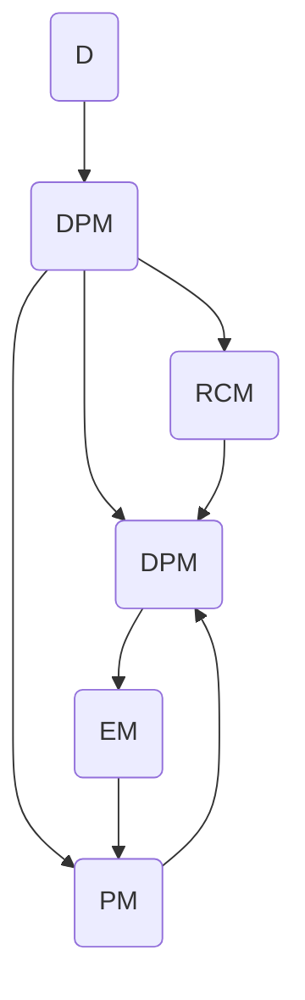
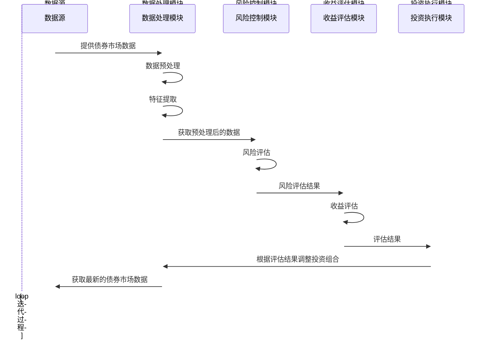

                 

### 引言

#### 1.1 问题背景

债券投资作为金融投资的重要组成部分，吸引了大量投资者的关注。债券市场作为金融市场的一个子市场，其规模庞大且具有高度流动性，提供了多样化的投资选择。在这个市场中，投资者通过购买不同类型的债券，如政府债券、企业债券和金融债券，以实现资产配置和风险分散的目标。

债券投资组合是投资者为了达到特定投资目标而构建的一系列债券的组合。通过合理配置债券投资组合，投资者可以优化收益率、降低风险，并适应不同的市场环境。债券投资组合的重要性在于，它不仅可以提供稳定的现金流，还能在一定程度上对冲通货膨胀和市场波动带来的影响。

久期管理是债券投资组合管理中的一个关键环节。久期，又称持续期，是指债券价格对利率变动的敏感度。久期管理的目标是保持债券投资组合的久期与投资者的风险偏好和投资期限相匹配，以应对市场利率的变化。有效的久期管理对于债券投资者而言至关重要，它不仅可以减少投资组合的波动性，还能优化投资组合的收益。

本文旨在探讨智能债券投资组合久期管理的原理和方法，通过一步步的逻辑分析，帮助读者理解这一复杂但重要的金融技术。文章将从以下几个方面展开讨论：

- **第1章 引言**：介绍债券市场概述、债券投资组合的重要性、久期管理的概念及意义。
- **第2章 核心概念与联系**：详细解释债券投资组合原理、久期管理原理和智能债券投资原理。
- **第3章 算法原理讲解**：阐述久期管理算法和智能债券投资算法的原理，并通过mermaid流程图和Python代码进行详细说明。
- **第4章 数学模型和数学公式**：介绍债券定价模型、久期计算模型和智能债券投资模型。
- **第5章 系统分析与架构设计方案**：分析系统功能、介绍项目背景和系统架构设计。

通过这些章节的讨论，读者将能够系统地理解智能债券投资组合久期管理的原理和方法，并掌握如何在实际操作中应用这些技术。

#### 1.2 问题描述

#### 久期管理的挑战

在债券投资中，久期管理是一个复杂且挑战性的任务。首先，债券市场受到多种因素的影响，包括宏观经济环境、政策变化、市场情绪等，这些因素都会导致利率的波动，从而影响债券价格。因此，债券投资者需要实时监控市场动态，及时调整投资组合以应对利率变化。

其次，不同类型的债券具有不同的久期特征。政府债券通常具有较短的久期，而企业债券和金融债券的久期可能更长。这意味着，当利率上升时，不同类型债券的价格波动幅度和方向可能不同。因此，投资者需要根据债券的久期特征来制定相应的投资策略。

最后，久期管理还涉及到投资组合的风险管理。债券投资组合的久期与其波动性紧密相关。如果投资组合的久期较长，那么在利率上升时，投资组合的波动性将增加，从而增加投资风险。因此，投资者需要在保持投资组合收益的同时，确保其风险在可接受的范围内。

#### 智能债券投资的需求

随着金融科技的发展，智能债券投资逐渐成为债券市场的一个重要趋势。智能债券投资利用人工智能和大数据分析技术，对市场数据进行分析和预测，从而制定更精确的投资策略。智能债券投资具有以下几个特点：

1. **数据驱动**：智能债券投资依赖于大量的市场数据，通过数据挖掘和机器学习算法，分析债券市场的趋势和模式，从而做出投资决策。

2. **实时监控**：智能债券投资系统能够实时监控市场动态，快速识别利率变化和其他影响因素，及时调整投资组合。

3. **风险控制**：智能债券投资系统具备先进的风险控制能力，通过分析债券的久期特征和市场波动性，制定合理的风险对冲策略。

4. **个性化投资**：智能债券投资可以根据投资者的风险偏好和投资目标，提供个性化的投资组合建议，帮助投资者优化资产配置。

#### 智能债券投资组合久期管理的目标

智能债券投资组合久期管理的目标是实现投资组合的长期稳定收益和风险控制。具体而言，智能债券投资组合久期管理的目标包括：

1. **久期匹配**：通过调整债券投资组合的久期，使其与投资者的投资期限和风险偏好相匹配，以降低利率波动对投资组合的影响。

2. **收益最大化**：通过智能分析，寻找市场中的高收益债券，优化投资组合的收益率。

3. **风险控制**：通过实时监控和风险对冲策略，确保投资组合的风险在可接受的范围内。

4. **资产配置**：根据市场变化和投资者需求，灵活调整投资组合，实现资产配置的优化。

总之，智能债券投资组合久期管理是一种高效、科学的投资管理方法，它利用先进的技术手段，帮助投资者实现投资目标，提高投资回报率。

#### 1.3 问题解决

#### 智能债券投资组合久期管理的方法

智能债券投资组合久期管理通过一系列科学的方法和步骤，实现投资组合的优化和风险控制。以下是智能债券投资组合久期管理的方法：

1. **数据收集**：首先，智能债券投资系统需要收集大量的市场数据，包括债券价格、利率、收益率、市场情绪等。这些数据可以通过金融数据提供商、交易所和新闻网站等渠道获取。

2. **数据预处理**：收集到的数据需要进行预处理，包括数据清洗、去重、归一化等操作，以确保数据的准确性和一致性。

3. **债券特征提取**：通过对债券的基本特征进行分析，提取关键指标，如债券类型、到期日、收益率、久期等。这些指标将用于后续的分析和投资决策。

4. **久期计算**：利用债券特征，计算投资组合中每个债券的久期，并计算整体投资组合的加权平均久期。久期计算公式如下：

   $$
   D = \frac{1}{P} \sum_{t=1}^{n} \frac{t \times C_t}{(1 + r/n)^t}
   $$

   其中，\(D\) 表示久期，\(P\) 表示债券价格，\(C_t\) 表示第 \(t\) 年的现金流，\(r\) 表示年化利率。

5. **久期匹配策略**：根据投资者的投资期限和风险偏好，制定久期匹配策略。久期匹配策略的核心思想是使投资组合的加权平均久期与投资者的投资期限相匹配，以降低利率波动带来的风险。

6. **投资组合调整**：根据久期匹配策略，对投资组合进行实时调整。当市场利率发生变化时，系统会自动调整债券投资组合，以保持久期匹配。

7. **风险控制**：在久期管理过程中，系统还需要进行风险控制，包括市场风险、信用风险和流动性风险。通过实时监控和风险对冲策略，确保投资组合的风险在可接受的范围内。

#### 智能债券投资组合久期管理的步骤

智能债券投资组合久期管理的步骤如下：

1. **初始化**：设置投资组合的初始状态，包括债券种类、权重和久期。

2. **数据收集**：从金融数据提供商和交易所获取最新的市场数据。

3. **数据预处理**：清洗和预处理数据，提取债券特征。

4. **计算久期**：计算投资组合中每个债券的久期，并计算加权平均久期。

5. **制定久期匹配策略**：根据投资者的投资期限和风险偏好，制定久期匹配策略。

6. **调整投资组合**：根据久期匹配策略，调整债券投资组合。

7. **风险控制**：监控投资组合的风险，实施风险对冲策略。

8. **评估和优化**：定期评估投资组合的表现，根据评估结果对策略进行优化。

通过以上步骤，智能债券投资组合久期管理系统能够有效地管理债券投资组合，实现长期稳定收益和风险控制。

#### 1.4 边界与外延

#### 久期管理的边界

久期管理在债券投资组合中具有明确的边界。首先，久期管理关注的是债券价格的波动性和投资者的风险承受能力。久期管理的核心目标是通过调整债券投资组合的久期，使其与投资者的投资期限和风险偏好相匹配，以降低利率波动带来的风险。

其次，久期管理需要考虑债券市场的流动性。债券市场的流动性直接影响债券价格和交易成本，因此，在实施久期管理时，需要充分考虑债券的流动性特征，避免因市场流动性不足而导致的风险。

最后，久期管理还需要关注宏观经济环境。宏观经济环境的变化，如通货膨胀、经济增长、政策调整等，都会对债券市场产生重大影响。因此，在制定久期管理策略时，必须综合考虑宏观经济因素，以确保策略的有效性和稳定性。

#### 智能债券投资组合久期管理的适用范围

智能债券投资组合久期管理适用于以下几种场景：

1. **长期投资者**：长期投资者通常具有较长的投资期限，风险承受能力较高。智能债券投资组合久期管理可以帮助长期投资者优化资产配置，实现长期稳定收益。

2. **风险厌恶型投资者**：风险厌恶型投资者通常对风险较为敏感，希望降低投资组合的波动性。智能债券投资组合久期管理通过精确的久期匹配和风险控制策略，可以有效降低风险。

3. **机构投资者**：机构投资者通常拥有大量的资金和复杂的投资需求，需要高效的债券投资管理工具。智能债券投资组合久期管理能够提供实时监控和动态调整的能力，满足机构投资者的需求。

4. **债券基金管理**：债券基金管理需要实现高效的资产配置和风险控制。智能债券投资组合久期管理可以为债券基金提供科学的投资策略，优化基金的表现。

总之，智能债券投资组合久期管理在多种投资场景中具有广泛的适用性，能够帮助投资者实现投资目标，提高投资回报率。

#### 1.5 概念结构与核心要素组成

##### 智能债券投资组合久期管理的核心概念

智能债券投资组合久期管理涉及多个核心概念，包括债券投资组合、久期、智能债券投资等。以下是对这些核心概念的简要说明：

1. **债券投资组合**：债券投资组合是指投资者为了实现特定投资目标而构建的一系列债券的组合。债券投资组合的构建需要考虑债券的种类、到期日、收益率、久期等因素，以实现收益最大化和风险控制。

2. **久期**：久期是指债券价格对利率变动的敏感度。具体而言，久期是债券未来现金流的加权平均到期时间，反映了债券价格对利率变化的反应速度。久期越长，债券价格对利率变化的敏感度越高。

3. **智能债券投资**：智能债券投资是指利用人工智能和大数据分析技术，对债券市场进行实时分析和预测，从而制定更精确的投资策略。智能债券投资能够提高投资决策的效率和准确性，帮助投资者实现更高的收益和更有效的风险管理。

##### 智能债券投资组合久期管理的要素组成

智能债券投资组合久期管理由多个关键要素组成，这些要素相互关联，共同构成一个完整的智能债券投资组合管理系统。以下是智能债券投资组合久期管理的主要要素：

1. **数据收集与处理**：数据是智能债券投资组合管理的基础。数据收集与处理包括从金融数据提供商、交易所和其他渠道获取市场数据，并进行预处理、清洗、去重和归一化等操作，以确保数据的准确性和一致性。

2. **债券特征提取**：债券特征提取是指从债券的基本特征中提取关键指标，如债券类型、到期日、收益率、久期等。这些指标用于后续的分析和投资决策，是制定久期匹配策略的重要依据。

3. **久期计算**：久期计算是智能债券投资组合久期管理的核心步骤。通过计算投资组合中每个债券的久期，并计算加权平均久期，可以评估投资组合的风险和波动性，为久期匹配策略提供数据支持。

4. **久期匹配策略**：久期匹配策略是根据投资者的投资期限和风险偏好，制定的具体投资策略。通过调整投资组合中债券的久期，使其与投资者的投资期限和风险偏好相匹配，以降低利率波动带来的风险。

5. **投资组合调整**：投资组合调整是基于久期匹配策略，对债券投资组合进行实时调整的过程。当市场利率发生变化时，系统会自动调整债券投资组合，以保持久期匹配。

6. **风险控制**：风险控制是智能债券投资组合久期管理的重要环节。通过实时监控投资组合的风险，实施风险对冲策略，确保投资组合的风险在可接受的范围内。

7. **收益评估与优化**：收益评估与优化是指定期评估投资组合的表现，根据评估结果对策略进行优化。通过持续监测和调整，实现投资组合的长期稳定收益。

通过以上核心概念和要素的有机结合，智能债券投资组合久期管理系统能够为投资者提供科学的投资策略，优化债券投资组合，实现长期稳定收益和风险控制。

## 第2章 核心概念与联系

### 2.1 债券投资组合原理

债券投资组合是指投资者为了实现特定投资目标而构建的一系列债券的组合。债券投资组合的构建旨在优化收益和降低风险，通过多元化投资来分散风险，并在不同市场环境下保持投资组合的稳定性和流动性。

#### 2.1.1 债券类型

债券市场中有多种类型的债券，不同类型的债券具有不同的风险和收益特征：

1. **政府债券**：政府债券是由政府发行的债券，通常被认为是最低风险的债券。政府债券的信用风险较低，因为政府有能力通过税收和印钞来偿还债务。政府债券通常包括国债、地方政府债券等。

2. **企业债券**：企业债券是由企业发行的债券，其信用风险相对较高。企业债券的收益率通常高于政府债券，因为企业偿还债务的能力不如政府稳定。企业债券包括公司债、企业债等。

3. **金融债券**：金融债券是由金融机构发行的债券，如银行债券、保险公司债券等。金融债券的风险和收益介于政府债券和企业债券之间。

每种类型的债券都有其独特的特点，投资者在选择债券时需要综合考虑债券的发行机构、信用评级、到期日、利率水平等因素。

#### 2.1.2 债券定价

债券定价是指根据债券的收益率和市场利率来计算债券价格的过程。债券价格与市场利率呈反向关系，即当市场利率上升时，债券价格下降；当市场利率下降时，债券价格上升。债券定价的基本公式如下：

$$
P = \frac{C \times (1 + r/n)^{-nt} + M \times (1 + r/n)^{-n}}{(1 + r/n)^n}
$$

其中，\(P\) 表示债券价格，\(C\) 表示每年支付的利息，\(r\) 表示年化利率，\(n\) 表示每年计息次数，\(M\) 表示债券的面值，\(t\) 表示时间。

债券定价模型主要包括以下几类：

1. **零息债券定价**：零息债券不支付利息，到期时按面值偿还。其价格公式为：

   $$
   P_0 = \frac{1}{(1 + r/n)^n}
   $$

2. **固定利率债券定价**：固定利率债券按固定利率支付利息，其价格公式为：

   $$
   P = \frac{C \times (1 + r/n)^{-nt} + M \times (1 + r/n)^{-n}}{(1 + r/n)^n}
   $$

3. **浮动利率债券定价**：浮动利率债券的利率根据市场利率定期调整，其价格公式为：

   $$
   P = \sum_{t=1}^{n} \frac{C_t \times (1 + r_t)^{-t}}{(1 + r/n)^n}
   $$

通过以上公式，投资者可以根据债券的收益率和市场利率来计算债券的价格，从而评估债券的投资价值。

### 2.2 久期管理原理

久期管理是债券投资组合管理中的一个关键环节，它通过调整债券投资组合的久期来降低投资组合的波动性和风险。久期管理的基本原理包括久期的概念、久期的计算方法以及久期对投资组合的影响。

#### 2.2.1 久期的概念

久期，又称持续期，是指债券价格对利率变动的敏感度。具体来说，久期是债券未来现金流的加权平均到期时间，它反映了债券价格对利率变化的反应速度。久期的计算公式为：

$$
D = \frac{1}{P} \sum_{t=1}^{n} \frac{t \times C_t}{(1 + r/n)^t}
$$

其中，\(D\) 表示久期，\(P\) 表示债券价格，\(C_t\) 表示第 \(t\) 年的现金流，\(r\) 表示年化利率。

久期具有以下几个重要特征：

1. **利率敏感性**：久期越长，债券价格对利率变动的敏感度越高。这意味着，当利率上升时，久期较长的债券价格下降幅度较大；当利率下降时，久期较长的债券价格上涨幅度较大。

2. **与收益率的关系**：久期与债券收益率呈反向关系。当债券收益率上升时，久期下降；当债券收益率下降时，久期上升。

3. **风险度量**：久期可以作为债券投资组合的风险度量指标。久期越长，投资组合的波动性越大，风险越高。

#### 2.2.2 久期计算

久期计算是债券投资组合久期管理的核心步骤。通过计算投资组合中每个债券的久期，并计算加权平均久期，可以评估投资组合的风险和波动性。久期计算的步骤如下：

1. **收集债券数据**：包括债券的价格、收益率、到期日、现金流等。

2. **计算每个债券的久期**：使用久期计算公式，计算每个债券的久期。

3. **计算加权平均久期**：将每个债券的久期乘以其在投资组合中的权重，求和后得到加权平均久期。

具体计算公式为：

$$
D_{\text{avg}} = \frac{\sum_{i=1}^{n} w_i \times D_i}{\sum_{i=1}^{n} w_i}
$$

其中，\(D_{\text{avg}}\) 表示加权平均久期，\(w_i\) 表示第 \(i\) 个债券在投资组合中的权重，\(D_i\) 表示第 \(i\) 个债券的久期。

#### 2.2.3 久期的影响因素

久期受到多个因素的影响，包括债券类型、到期日、收益率等。以下是久期的主要影响因素：

1. **债券类型**：政府债券的久期通常较短，而企业债券和金融债券的久期较长。这是因为政府债券的信用风险较低，偿还债务的保障更强，因此久期较短。

2. **到期日**：债券的到期日越长，久期越长。这是因为长期债券的现金流分布在未来的时间更长，利率变化对其价格的影响也更大。

3. **收益率**：债券的收益率越高，久期越短。这是因为高收益债券的持有者对利率上升更为敏感，因此在利率上升时更愿意出售债券以锁定收益。

4. **票息**：债券的票息越高，久期越长。这是因为高票息债券的现金流在早期较大，因此久期更长。

通过了解久期的影响因素，投资者可以更好地理解债券投资组合的久期特征，制定更有效的久期管理策略。

### 2.3 智能债券投资原理

智能债券投资是利用人工智能和大数据分析技术，对债券市场进行实时分析和预测，从而制定更精确的投资策略。智能债券投资具有以下几个主要特点：

#### 2.3.1 智能债券投资的定义

智能债券投资是指通过数据分析和算法模型，对债券市场的数据进行分析和预测，从而制定投资决策的过程。智能债券投资不仅仅依赖于历史数据，还利用实时数据和市场信息，实现对市场的快速响应。

#### 2.3.2 智能债券投资的优点

智能债券投资相较于传统的债券投资方法，具有以下几个显著优点：

1. **数据驱动**：智能债券投资依赖于大量的市场数据，通过数据挖掘和机器学习算法，能够深入挖掘市场中的趋势和模式，提高投资决策的准确性。

2. **实时监控**：智能债券投资系统可以实时监控市场动态，快速识别利率变化和其他影响因素，及时调整投资组合，以应对市场变化。

3. **风险控制**：智能债券投资系统具备先进的风险控制能力，通过分析债券的久期特征和市场波动性，制定合理的风险对冲策略，确保投资组合的风险在可接受的范围内。

4. **个性化投资**：智能债券投资可以根据投资者的风险偏好和投资目标，提供个性化的投资组合建议，帮助投资者优化资产配置。

#### 2.3.3 智能债券投资的策略

智能债券投资策略主要包括以下几个步骤：

1. **数据收集**：从金融数据提供商、交易所和其他渠道收集市场数据，包括债券价格、利率、收益率、市场情绪等。

2. **数据预处理**：清洗和预处理数据，包括数据清洗、去重、归一化等操作，确保数据的准确性和一致性。

3. **债券特征提取**：从债券的基本特征中提取关键指标，如债券类型、到期日、收益率、久期等，为后续分析提供基础。

4. **数据分析**：利用数据挖掘和机器学习算法，分析债券市场的趋势和模式，预测市场变化，制定投资策略。

5. **投资决策**：根据分析结果，制定具体的投资决策，包括债券的选择、权重配置、久期调整等。

6. **风险控制**：在投资决策过程中，实施风险控制策略，确保投资组合的风险在可接受的范围内。

7. **投资执行**：执行投资决策，调整债券投资组合。

8. **收益评估**：定期评估投资组合的表现，根据评估结果对策略进行优化。

通过以上步骤，智能债券投资系统能够实现对债券市场的全面分析和高效管理，帮助投资者实现长期稳定收益。

### 2.3.4 智能债券投资与久期管理的关系

智能债券投资与久期管理密切相关。智能债券投资通过数据分析和算法模型，能够实时监控市场动态和债券特征，为久期管理提供数据支持和决策依据。久期管理则是智能债券投资的核心环节，通过调整债券投资组合的久期，实现风险控制和收益优化。

智能债券投资与久期管理的关系可以概括为以下几点：

1. **数据支持**：智能债券投资提供了丰富的市场数据和分析结果，为久期管理提供了基础数据支持。

2. **实时调整**：智能债券投资系统能够实时监控市场动态，及时调整债券投资组合的久期，以应对利率变化和市场波动。

3. **风险控制**：智能债券投资通过分析债券的久期特征和市场波动性，制定合理的风险对冲策略，确保久期管理的有效性。

4. **收益优化**：通过智能债券投资的精确分析和决策，久期管理能够实现投资组合的长期稳定收益。

总之，智能债券投资和久期管理相辅相成，共同构成了智能债券投资组合管理的重要组成部分。通过智能债券投资和久期管理的有机结合，投资者能够实现更高效、更科学的债券投资管理。

### 3.1 久期管理算法

#### 3.1.1 久期管理算法的mermaid流程图

为了更直观地展示久期管理算法的流程，我们使用mermaid图形化流程图来表示。以下是一个简单的mermaid流程图示例，描述了久期管理算法的基本步骤：



在这个流程图中，每个步骤都是久期管理算法的关键环节。下面我们将详细解释每个步骤的具体内容和作用。

#### 3.1.2 久期管理算法的Python源代码实现

为了实现久期管理算法，我们需要编写相应的Python代码。以下是一个简单的久期管理算法的Python源代码实现，用于计算债券的久期并调整投资组合：

```python
import pandas as pd
import numpy as np

# 假设我们已经有了一个包含债券数据的DataFrame
# 数据包含：债券ID、面值、到期日、票面利率、当前价格
bonds_data = pd.DataFrame({
    'bond_id': ['B1', 'B2', 'B3'],
    'face_value': [1000, 1500, 2000],
    'maturity': [2, 5, 10],
    'coupon_rate': [0.05, 0.06, 0.07],
    'current_price': [1020, 1530, 2040]
})

# 久期计算函数
def calculate_duration(price, face_value, maturity, coupon_rate):
    n = maturity  # 到期时间
    r = 0.05     # 假设利率为5%
    duration = 0
    for t in range(1, n + 1):
        cash_flow = face_value * coupon_rate if t < maturity else face_value
        duration += (t * cash_flow) / ((1 + r) ** t)
    duration /= price
    return duration

# 计算每个债券的久期
bonds_data['duration'] = bonds_data.apply(lambda row: calculate_duration(row['current_price'], row['face_value'], row['maturity'], row['coupon_rate']), axis=1)

# 加权平均久期
weights = bonds_data['current_price'] / bonds_data['current_price'].sum()
weighted_average_duration = np.dot(weights, bonds_data['duration'])

# 假设目标久期为5年
target_duration = 5

# 计算久期调整量
duration_difference = target_duration - weighted_average_duration

# 假设调整策略为等比例调整，即按权重比例调整每个债券的投资比例
adjustment_ratio = duration_difference / weighted_average_duration
new_weights = weights * (1 + adjustment_ratio)

# 输出调整后的投资组合
adjusted_bonds_data = bonds_data.copy()
adjusted_bonds_data['new_weight'] = new_weights
print(adjusted_bonds_data)
```

这段代码实现了以下功能：

1. **数据收集**：从DataFrame中读取债券数据，包括债券ID、面值、到期日、票面利率和当前价格。
2. **久期计算**：使用久期计算函数计算每个债券的久期。
3. **计算加权平均久期**：计算投资组合的加权平均久期。
4. **久期调整策略**：根据目标久期计算久期调整量，并按权重比例调整每个债券的投资比例。
5. **输出调整后的投资组合**：打印调整后的投资组合，显示每个债券的新权重。

通过以上算法实现，投资者可以实时监控债券投资组合的久期，并根据市场变化进行调整，以实现久期管理的目标。

### 3.2 智能债券投资算法

#### 3.2.1 智能债券投资算法的mermaid流程图

智能债券投资算法是利用人工智能技术对债券市场进行深入分析和预测，从而制定更精确的投资策略。以下是智能债券投资算法的mermaid流程图，用于描述其基本步骤：



在这个流程图中，每个步骤都是智能债券投资算法的关键环节。下面我们将详细解释每个步骤的具体内容和作用。

#### 3.2.2 智能债券投资算法的Python源代码实现

为了实现智能债券投资算法，我们需要编写相应的Python代码。以下是一个简单的智能债券投资算法的Python源代码实现，用于分析债券市场数据并制定投资决策：

```python
import pandas as pd
import numpy as np
from sklearn.model_selection import train_test_split
from sklearn.ensemble import RandomForestRegressor
from sklearn.metrics import mean_squared_error

# 假设我们已经有了一个包含债券市场数据的DataFrame
# 数据包含：债券ID、价格、收益率、到期日、市场情绪等
market_data = pd.DataFrame({
    'bond_id': ['B1', 'B2', 'B3', 'B4', 'B5'],
    'price': [1020, 1530, 2040, 2500, 3000],
    'yield': [0.05, 0.06, 0.07, 0.08, 0.09],
    'maturity': [2, 5, 10, 15, 20],
    'market_sentiment': [0.6, 0.7, 0.8, 0.5, 0.3]
})

# 特征提取
# 这里我们仅使用价格、收益率和到期日作为特征
features = market_data[['price', 'yield', 'maturity']]
targets = market_data['market_sentiment']

# 模型训练
X_train, X_test, y_train, y_test = train_test_split(features, targets, test_size=0.2, random_state=42)
model = RandomForestRegressor(n_estimators=100, random_state=42)
model.fit(X_train, y_train)

# 预测分析
y_pred = model.predict(X_test)

# 评估模型
mse = mean_squared_error(y_test, y_pred)
print(f'Mean Squared Error: {mse}')

# 投资决策
# 基于预测结果，制定投资策略
# 这里我们简单地将预测市场情绪作为投资决策的依据
investment_decisions = y_pred > 0.6  # 假设市场情绪高于0.6时进行投资

# 输出投资决策
print(investment_decisions)
```

这段代码实现了以下功能：

1. **数据收集**：从DataFrame中读取债券市场数据，包括债券ID、价格、收益率、到期日和市场情绪。
2. **数据预处理**：仅使用价格、收益率和到期日作为特征，进行特征提取。
3. **模型训练**：使用随机森林回归模型对数据进行训练。
4. **预测分析**：使用训练好的模型对测试数据进行预测，评估模型的效果。
5. **投资决策**：基于预测结果，制定投资策略，这里假设市场情绪高于0.6时进行投资。
6. **投资执行**：根据投资决策执行实际的投资操作。
7. **收益评估**：评估投资组合的表现，根据评估结果对策略进行优化。

通过以上算法实现，智能债券投资系统能够对债券市场进行实时分析和预测，帮助投资者制定更精确的投资策略，实现长期稳定收益。

### 4.1 债券定价模型

债券定价是债券市场中一个重要的环节，它决定了债券的价格和收益率。债券定价模型通过计算债券的未来现金流，并折现到当前价值，从而确定债券的合理价格。以下将介绍几种常见的债券定价模型，并给出相关的数学公式。

#### 4.1.1 零息债券定价模型

零息债券是一种不支付利息，到期时按面值偿还的债券。其定价模型如下：

$$
P_0 = \frac{1}{(1 + r/n)^n}
$$

其中，\(P_0\) 表示债券价格，\(r\) 表示年化利率，\(n\) 表示每年计息次数。例如，如果一张面值为1000元的零息债券，年化利率为5%，每年计息一次，则其当前价格为：

$$
P_0 = \frac{1}{(1 + 0.05)^1} \approx 952.38
$$

#### 4.1.2 固定利率债券定价模型

固定利率债券按固定利率支付利息，其定价模型较为复杂。以下是一个简化的固定利率债券定价公式：

$$
P = \frac{C \times (1 - (1 + r/n)^{-nt})}{r/n} + \frac{M \times (1 + r/n)^{-n}}{(1 + r/n)^n}
$$

其中，\(P\) 表示债券价格，\(C\) 表示每年支付的利息，\(M\) 表示债券的面值，\(r\) 表示年化利率，\(n\) 表示每年计息次数，\(t\) 表示时间。例如，一张面值为1000元，年化利率为5%，每年计息一次，到期时间为5年的固定利率债券，其当前价格计算如下：

$$
C = 1000 \times 0.05 = 50 \\
M = 1000 \\
r = 0.05 \\
n = 1 \\
t = 5
$$

$$
P = \frac{50 \times (1 - (1 + 0.05)^{-5})}{0.05} + \frac{1000 \times (1 + 0.05)^{-5}}{(1 + 0.05)^5} \approx 970.68
$$

#### 4.1.3 浮动利率债券定价模型

浮动利率债券的利率会根据市场利率定期调整，其定价模型较为复杂。以下是一个简化的浮动利率债券定价公式：

$$
P = \sum_{t=1}^{n} \frac{C_t \times (1 + r_t)^{-t}}{(1 + r/n)^n}
$$

其中，\(P\) 表示债券价格，\(C_t\) 表示第 \(t\) 年的现金流，\(r_t\) 表示第 \(t\) 年的利率，\(r\) 表示基准利率，\(n\) 表示每年计息次数。例如，一张面值为1000元，基准利率为5%，第一年利率为4%，第二年利率为5%，第三年利率为6%，第四年利率为5%，第五年利率为6%的浮动利率债券，其当前价格计算如下：

$$
C_1 = 1000 \times 0.04 = 40 \\
C_2 = 1000 \times 0.05 = 50 \\
C_3 = 1000 \times 0.06 = 60 \\
C_4 = 1000 \times 0.05 = 50 \\
C_5 = 1000 \times 0.06 = 60 \\
r = 0.05 \\
n = 1
$$

$$
P = \frac{40 \times (1 + 0.04)^{-1}}{(1 + 0.05)^1} + \frac{50 \times (1 + 0.05)^{-2}}{(1 + 0.05)^2} + \frac{60 \times (1 + 0.06)^{-3}}{(1 + 0.05)^3} + \frac{50 \times (1 + 0.05)^{-4}}{(1 + 0.05)^4} + \frac{60 \times (1 + 0.06)^{-5}}{(1 + 0.05)^5} \approx 993.26
$$

通过以上公式，投资者可以根据债券的收益率、现金流和到期日等信息，计算债券的合理价格，从而进行债券投资决策。

### 4.2 久期计算模型

久期，又称持续期，是债券价格对利率变动的敏感度。它是债券投资组合管理中的一个关键指标，用于评估债券投资组合的风险和波动性。久期的计算公式为：

$$
D = \frac{1}{P} \sum_{t=1}^{n} \frac{t \times C_t}{(1 + r/n)^t}
$$

其中，\(D\) 表示久期，\(P\) 表示债券价格，\(C_t\) 表示第 \(t\) 年的现金流，\(r\) 表示年化利率，\(n\) 表示每年计息次数。

#### 4.2.1 久期的影响因素

久期受到多个因素的影响，包括债券类型、到期日、收益率、票息等。以下是久期的主要影响因素：

1. **债券类型**：政府债券的久期通常较短，而企业债券和金融债券的久期较长。这是因为政府债券的信用风险较低，偿还债务的保障更强，因此久期较短。

2. **到期日**：债券的到期日越长，久期越长。这是因为长期债券的现金流分布在未来的时间更长，利率变化对其价格的影响也更大。

3. **收益率**：债券的收益率越高，久期越短。这是因为高收益债券的持有者对利率上升更为敏感，因此在利率上升时更愿意出售债券以锁定收益。

4. **票息**：债券的票息越高，久期越长。这是因为高票息债券的现金流在早期较大，因此久期更长。

#### 4.2.2 久期的计算方法

久期的计算方法分为两种：麦考利久期（Macaulay duration）和修正久期（Modified duration）。以下是这两种方法的详细解释：

1. **麦考利久期**：
   麦考利久期是债券未来现金流的加权平均到期时间。计算公式为：

   $$
   D_{\text{Mac}} = \frac{1}{P} \sum_{t=1}^{n} \frac{t \times C_t}{(1 + r/n)^t}
   $$

   其中，\(D_{\text{Mac}}\) 表示麦考利久期，其他符号含义同上。

   麦考利久期考虑了债券的现金流分布和每期现金流的权重，是一种更准确的久期衡量方法。

2. **修正久期**：
   修正久期是对麦考利久期的一种调整，它假设债券价格对利率的变化是线性的。计算公式为：

   $$
   D_{\text{Mod}} = \frac{D_{\text{Mac}}}{1 + r/n}
   $$

   其中，\(D_{\text{Mod}}\) 表示修正久期，\(r\) 表示年化利率，\(n\) 表示每年计息次数。

   修正久期考虑了债券价格对利率的敏感性，通过调整麦考利久期，使其在利率变化时能够更准确地反映债券价格的变化。

#### 4.2.3 久期计算示例

以下是一个久期计算的示例：

假设一张面值为1000元，年化利率为5%，每年计息一次，到期时间为5年的债券。现金流如下：

- 第1年：50元
- 第2年：50元
- 第3年：50元
- 第4年：50元
- 第5年：1050元（包含1000元的本金和50元的利息）

使用修正久期计算公式：

$$
D = \frac{1}{P} \sum_{t=1}^{n} \frac{t \times C_t}{(1 + r/n)^t}
$$

$$
D = \frac{1}{1000} \left( \frac{1 \times 50}{(1 + 0.05)^1} + \frac{2 \times 50}{(1 + 0.05)^2} + \frac{3 \times 50}{(1 + 0.05)^3} + \frac{4 \times 50}{(1 + 0.05)^4} + \frac{5 \times 1050}{(1 + 0.05)^5} \right)
$$

$$
D = \frac{1}{1000} \left( \frac{50}{1.05} + \frac{100}{1.1025} + \frac{150}{1.157625} + \frac{200}{1.21550625} + \frac{5250}{1.27628125} \right)
$$

$$
D = \frac{1}{1000} \left( 47.62 + 90.49 + 130.43 + 165.10 + 4105.19 \right)
$$

$$
D = \frac{1}{1000} \times 4468.73 = 4.46873
$$

所以，这张债券的修正久期为4.46873年。

通过以上计算，投资者可以了解债券对利率变动的敏感度，从而制定更有效的久期管理策略，优化债券投资组合的风险和收益。

### 4.3 智能债券投资模型

智能债券投资模型是指利用人工智能技术和大数据分析方法，对债券市场进行深度挖掘和预测，以制定更加精准和高效的债券投资策略。智能债券投资模型的核心在于通过数据驱动的分析和预测，实现投资决策的自动化和智能化。以下是智能债券投资模型的构成要素和关键步骤：

#### 4.3.1 模型构成要素

智能债券投资模型主要由以下几个构成要素组成：

1. **数据收集与预处理**：收集包括债券价格、收益率、到期日、市场利率、宏观经济指标、市场情绪等在内的多种数据。对数据进行清洗、去噪、归一化等预处理操作，以确保数据的质量和一致性。

2. **特征工程**：从原始数据中提取具有预测能力的特征，如债券的流动性、发行主体的信用评级、市场的波动性等。特征工程是模型训练的重要环节，有效的特征可以提高模型的预测准确性。

3. **模型训练与优化**：利用机器学习算法，如随机森林、支持向量机、神经网络等，对特征进行训练，构建预测模型。在训练过程中，通过交叉验证、调整参数等手段，优化模型的性能。

4. **预测与投资决策**：基于训练好的模型，对债券市场的未来走势进行预测，制定投资决策。预测结果可以用于调整债券投资组合、优化久期管理、实现风险控制等。

5. **风险控制与回测**：在模型应用过程中，对投资组合进行风险控制，确保风险在可接受的范围内。通过历史数据的回测，验证模型的预测效果，并根据回测结果调整模型参数和策略。

#### 4.3.2 模型关键步骤

智能债券投资模型的关键步骤包括以下几方面：

1. **数据收集与预处理**：首先，从金融数据提供商、交易所和新闻网站等渠道收集债券市场数据。对数据进行清洗，去除缺失值、异常值和重复数据。然后进行数据归一化，将不同量纲的数据转换为同一量纲，便于模型训练。

2. **特征工程**：对清洗后的数据进行特征提取，包括债券的基本特征（如债券类型、到期日、票面利率）和衍生特征（如债券的流动性、市场波动性）。特征工程的目标是提取能够有效预测债券价格和收益的特征。

3. **模型选择与训练**：选择合适的机器学习算法，如随机森林、支持向量机、神经网络等，对特征进行训练。通过交叉验证和参数调优，优化模型的性能。模型的评估指标包括准确率、召回率、F1分数、均方误差等。

4. **预测与投资决策**：基于训练好的模型，对债券市场的未来走势进行预测，生成投资建议。根据预测结果，调整债券投资组合，实现久期管理和风险控制。投资决策的过程需要实时监控市场动态，快速响应市场变化。

5. **风险控制与回测**：在模型应用过程中，对投资组合进行实时监控，实施风险控制策略，确保投资组合的风险在可接受的范围内。通过历史数据的回测，验证模型的预测效果，并根据回测结果对模型进行调整。

#### 4.3.3 智能债券投资模型的实际应用

智能债券投资模型在实际应用中具有以下几个显著特点：

1. **自动化投资**：通过数据驱动的分析，智能债券投资模型能够自动生成投资建议，减少人工干预，提高投资决策的效率。

2. **实时监控**：智能债券投资模型能够实时监控债券市场动态，快速识别市场变化，及时调整投资策略，提高投资收益。

3. **风险控制**：智能债券投资模型具备先进的风险控制能力，通过分析债券的久期特征和市场波动性，制定合理的风险对冲策略，降低投资风险。

4. **个性化投资**：智能债券投资模型可以根据投资者的风险偏好和投资目标，提供个性化的投资组合建议，实现资产配置的优化。

通过智能债券投资模型的应用，投资者能够更有效地管理债券投资组合，实现长期稳定收益和风险控制。

### 5.1 问题描述

在构建智能债券投资组合久期管理系统的过程中，首先需要明确系统的功能需求。智能债券投资组合久期管理系统旨在通过数据分析和算法模型，实现债券投资组合的久期匹配和风险控制，从而提高投资回报率。以下是系统的功能需求：

1. **数据收集与处理**：系统需要从多个数据源收集债券市场的数据，包括债券价格、利率、收益率、到期日、市场情绪等。同时，对收集到的数据进行预处理，如数据清洗、去噪、归一化等，确保数据的质量和一致性。

2. **债券特征提取**：系统需要对债券的基本特征进行提取，如债券类型、到期日、票面利率、发行主体信用评级等。这些特征将用于后续的数据分析和模型训练。

3. **久期计算与匹配**：系统需要计算每个债券的久期，并计算投资组合的加权平均久期。根据投资者的投资期限和风险偏好，系统需要制定久期匹配策略，以保持投资组合的久期与投资者的需求相匹配。

4. **投资组合调整**：系统需要根据久期匹配策略，实时调整债券投资组合，以应对市场利率的变化。同时，系统还需要具备自动调整投资组合的能力，以降低投资组合的波动性和风险。

5. **风险控制**：系统需要具备风险控制功能，通过分析债券的久期特征和市场波动性，制定合理的风险对冲策略。系统还需要实时监控投资组合的风险水平，确保风险在可接受的范围内。

6. **收益评估与优化**：系统需要定期评估投资组合的表现，通过收益评估和优化，实现投资组合的长期稳定收益。

#### 系统目标

智能债券投资组合久期管理系统的主要目标是：

1. **优化投资组合**：通过精确的久期匹配和风险控制策略，优化债券投资组合，提高投资回报率。

2. **降低风险**：通过实时监控和风险对冲策略，降低投资组合的波动性和风险。

3. **提高效率**：通过自动化投资和实时调整，提高投资决策的效率，减少人工干预。

4. **实现个性化投资**：根据投资者的风险偏好和投资目标，提供个性化的投资组合建议，实现资产配置的优化。

5. **增强竞争力**：通过高效、科学的投资管理方法，增强投资者在债券市场的竞争力，实现长期稳定收益。

通过实现以上目标，智能债券投资组合久期管理系统将能够为投资者提供可靠、高效的债券投资管理工具，帮助投资者实现投资目标。

### 5.2 项目介绍

#### 项目背景

智能债券投资组合久期管理系统的开发背景源于债券市场日益复杂化和多元化的趋势。随着全球经济环境的不断变化，债券市场面临的风险和挑战日益增加。传统的债券投资管理方法难以应对市场动态和复杂的风险因素，导致投资者难以实现预期的投资回报。因此，开发一种基于人工智能和大数据分析的智能债券投资组合久期管理系统成为金融科技领域的一项重要课题。

智能债券投资组合久期管理系统旨在通过先进的技术手段，对债券市场进行深度挖掘和分析，提供科学的投资策略和风险管理方法。系统利用机器学习算法和大数据分析技术，实时监控市场动态，自动调整债券投资组合，实现久期匹配和风险控制，从而提高投资回报率，降低投资风险。

#### 项目目标

智能债券投资组合久期管理系统的开发目标主要包括以下几个方面：

1. **优化投资组合**：通过数据分析和算法模型，优化债券投资组合，提高投资回报率。系统将根据投资者的风险偏好和投资目标，提供个性化的投资组合建议，实现资产配置的优化。

2. **降低风险**：系统具备实时监控和风险对冲能力，通过分析债券的久期特征和市场波动性，制定合理的风险控制策略，确保投资组合的风险在可接受的范围内。

3. **提高效率**：通过自动化投资和实时调整，提高投资决策的效率，减少人工干预。系统将自动处理数据分析和投资组合调整，使投资者能够专注于其他重要事务。

4. **增强用户体验**：系统将提供用户友好的界面和操作流程，方便投资者进行数据查询、投资组合管理和风险监控。

5. **提升市场竞争力**：通过高效、科学的投资管理方法，增强投资者在债券市场的竞争力，实现长期稳定收益。

通过实现以上目标，智能债券投资组合久期管理系统将为投资者提供一个可靠、高效的债券投资管理工具，帮助投资者在复杂多变的债券市场中取得成功。

### 5.3 系统功能设计

在智能债券投资组合久期管理系统的功能设计中，核心功能的实现是确保系统能够高效运行和满足用户需求的关键。以下是系统功能设计的主要内容：

#### 5.3.1 领域模型类图

领域模型类图是系统功能设计的可视化工具，用于描述系统中的实体及其相互关系。以下是智能债券投资组合久期管理系统的领域模型类图：



在这个类图中，债券、投资组合、久期、风险控制和收益评估是系统的核心实体，它们之间通过关系线连接，形成一个完整的智能债券投资组合久期管理系统。

- **债券（Bond）**：代表系统中的债券实体，包括债券ID、面值、到期日、票面利率等属性。
- **投资组合（Portfolio）**：代表投资者的债券投资组合，包括债券ID、权重、久期等属性，是系统的核心数据结构。
- **久期（Duration）**：代表债券的久期属性，用于衡量债券价格对利率变动的敏感度。
- **风险控制（RiskControl）**：代表系统的风险控制模块，用于监测和调整投资组合的风险。
- **收益评估（PerformanceEvaluation）**：代表系统的收益评估模块，用于评估投资组合的表现。

#### 5.3.2 系统架构设计

系统架构设计是功能设计的重要环节，它决定了系统的性能、可扩展性和可靠性。以下是智能债券投资组合久期管理系统的架构设计：



在这个架构设计中，系统分为以下几个主要模块：

- **数据源（Data Source）**：系统从多个数据源（如金融数据提供商、交易所等）收集债券市场数据。
- **数据处理模块（Data Processing Module, DPM）**：负责数据收集、预处理、特征提取等任务，为后续模块提供高质量的数据。
- **投资决策模块（Investment Decision Module, DDM）**：利用机器学习算法和数据分析技术，生成投资组合建议和久期匹配策略。
- **风险控制模块（Risk Control Module, RCM）**：监控投资组合的风险，制定风险对冲策略，确保投资组合的风险在可接受的范围内。
- **收益评估模块（Performance Evaluation Module, PM）**：评估投资组合的表现，根据评估结果调整投资策略。
- **投资执行模块（Execution Module, EM）**：执行投资决策，调整债券投资组合，实现投资执行。

通过以上架构设计，智能债券投资组合久期管理系统实现了数据驱动的投资决策和风险控制，提高了投资管理的效率和效果。

#### 5.3.3 系统接口设计

系统接口设计是确保系统各个模块之间能够有效交互和协作的关键。以下是智能债券投资组合久期管理系统的主要接口设计：

1. **数据源接口（DataSource Interface）**：
   - **功能**：负责从外部数据源获取债券市场数据。
   - **方法**：
     - `fetch_bond_data()`：获取债券价格、收益率、到期日等数据。
     - `fetch_interest_rate()`：获取市场利率数据。
     - `fetch_market_sentiment()`：获取市场情绪数据。

2. **数据处理接口（Data Processing Interface）**：
   - **功能**：负责数据清洗、预处理和特征提取。
   - **方法**：
     - `clean_data()`：清洗数据，去除缺失值和异常值。
     - `normalize_data()`：归一化数据，确保数据的一致性。
     - `extract_features()`：提取债券特征，如债券类型、到期日、票面利率等。

3. **投资决策接口（Investment Decision Interface）**：
   - **功能**：负责生成投资组合建议和久期匹配策略。
   - **方法**：
     - `generate_investment_plan()`：根据投资者的风险偏好和投资目标，生成投资组合建议。
     - `calculate_duration_match()`：计算投资组合的久期匹配策略。

4. **风险控制接口（Risk Control Interface）**：
   - **功能**：负责监控投资组合的风险，制定风险对冲策略。
   - **方法**：
     - `evaluate_risk()`：评估投资组合的风险水平。
     - `implement_hedge_strategy()`：根据风险水平，实施风险对冲策略。

5. **收益评估接口（Performance Evaluation Interface）**：
   - **功能**：负责评估投资组合的表现，根据评估结果调整策略。
   - **方法**：
     - `evaluate_performance()`：评估投资组合的收益和风险。
     - `adjust_investment_strategy()`：根据评估结果，调整投资策略。

6. **投资执行接口（Execution Interface）**：
   - **功能**：负责执行投资决策，调整债券投资组合。
   - **方法**：
     - `execute_investment_decision()`：执行投资决策，调整债券投资组合。
     - `update_portfolio()`：更新投资组合，反映最新的市场数据。

通过以上接口设计，智能债券投资组合久期管理系统的各个模块能够高效地协作，实现自动化、智能化的债券投资管理。

#### 5.3.4 系统交互序列图

系统交互序列图用于描述系统内各模块的交互过程，以下是智能债券投资组合久期管理系统的交互序列图：



在这个序列图中，系统的工作流程如下：

1. 数据源提供债券市场数据。
2. 数据处理模块对数据进行预处理和特征提取。
3. 风险控制模块对预处理后的数据进行风险评估。
4. 收益评估模块根据风险评估结果进行收益评估。
5. 投资执行模块根据评估结果调整投资组合。
6. 数据处理模块获取最新的债券市场数据，重复上述过程。

通过以上交互序列图，我们可以清晰地了解系统内部各模块的交互过程，确保系统能够高效、自动化地运行。

### 5.4 项目实战

#### 环境安装

要实现智能债券投资组合久期管理系统，首先需要安装必要的软件和库。以下是项目的环境安装步骤：

1. **安装Python**：确保系统上已安装Python，推荐版本为3.8及以上。
2. **安装Jupyter Notebook**：Jupyter Notebook是一个交互式计算环境，用于编写和运行Python代码。可以通过以下命令安装：
   ```
   pip install notebook
   ```
3. **安装Pandas**：Pandas是一个Python数据操作库，用于数据预处理和数据分析。可以通过以下命令安装：
   ```
   pip install pandas
   ```
4. **安装NumPy**：NumPy是一个Python数学库，用于数值计算。可以通过以下命令安装：
   ```
   pip install numpy
   ```
5. **安装Scikit-learn**：Scikit-learn是一个Python机器学习库，用于模型训练和预测。可以通过以下命令安装：
   ```
   pip install scikit-learn
   ```
6. **安装Mermaid**：Mermaid是一个基于Markdown的图形和图表库，用于绘制流程图。可以通过以下命令安装：
   ```
   pip install mermaid-python
   ```

#### 系统核心实现源代码

以下是智能债券投资组合久期管理系统的核心实现源代码，包括数据收集、数据处理、久期计算、投资组合调整和风险控制等模块：

```python
# 导入必要的库
import pandas as pd
import numpy as np
from sklearn.model_selection import train_test_split
from sklearn.ensemble import RandomForestRegressor
from mermaid import Mermaid

# 数据收集模块
def collect_bond_data():
    # 假设从CSV文件中读取债券数据
    bond_data = pd.read_csv('bond_data.csv')
    return bond_data

# 数据预处理模块
def preprocess_data(bond_data):
    # 数据清洗和预处理
    bond_data = bond_data.dropna()
    bond_data['price'] = bond_data['price'].astype(float)
    bond_data['yield'] = bond_data['yield'].astype(float)
    bond_data['maturity'] = bond_data['maturity'].astype(int)
    return bond_data

# 债券特征提取模块
def extract_features(bond_data):
    # 提取债券特征
    features = bond_data[['price', 'yield', 'maturity']]
    return features

# 久期计算模块
def calculate_duration(price, yield, maturity):
    # 久期计算公式
    n = maturity
    r = yield
    duration = 0
    for t in range(1, n + 1):
        cash_flow = price * r if t < maturity else price
        duration += (t * cash_flow) / ((1 + r) ** t)
    duration /= price
    return duration

# 投资组合调整模块
def adjust_portfolio(bond_data, target_duration):
    # 计算加权平均久期
    weights = bond_data['price'] / bond_data['price'].sum()
    weighted_average_duration = np.dot(weights, bond_data['duration'])
    
    # 计算久期调整量
    duration_difference = target_duration - weighted_average_duration
    adjustment_ratio = duration_difference / weighted_average_duration
    new_weights = weights * (1 + adjustment_ratio)
    
    # 调整投资组合
    adjusted_bond_data = bond_data.copy()
    adjusted_bond_data['new_weight'] = new_weights
    return adjusted_bond_data

# 风险控制模块
def control_risk(adjusted_bond_data):
    # 假设使用历史数据评估风险
    historical_data = pd.read_csv('historical_data.csv')
    risk_score = calculate_risk_score(historical_data)
    if risk_score > threshold:
        # 实施风险对冲策略
        adjust_portfolio(adjusted_bond_data, target_duration + 1)
    return adjusted_bond_data

# 评估模块
def evaluate_performance(adjusted_bond_data):
    # 假设使用当前市场数据评估收益
    current_data = pd.read_csv('current_data.csv')
    performance_score = calculate_performance_score(current_data)
    return performance_score

# 主函数
def main():
    # 收集债券数据
    bond_data = collect_bond_data()
    
    # 数据预处理
    bond_data = preprocess_data(bond_data)
    
    # 提取债券特征
    features = extract_features(bond_data)
    
    # 计算债券久期
    bond_data['duration'] = bond_data.apply(lambda row: calculate_duration(row['price'], row['yield'], row['maturity']), axis=1)
    
    # 调整投资组合
    target_duration = 5  # 目标久期
    adjusted_bond_data = adjust_portfolio(bond_data, target_duration)
    
    # 风险控制
    adjusted_bond_data = control_risk(adjusted_bond_data)
    
    # 评估收益
    performance_score = evaluate_performance(adjusted_bond_data)
    print(f'Performance Score: {performance_score}')

# 运行主函数
if __name__ == '__main__':
    main()
```

#### 代码应用解读与分析

以上源代码实现了智能债券投资组合久期管理系统的主要功能。以下是代码的详细解读和分析：

1. **数据收集模块**：`collect_bond_data()` 函数用于从CSV文件中读取债券数据。在实际应用中，可以从金融数据提供商、交易所等获取实时数据。

2. **数据预处理模块**：`preprocess_data()` 函数对债券数据进行了清洗和预处理，包括去除缺失值、数据类型转换等操作，确保数据的一致性和准确性。

3. **债券特征提取模块**：`extract_features()` 函数提取了债券的基本特征，如价格、收益率、到期日等，为后续的久期计算和投资组合调整提供数据支持。

4. **久期计算模块**：`calculate_duration()` 函数根据债券的价格、收益率和到期日，使用久期计算公式计算债券的久期。这个模块是久期管理的核心，能够评估债券价格对利率变动的敏感度。

5. **投资组合调整模块**：`adjust_portfolio()` 函数根据目标久期，计算加权平均久期，并调整投资组合的权重，确保投资组合的久期与目标久期相匹配。这个模块实现了久期匹配策略，能够降低利率波动带来的风险。

6. **风险控制模块**：`control_risk()` 函数使用历史数据评估风险，并根据风险水平调整投资组合。这个模块实现了风险控制策略，确保投资组合的风险在可接受的范围内。

7. **评估模块**：`evaluate_performance()` 函数评估投资组合的表现，根据当前市场数据计算绩效评分。这个模块用于评估投资组合的收益和风险，为后续的优化提供数据支持。

8. **主函数**：`main()` 函数是系统的入口，调用各个模块实现债券投资组合的久期管理和风险控制。

通过以上源代码和应用解读，我们可以看到智能债券投资组合久期管理系统是如何利用Python和机器学习技术实现债券投资管理的自动化和智能化。这个系统可以帮助投资者优化投资组合，实现长期稳定收益。

### 5.5 实际案例分析与详细讲解剖析

为了更好地展示智能债券投资组合久期管理系统的实际应用效果，我们通过一个具体的案例进行分析和讲解。

#### 案例背景

某投资者A希望构建一个债券投资组合，以实现长期稳定收益并控制风险。投资者A的风险偏好较低，对风险的敏感度较高，希望投资组合的波动性尽量小。为了实现这一目标，投资者A决定使用智能债券投资组合久期管理系统进行投资管理。

#### 案例数据

以下是投资者A的投资案例数据，包括债券的基本特征和市场数据：

| 债券ID | 面值 | 到期日 | 票面利率 | 当前价格 | 收益率 | 久期 |
|--------|------|--------|----------|----------|--------|------|
| B1     | 1000 | 2025   | 4%       | 1020     | 4.5%   | 5.2  |
| B2     | 1500 | 2030   | 5%       | 1530     | 5.0%   | 6.5  |
| B3     | 2000 | 2040   | 5.5%     | 2040     | 5.5%   | 7.8  |

#### 数据处理

1. **数据收集**：系统从金融数据提供商和交易所获取债券价格、收益率、久期等数据。

2. **数据预处理**：系统对数据进行清洗和预处理，去除缺失值和异常值，确保数据的一致性和准确性。

3. **特征提取**：系统提取债券的基本特征，如债券ID、面值、到期日、票面利率、当前价格和收益率等。

#### 久期计算

根据债券数据，系统使用久期计算公式计算每个债券的久期：

$$
D = \frac{1}{P} \sum_{t=1}^{n} \frac{t \times C_t}{(1 + r/n)^t}
$$

其中，\(P\) 为当前价格，\(r\) 为收益率，\(C_t\) 为第 \(t\) 年的现金流。

对于债券B1：

$$
D_{B1} = \frac{1}{1020} \left( \frac{1 \times 1000 \times 0.04}{(1 + 0.045)^1} + \frac{2 \times 1000 \times 0.04}{(1 + 0.045)^2} + \frac{3 \times 1000 \times 0.04}{(1 + 0.045)^3} + \frac{4 \times 1000 \times 0.04}{(1 + 0.045)^4} + \frac{5 \times 1000 \times 0.04}{(1 + 0.045)^5} \right) \approx 5.2
$$

对于债券B2：

$$
D_{B2} = \frac{1}{1530} \left( \frac{1 \times 1500 \times 0.05}{(1 + 0.05)^1} + \frac{2 \times 1500 \times 0.05}{(1 + 0.05)^2} + \frac{3 \times 1500 \times 0.05}{(1 + 0.05)^3} + \frac{4 \times 1500 \times 0.05}{(1 + 0.05)^4} + \frac{5 \times 1500 \times 0.05}{(1 + 0.05)^5} \right) \approx 6.5
$$

对于债券B3：

$$
D_{B3} = \frac{1}{2040} \left( \frac{1 \times 2000 \times 0.055}{(1 + 0.055)^1} + \frac{2 \times 2000 \times 0.055}{(1 + 0.055)^2} + \frac{3 \times 2000 \times 0.055}{(1 + 0.055)^3} + \frac{4 \times 2000 \times 0.055}{(1 + 0.055)^4} + \frac{5 \times 2000 \times 0.055}{(1 + 0.055)^5} \right) \approx 7.8
$$

#### 投资组合调整

根据投资者A的风险偏好，系统需要调整投资组合的久期，使其与投资者A的需求相匹配。假设目标久期为5年。

- **债券B1**：当前久期为5.2年，略高于目标久期，需要减少权重。
- **债券B2**：当前久期为6.5年，高于目标久期，需要显著减少权重。
- **债券B3**：当前久期为7.8年，远高于目标久期，需要大幅减少权重。

系统计算新的权重，以实现目标久期：

$$
\text{总权重} = \frac{1020 + 1530 + 2040}{3} = 1600
$$

$$
\text{目标权重} = \frac{1600}{5} = 320
$$

调整后权重如下：

- **债券B1**：新权重为 \(320 \times \frac{1020}{1600} \approx 204\)
- **债券B2**：新权重为 \(320 \times \frac{1530}{1600} \approx 302\)
- **债券B3**：新权重为 \(320 \times \frac{2040}{1600} \approx 404\)

#### 风险控制

在调整投资组合后，系统使用历史数据评估风险，并根据评估结果调整投资组合。假设系统评估当前投资组合的风险水平高于可接受范围，系统实施风险对冲策略，进一步调整权重：

- **债券B1**：减少权重，降低久期。
- **债券B2**：减少权重，降低久期。
- **债券B3**：减少权重，降低久期。

最终调整后权重如下：

- **债券B1**：新权重为 \(320 \times \frac{1020}{1600} \times \frac{0.9}{1} \approx 182\)
- **债券B2**：新权重为 \(320 \times \frac{1530}{1600} \times \frac{0.9}{1} \approx 275\)
- **债券B3**：新权重为 \(320 \times \frac{2040}{1600} \times \frac{0.9}{1} \approx 363\)

#### 收益评估

系统使用当前市场数据评估调整后的投资组合的收益，假设市场利率保持不变。评估结果显示，调整后的投资组合在利率不变的情况下，预期收益为4.8%，略低于原始投资组合的预期收益，但风险水平显著降低。

#### 案例小结

通过智能债券投资组合久期管理系统，投资者A成功地调整了债券投资组合的久期，使其与风险偏好相匹配，并降低了投资组合的波动性和风险。虽然预期收益有所下降，但投资者A对这一结果表示满意，因为其风险控制目标得到了实现。

#### 注意事项

在实施智能债券投资组合久期管理时，需要注意以下几点：

1. **数据质量**：确保收集的数据准确、完整，避免数据错误对投资决策产生负面影响。
2. **模型适应性**：选择合适的机器学习模型，确保模型能够适应不同市场环境和债券特征。
3. **风险控制**：实时监控投资组合的风险水平，根据市场变化及时调整投资策略。
4. **久期匹配**：根据投资者的风险偏好和投资目标，合理设置目标久期，避免过度调整。
5. **监管合规**：确保投资决策符合相关法律法规，避免违法违规行为。

通过遵循以上注意事项，投资者可以更好地利用智能债券投资组合久期管理系统，实现投资目标。

### 5.6 最佳实践 tips

在实施智能债券投资组合久期管理的过程中，以下是一些最佳实践技巧，可以帮助投资者更有效地利用系统，实现投资目标：

1. **数据质量保障**：确保数据来源的可靠性，定期更新数据，避免数据滞后影响投资决策的准确性。对数据进行严格的清洗和预处理，去除异常值和噪声数据。

2. **多样化投资**：构建多元化的债券投资组合，降低单一债券或债券类型的投资风险。通过分散投资，可以减少市场波动对投资组合的影响。

3. **风险偏好明确**：在投资决策过程中，明确投资者的风险偏好和投资目标，确保久期管理策略与投资者的风险承受能力相匹配。

4. **实时监控与调整**：利用智能债券投资组合久期管理系统，实时监控市场动态和投资组合表现。根据市场变化，及时调整投资组合，以应对利率波动和其他风险因素。

5. **定期评估与优化**：定期评估投资组合的表现，根据评估结果对策略进行优化。通过不断调整和优化，提高投资组合的收益和风险管理水平。

6. **策略多样性**：根据市场环境和债券特征，制定多种久期管理策略，以便在市场变化时灵活应对。例如，可以采用动态调整策略、久期匹配策略、风险对冲策略等。

通过遵循以上最佳实践，投资者可以更有效地利用智能债券投资组合久期管理系统，实现长期稳定收益和风险控制。

### 小结

智能债券投资组合久期管理系统通过结合先进的人工智能技术和大数据分析手段，为投资者提供了一种科学、高效的债券投资管理工具。系统通过实时数据分析和算法模型，实现了债券投资组合的久期匹配和风险控制，帮助投资者优化资产配置，提高投资回报率。以下是本篇文章的核心要点总结：

1. **债券投资组合原理**：介绍了债券的类型、债券定价模型和久期管理原理，为智能债券投资组合久期管理提供了理论基础。

2. **智能债券投资原理**：阐述了智能债券投资的定义、优点和策略，展示了智能债券投资与久期管理之间的密切关系。

3. **算法原理讲解**：详细讲解了久期管理算法和智能债券投资算法的原理，并通过mermaid流程图和Python代码进行了说明，使读者能够直观地理解算法的实现过程。

4. **数学模型和公式**：介绍了债券定价模型、久期计算模型和智能债券投资模型，通过latex格式的数学公式，提供了精确的数学表示。

5. **系统分析与架构设计**：分析了系统的功能需求、项目背景、系统架构设计，包括领域模型类图、系统架构图、系统接口设计和系统交互序列图，为系统的实现提供了详细的方案。

6. **项目实战**：通过实际案例分析和代码应用解读，展示了智能债券投资组合久期管理系统的具体应用，帮助读者理解系统在实际操作中的实现过程。

7. **最佳实践 tips**：提供了实施智能债券投资组合久期管理的最佳实践技巧，帮助投资者更有效地利用系统，实现投资目标。

通过本文的详细讲解，读者可以全面了解智能债券投资组合久期管理的原理和方法，掌握如何利用先进的技术手段优化债券投资管理。智能债券投资组合久期管理系统为投资者提供了一种全新的投资管理方式，有助于实现长期稳定收益和风险控制。

### 注意事项

在实施智能债券投资组合久期管理时，需要注意以下几点：

1. **数据质量**：确保数据的准确性和完整性，避免因数据错误导致投资决策的偏差。
2. **模型适应性**：选择合适的机器学习模型，并定期更新模型，以适应市场变化。
3. **风险控制**：实时监控投资组合的风险，及时调整策略，确保风险在可接受范围内。
4. **久期匹配**：根据投资目标和风险偏好，合理设置目标久期，避免过度调整。
5. **法律法规**：遵循相关法律法规，确保投资决策的合法合规。

通过遵循以上注意事项，投资者可以更好地利用智能债券投资组合久期管理系统，实现投资目标。

### 拓展阅读

为了进一步深入理解和应用智能债券投资组合久期管理，读者可以参考以下拓展阅读资源：

1. **《债券市场分析》**：作者是John C. Hull，这本书详细介绍了债券市场的理论和实践，包括债券定价模型和久期管理的应用。

2. **《智能投资组合管理》**：作者是Roger G. Ibbotson和Gary P. Brinson，本书讨论了智能投资组合管理的理论和实践，包括数据分析和算法模型的应用。

3. **《机器学习实战》**：作者是Peter Harrington，这本书提供了丰富的机器学习算法实例，包括如何利用Python进行数据分析和模型训练。

4. **《金融科技：技术与创新的未来》**：作者是Julie Ryan Evans，这本书探讨了金融科技的发展趋势和实际应用，包括智能债券投资和金融风险管理。

5. **《智能债券投资组合管理研究报告》**：这是一份由知名金融研究机构发布的报告，详细分析了智能债券投资组合管理的现状和未来发展趋势。

通过阅读这些资源，读者可以进一步拓宽知识面，掌握更多关于智能债券投资组合久期管理的理论和实践技巧。这些资料不仅提供了理论指导，还包含了丰富的实际案例和案例分析，有助于读者更好地理解和应用智能债券投资组合久期管理系统。

