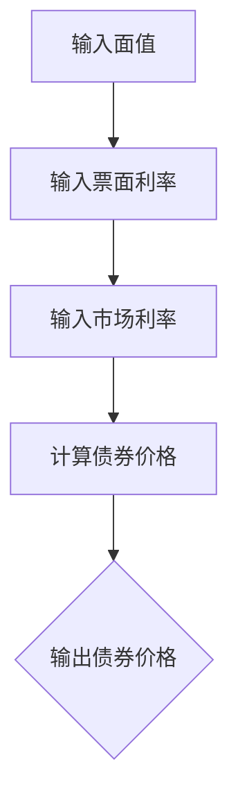
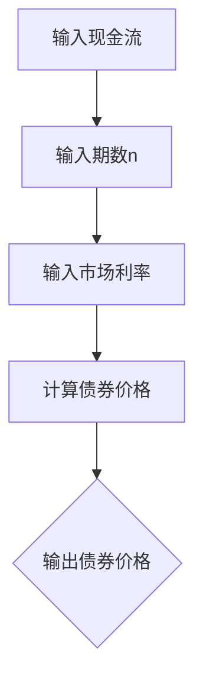
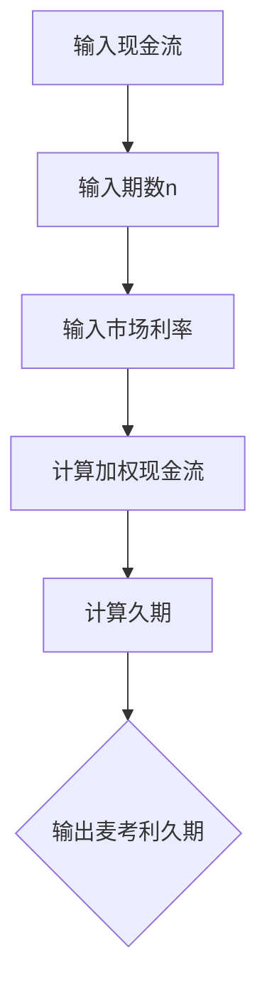
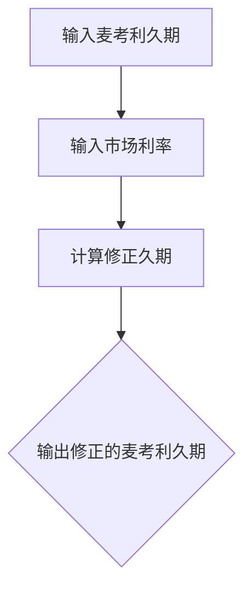
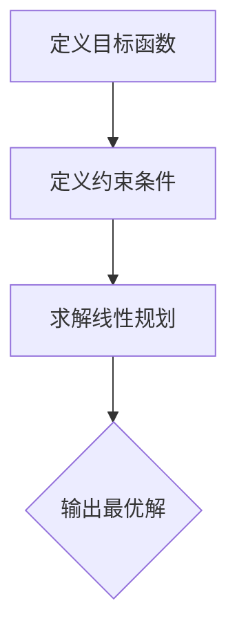
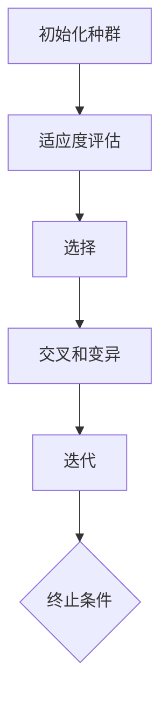

                 

## 智能债券投资组合久期管理系统

> 关键词：智能债券，投资组合，久期管理，算法，系统设计

> 摘要：本文将详细介绍智能债券投资组合久期管理系统的设计原理和实现方法。通过解析债券定价模型和久期计算方法，以及系统架构和算法原理，旨在为投资者提供一种高效的债券投资策略。

### 1.1 智能债券投资组合久期管理背景

债券投资组合久期管理是一种通过调整债券组合中债券的久期来应对利率变动风险的投资策略。在金融市场中，债券价格与市场利率之间存在反向关系，即利率上升时，债券价格下跌；利率下跌时，债券价格上涨。因此，久期管理成为投资者降低投资风险、稳定投资收益的重要手段。

#### 1.1.1 债券投资组合久期管理的概念

债券投资组合久期管理是指通过计算和调整债券组合的久期，来控制投资组合的风险和收益。久期（Duration）是衡量债券价格对利率变动的敏感程度的指标，通常用年数表示。债券的久期越长，其价格对利率变动的敏感度越高，投资者面临的风险越大。

#### 1.1.2 债券投资组合久期管理的必要性

金融市场环境的变化使得利率波动对债券投资组合的影响日益显著。传统的债券投资策略往往注重收益最大化，而忽视了风险控制。通过智能债券投资组合久期管理，投资者可以更好地应对市场波动，降低投资组合风险。

#### 1.1.3 智能债券投资组合久期管理的目标

智能债券投资组合久期管理的目标是在保证投资组合收益的同时，最大限度地降低利率风险。具体包括：

- 优化债券投资组合结构，使组合久期与投资者风险偏好相匹配。
- 动态调整债券投资组合，以应对市场利率变化。
- 降低投资组合的波动性，提高投资稳定性。

### 1.2 智能债券投资组合久期管理的核心概念与联系

智能债券投资组合久期管理涉及多个核心概念，包括债券定价模型、久期计算方法、投资组合久期管理策略等。

#### 1.2.1 债券定价模型

债券定价模型是智能债券投资组合久期管理的基础。常见的债券定价模型包括平价定价模型、利率期限结构模型等。这些模型可以用来估算债券的价格，进而评估投资组合的久期。

##### 1.2.1.1 平价定价模型

平价定价模型基于债券的现值计算，其核心公式为：

\[ \text{债券价格} = \frac{\text{面值} \times \text{票面利率}}{1 + \text{市场利率}} \]

##### 1.2.1.2 利率期限结构模型

利率期限结构模型考虑了市场利率的期限结构，其核心公式为：

\[ \text{债券价格} = \sum_{t=1}^{n} \frac{\text{现金流}}{(1 + \text{市场利率})^t} \]

其中，现金流为债券在每期支付的利息和本金，市场利率根据期限结构进行调整。

#### 1.2.2 久期计算方法

久期的计算方法有多种，包括麦考利久期、修正的麦考利久期等。这些方法可以用来衡量债券价格对利率变动的敏感程度，进而指导投资决策。

##### 1.2.2.1 麦考利久期

麦考利久期（Macaulay Duration）是一个加权平均的到期时间，其核心公式为：

\[ \text{麦考利久期} = \frac{\sum_{t=1}^{n} \frac{\text{现金流}}{(1 + \text{市场利率})^t} \times t}{\sum_{t=1}^{n} \frac{\text{现金流}}{(1 + \text{市场利率})^t}} \]

##### 1.2.2.2 修正的麦考利久期

修正的麦考利久期（Modified Macaulay Duration）是一个无风险的久期，其核心公式为：

\[ \text{修正的麦考利久期} = \frac{\text{麦考利久期}}{1 + \text{市场利率}} \]

#### 1.2.3 投资组合久期管理策略

投资组合久期管理策略主要包括基于久期目标的投资策略和动态调整策略。

##### 1.2.3.1 基于久期目标的投资策略

投资者可以根据自己的风险偏好设定久期目标，通过调整债券组合中债券的久期来实现。例如，如果投资者希望降低风险，可以选择久期较短的债券；如果投资者希望提高收益，可以选择久期较长的债券。

##### 1.2.3.2 动态调整策略

根据市场利率的变化，动态调整债券投资组合，以保持组合久期与久期目标的一致性。例如，当市场利率上升时，投资者可以选择卖出久期较长的债券，买入久期较短的债券；当市场利率下降时，投资者可以选择买入久期较长的债券，卖出久期较短的债券。

### 1.3 智能债券投资组合久期管理系统的设计思路

智能债券投资组合久期管理系统是一个复杂的系统，涉及数据管理、计算引擎、投资策略等多个方面。下面将介绍系统的设计思路。

#### 1.3.1 系统架构设计

智能债券投资组合久期管理系统应包括以下主要模块：

- **债券数据管理模块**：负责收集、整理和分析债券相关数据，为久期管理提供基础数据支持。
- **久期计算模块**：基于债券定价模型和久期计算方法，计算债券投资组合的久期。
- **投资策略模块**：根据投资者设定的风险偏好和久期目标，生成最优的投资策略。
- **系统监控模块**：实时监控债券投资组合的久期变化，及时调整投资策略。

#### 1.3.2 算法原理讲解

智能债券投资组合久期管理系统采用以下算法原理：

- **债券定价模型**：采用平价定价模型或利率期限结构模型，计算债券价格和久期。
- **优化算法**：采用线性规划或遗传算法等优化算法，生成最优的投资策略。

#### 1.3.3 系统实现与测试

系统实现包括以下步骤：

- **前端设计**：设计用户友好的操作界面，方便投资者进行久期管理操作。
- **后端开发**：实现债券数据管理、久期计算、投资策略生成和系统监控等功能。
- **测试与优化**：对系统进行功能测试和性能优化，确保系统能够稳定运行。

### 1.4 智能债券投资组合久期管理的挑战与机遇

智能债券投资组合久期管理面临以下挑战：

- **数据收集与处理**：债券数据量大，且存在噪声和缺失值，需要有效的数据预处理方法。
- **算法优化**：现有算法在处理大规模数据时可能存在效率问题，需要进一步优化。
- **实时性**：债券市场变化快，系统需要实时计算和调整投资策略。

然而，智能债券投资组合久期管理也带来了以下机遇：

- **提高投资效率**：通过智能化的管理，投资者可以更高效地调整投资组合，降低风险。
- **增强投资体验**：智能债券投资组合久期管理可以提供个性化的投资建议，提高投资者的投资体验。
- **扩大应用领域**：智能债券投资组合久期管理技术可以应用于更多金融领域，如股票投资、基金管理等。

### 1.5 本章小结

本章介绍了智能债券投资组合久期管理的背景、核心概念、设计思路以及面临的挑战与机遇。通过本章的学习，读者可以了解智能债券投资组合久期管理的基本原理和方法，为后续章节的学习打下基础。

接下来，我们将进一步探讨智能债券投资组合久期管理的核心算法原理，包括债券定价模型、久期计算方法和优化算法等。让我们继续深入分析这些算法的原理和实现方法。

## 第2章 智能债券投资组合久期管理核心算法原理

### 2.1 债券定价模型

债券定价模型是智能债券投资组合久期管理系统的核心，用于估算债券的价格和久期。本节将介绍两种常见的债券定价模型：平价定价模型和利率期限结构模型。

#### 2.1.1 平价定价模型

平价定价模型是一种基于债券现值计算的定价模型。根据债券的面值、票面利率和到期时间，可以计算出债券的现值，进而确定债券的价格。

##### 2.1.1.1 平价定价模型的核心公式

\[ \text{债券价格} = \frac{\text{面值} \times \text{票面利率}}{1 + \text{市场利率}} \]

其中，面值是指债券到期时的支付金额，票面利率是指债券每年支付的利息比例，市场利率是指当前市场利率。

##### 2.1.1.2 平价定价模型的流程图

使用Mermaid绘制平价定价模型的流程图如下：

#### 2.1.2 利率期限结构模型

利率期限结构模型考虑了市场利率的期限结构，其核心公式为：

\[ \text{债券价格} = \sum_{t=1}^{n} \frac{\text{现金流}}{(1 + \text{市场利率})^t} \]

其中，现金流为债券在每期支付的利息和本金，市场利率根据期限结构进行调整。

##### 2.1.2.1 利率期限结构模型的核心公式

\[ \text{债券价格} = \sum_{t=1}^{n} \frac{\text{现金流}}{(1 + \text{市场利率})^t} \]

其中，n为债券的期数，现金流为债券在每期支付的利息和本金，市场利率根据期限结构进行调整。

##### 2.1.2.2 利率期限结构模型的流程图

使用Mermaid绘制利率期限结构模型的流程图如下：

### 2.2 久期计算方法

久期是衡量债券价格对利率变动的敏感程度的指标，用于评估债券投资组合的风险水平。久期的计算方法有多种，包括麦考利久期和修正的麦考利久期。

#### 2.2.1 麦考利久期

麦考利久期（Macaulay Duration）是一个加权平均的到期时间，其核心公式为：

\[ \text{麦考利久期} = \frac{\sum_{t=1}^{n} \frac{\text{现金流}}{(1 + \text{市场利率})^t} \times t}{\sum_{t=1}^{n} \frac{\text{现金流}}{(1 + \text{市场利率})^t}} \]

##### 2.2.1.1 麦考利久期的核心公式

\[ \text{麦考利久期} = \frac{\sum_{t=1}^{n} \frac{\text{现金流}}{(1 + \text{市场利率})^t} \times t}{\sum_{t=1}^{n} \frac{\text{现金流}}{(1 + \text{市场利率})^t}} \]

其中，n为债券的期数，现金流为债券在每期支付的利息和本金，市场利率根据期限结构进行调整。

##### 2.2.1.2 麦考利久期的流程图

使用Mermaid绘制麦考利久期的流程图如下：

#### 2.2.2 修正的麦考利久期

修正的麦考利久期（Modified Macaulay Duration）是一个无风险的久期，其核心公式为：

\[ \text{修正的麦考利久期} = \frac{\text{麦考利久期}}{1 + \text{市场利率}} \]

##### 2.2.2.1 修正的麦考利久期的核心公式

\[ \text{修正的麦考利久期} = \frac{\text{麦考利久期}}{1 + \text{市场利率}} \]

其中，麦考利久期根据上一步的计算结果，市场利率根据期限结构进行调整。

##### 2.2.2.2 修正的麦考利久期的流程图

使用Mermaid绘制修正的麦考利久期的流程图如下：

通过上述内容，我们详细介绍了智能债券投资组合久期管理的核心算法原理，包括债券定价模型和久期计算方法。接下来，我们将进一步探讨优化算法在智能债券投资组合久期管理中的应用。

### 2.3 优化算法在智能债券投资组合久期管理中的应用

在智能债券投资组合久期管理中，优化算法被广泛应用于投资策略的生成和调整。优化算法通过求解最优化问题，找到最优的投资组合，从而实现风险控制和收益最大化。本节将介绍几种常见的优化算法，并分析它们在久期管理中的应用。

#### 2.3.1 线性规划算法

线性规划算法是一种用于求解线性规划问题的数学方法。在智能债券投资组合久期管理中，线性规划算法可以用来确定债券投资组合的最优权重，以满足投资者的久期目标和风险偏好。

##### 2.3.1.1 线性规划的核心公式

线性规划问题可以表示为以下形式：

\[ \max_{x} c^T x \]

\[ \text{s.t.} Ax \leq b \]

其中，\( c \) 是目标函数系数向量，\( x \) 是投资组合权重向量，\( A \) 和 \( b \) 分别是约束矩阵和约束向量。

##### 2.3.1.2 线性规划算法的流程图

使用Mermaid绘制线性规划算法的流程图如下：

#### 2.3.2 遗传算法

遗传算法是一种基于自然进化原理的优化算法。在智能债券投资组合久期管理中，遗传算法可以用来搜索最优的投资组合，通过模拟自然进化过程，逐步优化投资策略。

##### 2.3.2.1 遗传算法的核心步骤

1. **初始化种群**：随机生成一组投资组合权重作为初始种群。
2. **适应度评估**：根据投资者设定的久期目标和风险偏好，计算每个投资组合的适应度。
3. **选择**：选择适应度较高的投资组合进行交叉和变异操作。
4. **交叉和变异**：通过交叉和变异操作，生成新的投资组合种群。
5. **迭代**：重复适应度评估、选择、交叉和变异操作，直到达到设定的迭代次数或满足终止条件。

##### 2.3.2.2 遗传算法的流程图

使用Mermaid绘制遗传算法的流程图如下：

#### 2.3.3 优化算法的应用分析

线性规划和遗传算法在智能债券投资组合久期管理中各有优缺点。

- **线性规划算法**：线性规划算法求解速度快，适用于规模较小的投资组合。然而，当投资组合规模较大时，线性规划算法的求解效率可能受到影响。
- **遗传算法**：遗传算法适用于规模较大的投资组合，能够通过迭代过程逐步优化投资策略。然而，遗传算法的求解过程可能需要较长的计算时间。

在实际应用中，可以根据投资组合的规模和复杂性选择合适的优化算法。例如，对于小规模投资组合，可以选择线性规划算法；对于大规模投资组合，可以选择遗传算法。

通过上述内容，我们介绍了智能债券投资组合久期管理的核心算法原理，包括债券定价模型、久期计算方法和优化算法。接下来，我们将讨论智能债券投资组合久期管理系统的设计思路，包括系统架构、模块设计和算法实现。

### 2.4 智能债券投资组合久期管理系统的设计思路

智能债券投资组合久期管理系统是一个复杂的系统，涉及多个模块的协同工作。本节将介绍系统的设计思路，包括系统架构、模块设计和算法实现。

#### 2.4.1 系统架构设计

智能债券投资组合久期管理系统的架构设计包括前端设计、后端开发和数据存储等部分。以下是一个典型的系统架构设计：

- **前端设计**：前端设计主要包括用户界面和交互逻辑。用户可以通过前端界面查看债券投资组合的久期信息、调整投资策略等。
- **后端开发**：后端开发包括债券数据管理模块、久期计算模块、投资策略模块和系统监控模块。债券数据管理模块负责收集和整理债券数据；久期计算模块负责计算债券投资组合的久期；投资策略模块负责生成和调整投资策略；系统监控模块负责监控投资组合的久期变化。
- **数据存储**：数据存储主要包括债券数据、投资策略数据和系统监控数据。债券数据存储债券的详细信息，如面值、票面利率、到期时间等；投资策略数据存储投资者的久期目标和调整记录；系统监控数据存储投资组合的久期变化记录。

#### 2.4.2 模块设计

智能债券投资组合久期管理系统的模块设计包括债券数据管理模块、久期计算模块、投资策略模块和系统监控模块。

- **债券数据管理模块**：债券数据管理模块负责收集和整理债券数据。模块应具备以下功能：
  - 数据采集：从各种数据源（如交易所、债券评级机构等）采集债券数据。
  - 数据清洗：对采集到的债券数据进行清洗，去除噪声和缺失值。
  - 数据存储：将清洗后的债券数据存储到数据库中，以便后续使用。

- **久期计算模块**：久期计算模块负责计算债券投资组合的久期。模块应具备以下功能：
  - 债券定价：根据债券的面值、票面利率和到期时间，使用债券定价模型计算债券价格。
  - 久期计算：根据债券价格和现金流，使用久期计算方法计算债券的久期。
  - 投资组合久期：计算债券投资组合的总体久期。

- **投资策略模块**：投资策略模块负责生成和调整投资策略。模块应具备以下功能：
  - 策略生成：根据投资者设定的久期目标和风险偏好，使用优化算法生成投资策略。
  - 策略调整：根据债券市场变化，调整投资策略，以保持投资组合的久期与目标的一致性。

- **系统监控模块**：系统监控模块负责监控投资组合的久期变化。模块应具备以下功能：
  - 数据采集：定期采集债券数据，更新债券投资组合的久期。
  - 数据分析：分析债券投资组合的久期变化趋势，识别潜在的风险。
  - 风险预警：根据久期变化情况，生成风险预警信息，提醒投资者关注。

#### 2.4.3 算法实现

智能债券投资组合久期管理系统的算法实现主要包括债券定价模型、久期计算方法和优化算法。

- **债券定价模型**：系统应实现平价定价模型和利率期限结构模型，用于计算债券价格。具体实现步骤如下：
  1. 输入债券的面值、票面利率和到期时间。
  2. 使用平价定价模型或利率期限结构模型计算债券价格。
  3. 输出债券价格。

- **久期计算方法**：系统应实现麦考利久期和修正的麦考利久期计算方法，用于计算债券的久期。具体实现步骤如下：
  1. 输入债券的现金流、期数和市场利率。
  2. 使用麦考利久期计算公式计算麦考利久期。
  3. 使用修正的麦考利久期计算公式计算修正的麦考利久期。
  4. 输出麦考利久期和修正的麦考利久期。

- **优化算法**：系统应实现线性规划和遗传算法，用于生成和调整投资策略。具体实现步骤如下：
  1. 输入投资者的久期目标和风险偏好。
  2. 使用线性规划或遗传算法求解最优化问题，生成投资策略。
  3. 输出投资策略。

通过上述内容，我们介绍了智能债券投资组合久期管理系统的设计思路，包括系统架构、模块设计和算法实现。接下来，我们将讨论智能债券投资组合久期管理的挑战与机遇。

### 2.5 智能债券投资组合久期管理的挑战与机遇

智能债券投资组合久期管理在金融市场中具有重要的地位，但也面临一系列的挑战和机遇。

#### 2.5.1 挑战

1. **数据收集与处理**：债券市场数据量大，且存在噪声和缺失值。如何有效地收集、整理和处理债券数据，是智能债券投资组合久期管理面临的首要挑战。

2. **算法优化**：现有的算法在处理大规模数据时可能存在效率问题。如何优化算法，提高计算速度和准确性，是智能债券投资组合久期管理需要解决的问题。

3. **实时性**：债券市场变化快速，系统需要实时计算和调整投资策略。如何确保系统的实时性，是智能债券投资组合久期管理需要考虑的关键问题。

4. **风险管理**：智能债券投资组合久期管理涉及到多种风险，如利率风险、信用风险等。如何有效地识别和管理这些风险，是智能债券投资组合久期管理需要关注的问题。

#### 2.5.2 机遇

1. **提高投资效率**：通过智能债券投资组合久期管理，投资者可以更高效地调整投资组合，降低风险，提高收益。

2. **增强投资体验**：智能债券投资组合久期管理可以提供个性化的投资建议，帮助投资者更好地理解和管理投资组合，提高投资体验。

3. **扩大应用领域**：智能债券投资组合久期管理技术可以应用于更多金融领域，如股票投资、基金管理等。随着金融市场的不断发展，智能债券投资组合久期管理的应用前景十分广阔。

通过上述内容，我们分析了智能债券投资组合久期管理的挑战与机遇。接下来，我们将对本章进行小结。

### 2.6 本章小结

本章介绍了智能债券投资组合久期管理的核心算法原理，包括债券定价模型、久期计算方法和优化算法。通过分析平价定价模型、利率期限结构模型、麦考利久期和修正的麦考利久期，以及线性规划和遗传算法，我们了解了智能债券投资组合久期管理的基本原理和方法。此外，我们还讨论了智能债券投资组合久期管理的系统设计思路，包括系统架构、模块设计和算法实现。最后，我们分析了智能债券投资组合久期管理的挑战与机遇，为读者提供了全面的认识。希望本章的内容能够帮助读者深入了解智能债券投资组合久期管理，为实际应用提供指导。

---

**作者：AI天才研究院 / AI Genius Institute & 禅与计算机程序设计艺术 / Zen And The Art of Computer Programming**

