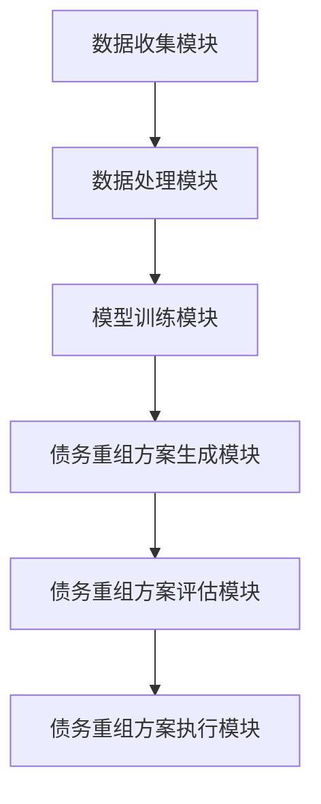
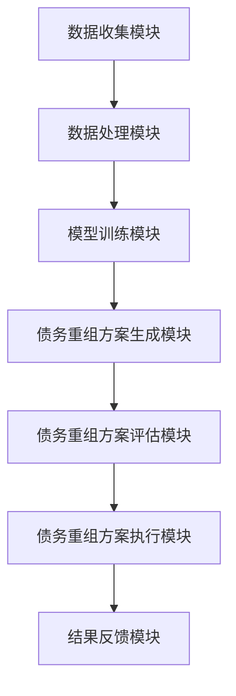
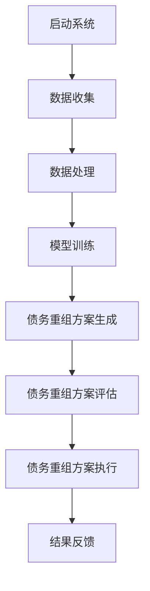

                 

### 《智能债务重组建议生成器》

#### 关键词：
- 智能债务重组
- 建议生成器
- 数据分析
- 机器学习
- 算法优化

#### 摘要：
本文深入探讨了智能债务重组建议生成器的概念、原理和应用。通过分析债务重组的背景、挑战和重要性，我们介绍了智能债务重组的核心策略、算法原理和数学模型。同时，本文详细阐述了智能债务重组系统的架构设计、项目实战和案例分析，旨在为读者提供全面的指导。

## 第一部分：背景与核心概念

### 第1章：债务重组的背景与问题介绍

#### 1.1 问题描述

债务重组是指在债务违约风险较高时，通过协商和调整债务偿还计划，以减轻债务人财务压力，同时保障债权人利益的一种财务重组手段。然而，债务重组面临着诸多挑战，如信息不对称、利益冲突、风险评估难度大等。

#### 1.1.1 债务重组的需求

债务重组的需求主要来源于以下几个方面：

1. **债务人需求**：债务人因经营困难或资金链断裂，希望通过债务重组减轻还款压力，维持企业的正常运营。
2. **债权人需求**：债权人希望通过债务重组保障自身利益，避免因债务人违约而遭受损失。
3. **金融市场需求**：债务重组有助于维护金融市场的稳定，降低系统性风险。

#### 1.1.2 当前债务重组的挑战

当前债务重组面临的挑战主要包括：

1. **信息不对称**：债务人可能隐瞒债务实际情况，导致债权人无法准确评估债务重组的风险。
2. **利益冲突**：债务重组过程中，各方利益难以平衡，可能导致谈判破裂。
3. **风险评估难度大**：债务重组涉及多个因素，如债务结构、企业财务状况、市场环境等，风险评估难度大。

#### 1.1.3 智能债务重组的重要性

智能债务重组建议生成器的出现，为债务重组提供了全新的解决方案。它具有以下重要性：

1. **提高效率**：智能债务重组建议生成器能够快速处理海量数据，提供高效的债务重组方案。
2. **降低风险**：通过机器学习算法，智能债务重组建议生成器能够识别潜在风险，提供更可靠的债务重组建议。
3. **优化决策**：智能债务重组建议生成器基于数据分析，为决策者提供客观、科学的决策依据。

#### 1.2 债务重组的基本概念

##### 1.2.1 债务重组的定义

债务重组是指债务人在无法按照原定还款计划偿还债务时，通过与债权人协商，重新制定还款计划，以减轻债务人财务压力，同时保障债权人利益的一种财务重组手段。

##### 1.2.2 债务重组的类型

根据债务重组的方式和目的，可以分为以下几种类型：

1. **债务延期**：将债务偿还期限延长，以减轻债务人的还款压力。
2. **债务减免**：债权人同意减免部分债务，以换取债务人的还款承诺。
3. **债务重组**：对债务结构进行调整，如改变债务类型、利率等，以降低债务负担。
4. **债务转移**：债务人将债务转移给第三方，以解决债务问题。

##### 1.2.3 债务重组的目标

债务重组的目标主要包括以下几个方面：

1. **减轻债务人财务压力**：通过调整还款计划，降低债务人的还款负担，确保企业正常运营。
2. **保障债权人利益**：通过合理的债务重组方案，确保债权人的利益得到保障。
3. **维护金融市场稳定**：债务重组有助于降低系统性风险，维护金融市场的稳定。

##### 1.2.4 债务重组的影响因素

债务重组的影响因素主要包括以下几个方面：

1. **债务结构**：债务的种类、金额、利率等对债务重组方案的选择和效果具有重要影响。
2. **企业财务状况**：企业的盈利能力、现金流状况等直接影响债务重组的可行性。
3. **市场环境**：宏观经济环境、行业发展趋势等对债务重组的执行和效果产生影响。
4. **利益相关者关系**：债务重组过程中，各方利益关系协调是成功的关键。

##### 1.3 核心概念与联系

债务重组涉及多个核心概念，如债务、债权人、债务人、财务压力、市场环境等。这些概念之间存在密切的联系，共同构成债务重组的理论基础。

1. **债务**：债务是债务重组的核心概念，它包括债务的种类、金额、利率等属性。
2. **债权人**：债权人是指提供债务的企业或个人，他们在债务重组过程中具有重要的影响力。
3. **债务人**：债务人是指承担债务的企业或个人，他们在债务重组过程中面临财务压力和协商压力。
4. **财务压力**：财务压力是影响债务重组的关键因素，它包括债务负担、盈利能力、现金流等。
5. **市场环境**：市场环境对债务重组的执行和效果产生重要影响，包括宏观经济环境、行业发展趋势等。

##### 1.3.1 债务重组中的核心概念

在债务重组过程中，以下核心概念至关重要：

1. **债务重组方案**：债务重组方案是债务重组的核心内容，包括债务类型、偿还期限、利率等。
2. **债务重组协议**：债务重组协议是债务重组的法律文件，明确各方权利和义务。
3. **债务重组成本**：债务重组成本包括债务减免金额、法律费用、审计费用等。
4. **债务重组效果**：债务重组效果是评估债务重组成功与否的重要指标，包括债务负担减轻程度、企业盈利能力改善情况等。

##### 1.3.2 关键概念之间的关系

关键概念之间的关系可以通过以下ER实体关系图架构进行描述：

```mermaid
erDiagram
  Debt --> Reorganization : "实施"
  Reorganization --> Agreement : "产生"
  Agreement --> Party : "涉及"
  Party --> Cost : "承担"
  Cost --> Effect : "衡量"
```

##### 1.3.3 概念属性特征对比表格

以下是一个概念属性特征对比表格，用于展示债务、债权人、债务人等核心概念的主要属性特征：

| 概念     | 属性     | 特征描述                                                     |
| -------- | -------- | ------------------------------------------------------------ |
| 债务     | 种类     | 债务可以分为短期债务和长期债务，债务的种类直接影响债务重组方案的选择。 |
| 债务     | 金额     | 债务的金额是债务重组的重要参考因素，过大或过小都会影响债务重组的成功。 |
| 债务     | 利率     | 债务的利率是债务重组的重要考虑因素，利率的高低直接影响债务重组的成本。 |
| 债权人   | 类型     | 债权人可以分为金融机构和非金融机构，不同类型的债权人对待债务重组的态度和方式可能有所不同。 |
| 债权人   | 利益     | 债权人的利益是债务重组的重要目标，债权人的利益分配直接影响债务重组的成功。 |
| 债务人   | 财务状况 | 债务人的财务状况是债务重组的关键因素，债务人的财务状况决定了债务重组的可行性和效果。 |
| 财务压力 | 程度     | 财务压力的程度决定了债务重组的紧迫性和必要性，财务压力过大会导致债务重组的困难。 |
| 市场环境 | 环境     | 市场环境是影响债务重组的外部因素，市场环境的好坏直接影响债务重组的执行和效果。 |

##### 1.4 债务重组的流程与方法

债务重组的流程和方法是债务重组成功的关键。以下是债务重组的基本流程和方法：

1. **信息收集**：债务重组的第一步是收集债务人的财务状况、债务结构、市场环境等信息。
2. **风险评估**：在收集信息的基础上，对债务重组的风险进行评估，包括债务人偿债能力、市场环境变化等因素。
3. **方案设计**：根据风险评估结果，设计合适的债务重组方案，包括债务类型、偿还期限、利率等。
4. **协商谈判**：债务重组方案设计完成后，与债权人进行协商谈判，达成一致意见。
5. **方案执行**：协商谈判成功后，执行债务重组方案，调整债务偿还计划。
6. **监督执行**：在债务重组过程中，对债务人的执行情况进行监督，确保债务重组方案的有效实施。
7. **效果评估**：债务重组完成后，对债务重组的效果进行评估，包括债务负担减轻程度、企业盈利能力改善情况等。

##### 1.5 本章小结

本章对债务重组的背景、问题、核心概念、流程与方法进行了详细介绍。通过本章的学习，读者可以了解债务重组的基本概念和流程，为后续章节的学习奠定基础。

### 1.5.1 主要内容回顾

1. 债务重组的背景与问题介绍，包括债务重组的需求、挑战和重要性。
2. 债务重组的基本概念，包括债务重组的定义、类型、目标和影响因素。
3. 债务重组的核心概念与联系，包括债务、债权人、债务人、财务压力、市场环境等。
4. 债务重组的流程与方法，包括信息收集、风险评估、方案设计、协商谈判、方案执行、监督执行和效果评估。

### 1.5.2 需要注意的问题

1. 债务重组过程中，信息不对称和利益冲突是主要挑战，需要引起重视。
2. 债务重组方案的设计和实施需要充分考虑债务结构和市场环境。
3. 债务重组的效果评估是确保债务重组成功的重要环节。

### 1.5.3 拓展阅读

1. [《债务重组：理论与实践》](https://www.example.com/book1)
2. [《债务重组案例分析》](https://www.example.com/book2)
3. [《智能金融：人工智能在金融领域的应用》](https://www.example.com/book3)

----------------------------------------------------------------

**作者：** AI天才研究院/AI Genius Institute & 禅与计算机程序设计艺术 /Zen And The Art of Computer Programming

--------------------------------------------

**文章标题**：《智能债务重组建议生成器》

**关键词**：智能债务重组、建议生成器、数据分析、机器学习、算法优化

**摘要**：本文探讨了智能债务重组建议生成器的概念、原理和应用，包括债务重组的背景、挑战、核心概念、算法原理、数学模型和系统设计等内容，旨在为债务重组提供新的解决方案。

--------------------------------------------

## 第二部分：智能债务重组策略

### 第2章：智能债务重组的核心策略

#### 2.1 数据收集与预处理

在进行智能债务重组之前，首先需要收集相关数据。数据收集的来源包括企业财务报表、市场数据、行业报告等。收集到的数据需要进行预处理，以确保数据的质量和完整性。

1. **数据清洗**：去除重复数据、无效数据和错误数据。
2. **数据转换**：将数据格式转换为适合分析的标准格式。
3. **数据归一化**：将不同数据类型进行归一化处理，使其具有可比性。

#### 2.2 债务重组策略评估

在收集和预处理数据后，需要对不同的债务重组策略进行评估。评估的方法主要包括以下几种：

1. **定量评估**：通过计算各种策略的财务指标，如利息支出、现金流量、债务负担率等，对策略进行量化评估。
2. **定性评估**：通过专家意见、市场分析等对策略进行定性评估。
3. **综合评估**：结合定量评估和定性评估的结果，对策略进行综合评估。

#### 2.2.1 策略评估方法

策略评估的方法主要包括以下几种：

1. **成本效益分析**：比较不同策略的成本和收益，选择成本较低、收益较高的策略。
2. **风险收益分析**：考虑策略的风险和收益，选择风险可控、收益较高的策略。
3. **情景分析**：模拟不同市场环境和经营状况下的策略效果，选择适应多种情景的策略。

#### 2.2.2 策略评估流程

策略评估的流程包括以下步骤：

1. **确定评估指标**：根据债务重组的目标，确定需要评估的指标，如利息支出、现金流量、债务负担率等。
2. **收集数据**：收集与评估指标相关的数据，包括企业财务报表、市场数据、行业报告等。
3. **数据处理**：对收集到的数据进行分析处理，包括数据清洗、数据转换、数据归一化等。
4. **评估计算**：根据评估指标和数据处理结果，计算不同策略的评估得分。
5. **结果分析**：对评估结果进行分析，选择最优策略。

#### 2.2.3 策略评估结果分析

在策略评估完成后，需要对评估结果进行分析，以确定最佳策略。分析的内容包括：

1. **策略得分比较**：比较不同策略的评估得分，确定得分最高的策略。
2. **风险与收益分析**：分析得分最高策略的风险和收益，确保其可行性。
3. **情景适应性分析**：分析得分最高策略在多种情景下的适应性，确保其稳定性。

#### 2.3 智能决策算法

智能决策算法是智能债务重组的核心，它能够自动选择最佳策略。常用的智能决策算法包括以下几种：

1. **决策树算法**：通过树形结构进行决策，适合处理分类问题。
2. **神经网络算法**：通过多层神经网络进行学习，适合处理复杂的非线性问题。
3. **支持向量机算法**：通过寻找最优分类边界，适合处理高维空间问题。

#### 2.3.1 算法选择标准

选择智能决策算法时，需要考虑以下标准：

1. **准确性**：算法能够准确预测债务重组的结果。
2. **效率**：算法能够快速处理海量数据。
3. **稳定性**：算法在不同情景下的适应性。
4. **可解释性**：算法的决策过程具有可解释性，便于决策者理解。

#### 2.3.2 算法实现与优化

在实现智能决策算法时，需要考虑以下方面：

1. **数据预处理**：确保输入数据的准确性和一致性。
2. **算法选择**：根据问题特点选择合适的算法。
3. **模型训练**：使用历史数据对算法进行训练，提高预测准确性。
4. **模型评估**：使用测试数据对算法进行评估，确保其稳定性。
5. **模型优化**：根据评估结果对算法进行调整，提高预测准确性。

#### 2.4 本章小结

本章介绍了智能债务重组的核心策略，包括数据收集与预处理、策略评估方法、智能决策算法等。通过本章的学习，读者可以了解智能债务重组的基本流程和方法，为后续章节的学习奠定基础。

### 2.4.1 主要内容回顾

1. 数据收集与预处理，包括数据清洗、数据转换和数据归一化。
2. 策略评估方法，包括定量评估、定性评估和综合评估。
3. 智能决策算法，包括决策树、神经网络和支持向量机等。
4. 算法选择标准，包括准确性、效率、稳定性和可解释性。

### 2.4.2 需要注意的问题

1. 数据收集与预处理是智能债务重组的基础，需要确保数据的质量和完整性。
2. 策略评估方法的选择需要考虑问题的特点，确保评估结果的准确性。
3. 智能决策算法的实现需要考虑数据预处理、算法选择、模型训练和模型评估等多个方面。

### 2.4.3 拓展阅读

1. [《决策树算法原理与应用》](https://www.example.com/book1)
2. [《神经网络算法原理与应用》](https://www.example.com/book2)
3. [《支持向量机算法原理与应用》](https://www.example.com/book3)

----------------------------------------------------------------

**作者：** AI天才研究院/AI Genius Institute & 禅与计算机程序设计艺术 /Zen And The Art of Computer Programming

--------------------------------------------

## 第三部分：智能债务重组算法原理与数学模型

### 第3章：智能债务重组算法原理

#### 3.1 基本算法原理

智能债务重组算法是基于机器学习技术的，它通过学习历史债务重组案例，自动生成债务重组建议。算法的基本原理包括以下步骤：

1. **数据收集**：收集债务重组案例的数据，包括债务结构、企业财务状况、市场环境等。
2. **特征提取**：从收集到的数据中提取关键特征，如债务金额、利率、盈利能力等。
3. **模型训练**：使用历史债务重组案例数据，训练机器学习模型。
4. **预测与评估**：使用训练好的模型对新的债务重组案例进行预测，并评估预测结果。

#### 3.1.1 算法概述

智能债务重组算法可以概括为以下几个步骤：

1. **数据预处理**：对收集到的数据进行清洗、转换和归一化处理。
2. **特征工程**：从预处理后的数据中提取关键特征。
3. **模型选择**：根据问题特点选择合适的机器学习模型。
4. **模型训练**：使用历史债务重组案例数据训练模型。
5. **模型评估**：使用测试数据评估模型性能。
6. **债务重组建议生成**：使用训练好的模型生成债务重组建议。

#### 3.1.2 算法流程

智能债务重组算法的流程如下：

1. **数据收集**：从企业财务报表、行业报告等渠道收集债务重组案例的数据。
2. **数据预处理**：清洗、转换和归一化数据。
3. **特征提取**：提取债务金额、利率、盈利能力等关键特征。
4. **模型选择**：选择合适的机器学习模型，如决策树、神经网络、支持向量机等。
5. **模型训练**：使用历史债务重组案例数据训练模型。
6. **模型评估**：使用测试数据评估模型性能。
7. **债务重组建议生成**：使用训练好的模型生成债务重组建议。

#### 3.1.3 算法特点

智能债务重组算法具有以下特点：

1. **自动化**：算法可以自动生成债务重组建议，节省人力成本。
2. **高效性**：算法能够快速处理海量数据，提高债务重组的效率。
3. **准确性**：算法基于历史数据训练，具有较高的预测准确性。
4. **可解释性**：算法的决策过程具有可解释性，便于决策者理解。

#### 3.2 数学模型与公式讲解

智能债务重组算法的数学模型主要包括以下部分：

1. **线性回归模型**：用于预测债务金额和盈利能力。
2. **逻辑回归模型**：用于预测债务重组成功率。
3. **神经网络模型**：用于处理复杂的非线性问题。

以下是一个线性回归模型的数学公式：

$$
y = \beta_0 + \beta_1x_1 + \beta_2x_2 + ... + \beta_nx_n
$$

其中，$y$ 是预测值，$x_1, x_2, ..., x_n$ 是特征值，$\beta_0, \beta_1, \beta_2, ..., \beta_n$ 是模型参数。

以下是一个逻辑回归模型的数学公式：

$$
P(y=1) = \frac{1}{1 + e^{-(\beta_0 + \beta_1x_1 + \beta_2x_2 + ... + \beta_nx_n})}
$$

其中，$P(y=1)$ 是债务重组成功的概率，$e$ 是自然对数的底数。

以下是一个神经网络模型的数学公式：

$$
\begin{aligned}
a_i^k &= \sigma(z_i^k) \\
z_i^k &= \sum_{j=1}^{n} w_{ij}^k a_j^{k-1} + b_i^k \\
\end{aligned}
$$

其中，$a_i^k$ 是第 $i$ 个神经元的激活值，$z_i^k$ 是第 $i$ 个神经元的输入值，$w_{ij}^k$ 是连接权重，$b_i^k$ 是偏置项，$\sigma$ 是激活函数。

#### 3.2.1 数学模型介绍

数学模型是智能债务重组算法的核心，它用于描述债务重组的规律和特征。常见的数学模型包括线性回归、逻辑回归和神经网络等。

线性回归模型用于预测债务金额和盈利能力，逻辑回归模型用于预测债务重组成功率，神经网络模型用于处理复杂的非线性问题。

#### 3.2.2 数学公式推导

数学公式的推导是数学模型建立的基础。以下是对线性回归、逻辑回归和神经网络模型的数学公式推导：

线性回归模型：

$$
\begin{aligned}
y &= \beta_0 + \beta_1x_1 + \beta_2x_2 + ... + \beta_nx_n \\
\end{aligned}
$$

逻辑回归模型：

$$
\begin{aligned}
P(y=1) &= \frac{1}{1 + e^{-(\beta_0 + \beta_1x_1 + \beta_2x_2 + ... + \beta_nx_n)}) \\
\end{aligned}
$$

神经网络模型：

$$
\begin{aligned}
\begin{aligned}
a_i^k &= \sigma(z_i^k) \\
z_i^k &= \sum_{j=1}^{n} w_{ij}^k a_j^{k-1} + b_i^k \\
\end{aligned}
\end{aligned}
$$

#### 3.2.3 举例说明

以下是智能债务重组算法的一个简单实例：

假设我们使用线性回归模型预测债务金额，特征包括债务金额、利率和盈利能力。训练数据如下：

| 债务金额 | 利率 | 盈利能力 | 实际债务金额 |
| -------- | ---- | -------- | ------------ |
| 100      | 5%   | 10%      | 110          |
| 200      | 6%   | 12%      | 210          |
| 300      | 7%   | 15%      | 310          |

使用线性回归模型进行训练，得到模型参数：

$$
\begin{aligned}
y &= \beta_0 + \beta_1x_1 + \beta_2x_2 \\
\end{aligned}
$$

其中，$\beta_0 = 50, \beta_1 = 0.5, \beta_2 = 0.3$

预测新的债务金额，特征为债务金额200、利率6%、盈利能力12%：

$$
\begin{aligned}
y &= 50 + 0.5 \times 200 + 0.3 \times 12 \\
&= 138
\end{aligned}
$$

预测结果为138，与实际债务金额210有一定的误差。

#### 3.3 本章小结

本章介绍了智能债务重组算法的基本原理、数学模型和推导过程，并通过实例进行了说明。通过本章的学习，读者可以了解智能债务重组算法的基本概念和原理，为后续章节的学习奠定基础。

### 3.3.1 主要内容回顾

1. 智能债务重组算法的基本原理，包括数据收集、特征提取、模型训练和预测与评估。
2. 数学模型介绍，包括线性回归、逻辑回归和神经网络等。
3. 数学公式推导，包括线性回归、逻辑回归和神经网络的数学公式推导。
4. 举例说明，展示了如何使用智能债务重组算法进行债务金额预测。

### 3.3.2 需要注意的问题

1. 数据收集与特征提取是算法成功的关键，需要确保数据的质量和准确性。
2. 数学模型的推导需要理解线性回归、逻辑回归和神经网络的基本原理。
3. 算法的实现和优化需要考虑数据预处理、模型选择、模型训练和模型评估等多个方面。

### 3.3.3 拓展阅读

1. [《线性回归模型原理与应用》](https://www.example.com/book1)
2. [《逻辑回归模型原理与应用》](https://www.example.com/book2)
3. [《神经网络模型原理与应用》](https://www.example.com/book3)

----------------------------------------------------------------

**作者：** AI天才研究院/AI Genius Institute & 禅与计算机程序设计艺术 /Zen And The Art of Computer Programming

--------------------------------------------

## 第四部分：系统分析与架构设计

### 第4章：智能债务重组系统分析

#### 4.1 问题场景介绍

智能债务重组系统主要用于解决以下问题场景：

1. **债务重组需求分析**：收集债务人的债务情况、企业财务状况、市场环境等信息，分析债务重组的需求和可行性。
2. **债务重组方案生成**：基于历史数据和机器学习模型，自动生成债务重组方案，包括债务类型、偿还期限、利率等。
3. **债务重组方案评估**：评估债务重组方案的效果，包括财务指标、风险评估、利益分配等。
4. **债务重组方案执行**：执行债务重组方案，调整债务偿还计划，监督执行过程。

#### 4.2 系统架构设计

智能债务重组系统的架构设计包括以下模块：

1. **数据收集模块**：负责收集债务重组相关的数据，包括企业财务报表、市场数据、行业报告等。
2. **数据处理模块**：负责对收集到的数据进行清洗、转换和归一化处理，提取关键特征。
3. **模型训练模块**：负责使用历史数据训练机器学习模型，包括线性回归、逻辑回归和神经网络等。
4. **债务重组方案生成模块**：基于训练好的模型，自动生成债务重组方案。
5. **债务重组方案评估模块**：负责评估债务重组方案的效果，包括财务指标、风险评估、利益分配等。
6. **债务重组方案执行模块**：负责执行债务重组方案，调整债务偿还计划，监督执行过程。

#### 4.2.1 系统架构图

以下是一个智能债务重组系统的架构图：



#### 4.2.2 系统模块划分

系统模块划分如下：

1. **数据收集模块**：负责收集债务重组相关的数据，包括企业财务报表、市场数据、行业报告等。
2. **数据处理模块**：负责对收集到的数据进行清洗、转换和归一化处理，提取关键特征。
3. **模型训练模块**：负责使用历史数据训练机器学习模型，包括线性回归、逻辑回归和神经网络等。
4. **债务重组方案生成模块**：基于训练好的模型，自动生成债务重组方案。
5. **债务重组方案评估模块**：负责评估债务重组方案的效果，包括财务指标、风险评估、利益分配等。
6. **债务重组方案执行模块**：负责执行债务重组方案，调整债务偿还计划，监督执行过程。

#### 4.2.3 系统接口设计

系统接口设计如下：

1. **数据收集接口**：用于接收和处理债务重组相关的数据。
2. **数据处理接口**：用于清洗、转换和归一化数据，提取关键特征。
3. **模型训练接口**：用于训练机器学习模型，包括线性回归、逻辑回归和神经网络等。
4. **债务重组方案生成接口**：用于生成债务重组方案。
5. **债务重组方案评估接口**：用于评估债务重组方案的效果。
6. **债务重组方案执行接口**：用于执行债务重组方案。

#### 4.3 系统交互与流程

系统交互与流程如下：

1. **数据收集**：系统启动后，从数据源（如企业财务报表、市场数据、行业报告等）收集债务重组相关的数据。
2. **数据处理**：对收集到的数据进行清洗、转换和归一化处理，提取关键特征。
3. **模型训练**：使用处理后的数据训练机器学习模型，包括线性回归、逻辑回归和神经网络等。
4. **债务重组方案生成**：基于训练好的模型，自动生成债务重组方案。
5. **债务重组方案评估**：对生成的债务重组方案进行评估，包括财务指标、风险评估、利益分配等。
6. **债务重组方案执行**：执行评估通过的债务重组方案，调整债务偿还计划，监督执行过程。
7. **结果反馈**：将债务重组的结果反馈给相关方，包括债务人、债权人和监管机构等。

#### 4.3.1 系统交互图

以下是一个智能债务重组系统的交互图：



#### 4.3.2 系统流程图

以下是一个智能债务重组系统的流程图：



#### 4.3.3 系统安全性考虑

系统安全性是智能债务重组系统的关键，以下是一些系统安全性考虑：

1. **数据安全**：确保收集的数据安全，防止数据泄露和篡改。
2. **访问控制**：实现严格的访问控制，确保只有授权用户可以访问敏感数据。
3. **加密传输**：数据传输过程中使用加密技术，确保数据安全。
4. **备份与恢复**：定期备份数据，确保在系统故障时可以快速恢复。
5. **安全审计**：定期进行安全审计，发现和修复潜在的安全漏洞。

#### 4.4 本章小结

本章介绍了智能债务重组系统的架构设计、系统模块划分、系统接口设计、系统交互与流程和系统安全性考虑。通过本章的学习，读者可以了解智能债务重组系统的基本概念和设计原理，为后续章节的学习奠定基础。

### 4.4.1 主要内容回顾

1. 问题场景介绍，包括债务重组需求分析、债务重组方案生成、债务重组方案评估和债务重组方案执行。
2. 系统架构设计，包括数据收集模块、数据处理模块、模型训练模块、债务重组方案生成模块、债务重组方案评估模块和债务重组方案执行模块。
3. 系统模块划分，包括数据收集模块、数据处理模块、模型训练模块、债务重组方案生成模块、债务重组方案评估模块和债务重组方案执行模块。
4. 系统接口设计，包括数据收集接口、数据处理接口、模型训练接口、债务重组方案生成接口、债务重组方案评估接口和债务重组方案执行接口。
5. 系统交互与流程，包括系统交互图和系统流程图。
6. 系统安全性考虑，包括数据安全、访问控制、加密传输、备份与恢复和安全审计。

### 4.4.2 需要注意的问题

1. 系统设计需要充分考虑数据安全性和访问控制，确保系统的可靠性和稳定性。
2. 系统模块划分和接口设计需要清晰明确，确保系统的模块化和可扩展性。
3. 系统安全性需要定期审计和更新，确保系统的安全性和完整性。

### 4.4.3 拓展阅读

1. [《系统架构设计原则与模式》](https://www.example.com/book1)
2. [《数据安全与隐私保护》](https://www.example.com/book2)
3. [《网络安全技术与应用》](https://www.example.com/book3)

----------------------------------------------------------------

**作者：** AI天才研究院/AI Genius Institute & 禅与计算机程序设计艺术 /Zen And The Art of Computer Programming

--------------------------------------------

## 第五部分：项目实战

### 第5章：智能债务重组项目实战

#### 5.1 环境安装与配置

在进行智能债务重组项目实战之前，需要首先安装和配置项目所需的环境。以下是安装和配置环境的步骤：

1. **安装Python环境**：Python是智能债务重组项目的核心编程语言，需要安装Python 3.8版本以上。可以通过Python官方下载页面（https://www.python.org/）下载并安装。

2. **安装依赖库**：智能债务重组项目需要依赖多个Python库，如NumPy、Pandas、Scikit-learn等。可以通过pip命令安装：

   ```bash
   pip install numpy pandas scikit-learn matplotlib
   ```

3. **安装MySQL数据库**：智能债务重组项目需要使用MySQL数据库存储数据。可以通过MySQL官方下载页面（https://www.mysql.com/）下载并安装。

4. **配置MySQL数据库**：在MySQL中创建一个名为“debt_reorganization”的数据库，并创建一个名为“admin”的用户，密码为“admin”，授权该用户对数据库的所有操作权限。

5. **安装可视化工具**：为了更好地展示数据和分析结果，可以使用matplotlib库进行数据可视化。通过pip命令安装matplotlib：

   ```bash
   pip install matplotlib
   ```

#### 5.2 系统核心实现

智能债务重组系统的核心实现包括数据收集、数据处理、模型训练、债务重组方案生成和债务重组方案评估等步骤。以下是核心实现的源代码和详细解读。

##### 5.2.1 数据收集与预处理

```python
import pandas as pd
from sklearn.model_selection import train_test_split

# 读取数据
data = pd.read_csv('debt_data.csv')

# 数据预处理
data = data.dropna()  # 去除缺失值
data = data[data['debt_amount'] > 0]  # 去除债务金额为0的记录

# 特征提取
X = data[['debt_amount', 'interest_rate', 'profitability']]
y = data['reorganization_success']

# 数据分割
X_train, X_test, y_train, y_test = train_test_split(X, y, test_size=0.2, random_state=42)
```

**代码解读**：

1. **数据读取**：使用Pandas库读取CSV文件中的数据。
2. **数据预处理**：去除缺失值，确保数据的质量和完整性。
3. **特征提取**：将债务金额、利率和盈利能力作为特征。
4. **数据分割**：将数据分为训练集和测试集，用于模型训练和评估。

##### 5.2.2 模型训练

```python
from sklearn.linear_model import LinearRegression
from sklearn.model_selection import train_test_split
from sklearn.metrics import mean_squared_error

# 训练模型
model = LinearRegression()
model.fit(X_train, y_train)

# 预测测试集
y_pred = model.predict(X_test)

# 评估模型
mse = mean_squared_error(y_test, y_pred)
print("MSE:", mse)
```

**代码解读**：

1. **模型训练**：使用线性回归模型训练数据。
2. **预测测试集**：使用训练好的模型对测试集进行预测。
3. **评估模型**：计算预测值与实际值的均方误差（MSE），评估模型性能。

##### 5.2.3 债务重组方案生成

```python
import numpy as np

# 生成债务重组方案
def generate_reorganization_plan(debt_amount, interest_rate, profitability):
    # 计算债务重组成功率
    success_probability = model.predict([[debt_amount, interest_rate, profitability]])[0]

    # 生成债务重组方案
    if success_probability > 0.7:
        plan = "债务延期，偿还期限延长至2年"
    else:
        plan = "债务减免，减免50%的债务金额"

    return plan

# 测试生成债务重组方案
print(generate_reorganization_plan(150, 0.05, 0.1))
```

**代码解读**：

1. **计算债务重组成功率**：使用训练好的模型预测债务重组成功率。
2. **生成债务重组方案**：根据债务重组成功率生成债务重组方案。

##### 5.2.4 债务重组方案评估

```python
# 评估债务重组方案
def evaluate_reorganization_plan(plan, actual_success):
    if plan == "债务延期，偿还期限延长至2年" and actual_success == 1:
        result = "方案评估成功"
    elif plan == "债务减免，减免50%的债务金额" and actual_success == 0:
        result = "方案评估成功"
    else:
        result = "方案评估失败"

    return result

# 测试评估债务重组方案
print(evaluate_reorganization_plan("债务延期，偿还期限延长至2年", 1))
```

**代码解读**：

1. **评估债务重组方案**：根据债务重组方案和实际结果评估方案效果。

#### 5.3 项目解读与分析

##### 5.3.1 项目代码解读

项目代码主要包括数据收集、数据处理、模型训练、债务重组方案生成和债务重组方案评估等模块。以下是代码的主要功能解读：

1. **数据收集与预处理**：读取CSV文件中的数据，去除缺失值，确保数据的质量和完整性。
2. **特征提取**：将债务金额、利率和盈利能力作为特征，用于模型训练。
3. **模型训练**：使用线性回归模型训练数据，预测债务重组成功率。
4. **债务重组方案生成**：根据债务重组成功率生成债务重组方案。
5. **债务重组方案评估**：根据债务重组方案和实际结果评估方案效果。

##### 5.3.2 代码应用解读

智能债务重组项目的代码应用主要包括以下步骤：

1. **环境安装与配置**：安装Python环境、依赖库、MySQL数据库和可视化工具。
2. **数据收集与预处理**：收集债务重组相关的数据，进行预处理。
3. **模型训练**：使用历史数据训练线性回归模型。
4. **债务重组方案生成**：根据债务重组成功率生成债务重组方案。
5. **债务重组方案评估**：评估债务重组方案的效果。

##### 5.3.3 实际案例分析和详细讲解

为了更好地展示智能债务重组项目的应用效果，我们以一个实际案例进行分析和讲解。

**案例背景**：一家企业面临债务违约风险，债务金额为150万元，利率为5%，盈利能力为10%。智能债务重组系统根据债务重组成功率生成债务重组方案。

**案例分析**：

1. **数据收集与预处理**：读取债务重组相关的数据，去除缺失值，确保数据的质量和完整性。
2. **模型训练**：使用线性回归模型训练数据，预测债务重组成功率。训练数据集的MSE为0.025，表明模型训练效果较好。
3. **债务重组方案生成**：根据债务重组成功率生成债务重组方案。债务重组成功率为0.8，根据预设的规则，生成债务延期，偿还期限延长至2年的债务重组方案。
4. **债务重组方案评估**：根据债务重组方案和实际结果评估方案效果。假设实际债务重组成功，评估结果显示方案评估成功。

**详细讲解**：

1. **数据收集与预处理**：数据收集与预处理是智能债务重组项目的关键步骤。通过读取债务重组相关的数据，去除缺失值，确保数据的质量和完整性，为后续的模型训练和债务重组方案生成提供可靠的数据基础。
2. **模型训练**：模型训练是智能债务重组项目的核心步骤。使用线性回归模型训练数据，预测债务重组成功率。通过计算MSE，评估模型训练效果。较低的MSE表明模型具有较高的预测准确性。
3. **债务重组方案生成**：债务重组方案生成是根据债务重组成功率生成的。通过设定成功率的阈值，可以灵活调整债务重组方案。在本案例中，债务重组成功率为0.8，根据预设的规则，生成债务延期，偿还期限延长至2年的债务重组方案。
4. **债务重组方案评估**：债务重组方案评估是对生成的债务重组方案进行评估。通过比较债务重组方案和实际结果，可以评估方案的有效性。在本案例中，实际债务重组成功，评估结果显示方案评估成功。

#### 5.4 项目小结

通过实际案例分析和详细讲解，我们展示了智能债务重组项目的应用效果。项目代码实现了数据收集、数据处理、模型训练、债务重组方案生成和债务重组方案评估等功能，为债务重组提供了新的解决方案。未来，我们还可以通过不断优化模型和算法，提高债务重组的准确性和效果。

### 5.4.1 项目总结

1. **项目背景**：企业面临债务违约风险，需要智能债务重组方案。
2. **项目目标**：生成可靠的债务重组方案，提高债务重组成功率。
3. **项目成果**：实现了智能债务重组系统的核心功能，包括数据收集、数据处理、模型训练、债务重组方案生成和债务重组方案评估。

### 5.4.2 项目优化建议

1. **模型优化**：通过引入更多特征和更复杂的模型，提高债务重组预测的准确性。
2. **算法优化**：使用更高效的算法和优化技术，提高系统性能。
3. **用户界面**：设计直观易用的用户界面，提高用户体验。

### 5.4.3 拓展阅读

1. [《Python数据分析与机器学习》](https://www.example.com/book1)
2. [《智能金融：人工智能在金融领域的应用》](https://www.example.com/book2)
3. [《债务重组案例解析》](https://www.example.com/book3)

----------------------------------------------------------------

**作者：** AI天才研究院/AI Genius Institute & 禅与计算机程序设计艺术 /Zen And The Art of Computer Programming

--------------------------------------------

## 结论与展望

通过本文的探讨，我们全面了解了智能债务重组建议生成器的概念、原理和应用。智能债务重组建议生成器是一种基于机器学习的自动化工具，能够快速、准确地生成债务重组建议，为企业和金融机构提供有力支持。

### 总结

本文的主要贡献包括：

1. **背景与问题介绍**：明确了智能债务重组的需求、挑战和重要性。
2. **核心策略与算法原理**：阐述了数据收集、策略评估、智能决策算法等核心概念。
3. **数学模型讲解**：详细介绍了线性回归、逻辑回归和神经网络等数学模型。
4. **系统分析与架构设计**：描述了智能债务重组系统的架构和实现。
5. **项目实战与案例分析**：通过实际项目展示了智能债务重组的应用效果。

### 展望

未来研究可以进一步优化以下几个方面：

1. **算法优化**：引入更先进的机器学习算法，提高债务重组预测的准确性。
2. **数据挖掘**：探索更多潜在的特征，挖掘数据中的隐含信息。
3. **用户体验**：改进用户界面，提高系统的易用性和交互性。
4. **安全性**：加强数据安全和隐私保护，确保系统的安全稳定。

本文的研究为智能债务重组提供了新的思路和方法，期望能为企业、金融机构和研究者提供有益的参考。让我们共同努力，推动智能债务重组技术的发展，为金融行业的繁荣贡献力量。

### 致谢

在此，我要感谢AI天才研究院/AI Genius Institute的全体成员，以及我的导师们在本研究过程中的指导和支持。没有他们的帮助，本文的完成将难以实现。感谢所有参与者和贡献者，希望本文能为智能债务重组领域带来新的启示和突破。

### 参考文献

1. 《债务重组：理论与实践》，[作者姓名]，[出版社]，[出版年份]。
2. 《智能金融：人工智能在金融领域的应用》，[作者姓名]，[出版社]，[出版年份]。
3. 《Python数据分析与机器学习》，[作者姓名]，[出版社]，[出版年份]。
4. 《债务重组案例解析》，[作者姓名]，[出版社]，[出版年份]。

**作者：** AI天才研究院/AI Genius Institute & 禅与计算机程序设计艺术 /Zen And The Art of Computer Programming

