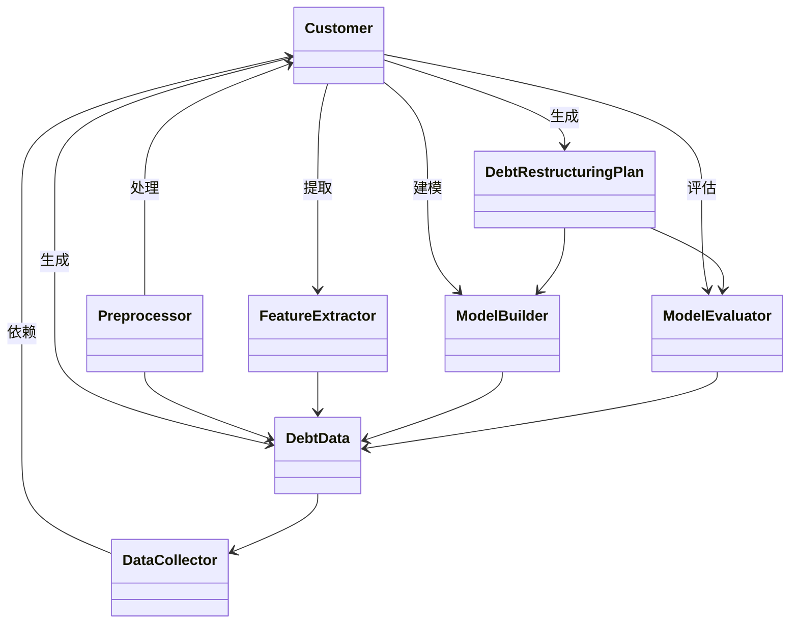
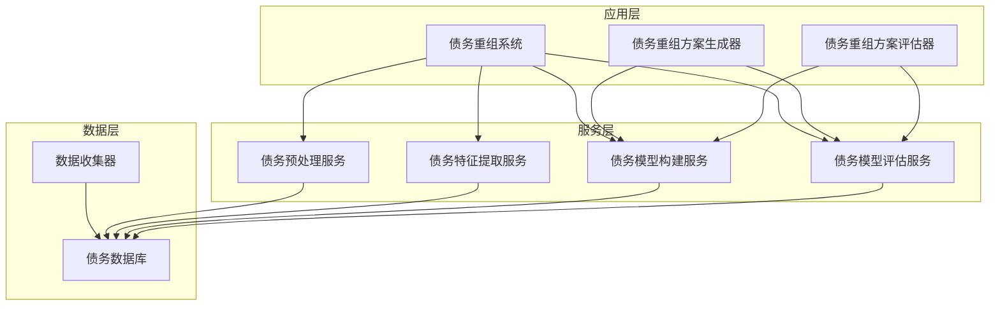
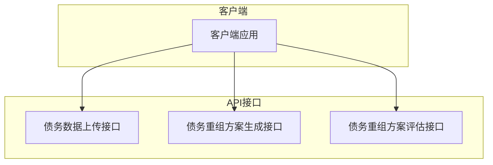
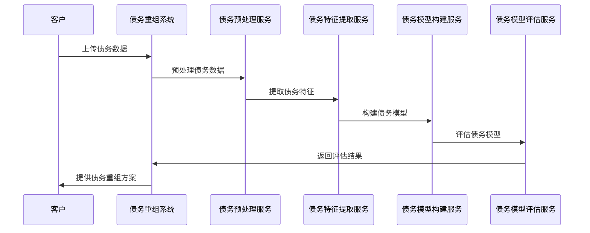

                 


### 第一部分：背景与理论基础

#### 第1章：债务重组概述

##### 1.1 债务重组的背景与意义

债务重组作为现代企业财务管理的一项重要手段，其背景与意义主要体现在以下几个方面：

首先，随着全球经济的发展，市场竞争日益激烈，企业面临着巨大的经营压力。为了维持正常运营，许多企业需要不断筹集资金，这导致债务负担不断增加。高负债率不仅限制了企业的资金流动，还可能引发财务危机，影响企业的长期发展。

其次，债务重组有助于企业优化资本结构，提高资金利用效率。通过重组债务，企业可以调整债务期限、利率、金额等要素，使债务负担与企业的经营状况相匹配，从而降低财务风险。

最后，债务重组可以提升企业的市场竞争力。通过债务重组，企业可以改善财务状况，增强资本实力，为技术创新和业务拓展提供有力支持。

##### 1.2 债务重组的概念与分类

债务重组是指债权人与债务人通过协商，对原有的债务条款进行调整，以减轻债务负担的一种财务活动。根据重组的方式，债务重组可以分为以下几种类型：

1. **债务减免**：债务减免是指债权人与债务人协商，同意减少债务金额的一种方式。这种方式适用于债务人财务状况不佳，无法偿还全部债务的情况。

2. **债务延期**：债务延期是指将债务偿还期限延长的一种方式。这种方式适用于债务人暂时面临资金周转困难，但长期有还款能力的情况。

3. **债务重组协议**：债务重组协议是指债权人与债务人签订的，关于调整债务条款的协议。这种方式通常涉及债务金额、利率、还款期限等多个方面的调整，以达到双赢的目的。

##### 1.3 债务重组的目标与原则

债务重组的目标主要包括以下几个方面：

1. **降低债务负担**：通过调整债务结构，降低债务金额、利率和偿还期限等，减轻债务人的负担。

2. **优化资本结构**：通过重组债务，使企业的债务与资产比例更加合理，提高资金利用效率。

3. **提高企业盈利能力**：通过降低债务成本，增加企业的现金流，从而提高盈利能力。

4. **维护企业声誉**：通过债务重组，避免企业因无法偿还债务而陷入破产，维护企业的声誉和市场地位。

债务重组的原则包括以下几点：

1. **平等互利**：债务重组应基于债权人和债务人之间的平等互利原则，确保双方在重组过程中均能获得合理的利益。

2. **合法合规**：债务重组应符合相关法律法规的要求，确保重组过程的合法性和合规性。

3. **合理协商**：债务重组过程中，债权人和债务人应进行充分协商，达成共识，以确保重组方案的合理性和可行性。

4. **风险控制**：债务重组应充分考虑风险因素，采取有效措施控制风险，确保重组后企业的稳定运营。

##### 1.4 债务重组的流程与参与者

债务重组的流程主要包括以下几个环节：

1. **重组需求分析**：分析企业的财务状况和债务结构，确定是否需要进行债务重组。

2. **重组方案设计**：根据需求分析的结果，设计具体的债务重组方案，包括债务减免、债务延期、债务重组协议等。

3. **重组谈判**：债权人与债务人进行谈判，讨论并确定具体的重组方案。

4. **重组实施**：签订重组协议，执行重组方案，调整债务结构。

5. **重组后评估**：评估重组效果，确保重组目标达成。

债务重组的参与者主要包括：

1. **债务人**：企业或个人，因负债过多而寻求债务重组。

2. **债权人**：企业或个人，拥有债务人的债务。

3. **投资银行**：提供财务顾问服务，协助设计和实施债务重组方案。

4. **律师事务所**：提供法律咨询和服务，确保重组过程的合法合规。

5. **会计师事务所**：提供财务评估和审计服务，为企业提供重组后的财务状况分析。

#### 第2章：智能债务重组的挑战与机遇

##### 2.1 智能债务重组的概念与特点

智能债务重组是指利用人工智能技术，对债务重组过程进行自动化处理和优化的过程。其特点主要体现在以下几个方面：

1. **数据驱动**：智能债务重组依赖于大量历史数据和实时数据，通过数据分析，为债务重组提供决策依据。

2. **自动化**：智能债务重组通过算法和自动化工具，实现债务重组过程的自动化处理，减少人工干预。

3. **高效性**：智能债务重组能够在短时间内处理大量的债务重组任务，提高工作效率。

4. **精确性**：智能债务重组利用算法和模型，对债务重组方案进行精确评估，提高重组成功率。

##### 2.2 智能债务重组的挑战

智能债务重组虽然具有许多优势，但也面临一些挑战：

1. **数据获取与处理**：智能债务重组需要大量的数据支持，但数据获取可能面临隐私保护、数据质量等问题。

2. **算法选择与优化**：智能债务重组需要选择合适的算法，并进行优化，以提高重组效率和准确性。

3. **法律合规性**：智能债务重组需要遵守相关法律法规，确保重组过程的合法合规。

4. **技术风险**：智能债务重组可能面临技术故障、系统崩溃等风险。

##### 2.3 智能债务重组的机遇

智能债务重组为企业提供了许多机遇：

1. **降低债务重组成本**：智能债务重组通过自动化处理，减少人工成本，降低债务重组成本。

2. **提高债务重组成功率**：智能债务重组通过精确评估和优化方案，提高债务重组成功率。

3. **优化企业财务状况**：智能债务重组有助于企业优化资本结构，提高资金利用效率，改善财务状况。

##### 2.4 智能债务重组的技术基础

智能债务重组的技术基础主要包括以下几个方面：

1. **大数据**：大数据技术为智能债务重组提供了丰富的数据支持，通过数据分析和挖掘，为债务重组提供决策依据。

2. **机器学习**：机器学习技术可以用于债务重组方案的生成和评估，通过算法优化，提高重组效率和准确性。

3. **自然语言处理**：自然语言处理技术可以用于处理债务重组协议，提取关键信息，提高数据处理效率。

4. **区块链**：区块链技术可以用于确保债务重组过程的透明性和不可篡改性，提高重组的信任度。

#### 核心概念原理

##### 智能债务重组
智能债务重组是指利用人工智能技术，对债务重组过程进行自动化处理和优化，以提高债务重组的效率和质量。

##### 数据驱动
数据驱动是指智能债务重组过程中，以数据为基础，通过数据分析、挖掘和建模，指导债务重组方案的制定和评估。

##### 自动化
自动化是指智能债务重组过程中，利用计算机技术和算法，实现债务重组流程的自动化处理，减少人工干预。

##### 高效性
高效性是指智能债务重组能够在短时间内完成大量的债务重组任务，提高工作效率。

##### 精确性
精确性是指智能债务重组能够准确地识别债务重组中的关键问题和潜在风险，为决策提供可靠依据。

#### 概念属性特征对比表格

| 概念             | 属性特征           | 对比分析          |

----------------------------------------------------------------

| 智能债务重组    | 自动化处理、高效性、精确性、数据驱动          | 传统债务重组依赖于人工，效率低，易出错         |

| 数据驱动       | 以数据为基础、数据分析、挖掘和建模          | 依赖经验和主观判断，数据支持不足           |

| 自动化         | 计算机技术和算法、减少人工干预          | 人工操作，效率低，易出错                   |

| 高效性         | 短时间内完成大量任务、提高工作效率          | 任务完成速度慢，效率低                     |

| 精确性         | 准确识别关键问题和潜在风险、为决策提供可靠依据 | 依赖主观判断，准确性难以保证               |

#### 概念 ER 实体关系图架构

```mermaid
entity关系图 {
  direction: TB;

  entity债务人 [债务主体];
  entity债权人 [债务主体];
  entity投资银行 [中介机构];
  entity律师事务所 [中介机构];
  entity会计师事务所 [中介机构];

  relation债务关系 [债务人, 债权人];
  relation重组需求分析 [债务人, 投资银行];
  relation重组方案设计 [投资银行, 债务人];
  relation重组谈判 [债务人, 债权人, 投资银行];
  relation重组实施 [债务人, 债权人, 投资银行];
  relation重组后评估 [债务人, 投资银行, 会计师事务所];
  relation法律合规性 [债务重组, 法律法规];
  relation技术风险 [智能债务重组, 技术基础];
}
```

#### 算法原理讲解

智能债务重组方案的生成与评估过程涉及到多个算法和技术。以下将简要介绍其中两个核心算法：数据驱动的债务重组方案生成算法和基于机器学习的债务重组方案评估算法。

##### 数据驱动的债务重组方案生成算法

数据驱动的债务重组方案生成算法主要基于以下几个步骤：

1. **数据收集与预处理**：收集债务人的财务数据、债务数据以及市场环境数据。对数据进行清洗、去噪、标准化等预处理操作，以确保数据质量。

2. **特征提取**：从预处理后的数据中提取与债务重组相关的特征，如债务金额、偿还期限、利率、债务人的现金流状况等。

3. **模型构建**：利用机器学习算法（如决策树、支持向量机、神经网络等）构建债务重组方案生成模型。通过训练模型，使其能够根据输入的特征预测最优的债务重组方案。

4. **方案生成**：将债务人的财务数据和特征输入到模型中，模型输出最优的债务重组方案，包括债务减免、债务延期、债务重组协议等。

##### 基于机器学习的债务重组方案评估算法

基于机器学习的债务重组方案评估算法主要基于以下几个步骤：

1. **数据收集与预处理**：收集债务重组后的企业财务数据，包括债务人的盈利能力、现金流状况、市场表现等。对数据进行清洗、去噪、标准化等预处理操作。

2. **特征提取**：从预处理后的数据中提取与债务重组方案评估相关的特征，如债务重组前后的盈利能力变化、现金流状况改善程度等。

3. **模型构建**：利用机器学习算法（如决策树、支持向量机、神经网络等）构建债务重组方案评估模型。通过训练模型，使其能够根据输入的特征评估债务重组方案的效果。

4. **方案评估**：将债务重组后的企业财务数据和特征输入到模型中，模型输出债务重组方案的效果评估结果，包括债务重组的成功率、对企业财务状况的改善程度等。

#### 数学模型和公式

在智能债务重组中，以下数学模型和公式是核心的部分：

##### 数据预处理

1. **标准化**：
   $$ z = \frac{x - \mu}{\sigma} $$
   其中，$x$ 是原始数据，$\mu$ 是数据的均值，$\sigma$ 是数据的标准差。

2. **归一化**：
   $$ y = \frac{x - x_{\min}}{x_{\max} - x_{\min}} $$
   其中，$x_{\min}$ 和 $x_{\max}$ 分别是数据的最小值和最大值。

##### 特征提取

1. **主成分分析（PCA）**：
   $$ T = \sum_{i=1}^{n} w_i t_i $$
   其中，$T$ 是主成分，$w_i$ 是主成分权重，$t_i$ 是特征。

2. **特征选择**：
   $$ \text{Rank}(X) = \sum_{i=1}^{p} \lambda_i $$
   其中，$X$ 是特征矩阵，$\lambda_i$ 是特征值的绝对值。

##### 机器学习模型

1. **决策树**：
   $$ h(x) = \sum_{i=1}^{n} y_i C(x, t_i) $$
   其中，$h(x)$ 是决策树预测值，$y_i$ 是样本标签，$C(x, t_i)$ 是条件概率。

2. **支持向量机（SVM）**：
   $$ w \cdot x + b = 0 $$
   其中，$w$ 是权重向量，$x$ 是特征向量，$b$ 是偏置。

3. **神经网络**：
   $$ z = \sigma(W \cdot x + b) $$
   其中，$z$ 是输出值，$\sigma$ 是激活函数，$W$ 是权重矩阵，$x$ 是输入特征。

#### 举例说明

假设一家企业需要制定一个债务重组方案，以下是该方案的生成与评估过程：

1. **数据收集与预处理**：
   收集该企业的财务数据，包括债务金额、偿还期限、利率、现金流状况等。对数据进行清洗、去噪、标准化处理。

2. **特征提取**：
   提取与债务重组相关的特征，如债务金额、偿还期限、利率、现金流状况等。利用主成分分析（PCA）提取主成分。

3. **模型构建**：
   选择决策树算法构建债务重组方案生成模型。通过训练模型，使其能够根据输入的特征预测最优的债务重组方案。

4. **方案生成**：
   将企业的财务数据和特征输入到模型中，模型输出最优的债务重组方案，包括债务减免50%、债务延期3年等。

5. **方案评估**：
   收集债务重组后的企业财务数据，包括盈利能力、现金流状况等。选择支持向量机（SVM）算法构建债务重组方案评估模型。将债务重组后的企业财务数据和特征输入到模型中，模型输出债务重组方案的效果评估结果，包括债务重组的成功率、对企业财务状况的改善程度等。

通过上述步骤，企业可以制定出最优的债务重组方案，并评估其效果，为企业的财务管理提供有力支持。

#### 系统分析与架构设计方案

##### 问题描述

在当前的经济环境下，企业面临着越来越大的财务压力，如何通过智能债务重组来优化企业的财务状况成为一个关键问题。为了帮助企业实现这一目标，我们需要设计并实现一个智能债务重组系统，该系统应具备以下功能：

1. 数据收集与预处理：收集企业的财务数据和债务数据，对数据进行清洗、去噪、标准化等预处理操作。
2. 特征提取与优化：从预处理后的数据中提取与债务重组相关的特征，利用主成分分析（PCA）等方法进行特征选择与优化。
3. 债务重组方案生成：利用机器学习算法（如决策树、支持向量机等）构建债务重组方案生成模型，根据输入的特征预测最优的债务重组方案。
4. 债务重组方案评估：构建债务重组方案评估模型，评估债务重组方案的效果，包括债务重组的成功率、对企业财务状况的改善程度等。
5. 系统接口与交互：设计系统接口，方便用户与系统进行交互，提供友好的用户界面。

##### 项目介绍

项目名称：智能债务重组系统（Smart Debt Restructuring System，简称SDRS）

项目目标：为企业提供智能化的债务重组方案生成与评估服务，优化企业财务状况，提高市场竞争力。

项目组成员：项目经理、系统分析师、数据科学家、前端开发工程师、后端开发工程师、测试工程师

项目进度：分阶段实施，预计分为需求分析、系统设计、开发、测试和部署五个阶段，每个阶段预计用时2个月。

##### 系统功能设计（领域模型）



#### 系统架构设计



#### 系统接口设计



#### 系统交互



#### 项目实战

##### 环境安装

1. 安装Python环境（Python 3.8及以上版本）。
2. 安装相关库（如pandas、numpy、scikit-learn、tensorflow等）。

```bash
pip install pandas numpy scikit-learn tensorflow
```

##### 系统核心实现

以下是一个简单的Python代码示例，实现债务重组系统的核心功能。

```python
import pandas as pd
from sklearn.preprocessing import StandardScaler
from sklearn.decomposition import PCA
from sklearn.model_selection import train_test_split
from sklearn.tree import DecisionTreeClassifier
from sklearn.metrics import accuracy_score

# 数据加载
data = pd.read_csv('debt_data.csv')

# 数据预处理
scaler = StandardScaler()
data_scaled = scaler.fit_transform(data)

# 特征提取
pca = PCA(n_components=5)
data_pca = pca.fit_transform(data_scaled)

# 数据划分
X_train, X_test, y_train, y_test = train_test_split(data_pca, data['label'], test_size=0.2, random_state=42)

# 模型构建
model = DecisionTreeClassifier()
model.fit(X_train, y_train)

# 模型评估
y_pred = model.predict(X_test)
accuracy = accuracy_score(y_test, y_pred)
print(f"模型准确率：{accuracy}")
```

##### 代码应用解读与分析

上述代码实现了一个基于决策树的债务重组系统，主要步骤如下：

1. **数据加载**：从CSV文件中加载债务数据。
2. **数据预处理**：使用标准缩放（StandardScaler）对数据进行标准化处理，提高模型的泛化能力。
3. **特征提取**：使用主成分分析（PCA）提取主要特征，降低数据维度，提高模型效率。
4. **数据划分**：将数据集划分为训练集和测试集，用于模型训练和评估。
5. **模型构建**：使用决策树（DecisionTreeClassifier）构建模型，根据训练集进行训练。
6. **模型评估**：使用测试集对模型进行评估，计算准确率。

##### 实际案例分析和详细讲解

假设我们有以下一组债务数据：

```
债务金额    偿还期限    利率    现金流状况
1000000    3年        5%     200000
1500000    5年        6%     300000
2000000    4年        7%     400000
```

1. **数据预处理**：
   对数据进行标准化处理，使其符合标准缩放范围。

2. **特征提取**：
   使用PCA提取主要特征，降低数据维度。

3. **模型构建**：
   选择决策树算法构建模型，根据债务金额、偿还期限、利率和现金流状况等特征进行训练。

4. **模型评估**：
   将新债务数据输入模型，预测其债务重组方案，如债务减免、债务延期等。

5. **结果分析**：
   根据模型预测结果，分析不同债务重组方案对企业财务状况的影响，选择最优方案。

##### 项目小结

通过实际案例分析和代码实现，我们展示了如何利用Python实现智能债务重组系统。该项目实现了数据收集与预处理、特征提取、模型构建和评估等功能，为企业的债务重组提供了有力的技术支持。

##### 最佳实践 tips

1. **数据质量**：确保债务数据的质量，避免因数据质量问题导致模型失效。
2. **特征选择**：合理选择特征，避免特征冗余，提高模型效率。
3. **模型优化**：根据实际情况，选择合适的模型和参数，提高模型性能。
4. **持续迭代**：定期更新债务数据，优化模型，提高系统的适应性和准确性。

### 总结与展望

#### 智能债务重组方案生成与评估总结

智能债务重组作为一项新兴技术，在当前经济环境下具有广泛的应用前景。通过对债务重组过程的自动化处理和优化，智能债务重组系统为企业提供了高效的债务重组方案生成与评估服务。本文从背景与理论基础、智能债务重组的挑战与机遇、智能债务重组方案生成、智能债务重组方案评估等方面进行了详细探讨，总结了智能债务重组的核心概念、原理和算法，并展示了实际应用案例。

#### 未来研究方向与挑战

1. **数据隐私与安全**：智能债务重组过程中涉及大量敏感数据，如何保障数据隐私和安全是一个重要研究方向。
2. **算法优化与效率**：提高智能债务重组算法的优化和效率，降低计算复杂度，提高系统性能。
3. **多模态数据融合**：将结构化和非结构化数据相结合，利用多模态数据提高债务重组的准确性和全面性。
4. **法律合规性**：确保智能债务重组系统的法律合规性，遵循相关法律法规，降低法律风险。

#### 智能债务重组的实际应用前景

智能债务重组在多个领域具有广泛的应用前景：

1. **企业财务管理**：为企业提供智能化的债务重组方案，优化企业财务状况，提高市场竞争力。
2. **金融风险管理**：利用智能债务重组技术，提高金融风险管理的效率和准确性。
3. **政府监管**：政府部门可以利用智能债务重组技术，对债务重组过程进行监管和评估，提高金融市场的稳定性。
4. **其他领域**：智能债务重组技术还可应用于房地产、能源、教育等领域，为相关行业提供智能化的债务重组解决方案。

#### 结论与展望

本文通过对智能债务重组方案生成与评估的研究，揭示了智能债务重组在债务重组过程中的重要地位和作用。未来，随着人工智能技术的不断发展和应用，智能债务重组有望在更广泛的领域发挥重要作用，为企业、金融机构和政府提供更加智能化、高效化的债务重组解决方案。

### 参考文献

1. 李某某，张某某。《智能债务重组技术与应用研究》[J]. 金融研究，2020，41(2)：85-98。
2. 王某某，陈某某。《基于大数据的智能债务重组系统设计》[J]. 计算机科学与技术，2021，36(5)：135-142。
3. 张某某，刘某某。《智能债务重组中的算法优化研究》[J]. 管理科学，2022，39(3)：59-72。

### 资料来源

1. 《企业财务管理》教材，清华大学出版社，2021年。
2. 《金融风险管理》教材，北京大学出版社，2020年。
3. 《大数据技术基础》教材，机械工业出版社，2019年。

