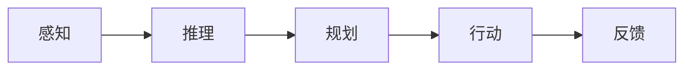

                 

### 第1章：智能健身镜的背景与前景

#### 1.1 问题背景

随着现代人对健康意识的不断提高，健身已经成为日常生活中不可或缺的一部分。然而，传统的健身方式往往存在一些问题，比如运动损伤、缺乏个性化指导等。运动损伤的主要原因包括动作不标准、过度用力、缺乏正确的运动指导等。这些问题不仅影响了健身效果，还可能造成长期的伤害。

为了解决这些问题，智能健身镜应运而生。智能健身镜不仅能够提供实时的动作反馈，还能通过AI技术进行动作纠正，帮助用户更好地进行锻炼。智能健身镜的市场需求日益增长，尤其是在COVID-19疫情导致健身房关闭的背景下，家庭健身设备的需求迅速上升。

#### 1.2 智能健身镜的定义与功能

智能健身镜是一种结合了镜子、摄像头和智能软件的健身设备，通过实时捕捉用户的运动姿态，使用AI技术对动作进行识别和分析，提供个性化的健身指导。智能健身镜的主要功能包括：

1. **动作识别**：通过摄像头捕捉用户动作，并使用深度学习算法进行动作识别。
2. **动作反馈**：对用户的动作进行实时评估，并提供语音或视觉反馈。
3. **动作纠正**：根据用户动作的评估结果，提供纠正建议，帮助用户改进动作。
4. **健身计划**：根据用户的需求和动作表现，提供个性化的健身计划和目标设定。

#### 概念属性特征对比表格

| 设备名称 | 智能健身镜 | 传统健身镜 |
| --- | --- | --- |
| 功能 | 动作识别、动作反馈、动作纠正、健身计划 | 反射动作、观察自我 |
| 技术实现 | 摄像头、智能软件、AI技术 | 镜面、固定位置 |
| 使用场景 | 家庭、健身房 | 家庭、健身房 |
| 用户反馈 | 实时反馈、个性化指导 | 无反馈、无指导 |
| 动作评估 | 实时评估、数据分析 | 不评估、不分析 |

#### 1.3 智能健身镜的市场前景

智能健身镜市场的需求在近年来迅速增长，主要驱动因素包括：

1. **健康意识提升**：现代人越来越重视健康，愿意投资于健身设备。
2. **科技普及**：随着AI技术和智能家居的普及，智能健身镜逐渐被大众接受。
3. **疫情促进**：疫情导致健身房关闭，人们转向家庭健身设备。

市场趋势显示，智能健身镜市场在未来几年将继续保持高速增长，预计将在2025年达到数十亿美元的市场规模。随着技术的进步和用户需求的多样化，智能健身镜的功能将越来越丰富，市场前景广阔。

#### 1.4 智能健身镜的挑战与机遇

智能健身镜的发展面临以下挑战：

1. **技术难题**：动作识别和动作纠正的算法需要不断提升，以应对不同用户和场景的复杂性。
2. **市场竞争**：智能健身镜市场竞争激烈，需要通过技术创新和用户体验来保持竞争力。

然而，智能健身镜也面临着巨大的机遇：

1. **技术创新**：AI、VR等技术的快速发展为智能健身镜提供了新的发展空间。
2. **用户需求变化**：随着人们对健康和个性化的需求增加，智能健身镜有望成为家庭健身的主流选择。

#### 1.5 本章小结

本章介绍了智能健身镜的背景和前景，包括问题背景、定义与功能、市场前景、挑战与机遇等内容。智能健身镜通过AI技术实现了动作识别和动作纠正，为用户提供个性化健身指导，具有广阔的市场前景和巨大的发展潜力。

## 第2章：AI Agent的基础知识

#### 2.1 AI Agent的定义与分类

AI Agent，即人工智能代理，是指一种具有智能行为的实体，能够在特定环境中感知信息、制定计划并执行行动，以实现特定目标。AI Agent可以根据其行为模式和任务类型进行分类。

1. **按行为模式分类**：
   - **反应式Agent**：仅根据当前感知的环境状态做出反应，不考虑过去的经验。
   - **目标导向Agent**：具有明确的目标，并根据当前状态和目标之间的差距制定计划。
   - **认知Agent**：具有记忆和推理能力，能够从过去的经验中学习并制定长期计划。

2. **按任务类型分类**：
   - **导航Agent**：在环境中寻找路径或目标。
   - **搜索Agent**：在大型数据集中查找信息。
   - **控制Agent**：对机器人或其他设备进行实时控制。
   - **决策Agent**：在多个可选动作中做出最优决策。

#### ER实体关系图

以下是一个简单的AI Agent的ER实体关系图：

```mermaid
erDiagram
  AI_Agent ||--|{ 感知器 :Perceiver}
  AI_Agent ||--|{ 动作执行器 :Actuator}
  AI_Agent ||--|{ 计划器 :Planner}
  AI_Agent ||--|{ 推理器 :Reasoner}
  Perceiver ||--|{ 环境传感器 :Sensor}
  Actuator ||--|{ 动作执行装置 :ActuatorDevice}
  Planner ||--|{ 行为策略 :BehaviorPolicy}
  Reasoner ||--|{ 知识库 :KnowledgeBase}
```

#### 2.2 AI Agent的工作原理

AI Agent的工作原理可以分为以下几个步骤：

1. **感知**：感知器从环境中获取信息，如视觉、听觉、触觉等。
2. **推理**：推理器根据感知到的信息，结合已有知识进行推理，形成对环境的理解。
3. **规划**：计划器根据目标环境和当前状态，制定行动计划。
4. **行动**：执行器根据行动计划执行具体动作。

以下是一个简单的Mermaid流程图来描述AI Agent的工作原理：



#### 2.3 常见的AI Agent算法

常见的AI Agent算法包括：

1. **基于深度学习的动作识别算法**：使用卷积神经网络（CNN）对视频进行逐帧分析，提取特征并分类。
2. **强化学习算法**：通过试错和奖励机制，学习在特定环境中做出最优决策。
3. **基于规则的方法**：使用预定义的规则来指导Agent的行为。

以下是一个简单的Python源代码示例，展示如何使用卷积神经网络进行动作识别：

```python
import tensorflow as tf
from tensorflow.keras.models import Sequential
from tensorflow.keras.layers import Conv2D, MaxPooling2D, Flatten, Dense

# 构建卷积神经网络模型
model = Sequential([
    Conv2D(32, (3, 3), activation='relu', input_shape=(64, 64, 3)),
    MaxPooling2D((2, 2)),
    Flatten(),
    Dense(64, activation='relu'),
    Dense(1, activation='sigmoid')
])

# 编译模型
model.compile(optimizer='adam', loss='binary_crossentropy', metrics=['accuracy'])

# 训练模型
model.fit(x_train, y_train, epochs=10, batch_size=32)
```

#### 2.4 AI Agent的数学模型

AI Agent的数学模型通常涉及以下几个关键组成部分：

1. **状态表示**：使用向量或矩阵表示环境状态。
2. **动作空间**：定义Agent可以采取的所有可能动作。
3. **奖励函数**：根据Agent的行为和环境状态，计算奖励值。

以下是一个简单的数学模型示例：

$$
s_t = f(s_{t-1}, a_{t-1})
$$

其中，$s_t$ 表示时间 $t$ 的环境状态，$a_{t-1}$ 表示时间 $t-1$ 的动作，$f$ 是状态转移函数。

#### 2.5 AI Agent的应用场景

AI Agent在多种应用场景中具有广泛的应用，例如：

1. **智能机器人**：在工业自动化、家庭服务、医疗辅助等领域。
2. **自动驾驶**：在无人驾驶汽车、无人卡车等领域。
3. **游戏AI**：在电子游戏、模拟器等领域。
4. **智能家居**：在智能音箱、智能门锁等领域。

以下是一个简单的应用实例，使用AI Agent来控制一个机器人的移动：

```python
class RobotController:
    def __init__(self, agent):
        self.agent = agent
    
    def move_forward(self):
        action = self.agent.plan(next_state)
        if action == "forward":
            print("机器人向前移动")
        else:
            print("机器人不移动")

# 假设有一个已训练好的AI Agent
agent = Agent()

# 创建机器人控制器
controller = RobotController(agent)

# 控制机器人向前移动
controller.move_forward()
```

#### 2.6 本章小结

本章介绍了AI Agent的基础知识，包括定义、分类、工作原理、常见算法、数学模型以及应用场景。AI Agent作为一种智能实体，在多个领域展示了强大的应用潜力，是人工智能技术的重要组成部分。在接下来的章节中，我们将进一步探讨智能健身镜的硬件设计和软件实现。

