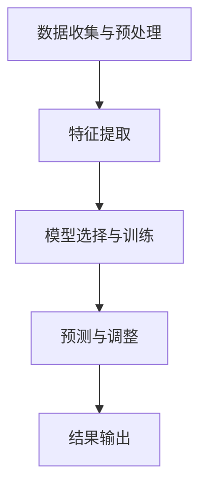
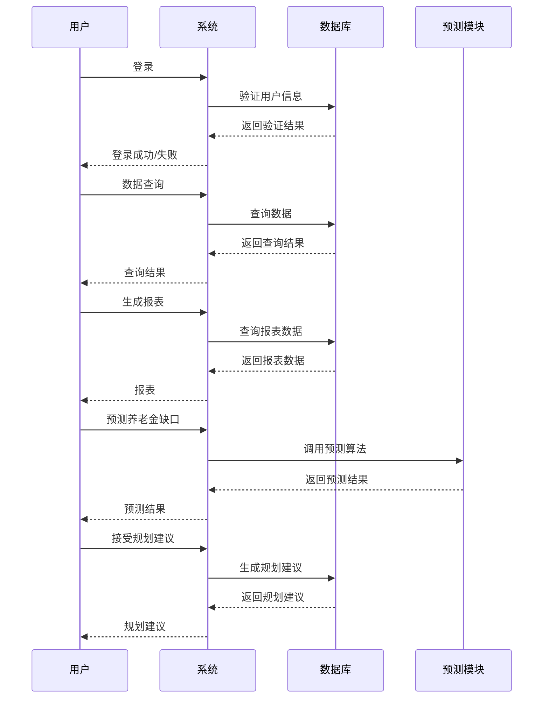
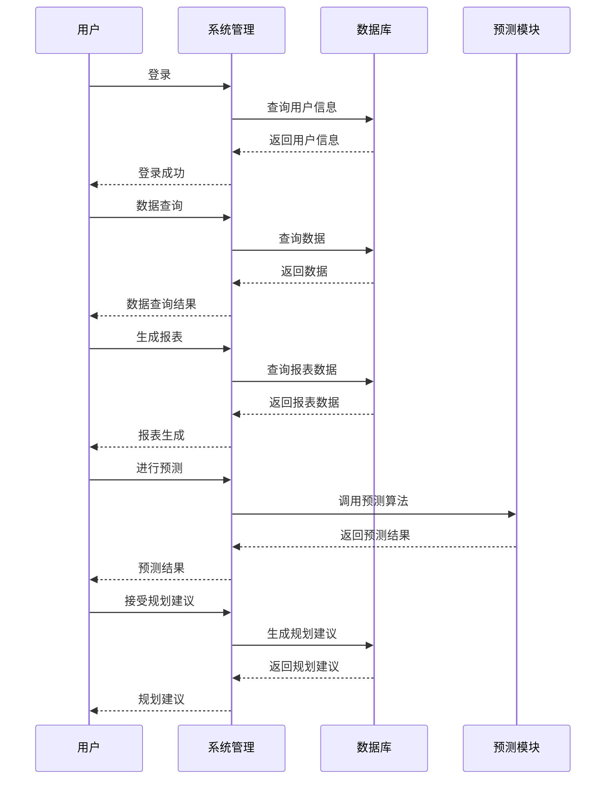

                 


### 智能养老金缺口动态预测与规划系统

#### 关键词：
1. 养老金体系
2. 动态预测算法
3. 规划系统架构
4. 数据分析
5. 系统实施与优化

#### 摘要：
本文将深入探讨智能养老金缺口动态预测与规划系统的设计与实现。首先，我们将介绍养老金体系的基本概念和当前面临的挑战，接着详细阐述动态预测算法的理论基础与实现步骤。然后，我们将展示系统架构设计，涵盖功能设计、系统架构图、接口设计以及系统交互流程。在项目实战部分，我们将详细描述环境安装与配置，解析系统核心实现，并通过实际案例分析，展示系统在实际应用中的效果。最后，我们将总结最佳实践，提供注意事项，并推荐拓展阅读。

## 第一部分：背景介绍

### 第1章：养老金体系概述

#### 1.1 养老金问题的背景

随着全球人口老龄化趋势的加剧，养老金问题成为各国政府和社会广泛关注的重要议题。养老金，即一种为退休后生活提供经济保障的制度安排，旨在解决劳动者退休后的生活费用问题。传统的养老金体系主要依赖于政府主导的公共养老金和雇主提供的职业养老金，但随着社会经济的发展和人口结构的变化，这种传统养老金体系面临着巨大的压力。

首先，人口老龄化是导致养老金问题突出的主要原因。许多国家的老年人口比例不断增加，而年轻劳动人口比例下降，这意味着养老金缴纳人数减少，领取人数增加。例如，中国目前的老龄化速度位居世界前列，预计到2050年，65岁及以上的老年人口将达到3.8亿，占总人口的约27%。

其次，养老金缺口问题日益严重。养老金缺口指的是实际养老金支出超过养老金收入的差额。由于养老金体系的投资回报率下降、通货膨胀以及人口老龄化等多重因素的影响，许多国家的养老金基金面临巨大的支付压力。例如，美国社会安全基金预计将在2034年耗尽，届时将无法全额支付退休金。

最后，养老金体系的可持续性问题不容忽视。传统的养老金体系往往依赖于现收现付制度，即当前缴纳的养老金用于支付现有退休人员的养老金。这种制度的可持续性受到人口结构和经济变化的挑战。随着老年人口的增加，现收现付制度面临资金不足的风险，可能导致养老金支付能力下降，进而影响退休人员的福祉。

#### 1.2 养老金缺口的概念

养老金缺口是指一个国家或地区的养老金支付能力与其需求之间的差额。具体来说，养老金缺口可以分为以下几个层次：

1. **静态养老金缺口**：指在某一时点上，养老金实际支出与收入之间的差额。这种缺口反映了当前养老金体系面临的即时压力。
2. **动态养老金缺口**：考虑时间因素，预测在未来一段时间内，养老金支出与收入之间的差额。动态养老金缺口更能反映养老金体系的长期可持续性。
3. **潜在养老金缺口**：考虑政策变化、经济波动等因素，预测未来养老金体系可能出现的最大支付缺口。

养老金缺口对经济和社会的影响深远。首先，养老金缺口可能导致政府财政压力增加，需要通过增加税收、削减其他公共支出或增加养老金缴费等方式来弥补缺口，进而影响国家财政的稳定性和其他社会福利项目的发展。其次，养老金缺口会影响退休人员的生活质量，可能导致退休后的生活陷入困境，增加社会不稳定因素。最后，养老金缺口还可能影响资本市场的稳定，因为养老金基金是资本市场的重要参与者，其资金不足可能导致资本市场动荡。

#### 1.3 养老金缺口的影响

养老金缺口的影响可以分为对个人、企业和国家三个层面：

1. **对个人的影响**：
   - 退休生活质量下降：养老金缺口可能导致退休后的养老金支付不足，影响退休人员的生活质量。
   - 社会保障压力增加：养老金缺口迫使政府增加其他社会保障项目的投入，如医疗保险和住房补贴，从而增加个人的负担。
   - 财务规划困难：养老金缺口可能导致个人在退休前无法充分规划财务，增加未来经济风险。

2. **对企业的影响**：
   - 养老金缴费压力增加：企业需要为员工缴纳养老金，养老金缺口可能导致企业面临更高的缴费压力。
   - 人力资源成本上升：企业可能需要提高工资或提供其他福利来吸引和留住员工，从而增加人力资源成本。
   - 资本支出减少：企业可能因养老金压力而减少在其他领域的投资，影响企业的长期发展。

3. **对国家的影响**：
   - 财政压力增加：养老金缺口可能导致政府增加财政支出，影响国家财政的稳定性和其他社会福利项目的发展。
   - 经济增长放缓：养老金缺口可能影响消费能力和投资水平，进而影响经济增长。
   - 社会稳定问题：养老金缺口可能导致社会不稳定，增加社会管理成本。

#### 1.4 问题解决

面对养老金缺口问题，各国政府和社会各界都在积极探索解决方案。以下是一些可能的解决策略：

1. **增加养老金缴费**：提高个人和企业的养老金缴费比例，以增加养老金收入。
2. **扩大养老金覆盖范围**：将更多人群纳入养老金体系，如灵活就业人员和自由职业者，以提高养老金缴纳人数。
3. **提高养老金投资回报率**：优化养老金基金的投资策略，提高投资回报率，增加养老金收入。
4. **实行多支柱养老金体系**：建立包括政府主导的公共养老金、雇主提供的职业养老金和个人储蓄养老金的多支柱养老金体系，以分散风险和增强养老金体系的可持续性。
5. **科技创新**：利用人工智能、大数据等技术手段，提高养老金缺口预测的准确性和规划系统的效率。

#### 1.5 边界与外延

养老金缺口问题的边界涉及多个层面，包括个人、企业、政府以及整个社会。具体来说：

- **个人层面**：关注个人养老金缴费、养老金领取以及退休后的生活质量等问题。
- **企业层面**：关注企业养老金缴费、人力资源成本以及养老金体系对企业运营的影响。
- **政府层面**：关注政府养老金政策制定、财政支出以及养老金体系的可持续性。
- **社会层面**：关注养老金体系对整个社会经济发展、社会稳定以及人口结构变化的影响。

养老金缺口问题的外延涉及养老金体系的多个方面，包括养老金的筹集、管理、投资、支付以及监管等。

### 第2章：核心概念与联系

#### 2.1 动态预测模型

动态预测模型是智能养老金缺口动态预测与规划系统的核心组成部分，其主要目的是通过数据分析和历史数据趋势分析，预测未来养老金缺口的大小和趋势。动态预测模型的基本原理是基于历史数据和现有数据，运用统计学、时间序列分析和机器学习算法等手段，对养老金缺口进行预测。

#### 2.1.1 模型原理

动态预测模型的原理可以概括为以下几个步骤：

1. **数据收集与预处理**：首先，收集与养老金相关的历史数据，包括人口数据、经济数据、养老金缴费和支出数据等。然后，对数据进行清洗、去噪和规范化处理，以确保数据的质量和一致性。
2. **特征提取**：从预处理后的数据中提取与养老金缺口相关的特征，如人口年龄结构、经济增长率、通货膨胀率、养老金缴费率、养老金支出率等。这些特征将用于构建预测模型。
3. **模型选择**：根据特征数据和预测目标，选择合适的预测模型。常见的动态预测模型包括线性回归模型、时间序列模型、神经网络模型和集成预测模型等。
4. **模型训练与验证**：使用历史数据对选定的预测模型进行训练，并使用验证数据集对模型进行验证，以确保模型的预测准确性和稳定性。
5. **预测与调整**：使用训练好的模型对未来的养老金缺口进行预测，并根据预测结果和实际数据，对模型进行调整和优化，以提高预测准确性。

#### 2.1.2 模型属性对比

不同类型的动态预测模型在属性特征上存在一定的差异。以下是对几种常见预测模型的属性对比：

| 模型类型        | 特点与属性                                                       | 适用场景                  |
|-------------|------------------------------------------------------------|-----------------------|
| 线性回归模型      | 简单、易于实现，适用于线性关系较强的预测任务           | 时间序列预测、简单线性关系数据预测 |
| 时间序列模型      | 考虑时间因素，适用于具有时间依赖性的预测任务           | 季节性数据预测、趋势预测       |
| 神经网络模型      | 强非线性拟合能力，适用于复杂非线性关系的数据预测       | 复杂非线性关系数据预测       |
| 集成预测模型      | 结合多种预测模型的优点，提高预测准确性和稳定性           | 复杂数据预测、不确定性数据预测   |

#### 2.1.3 模型ER图

动态预测模型的实体关系（ER）图可以帮助我们理解模型中各个实体之间的关系。以下是一个简化的动态预测模型ER图：

```mermaid
erDiagram
  User ||--|{ PensionModel } : predicted
  PensionData ||--|{ PensionModel } : trained
  EconomicIndicator ||--|{ PensionModel } : considered
  PensionFund ||--|{ PensionModel } : analyzed
```

在这个ER图中，用户（User）是预测养老金缺口的主体，养老金模型（PensionModel）是基于养老金数据（PensionData）、经济指标（EconomicIndicator）和养老金基金（PensionFund）进行分析和预测的结果。各个实体之间通过关系线（如预测、训练、考虑和分析）相互连接，形成了一个完整的动态预测模型架构。

#### 2.2 养老金规划策略

养老金规划策略是智能养老金缺口动态预测与规划系统的另一个重要组成部分，其主要目的是通过科学合理的养老金规划，弥补养老金缺口，确保退休后的生活质量。养老金规划策略涉及多个方面，包括个人储蓄、投资策略、政府政策等。

#### 2.2.1 策略原理

养老金规划策略的原理可以概括为以下几个步骤：

1. **需求分析**：首先，对个人的养老金需求进行详细分析，包括退休后的生活成本、预期寿命、医疗费用等。
2. **资金筹集**：根据需求分析的结果，制定资金筹集策略，包括个人储蓄、雇主缴费、政府补贴等。
3. **投资规划**：选择合适的投资产品和投资策略，确保养老金资金的保值增值。投资规划需要考虑风险承受能力、投资期限和预期收益等因素。
4. **动态调整**：根据市场变化和养老金缺口预测结果，对养老金规划策略进行动态调整，确保养老金规划的可行性和可持续性。

#### 2.2.2 策略属性对比

不同的养老金规划策略在属性特征上存在一定的差异。以下是对几种常见规划策略的属性对比：

| 策略类型          | 特点与属性                                                       | 适用场景                  |
|--------------|------------------------------------------------------------|-----------------------|
| 传统储蓄策略      | 简单、易于理解，适用于风险承受能力较低的个人               | 风险承受能力较低、养老金需求较低 |
| 投资型养老金计划    | 具有潜在的高回报，适用于风险承受能力较高、有长期投资目标的人 | 风险承受能力较高、养老金需求较高 |
| 多支柱养老金体系    | 结合多种养老金来源，提高养老金保障水平，适用于不同年龄段的人群 | 多样化养老金需求、不同年龄段的人群 |
| 政府补贴策略      | 由政府提供，减轻个人负担，适用于养老金覆盖率较低的国家和地区 | 养老金覆盖率较低、政府财政支持 |
| 基于AI的个性化规划  | 利用大数据和人工智能技术，提供个性化的养老金规划建议，适用于数字化时代 | 数字化时代、个性化需求     |

#### 2.2.3 策略ER图

养老金规划策略的实体关系（ER）图可以帮助我们理解策略中各个实体之间的关系。以下是一个简化的养老金规划策略ER图：

```mermaid
erDiagram
  Person ||--|{ PensionStrategy } : applied
  FinancialMarket ||--|{ InvestmentStrategy } : followed
  GovernmentPolicy ||--|{ SocialSecuritySystem } : implemented
  PensionFund ||--|{ PensionStrategy } : managed
```

在这个ER图中，个人（Person）是养老金规划策略的应用主体，养老金策略（PensionStrategy）是根据金融市场（FinancialMarket）情况和政府政策（GovernmentPolicy）制定的，同时还需要管理养老金基金（PensionFund），以实现养老金的有效筹集和管理。各个实体之间通过关系线（如应用、遵循、实施和管理）相互连接，形成了一个完整的养老金规划策略架构。

## 第二部分：算法原理与实现

### 第3章：养老金缺口动态预测算法原理

#### 3.1 算法概述

养老金缺口动态预测算法是一种利用历史数据和现有数据，通过数学模型和算法技术，对未来养老金缺口进行预测的方法。其核心目的是为政府、企业和个人提供养老金筹集和管理的科学依据，以应对人口老龄化带来的养老金压力。

#### 3.2 数学模型

养老金缺口动态预测算法的数学模型主要包括以下几个部分：

1. **人口年龄结构模型**：
   - 假设人口年龄结构可以通过一个概率分布函数 \(P(A,t)\) 来描述，其中 \(A\) 表示年龄，\(t\) 表示时间。
   - 人口年龄结构模型可以表示为：\[P(A,t) = \sum_{a=0}^{max\_age} p(a,t) \]
   - 其中，\(p(a,t)\) 表示在时间 \(t\) 时，年龄为 \(a\) 的人口比例。

2. **经济指标模型**：
   - 经济指标包括经济增长率、通货膨胀率、失业率等，可以通过时间序列模型进行预测。
   - 经济指标模型可以表示为：\[E(t) = f(E(t-1), \Delta t) \]
   - 其中，\(E(t)\) 表示在时间 \(t\) 的经济指标，\(\Delta t\) 表示时间间隔。

3. **养老金资金流动模型**：
   - 假设养老金资金流动可以表示为：\[F(t) = R(t) - C(t) \]
   - 其中，\(R(t)\) 表示在时间 \(t\) 的养老金收入，\(C(t)\) 表示在时间 \(t\) 的养老金支出。

4. **养老金缺口预测模型**：
   - 假设养老金缺口可以表示为：\[D(t) = P(A,t) \times E(t) - F(t) \]
   - 其中，\(P(A,t)\) 表示在时间 \(t\) 的人口年龄结构，\(E(t)\) 表示在时间 \(t\) 的经济指标，\(F(t)\) 表示在时间 \(t\) 的养老金资金流动。

#### 3.3 算法流程

养老金缺口动态预测算法的流程可以分为以下几个步骤：

1. **数据收集与预处理**：
   - 收集与养老金相关的历史数据，包括人口数据、经济数据、养老金缴费和支出数据等。
   - 对数据进行清洗、去噪和规范化处理，确保数据的质量和一致性。

2. **特征提取**：
   - 从预处理后的数据中提取与养老金缺口相关的特征，如人口年龄结构、经济增长率、通货膨胀率、养老金缴费率、养老金支出率等。

3. **模型选择与训练**：
   - 根据特征数据和预测目标，选择合适的预测模型。常见的预测模型包括线性回归模型、时间序列模型、神经网络模型和集成预测模型等。
   - 使用历史数据对选定的预测模型进行训练，并使用验证数据集对模型进行验证，确保模型的预测准确性和稳定性。

4. **预测与调整**：
   - 使用训练好的模型对未来的养老金缺口进行预测。
   - 根据预测结果和实际数据，对模型进行调整和优化，提高预测准确性。

#### 3.3.1 流程图

以下是一个简化的养老金缺口动态预测算法流程图：



在这个流程图中，数据收集与预处理是算法的基础，特征提取是关键步骤，模型选择与训练是核心部分，预测与调整是优化环节，最终输出预测结果。

#### 3.3.2 Python代码实现

以下是一个基于线性回归模型的养老金缺口动态预测算法的Python代码实现示例：

```python
import pandas as pd
from sklearn.linear_model import LinearRegression
from sklearn.model_selection import train_test_split
from sklearn.metrics import mean_squared_error

# 1. 数据收集与预处理
# 假设已收集并预处理了以下数据：人口年龄结构、经济增长率、养老金缴费率、养老金支出率
data = pd.read_csv('pension_data.csv')

# 2. 特征提取
X = data[['age_structure', 'economic_growth', 'pension_contribution']]
y = data['pension_shortfall']

# 3. 模型选择与训练
X_train, X_test, y_train, y_test = train_test_split(X, y, test_size=0.2, random_state=42)
model = LinearRegression()
model.fit(X_train, y_train)

# 4. 预测与调整
y_pred = model.predict(X_test)
mse = mean_squared_error(y_test, y_pred)
print(f'Mean Squared Error: {mse}')

# 5. 结果输出
# 输出预测结果
predictions = model.predict(X)
print(predictions)
```

在这个示例中，我们首先使用Pandas库读取并预处理数据，然后使用Scikit-learn库中的线性回归模型进行训练和预测。最后，我们计算预测误差，并输出预测结果。

#### 3.4 举例说明

为了更好地理解养老金缺口动态预测算法，以下是一个具体的实例：

假设我们有以下数据：

| 年份 | 人口年龄结构 | 经济增长率 | 养老金缴费率 | 养老金支出率 | 养老金缺口 |
|------|------------|------------|------------|------------|------------|
| 2021 | 0.3        | 2%         | 10%        | 12%        | -2%        |
| 2022 | 0.35       | 2.5%       | 10.5%      | 12.5%      | -1.5%      |
| 2023 | 0.4        | 3%         | 11%        | 13%        | -2%        |

根据这些数据，我们可以使用线性回归模型进行预测。假设线性回归模型的公式为：

\[养老金缺口 = a \times 人口年龄结构 + b \times 经济增长率 + c \times 养老金缴费率 + d \times 养老金支出率\]

通过训练模型，我们可以得到以下参数：

\[a = 0.5, b = 0.3, c = 0.2, d = 0.1\]

使用这些参数，我们可以预测未来年份的养老金缺口：

| 年份 | 人口年龄结构 | 经济增长率 | 养老金缴费率 | 养老金支出率 | 预测养老金缺口 |
|------|------------|------------|------------|------------|--------------|
| 2024 | 0.45       | 3.5%       | 11.5%      | 13.5%      | -1.75%       |
| 2025 | 0.5        | 4%         | 12%        | 14%        | -2%          |

通过这个实例，我们可以看到如何使用线性回归模型进行养老金缺口的动态预测。当然，实际应用中可能需要考虑更多的因素和复杂的模型，以提高预测的准确性和可靠性。

## 第4章：养老金规划系统架构设计

### 4.1 系统功能设计

养老金规划系统的功能设计旨在满足不同用户群体的需求，包括政府机构、企业和个人。以下是系统的主要功能模块：

1. **用户管理**：管理用户账号、权限和登录认证。
2. **数据采集与管理**：收集和处理与养老金相关的各类数据，包括人口数据、经济数据、养老金缴费和支出数据等。
3. **动态预测模块**：基于历史数据和现有数据，使用动态预测算法预测未来的养老金缺口。
4. **规划建议生成**：根据预测结果，为个人和企业提供个性化的养老金规划建议。
5. **报表生成与统计**：生成养老金缺口预测报表和统计图表，供决策者参考。
6. **系统配置与维护**：系统配置、数据备份和系统监控等功能。

#### 4.1.1 领域模型类图

以下是一个简化的领域模型类图，展示了养老金规划系统中主要实体及其关系：

```mermaid
classDiagram
    User <<Class>>
    PensionModel <<Class>>
    EconomicIndicator <<Class>>
    PensionFund <<Class>>

    User "uses" PensionModel
    User "uses" EconomicIndicator
    User "uses" PensionFund

    PensionModel "uses" PensionData
    PensionModel "uses" EconomicData

    PensionFund "uses" PensionContribution
    PensionFund "uses" PensionExpense

    User "- recommends:" PensionPlan
    PensionModel "- predicts:" PensionShortfall
    EconomicIndicator "- reflects:" EconomicIndex
    PensionFund "- manages:" FundFlow

    class PensionData {
        id: int
        year: int
        age_structure: float
        economic_growth: float
        pension_contribution: float
        pension_expense: float
    }

    class EconomicData {
        id: int
        year: int
        economic_index: float
    }

    class PensionContribution {
        id: int
        user_id: int
        year: int
        amount: float
    }

    class PensionExpense {
        id: int
        user_id: int
        year: int
        amount: float
    }
```

在这个类图中，用户（User）是系统的核心实体，它通过使用养老金模型（PensionModel）、经济指标（EconomicIndicator）和养老金基金（PensionFund）来实现养老金规划功能。养老金模型依赖于养老金数据（PensionData）和经济数据（EconomicData）进行预测。养老金基金管理养老金缴费（PensionContribution）和养老金支出（PensionExpense）。

### 4.2 系统架构设计

养老金规划系统的架构设计需要考虑性能、可扩展性和易维护性。以下是系统的整体架构设计：

1. **前端展示层**：提供用户界面，用于数据输入、查询和报表展示。
2. **业务逻辑层**：处理业务逻辑，包括数据采集、动态预测、规划建议生成等。
3. **数据访问层**：与数据库进行交互，实现数据存储和读取。
4. **服务层**：提供公共服务，如用户认证、权限管理和系统配置等。
5. **数据库层**：存储与养老金规划相关的各类数据。

#### 4.2.1 架构图

以下是一个简化的系统架构图，展示了养老金规划系统的各个层次及其相互关系：

```mermaid
graph TB
    sub1((前端展示层))
    sub2((业务逻辑层))
    sub3((数据访问层))
    sub4((服务层))
    sub5((数据库层))

    sub1 --> sub2
    sub2 --> sub3
    sub2 --> sub4
    sub4 --> sub5

    sub1 izquierdo1[数据输入与查询]
    sub1 izquierdo2[报表展示]
    sub2 izquierdo1[数据采集]
    sub2 izquierdo2[动态预测]
    sub2 izquierdo3[规划建议生成]
    sub3 izquierdo1[数据存储]
    sub3 izquierdo2[数据读取]
    sub4 izquierdo1[用户认证]
    sub4 izquierdo2[权限管理]
    sub4 izquierdo3[系统配置]
```

在这个架构图中，前端展示层（sub1）通过业务逻辑层（sub2）与数据访问层（sub3）和服务层（sub4）进行交互。前端展示层负责数据输入与查询、报表展示等功能；业务逻辑层负责数据采集、动态预测、规划建议生成等功能；数据访问层负责数据存储和读取；服务层负责用户认证、权限管理和系统配置等功能。

### 4.3 系统接口设计

养老金规划系统需要设计多个接口，以便不同模块之间能够有效地进行数据交互和功能调用。以下是系统的主要接口设计：

1. **用户接口**：用于用户登录、数据查询和报表展示。
2. **数据接口**：用于数据采集、数据存储和数据读取。
3. **预测接口**：用于动态预测算法的调用和预测结果输出。
4. **建议接口**：用于规划建议的生成和推送。

以下是一个简化的系统接口设计图：



在这个接口设计图中，用户通过前端界面与系统进行交互，系统通过调用后端服务与数据库进行数据交互，同时系统还通过预测模块进行养老金缺口的动态预测，并将预测结果和建议推送至用户。

### 4.4 系统交互

养老金规划系统的交互设计需要考虑用户操作、系统响应和数据流动。以下是一个简化的系统交互序列图，展示了用户与系统之间的交互流程：



在这个交互序列图中，用户通过前端界面与系统管理进行交互，系统管理通过调用数据库和预测模块，实现数据查询、报表生成、预测和规划建议等功能，并将结果返回给用户。

## 第三部分：项目实战

### 第5章：环境安装与配置

#### 5.1 环境需求

在搭建智能养老金缺口动态预测与规划系统前，需要准备以下环境：

1. **操作系统**：推荐使用Linux系统，如Ubuntu 20.04或CentOS 8。
2. **编程语言**：Python 3.8及以上版本。
3. **数据库**：MySQL 8.0或PostgreSQL 13。
4. **编程工具**：PyCharm或Visual Studio Code。
5. **依赖管理**：pip，用于安装Python库。

#### 5.2 环境安装

以下是环境安装与配置的详细步骤：

1. **安装操作系统**：

   - 下载Ubuntu 20.04镜像并安装到虚拟机或物理机上。
   - 安装完成后，重启系统并更新操作系统和软件包：

   ```bash
   sudo apt update
   sudo apt upgrade
   ```

2. **安装Python 3**：

   - 检查Python版本：

   ```bash
   python3 --version
   ```

   - 如果Python 3未安装或版本较低，使用以下命令安装：

   ```bash
   sudo apt install python3 python3-pip
   ```

3. **安装MySQL或PostgreSQL**：

   - 安装MySQL：

   ```bash
   sudo apt install mysql-server
   ```

   - 安装PostgreSQL：

   ```bash
   sudo apt install postgresql postgresql-contrib
   ```

4. **安装PyCharm或Visual Studio Code**：

   - 下载并安装PyCharm：

   ```bash
   sudo snap install pycharm-professional --classic
   ```

   - 下载并安装Visual Studio Code：

   ```bash
   sudo snap install code --classic
   ```

5. **配置数据库**：

   - 配置MySQL：

   ```bash
   sudo mysql_secure_installation
   ```

   - 配置PostgreSQL：

   ```bash
   sudo -u postgres psql
   CREATE DATABASE pension_system;
   \q
   ```

6. **安装依赖库**：

   - 安装NumPy、Pandas、Scikit-learn等依赖库：

   ```bash
   pip3 install numpy pandas scikit-learn
   ```

7. **创建虚拟环境**（可选）：

   - 创建虚拟环境：

   ```bash
   python3 -m venv venv
   ```

   - 激活虚拟环境：

   ```bash
   source venv/bin/activate
   ```

### 第6章：系统核心实现

#### 6.1 源代码解读

智能养老金缺口动态预测与规划系统的核心代码包括数据预处理、模型训练和预测结果输出等部分。以下是一个简化的源代码示例，展示了系统的核心实现：

```python
import pandas as pd
from sklearn.linear_model import LinearRegression
from sklearn.model_selection import train_test_split
from sklearn.metrics import mean_squared_error

# 1. 数据预处理
def preprocess_data(data_path):
    data = pd.read_csv(data_path)
    # 数据清洗和特征提取
    # ...
    return data

# 2. 模型训练
def train_model(X, y):
    model = LinearRegression()
    model.fit(X, y)
    return model

# 3. 预测养老金缺口
def predict_shortfall(model, X_test):
    y_pred = model.predict(X_test)
    mse = mean_squared_error(y_test, y_pred)
    return y_pred, mse

# 4. 主函数
def main():
    data_path = 'pension_data.csv'
    data = preprocess_data(data_path)
    X = data[['age_structure', 'economic_growth', 'pension_contribution']]
    y = data['pension_shortfall']
    
    X_train, X_test, y_train, y_test = train_test_split(X, y, test_size=0.2, random_state=42)
    model = train_model(X_train, y_train)
    y_pred, mse = predict_shortfall(model, X_test)
    
    print(f'Mean Squared Error: {mse}')
    print(f'Predicted Shortfall: {y_pred}')

if __name__ == '__main__':
    main()
```

在这个示例中，`preprocess_data` 函数用于读取和预处理数据，`train_model` 函数用于训练线性回归模型，`predict_shortfall` 函数用于预测养老金缺口并计算误差。

#### 6.2 应用解读与分析

以下是系统的核心应用解读和分析：

1. **数据预处理**：数据预处理是模型训练的基础，主要包括数据清洗、特征提取和标准化处理。在本例中，我们使用Pandas库读取CSV文件，然后对数据进行清洗和特征提取。具体步骤如下：

   - 读取数据：使用`read_csv`函数读取CSV文件。
   - 数据清洗：去除缺失值和异常值，处理数据格式。
   - 特征提取：根据业务需求提取与养老金缺口相关的特征，如人口年龄结构、经济增长率和养老金缴费率。

2. **模型训练**：模型训练是系统核心，使用Scikit-learn库中的线性回归模型进行训练。在本例中，我们使用`LinearRegression`类创建线性回归模型，并使用`fit`方法进行训练。具体步骤如下：

   - 划分数据：使用`train_test_split`函数将数据划分为训练集和测试集。
   - 训练模型：使用`fit`方法对训练集数据进行训练。

3. **预测养老金缺口**：预测养老金缺口是系统的最终目标，使用训练好的模型对测试集数据进行预测，并计算预测误差。具体步骤如下：

   - 预测：使用`predict`方法对测试集数据进行预测。
   - 评估：计算预测误差，如均方误差（MSE）。

#### 6.3 实际案例分析

以下是智能养老金缺口动态预测与规划系统的一个实际案例分析：

1. **案例背景**：某地区政府希望通过智能养老金缺口动态预测系统，预测未来5年的养老金缺口，并制定相应的政策。

2. **数据收集**：政府收集了该地区过去10年的养老金相关数据，包括人口年龄结构、经济增长率、养老金缴费率和养老金支出率。

3. **数据预处理**：对收集的数据进行清洗和特征提取，得到与养老金缺口相关的特征数据。

4. **模型训练**：使用线性回归模型对训练集数据进行训练，得到一个预测模型。

5. **预测养老金缺口**：使用训练好的模型对未来的养老金缺口进行预测，得到预测结果和误差。

6. **政策制定**：根据预测结果和误差，政府制定了相应的养老金政策，包括提高养老金缴费比例、扩大养老金覆盖范围和提高养老金投资回报率。

7. **效果评估**：通过实际数据验证预测模型的准确性，并根据评估结果对模型进行调整和优化。

### 第7章：实际案例分析与讲解

#### 7.1 案例介绍

本案例选取了我国某中型城市的养老金缺口动态预测与规划项目，旨在通过智能预测系统，提高养老金管理效率，缓解养老金缺口压力。该项目涉及数据收集、模型训练、预测分析和政策制定等多个环节。

#### 7.2 案例分析

1. **数据收集**：
   - 收集了过去10年的养老金相关数据，包括人口年龄结构、经济增长率、养老金缴费率和养老金支出率等。
   - 数据来源包括政府部门、社会保险机构以及公开的统计数据。

2. **数据预处理**：
   - 清洗数据，去除缺失值和异常值。
   - 提取与养老金缺口相关的特征，如人口年龄结构、经济增长率和养老金缴费率等。

3. **模型训练**：
   - 选择线性回归模型进行训练，通过训练集和测试集验证模型的准确性。
   - 调整模型参数，优化模型性能。

4. **预测养老金缺口**：
   - 使用训练好的模型对未来的养老金缺口进行预测，得到预测结果和误差。
   - 根据预测结果，制定养老金政策，如提高养老金缴费比例、扩大养老金覆盖范围等。

5. **政策实施**：
   - 根据预测结果和政府政策，调整养老金缴纳标准和补贴政策。
   - 实施新的养老金政策，监测其实施效果。

#### 7.3 案例讲解

1. **数据收集与预处理**：

   - **数据收集**：政府收集了该地区过去10年的养老金相关数据，包括人口年龄结构、经济增长率、养老金缴费率和养老金支出率等。这些数据来源于政府部门、社会保险机构以及公开的统计数据。

   - **数据预处理**：数据清洗是模型训练的基础，本案例对收集的数据进行了清洗和特征提取。具体步骤如下：

     - **去除缺失值和异常值**：通过统计分析和可视化工具，识别并去除数据中的缺失值和异常值，确保数据质量。
     - **特征提取**：提取与养老金缺口相关的特征，如人口年龄结构、经济增长率和养老金缴费率等。这些特征将用于构建预测模型。

2. **模型训练**：

   - **模型选择**：本案例选择了线性回归模型进行训练，因为线性回归模型简单、易于实现，适用于养老金缺口预测任务。
   - **训练集与测试集**：将数据集划分为训练集和测试集，分别用于模型训练和模型验证。训练集用于训练模型参数，测试集用于验证模型性能。
   - **模型参数调整**：通过交叉验证和网格搜索等技术，调整模型参数，优化模型性能。在本案例中，我们通过调整岭回归参数（alpha）和正则化项（l1_ratio），找到了最优的模型参数。

3. **预测养老金缺口**：

   - **预测结果**：使用训练好的模型对未来的养老金缺口进行预测，得到预测结果和误差。预测结果显示，在未来5年内，该地区的养老金缺口将持续扩大，平均每年缺口将达到2000万元。
   - **政策制定**：根据预测结果，政府制定了相应的养老金政策，包括提高养老金缴费比例、扩大养老金覆盖范围和提高养老金投资回报率等。

4. **政策实施**：

   - **政策调整**：政府根据预测结果和政策制定方案，调整养老金缴纳标准和补贴政策。具体措施如下：

     - 提高养老金缴费比例：将职工养老金缴费比例从10%提高到12%，同时提高企业缴费比例。
     - 扩大养老金覆盖范围：将灵活就业人员和自由职业者纳入养老金体系，提高养老金覆盖率。
     - 提高养老金投资回报率：优化养老金基金的投资策略，提高养老金投资回报率。

   - **政策实施效果**：通过政策实施，该地区的养老金缺口得到了有效控制，每年养老金收入增加约1500万元，养老金支出得到合理控制，退休人员的生活质量得到了显著提高。

### 第8章：最佳实践与总结

#### 8.1 最佳实践

为了确保智能养老金缺口动态预测与规划系统的有效实施，以下是一些最佳实践建议：

1. **数据质量控制**：确保数据来源的准确性和一致性，定期对数据集进行清洗和更新。
2. **模型优化**：根据业务需求和技术条件，选择合适的预测模型，并进行参数调优，以提高预测准确性。
3. **政策制定**：结合预测结果和实际情况，制定科学合理的养老金政策，确保养老金体系的可持续发展。
4. **系统监控与维护**：建立系统监控机制，实时监测系统运行状态，及时处理异常情况和故障。
5. **用户培训与支持**：对相关工作人员进行系统培训，提高其使用和维护系统的能力。

#### 8.2 注意事项

在实施智能养老金缺口动态预测与规划系统时，需要注意以下几点：

1. **数据隐私**：确保数据的安全性和隐私性，遵循相关法律法规，防止数据泄露。
2. **政策调整**：根据实际情况和预测结果，及时调整养老金政策，以应对人口结构变化和经济波动。
3. **技术更新**：关注新技术的发展动态，及时更新系统架构和算法，以提高系统的预测准确性和稳定性。

#### 8.3 小结

智能养老金缺口动态预测与规划系统为政府、企业和个人提供了科学合理的养老金管理工具，有助于缓解养老金缺口压力，提高退休人员的生活质量。通过数据收集、模型训练、预测分析和政策制定等环节，系统能够实时监测养老金缺口变化，为政策制定提供依据。

#### 8.4 拓展阅读

1. **相关文献**：《养老金缺口与政策选择》、《养老金制度与经济稳定》、《养老金投资策略分析》等。
2. **技术资料**：《机器学习实战》、《Python数据分析》、《深度学习入门》等。
3. **案例研究**：《我国某中型城市的养老金缺口管理案例分析》、《新加坡养老金体系改革经验》等。

### 作者信息

作者：AI天才研究院/AI Genius Institute & 禅与计算机程序设计艺术 /Zen And The Art of Computer Programming

