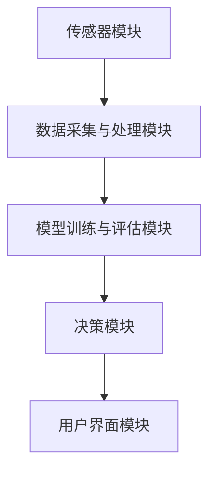
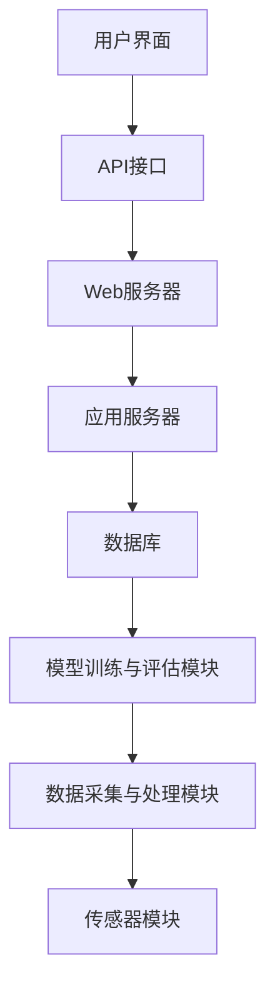
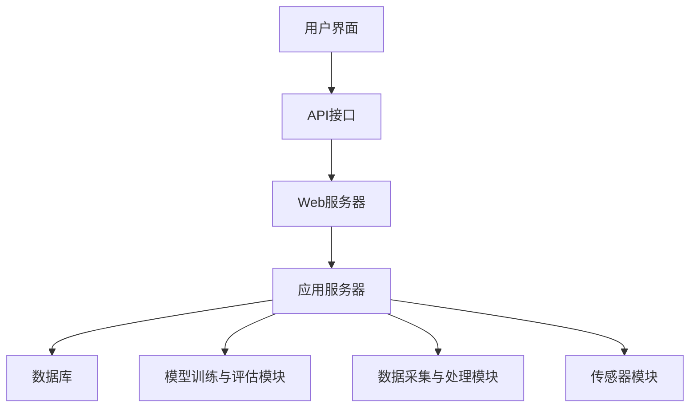
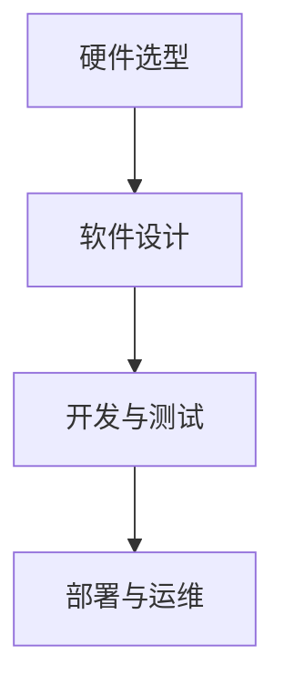
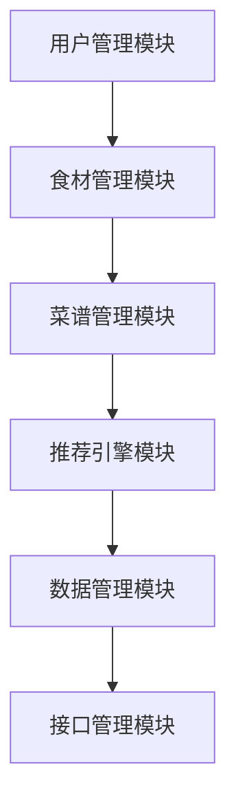

                 

### 智能冰箱：AI Agent的食材新鲜度监测与菜谱推荐

#### 关键词：智能冰箱、AI Agent、食材新鲜度监测、菜谱推荐、深度学习、系统架构

> 摘要：随着智能家居的兴起，智能冰箱作为家庭厨房中的重要设备，正逐渐融入人们的生活。本文将探讨智能冰箱中AI Agent的应用，特别是在食材新鲜度监测和菜谱推荐方面。通过分析AI Agent在智能冰箱中的作用、食材新鲜度监测的原理及其系统架构，以及菜谱推荐系统的算法与实现，本文旨在提供一个全面的技术视角，为智能冰箱的未来发展提供参考。

---

### 第一部分：背景与概述

#### 第1章：智能冰箱的兴起

##### 1.1 智能化家居的崛起

智能化家居作为现代科技的产物，正在改变着人们的日常生活。智能冰箱作为智能化家居的重要组成部分，正逐渐走进千家万户。

###### 1.1.1 家庭自动化的发展历程

家庭自动化的发展可以追溯到20世纪60年代，从最初的遥控家电到今天的智能家居系统，家庭自动化经历了巨大的变革。智能冰箱的出现，标志着家庭自动化进入了一个新的阶段。

###### 1.1.2 智能家居的市场趋势

根据市场研究机构的统计数据，智能家居市场在未来几年将保持高速增长。智能冰箱作为其中的一员，具有巨大的市场潜力。

###### 1.1.3 智能冰箱的必要性

智能冰箱不仅能够保持食材的新鲜度，还能根据食材的库存自动推荐菜谱，大大提高了家庭生活的便利性。因此，智能冰箱成为智能家居市场中的一匹“黑马”。

##### 1.2 智能冰箱的基本概念

智能冰箱是集成了计算机技术、物联网技术、智能控制系统等多种先进技术的现代化冰箱。它不仅具有传统冰箱的存储功能，还能通过AI Agent实现食材新鲜度监测和菜谱推荐等功能。

###### 1.2.1 智能冰箱的定义

智能冰箱是一种具有智能感知、智能决策和智能执行能力的家居设备，能够通过联网实现远程控制和数据交互。

###### 1.2.2 智能冰箱的特点

- **高智能化**：具备智能感知、智能识别和智能决策能力。
- **多功能性**：除了传统的制冷功能，还能实现食材新鲜度监测、智能除菌、智能推荐等功能。
- **互联互通**：能够与其他智能家居设备互联互通，实现家庭自动化控制。

###### 1.2.3 智能冰箱的类型

智能冰箱主要分为以下几种类型：

- **单门智能冰箱**：通常只具备基本的智能功能，如食材新鲜度监测和菜谱推荐。
- **双门智能冰箱**：具备更全面的智能功能，如智能除菌、远程监控等。
- **多门智能冰箱**：功能最为全面，通常具备智能除菌、食材新鲜度监测、远程监控、智能推荐等多种功能。

##### 1.3 AI Agent在智能冰箱中的应用

AI Agent是人工智能的一种应用形式，能够在特定环境下执行特定任务。在智能冰箱中，AI Agent主要应用于食材新鲜度监测和菜谱推荐。

###### 1.3.1 AI Agent的定义与功能

AI Agent是指具有自主决策能力和智能执行能力的计算机程序，能够在特定场景下自动执行任务。

###### 1.3.2 AI Agent在智能冰箱中的角色

AI Agent在智能冰箱中的角色主要包括：

- **食材新鲜度监测**：通过传感器实时监测食材的新鲜度，及时提醒用户更新食材。
- **菜谱推荐**：根据食材库存和用户偏好，自动推荐适合的菜谱，提高烹饪的便利性。

###### 1.3.3 AI Agent的优势与挑战

AI Agent的优势主要体现在以下几个方面：

- **高效性**：能够实时监测食材新鲜度，提高食材利用率。
- **智能化**：能够根据用户偏好自动推荐菜谱，提高烹饪体验。
- **便捷性**：用户无需手动操作，即可享受智能化的生活体验。

然而，AI Agent在智能冰箱中的应用也面临着一些挑战：

- **数据安全**：如何保证用户数据的安全性和隐私性。
- **适应性**：如何使AI Agent能够适应不同用户的需求和偏好。
- **技术成熟度**：如何进一步提高AI Agent的技术成熟度，提高其准确性和可靠性。

#### 第2章：食材新鲜度监测

##### 2.1 食材新鲜度监测的重要性

食材新鲜度监测是智能冰箱的核心功能之一。通过实时监测食材的新鲜度，智能冰箱能够帮助用户更好地管理食材，避免食材浪费。

###### 2.1.1 食材变质的影响

食材变质会导致食品质量下降，严重时甚至可能引发食品安全问题。因此，及时监测食材新鲜度具有重要意义。

###### 2.1.2 食材新鲜度监测的必要性

随着生活水平的提高，人们对食材质量的要求也越来越高。智能冰箱的食材新鲜度监测功能，能够帮助用户更好地管理食材，提高生活质量。

###### 2.1.3 食材新鲜度监测的应用场景

食材新鲜度监测主要应用于以下几个方面：

- **家庭厨房**：智能冰箱能够实时监测食材的新鲜度，提醒用户更新食材，避免食材浪费。
- **餐饮行业**：智能冰箱能够帮助餐饮企业更好地管理食材，提高食材利用率，降低成本。
- **农业领域**：智能冰箱的食材新鲜度监测功能，能够帮助农业生产者更好地管理农作物，提高产量和品质。

##### 2.2 AI Agent在食材新鲜度监测中的应用

AI Agent在食材新鲜度监测中发挥着重要作用。通过传感器采集食材的物理参数，AI Agent能够实时监测食材的新鲜度，并根据监测结果进行相应的处理。

###### 2.2.1 监测原理与技术

AI Agent在食材新鲜度监测中的原理主要包括：

- **传感器技术**：通过传感器实时采集食材的温度、湿度、气味等物理参数。
- **数据采集与处理**：将传感器采集的数据进行预处理，提取有用的信息。
- **模型训练与评估**：利用机器学习算法，训练新鲜度监测模型，并对模型进行评估。

###### 2.2.2 数据采集与处理

数据采集与处理是食材新鲜度监测的核心环节。通过传感器采集的数据主要包括：

- **温度**：食材的存储温度对新鲜度有重要影响。
- **湿度**：湿度过高可能导致食材变质。
- **气味**：气味变化是食材变质的重要信号。

数据采集与处理流程主要包括：

1. **数据采集**：通过传感器实时采集食材的物理参数。
2. **数据预处理**：对采集到的数据去噪、去异常值、归一化等处理。
3. **特征提取**：从预处理后的数据中提取有用的信息，如温度、湿度、气味等。
4. **模型训练**：利用提取的特征，训练新鲜度监测模型。
5. **模型评估**：对训练好的模型进行评估，如准确率、召回率等。

###### 2.2.3 模型训练与评估

模型训练与评估是食材新鲜度监测的关键步骤。通过机器学习算法，训练新鲜度监测模型，并对模型进行评估，以提高监测的准确性和可靠性。

模型训练流程主要包括：

1. **数据集划分**：将数据集划分为训练集、验证集和测试集。
2. **模型选择**：选择适合的机器学习算法，如决策树、支持向量机、神经网络等。
3. **模型训练**：利用训练集训练模型。
4. **模型评估**：利用验证集评估模型的性能，如准确率、召回率等。
5. **模型优化**：根据评估结果，调整模型参数，优化模型性能。

模型评估指标主要包括：

- **准确率**：预测正确的样本数与总样本数的比值。
- **召回率**：预测正确的样本数与实际为正类的样本数的比值。
- **F1值**：综合考虑准确率和召回率的指标。

##### 2.3 食材新鲜度监测系统架构

食材新鲜度监测系统需要具备高效、实时、可靠的特点。系统架构主要包括以下几个模块：

- **传感器模块**：负责采集食材的物理参数，如温度、湿度、气味等。
- **数据采集与处理模块**：对传感器采集的数据进行预处理，提取有用的信息。
- **模型训练与评估模块**：利用机器学习算法，训练新鲜度监测模型，并对模型进行评估。
- **决策模块**：根据模型预测结果，做出相应的决策，如提醒用户更新食材等。
- **用户界面模块**：提供用户交互界面，展示监测结果和推荐信息。

系统架构设计如图所示：

##### 2.3.1 系统总体架构设计

系统总体架构设计如图所示：

##### 2.3.2 各模块功能与交互

各模块功能与交互说明如下：

1. **用户界面模块**：提供用户交互界面，用户可以通过界面查看食材新鲜度监测结果和推荐菜谱。
2. **API接口**：作为各模块之间的桥梁，提供数据传输和功能调用的接口。
3. **Web服务器**：负责处理用户请求，提供Web服务。
4. **应用服务器**：负责处理业务逻辑，如食材新鲜度监测、菜谱推荐等。
5. **数据库**：存储用户数据、食材数据、模型参数等。
6. **模型训练与评估模块**：利用机器学习算法，训练新鲜度监测模型，并对模型进行评估。
7. **数据采集与处理模块**：对传感器采集的数据进行预处理，提取有用的信息。
8. **传感器模块**：实时采集食材的物理参数，如温度、湿度、气味等。

各模块之间的交互流程如图所示：

##### 2.3.3 系统实现与部署

系统实现与部署主要包括以下几个方面：

1. **硬件选型**：选择合适的传感器和硬件设备，如温度传感器、湿度传感器、气味传感器等。
2. **软件设计**：设计系统的软件架构，包括用户界面、API接口、Web服务器、应用服务器等。
3. **开发与测试**：根据软件设计，进行系统的开发与测试，确保系统的功能完整、性能稳定。
4. **部署与运维**：将系统部署到生产环境，进行日常运维，确保系统的正常运行。

系统实现与部署流程如图所示：

#### 第3章：菜谱推荐系统基础

##### 3.1 菜谱推荐系统的概念与原理

菜谱推荐系统是智能冰箱中的重要功能之一，它能够根据食材库存和用户偏好，为用户提供合适的菜谱推荐。菜谱推荐系统的基础概念与原理如下：

###### 3.1.1 菜谱推荐系统的定义

菜谱推荐系统是一种基于用户偏好和食材库存的推荐系统，能够为用户提供适合的菜谱推荐。

###### 3.1.2 菜谱推荐系统的原理

菜谱推荐系统的原理主要包括以下几个方面：

- **用户画像**：根据用户的历史行为和偏好，构建用户画像，为菜谱推荐提供基础数据。
- **食材库存**：监测食材库存情况，为菜谱推荐提供食材信息。
- **推荐算法**：利用推荐算法，根据用户画像和食材库存，为用户提供合适的菜谱推荐。

###### 3.1.3 菜谱推荐系统的分类

菜谱推荐系统主要分为以下几类：

- **基于内容的推荐**：根据菜谱的内容特征，为用户提供相似的菜谱推荐。
- **协同过滤推荐**：根据用户的历史行为和偏好，为用户提供相似的菜谱推荐。
- **混合推荐**：结合基于内容和协同过滤推荐，为用户提供更加精准的菜谱推荐。

##### 3.2 用户画像与偏好分析

用户画像与偏好分析是菜谱推荐系统的基础，它能够帮助系统更好地理解用户需求，提供个性化的菜谱推荐。

###### 3.2.1 用户画像的概念

用户画像是指通过对用户的行为、偏好、兴趣等数据进行综合分析，构建出的用户特征模型。

###### 3.2.2 用户画像的构建方法

用户画像的构建主要包括以下几个步骤：

- **数据采集**：通过用户注册、浏览、购买等行为，收集用户数据。
- **数据清洗**：对采集到的数据进行清洗，去除重复、错误、缺失的数据。
- **特征提取**：从清洗后的数据中提取用户特征，如年龄、性别、地域、兴趣爱好等。
- **模型构建**：利用机器学习算法，构建用户画像模型。

###### 3.2.3 用户偏好分析

用户偏好分析是指通过对用户历史行为和偏好的分析，了解用户的兴趣和需求，为菜谱推荐提供依据。

用户偏好分析的方法主要包括：

- **关联规则挖掘**：通过挖掘用户的历史行为，发现用户之间的关联规则，为菜谱推荐提供参考。
- **聚类分析**：将用户根据其行为和偏好进行分类，为用户提供个性化的菜谱推荐。
- **协同过滤**：通过用户的历史行为和偏好，为用户提供相似的菜谱推荐。

##### 3.3 食材数据库与菜谱数据库

食材数据库与菜谱数据库是菜谱推荐系统的核心数据资源，它们为菜谱推荐提供了丰富的食材信息和菜谱信息。

###### 3.3.1 食材数据库的构建

食材数据库的构建主要包括以下几个方面：

- **食材信息采集**：收集各种食材的基本信息，如名称、种类、用途等。
- **食材属性定义**：定义食材的属性，如营养成分、保质期、储存温度等。
- **数据清洗与预处理**：对采集到的食材信息进行清洗和预处理，去除重复、错误、缺失的数据。
- **数据存储**：将处理后的食材信息存储到数据库中，以便后续查询和使用。

###### 3.3.2 菜谱数据库的构建

菜谱数据库的构建主要包括以下几个方面：

- **菜谱信息采集**：收集各种菜谱的基本信息，如名称、作者、口味、烹饪时间等。
- **菜谱食材定义**：定义菜谱所需的食材，如主料、辅料、调料等。
- **菜谱步骤定义**：定义菜谱的烹饪步骤，如准备食材、烹饪方法、调味等。
- **数据清洗与预处理**：对采集到的菜谱信息进行清洗和预处理，去除重复、错误、缺失的数据。
- **数据存储**：将处理后的菜谱信息存储到数据库中，以便后续查询和使用。

###### 3.3.3 数据质量与数据治理

数据质量是菜谱推荐系统的关键因素，高质量的数据能够提高推荐系统的准确性和效果。数据治理主要包括以下几个方面：

- **数据完整性**：确保数据的完整性，避免数据缺失或重复。
- **数据准确性**：确保数据的准确性，避免错误或误导信息。
- **数据一致性**：确保数据的一致性，避免不同来源的数据相互矛盾。
- **数据安全性**：保护用户数据的安全，避免数据泄露或滥用。
- **数据可追溯性**：确保数据的可追溯性，便于数据的查询和管理。

#### 第4章：菜谱推荐算法

##### 4.1 传统推荐算法

传统推荐算法主要包括基于内容的推荐、协同过滤推荐和混合推荐等，它们在菜谱推荐系统中得到了广泛应用。

###### 4.1.1 协同过滤算法

协同过滤算法是推荐系统中的一种重要算法，它通过分析用户的历史行为和偏好，为用户提供相似的菜谱推荐。

协同过滤算法可以分为两种类型：基于用户的协同过滤和基于项目的协同过滤。

- **基于用户的协同过滤**：通过分析用户之间的相似度，为用户提供相似的菜谱推荐。算法流程如下：

  1. 计算用户之间的相似度，可以使用余弦相似度、皮尔逊相关系数等度量方法。
  2. 根据相似度计算，为用户提供相似的菜谱推荐。

- **基于项目的协同过滤**：通过分析项目之间的相似度，为用户提供相似的菜谱推荐。算法流程如下：

  1. 计算项目之间的相似度，可以使用余弦相似度、Jaccard相似度等度量方法。
  2. 根据相似度计算，为用户提供相似的菜谱推荐。

###### 4.1.2 基于内容的推荐算法

基于内容的推荐算法是通过分析菜谱的内容特征，为用户提供相似的菜谱推荐。算法流程如下：

1. 提取菜谱的内容特征，如食材、烹饪方法、口味等。
2. 计算菜谱之间的内容相似度，可以使用余弦相似度、Jaccard相似度等度量方法。
3. 根据内容相似度，为用户提供相似的菜谱推荐。

###### 4.1.3 混合推荐算法

混合推荐算法是将基于内容的推荐和协同过滤推荐结合起来，以提高推荐系统的准确性和效果。算法流程如下：

1. 计算用户之间的相似度，可以使用余弦相似度、皮尔逊相关系数等度量方法。
2. 提取菜谱的内容特征，如食材、烹饪方法、口味等。
3. 计算菜谱之间的内容相似度，可以使用余弦相似度、Jaccard相似度等度量方法。
4. 根据用户相似度和内容相似度，为用户提供相似的菜谱推荐。

##### 4.2 深度学习在菜谱推荐中的应用

随着深度学习技术的发展，深度学习在菜谱推荐中的应用也取得了显著成果。深度学习算法能够通过自动提取特征，提高推荐系统的准确性和效果。

###### 4.2.1 卷积神经网络（CNN）在菜谱推荐中的应用

卷积神经网络（CNN）在图像处理领域取得了巨大成功，它通过自动提取图像特征，实现了图像分类、目标检测等功能。在菜谱推荐中，CNN可以用于提取菜谱的图像特征，提高推荐系统的准确性和效果。

CNN在菜谱推荐中的应用流程如下：

1. 提取菜谱的图像特征，可以使用卷积层、池化层等网络结构。
2. 利用提取的图像特征，为用户提供菜谱推荐。

###### 4.2.2 递归神经网络（RNN）在菜谱推荐中的应用

递归神经网络（RNN）是一种用于处理序列数据的神经网络，它在自然语言处理、语音识别等领域取得了显著成果。在菜谱推荐中，RNN可以用于处理用户的历史行为和偏好序列，为用户提供个性化的菜谱推荐。

RNN在菜谱推荐中的应用流程如下：

1. 将用户的历史行为和偏好序列输入到RNN中。
2. RNN自动提取序列特征，为用户提供菜谱推荐。

###### 4.2.3 图神经网络（GNN）在菜谱推荐中的应用

图神经网络（GNN）是一种用于处理图数据的神经网络，它在社交网络分析、推荐系统等领域取得了显著成果。在菜谱推荐中，GNN可以用于处理菜谱之间的相似性关系，为用户提供个性化的菜谱推荐。

GNN在菜谱推荐中的应用流程如下：

1. 构建菜谱的图结构，将菜谱作为节点，将相似性关系作为边。
2. 利用GNN自动提取图特征，为用户提供菜谱推荐。

##### 4.3 菜谱推荐系统的优化与评估

菜谱推荐系统的优化与评估是提高系统性能和用户体验的重要环节。优化与评估主要包括以下几个方面：

###### 4.3.1 优化策略

- **特征优化**：对用户画像、食材数据、菜谱数据等进行特征优化，提高推荐系统的准确性和效果。
- **模型优化**：对推荐算法的模型进行优化，提高模型的性能和泛化能力。
- **数据优化**：对推荐系统中的数据进行优化，提高数据的质量和完整性。

###### 4.3.2 评估指标

评估指标主要包括以下几个方面：

- **准确率**：预测正确的样本数与总样本数的比值。
- **召回率**：预测正确的样本数与实际为正类的样本数的比值。
- **F1值**：综合考虑准确率和召回率的指标。
- **平均点击率**：用户点击菜谱的平均次数。
- **用户满意度**：用户对推荐结果的满意度评分。

###### 4.3.3 实验结果分析

通过实验，对推荐系统的性能进行评估和分析。实验结果主要包括以下几个方面：

- **准确率**：在不同数据集上，推荐系统的准确率是否达到预期。
- **召回率**：在不同数据集上，推荐系统的召回率是否达到预期。
- **F1值**：在不同数据集上，推荐系统的F1值是否达到预期。
- **用户点击率**：用户对推荐菜谱的平均点击率是否达到预期。
- **用户满意度**：用户对推荐结果的满意度评分是否达到预期。

通过实验结果分析，可以找出推荐系统的不足之处，并提出相应的优化策略，以提高推荐系统的性能和用户体验。

#### 第5章：智能冰箱菜谱推荐系统实战

##### 5.1 系统需求分析与设计

智能冰箱菜谱推荐系统是一个复杂的系统，需要考虑多方面的需求。在系统设计之前，首先进行需求分析，明确系统的功能、性能、可靠性等需求。

###### 5.1.1 系统需求

智能冰箱菜谱推荐系统的主要需求包括以下几个方面：

- **食材新鲜度监测**：实时监测食材的新鲜度，为用户提供食材更新提醒。
- **菜谱推荐**：根据食材库存和用户偏好，为用户提供合适的菜谱推荐。
- **用户管理**：管理用户信息，包括注册、登录、个人信息等。
- **数据管理**：管理食材数据、菜谱数据、用户数据等，确保数据的安全性和完整性。
- **接口管理**：提供API接口，供其他系统调用。

###### 5.1.2 系统架构设计

智能冰箱菜谱推荐系统的架构设计如图所示：

系统架构设计的主要模块包括：

1. **用户管理模块**：负责用户注册、登录、个人信息管理等。
2. **食材管理模块**：负责食材信息的采集、存储、更新等。
3. **菜谱管理模块**：负责菜谱信息的采集、存储、更新等。
4. **推荐引擎模块**：负责菜谱推荐，根据用户画像和食材库存，为用户提供合适的菜谱推荐。
5. **数据管理模块**：负责数据的管理、存储、备份等。
6. **接口管理模块**：负责API接口的管理，供其他系统调用。

###### 5.1.3 系统接口设计

智能冰箱菜谱推荐系统的接口设计主要包括以下几个方面：

- **用户接口**：提供用户注册、登录、个人信息管理等接口。
- **食材接口**：提供食材信息的查询、更新等接口。
- **菜谱接口**：提供菜谱信息的查询、更新等接口。
- **推荐接口**：提供菜谱推荐接口，根据用户画像和食材库存，为用户提供合适的菜谱推荐。
- **数据接口**：提供数据的查询、更新等接口。

接口设计的主要目的是实现各模块之间的数据交互和功能调用，确保系统的稳定性和灵活性。

##### 5.2 数据采集与处理

智能冰箱菜谱推荐系统的数据采集与处理是系统实现的关键环节。通过采集用户行为数据、食材数据和菜谱数据，对数据进行处理和整合，为菜谱推荐提供基础数据。

###### 5.2.1 食材数据采集

食材数据采集主要包括以下几个方面：

- **食材信息采集**：采集食材的基本信息，如名称、种类、用途等。
- **食材属性采集**：采集食材的属性信息，如营养成分、保质期、储存温度等。
- **食材图片采集**：采集食材的图片，用于菜谱展示和识别。

食材数据采集可以通过以下方式进行：

- **手动输入**：用户手动输入食材信息，包括名称、种类、用途、属性等。
- **传感器采集**：通过传感器采集食材的物理参数，如温度、湿度、气味等。
- **网络爬虫**：通过网络爬虫技术，从互联网上采集食材信息。

###### 5.2.2 菜谱数据采集

菜谱数据采集主要包括以下几个方面：

- **菜谱信息采集**：采集菜谱的基本信息，如名称、作者、口味、烹饪时间等。
- **菜谱食材采集**：采集菜谱所需的食材信息，包括主料、辅料、调料等。
- **菜谱步骤采集**：采集菜谱的烹饪步骤，包括准备食材、烹饪方法、调味等。

菜谱数据采集可以通过以下方式进行：

- **手动输入**：用户手动输入菜谱信息，包括名称、作者、口味、烹饪时间、食材、步骤等。
- **网络爬虫**：通过网络爬虫技术，从互联网上采集菜谱信息。
- **第三方平台**：从第三方平台获取菜谱数据，如美食网站、菜谱应用程序等。

###### 5.2.3 数据预处理

数据预处理是数据采集后的重要环节，它包括数据清洗、去噪、归一化等处理。通过对数据进行预处理，提高数据的准确性和可靠性，为后续的菜谱推荐提供基础数据。

数据预处理的主要步骤包括：

1. **数据清洗**：去除重复、错误、缺失的数据，确保数据的质量。
2. **去噪**：去除数据中的噪声，提高数据的准确性。
3. **归一化**：将数据统一转换为相同的量纲，便于后续的运算和处理。
4. **特征提取**：从预处理后的数据中提取有用的信息，如食材名称、属性、菜谱名称、步骤等。

数据预处理的方法主要包括：

- **过滤法**：去除重复、错误、缺失的数据。
- **填补法**：用合适的值填补缺失的数据。
- **平滑法**：去除数据中的噪声，如移动平均、中值滤波等。
- **归一化**：将数据统一转换为相同的量纲，如归一化、标准化等。
- **特征提取**：从预处理后的数据中提取有用的信息，如食材名称、属性、菜谱名称、步骤等。

##### 5.3 模型训练与部署

智能冰箱菜谱推荐系统的核心是推荐算法，通过对用户行为数据、食材数据和菜谱数据的训练，构建推荐模型，为用户提供个性化的菜谱推荐。

###### 5.3.1 模型选择与训练

模型选择与训练是推荐系统的关键环节。根据菜谱推荐的特点，可以选择以下类型的模型：

- **基于内容的推荐模型**：通过分析菜谱的内容特征，为用户提供相似的菜谱推荐。
- **协同过滤推荐模型**：通过分析用户的历史行为和偏好，为用户提供相似的菜谱推荐。
- **混合推荐模型**：结合基于内容和协同过滤推荐，为用户提供更加精准的菜谱推荐。

模型训练的步骤包括：

1. **数据集划分**：将数据集划分为训练集、验证集和测试集，用于模型的训练、验证和测试。
2. **特征工程**：对用户行为数据、食材数据和菜谱数据进行特征提取和工程，为模型训练提供输入。
3. **模型训练**：选择合适的模型，利用训练集数据进行训练，调整模型参数，优化模型性能。
4. **模型验证**：利用验证集数据对模型进行验证，评估模型的性能，如准确率、召回率、F1值等。
5. **模型测试**：利用测试集数据对模型进行测试，评估模型的泛化能力和性能。

常见的推荐模型包括：

- **基于矩阵分解的协同过滤模型**：通过矩阵分解技术，将用户行为数据和菜谱数据进行分解，构建推荐模型。
- **基于深度学习的推荐模型**：利用深度学习技术，自动提取用户行为数据和菜谱数据的特征，构建推荐模型。
- **基于图的推荐模型**：利用图神经网络（GNN）技术，分析用户行为数据和菜谱数据之间的相似性关系，构建推荐模型。

###### 5.3.2 模型评估与优化

模型评估与优化是提高推荐系统性能的重要环节。通过对模型进行评估和优化，可以找出模型的不足之处，并采取相应的优化策略。

模型评估的指标包括：

- **准确率**：预测正确的样本数与总样本数的比值。
- **召回率**：预测正确的样本数与实际为正类的样本数的比值。
- **F1值**：综合考虑准确率和召回率的指标。
- **平均点击率**：用户点击菜谱的平均次数。
- **用户满意度**：用户对推荐结果的满意度评分。

模型优化的策略包括：

- **特征优化**：对用户行为数据、食材数据和菜谱数据进行特征优化，提高推荐模型的准确性和效果。
- **模型优化**：选择合适的模型结构，调整模型参数，优化模型性能。
- **数据优化**：对用户行为数据、食材数据和菜谱数据进行优化，提高数据的质量和完整性。
- **算法优化**：选择合适的推荐算法，提高推荐系统的准确性和效果。

##### 5.4 系统实现与测试

智能冰箱菜谱推荐系统的实现与测试是系统开发的关键环节。通过系统实现和测试，可以验证系统的功能、性能和可靠性，确保系统的正常运行。

###### 5.4.1 系统实现

智能冰箱菜谱推荐系统的实现主要包括以下几个方面：

1. **前端开发**：使用HTML、CSS、JavaScript等技术，实现用户界面和交互功能。
2. **后端开发**：使用Python、Java、Node.js等编程语言，实现后端业务逻辑和API接口。
3. **数据库设计**：使用MySQL、MongoDB等数据库，设计数据表和存储结构。
4. **推荐算法实现**：选择合适的推荐算法，实现推荐模型的训练和预测功能。

系统实现的步骤包括：

1. **需求分析**：明确系统的功能和性能要求，制定系统实现计划。
2. **技术选型**：选择合适的前端技术、后端技术和数据库技术，确保系统的性能和稳定性。
3. **系统设计**：设计系统的架构和模块，明确各模块的功能和接口。
4. **代码实现**：编写系统的代码，实现各个模块的功能。
5. **单元测试**：对系统的各个模块进行单元测试，确保模块功能的正确性。
6. **集成测试**：对系统的各个模块进行集成测试，确保系统的整体功能正确性。
7. **系统部署**：将系统部署到生产环境，进行日常运维和监控。

###### 5.4.2 系统测试

智能冰箱菜谱推荐系统的测试是验证系统功能、性能和可靠性的重要环节。系统测试主要包括以下几个方面：

1. **功能测试**：验证系统的功能是否符合需求，包括用户管理、食材管理、菜谱管理、推荐引擎等。
2. **性能测试**：验证系统的性能指标，包括响应时间、并发处理能力、系统负载等。
3. **安全测试**：验证系统的安全性，包括数据安全、接口安全、用户认证等。
4. **兼容性测试**：验证系统在不同浏览器、操作系统、设备上的兼容性。
5. **用户测试**：邀请真实用户使用系统，收集用户反馈和意见，优化系统的用户体验。

系统测试的步骤包括：

1. **测试计划**：制定系统测试计划，明确测试目标、测试方法、测试环境等。
2. **测试环境搭建**：搭建测试环境，包括硬件设备、网络环境、测试工具等。
3. **测试用例设计**：设计测试用例，包括功能测试用例、性能测试用例、安全测试用例等。
4. **测试执行**：执行测试用例，记录测试结果，分析测试数据。
5. **问题反馈与修复**：发现系统问题，反馈给开发人员，进行问题修复和回归测试。
6. **测试总结**：总结系统测试的结果，提出优化建议和改进措施。

##### 5.5 用户反馈与改进

智能冰箱菜谱推荐系统的用户体验对系统的成功至关重要。通过收集用户反馈，可以不断优化系统，提高用户满意度。

用户反馈与改进主要包括以下几个方面：

1. **用户调研**：通过问卷调查、用户访谈等方式，收集用户对系统的意见和建议。
2. **数据分析**：对用户行为数据进行分析，了解用户的使用习惯和需求。
3. **功能优化**：根据用户反馈和数据分析结果，对系统功能进行优化和改进。
4. **界面优化**：优化用户界面，提高用户体验，包括界面布局、交互设计等。
5. **性能优化**：提高系统的性能和稳定性，包括优化代码、优化数据库等。
6. **持续迭代**：持续收集用户反馈，不断优化系统，提高用户满意度。

#### 第6章：智能冰箱菜谱推荐系统案例分析

##### 6.1 案例背景介绍

智能冰箱菜谱推荐系统在多个企业得到了成功应用，下面以某知名家电企业的案例为例，介绍智能冰箱菜谱推荐系统的实现和应用。

###### 6.1.1 案例企业介绍

某知名家电企业是一家专业从事智能家居设备研发和生产的公司，其产品线包括智能冰箱、智能空调、智能洗衣机等。

###### 6.1.2 案例项目介绍

智能冰箱菜谱推荐系统是该企业的一款创新产品，旨在通过智能冰箱为用户提供便捷的菜谱推荐服务。系统主要功能包括食材新鲜度监测、菜谱推荐、用户管理、数据管理等。

###### 6.1.3 案例目标与挑战

案例项目的目标是：

1. 提高用户对智能冰箱的满意度和黏性。
2. 降低用户在食材管理和烹饪方面的困扰。
3. 提高食材利用率，减少食材浪费。

项目面临的挑战包括：

1. 数据质量和数据完整性问题。
2. 推荐算法的准确性和效果问题。
3. 系统的性能和稳定性问题。

##### 6.2 系统设计与实现

智能冰箱菜谱推荐系统的设计主要分为以下几个方面：

###### 6.2.1 系统架构设计

系统架构设计如图所示：

系统架构设计的主要模块包括：

1. **用户管理模块**：负责用户注册、登录、个人信息管理等。
2. **食材管理模块**：负责食材信息的采集、存储、更新等。
3. **菜谱管理模块**：负责菜谱信息的采集、存储、更新等。
4. **推荐引擎模块**：负责菜谱推荐，根据用户画像和食材库存，为用户提供合适的菜谱推荐。
5. **数据管理模块**：负责数据的管理、存储、备份等。
6. **接口管理模块**：负责API接口的管理，供其他系统调用。

###### 6.2.2 食材数据采集与处理

食材数据采集与处理主要包括以下几个方面：

1. **食材信息采集**：通过传感器采集食材的基本信息，如名称、种类、用途等。
2. **食材属性采集**：通过传感器采集食材的属性信息，如营养成分、保质期、储存温度等。
3. **数据预处理**：对采集到的食材信息进行预处理，包括数据清洗、去噪、归一化等处理。

数据预处理的方法主要包括：

- **过滤法**：去除重复、错误、缺失的数据。
- **填补法**：用合适的值填补缺失的数据。
- **平滑法**：去除数据中的噪声，如移动平均、中值滤波等。
- **归一化**：将数据统一转换为相同的量纲，如归一化、标准化等。

预处理后的食材数据存储在数据库中，以便后续查询和使用。

###### 6.2.3 菜谱数据采集与处理

菜谱数据采集与处理主要包括以下几个方面：

1. **菜谱信息采集**：通过用户手动输入和第三方平台获取菜谱的基本信息，如名称、作者、口味、烹饪时间等。
2. **菜谱食材采集**：通过用户手动输入和第三方平台获取菜谱所需的食材信息，包括主料、辅料、调料等。
3. **菜谱步骤采集**：通过用户手动输入和第三方平台获取菜谱的烹饪步骤，包括准备食材、烹饪方法、调味等。

菜谱数据采集与处理的方法与食材数据采集与处理类似，包括数据清洗、去噪、归一化等预处理操作。

预处理后的菜谱数据存储在数据库中，以便后续查询和使用。

###### 6.2.4 用户画像与偏好分析

用户画像与偏好分析是菜谱推荐系统的核心功能之一。通过分析用户的历史行为和偏好，构建用户画像，为菜谱推荐提供依据。

用户画像的构建主要包括以下几个方面：

1. **用户基本信息**：包括用户年龄、性别、地域、职业等基本信息。
2. **用户行为数据**：包括用户浏览、收藏、购买等行为数据。
3. **用户偏好数据**：包括用户对食材、口味、烹饪方式等的偏好数据。

用户画像的构建方法主要包括：

- **关联规则挖掘**：通过挖掘用户的历史行为，发现用户之间的关联规则，为用户画像提供依据。
- **聚类分析**：将用户根据其行为和偏好进行分类，为用户提供个性化的菜谱推荐。
- **协同过滤**：通过用户的历史行为和偏好，为用户提供相似的菜谱推荐。

用户偏好分析的方法主要包括：

- **基于内容的推荐**：根据菜谱的内容特征，为用户提供相似的菜谱推荐。
- **协同过滤推荐**：根据用户的历史行为和偏好，为用户提供相似的菜谱推荐。
- **混合推荐**：结合基于内容和协同过滤推荐，为用户提供更加精准的菜谱推荐。

##### 6.3 模型训练与评估

智能冰箱菜谱推荐系统的核心是推荐算法，通过对用户行为数据、食材数据和菜谱数据的训练，构建推荐模型，为用户提供个性化的菜谱推荐。

模型训练与评估主要包括以下几个方面：

###### 6.3.1 模型选择与训练

模型选择与训练是推荐系统的关键环节。根据菜谱推荐的特点，可以选择以下类型的模型：

- **基于矩阵分解的协同过滤模型**：通过矩阵分解技术，将用户行为数据和菜谱数据进行分解，构建推荐模型。
- **基于深度学习的推荐模型**：利用深度学习技术，自动提取用户行为数据和菜谱数据的特征，构建推荐模型。
- **基于图的推荐模型**：利用图神经网络（GNN）技术，分析用户行为数据和菜谱数据之间的相似性关系，构建推荐模型。

模型训练的步骤包括：

1. **数据集划分**：将数据集划分为训练集、验证集和测试集，用于模型的训练、验证和测试。
2. **特征工程**：对用户行为数据、食材数据和菜谱数据进行特征提取和工程，为模型训练提供输入。
3. **模型训练**：选择合适的模型，利用训练集数据进行训练，调整模型参数，优化模型性能。
4. **模型验证**：利用验证集数据对模型进行验证，评估模型的性能，如准确率、召回率、F1值等。
5. **模型测试**：利用测试集数据对模型进行测试，评估模型的泛化能力和性能。

常见的推荐模型包括：

- **基于矩阵分解的协同过滤模型**：通过矩阵分解技术，将用户行为数据和菜谱数据进行分解，构建推荐模型。
- **基于深度学习的推荐模型**：利用深度学习技术，自动提取用户行为数据和菜谱数据的特征，构建推荐模型。
- **基于图的推荐模型**：利用图神经网络（GNN）技术，分析用户行为数据和菜谱数据之间的相似性关系，构建推荐模型。

###### 6.3.2 模型评估与优化

模型评估与优化是提高推荐系统性能的重要环节。通过对模型进行评估和优化，可以找出模型的不足之处，并采取相应的优化策略。

模型评估的指标包括：

- **准确率**：预测正确的样本数与总样本数的比值。
- **召回率**：预测正确的样本数与实际为正类的样本数的比值。
- **F1值**：综合考虑准确率和召回率的指标。
- **平均点击率**：用户点击菜谱的平均次数。
- **用户满意度**：用户对推荐结果的满意度评分。

模型优化的策略包括：

- **特征优化**：对用户行为数据、食材数据和菜谱数据进行特征优化，提高推荐模型的准确性和效果。
- **模型优化**：选择合适的模型结构，调整模型参数，优化模型性能。
- **数据优化**：对用户行为数据、食材数据和菜谱数据进行优化，提高数据的质量和完整性。
- **算法优化**：选择合适的推荐算法，提高推荐系统的准确性和效果。

##### 6.4 案例分析与总结

智能冰箱菜谱推荐系统在某知名家电企业的成功应用，为用户提供了一种便捷的食材管理和菜谱推荐服务。通过对用户行为数据、食材数据和菜谱数据的分析，系统为用户提供了个性化的菜谱推荐，提高了用户满意度。

案例的成功之处主要体现在以下几个方面：

1. **精准的推荐算法**：系统采用基于深度学习的推荐算法，能够自动提取用户行为数据和菜谱数据的特征，提高了推荐的准确性。
2. **丰富的数据资源**：系统整合了用户行为数据、食材数据和菜谱数据，为菜谱推荐提供了丰富的数据支持。
3. **优化的用户体验**：系统提供了简洁、直观的用户界面，方便用户查看菜谱推荐和食材信息。

然而，案例也存在一些不足之处：

1. **数据质量和完整性问题**：由于用户行为数据、食材数据和菜谱数据的采集过程复杂，系统在数据质量和完整性方面存在一定问题，需要进一步优化。
2. **系统的性能和稳定性问题**：随着用户量的增加，系统在性能和稳定性方面面临一定挑战，需要进一步优化和升级。

总之，智能冰箱菜谱推荐系统的成功应用，为智能家居领域的发展提供了有益的探索。未来，随着技术的不断进步和数据资源的不断丰富，智能冰箱菜谱推荐系统有望实现更精准、更高效的推荐，为用户提供更好的食材管理和烹饪体验。

#### 第7章：智能冰箱菜谱推荐系统未来展望

随着人工智能和物联网技术的不断发展，智能冰箱菜谱推荐系统在未来的发展前景广阔。以下是智能冰箱菜谱推荐系统的未来展望：

##### 7.1 技术发展趋势

智能冰箱菜谱推荐系统的未来发展将受到以下技术的驱动：

1. **深度学习**：深度学习技术的不断发展，将使得菜谱推荐系统更加精准、智能化。通过卷积神经网络（CNN）、递归神经网络（RNN）和图神经网络（GNN）等技术，可以更好地提取用户行为数据和菜谱数据的特征，提高推荐的准确性和效果。

2. **大数据分析**：大数据分析技术的应用，将使得菜谱推荐系统能够更好地处理和分析大量的用户数据、食材数据和菜谱数据。通过数据挖掘和机器学习算法，可以更准确地了解用户需求，提供个性化的菜谱推荐。

3. **物联网技术**：物联网技术的普及，将使得智能冰箱与各种传感器和设备互联互通，实现更全面、更精准的食材监测和推荐。通过与智能厨具、智能食材管理系统等设备的集成，可以提供更加智能化的烹饪体验。

##### 7.2 智能冰箱市场前景

智能冰箱市场在未来几年将保持高速增长，主要表现在以下几个方面：

1. **市场规模扩大**：随着智能家居市场的不断扩大，智能冰箱的市场规模也将持续增长。根据市场研究机构的预测，未来几年智能冰箱市场的复合年增长率将保持在10%以上。

2. **消费需求增加**：随着生活水平的提高，人们对食材质量和烹饪体验的要求也越来越高。智能冰箱的菜谱推荐功能，将更好地满足消费者的需求，提高消费者的生活质量。

3. **技术创新驱动**：随着深度学习、大数据分析、物联网等技术的不断进步，智能冰箱的功能将更加丰富，用户体验将得到进一步提升，从而推动智能冰箱市场的快速发展。

##### 7.3 菜谱推荐系统

智能冰箱菜谱推荐系统在未来的发展将呈现以下趋势：

1. **个性化推荐**：通过深度学习技术，对用户行为数据和菜谱数据进行深入分析，提供更加个性化的菜谱推荐。不仅考虑食材的新鲜度和库存，还将考虑用户的口味偏好、烹饪习惯等因素。

2. **智能化交互**：通过与自然语言处理技术的结合，实现用户与智能冰箱的智能交互。用户可以通过语音、手势等方式与智能冰箱进行互动，获得更加便捷的菜谱推荐。

3. **跨平台集成**：将智能冰箱菜谱推荐系统与手机、平板电脑等移动设备集成，实现跨平台的使用体验。用户可以通过手机或平板电脑查看菜谱推荐，进行食材采购和烹饪指导。

4. **多元化场景**：除了家庭厨房场景，智能冰箱菜谱推荐系统还可以应用于餐饮行业、农业领域等。通过与餐饮企业、农业生产者的合作，提供定制化的菜谱推荐和食材管理服务。

总之，智能冰箱菜谱推荐系统在未来将不断演进，为用户提供更加智能、便捷的食材管理和烹饪体验。随着技术的不断进步和市场需求的不断变化，智能冰箱菜谱推荐系统将在智能家居领域发挥更加重要的作用。

