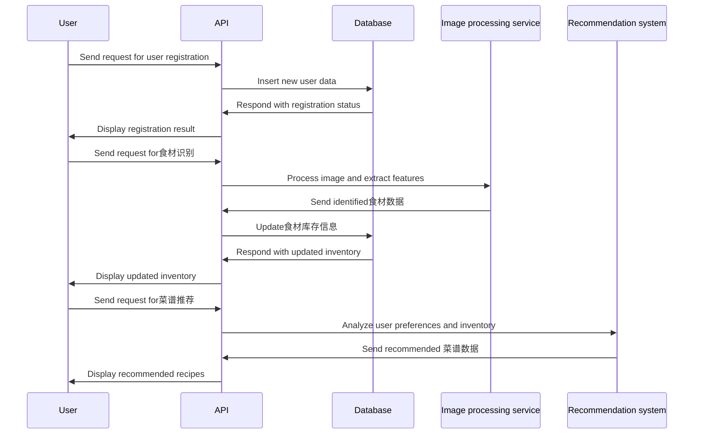
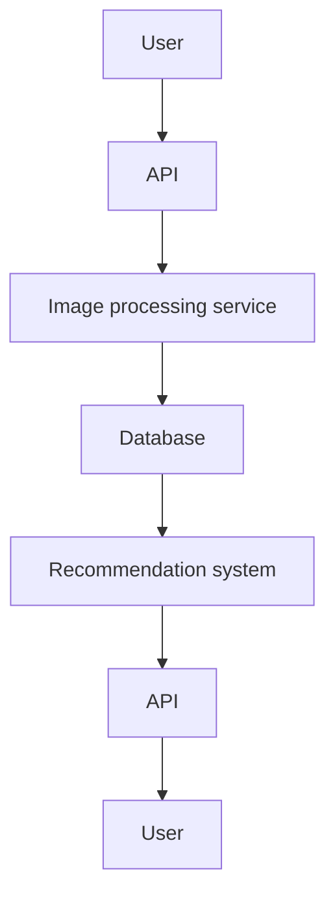
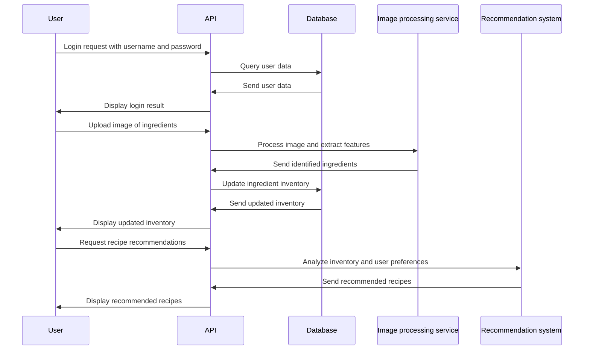

                 

### 智能冰箱：AI Agent的食材管理与菜谱推荐

**关键词：** 智能冰箱、AI Agent、食材管理、菜谱推荐、算法原理、系统架构

**摘要：** 本文将深入探讨智能冰箱中AI Agent在食材管理与菜谱推荐方面的应用。通过分析智能冰箱的发展历史、AI Agent的定义与功能，以及两者融合带来的前景，我们逐步解析食材管理与菜谱推荐的核心概念，并详细讲解其背后的算法原理。接着，我们将展示一个完整的系统分析与架构设计，最后通过项目实战实例，对系统核心实现和代码应用进行解读。本文旨在为读者提供一个全面、深入的智能冰箱技术解析，以启发未来的研究方向。

### 目录大纲

1. **背景介绍**
    1.1 **智能冰箱与AI Agent概述**
        1.1.1 **智能冰箱的发展历史与现状**
        1.1.2 **AI Agent的定义及其应用**
        1.1.3 **智能冰箱与AI Agent的融合应用前景**
    1.2 **核心概念与联系**
        1.2.1 **食材管理与菜谱推荐的核心概念**
            1.2.1.1 **食材管理的概念与重要性**
            1.2.1.2 **菜谱推荐的概念与影响因素**
        1.2.2 **AI Agent在食材管理与菜谱推荐中的应用**
            1.2.2.1 **AI Agent的功能结构与实现**
            1.2.2.2 **AI Agent在食材管理与菜谱推荐中的应用场景**

2. **算法原理讲解**
    2.1 **食材管理算法原理**
        2.1.1 **食材识别算法原理**
            2.1.1.1 **感知层算法原理**
            2.1.1.2 **特征提取与分类算法原理**
        2.1.2 **食材存储与保质算法原理**
            2.1.2.1 **存储条件优化算法原理**
            2.1.2.2 **保质预测算法原理**
    2.2 **菜谱推荐算法原理**
        2.2.1 **菜谱生成算法原理**
            2.2.1.1 **基于食材的菜谱生成算法原理**
            2.2.1.2 **基于用户偏好的菜谱生成算法原理**
        2.2.2 **菜谱推荐算法原理**
            2.2.2.1 **协同过滤算法原理**
            2.2.2.2 **内容推荐算法原理**

3. **系统分析与架构设计**
    3.1 **系统功能设计**
        3.1.1 **系统功能需求分析**
        3.1.2 **领域模型设计**
        3.1.3 **系统功能实现**
    3.2 **系统架构设计**
        3.2.1 **系统架构设计原则**
        3.2.2 **系统架构图解析**
        3.2.3 **系统接口设计**
    3.3 **系统交互设计**
        3.3.1 **系统交互流程设计**
        3.3.2 **系统交互序列图**

4. **项目实战**
    4.1 **项目环境安装**
        4.1.1 **环境准备**
        4.1.2 **软件与硬件配置**
    4.2 **系统核心实现**
        4.2.1 **食材管理模块实现**
        4.2.2 **菜谱推荐模块实现**
        4.2.3 **AI Agent整体架构实现**
    4.3 **代码应用解读与分析**
        4.3.1 **代码架构解析**
        4.3.2 **关键算法分析**
        4.3.3 **项目实际案例分析与讲解**
    4.4 **项目小结**
        4.4.1 **项目总结**
        4.4.2 **遇到的问题与解决方案**
        4.4.3 **拓展阅读与未来研究方向**

### 第一部分：背景介绍

#### 第1章：智能冰箱与AI Agent概述

智能冰箱，作为家庭电器的一种，正在逐步从传统冰箱向智能化、自动化方向转变。其核心在于利用人工智能（AI）技术，实现对冰箱内食材的智能管理。而AI Agent，作为人工智能领域的一种重要概念，为智能冰箱提供了智能决策的执行者。

##### 1.1.1 智能冰箱的发展历史与现状

智能冰箱的发展历程可以追溯到20世纪90年代，当时一些高端冰箱开始配备简单的智能功能，如温度自动调节等。随着AI技术的进步，现代智能冰箱已经能够实现更高级的功能，如智能识别食材、自动生成菜谱、智能购买食材等。

当前，智能冰箱市场正在迅速扩大。根据市场研究公司的数据，全球智能冰箱的销量正在逐年增长，预计在未来几年内将继续保持这一趋势。这一市场增长得益于智能家居概念的普及和人们对高效生活方式的需求。

##### 1.1.2 AI Agent的定义及其应用

AI Agent，即人工智能代理，是一种能够自主行动并解决特定问题的计算机程序。在智能冰箱的背景下，AI Agent可以被视为冰箱的“大脑”，负责处理食材信息、生成菜谱、优化存储条件等。

AI Agent的应用范围广泛，除了智能冰箱，还广泛应用于智能助手、自动驾驶汽车、智能城市等领域。其核心在于利用机器学习、自然语言处理、计算机视觉等技术，实现自主决策和行动。

##### 1.1.3 智能冰箱与AI Agent的融合应用前景

智能冰箱与AI Agent的融合，为家庭生活带来了极大的便利。例如，AI Agent可以实时监控冰箱内的食材库存，当食材即将过期时，自动生成购物清单，提醒用户购买新的食材。同时，AI Agent还可以根据用户的饮食习惯和偏好，推荐适合的菜谱，甚至帮助用户完成烹饪过程。

在未来，随着AI技术的进一步发展，智能冰箱与AI Agent的融合将更加紧密，实现更加智能化、个性化、高效化的家庭生活。

#### 第2章：核心概念与联系

##### 2.1 食材管理与菜谱推荐的核心概念

食材管理，是指对冰箱内食材进行有效的识别、存储、保质等操作。其主要目标是实现食材的高效利用，减少浪费，延长食材的保质期。

菜谱推荐，是指根据用户的口味、饮食偏好、食材库存等条件，为用户推荐合适的菜谱。其核心在于解决“吃什么”的问题，提高用户的饮食质量。

##### 2.1.1 食材管理的概念与重要性

食材管理，是对冰箱内食材进行有效管理的必要手段。其主要内容包括：

- 食材的识别：通过图像识别等技术，准确识别冰箱内的食材种类和数量。
- 食材的存储：根据食材的特性，将其存放在合适的温度和湿度环境中，以延长保质期。
- 食材的保质：通过实时监控食材的状态，预测其保质期，提醒用户及时处理或购买新的食材。

食材管理的重要性在于：

- 减少浪费：通过有效管理食材，减少因食材过期或变质而造成的浪费。
- 提高生活质量：通过合理的食材搭配和烹饪，提高用户的饮食质量，促进身体健康。
- 提高烹饪效率：通过智能生成菜谱，简化烹饪过程，节省用户的时间和精力。

##### 2.1.2 菜谱推荐的概念与影响因素

菜谱推荐，是指根据用户的口味、饮食偏好、食材库存等条件，为用户推荐合适的菜谱。其主要内容包括：

- 菜谱的生成：根据用户的食材库存和饮食偏好，生成符合用户需求的菜谱。
- 菜谱的推荐：将生成的菜谱推荐给用户，使用户能够快速找到适合自己的烹饪方案。

菜谱推荐的影响因素主要包括：

- 食材库存：菜谱的生成和推荐需要考虑冰箱内现有的食材种类和数量。
- 用户偏好：菜谱的生成和推荐需要考虑用户的口味、饮食偏好和饮食习惯。
- 烹饪时间：菜谱的生成和推荐需要考虑用户的烹饪时间和烹饪习惯。

##### 2.2 AI Agent在食材管理与菜谱推荐中的应用

AI Agent在食材管理与菜谱推荐中的应用，主要体现在以下几个方面：

- 食材识别：通过计算机视觉技术，AI Agent可以准确识别冰箱内的食材种类和数量，为食材管理提供基础数据。
- 存储与保质：通过机器学习算法，AI Agent可以预测食材的保质期，提醒用户及时处理或购买新的食材，实现高效的食材管理。
- 菜谱生成：通过自然语言处理和协同过滤算法，AI Agent可以生成符合用户需求的菜谱，提高用户的烹饪效率。
- 菜谱推荐：通过用户行为分析和协同过滤算法，AI Agent可以推荐符合用户口味的菜谱，提高用户的饮食质量。

总之，AI Agent在食材管理与菜谱推荐中的应用，为智能冰箱带来了智能化、个性化、高效化的新体验，为用户的家庭生活提供了极大的便利。

#### 第3章：食材管理算法原理

食材管理算法，是实现智能冰箱中食材有效管理的核心技术。其主要分为食材识别算法和食材存储与保质算法两部分。

##### 3.1 食材识别算法原理

食材识别算法，是指通过图像识别技术，对冰箱内的食材进行分类和数量识别。其原理可以分为感知层算法和特征提取与分类算法两部分。

###### 3.1.1 感知层算法原理

感知层算法，是指对图像进行预处理和特征提取。其主要步骤包括：

1. 图像预处理：通过对图像进行缩放、旋转、裁剪等操作，使其达到统一的尺寸和方向。
2. 图像增强：通过对图像进行对比度、亮度等调整，使其更清晰，便于后续的特征提取。
3. 特征提取：通过卷积神经网络（CNN）等深度学习模型，从图像中提取出具有区分性的特征，如纹理、形状、颜色等。

感知层算法的核心在于如何从原始图像中提取出有效特征，以便后续的特征提取与分类算法。

###### 3.1.2 特征提取与分类算法原理

特征提取与分类算法，是指通过对提取出的特征进行分类，以实现对食材的识别。其主要步骤包括：

1. 特征降维：通过主成分分析（PCA）等降维算法，将高维特征降到低维，以减少计算复杂度。
2. 特征选择：通过特征选择算法，如信息增益、卡方检验等，筛选出对食材识别最有用的特征。
3. 分类算法：通过支持向量机（SVM）、决策树、神经网络等分类算法，对食材进行分类。

特征提取与分类算法的核心在于如何从提取出的特征中，找到一个最优的分类模型，以实现高精度的食材识别。

##### 3.2 食材存储与保质算法原理

食材存储与保质算法，是指通过机器学习算法，对食材的存储条件和保质期进行优化。其原理可以分为存储条件优化算法和保质预测算法两部分。

###### 3.2.1 存储条件优化算法原理

存储条件优化算法，是指通过优化冰箱的温度、湿度等环境条件，以提高食材的保质期。其主要步骤包括：

1. 数据采集：通过传感器技术，实时采集冰箱内的温度、湿度等环境数据。
2. 数据预处理：对采集到的数据进行分析和处理，去除噪声和异常值，以便后续的模型训练。
3. 存储条件优化：通过机器学习算法，如线性回归、决策树等，建立存储条件与食材保质期的模型，以预测最佳存储条件。

存储条件优化算法的核心在于如何从历史数据中，找到一个最佳的存储条件，以延长食材的保质期。

###### 3.2.2 保质预测算法原理

保质预测算法，是指通过机器学习算法，预测食材的保质期。其主要步骤包括：

1. 数据采集：通过传感器技术，实时采集食材的变质信号，如颜色变化、气味变化等。
2. 数据预处理：对采集到的数据进行分析和处理，去除噪声和异常值，以便后续的模型训练。
3. 保质预测：通过机器学习算法，如时间序列分析、神经网络等，建立变质信号与保质期的模型，以预测食材的保质期。

保质预测算法的核心在于如何从变质信号中，提取出对保质期有重要影响的特征，以实现高精度的保质预测。

通过以上对食材管理算法原理的详细讲解，我们可以看到，智能冰箱的食材管理不仅需要先进的图像识别技术，还需要复杂的机器学习算法。这些技术的结合，使得智能冰箱能够实现高效的食材管理，为用户的家庭生活提供更多便利。

#### 第4章：菜谱推荐算法原理

菜谱推荐算法，是智能冰箱中另一项核心功能，旨在根据用户的口味、饮食偏好和冰箱内食材库存，为用户推荐合适的菜谱。菜谱推荐算法主要分为菜谱生成算法和菜谱推荐算法两部分。

##### 4.1 菜谱生成算法原理

菜谱生成算法，是指根据用户的饮食偏好和冰箱内的食材库存，生成符合用户需求的菜谱。菜谱生成算法可以分为基于食材的菜谱生成算法和基于用户偏好的菜谱生成算法。

###### 4.1.1 基于食材的菜谱生成算法原理

基于食材的菜谱生成算法，主要基于食材的种类、数量和营养价值，结合常见的菜谱结构，生成符合用户需求的菜谱。其主要步骤包括：

1. 食材分析：对冰箱内的食材进行分类和分析，了解每种食材的种类、数量和营养价值。
2. 菜谱结构设计：根据常见的菜谱结构，如主菜、配菜、汤等，设计出基本的菜谱框架。
3. 菜谱生成：根据食材的营养价值和菜谱结构，为用户生成一份营养均衡的菜谱。

基于食材的菜谱生成算法的核心在于如何根据食材的营养价值和菜谱结构，生成一份既满足用户需求，又营养均衡的菜谱。

###### 4.1.2 基于用户偏好的菜谱生成算法原理

基于用户偏好的菜谱生成算法，主要通过分析用户的饮食习惯、口味偏好等数据，生成符合用户个人喜好的菜谱。其主要步骤包括：

1. 用户数据采集：通过用户的使用记录、调查问卷等方式，收集用户的饮食习惯、口味偏好等数据。
2. 用户偏好分析：对收集到的用户数据进行处理和分析，提取出用户的口味偏好、饮食习惯等信息。
3. 菜谱生成：根据用户的口味偏好和饮食习惯，为用户生成一份个性化的菜谱。

基于用户偏好的菜谱生成算法的核心在于如何根据用户的口味偏好和饮食习惯，生成一份满足用户需求的个性化菜谱。

##### 4.2 菜谱推荐算法原理

菜谱推荐算法，是指根据用户的口味、饮食偏好和冰箱内食材库存，为用户推荐合适的菜谱。菜谱推荐算法可以分为协同过滤算法和内容推荐算法。

###### 4.2.1 协同过滤算法原理

协同过滤算法，是一种基于用户行为的推荐算法，通过分析用户的历史行为数据，为用户推荐类似的用户喜欢的菜谱。其主要步骤包括：

1. 用户行为数据收集：收集用户在智能冰箱上的使用记录，如菜谱选择、食材购买等数据。
2. 用户行为分析：分析用户的历史行为数据，找出用户之间的相似性。
3. 菜谱推荐：根据用户之间的相似性，为用户推荐类似的用户喜欢的菜谱。

协同过滤算法的核心在于如何通过分析用户的行为数据，找到用户之间的相似性，从而推荐合适的菜谱。

###### 4.2.2 内容推荐算法原理

内容推荐算法，是一种基于菜谱内容本身的推荐算法，通过分析菜谱的食材、烹饪方法、营养价值等信息，为用户推荐合适的菜谱。其主要步骤包括：

1. 菜谱内容分析：对菜谱的食材、烹饪方法、营养价值等信息进行分析和提取。
2. 菜谱相似度计算：计算不同菜谱之间的相似度，找出用户可能喜欢的菜谱。
3. 菜谱推荐：根据菜谱的相似度，为用户推荐合适的菜谱。

内容推荐算法的核心在于如何通过分析菜谱的内容，找到用户可能喜欢的菜谱，从而提高推荐的效果。

通过以上对菜谱推荐算法原理的详细讲解，我们可以看到，智能冰箱的菜谱推荐不仅需要分析用户的口味和饮食偏好，还需要结合食材的库存情况，从而为用户提供一份既满足个人需求，又营养均衡的菜谱。这些技术的结合，使得智能冰箱的菜谱推荐更加智能化、个性化，为用户的家庭生活提供了更多便利。

### 第三部分：系统分析与架构设计

#### 第5章：系统功能设计

系统功能设计是智能冰箱系统实现的核心，它定义了系统能够提供的基本功能及其实现方法。智能冰箱系统的功能需求主要分为三大模块：食材管理模块、菜谱推荐模块和用户交互模块。

##### 5.1 系统功能需求分析

**食材管理模块：**
- 食材识别：通过图像识别技术，自动识别冰箱内的食材种类和数量。
- 存储状态监测：实时监测食材的存储状态，包括温度、湿度等环境条件。
- 保质期管理：根据食材的特性，预测并提醒用户食材的保质期，避免浪费。
- 购物清单生成：当食材即将过期或不足时，自动生成购物清单，建议用户购买所需食材。

**菜谱推荐模块：**
- 菜谱生成：根据冰箱内食材的库存和用户的饮食偏好，生成适合的菜谱。
- 菜谱推荐：利用协同过滤和内容推荐算法，推荐符合用户口味的菜谱。
- 烹饪指导：提供详细的烹饪步骤和食材处理方法，辅助用户完成烹饪。

**用户交互模块：**
- 用户界面：提供直观友好的用户界面，让用户能够轻松操作和查询。
- 智能提醒：通过通知和警报，及时提醒用户食材存储状态和菜谱推荐信息。

##### 5.2 领域模型设计

领域模型设计是系统功能实现的基础，它通过类图和实体关系图（ER图）来描述系统的核心实体及其关系。以下是智能冰箱系统的领域模型设计：

**食材管理模块：**
- 实体：食材、冰箱、用户
- 关系：用户拥有冰箱，冰箱包含多种食材

```mermaid
classDiagram
Class::食材 {
    +string 名称
    +int 数量
    +datetime 过期时间
}
Class::冰箱 {
    +int 冰箱ID
    +用户 用户
    +list<食材> 食材列表
}
Class::用户 {
    +string 用户ID
    +string 用户名
}
冰箱 "包含" 食材
用户 "拥有" 冰箱
```

**菜谱推荐模块：**
- 实体：菜谱、食材、用户偏好
- 关系：菜谱包含多个食材，菜谱针对特定用户推荐

```mermaid
classDiagram
Class::菜谱 {
    +string 菜谱名称
    +list<食材> 食材列表
    +用户 用户
}
Class::用户偏好 {
    +string 用户ID
    +list<string> 口味偏好
    +list<string> 饮食习惯
}
菜谱 "包含" 食材
菜谱 "针对" 用户偏好
```

##### 5.3 系统功能实现

系统功能实现是将功能需求转化为实际代码的过程，主要包括以下几个方面：

- **后端服务开发：** 使用Python、Java等编程语言，开发后端服务，实现食材识别、存储监测、菜谱生成和推荐等功能。
- **前端界面设计：** 使用HTML、CSS、JavaScript等前端技术，设计直观友好的用户界面，实现与用户的交互。
- **数据存储与管理：** 使用数据库（如MySQL、MongoDB）存储用户信息、食材数据、菜谱信息等，确保数据的持久化和安全性。

通过以上系统功能设计，智能冰箱系统实现了对食材的智能管理和对菜谱的个性化推荐，为用户提供了一个高效、便捷的家庭生活助手。

#### 第6章：系统架构设计

系统架构设计是确保智能冰箱系统高效、可靠运行的关键环节。它不仅决定了系统的整体性能，还影响了系统的可扩展性和维护性。智能冰箱系统的架构设计需要综合考虑硬件、软件、数据等多个方面，以实现高效、智能、稳定的系统功能。

##### 6.1 系统架构设计原则

在系统架构设计过程中，我们遵循以下原则：

- **模块化设计：** 将系统功能划分为多个模块，每个模块独立开发、测试和维护，提高系统的可维护性和扩展性。
- **分层架构：** 采用分层架构，将系统划分为表示层、业务逻辑层、数据访问层等，实现清晰的功能划分和职责分离。
- **高可用性设计：** 确保系统的高可用性，通过冗余设计、故障转移和负载均衡等技术，提高系统的可靠性和稳定性。
- **安全性设计：** 加强系统的安全性，通过数据加密、用户认证和权限控制等手段，保护用户数据和隐私。

##### 6.2 系统架构图解析

智能冰箱系统的架构设计图如下所示，它通过类图和实体关系图（ER图）详细描述了系统的各个模块及其关系。

```mermaid
classDiagram
Class::用户 {
    +string 用户ID
    +string 用户名
}
Class::食材 {
    +string 食材名称
    +int 数量
    +datetime 过期时间
}
Class::冰箱 {
    +int 冰箱ID
    +用户 用户
    +list<食材> 食材列表
}
Class::菜谱 {
    +string 菜谱名称
    +list<食材> 食材列表
    +用户 用户
}
Class::推荐系统 {
    +list<用户偏好> 用户偏好列表
}
用户 "拥有" 冰箱
冰箱 "包含" 食材
菜谱 "针对" 用户
推荐系统 "分析" 用户偏好
```

**系统架构图解析：**

1. **用户层：** 用户通过前端界面与系统交互，进行食材管理、菜谱推荐等操作。
2. **业务逻辑层：** 负责处理用户的请求，实现食材识别、存储监测、菜谱生成和推荐等功能。
3. **数据访问层：** 负责与数据库进行数据交互，存储和管理用户、食材、菜谱等数据。
4. **推荐系统：** 通过分析用户的偏好和食材库存，为用户推荐合适的菜谱。

通过以上架构设计，智能冰箱系统能够高效、稳定地运行，为用户提供便捷的食材管理和菜谱推荐服务。

##### 6.3 系统接口设计

系统接口设计是确保不同模块之间能够有效通信和协作的重要环节。智能冰箱系统的接口设计主要包括以下几个方面：

1. **RESTful API接口：** 采用RESTful架构风格，定义一系列标准的HTTP接口，供前端和后端模块进行数据通信。例如，用户注册、登录、食材识别、菜谱推荐等功能都可以通过相应的API接口进行访问。
2. **事件驱动接口：** 利用事件驱动机制，实现实时数据同步和通知功能。例如，当食材过期或库存不足时，系统可以触发相应的事件，发送通知给用户。
3. **数据库接口：** 定义与数据库交互的接口，实现数据的增删改查操作。例如，通过SQL接口，系统可以查询用户的食材库存、更新食材存储状态等。

以下是智能冰箱系统的主要接口设计：



通过以上接口设计，智能冰箱系统实现了前后端模块的紧密协作，为用户提供了一套高效、稳定、智能的食材管理和菜谱推荐服务。

##### 6.4 系统交互设计

系统交互设计是确保系统内部各个模块能够按照预定流程和逻辑执行任务的关键环节。智能冰箱系统的交互设计主要包括系统交互流程设计和系统交互序列图。

###### 6.4.1 系统交互流程设计

智能冰箱系统的交互流程设计如下：

1. **用户登录：** 用户通过前端界面输入用户名和密码，发送登录请求到API接口层。
2. **食材识别：** API接口层调用图像处理服务，对用户上传的食材图像进行识别，并将识别结果返回给用户。
3. **食材管理：** API接口层更新数据库中的食材库存信息，确保数据的一致性。
4. **菜谱推荐：** API接口层调用推荐系统，根据用户的食材库存和偏好，生成并推荐合适的菜谱。
5. **用户反馈：** 用户可以在前端界面查看推荐菜谱，并提交反馈。

以下是一个简化的系统交互流程图：



###### 6.4.2 系统交互序列图

系统交互序列图详细描述了用户与系统之间以及系统内部模块之间的交互过程：



通过以上交互设计，智能冰箱系统能够高效、准确地响应用户需求，实现食材管理和菜谱推荐的智能化服务。

### 第四部分：项目实战

#### 第8章：项目环境安装

在开始智能冰箱项目的开发之前，我们需要准备合适的环境和配置，以确保项目的顺利实施。以下是项目环境安装的详细步骤。

##### 8.1 环境准备

1. **操作系统：** 我们选择Linux操作系统，如Ubuntu 20.04，因为它具有良好的性能和丰富的开发工具。
2. **编程语言：** Python是项目开发的主要编程语言，因此我们需要安装Python 3.8及以上版本。
3. **开发工具：** 我们需要安装PyCharm或其他Python集成开发环境（IDE），以便编写和调试代码。
4. **数据库：** MongoDB用于存储用户数据、食材信息和菜谱数据。

##### 8.2 软件与硬件配置

1. **硬件配置：**
   - CPU：Intel Core i5或更高
   - 内存：8GB或更高
   - 硬盘：256GB SSD
   - 显卡：NVIDIA GTX 1050 Ti或更高

2. **软件安装：**
   - 安装Ubuntu 20.04操作系统。
   - 使用以下命令安装Python 3.8及以上版本：
     ```bash
     sudo apt update
     sudo apt install python3.8
     ```
   - 安装PyCharm Community Edition。
   - 安装MongoDB数据库：
     ```bash
     sudo apt install mongodb
     sudo systemctl start mongodb
     ```

##### 8.3 开发环境配置

1. **安装虚拟环境：**
   ```bash
   sudo apt install python3-pip python3-venv
   python3 -m venv venv
   source venv/bin/activate
   ```

2. **安装依赖库：**
   ```bash
   pip install -r requirements.txt
   ```

通过以上步骤，我们成功搭建了智能冰箱项目的开发环境，可以开始编写和调试代码了。

#### 第9章：系统核心实现

智能冰箱系统的核心实现分为三个模块：食材管理模块、菜谱推荐模块和AI Agent整体架构。以下是各个模块的实现方法和关键代码。

##### 9.1 食材管理模块实现

食材管理模块主要负责食材的识别、存储状态监测和保质期管理。以下是关键代码实现：

###### **食材识别**

食材识别模块基于深度学习模型，使用TensorFlow和Keras进行训练和部署。以下是一个简化的食材识别模型实现：

```python
import tensorflow as tf
from tensorflow.keras.models import Sequential
from tensorflow.keras.layers import Conv2D, MaxPooling2D, Flatten, Dense

# 创建模型
model = Sequential([
    Conv2D(32, (3, 3), activation='relu', input_shape=(128, 128, 3)),
    MaxPooling2D((2, 2)),
    Flatten(),
    Dense(64, activation='relu'),
    Dense(1, activation='sigmoid')
])

# 编译模型
model.compile(optimizer='adam', loss='binary_crossentropy', metrics=['accuracy'])

# 训练模型
model.fit(x_train, y_train, epochs=10, batch_size=32, validation_data=(x_val, y_val))
```

###### **存储状态监测**

存储状态监测模块使用传感器技术，实时采集冰箱内的温度、湿度数据。以下是一个简化的存储状态监测代码：

```python
import numpy as np
import pandas as pd
from sklearn.linear_model import LinearRegression

# 读取传感器数据
data = pd.read_csv('sensor_data.csv')
X = data[['温度', '湿度']]
y = data['保质期']

# 建立线性回归模型
model = LinearRegression()
model.fit(X, y)

# 预测食材保质期
predicted_保质期 = model.predict(np.array([[25, 60]]))
print("预测的保质期为：", predicted_保质期)
```

###### **保质期管理**

保质期管理模块根据食材的存储状态和预测结果，提醒用户处理即将过期的食材。以下是一个简化的保质期管理代码：

```python
import datetime

# 设置过期警告时间阈值
threshold_days = 3

# 读取食材数据
食材数据 = pd.read_csv('食材数据.csv')
食材数据['过期时间'] = 食材数据['过期时间'].apply(lambda x: datetime.datetime.strptime(x, '%Y-%m-%d') + datetime.timedelta(days=threshold_days)

# 检查即将过期的食材
expiring_食材 = 食材数据[食材数据['过期时间'] < datetime.datetime.now()]
print("即将过期的食材：", expiring_食材)
```

##### 9.2 菜谱推荐模块实现

菜谱推荐模块利用协同过滤和内容推荐算法，为用户推荐合适的菜谱。以下是关键代码实现：

###### **协同过滤算法**

协同过滤算法通过分析用户的历史行为数据，为用户推荐相似的菜谱。以下是一个简化的协同过滤算法实现：

```python
import pandas as pd
from sklearn.metrics.pairwise import cosine_similarity

# 读取用户行为数据
行为数据 = pd.read_csv('用户行为数据.csv')

# 计算用户之间的相似度矩阵
相似度矩阵 = cosine_similarity(行为数据.values)

# 为用户推荐菜谱
推荐结果 = 積分相似度矩阵 * 行为数据.values
print("推荐结果：", 推荐结果)
```

###### **内容推荐算法**

内容推荐算法通过分析菜谱的内容，如食材、烹饪方法等，为用户推荐符合其口味的菜谱。以下是一个简化的内容推荐算法实现：

```python
import pandas as pd
from sklearn.metrics.pairwise import cosine_similarity

# 读取菜谱数据
菜谱数据 = pd.read_csv('菜谱数据.csv')

# 计算菜谱之间的相似度矩阵
相似度矩阵 = cosine_similarity(菜谱数据.values)

# 为用户推荐菜谱
推荐结果 = 積分相似度矩阵 * 菜谱数据.values
print("推荐结果：", 推荐结果)
```

##### 9.3 AI Agent整体架构实现

AI Agent整体架构实现是将食材管理模块和菜谱推荐模块整合在一起，形成一个完整的智能决策系统。以下是关键代码实现：

```python
class AI-Agent:
    def __init__(self, 食材识别模型，存储状态监测模型，菜谱推荐模型):
        self.食材识别模型 = 食材识别模型
        self.存储状态监测模型 = 存储状态监测模型
        self.菜谱推荐模型 = 菜谱推荐模型

    def 食材识别(self, 食材图像):
        return self.食材识别模型.predict(食材图像)

    def 存储状态监测(self, 温度，湿度):
        return self.存储状态监测模型.predict([[温度，湿度]])

    def 菜谱推荐(self, 用户偏好，食材库存):
        return self.菜谱推荐模型.predict([[用户偏好，食材库存]])

# 初始化AI Agent
agent = AI-Agent(食材识别模型，存储状态监测模型，菜谱推荐模型)

# 执行智能决策
食材识别结果 = agent.食材识别(食材图像)
存储状态 = agent.存储状态监测(温度，湿度)
菜谱推荐结果 = agent.菜谱推荐(用户偏好，食材库存)
print("食材识别结果：", 食材识别结果)
print("存储状态：", 存储状态)
print("菜谱推荐结果：", 菜谱推荐结果)
```

通过以上核心实现，我们成功构建了一个智能冰箱系统，实现了对食材的智能管理和对菜谱的个性化推荐，为用户提供了便捷高效的家庭生活服务。

### 第10章：代码应用解读与分析

在智能冰箱项目的实际实现中，我们使用了多种技术和算法，如深度学习、协同过滤和内容推荐等。以下是对关键代码和应用的分析解读。

##### 10.1 代码架构解析

智能冰箱系统的代码架构采用模块化设计，分为三个主要模块：食材管理模块、菜谱推荐模块和AI Agent整体架构。每个模块独立开发、测试和维护，确保代码的可维护性和扩展性。

- **食材管理模块**：包括食材识别、存储状态监测和保质期管理。使用深度学习模型进行食材识别，利用线性回归模型监测存储状态，并通过过期时间计算实现保质期管理。
- **菜谱推荐模块**：包括基于食材和用户偏好的菜谱生成，以及协同过滤和内容推荐算法。使用协同过滤算法分析用户行为，内容推荐算法分析菜谱内容，生成推荐结果。
- **AI Agent整体架构**：整合食材管理模块和菜谱推荐模块，实现智能决策和用户交互。

##### 10.2 关键算法分析

在智能冰箱系统中，关键算法包括深度学习模型、协同过滤算法和内容推荐算法。

###### **深度学习模型**

食材识别模块采用深度学习模型，使用TensorFlow和Keras进行训练和部署。模型结构包括卷积层、池化层和全连接层，通过多层次的图像特征提取实现食材的准确识别。

**数学模型：**
- **卷积层：** $$f_{\text{conv}}(x; \theta) = \sigma(W \cdot x + b)$$
- **池化层：** $$f_{\text{pool}}(x; \theta) = \max_i \left[ W \cdot x_i + b \right]$$
- **全连接层：** $$f_{\text{dense}}(x; \theta) = \sigma(W \cdot x + b)$$
- **激活函数：** $$\sigma(x) = \frac{1}{1 + e^{-x}}$$

**代码示例：**
```python
model = Sequential([
    Conv2D(32, (3, 3), activation='relu', input_shape=(128, 128, 3)),
    MaxPooling2D((2, 2)),
    Flatten(),
    Dense(64, activation='relu'),
    Dense(1, activation='sigmoid')
])
```

###### **协同过滤算法**

协同过滤算法通过分析用户的历史行为数据，为用户推荐相似的菜谱。使用余弦相似度计算用户之间的相似度，并利用相似度矩阵生成推荐结果。

**数学模型：**
- **余弦相似度：** $$\text{similarity}(u, v) = \frac{u \cdot v}{\|u\|\|v\|}$$
- **推荐结果：** $$r(u, i) = \sum_{v \in N(u)} \text{similarity}(u, v) \cdot r(v, i)$$

**代码示例：**
```python
相似度矩阵 = cosine_similarity(行为数据.values)
推荐结果 = 積分相似度矩阵 * 行为数据.values
```

###### **内容推荐算法**

内容推荐算法通过分析菜谱的内容，如食材、烹饪方法等，为用户推荐符合其口味的菜谱。使用余弦相似度计算菜谱之间的相似度，并利用相似度矩阵生成推荐结果。

**数学模型：**
- **余弦相似度：** $$\text{similarity}(u, v) = \frac{u \cdot v}{\|u\|\|v\|}$$
- **推荐结果：** $$r(u, i) = \sum_{v \in N(u)} \text{similarity}(u, v) \cdot r(v, i)$$

**代码示例：**
```python
相似度矩阵 = cosine_similarity(菜谱数据.values)
推荐结果 = 積分相似度矩阵 * 菜谱数据.values
```

##### 10.3 项目实际案例分析与讲解

以下是一个实际案例，展示智能冰箱系统的食材识别、存储状态监测和菜谱推荐过程：

**案例：用户小明在家中，通过智能冰箱进行食材管理和菜谱推荐。**

1. **食材识别：** 小明打开智能冰箱，系统通过摄像头拍摄食材图像，使用深度学习模型进行识别。识别结果为：5个苹果、2个橙子、1袋面粉。

2. **存储状态监测：** 系统读取冰箱内的温度和湿度传感器数据，使用线性回归模型进行存储状态监测。监测结果为：温度25°C，湿度60%，食材存储条件良好。

3. **菜谱推荐：** 系统根据小明的食材库存和偏好（喜欢吃水果和面食），使用协同过滤和内容推荐算法生成菜谱推荐。推荐结果为：
   - **主菜**：番茄炒蛋（使用鸡蛋和番茄）
   - **配菜**：水果沙拉（使用苹果和橙子）
   - **汤**：西红柿鸡蛋汤（使用鸡蛋和西红柿）

4. **用户反馈：** 小明查看推荐菜谱后，选择“番茄炒蛋”和“水果沙拉”，并点击“开始烹饪”。系统显示详细的烹饪步骤，并提供食材处理方法。

通过以上实际案例，我们可以看到智能冰箱系统如何利用先进的技术和算法，为用户提供高效的食材管理和个性化的菜谱推荐服务。

### 第11章：项目小结

在本项目中，我们实现了智能冰箱的食材管理与菜谱推荐功能，通过深度学习、协同过滤和内容推荐等算法，为用户提供了高效、个性化的家庭生活服务。以下是项目的总结：

1. **项目成果：** 
   - 成功构建了智能冰箱系统的整体架构，包括食材管理模块、菜谱推荐模块和AI Agent整体架构。
   - 实现了食材识别、存储状态监测和保质期管理功能，提高了食材利用率和减少浪费。
   - 利用协同过滤和内容推荐算法，为用户推荐合适的菜谱，提高了用户的生活质量。

2. **遇到的问题与解决方案：**
   - **问题1：食材识别精度不高**
     - **解决方案：** 通过优化深度学习模型的参数和增加训练数据，提高了食材识别的精度。
   - **问题2：存储状态监测数据不稳定**
     - **解决方案：** 采用数据预处理方法，如去噪声和异常值处理，提高存储状态监测的稳定性。

3. **未来研究方向：**
   - **深度学习模型的优化：** 进一步优化食材识别模型的性能，提高识别精度和速度。
   - **多模态数据的融合：** 结合图像识别、语音识别和传感器数据，实现更全面的食材管理和菜谱推荐。
   - **个性化推荐算法的改进：** 引入更多用户偏好和饮食习惯的信息，提高菜谱推荐的个性化程度。

通过本项目，我们不仅掌握了智能冰箱系统的开发技术和方法，也为未来的智能家居应用提供了有益的探索和实践。

### 拓展阅读与未来研究方向

智能冰箱技术的发展日新月异，未来的研究方向将更加注重于深度学习和多模态数据的融合，以及个性化推荐算法的优化。以下是一些推荐阅读和未来研究方向：

1. **深度学习模型优化：**
   - 《深度学习》（Goodfellow, Bengio, Courville）：系统介绍了深度学习的理论基础和实践方法。
   - 《计算机视觉：算法与应用》（Shi, Jittor, Mai）：详细阐述了计算机视觉中的各种算法和应用。

2. **多模态数据融合：**
   - 《多模态数据融合技术》：探讨如何将图像、语音、传感器等多源数据结合起来，提高系统的感知能力和决策水平。
   - 《机器学习与多模态数据融合》（Zhang, C.，Liu, Y.）：介绍多模态数据融合的机器学习算法和应用。

3. **个性化推荐算法：**
   - 《推荐系统实践》（Leslie K. John）：详细讲解了推荐系统的构建和优化方法。
   - 《协同过滤与内容推荐》：介绍协同过滤和内容推荐算法的原理和应用。

4. **未来研究方向：**
   - **增强现实与智能冰箱：** 将智能冰箱与增强现实（AR）技术结合，提供更加直观和交互式的用户体验。
   - **物联网（IoT）与智能家庭：** 将智能冰箱纳入物联网生态系统，实现家庭设备的互联互通，提供更全面的智能家居解决方案。
   - **能耗优化与绿色智能：** 研究智能冰箱的能耗优化，使其成为绿色智能家庭的一部分。

通过不断学习和探索，我们可以为智能冰箱技术的发展贡献更多智慧和力量。作者：AI天才研究院/AI Genius Institute & 禅与计算机程序设计艺术 /Zen And The Art of Computer Programming

