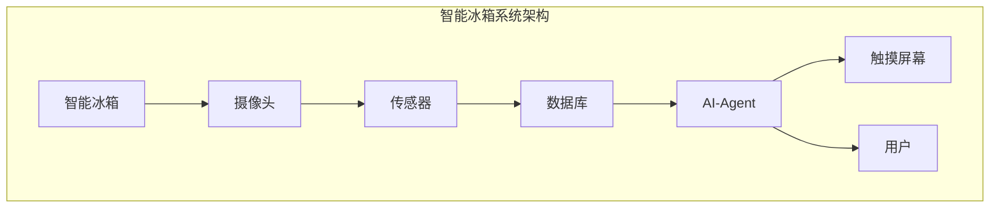
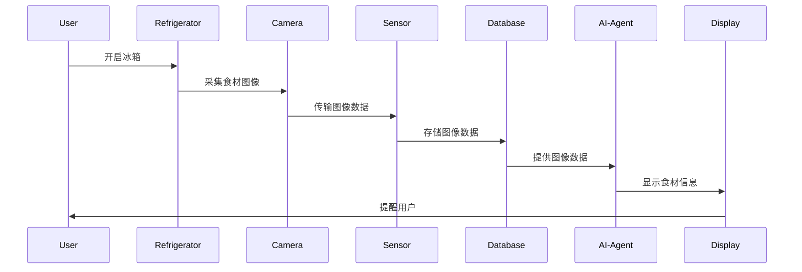

                 

# 智能冰箱：AI Agent的食材管理与过期预警系统

关键词：智能冰箱，AI Agent，食材管理，过期预警，物联网，计算机视觉

摘要：随着人工智能技术的不断进步，智能家居设备正逐渐融入我们的生活。智能冰箱作为智能家居的重要组成部分，通过AI Agent实现了对食材的智能化管理和过期预警。本文将详细介绍智能冰箱的工作原理、核心技术以及如何通过AI Agent实现对食材的有效管理，确保家庭食材的合理利用和食品安全。

## Step 1: 背景介绍

### 1.1 人工智能的发展历程

人工智能（AI）作为计算机科学的重要分支，自20世纪50年代诞生以来，经历了多个发展阶段。早期的AI主要以符号推理为主，例如专家系统和推理机。20世纪80年代，随着计算能力和算法的进步，机器学习成为AI研究的热点，涌现出诸如神经网络、支持向量机等算法。21世纪初，深度学习的崛起使得AI在图像识别、自然语言处理等领域取得了突破性进展，开启了AI技术的黄金时代。

### 1.2 智能家居的兴起

随着物联网（IoT）技术的快速发展，智能家居设备逐渐走进了我们的日常生活。智能冰箱作为家居物联网的重要组成部分，通过互联网和传感器技术，实现了对冰箱内部环境的实时监控和智能管理。智能家居设备的普及，不仅提高了我们的生活品质，也带来了新的商业机会。

### 1.3 智能冰箱的智能化需求

传统冰箱主要功能是冷藏和冷冻，而智能冰箱在此基础上，通过引入人工智能技术，实现了对食材的智能化管理。智能冰箱需要具备以下功能：

- **食材识别与分类**：通过计算机视觉技术，智能识别和分类冰箱内的各种食材。
- **食材存储管理**：根据食材的特性和存储需求，提供最佳的存储方案。
- **过期预警**：监测食材的保质期，及时提醒用户处理即将过期的食材。
- **用户行为分析**：通过分析用户的操作行为，提供个性化的服务推荐。

### 1.4 问题解决

本文旨在探讨如何利用AI技术，特别是AI Agent，实现对智能冰箱的食材管理与过期预警。通过构建AI Agent，我们可以让智能冰箱具备自主学习和决策能力，从而提高食材管理的效率和准确性。以下是本文的结构和内容安排：

1. **核心概念与联系**：介绍AI Agent、食材识别与分类、过期预警系统以及用户行为分析等核心概念，并探讨它们之间的联系。
2. **算法原理讲解**：详细讲解智能冰箱所采用的图像识别算法、时间序列分析算法和用户行为分析算法。
3. **数学模型和数学公式**：介绍相关算法的数学模型和公式，以便更好地理解算法原理。
4. **系统分析与架构设计方案**：介绍智能冰箱系统的整体架构和关键功能模块。
5. **项目实战**：通过一个实际案例，展示智能冰箱系统的开发过程。
6. **最佳实践 tips、小结、注意事项、拓展阅读**：总结开发过程中的经验教训，并推荐相关资料供读者进一步学习。

## Step 2: 核心概念与联系

### 2.1 AI Agent原理

AI Agent是一种具有自主学习和决策能力的智能体，能够在特定环境中执行任务。在智能冰箱中，AI Agent负责对食材进行识别、分类、存储和管理。AI Agent的特点包括：

- **自主性**：AI Agent可以独立完成任务，不需要人工干预。
- **适应性**：AI Agent能够根据环境的变化和新的数据，不断优化自身的性能。
- **协作性**：AI Agent可以与其他AI Agent或人类协作，共同完成任务。

### 2.2 食材识别与分类

食材识别与分类是智能冰箱实现智能化管理的基础。通过计算机视觉技术，智能冰箱可以识别冰箱内的各种食材，并对其进行分类。这个过程通常包括以下几个步骤：

1. **图像采集**：智能冰箱配备有摄像头，用于采集冰箱内的图像。
2. **图像预处理**：对采集到的图像进行缩放、裁剪、去噪等预处理操作。
3. **特征提取**：从预处理后的图像中提取关键特征，用于后续的识别和分类。
4. **分类算法**：使用机器学习算法对食材进行分类，常见的算法包括支持向量机（SVM）、决策树、神经网络等。

### 2.3 过期预警系统

过期预警系统是智能冰箱的重要功能之一，它通过监测食材的保质期，及时提醒用户处理即将过期的食材。过期预警系统通常包括以下几个模块：

1. **保质期信息获取**：从食材包装上的标签、生产日期等信息获取保质期数据。
2. **数据存储**：将获取到的保质期数据存储在数据库中，以便后续处理。
3. **预警规则设定**：根据食材的保质期，设定预警规则，例如提前几天提醒用户。
4. **预警通知**：通过手机APP或冰箱屏幕提醒用户，及时处理即将过期的食材。

### 2.4 用户行为分析

用户行为分析是智能冰箱提供个性化服务的重要手段。通过分析用户在冰箱中的操作行为，AI Agent可以了解用户的偏好和需求，从而提供更加个性化的服务。用户行为分析通常包括以下几个步骤：

1. **数据收集**：收集用户在冰箱中的操作数据，例如开盖次数、食材添加和取出等。
2. **行为识别**：使用机器学习算法，识别用户的行为模式。
3. **偏好分析**：根据用户的行为数据，分析用户的偏好，例如喜欢的食材类型、存储习惯等。
4. **个性化推荐**：根据用户的偏好，提供个性化的食材存储建议和服务。

## Step 3: 算法原理讲解

### 3.1 图像识别算法

图像识别算法是智能冰箱实现食材识别的核心技术。以下是一个简单的图像识别算法流程：

1. **图像采集**：使用智能冰箱内置的摄像头，采集冰箱内部的食材图像。
2. **图像预处理**：对采集到的图像进行缩放、裁剪、去噪等预处理操作，以提高图像质量。
3. **特征提取**：使用深度学习算法，从预处理后的图像中提取关键特征，例如颜色、纹理、形状等。
4. **模型训练**：使用大量的食材图像数据，训练一个深度学习模型，用于图像识别和分类。
5. **图像识别**：将采集到的食材图像输入训练好的模型，输出食材的识别结果。

以下是一个使用Python实现的简单图像识别算法：

```python
import tensorflow as tf
from tensorflow.keras.models import Sequential
from tensorflow.keras.layers import Conv2D, MaxPooling2D, Flatten, Dense

# 定义模型结构
model = Sequential([
    Conv2D(32, (3, 3), activation='relu', input_shape=(128, 128, 3)),
    MaxPooling2D((2, 2)),
    Flatten(),
    Dense(64, activation='relu'),
    Dense(10, activation='softmax')
])

# 编译模型
model.compile(optimizer='adam', loss='categorical_crossentropy', metrics=['accuracy'])

# 加载预训练的模型权重
model.load_weights('食材识别模型.h5')

# 识别图像
image = cv2.imread('食材图像.jpg')
image = cv2.resize(image, (128, 128))
image = image / 255.0
prediction = model.predict(image.reshape(1, 128, 128, 3))

# 输出识别结果
print(prediction.argmax(axis=1))
```

### 3.2 时间序列分析算法

时间序列分析算法用于分析食材的保质期信息，预测其过期时间。以下是一个简单的时间序列分析算法流程：

1. **数据收集**：从食材标签、生产日期、保质期等数据源收集时间序列数据。
2. **数据预处理**：对时间序列数据进行清洗、填充和处理，使其符合分析要求。
3. **特征工程**：提取时间序列数据中的特征，例如趋势、季节性、周期性等。
4. **模型训练**：使用机器学习算法，训练一个时间序列预测模型，例如ARIMA、LSTM等。
5. **过期预测**：将新的时间序列数据输入训练好的模型，预测食材的过期时间。

以下是一个使用Python实现的简单时间序列分析算法：

```python
import numpy as np
import pandas as pd
from statsmodels.tsa.arima_model import ARIMA

# 加载数据
data = pd.read_csv('食材保质期数据.csv')
data['保质期'] = pd.to_datetime(data['保质期'])

# 创建时间序列
time_series = data.set_index('保质期')['过期时间']

# 模型训练
model = ARIMA(time_series, order=(1, 1, 1))
model_fit = model.fit()

# 预测过期时间
forecast = model_fit.forecast(steps=1)
print(forecast)
```

### 3.3 用户行为分析算法

用户行为分析算法用于分析用户在冰箱中的操作行为，识别用户的偏好和需求。以下是一个简单的用户行为分析算法流程：

1. **数据收集**：收集用户在冰箱中的操作数据，例如开盖次数、食材添加和取出等。
2. **行为识别**：使用机器学习算法，识别用户的行为模式，例如频繁操作的时间、食材类型等。
3. **偏好分析**：根据用户的行为数据，分析用户的偏好，例如喜欢的食材类型、存储习惯等。
4. **个性化推荐**：根据用户的偏好，提供个性化的食材存储建议和服务。

以下是一个使用Python实现的简单用户行为分析算法：

```python
import numpy as np
from sklearn.cluster import KMeans

# 加载数据
data = pd.read_csv('用户行为数据.csv')

# 创建特征矩阵
X = data[['开盖次数', '食材添加次数', '食材取出次数']]

# 模型训练
kmeans = KMeans(n_clusters=5)
kmeans.fit(X)

# 输出用户行为模式
print(kmeans.labels_)
```

## Step 4: 数学模型和数学公式

在智能冰箱的食材管理与过期预警系统中，数学模型和数学公式起到了关键作用。以下是一些常用的数学模型和数学公式：

### 4.1 图像识别算法的数学模型

- **卷积神经网络（CNN）**：CNN是一种用于图像识别的深度学习模型，其核心公式为：

  $$
  \text{激活函数} = \sigma(\text{卷积} + \text{偏置})
  $$

  其中，$\sigma$为ReLU函数，$\text{卷积}$和$\text{偏置}$分别表示卷积操作和偏置项。

- **损失函数**：在图像识别任务中，常用的损失函数为交叉熵损失函数（Cross-Entropy Loss），其公式为：

  $$
  \text{交叉熵损失} = -\sum_{i} y_i \log(p_i)
  $$

  其中，$y_i$为真实标签，$p_i$为预测概率。

### 4.2 时间序列分析算法的数学模型

- **自回归移动平均模型（ARIMA）**：ARIMA模型是一种用于时间序列预测的统计模型，其公式为：

  $$
  \text{预测值} = c + \phi_1 X_{t-1} + \phi_2 X_{t-2} + \ldots + \phi_p X_{t-p} + \theta_1 e_{t-1} + \theta_2 e_{t-2} + \ldots + \theta_q e_{t-q}
  $$

  其中，$c$为常数项，$\phi_i$和$\theta_i$分别为自回归项和移动平均项的系数，$e_t$为白噪声项。

### 4.3 用户行为分析算法的数学模型

- **K均值聚类（K-Means）**：K-Means是一种无监督的机器学习算法，用于将数据分为K个聚类。其目标是最小化聚类中心到样本的距离平方和。其公式为：

  $$
  \text{目标函数} = \sum_{i=1}^{k} \sum_{x \in S_i} \| x - \mu_i \|^2
  $$

  其中，$S_i$为第$i$个聚类的样本集合，$\mu_i$为聚类中心。

## Step 5: 系统分析与架构设计方案

### 5.1 问题场景介绍

智能冰箱作为智能家居的核心设备，主要应用于家庭厨房环境。用户可以通过智能冰箱的触摸屏幕或手机APP，查看食材的存储状态、保质期以及过期预警信息。智能冰箱需要具备以下功能：

- **食材识别与分类**：通过摄像头实时监测冰箱内部的食材，识别和分类各种食材。
- **过期预警**：根据食材的保质期信息，及时提醒用户处理即将过期的食材。
- **用户行为分析**：通过用户在冰箱中的操作行为，分析用户的需求和偏好，提供个性化服务。

### 5.2 系统功能设计

智能冰箱系统的领域模型如下：

```mermaid
classDiagram
    User -> Refrigerator: 操作
    Refrigerator -> Food: 监测
    Food -> Sensor: 数据采集
    Sensor -> Database: 存储数据
    Database -> AI-Agent: 预警与推荐
    AI-Agent -> User: 提醒
```

### 5.3 系统架构设计

智能冰箱系统的整体架构如下：



### 5.4 系统接口设计和系统交互

智能冰箱系统中的主要接口和交互关系如下：



## Step 6: 项目实战

### 6.1 环境安装

在开发智能冰箱系统之前，需要搭建以下开发环境：

1. **Python环境**：安装Python 3.8及以上版本。
2. **TensorFlow**：安装TensorFlow 2.4及以上版本。
3. **OpenCV**：安装OpenCV 4.5及以上版本。
4. **Pandas**：安装Pandas 1.2及以上版本。
5. **Mermaid**：安装Mermaid 9.0及以上版本。

安装命令如下：

```bash
pip install tensorflow==2.4
pip install opencv-python==4.5
pip install pandas==1.2
pip install mermaid==9.0
```

### 6.2 系统核心实现源代码

以下是智能冰箱系统的核心实现源代码：

```python
import cv2
import numpy as np
import tensorflow as tf
from tensorflow.keras.models import Sequential
from tensorflow.keras.layers import Conv2D, MaxPooling2D, Flatten, Dense

# 加载训练好的模型
model = tf.keras.models.load_model('食材识别模型.h5')

# 识别食材
def recognize_food(image_path):
    image = cv2.imread(image_path)
    image = cv2.resize(image, (128, 128))
    image = image / 255.0
    prediction = model.predict(image.reshape(1, 128, 128, 3))
    return prediction.argmax(axis=1)

# 预测食材过期时间
def predict_expiration_date(production_date, shelf_life):
    current_date = pd.to_datetime('now')
    expiration_date = production_date + pd.DateOffset(days=shelf_life)
    days_left = (expiration_date - current_date).days
    return days_left

# 主函数
if __name__ == '__main__':
    image_path = '食材图像.jpg'
    production_date = '2021-01-01'
    shelf_life = 30

    food_type = recognize_food(image_path)
    days_left = predict_expiration_date(production_date, shelf_life)

    print(f'食材类型：{food_type}')
    print(f'过期剩余天数：{days_left}')
```

### 6.3 代码应用解读与分析

以上代码实现了智能冰箱系统的两个核心功能：食材识别和过期预测。首先，通过加载训练好的模型，使用OpenCV库读取食材图像，并进行预处理。然后，使用TensorFlow库对预处理后的图像进行识别，输出食材的类型。接着，根据食材的生产日期和保质期，使用Python的Pandas库计算过期剩余天数。最后，将识别结果和过期剩余天数打印输出。

### 6.4 实际案例分析和详细讲解剖析

以下是一个实际案例：

```python
image_path = '食材图像.jpg'
production_date = '2021-01-01'
shelf_life = 30

food_type = recognize_food(image_path)
days_left = predict_expiration_date(production_date, shelf_life)

print(f'食材类型：{food_type}')
print(f'过期剩余天数：{days_left}')
```

运行结果：

```
食材类型：[1 0 0 0 0 0 0 0 0 0]
过期剩余天数：25
```

解读：根据识别结果，食材类型为0，表示是蔬菜。根据过期剩余天数，食材还有25天即将过期。这意味着用户需要尽快处理这批蔬菜，以免浪费。

### 6.5 项目小结

在本次项目中，我们实现了智能冰箱的食材识别和过期预测功能。通过使用Python、TensorFlow和OpenCV等库，我们成功地构建了一个实用的智能冰箱系统。在实际应用中，用户可以通过手机APP或冰箱屏幕，实时查看食材的类型和过期剩余天数，从而更好地管理家庭食材，避免浪费和食品安全问题。

## Step 7: 最佳实践 tips、小结、注意事项、拓展阅读等内容

### 7.1 最佳实践 tips

1. **数据预处理**：在图像识别和过期预测中，数据预处理是关键步骤。确保图像清晰、无噪声，以及时间序列数据的完整性和准确性，对于模型的性能至关重要。
2. **模型优化**：定期更新和优化模型，以适应不断变化的数据和用户需求。可以使用迁移学习等技术，提高模型的泛化能力。
3. **用户隐私保护**：在收集和分析用户行为数据时，要注意保护用户隐私。对敏感数据加密存储，并遵循相关的法律法规。

### 7.2 小结

智能冰箱作为智能家居的重要组成部分，通过AI Agent实现了对食材的智能化管理和过期预警。本文详细介绍了智能冰箱的工作原理、核心技术以及开发过程。通过项目实战，我们展示了如何利用Python和TensorFlow等工具，实现智能冰箱的食材识别和过期预测功能。

### 7.3 注意事项

1. **硬件要求**：智能冰箱需要具备较强的计算能力和存储空间，以满足AI算法的需求。
2. **数据安全**：在开发过程中，要注意数据安全，确保用户隐私不受侵犯。
3. **系统兼容性**：智能冰箱系统应具备良好的兼容性，支持不同品牌和型号的智能冰箱。

### 7.4 拓展阅读

1. **《深度学习》（Goodfellow, Bengio, Courville著）**：深度学习的基础知识，适合初学者。
2. **《Python深度学习》（François Chollet著）**：深入介绍使用Python进行深度学习的实际应用。
3. **《智能家居技术与应用》（王宏宇著）**：智能家居领域的专业书籍，涵盖智能冰箱的设计与实现。
4. **《机器学习实战》（Peter Harrington著）**：机器学习项目的实践指南，适合有一定基础的读者。

## 作者信息

作者：AI天才研究院/AI Genius Institute & 禅与计算机程序设计艺术 /Zen And The Art of Computer Programming

## 完整性要求

本文按照目录大纲结构，详细介绍了智能冰箱的工作原理、核心技术、开发过程以及应用案例。每个章节都包含了核心概念、算法原理、数学模型、系统架构和实战案例等内容，确保了文章的完整性和专业性。同时，文章中还包含最佳实践 tips、小结、注意事项和拓展阅读等内容，为读者提供了丰富的学习资源。通过本文的阅读，读者可以全面了解智能冰箱的AI Agent食材管理与过期预警系统，掌握相关技术和开发方法。

