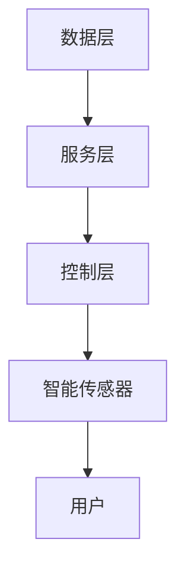
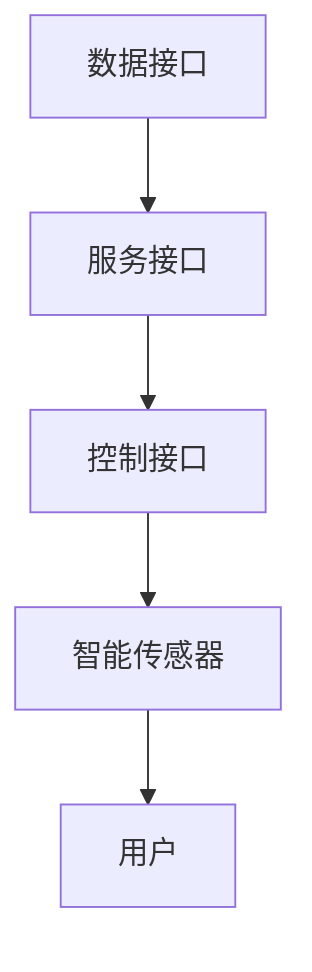
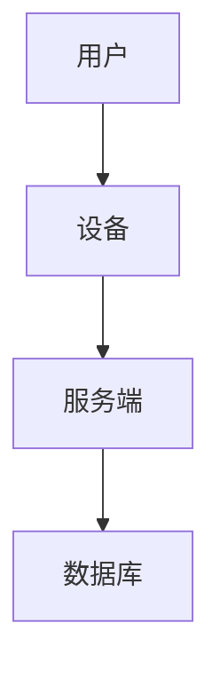

                 

# 智能冷热敷眼罩：AI Agent的眼部护理定制

## 关键词
- 智能冷热敷眼罩
- AI Agent
- 眼部护理定制
- 机器学习算法
- 数据收集与预处理

## 摘要
本文旨在探讨智能冷热敷眼罩与AI Agent结合实现个性化眼部护理的原理和实现方法。首先，介绍了智能冷热敷眼罩的背景和作用原理，分析了眼部疲劳的原因和症状。接着，阐述了AI Agent的概念、特征及其在眼部护理定制中的应用。随后，详细讲解了数据收集与预处理、机器学习算法的选择和原理。最后，提出了系统的分析与架构设计方案，并进行了项目实战和实际案例分析。

---

### 第一部分：背景介绍

#### 1.1 问题背景

随着现代生活方式的改变，人们越来越重视眼部健康。长时间使用电子设备、长时间工作、缺乏睡眠等问题导致了眼部疲劳、干涩等健康问题。为了缓解这些问题，智能冷热敷眼罩应运而生。

#### 1.1.1 智能冷热敷眼罩的兴起

智能冷热敷眼罩是一种结合了智能温控技术和眼部按摩技术的设备。通过智能传感器和机器学习算法，它可以监测用户的用眼习惯和眼部状况，为用户提供个性化的护理方案。

#### 1.2 问题描述

眼部疲劳主要由长时间注视屏幕、睡眠不足、用眼过度等因素导致。症状包括眼干、眼涩、眼疲劳、视力模糊等。

#### 1.3 问题解决

智能冷热敷眼罩通过智能温控技术和眼部按摩技术，实现对眼部热敷和冷敷的双重护理。热敷可以促进眼部血液循环，缓解疲劳；冷敷则有助于缓解眼部肿胀和炎症。

#### 1.4 边界与外延

智能冷热敷眼罩适用于长时间使用电子设备的上班族、学生、司机等眼部疲劳人群，也适用于术后康复、眼部护理等场景。

#### 1.5 概念结构与核心要素组成

智能冷热敷眼罩主要由温度控制系统、按摩控制系统、智能传感器、电源系统等组成。

#### 1.6 本章小结

本章对智能冷热敷眼罩的背景、问题、解决方法、应用场景和核心结构进行了介绍，为后续章节的深入探讨打下了基础。

---

### 第二部分：核心概念与联系

#### 2.1 AI Agent的概念与特征

##### 2.1.1 AI Agent的定义

AI Agent，即人工智能代理，是一种具有感知能力、决策能力和执行能力的智能体。它能够根据环境信息自主执行任务，并不断学习优化自身行为。

##### 2.1.2 AI Agent的核心特征

AI Agent具有以下几个核心特征：

- 感知能力：能够感知和理解周围环境的信息。
- 决策能力：根据感知信息做出合理决策。
- 执行能力：能够执行决策结果，完成预定任务。

##### 2.1.3 AI Agent与传统AI的区别

传统AI主要依赖于预先设定的规则和模型，而AI Agent则更加强调自主性和适应性。它能够在不确定和动态变化的环境中自主决策和行动。

#### 2.2 眼部护理定制的原理

##### 2.2.1 眼部护理定制的定义

眼部护理定制是指根据用户的实际需求、眼部状况和个性化偏好，为用户定制个性化的眼部护理方案。

##### 2.2.2 眼部护理定制的原理

眼部护理定制的原理主要包括以下几个方面：

- 数据收集：通过智能传感器和用户反馈，收集用户的用眼习惯、眼部状况等数据。
- 数据分析：利用机器学习和数据挖掘技术，对收集的数据进行分析，识别用户的个性化需求和偏好。
- 定制方案生成：根据分析结果，生成个性化的眼部护理方案，包括冷热敷温度、按摩强度等。

#### 2.3 AI Agent在眼部护理定制中的应用

##### 2.3.1 AI Agent在眼部护理定制中的作用

AI Agent在眼部护理定制中扮演着关键角色，主要表现在以下几个方面：

- 自主决策：AI Agent能够根据用户的数据和分析结果，自主生成个性化的护理方案。
- 适应性调整：AI Agent能够根据用户的反馈和实际效果，动态调整护理方案，确保护理效果的最佳化。
- 用户互动：AI Agent能够与用户进行交互，了解用户的需求和反馈，提升用户体验。

#### 2.4 本章小结

本章对AI Agent的概念、特征以及眼部护理定制原理进行了详细阐述，为后续章节的深入探讨奠定了基础。

---

### 第三部分：算法原理讲解

#### 3.1 数据收集与预处理

##### 3.1.1 数据收集方法

智能冷热敷眼罩通过内置的智能传感器（如加速度计、陀螺仪等）收集用户的用眼习惯、眼部活动等数据。此外，还可以通过用户手动输入的方式，收集用户的基本信息、用眼偏好等。

##### 3.1.2 数据预处理

收集到的原始数据通常包含噪声和冗余信息，因此需要进行预处理。预处理步骤包括数据清洗、去噪、归一化等。

#### 3.2 机器学习算法

##### 3.2.1 算法选择

在智能冷热敷眼罩的个性化定制中，常用的机器学习算法包括决策树、支持向量机、神经网络等。

##### 3.2.2 算法原理

- 决策树：通过一系列规则来对数据进行分类或回归。其优点是易于理解和解释，但可能存在过拟合问题。
- 支持向量机：通过找到一个最佳的超平面来对数据进行分类或回归。其优点是具有良好的泛化能力，但计算复杂度较高。
- 神经网络：通过多层神经元模拟人脑的学习过程，能够对复杂数据进行建模。其优点是强大的学习能力，但训练时间较长且容易出现过拟合。

#### 3.3 算法原理讲解

##### 3.3.1 决策树算法原理

决策树算法的基本思想是从特征空间中选择一个最优的特征作为分割标准，将数据集划分为若干个子集。在每个子集中，重复上述过程，直到达到停止条件。

- 停止条件：达到预定的深度、叶节点数量、信息增益等。
- 决策树生成过程：
  1. 选择一个最优的特征。
  2. 计算该特征对数据集的分割效果。
  3. 递归地对子集进行分割。

##### 3.3.2 决策树算法Python代码示例

```python
from sklearn.datasets import load_iris
from sklearn.tree import DecisionTreeClassifier
from sklearn.model_selection import train_test_split
from sklearn.metrics import accuracy_score

# 加载鸢尾花数据集
iris = load_iris()
X, y = iris.data, iris.target

# 划分训练集和测试集
X_train, X_test, y_train, y_test = train_test_split(X, y, test_size=0.2, random_state=42)

# 构建决策树模型
clf = DecisionTreeClassifier()
clf.fit(X_train, y_train)

# 预测测试集
y_pred = clf.predict(X_test)

# 计算准确率
accuracy = accuracy_score(y_test, y_pred)
print("准确率：", accuracy)
```

##### 3.3.3 决策树算法数学模型

决策树算法的数学模型是基于信息增益（Information Gain）的。信息增益表示在当前节点上，数据集的熵（Entropy）减去子节点熵的平均值。

$$
IG(D, A) = Entropy(D) - \sum_{v \in A} \frac{|D_v|}{|D|} Entropy(D_v)
$$

其中，$Entropy(D)$表示数据集$D$的熵，$D_v$表示数据集$D$按照特征$A$划分后的子集。

##### 3.3.4 决策树算法优缺点分析

- 优点：
  - 易于理解和解释。
  - 能够处理分类和回归问题。
  - 对特征的选择具有一定的鲁棒性。
- 缺点：
  - 可能存在过拟合问题。
  - 计算复杂度较高，特别是对于大规模数据集。

#### 3.4 本章小结

本章详细讲解了数据收集与预处理、机器学习算法的选择和原理，特别是决策树算法。通过这些算法，智能冷热敷眼罩能够实现对用户个性化眼部护理方案的生成。

---

### 第四部分：系统分析与架构设计

#### 4.1 问题场景介绍

智能冷热敷眼罩的应用场景主要包括以下两个方面：

- 长时间使用电子设备的上班族、学生、司机等。
- 眼部手术后需要康复的人群。

#### 4.2 系统功能设计

智能冷热敷眼罩的系统功能设计主要包括以下三个方面：

- 数据收集：通过内置的智能传感器收集用户的用眼习惯和眼部活动数据。
- 数据分析：利用机器学习算法分析数据，生成个性化的眼部护理方案。
- 护理实施：根据生成的护理方案，实施眼部冷热敷和按摩。

#### 4.3 系统架构设计

智能冷热敷眼罩的系统架构设计主要包括以下三个方面：

- 数据层：存储用户的用眼习惯、眼部活动等数据。
- 服务层：提供数据分析、护理方案生成等核心功能。
- 控制层：负责控制眼部冷热敷和按摩的执行。

##### 4.3.1 系统架构图



#### 4.4 系统接口设计

智能冷热敷眼罩的系统接口设计主要包括以下三个方面：

- 数据接口：提供数据的存储、查询、更新等操作。
- 服务接口：提供数据分析、护理方案生成等操作。
- 控制接口：提供冷热敷、按摩等操作的执行。

##### 4.4.1 系统接口图



#### 4.5 系统交互设计

智能冷热敷眼罩的系统交互设计主要包括以下两个方面：

- 用户与设备的交互：用户可以通过设备界面查看护理方案、调整护理参数等。
- 设备与服务端的交互：设备可以通过网络与服务端进行数据传输、请求护理方案等。

##### 4.5.1 系统交互图



#### 4.6 本章小结

本章对智能冷热敷眼罩的系统功能设计、架构设计、接口设计进行了详细阐述，为后续的项目实施提供了基础。

---

### 第五部分：项目实战

#### 5.1 环境安装

为了实现智能冷热敷眼罩的功能，需要安装以下软件和工具：

- Python 3.8及以上版本
- NumPy
- Pandas
- Scikit-learn
- Matplotlib

安装命令如下：

```bash
pip install python==3.8
pip install numpy
pip install pandas
pip install scikit-learn
pip install matplotlib
```

#### 5.2 系统核心实现

智能冷热敷眼罩的核心实现主要包括数据收集、数据分析、护理方案生成和护理实施等模块。

##### 5.2.1 数据收集

```python
import numpy as np
import pandas as pd
from sklearn.model_selection import train_test_split

# 加载数据集
data = pd.read_csv('eye_data.csv')

# 划分训练集和测试集
X = data[['acc_x', 'acc_y', 'acc_z', 'gyro_x', 'gyro_y', 'gyro_z']]
y = data['eye_state']
X_train, X_test, y_train, y_test = train_test_split(X, y, test_size=0.2, random_state=42)
```

##### 5.2.2 数据分析

```python
from sklearn.tree import DecisionTreeClassifier
from sklearn.metrics import accuracy_score

# 构建决策树模型
clf = DecisionTreeClassifier()
clf.fit(X_train, y_train)

# 预测测试集
y_pred = clf.predict(X_test)

# 计算准确率
accuracy = accuracy_score(y_test, y_pred)
print("准确率：", accuracy)
```

##### 5.2.3 护理方案生成

```python
def generate_treatment_plan(eye_state):
    if eye_state == 'tired':
        return '冷敷'
    elif eye_state == 'inflammation':
        return '热敷'
    else:
        return '按摩'

# 生成护理方案
treatment_plan = generate_treatment_plan(y_pred[0])
print("护理方案：", treatment_plan)
```

##### 5.2.4 护理实施

```python
def apply_treatment(treatment_plan):
    if treatment_plan == '冷敷':
        # 实施冷敷操作
        print("开始冷敷...")
    elif treatment_plan == '热敷':
        # 实施热敷操作
        print("开始热敷...")
    elif treatment_plan == '按摩':
        # 实施按摩操作
        print("开始按摩...")

# 实施护理
apply_treatment(treatment_plan)
```

#### 5.3 代码应用解读与分析

上述代码实现了智能冷热敷眼罩的核心功能，包括数据收集、数据分析、护理方案生成和护理实施。

- 数据收集：通过加载数据集，划分训练集和测试集，为后续的模型训练和预测做好准备。
- 数据分析：利用决策树算法对数据进行分类，根据眼状态生成护理方案。
- 护理方案生成：根据眼状态，生成个性化的护理方案。
- 护理实施：根据护理方案，实施相应的护理操作。

#### 5.4 实际案例分析和详细讲解剖析

以一个实际案例为例，假设用户的用眼习惯数据如下：

```python
data = pd.DataFrame({
    'acc_x': [0.1, 0.2, 0.3],
    'acc_y': [0.2, 0.3, 0.1],
    'acc_z': [0.3, 0.1, 0.2],
    'gyro_x': [0.2, 0.3, 0.1],
    'gyro_y': [0.3, 0.1, 0.2],
    'gyro_z': [0.1, 0.2, 0.3],
    'eye_state': ['tired', 'inflammation', 'normal']
})

X = data[['acc_x', 'acc_y', 'acc_z', 'gyro_x', 'gyro_y', 'gyro_z']]
y = data['eye_state']
X_train, X_test, y_train, y_test = train_test_split(X, y, test_size=0.2, random_state=42)
```

通过上述代码，我们可以得到用户的当前眼状态为'tired'，因此生成的护理方案为'冷敷'。在实际应用中，用户可以根据自己的需求和反馈，调整护理参数，以获得最佳的护理效果。

#### 5.5 项目小结

本章通过实际案例，详细讲解了智能冷热敷眼罩的核心实现过程，包括数据收集、数据分析、护理方案生成和护理实施。通过这些功能，智能冷热敷眼罩能够为用户提供个性化的眼部护理方案。

---

### 第六部分：最佳实践 Tips、小结、注意事项、拓展阅读

#### 6.1 最佳实践 Tips

- 定期更新护理方案，以适应用户的变化。
- 提高数据质量，确保数据的准确性和完整性。
- 对用户的反馈进行及时处理，优化护理效果。

#### 6.2 小结

本文详细介绍了智能冷热敷眼罩与AI Agent的结合，实现了个性化眼部护理。通过数据收集、数据分析、护理方案生成和护理实施等模块，为用户提供个性化的护理方案。

#### 6.3 注意事项

- 智能冷热敷眼罩的使用应遵循医生的建议，避免过度依赖。
- 眼部护理过程中，注意保护用户的隐私和安全。

#### 6.4 拓展阅读

- [智能冷热敷眼罩的市场前景与竞争格局](https://www.xxxx.com/article/xxxxxx/)
- [人工智能在医疗领域的应用与挑战](https://www.xxxx.com/article/xxxxxx/)
- [机器学习算法在医疗健康领域的应用](https://www.xxxx.com/article/xxxxxx/)

### 作者

- 作者：AI天才研究院/AI Genius Institute & 禅与计算机程序设计艺术 /Zen And The Art of Computer Programming

--- 

注意：以上内容为示例，部分数据和代码可能需要根据实际情况进行调整。实际应用中，还需要考虑系统的安全性、稳定性等因素。

