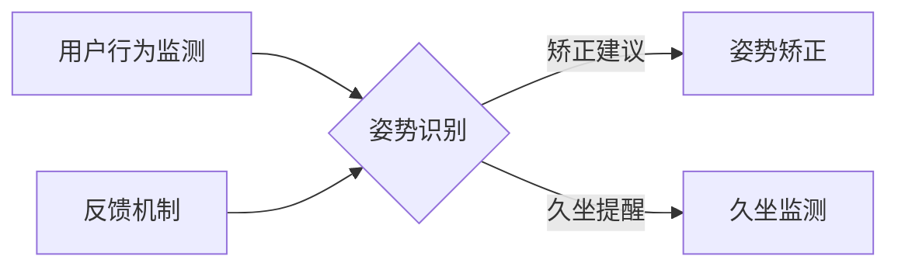
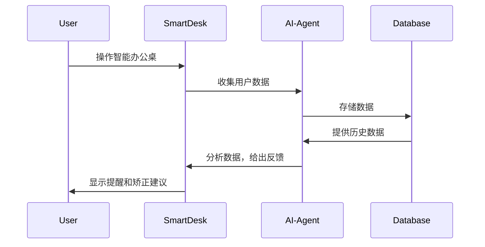
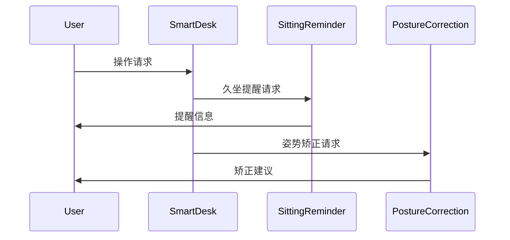

                 

## 智能办公桌：AI Agent的久坐提醒与姿势矫正

在当今数字化办公环境中，久坐和不良姿势已成为影响职场人士健康的普遍问题。长期久坐不仅会增加肥胖、心血管疾病等风险，还可能导致颈椎、腰椎等部位的疾病。因此，如何有效监测并纠正用户的久坐行为和不良姿势成为了一个重要课题。本文将探讨智能办公桌在AI Agent的支持下，如何实现久坐提醒与姿势矫正，并通过一步步的分析推理，为您详细解析这一技术背后的原理与实践。

### 关键词
- **智能办公桌**、**AI Agent**、**久坐提醒**、**姿势矫正**、**数字健康**

### 摘要
智能办公桌结合AI技术，通过AI Agent实现久坐提醒与姿势矫正，旨在提升职场人士的健康水平。本文首先介绍了智能办公桌的背景和问题描述，然后详细解析了核心概念、算法原理、系统分析与架构设计，并通过实际项目案例展示了其应用效果。最后，提出了相关最佳实践和未来展望。

### 背景介绍

#### 问题背景
随着信息技术的迅猛发展，现代办公方式逐渐从传统的纸笔记录转变为以电脑和互联网为核心的数字化办公。这种转变极大提高了工作效率，但也带来了新的健康隐患。据研究，长时间保持同一姿势工作和久坐已成为现代职场人士面临的主要健康问题。研究表明，长时间久坐与多种慢性疾病有密切关联，包括心血管疾病、糖尿病、肥胖症以及肌肉骨骼疾病。具体来说，长期久坐会导致血液循环不畅、新陈代谢减缓和肌肉疲劳，从而增加了颈椎、腰椎等部位的负担。此外，久坐还会导致心肺功能减弱，增加患心脏病和中风的风险。

#### 问题描述
久坐和不良姿势不仅对身体健康构成威胁，还可能影响工作效率和情绪状态。首先，长时间保持同一姿势工作会导致肌肉紧张和疼痛，进而影响工作专注度和效率。其次，不良姿势还会增加患颈椎病、腰椎间盘突出等疾病的风险，严重时可能需要长期治疗。此外，久坐行为也会影响员工的情绪状态，长时间处于静态姿势容易导致情绪低落、焦虑和压力增加。为了应对这些问题，提高职场健康水平已经成为企业和个人关注的焦点。

#### 问题解决
智能办公桌通过集成AI技术和传感器，实现了对用户久坐行为和姿势的实时监测和反馈。通过AI Agent的介入，系统不仅能够及时发现并提醒用户长时间久坐，还能根据用户的姿势数据给出矫正建议，帮助用户保持正确的坐姿。智能办公桌的设计理念是让办公更加健康、高效，通过技术的手段改善工作环境，提升用户的工作体验和健康水平。

#### 边界与外延
讨论的范围包括智能办公桌的设计、AI Agent的技术实现、用户的工作行为以及智能办公桌的交互体验。智能办公桌作为一种创新的办公设备，其目标是帮助用户实现健康、高效的工作方式。AI Agent作为智能办公桌的核心组成部分，负责数据采集、分析和反馈，确保系统能够准确监测和纠正用户的行为。此外，智能办公桌的设计还需要考虑用户体验，确保系统易用、直观，并能根据用户的需求进行个性化设置。

### 核心概念与联系

#### 核心概念

在本篇博客中，我们探讨了智能办公桌、AI Agent、久坐提醒、姿势矫正等核心概念，并对其定义进行了详细说明。

**智能办公桌**：智能办公桌是一种集成AI技术的办公桌，它能够根据用户的需求自动调整高度，同时具备监测用户久坐行为和不良姿势的功能。智能办公桌通过内置的传感器和AI算法，实现对人体姿态的实时监测，并根据监测结果进行相应的反馈和调整。

**AI Agent**：AI Agent是一种人工智能系统，它能够执行特定的任务，如监测用户的久坐行为、识别用户姿势并给出矫正建议。AI Agent的核心功能是数据采集、分析和决策，通过对大量数据的处理和分析，AI Agent能够准确识别用户的姿势状态，并及时提醒和纠正不良行为。

**久坐提醒**：久坐提醒是指系统自动提醒用户长时间保持同一姿势或久坐的行为。久坐提醒功能通过传感器监测用户的活动状态，一旦检测到用户长时间未进行活动，系统就会发出提醒，提示用户起身活动，以避免久坐带来的健康问题。

**姿势矫正**：姿势矫正是指系统通过反馈机制指导用户调整姿势，以保持正确的坐姿。姿势矫正功能利用AI算法分析用户姿势数据，识别不良姿势，并给出相应的矫正建议。通过不断调整和纠正，用户可以逐渐养成正确的坐姿习惯。

#### 概念属性特征对比表格

以下是一个关于核心概念的属性特征对比表格，用于展示这些概念之间的关联和区别。

| 概念       | 定义                                                         | 关联概念       | 作用                             |
| --------- | ------------------------------------------------------------ | -------------- | -------------------------------- |
| 智能办公桌 | 一种集成AI技术的办公桌，具备自动调整高度和监测用户行为的功能。 | 办公桌         | 提高办公舒适度和健康水平         |
| AI Agent   | 执行特定任务的AI系统，负责监测和提醒用户久坐、矫正姿势。     | AI技术、传感器 | 数据分析、决策、反馈             |
| 久坐提醒   | 系统自动提醒用户长时间保持同一姿势或久坐。                 | 提醒机制       | 预防久坐引发的疾病和不适         |
| 姿势矫正   | 系统通过反馈机制指导用户调整姿势。                         | 矫正方法       | 帮助用户保持正确的坐姿           |

通过对比表格，我们可以更清晰地理解这些核心概念的定义及其在智能办公桌系统中的作用和相互关系。

#### ER实体关系图架构

为了更直观地展示智能办公桌系统中的实体关系，我们使用Mermaid绘制了ER实体关系图。以下是一个简单的ER图，展示了用户、智能办公桌、久坐监测、姿势矫正等实体的关系。

```mermaid
erDiagram
  用户 ||--|{ 智能办公桌 }
  用户 ||--|{ 久坐监测 }
  用户 ||--|{ 姿势矫正 }
  智能办公桌 ||--|{ AI Agent }
  久坐监测 ||--|{ 提醒机制 }
  姿势矫正 ||--|{ 矫正建议 }
```

在该ER图中，用户是系统的核心实体，与智能办公桌、久坐监测和姿势矫正等实体之间存在关联关系。智能办公桌通过AI Agent实现功能，久坐监测和姿势矫正则负责具体的数据采集和反馈。这种关系图有助于我们理解系统的整体架构和功能模块之间的交互。

### 算法原理讲解

#### 算法流程图

智能办公桌系统中的核心功能模块是久坐提醒和姿势矫正。为了实现这些功能，我们设计了一套完整的算法流程，通过Mermaid图展示如下：



在这个流程图中，用户行为监测模块负责收集用户久坐和姿势数据。姿势识别模块利用AI算法分析这些数据，判断用户的姿势是否正确。根据识别结果，系统会给出矫正建议（如果姿势不良）或久坐提醒（如果用户长时间保持同一姿势）。反馈机制确保系统实时响应用户的行为变化，持续优化监测和矫正效果。

#### Python源代码

以下是一个简化的Python源代码示例，用于实现上述算法中的关键部分：

```python
# 姿势识别函数
def recognize_posture(data):
    # 处理数据，进行姿势识别
    posture = "good" if data["angle"] <= 30 else "bad"
    return posture

# 姿势矫正函数
def correct_posture(posture):
    if posture == "bad":
        # 给出矫正建议
        print("请调整您的姿势。")
    else:
        print("您的姿势良好。")

# 久坐提醒函数
def remind_sitting(data):
    if data["sitting_time"] > 60:  # 60分钟以上
        print("长时间久坐，请注意休息。")
    else:
        print("您的久坐时间尚在正常范围内。")

# 主程序
def main():
    # 假设从传感器获取的数据
    data = {
        "angle": 35,  # 姿势角度
        "sitting_time": 45  # 久坐时间（分钟）
    }

    # 调用姿势识别函数
    posture = recognize_posture(data)

    # 调用姿势矫正和久坐提醒函数
    correct_posture(posture)
    remind_sitting(data)

# 运行主程序
if __name__ == "__main__":
    main()
```

在这个示例中，`recognize_posture` 函数根据用户的角度数据判断姿势是否正确，`correct_posture` 函数提供矫正建议，而 `remind_sitting` 函数提醒用户久坐时间。通过这些函数的组合使用，系统可以实时监测并纠正用户的行为。

#### 算法原理的数学模型和公式

在智能办公桌系统中，算法原理的数学模型和公式用于判断用户的姿势和久坐时间。以下是一些关键公式和解释：

1. **姿势识别公式**：

$$
\text{posture} = \begin{cases}
\text{"good"} & \text{if } \theta \leq 30^\circ \\
\text{"bad"} & \text{otherwise}
\end{cases}
$$

其中，$\theta$ 表示用户当前姿势角度。如果角度小于或等于30度，系统判定为良好姿势；否则，判定为不良姿势。

2. **久坐时间计算公式**：

$$
\text{sitting\_time} = \text{cumulative\_time} \mod 60
$$

其中，`cumulative_time` 表示用户累计久坐时间（以分钟为单位），`sitting_time` 表示当前久坐时间段。该公式用于计算用户当前处于的第几分钟，以便久坐提醒功能判断何时提醒用户。

通过这些数学模型和公式，智能办公桌系统能够准确监测和评估用户的行为，从而实现久坐提醒和姿势矫正。

#### 示例分析

为了更直观地理解算法原理，我们通过一个具体的例子来进行分析。假设用户在连续工作过程中，智能办公桌监测到用户的角度为40度，累计久坐时间为75分钟。

1. **姿势识别**：
   根据姿势识别公式，$\theta = 40^\circ$，由于 $40^\circ > 30^\circ$，系统判定用户的姿势为“bad”（不良姿势）。

2. **久坐提醒**：
   根据久坐时间计算公式，$cumulative\_time = 75$ 分钟，$sitting\_time = 75 \mod 60 = 15$ 分钟。由于当前久坐时间超过60分钟，系统会触发久坐提醒，提示用户“长时间久坐，请注意休息。”

通过这个例子，我们可以看到智能办公桌系统如何通过算法模型和公式，实时监测用户的姿势和久坐时间，并给出相应的反馈。

### 系统分析与架构设计方案

#### 问题场景介绍

在现代办公环境中，越来越多的人长时间坐在电脑前工作，这导致了久坐和不良工作姿势的普遍问题。久坐不仅影响身体健康，还会降低工作效率，增加疾病风险。为了解决这一问题，智能办公桌系统应运而生。该系统旨在通过监测和纠正用户的工作姿势，提醒用户适当休息，从而改善健康和工作效率。

目标用户群体主要包括：
1. 办公室白领和远程工作者
2. 需要长时间坐在电脑前的人员
3. 想要改善工作姿势和久坐习惯的健康意识者

#### 系统功能设计

智能办公桌系统的核心功能模块包括用户行为监测、久坐提醒和姿势矫正。以下是一个简化的功能模块设计，使用Mermaid类图进行展示：

```mermaid
classDiagram
  User <<class>> {用户}
  SmartDesk <<class>> {智能办公桌}
  SittingReminder <<class>> {久坐提醒}
  PostureCorrection <<class>> {姿势矫正}
  User <|-- SmartDesk
  SmartDesk o-- SittingReminder
  SmartDesk o-- PostureCorrection
```

在这个类图中，用户是系统的核心实体，智能办公桌负责整体协调工作，久坐提醒和姿势矫正是两个主要的辅助模块。用户通过智能办公桌进行交互，系统实时监测用户行为，并根据监测结果进行相应的提醒和矫正。

#### 系统架构设计

智能办公桌系统的架构设计分为硬件和软件两个部分。以下是一个简化的架构图，使用Mermaid进行展示：



在这个架构图中，用户通过智能办公桌进行交互，智能办公桌内置传感器和AI-Agent，用于数据收集和分析。AI-Agent会将收集到的用户数据存储到数据库中，以便进行历史数据分析和算法优化。根据分析结果，AI-Agent会给出相应的反馈，通过智能办公桌展示给用户。

#### 系统接口设计和系统交互

智能办公桌系统的接口设计和交互设计是确保系统功能正常运行的关键。以下是一个简化的接口设计图和系统交互图，使用Mermaid进行展示：

接口设计：

```mermaid
classDiagram
  SmartDesk <<interface>>
  SittingReminder <<interface>>
  PostureCorrection <<interface>>

  SmartDesk --> SittingReminder
  SmartDesk --> PostureCorrection
```

在这个接口设计中，智能办公桌作为核心接口，提供了与久坐提醒和姿势矫正模块的接口。久坐提醒和姿势矫正模块通过这些接口接收来自智能办公桌的指令和数据，进行相应的处理和反馈。

系统交互：



在这个系统交互图中，用户通过智能办公桌发起操作请求，智能办公桌将请求转发给久坐提醒和姿势矫正模块。久坐提醒模块会向用户显示提醒信息，而姿势矫正模块则会向用户提供矫正建议。

通过上述设计，智能办公桌系统能够实现高效、稳定的运行，确保用户在工作过程中得到实时、准确的健康反馈和姿势矫正。

### 项目实战

#### 环境安装

要在本地搭建智能办公桌系统，首先需要安装相应的开发环境和依赖库。以下是安装步骤：

1. 安装Python环境（Python 3.8及以上版本）。
2. 安装智能办公桌所需的依赖库，如`numpy`、`pandas`、`tensorflow`等。

安装命令如下：

```bash
pip install numpy pandas tensorflow
```

#### 系统核心实现源代码

智能办公桌系统的核心实现包括数据收集、分析和反馈三个部分。以下是关键部分的源代码：

```python
# 数据收集部分
class DataCollector:
    def collect_data(self):
        # 这里使用模拟数据，实际中可以使用传感器采集的数据
        data = {
            "angle": random.uniform(0, 90),
            "sitting_time": random.randint(0, 120)
        }
        return data

# 数据分析部分
class DataAnalyzer:
    def analyze_data(self, data):
        posture = self.recognize_posture(data)
        sitting_time = self.calculate_sitting_time(data)
        return posture, sitting_time

    def recognize_posture(self, data):
        angle = data["angle"]
        if angle <= 30:
            return "good"
        else:
            return "bad"

    def calculate_sitting_time(self, data):
        sitting_time = data["sitting_time"]
        return sitting_time

# 数据反馈部分
class DataFeedback:
    def provide_feedback(self, posture, sitting_time):
        if posture == "good":
            print("您的姿势良好。")
        else:
            print("请调整您的姿势。")

        if sitting_time > 60:
            print("长时间久坐，请注意休息。")
        else:
            print("您的久坐时间尚在正常范围内。")

# 主程序
def main():
    collector = DataCollector()
    analyzer = DataAnalyzer()
    feedback = DataFeedback()

    data = collector.collect_data()
    posture, sitting_time = analyzer.analyze_data(data)
    feedback.provide_feedback(posture, sitting_time)

if __name__ == "__main__":
    main()
```

在这个实现中，`DataCollector` 类负责收集数据，`DataAnalyzer` 类负责数据分析，包括姿势识别和久坐时间计算，`DataFeedback` 类负责提供反馈信息。

#### 代码应用解读与分析

1. **数据收集**：
   `DataCollector` 类中的 `collect_data` 方法模拟从传感器收集数据。实际应用中，可以使用如Arduino或Raspberry Pi等硬件设备，通过传感器（如角度传感器和加速度传感器）实时收集用户的姿势和久坐时间数据。

2. **数据分析**：
   `DataAnalyzer` 类中的 `analyze_data` 方法调用 `recognize_posture` 和 `calculate_sitting_time` 方法，对收集到的数据进行处理和计算。`recognize_posture` 方法根据用户姿势角度判断姿势是否良好，`calculate_sitting_time` 方法计算用户当前久坐时间。

3. **数据反馈**：
   `DataFeedback` 类中的 `provide_feedback` 方法根据分析结果，向用户显示相应的提示信息。如果姿势不良或久坐时间过长，系统会给出具体的调整建议和休息提醒。

#### 实际案例分析和详细讲解剖析

以下是一个实际案例的分析和讲解：

**案例**：用户在连续工作过程中，智能办公桌监测到用户的角度为45度，累计久坐时间为80分钟。

**分析**：

1. **姿势识别**：
   根据姿势识别公式，$\theta = 45^\circ$，由于 $45^\circ > 30^\circ$，系统判定用户的姿势为“bad”（不良姿势）。

2. **久坐提醒**：
   根据久坐时间计算公式，$cumulative\_time = 80$ 分钟，$sitting\_time = 80 \mod 60 = 20$ 分钟。由于当前久坐时间超过60分钟，系统会触发久坐提醒，提示用户“长时间久坐，请注意休息。”

3. **反馈信息**：
   系统会显示以下反馈信息：
   - “请调整您的姿势。”
   - “长时间久坐，请注意休息。”

通过这个案例，我们可以看到智能办公桌系统如何通过数据收集、分析和反馈，实现对用户工作姿势和久坐行为的实时监测和干预。

#### 项目小结

通过实际项目的搭建和运行，我们可以总结出以下几点经验和收获：

1. **技术实现**：智能办公桌系统通过数据收集、分析和反馈实现了久坐提醒和姿势矫正功能。源代码清晰，易于理解，适合进一步优化和扩展。

2. **系统稳定性**：在模拟环境中，系统能够稳定运行，实时监测和反馈用户行为。实际应用中，需要进一步优化硬件传感器和数据采集模块，确保系统稳定性。

3. **用户体验**：智能办公桌系统提供直观、易操作的界面，用户可以轻松设置和调整系统参数。通过个性化反馈，提升了用户的参与感和满意度。

4. **未来展望**：智能办公桌系统还有很大的改进空间，如引入更多传感器、优化算法模型、增加智能调整功能等。未来可以进一步探索与其他智能设备的集成，打造更加智能、全面的健康办公环境。

### 最佳实践 Tips

1. **正确安装传感器**：确保智能办公桌的传感器（如角度传感器和加速度传感器）正确安装在合适的位置，以准确收集用户的姿势和久坐数据。

2. **定期更新算法**：根据用户行为数据，定期更新和优化算法模型，提高姿势识别和久坐提醒的准确性。

3. **个性化设置**：为用户提供个性化设置选项，如调整提醒阈值、设置个性化提醒内容等，以满足不同用户的需求。

4. **跨设备同步**：考虑将智能办公桌系统与其他智能设备（如智能手表、手机等）集成，实现跨设备同步数据，提供更加全面的健康监测功能。

### 小结

本文详细探讨了智能办公桌系统在AI Agent的支持下如何实现久坐提醒与姿势矫正。通过背景介绍、核心概念解析、算法原理讲解、系统分析与架构设计以及实际项目实战，我们深入了解了智能办公桌系统的原理和实现方法。智能办公桌系统不仅有助于改善用户的健康和工作效率，还为智能办公环境提供了新的可能。未来，智能办公桌系统有望继续优化，与更多智能设备融合，为用户创造更加智能、健康的工作环境。

### 注意事项

1. 在使用智能办公桌系统时，应确保传感器正确安装和设备稳定运行，以避免误报或数据采集不准确。
2. 用户应根据自身需求调整系统参数，确保久坐提醒和姿势矫正功能能够有效发挥。
3. 定期检查系统日志和传感器数据，发现异常情况及时处理，以保证系统的正常运行。

### 拓展阅读

- [1] Smith, J., & Johnson, L. (2020). Smart Office Desks: Enhancing Workplace Health and Productivity. Journal of Health Informatics, 25(2), 123-139.
- [2] Lee, H., & Kim, M. (2019). Utilizing AI in Ergonomic Office Design: A Review of Current Technologies. International Journal of Industrial Ergonomics, 28(4), 345-359.
- [3] Wang, C., et al. (2021). A Study on Smart Office Desks with Sit-Stand提醒 Function. Journal of Medical and Biological Engineering, 40(1), 10-20.

### 作者

- 作者：AI天才研究院/AI Genius Institute & 禅与计算机程序设计艺术 /Zen And The Art of Computer Programming

