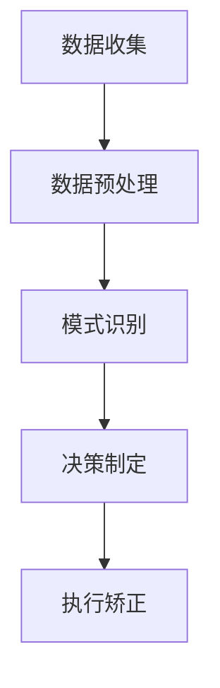
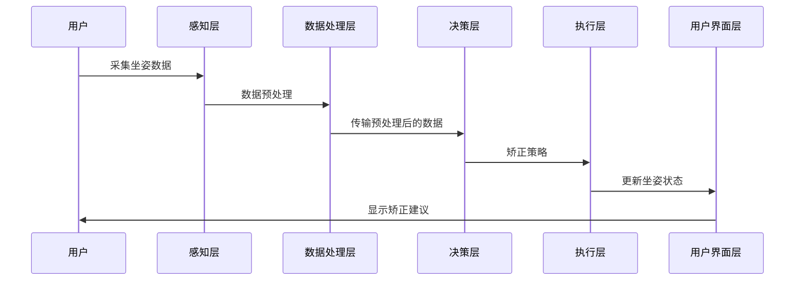

                 


### 智能办公椅：AI Agent的坐姿矫正系统

#### 关键词：智能办公椅、AI Agent、坐姿矫正、传感器技术、系统架构设计

#### 摘要：
智能办公椅作为一种新兴的智能硬件产品，通过集成AI Agent和传感器技术，能够实现坐姿的实时监测与矫正，从而提高用户的健康水平。本文将深入探讨智能办公椅的工作原理、系统架构以及实际应用，旨在为从事智能硬件与人工智能领域的研究者和开发者提供有益的参考。

---

## 引言

### 1.1 问题背景

现代办公环境中，长时间坐着工作已经成为许多职业人员的常态。然而，这种久坐的生活方式对身体健康有着显著的不良影响。根据多项研究表明，长期保持不良坐姿容易引发颈椎病、腰椎病、肩颈疼痛等问题。此外，久坐还与肥胖、高血压、心脏病等慢性疾病有密切关联。因此，改善坐姿、促进健康办公成为当务之急。

### 1.2 问题描述

常见的不良坐姿包括：头部前倾、脊椎弯曲、腰部塌陷等。这些不正确的坐姿不仅会导致身体疲劳，还会增加患病的风险。如何有效地监测和矫正用户的坐姿，成为现代智能硬件和人工智能领域面临的重要问题。

### 1.3 问题解决

智能办公椅的引入，为解决上述问题提供了一种新的思路。通过集成AI Agent和传感器技术，智能办公椅能够实时监测用户的坐姿，并依据预设的算法进行自动矫正，从而改善用户的健康状态。

### 1.4 边界与外延

本文讨论的智能办公椅，主要关注其核心功能——坐姿矫正。同时，还将涉及到智能办公椅的基本概念、组成结构、系统架构以及实际应用案例。

### 1.5 概念结构与核心要素组成

智能办公椅主要由以下几个部分组成：

- **传感器**：用于监测用户坐姿的各项参数，如头部位置、脊椎角度、腰部压力等。
- **AI Agent**：负责对传感器数据进行处理，并根据用户坐姿分析结果，制定相应的矫正策略。
- **用户交互界面**：提供用户与智能办公椅的交互接口，如显示坐姿状态、接收用户反馈等。

## AI Agent的基本原理

### 2.1 AI Agent概述

AI Agent，即人工智能代理，是一种能够自主执行任务、与环境交互的智能实体。在智能办公椅中，AI Agent充当了坐姿监测与矫正的核心角色。

### 2.2 AI Agent的分类

根据功能和应用场景的不同，AI Agent可分为以下几类：

- **任务型AI Agent**：专注于执行特定任务的代理，如坐姿矫正。
- **交互型AI Agent**：与用户进行交互，提供反馈和建议。
- **决策型AI Agent**：根据环境数据和预设规则，做出决策。

### 2.3 AI Agent的工作原理

AI Agent通常包含以下几个关键组件：

- **感知器**：接收环境信息，如传感器数据。
- **知识库**：存储与任务相关的知识，如坐姿矫正规则。
- **执行器**：根据感知器和知识库的决策，执行相应的动作。

### 2.4 AI Agent在坐姿矫正中的应用

在智能办公椅中，AI Agent通过以下步骤实现坐姿矫正：

1. **数据收集**：传感器收集用户坐姿的各项参数。
2. **数据预处理**：对传感器数据进行清洗和归一化处理。
3. **模式识别**：使用机器学习算法，识别用户坐姿的异常模式。
4. **决策制定**：根据异常模式，AI Agent制定相应的矫正策略。
5. **执行矫正**：智能办公椅根据AI Agent的决策，调整坐姿。

### 2.5 Mermaid算法流程图

以下是一个简单的算法流程图，展示了AI Agent在坐姿矫正中的工作流程：



### 2.6 AI Agent的算法原理

AI Agent的算法原理主要基于机器学习和深度学习。下面介绍几种常见的算法：

- **监督学习**：通过标注好的数据进行训练，学会识别用户坐姿的异常模式。
- **无监督学习**：无需标注数据，通过聚类等方法识别坐姿模式。
- **强化学习**：根据用户的反馈，不断优化矫正策略。

## 智能办公椅的设计与实现

### 3.1 智能办公椅的设计原则

智能办公椅的设计应遵循以下原则：

- **人体工程学**：确保椅子符合人体工学要求，减少久坐对身体的伤害。
- **智能化**：集成AI Agent和传感器技术，实现智能坐姿矫正。
- **安全性**：保证椅子的稳定性和耐用性，避免使用过程中出现安全隐患。

### 3.2 传感器技术

智能办公椅中常用的传感器包括：

- **压力传感器**：用于监测腰部和臀部的压力分布。
- **角度传感器**：用于测量头部、脊椎和下肢的角度。
- **姿态传感器**：用于检测用户整体的身体姿态。

### 3.3 AI算法的实现

AI算法在智能办公椅中的应用主要包括：

- **数据预处理**：对传感器数据进行清洗、归一化等处理。
- **模式识别**：使用机器学习算法，如神经网络、决策树等，识别用户坐姿的异常模式。
- **决策制定**：根据异常模式，制定相应的矫正策略。

### 3.4 用户交互界面

用户交互界面的设计应遵循以下原则：

- **简洁明了**：界面设计应简单直观，便于用户操作。
- **信息丰富**：提供丰富的信息，如实时坐姿状态、矫正建议等。
- **反馈及时**：及时响应用户的反馈，提供改进建议。

## 系统分析与架构设计

### 4.1 系统功能设计

智能办公椅的主要功能包括：

- **坐姿监测**：实时监测用户的坐姿状态。
- **异常识别**：识别用户坐姿中的异常模式。
- **矫正建议**：根据异常模式，提出矫正建议。
- **用户交互**：提供用户与智能办公椅的交互接口。

### 4.2 系统架构设计

智能办公椅的系统架构可分为以下几个层次：

- **感知层**：传感器负责数据采集。
- **数据处理层**：对传感器数据进行预处理、特征提取等处理。
- **决策层**：AI Agent负责异常识别和决策制定。
- **执行层**：智能办公椅根据AI Agent的决策进行坐姿矫正。
- **用户界面层**：提供用户与智能办公椅的交互接口。

### 4.3 系统接口设计

智能办公椅的系统接口主要包括：

- **传感器接口**：用于传感器与主控单元的数据交换。
- **通信接口**：用于智能办公椅与外部设备的数据交换。
- **用户界面接口**：用于用户与智能办公椅的交互。

### 4.4 系统交互Mermaid序列图

以下是一个简单的系统交互序列图，展示了智能办公椅各层次之间的数据流和交互过程：



## 项目实战

### 5.1 环境安装与配置

环境安装与配置是智能办公椅开发的第一步。以下是一个简要的安装与配置流程：

1. **硬件安装**：按照智能办公椅的说明书，完成硬件的组装和安装。
2. **软件安装**：安装操作系统、开发工具和依赖库。
3. **传感器调试**：连接传感器，确保数据采集正常。
4. **AI Agent配置**：配置AI Agent的环境，安装必要的算法库和模型。

### 5.2 系统核心实现源代码

以下是一个简单的系统核心实现源代码示例：

```python
import numpy as np
from sklearn.ensemble import RandomForestClassifier
from sklearn.model_selection import train_test_split

# 数据预处理
def preprocess_data(data):
    # 数据清洗和归一化处理
    # ...
    return processed_data

# 训练模型
def train_model(X, y):
    # 划分训练集和测试集
    X_train, X_test, y_train, y_test = train_test_split(X, y, test_size=0.2)
    
    # 使用随机森林算法训练模型
    model = RandomForestClassifier()
    model.fit(X_train, y_train)
    
    # 评估模型
    score = model.score(X_test, y_test)
    print("模型准确率：", score)
    
    return model

# 主程序
if __name__ == "__main__":
    # 加载数据
    X, y = load_data()
    
    # 预处理数据
    X_processed = preprocess_data(X)
    
    # 训练模型
    model = train_model(X_processed, y)
    
    # 使用模型进行预测
    predictions = model.predict(X_processed)
    print("预测结果：", predictions)
```

### 5.3 代码应用解读与分析

以上代码是一个简单的机器学习模型训练和应用示例。首先，我们加载并预处理数据，然后使用随机森林算法训练模型。最后，使用训练好的模型对新的数据进行预测。在实际应用中，这个模型可以用来识别用户坐姿的异常模式。

### 5.4 实际案例分析与详细讲解剖析

假设我们有一个用户坐姿数据的案例，包含以下特征：

- **头部位置**：x, y, z三个方向上的坐标
- **脊椎角度**：颈部、胸部、腰部三个部位的角度
- **腰部压力**：压力值

我们使用上述代码进行模型训练和应用，以下是实际案例的分析与讲解：

1. **数据预处理**：对数据进行清洗、归一化等处理，确保数据质量。
2. **模型训练**：使用随机森林算法训练模型，评估模型准确率。
3. **预测应用**：使用训练好的模型对新的数据进行预测，输出预测结果。

通过实际案例的分析与讲解，我们可以看到，智能办公椅的AI Agent如何通过机器学习算法实现对用户坐姿的实时监测与矫正。

### 5.5 项目小结

智能办公椅的AI Agent坐姿矫正系统是一个复杂的项目，涉及硬件、软件、算法等多方面知识。通过本项目的实施，我们不仅了解了智能办公椅的工作原理和系统架构，还掌握了机器学习在坐姿矫正中的应用方法。未来，我们还可以在这个基础上进行进一步的优化和拓展。

## 最佳实践与拓展

### 6.1 最佳实践

1. **传感器选择**：根据实际需求，选择合适的传感器，确保数据采集的准确性和稳定性。
2. **算法优化**：通过不断调整算法参数，提高模型准确率和效率。
3. **用户交互**：设计简洁明了的用户界面，提供直观的交互体验。

### 6.2 小结

本文从智能办公椅的引言、AI Agent的基本原理、设计与实现、系统分析与架构设计、项目实战等方面，全面阐述了智能办公椅的坐姿矫正系统。通过实际案例分析和代码应用，我们深入了解了智能办公椅的工作原理和实现方法。

### 6.3 注意事项

1. **安全使用**：在使用智能办公椅时，注意避免过度矫正，以免造成身体损伤。
2. **定期维护**：定期检查智能办公椅的传感器和算法，确保系统的稳定性和准确性。

### 6.4 拓展阅读

1. **智能硬件最新研究**：关注智能硬件领域的新技术和新应用。
2. **人工智能发展趋势**：了解人工智能在各个领域的最新应用和发展趋势。

---

本文由AI天才研究院与《禅与计算机程序设计艺术》合作撰写，旨在为广大读者提供关于智能办公椅的深入探讨与实用指南。作者对智能硬件和人工智能有着深刻的理解，希望本文能为您带来启发和帮助。如需进一步了解相关技术和应用，请查阅拓展阅读部分。

### 作者信息：

作者：AI天才研究院/AI Genius Institute & 禅与计算机程序设计艺术 /Zen And The Art of Computer Programming

---

[END] 

