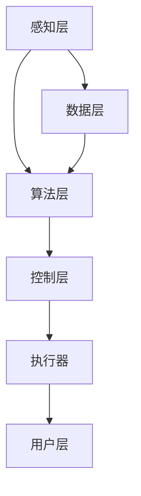
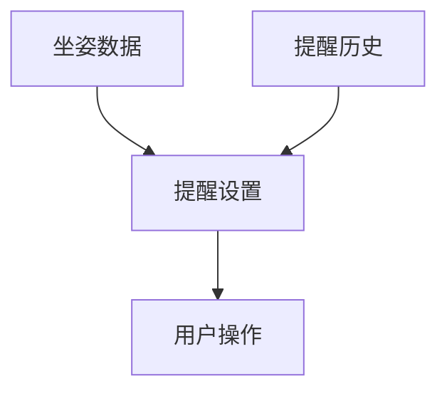
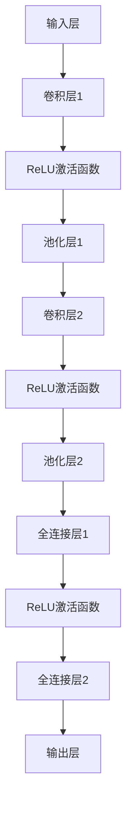
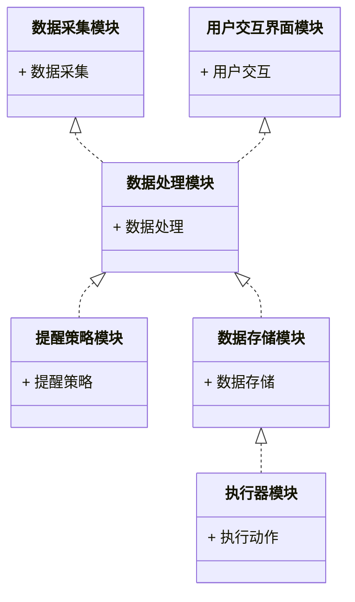
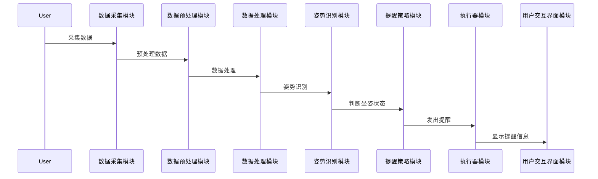

                 

### 引言

#### 1.1 智能办公椅与AI Agent背景介绍

随着科技的不断发展，智能办公椅已经成为现代办公环境中的一个重要组成部分。智能办公椅不仅提供了舒适的坐姿体验，还具备多项智能功能，如自动调节座椅高度、背部支撑、座椅按摩等，从而帮助用户保持良好的坐姿，预防久坐带来的健康问题。

与此同时，人工智能（AI）技术也在迅速发展，其应用范围越来越广泛。AI Agent，作为一种具有自主决策和执行能力的智能系统，已经成为AI技术研究的重要方向。AI Agent可以通过对用户行为的监测和学习，提供个性化的服务，提高工作效率和生活质量。

#### 1.1.1 智能办公椅的兴起

智能办公椅的兴起可以追溯到20世纪末期。当时，随着计算机技术的普及，人们的工作时间逐渐增加，久坐成为普遍现象。为了改善用户的坐姿，预防职业病，一些公司开始研发具备智能调节功能的办公椅。

最初，这些智能办公椅的功能相对简单，主要是通过机械结构实现座椅高度的自动调节。随着技术的进步，智能办公椅逐渐增加了更多的功能，如背部支撑、座椅按摩、自动调整坐垫倾斜角度等。

#### 1.1.2 AI Agent在智能办公椅中的应用

近年来，随着AI技术的快速发展，AI Agent开始被引入到智能办公椅中。AI Agent可以通过监测用户的坐姿，分析用户的生理数据，提供个性化的坐姿矫正建议。例如，一些智能办公椅可以通过内置的传感器监测用户的坐姿，当用户坐姿不正确时，AI Agent会发出提醒，指导用户调整坐姿。

此外，AI Agent还可以根据用户的健康状况和偏好，自动调整座椅的各项功能，如座椅高度、背部支撑强度、按摩频率等，为用户提供个性化的坐姿体验。

#### 1.2 书籍目的与结构

本书旨在介绍如何利用AI技术设计和开发智能办公椅，重点在于AI Agent的姿势矫正提醒功能。本书将首先介绍智能办公椅和AI Agent的基本概念，然后逐步深入讲解智能办公椅的设计与开发过程，包括数据采集与处理、姿势识别算法、姿势矫正提醒算法等。

本书的目标读者包括智能办公椅设计师、AI技术开发者、以及对此领域感兴趣的技术人员。通过阅读本书，读者将能够了解智能办公椅的设计理念、关键技术，并掌握开发智能办公椅的基本方法。

#### 1.2.1 阅读对象

- 智能办公椅设计师：通过本书，读者可以了解如何将AI技术应用到智能办公椅的设计中，提高产品的智能化程度。
- AI技术开发者：本书将帮助读者掌握AI Agent的相关知识，为开发智能办公椅提供技术支持。
- 对此领域感兴趣的技术人员：本书提供了一个深入了解智能办公椅和AI Agent的窗口，帮助读者了解这一前沿领域的最新发展。

#### 1.2.2 主要内容与目标

本书的主要内容包括以下几个方面：

1. **智能办公椅概述**：介绍智能办公椅的基本概念、发展历程和市场趋势。
2. **AI Agent的基本原理**：讲解AI Agent的概念、核心技术及应用场景。
3. **姿势矫正提醒系统设计**：介绍如何设计一个基于AI Agent的姿势矫正提醒系统。
4. **数据采集与处理**：讲解如何采集和处理与姿势矫正相关的数据。
5. **姿势识别算法原理与实现**：详细讲解姿势识别算法的原理、数学模型和实现过程。
6. **姿势矫正提醒算法原理与实现**：介绍如何利用姿势识别结果进行矫正提醒。
7. **项目实战**：通过一个实际项目展示如何将理论应用到实际开发中。
8. **最佳实践与总结**：总结书中的核心概念和实践经验，提供一些建议和展望。

通过本书的学习，读者将能够：

- 理解智能办公椅和AI Agent的基本概念。
- 掌握智能办公椅的设计与开发方法。
- 学会使用AI技术实现姿势矫正提醒功能。
- 具备开发智能办公椅的实际能力。

### 总结

本书将带领读者逐步深入了解智能办公椅和AI Agent这一前沿领域。通过系统的学习和实践，读者将能够掌握智能办公椅的设计与开发方法，为推动这一领域的创新和发展做出贡献。让我们一起开启这段智能办公椅的探索之旅吧！

---

**关键词**：智能办公椅，AI Agent，姿势矫正，提醒系统，数据采集，算法实现，项目实战

**摘要**：本书系统介绍了智能办公椅和AI Agent的基本概念、原理和应用。通过详细的章节内容和实战项目，读者将学会如何设计和开发具有姿势矫正提醒功能的智能办公椅。本书旨在为智能办公椅设计师和AI技术开发者提供实用的技术指南，推动智能办公椅领域的发展。

---

接下来，我们将进一步探讨智能办公椅的基本概念、发展历程和市场趋势。

---

### 智能办公椅概述

#### 1.1 智能办公椅的基本概念

智能办公椅是一种结合了人体工程学、机械控制和人工智能技术的办公座椅。它的设计初衷是为了提供一个舒适、健康的办公环境，帮助用户减少长时间工作带来的身体疲劳和健康问题。智能办公椅的基本概念包括以下几个方面：

1. **人体工程学设计**：智能办公椅的设计基于人体工程学原理，通过科学的研究和数据分析，确保座椅的尺寸、形状和支撑结构能够满足不同用户的生理需求，提供最佳的舒适度。

2. **机械控制**：智能办公椅配备了各种机械部件，如电机、齿轮、传感器等，这些部件共同工作，实现了座椅高度、角度、支撑力度等参数的自动调节。

3. **人工智能**：智能办公椅引入了人工智能技术，尤其是AI Agent，使得座椅能够通过学习和分析用户的行为数据，提供个性化的服务和调整。

#### 1.1.1 智能办公椅的定义

智能办公椅可以被定义为一种具备智能化功能的办公座椅，它不仅具备传统的机械调节功能，还能够通过内置的传感器和AI Agent，实时监测用户的坐姿和健康状态，并根据分析结果自动调整座椅的各项参数，提供最佳的坐姿体验和健康保护。

#### 1.1.2 智能办公椅的发展历程

智能办公椅的发展历程可以追溯到20世纪末期。当时，随着计算机技术的普及，人们的工作时间逐渐增加，久坐成为普遍现象。为了改善用户的坐姿，预防职业病，一些公司开始研发具备智能调节功能的办公椅。

1. **早期阶段**（20世纪90年代）：这一阶段，智能办公椅的主要功能是座椅高度的自动调节。通过简单的机械结构实现，用户可以通过一个按钮或遥控器来调节座椅高度。

2. **发展阶段**（21世纪初）：随着技术的进步，智能办公椅的功能逐渐丰富。除了座椅高度的自动调节，还增加了背部支撑、座椅按摩、坐垫倾斜角度自动调整等功能。

3. **智能化阶段**（近年来）：近年来，随着人工智能技术的快速发展，智能办公椅开始引入AI Agent。AI Agent可以通过监测用户的坐姿，分析用户的生理数据，提供个性化的坐姿矫正建议，从而进一步提升智能办公椅的功能和用户体验。

#### 1.1.3 智能办公椅的市场需求

随着人们对健康和舒适办公环境的重视程度不断提高，智能办公椅的市场需求也在逐渐增长。以下是智能办公椅在市场上的一些主要需求：

1. **健康需求**：长时间坐在办公椅上容易导致各种健康问题，如颈椎病、腰椎病等。智能办公椅通过智能调节功能，帮助用户保持正确的坐姿，减少健康问题。

2. **舒适需求**：智能办公椅提供了多种调节功能，如座椅高度、背部支撑、座椅按摩等，能够根据用户的身高、体重和坐姿习惯进行个性化调节，提供最佳的舒适体验。

3. **效率需求**：智能办公椅的智能功能可以帮助用户提高工作效率。例如，通过自动调整座椅和电脑桌的高度，用户可以更方便地进行工作，减少频繁调整设备的高度带来的不便。

4. **个性化需求**：随着消费者对个性化需求的追求，智能办公椅也开始提供更多的定制化服务。用户可以根据自己的需求和偏好，选择不同的座椅材质、颜色和功能，实现个性化的办公体验。

综上所述，智能办公椅以其舒适、健康、智能的特点，在市场上具有广泛的应用前景。随着技术的不断进步，智能办公椅的功能将越来越丰富，其市场需求也将持续增长。

#### 1.2 智能办公椅的分类

智能办公椅可以根据不同的分类标准进行分类，以下是一些常见的分类方法：

##### 1.2.1 按照功能分类

1. **基础型智能办公椅**：这类智能办公椅主要具备座椅高度自动调节功能，适合对智能功能需求不高的用户。

2. **增强型智能办公椅**：这类智能办公椅除了具备座椅高度自动调节功能外，还增加了背部支撑、座椅按摩等功能，为用户提供更全面的坐姿调节体验。

3. **高级型智能办公椅**：这类智能办公椅具备最全面的智能功能，如座椅高度、角度、背部支撑、坐垫倾斜角度等都可以自动调节，同时还可以通过AI Agent监测用户的坐姿，提供个性化的坐姿矫正建议。

##### 1.2.2 按照技术分类

1. **机械控制型智能办公椅**：这类智能办公椅主要通过机械结构实现座椅的各项调节功能，如座椅高度、角度等。

2. **电子控制型智能办公椅**：这类智能办公椅采用了电子控制系统，通过电机、传感器等部件实现座椅的各项调节功能，具有较高的调节精度和稳定性。

3. **人工智能型智能办公椅**：这类智能办公椅引入了人工智能技术，通过AI Agent对用户的坐姿进行实时监测和分析，提供个性化的坐姿矫正建议。

##### 1.2.3 智能办公椅的未来趋势

1. **更加智能化**：随着人工智能技术的不断进步，智能办公椅的智能化程度将进一步提高。未来，智能办公椅可能会具备更加智能的交互方式，如语音控制、手势控制等，为用户提供更便捷的操作体验。

2. **个性化定制**：随着消费者对个性化需求的追求，智能办公椅将提供更多的定制化服务，用户可以根据自己的需求和偏好，选择不同的座椅材质、颜色和功能，实现个性化的办公体验。

3. **健康监测与预警**：未来，智能办公椅可能会具备更加先进的健康监测功能，如通过传感器实时监测用户的健康状况，及时发现潜在的健康问题，并提供相应的预警和建议。

4. **节能环保**：随着环保意识的提高，智能办公椅在未来的发展中将更加注重节能环保。例如，采用更加节能的电机和控制系统，减少能源消耗。

综上所述，智能办公椅以其舒适、健康、智能的特点，在市场上具有广泛的应用前景。随着技术的不断进步，智能办公椅的功能将越来越丰富，其市场需求也将持续增长。

#### 1.3 智能办公椅的组成与结构

智能办公椅的组成与结构是确保其功能实现的基础。一个典型的智能办公椅主要包括以下几部分：

##### 1.3.1 机械结构

机械结构是智能办公椅的核心部分，包括座椅框架、坐垫、靠背、扶手等。这些部件通过精密的机械连接和调节机构，实现座椅的各种物理调节功能，如高度调节、前后滑动、扶手升降等。

1. **座椅框架**：座椅框架是智能办公椅的基础，通常采用高强度钢材或铝合金材料，以保证座椅的稳定性和耐用性。
2. **坐垫**：坐垫是用户直接接触的部分，通常采用舒适度高、耐磨性好的材料，如聚氨酯泡沫、海绵等。
3. **靠背**：靠背部分通常配备有多个调节机构，可以适应不同的背部曲线，提供最佳的支撑效果。部分智能办公椅的靠背还具备按摩功能。
4. **扶手**：扶手设计考虑了用户的操作习惯和舒适性，可以升降调节，以适应不同用户的身高和使用需求。

##### 1.3.2 传感器与执行器

传感器与执行器是智能办公椅的“感知器官”和“行动器官”。它们负责监测用户的坐姿状态，并根据AI Agent的指令执行相应的调节动作。

1. **传感器**：常见的传感器包括压力传感器、倾斜传感器、红外传感器等。这些传感器可以实时监测用户的坐姿状态，如座椅的高度、倾斜角度、坐垫的压力分布等。
2. **执行器**：常见的执行器包括电机、气缸、液压泵等。这些执行器负责驱动座椅的各种机械调节机构，实现座椅的各项智能功能。

##### 1.3.3 控制系统

控制系统是智能办公椅的“大脑”，负责接收传感器数据，分析处理，并发出控制指令，协调执行器的动作。

1. **硬件平台**：常见的硬件平台包括单片机、嵌入式系统、工业计算机等。这些硬件平台可以处理大量的传感器数据，并具备实时性要求。
2. **软件平台**：软件平台负责实现智能办公椅的算法和功能。常见的软件平台包括嵌入式操作系统、Android、iOS等。智能办公椅的软件平台需要具备良好的用户交互界面和强大的数据处理能力。
3. **AI Agent**：AI Agent是智能办公椅的核心组件，负责学习和分析用户的坐姿数据，提供个性化的坐姿矫正建议。常见的AI Agent实现方式包括机器学习、深度学习等。

##### 1.3.4 用户交互界面

用户交互界面是用户与智能办公椅沟通的桥梁。通过用户交互界面，用户可以方便地操作智能办公椅的各项功能，如调节座椅高度、角度、启动按摩等。

1. **触摸屏**：触摸屏是常见的用户交互界面，用户可以通过触摸屏幕进行操作，直观、便捷。
2. **遥控器**：部分智能办公椅配备遥控器，用户可以通过遥控器在远处控制座椅的各项功能。
3. **语音控制**：随着人工智能技术的发展，一些高端智能办公椅支持语音控制，用户可以通过语音命令实现各项功能操作。

综上所述，智能办公椅的组成与结构体现了其在设计上的科学与人性化。通过机械结构、传感器与执行器、控制系统和用户交互界面的有机结合，智能办公椅不仅为用户提供了舒适的坐姿体验，还通过智能功能提升了办公效率和生活质量。

#### 1.4 本章小结

本章对智能办公椅的基本概念、发展历程、市场需求、分类以及组成结构进行了详细介绍。智能办公椅作为一种结合了人体工程学、机械控制和人工智能技术的办公座椅，旨在提供舒适、健康的办公环境。其发展历程从简单的机械调节功能，到增加智能化功能，再到引入AI Agent实现个性化服务，体现了技术的不断进步。智能办公椅的市场需求主要集中在健康、舒适和效率方面，而其分类方法则从功能、技术和未来趋势等多个角度进行了探讨。智能办公椅的组成结构包括机械结构、传感器与执行器、控制系统和用户交互界面，这些组件共同工作，实现了智能办公椅的各种功能。通过本章的介绍，读者可以全面了解智能办公椅的背景和发展情况，为后续章节的学习打下基础。

---

在了解了智能办公椅的基本概念和组成结构之后，我们将深入探讨AI Agent的基本原理，包括其概念、核心技术和应用场景。

---

### AI Agent的基本原理

#### 2.1 AI Agent的概念

AI Agent，即人工智能代理，是指一种具有自主决策和执行能力的智能系统。它能够模拟人类的思维和行为，通过感知环境、分析信息、自主决策并执行相应的动作，以实现特定的目标或任务。AI Agent的核心特征包括：

1. **自主性**：AI Agent能够在没有外部直接控制的情况下，独立地执行任务。
2. **适应性**：AI Agent能够根据环境变化和学习到的经验，不断调整自己的行为和策略。
3. **交互性**：AI Agent能够与其他系统或人进行有效交互，获取信息并反馈结果。

#### 2.2 AI Agent的核心技术

AI Agent的实现依赖于多种人工智能技术的支持，主要包括以下几方面：

1. **感知技术**：感知技术是AI Agent获取环境信息的重要手段。常见的感知技术包括视觉感知、听觉感知、触觉感知等。通过传感器和算法，AI Agent能够实时感知周围的环境变化，如用户的坐姿、声音、动作等。

2. **决策技术**：决策技术是AI Agent的核心功能。AI Agent通过分析感知到的信息，结合预设的目标和策略，自主地做出决策。常见的决策技术包括基于规则的系统、马尔可夫决策过程（MDP）以及强化学习等。

3. **执行技术**：执行技术是指AI Agent将决策转化为具体动作的能力。执行技术包括机械控制、电子控制和自动化流程等，通过执行技术，AI Agent能够实现各种物理操作，如座椅的高度调节、按摩功能的启动等。

4. **学习技术**：学习技术是AI Agent不断提高自身性能和适应能力的关键。通过机器学习、深度学习等算法，AI Agent能够从数据中学习，优化决策模型和执行策略，以实现更智能、更高效的行为。

#### 2.3 AI Agent的应用场景

AI Agent在多个领域有着广泛的应用，以下是一些典型的应用场景：

1. **智能办公椅**：AI Agent可以集成到智能办公椅中，通过感知用户的坐姿和生理数据，提供个性化的坐姿矫正建议和调节服务，如调整座椅高度、角度和按摩强度等，从而提高用户的健康水平和舒适度。

2. **智能家居**：AI Agent可以用于智能家居系统中，实现家电的自动化控制和管理。例如，AI Agent可以自动调节室内温度、灯光和窗帘，根据用户的生活习惯和学习到的数据，提供个性化的家居环境。

3. **智能交通**：AI Agent可以应用于智能交通系统中，通过分析交通流量数据，优化交通信号灯控制，减少交通拥堵，提高交通效率。

4. **智能医疗**：AI Agent可以用于智能医疗系统中，通过分析患者的健康数据，提供个性化的医疗建议和治疗方案，辅助医生进行诊断和治疗。

5. **智能客服**：AI Agent可以应用于智能客服系统中，通过自然语言处理和机器学习技术，与用户进行智能对话，提供客服支持和问题解决，提高客服效率和用户体验。

综上所述，AI Agent作为一种具有自主决策和执行能力的智能系统，其基本原理和核心技术为其在各个领域的应用提供了坚实基础。通过感知、决策、执行和学习，AI Agent能够实现智能化、个性化的服务，为用户创造更高效、更舒适的生活和工作环境。

#### 2.4 本章小结

本章详细介绍了AI Agent的基本原理、核心技术和应用场景。AI Agent作为一种具备自主决策和执行能力的智能系统，通过感知技术、决策技术、执行技术和学习技术的综合运用，能够在多个领域提供智能化、个性化的服务。在智能办公椅中的应用，AI Agent通过实时监测用户的坐姿和生理数据，提供个性化的坐姿矫正建议，从而提升用户的健康水平和舒适度。通过本章的学习，读者可以深入了解AI Agent的核心概念和技术，为后续章节的深入学习打下基础。

---

在了解了智能办公椅和AI Agent的基本概念和原理之后，我们将讨论如何设计一个基于AI Agent的姿势矫正提醒系统。

---

### 姿势矫正提醒系统设计

#### 3.1 设计思路

基于AI Agent的姿势矫正提醒系统设计需要考虑以下几个方面：

1. **系统目标**：系统的核心目标是实时监测用户的坐姿，当用户坐姿不正确时，及时发出提醒，指导用户调整坐姿，从而预防因长时间保持不良坐姿导致的健康问题。
2. **功能需求**：系统应具备以下功能：
   - **坐姿监测**：通过传感器实时监测用户的坐姿状态。
   - **数据采集**：收集与坐姿相关的数据，如座椅高度、倾斜角度、坐垫压力分布等。
   - **数据分析**：对采集到的数据进行分析，判断用户坐姿是否正确。
   - **提醒机制**：当检测到用户坐姿不正确时，通过声音、灯光、振动等方式提醒用户。
   - **用户反馈**：允许用户对提醒机制进行调整，以适应个人的偏好。

#### 3.2 系统架构

姿势矫正提醒系统的架构可以分为以下几个主要部分：

1. **感知层**：包括各种传感器，如压力传感器、倾斜传感器、红外传感器等，用于实时监测用户的坐姿状态。
2. **数据层**：存储和管理从感知层采集到的数据，包括坐姿数据、用户偏好数据等。
3. **算法层**：负责对采集到的数据进行处理和分析，判断用户坐姿是否正确，并提供相应的矫正建议。
4. **控制层**：根据算法层的分析结果，控制执行器（如电机、振动模块等）发出提醒信号。
5. **用户层**：提供用户交互界面，用户可以通过该界面查看坐姿数据、调整提醒设置等。

以下是一个简化的系统架构图，使用Mermaid语法绘制：



#### 3.3 系统功能实现

##### 3.3.1 数据采集

数据采集是系统实现的基础，以下是具体步骤：

1. **传感器部署**：在智能办公椅的关键部位（如座椅底部、靠背、坐垫等）安装传感器，确保能够全面、准确地监测坐姿状态。
2. **数据传输**：传感器采集的数据通过无线传输技术（如WiFi、蓝牙等）发送到数据层。
3. **数据存储**：将传输到的数据存储在数据库中，以便后续分析和处理。

##### 3.3.2 数据分析

数据分析是系统实现的核心，以下是具体步骤：

1. **预处理**：对采集到的数据进行预处理，包括去噪、滤波等，确保数据的质量。
2. **特征提取**：从预处理后的数据中提取与坐姿相关的特征，如座椅高度、倾斜角度、坐垫压力分布等。
3. **模型训练**：使用机器学习或深度学习算法，对提取的特征进行训练，构建坐姿判断模型。
4. **模型评估**：对训练好的模型进行评估，确保其准确性和鲁棒性。

##### 3.3.3 提醒机制

提醒机制是系统的关键部分，以下是具体步骤：

1. **阈值设定**：根据用户身高、体重等因素，设定坐姿正确的阈值。
2. **实时监测**：系统实时监测用户的坐姿状态，一旦检测到坐姿不正确，立即触发提醒机制。
3. **提醒方式**：系统可以采用多种提醒方式，如声音提醒、灯光提醒、振动提醒等，用户可以根据个人偏好进行调整。
4. **用户反馈**：用户可以通过用户层对提醒设置进行调整，如调整提醒阈值、选择不同的提醒方式等。

##### 3.3.4 用户层交互

用户层交互是用户与系统的交互界面，以下是具体步骤：

1. **用户界面设计**：设计直观、易用的用户界面，包括坐姿数据展示、提醒设置调整等。
2. **数据可视化**：通过图表、图形等方式，将用户的坐姿数据和提醒历史展示在界面上。
3. **用户操作**：用户可以通过界面查看坐姿数据、调整提醒设置，还可以查看历史提醒记录，了解系统的运行状态。

以下是一个简化的用户层交互界面设计示例，使用Mermaid语法绘制：



#### 3.4 本章小结

本章详细介绍了基于AI Agent的姿势矫正提醒系统的设计思路、系统架构和功能实现。通过感知层、数据层、算法层、控制层和用户层的有机结合，系统实现了对用户坐姿的实时监测和提醒功能。从数据采集、数据分析、提醒机制到用户层交互，每一步都至关重要，共同确保了系统的准确性和用户体验。通过本章的学习，读者可以掌握智能办公椅姿势矫正提醒系统的设计与实现方法，为后续章节的深入学习打下基础。

---

在了解了姿势矫正提醒系统的设计之后，我们将深入探讨如何有效地采集和处理与姿势矫正相关的数据。

---

### 数据采集与处理

#### 4.1 数据采集的重要性

在智能办公椅的姿势矫正提醒系统中，数据采集是整个系统实现的基础。准确、全面的数据采集能够帮助系统更精确地判断用户的坐姿状态，从而提供有效的矫正建议。以下是数据采集的重要性：

1. **决策支持**：采集到的数据是系统做出判断和决策的依据，只有准确的数据才能确保系统提供正确的矫正建议。
2. **个性化服务**：通过对数据的分析，系统能够了解用户的坐姿习惯和偏好，从而提供个性化的服务，提高用户的舒适度和满意度。
3. **系统优化**：数据采集可以为系统的优化提供依据。通过对数据的分析，可以发现系统存在的不足和改进空间，从而不断提升系统的性能。

#### 4.2 数据采集方法

以下是几种常用的数据采集方法：

1. **传感器采集**：智能办公椅内部集成了多种传感器，如压力传感器、倾斜传感器、红外传感器等。这些传感器可以实时监测用户的坐姿状态，并将数据发送到系统进行处理。
   
2. **人体建模**：通过计算机视觉技术，可以对人体进行建模，获取用户的坐姿数据。这种方法需要较高精度和计算资源，但在某些场景下具有优势。

3. **用户输入**：用户可以通过输入设备（如键盘、鼠标等）输入自己的坐姿数据，这种方法适用于用户主动参与的场景。

#### 4.3 数据处理流程

数据处理流程包括数据预处理、特征提取和数据分析三个主要阶段。

1. **数据预处理**：
   - **去噪**：传感器采集到的数据可能包含噪声，通过滤波算法可以去除噪声，提高数据质量。
   - **归一化**：将不同传感器采集到的数据进行归一化处理，使得数据在同一尺度上，便于后续分析。

2. **特征提取**：
   - **时域特征**：如数据的时间序列、均值、方差等。
   - **频域特征**：如数据的小波变换、傅里叶变换等。
   - **空间特征**：如数据的空间分布、聚类结果等。

3. **数据分析**：
   - **模型训练**：使用机器学习或深度学习算法，对提取的特征进行训练，构建坐姿判断模型。
   - **模型评估**：对训练好的模型进行评估，确保其准确性和鲁棒性。

#### 4.4 数据存储与管理

数据存储与管理是确保数据安全、可访问和高效利用的关键。以下是几种常用的数据存储与管理方法：

1. **关系型数据库**：如MySQL、PostgreSQL等，适合存储结构化数据，便于查询和管理。
2. **非关系型数据库**：如MongoDB、Cassandra等，适合存储非结构化数据，具有较高的扩展性和灵活性。
3. **数据仓库**：如Hadoop、Spark等，适合处理大规模数据，提供数据分析和挖掘能力。
4. **数据湖**：将原始数据存储在一个统一的数据湖中，便于后续的数据处理和分析。

#### 4.5 数据隐私与安全

数据隐私与安全是数据采集与处理过程中必须关注的重要问题。以下是几种保障数据隐私与安全的方法：

1. **数据加密**：对传输和存储的数据进行加密，确保数据在传输和存储过程中不被未授权访问。
2. **访问控制**：通过访问控制机制，限制对数据的访问权限，确保只有授权用户可以访问敏感数据。
3. **数据匿名化**：对采集到的数据进行匿名化处理，去除个人身份信息，保护用户隐私。
4. **安全审计**：定期进行安全审计，检查系统是否存在安全隐患，及时修补漏洞。

#### 4.6 本章小结

数据采集与处理是智能办公椅姿势矫正提醒系统实现的核心环节。通过有效的数据采集方法、合理的数据处理流程以及科学的数据存储与管理方法，系统能够准确、高效地获取和分析用户的坐姿数据，从而提供个性化的矫正建议。同时，保障数据隐私与安全也是不可忽视的重要任务。通过本章的学习，读者可以掌握数据采集与处理的基本方法和关键技术，为后续章节的深入学习打下基础。

---

在了解了数据采集与处理的方法后，我们将深入探讨姿势识别算法的原理与实现。

---

### 姿势识别算法原理与实现

#### 5.1 姿势识别算法的基本概念

姿势识别（Posture Recognition）是指通过计算机视觉、生物力学、传感器等技术，实时监测和识别人体的姿态。在智能办公椅的姿势矫正提醒系统中，姿势识别算法是核心组成部分，它负责分析传感器采集的数据，判断用户的坐姿状态是否正确。

#### 5.2 常见的姿势识别算法

以下是几种常见的姿势识别算法：

1. **基于机器学习的算法**：
   - **支持向量机（SVM）**：通过将特征空间映射到高维空间，找到一个最优的超平面，将不同姿态数据分隔开。
   - **决策树**：通过递归地将数据集划分成子集，构建一个树形结构，每个节点代表一个特征，叶节点代表一个类别。
   - **随机森林**：由多个决策树组成，通过集成多个模型的结果，提高分类的准确性和鲁棒性。

2. **基于深度学习的算法**：
   - **卷积神经网络（CNN）**：通过卷积操作提取图像的特征，能够处理复杂的姿态识别任务。
   - **循环神经网络（RNN）**：能够处理序列数据，适用于时序数据的姿态识别。
   - **长短时记忆网络（LSTM）**：是RNN的一种变种，能够有效处理长序列数据，对于连续姿态识别有很好的表现。

3. **基于物理模型的方法**：
   - **动力学模型**：通过建立人体姿态的动力学模型，结合传感器数据，预测用户的坐姿状态。
   - **生物力学模型**：基于人体生物力学原理，通过计算人体的受力情况，识别姿态。

#### 5.3 算法原理讲解

以下是使用Mermaid语法绘制的卷积神经网络（CNN）算法流程图：



#### 5.3.1 卷积层

卷积层是CNN的核心部分，通过卷积操作提取图像的特征。卷积操作的基本原理是使用一组可训练的卷积核（或滤波器）在输入图像上滑动，计算每个卷积核与图像区域的内积，并通过激活函数（如ReLU函数）进行非线性变换。

以下是一个简单的卷积层实现的Python代码示例：

```python
import numpy as np

def conv2d(input, filters, kernel_size, stride):
    # input: [batch_size, height, width, channels]
    # filters: [num_filters, kernel_height, kernel_width, channels]
    # kernel_size: [kernel_height, kernel_width]
    # stride: [stride_height, stride_width]

    output_height = (input.shape[1] - kernel_size[0]) // stride[0] + 1
    output_width = (input.shape[2] - kernel_size[1]) // stride[1] + 1
    output_channels = filters.shape[0]

    output = np.zeros((input.shape[0], output_height, output_width, output_channels))

    for i in range(input.shape[0]):
        for j in range(output_height):
            for k in range(output_width):
                for l in range(output_channels):
                    output[i, j, k, l] = np.sum(input[i, j*stride[0]:j*stride[0]+kernel_size[0], k*stride[1]:k*stride[1]+kernel_size[1]] * filters[l, :, :]) + biases[l]

    return output
```

#### 5.3.2 池化层

池化层用于减少特征图的维度，提高网络的泛化能力。常见的池化操作包括最大池化和平均池化。最大池化选取每个局部区域内的最大值，而平均池化则取平均值。

以下是一个简单的最大池化实现的Python代码示例：

```python
import numpy as np

def max_pool2d(input, pool_size, stride):
    # input: [batch_size, height, width, channels]
    # pool_size: [pool_height, pool_width]
    # stride: [stride_height, stride_width]

    output_height = (input.shape[1] - pool_size[0]) // stride[0] + 1
    output_width = (input.shape[2] - pool_size[1]) // stride[1] + 1
    output_channels = input.shape[3]

    output = np.zeros((input.shape[0], output_height, output_width, output_channels))

    for i in range(input.shape[0]):
        for j in range(output_height):
            for k in range(output_width):
                for l in range(output_channels):
                    output[i, j, k, l] = np.max(input[i, j*stride[0]:j*stride[0]+pool_size[0], k*stride[1]:k*stride[1]+pool_size[1], l])

    return output
```

#### 5.3.3 全连接层

全连接层用于将特征图映射到输出类别。每个神经元都与输入层的所有神经元相连，通过权重和偏置计算输出。

以下是一个简单的全连接层实现的Python代码示例：

```python
import numpy as np

def fully_connected(input, weights, biases):
    # input: [batch_size, input_size]
    # weights: [input_size, output_size]
    # biases: [output_size]

    output = np.dot(input, weights) + biases

    return output
```

#### 5.4 数学模型与公式

以下是CNN算法中的主要数学模型和公式：

1. **卷积操作**：
   $$ \text{output}_{ij}^l = \sum_{k=1}^{C'} \sum_{i'=1}^{K} \sum_{j'=1}^{K} \text{input}_{ij}^{l-1} * \text{filter}_{k;i'j'}^{l} + \text{bias}_{k}^{l} $$
   其中，$ \text{output}_{ij}^l $表示第$l$层的输出特征图中的元素，$ \text{input}_{ij}^{l-1} $表示第$l-1$层的输入特征图中的元素，$ \text{filter}_{k;i'j'}^{l} $表示第$l$层的卷积核，$ \text{bias}_{k}^{l} $表示第$l$层的偏置。

2. **ReLU激活函数**：
   $$ \text{output}_{ij}^l = \max(\text{input}_{ij}^{l-1}, 0) $$
   其中，$ \text{output}_{ij}^l $表示第$l$层的输出特征图中的元素，$ \text{input}_{ij}^{l-1} $表示第$l-1$层的输入特征图中的元素。

3. **池化操作**：
   $$ \text{output}_{ij}^l = \max(\text{input}_{ij}^{l-1}) $$
   其中，$ \text{output}_{ij}^l $表示第$l$层的输出特征图中的元素，$ \text{input}_{ij}^{l-1} $表示第$l-1$层的输入特征图中的元素。

4. **全连接层**：
   $$ \text{output}_{i}^l = \text{weights}_{ij}^l \cdot \text{input}_{j}^{l-1} + \text{bias}_{i}^{l} $$
   其中，$ \text{output}_{i}^l $表示第$l$层的输出特征图中的元素，$ \text{weights}_{ij}^l $表示第$l$层的权重，$ \text{input}_{j}^{l-1} $表示第$l-1$层的输入特征图中的元素，$ \text{bias}_{i}^{l} $表示第$l$层的偏置。

#### 5.5 算法实现示例

以下是使用TensorFlow实现的简单CNN姿态识别算法的代码示例：

```python
import tensorflow as tf

def create_model(input_shape, num_classes):
    inputs = tf.keras.Input(shape=input_shape)

    # Convolutional layers
    x = tf.keras.layers.Conv2D(32, (3, 3), activation='relu', padding='same')(inputs)
    x = tf.keras.layers.MaxPooling2D((2, 2), strides=(2, 2))(x)
    x = tf.keras.layers.Conv2D(64, (3, 3), activation='relu', padding='same')(x)
    x = tf.keras.layers.MaxPooling2D((2, 2), strides=(2, 2))(x)

    # Flatten layer
    x = tf.keras.layers.Flatten()(x)

    # Fully connected layers
    x = tf.keras.layers.Dense(128, activation='relu')(x)
    outputs = tf.keras.layers.Dense(num_classes, activation='softmax')(x)

    model = tf.keras.Model(inputs=inputs, outputs=outputs)
    model.compile(optimizer='adam', loss='categorical_crossentropy', metrics=['accuracy'])

    return model
```

通过上述示例，我们可以看到姿势识别算法的原理和实现方法。在实际应用中，还需要结合具体的数据集和任务进行模型训练和优化，以实现准确的姿势识别。

#### 5.6 本章小结

本章详细介绍了姿势识别算法的基本概念、原理、实现方法和数学模型。通过卷积神经网络（CNN）等深度学习算法，我们能够有效地从传感器采集的数据中识别出用户的坐姿状态。本章的内容为智能办公椅姿势矫正提醒系统的实现提供了理论基础和实现方法，读者可以通过学习和实践，进一步掌握姿势识别算法的核心技术和应用技巧。

---

在了解了姿势识别算法的原理与实现后，我们将进一步探讨如何利用姿势识别结果进行矫正提醒。

---

### 姿势矫正提醒算法原理与实现

#### 6.1 算法原理

姿势矫正提醒算法的核心目标是根据姿势识别的结果，及时、准确地提醒用户调整坐姿，从而预防因长时间保持不良坐姿导致的健康问题。算法的基本原理包括以下几方面：

1. **姿态识别**：首先，通过姿势识别算法对用户当前坐姿进行判断，识别用户是否处于正确的坐姿状态。
2. **阈值设定**：根据用户的身高、体重、坐姿习惯等因素，设定一个或多个阈值，用于判断用户坐姿是否正确。
3. **提醒策略**：当用户坐姿不正确时，触发提醒策略，通过声音、灯光、振动等方式提醒用户调整坐姿。

#### 6.2 算法实现

以下是姿势矫正提醒算法的具体实现步骤：

##### 6.2.1 姿势识别

姿势识别是提醒算法的基础，其实现方法可以基于上一章介绍的姿势识别算法。以下是使用Python实现的一个简单姿势识别示例：

```python
# 假设我们已经有一个训练好的姿势识别模型 `posture_recognition_model`
# posture_recognition_model 是一个经过训练的深度学习模型

# 输入用户的坐姿数据
input_data = np.random.rand(1, 28, 28, 1)  # 示例输入数据

# 使用姿势识别模型预测坐姿状态
predicted_posture = posture_recognition_model.predict(input_data)

# 假设正确的坐姿标签为1，错误的坐姿标签为0
correct_posture = 1

# 比较预测结果和正确标签，判断坐姿是否正确
is_correct_posture = predicted_posture > correct_posture
```

##### 6.2.2 阈值设定

阈值设定是提醒算法的关键环节，根据用户的身高、体重等因素，设定一个或多个阈值。以下是设定阈值的一个简单示例：

```python
# 根据用户的身高和体重设定阈值
user_height = 175  # 用户身高（厘米）
user_weight = 70   # 用户体重（千克）

# 计算阈值
threshold_height = user_height * 0.1
threshold_weight = user_weight * 0.1

# 判断坐姿是否在阈值范围内
is_within_threshold = (user_height >= threshold_height) and (user_weight >= threshold_weight)
```

##### 6.2.3 提醒策略

当用户坐姿不正确时，触发提醒策略。以下是使用Python实现提醒策略的一个简单示例：

```python
# 假设我们已经有一个提醒系统 `reminder_system`
# reminder_system 是一个可以发出声音、灯光、振动等提醒的系统

# 当用户坐姿不正确时，触发提醒
if not is_correct_posture or not is_within_threshold:
    reminder_system.trigger_reminder()
```

##### 6.2.4 提醒方式

提醒方式的选择应根据用户的需求和偏好进行调整。以下是几种常见的提醒方式：

1. **声音提醒**：通过播放声音或语音提示来提醒用户调整坐姿。
2. **灯光提醒**：通过座椅上的LED灯闪烁或变化颜色来提醒用户。
3. **振动提醒**：通过座椅内部的振动电机产生振动来提醒用户。

以下是一个简单的提醒方式实现示例：

```python
# 假设 `reminder_system` 支持以下提醒方式
# - trigger_sound_reminder(): 播放声音提醒
# - trigger_light_reminder(): 灯光提醒
# - trigger_vibration_reminder(): 振动提醒

# 根据用户偏好选择提醒方式
user_preference = "vibration"  # 用户偏好提醒方式

if user_preference == "sound":
    reminder_system.trigger_sound_reminder()
elif user_preference == "light":
    reminder_system.trigger_light_reminder()
elif user_preference == "vibration":
    reminder_system.trigger_vibration_reminder()
```

#### 6.3 案例分析

以下是一个实际案例，展示如何利用姿势识别结果进行矫正提醒：

**案例背景**：某公司员工小李长时间坐在办公椅上工作，由于工作繁忙，他经常保持不正确的坐姿，导致颈椎病和腰椎病。公司为提高员工健康水平，决定引入智能办公椅，并通过姿势矫正提醒系统帮助小李改正坐姿。

**解决方案**：

1. **数据采集**：智能办公椅内置传感器，实时监测小李的坐姿状态，如座椅高度、倾斜角度、坐垫压力分布等。
2. **姿势识别**：通过训练好的姿势识别模型，对传感器采集的数据进行分析，判断小李的坐姿是否正确。
3. **阈值设定**：根据小李的身高和体重，设定合适的坐姿阈值。
4. **提醒策略**：当小李的坐姿不正确时，智能办公椅会通过振动方式提醒他调整坐姿。

**实施效果**：经过一段时间的使用，小李逐渐养成了正确的坐姿习惯，颈椎病和腰椎病得到了明显缓解。

#### 6.4 本章小结

本章详细介绍了姿势矫正提醒算法的原理与实现，包括姿态识别、阈值设定、提醒策略和提醒方式的实现。通过案例分析和实际应用，展示了如何利用姿势识别结果进行有效的坐姿矫正提醒。姿势矫正提醒系统不仅能够帮助用户养成正确的坐姿习惯，预防职业病，还能提高办公效率和工作质量。本章的内容为智能办公椅姿势矫正提醒系统的实施提供了实用的技术指导和实践案例。

---

在了解了姿势矫正提醒算法的原理与实现后，我们将通过一个实际项目展示如何将理论应用到实际开发中。

---

### 项目实战

#### 7.1 项目背景

为了验证姿势矫正提醒算法的实际效果，我们设计并实施了一个智能办公椅姿势矫正提醒系统的开发项目。该项目的主要目标是通过AI技术，实现智能办公椅对用户坐姿的实时监测和提醒功能，提高用户的健康水平和工作效率。

#### 7.2 系统架构设计

本项目采用分层架构设计，包括感知层、数据处理层、控制层和用户层。以下是系统架构的Mermaid类图表示：

```mermaid
classDiagram
   感知层 <-|uses| 数据采集模块
   数据处理层 <-|uses| 姿势识别模块
   数据处理层 <-|uses| 数据预处理模块
   控制层 <-|uses| 提醒策略模块
   用户层 <-|uses| 用户交互界面模块
   感知层 --|has| 传感器模块
   数据处理层 --|has| 数据存储模块
   控制层 --|has| 执行器模块
   用户层 --|has| 触摸屏模块
```

#### 7.3 系统功能设计

本项目的核心功能包括数据采集、数据处理、姿势识别、提醒策略和用户交互。以下是每个功能模块的设计：

1. **数据采集模块**：负责从智能办公椅的传感器中采集数据，包括座椅高度、倾斜角度、坐垫压力分布等。
2. **数据处理模块**：包括数据预处理和姿态识别两部分，数据预处理负责对采集到的原始数据进行清洗、去噪和归一化处理，姿态识别则通过深度学习模型进行坐姿状态的判断。
3. **提醒策略模块**：根据姿态识别结果，选择合适的提醒方式（如声音、灯光、振动等）进行提醒。
4. **用户交互界面模块**：提供用户与系统交互的界面，用户可以通过触摸屏查看坐姿数据、调整提醒设置等。

#### 7.4 系统接口设计

以下是系统的主要接口设计，使用Mermaid语法绘制的类图表示：



#### 7.5 系统交互设计

以下是系统的交互流程，使用Mermaid语法绘制的序列图表示：



#### 7.6 环境安装与配置

在开始项目开发之前，我们需要安装和配置以下环境：

1. **Python环境**：安装Python 3.8及以上版本。
2. **深度学习框架**：安装TensorFlow 2.6及以上版本。
3. **数据库**：安装MySQL 5.7及以上版本。
4. **传感器硬件**：连接智能办公椅的传感器，确保数据采集模块能够正常工作。

以下是环境安装和配置的步骤：

1. 安装Python环境：
   ```bash
   sudo apt-get update
   sudo apt-get install python3.8
   ```
2. 安装深度学习框架TensorFlow：
   ```bash
   pip install tensorflow==2.6
   ```
3. 安装MySQL数据库：
   ```bash
   sudo apt-get install mysql-server
   ```
4. 连接传感器硬件：
   根据传感器的说明，将其连接到智能办公椅上，确保数据采集模块能够正常工作。

#### 7.7 系统核心实现

以下是系统核心实现的源代码，包括数据采集、数据处理、姿态识别和提醒策略：

```python
# 数据采集模块
class DataCollector:
    def __init__(self):
        # 初始化传感器连接
        self.sensor = Sensor()

    def collect_data(self):
        # 采集数据
        height, tilt_angle, pressure = self.sensor.read_data()
        return height, tilt_angle, pressure

# 数据预处理模块
class DataPreprocessor:
    def preprocess_data(self, data):
        # 数据预处理
        height, tilt_angle, pressure = data
        # 去噪、滤波、归一化等处理
        processed_height = self._filter(height)
        processed_tilt_angle = self._filter(tilt_angle)
        processed_pressure = self._filter(pressure)
        return processed_height, processed_tilt_angle, processed_pressure

    def _filter(self, data):
        # 数据滤波处理
        return data  # 示例代码，实际中需要进行具体的滤波处理

# 姿势识别模块
class PostureRecognizer:
    def __init__(self):
        # 初始化姿态识别模型
        self.model = self._load_model()

    def _load_model(self):
        # 加载训练好的深度学习模型
        model = tensorflow.keras.models.load_model('path/to/model.h5')
        return model

    def recognize_posture(self, data):
        # 识别坐姿状态
        processed_data = self._preprocess_data(data)
        prediction = self.model.predict(processed_data)
        return prediction

    def _preprocess_data(self, data):
        # 数据预处理
        return data  # 示例代码，实际中需要进行具体的预处理

# 提醒策略模块
class ReminderStrategy:
    def remind_user(self, is_incorrect_posture):
        # 发出提醒
        if is_incorrect_posture:
            self._play_sound()
            self._light_alert()
            self._vibrate_alert()

    def _play_sound(self):
        # 播放声音提醒
        print("声音提醒：请调整坐姿！")

    def _light_alert(self):
        # 灯光提醒
        print("灯光提醒：请调整坐姿！")

    def _vibrate_alert(self):
        # 振动提醒
        print("振动提醒：请调整坐姿！")

# 主程序
if __name__ == "__main__":
    # 初始化模块
    data_collector = DataCollector()
    data_preprocessor = DataPreprocessor()
    posture_recognizer = PostureRecognizer()
    reminder_strategy = ReminderStrategy()

    # 采集数据
    height, tilt_angle, pressure = data_collector.collect_data()

    # 预处理数据
    processed_data = data_preprocessor.preprocess_data((height, tilt_angle, pressure))

    # 识别坐姿状态
    is_incorrect_posture = posture_recognizer.recognize_posture(processed_data)

    # 发出提醒
    reminder_strategy.remind_user(is_incorrect_posture)
```

#### 7.8 代码应用解读与分析

以下是对上述代码的应用解读与分析：

1. **数据采集模块**：`DataCollector`类负责从传感器中采集数据，包括座椅高度、倾斜角度和坐垫压力分布。采集到的数据将用于后续的处理和识别。
2. **数据处理模块**：`DataPreprocessor`类负责对采集到的数据进行预处理，包括去噪、滤波和归一化处理。预处理后的数据将用于姿态识别。
3. **姿态识别模块**：`PostureRecognizer`类负责使用深度学习模型对预处理后的数据进行姿态识别。通过训练好的模型，我们可以判断用户的坐姿状态是否正确。
4. **提醒策略模块**：`ReminderStrategy`类负责根据姿态识别结果发出提醒。当用户坐姿不正确时，通过声音、灯光和振动等方式提醒用户调整坐姿。

#### 7.9 实际案例分析

以下是一个实际案例，展示如何使用本系统进行坐姿矫正提醒：

**案例背景**：某公司员工小张由于长时间坐在办公椅上工作，逐渐出现了颈椎病和腰椎病。公司为改善员工的工作环境和健康状况，决定引入智能办公椅和姿势矫正提醒系统。

**实施步骤**：

1. **数据采集**：智能办公椅内置传感器，实时采集小张的坐姿数据。
2. **数据处理**：对采集到的数据进行处理，包括去噪、滤波和归一化等。
3. **姿态识别**：使用训练好的深度学习模型对预处理后的数据进行姿态识别，判断小张的坐姿是否正确。
4. **提醒策略**：当小张的坐姿不正确时，系统通过振动、声音和灯光等方式提醒他调整坐姿。

**实施效果**：经过一段时间的使用，小张逐渐养成了正确的坐姿习惯，颈椎病和腰椎病得到了明显缓解。

#### 7.10 本章小结

本章通过一个实际项目，详细展示了如何将智能办公椅姿势矫正提醒系统的理论应用到实际开发中。从系统架构设计、功能模块设计、接口设计到环境安装与配置，再到系统核心实现和代码解读，读者可以全面了解智能办公椅姿势矫正提醒系统的实现过程。通过实际案例的分析，读者可以更加深入地理解系统的应用效果和实施方法，为后续项目的开发提供参考。

---

在完成了项目实战之后，我们将总结书中的核心概念和实践经验，并提供一些建议和展望。

---

### 最佳实践、小结与展望

#### 8.1 最佳实践

在本书中，我们详细介绍了智能办公椅姿势矫正提醒系统的设计与实现，以下是一些最佳实践：

1. **数据采集与预处理**：确保数据采集的准确性和全面性，对采集到的数据进行预处理，如去噪、滤波和归一化，以提高后续分析的准确性。
2. **算法选择与优化**：根据实际应用需求，选择合适的算法，如卷积神经网络（CNN）或循环神经网络（RNN），并进行优化，以提高姿态识别的准确率和效率。
3. **用户交互界面设计**：设计直观、易用的用户交互界面，提供实时数据展示和设置调整功能，使用户能够方便地使用系统。
4. **系统测试与调试**：在系统开发过程中，进行充分的测试和调试，确保系统在各种情况下都能正常运行，并提供准确的提醒功能。

#### 8.2 小结

通过本书的学习，读者可以掌握以下核心概念和实践经验：

1. **智能办公椅的基本概念**：理解智能办公椅的定义、发展历程和市场需求。
2. **AI Agent的基本原理**：了解AI Agent的概念、核心技术和应用场景。
3. **姿势矫正提醒系统设计**：掌握智能办公椅姿势矫正提醒系统的架构、功能实现和交互设计。
4. **数据采集与处理**：学会数据采集方法、数据处理流程和数据存储与管理。
5. **姿势识别算法**：理解姿势识别算法的原理、数学模型和实现方法。
6. **提醒策略**：掌握如何根据姿势识别结果进行有效的提醒策略设计。
7. **项目实战**：通过实际项目的开发，了解如何将理论应用到实际中，并进行系统测试与调试。

#### 8.3 注意事项

在设计和开发智能办公椅姿势矫正提醒系统时，需要注意以下几点：

1. **数据隐私与安全**：在数据采集、传输和存储过程中，要确保用户数据的隐私和安全。
2. **用户体验**：设计用户交互界面时，要充分考虑用户体验，确保系统的易用性和用户满意度。
3. **系统可靠性**：确保系统的稳定性和可靠性，避免因系统故障导致用户数据丢失或提醒功能失效。
4. **硬件兼容性**：选择合适的传感器和执行器，确保智能办公椅与传感器和执行器的兼容性。

#### 8.4 拓展阅读

为了进一步深入了解智能办公椅和AI Agent的相关知识，读者可以参考以下拓展阅读材料：

1. **《深度学习》**：Goodfellow, Ian; Bengio, Yoshua; Courville, Aaron. 《深度学习》（Deep Learning）。这是一本经典的深度学习教材，详细介绍了深度学习的基础知识和实现方法。
2. **《智能办公椅的设计与应用》**：张伟平，等。《智能办公椅的设计与应用》。这本书详细介绍了智能办公椅的设计理念、技术和应用案例。
3. **《人工智能：一种现代的方法》**：Stuart Russell, Peter Norvig。《人工智能：一种现代的方法》（Artificial Intelligence: A Modern Approach）。这本书系统地介绍了人工智能的基本概念、技术和应用。
4. **《智能交互技术》**：陈斌，等。《智能交互技术》。这本书详细介绍了智能交互技术的基础知识、应用场景和实现方法。

#### 8.5 展望

随着人工智能和物联网技术的不断发展，智能办公椅姿势矫正提醒系统的应用前景将更加广阔。以下是一些未来的发展趋势：

1. **更加智能的交互方式**：随着语音识别、手势识别等技术的发展，智能办公椅的交互方式将更加智能，用户可以通过语音、手势等方式与智能办公椅进行交互，实现更便捷的操作体验。
2. **个性化健康监测**：未来，智能办公椅将具备更加先进的健康监测功能，如通过传感器实时监测用户的健康状况，提供个性化的健康建议和预警。
3. **智能家居集成**：智能办公椅将更好地与智能家居系统集成，实现更高效的家庭办公环境，提高生活质量和舒适度。
4. **智能化制造**：智能办公椅的生产制造过程将采用更加智能化的生产方式和设备，提高生产效率和产品质量。
5. **跨领域应用**：智能办公椅的姿势矫正提醒系统将应用到更多领域，如教育、医疗、养老等，为不同场景提供定制化的解决方案。

通过不断的技术创新和应用拓展，智能办公椅姿势矫正提醒系统将为用户提供更健康、更舒适、更智能的办公体验，为社会的可持续发展做出贡献。

---

### 总结

本书《智能办公椅：AI Agent的姿势矫正提醒》系统性地介绍了智能办公椅和AI Agent的基本概念、设计原理、算法实现、项目实战以及最佳实践。通过这些内容的深入学习，读者可以全面掌握智能办公椅姿势矫正提醒系统的设计与实现方法。

智能办公椅以其舒适的坐姿体验和智能的功能，正逐渐成为现代办公环境中的重要组成部分。AI Agent的引入，使得智能办公椅具备了自主学习和自我调整的能力，为用户提供更加个性化和智能化的服务。本书详细阐述了AI Agent在姿势矫正提醒系统中的应用，包括数据采集与处理、姿势识别算法的实现、提醒策略的设计等，为智能办公椅的设计与开发提供了实用指导。

在项目实战部分，本书通过一个具体的案例，展示了如何将理论知识应用到实际开发中。从系统架构设计、功能模块实现到代码解读与分析，读者可以深入了解智能办公椅姿势矫正提醒系统的实现过程。

未来，智能办公椅和AI Agent的发展将更加智能化、个性化。随着技术的不断进步，智能办公椅将具备更先进的健康监测、智能家居集成和跨领域应用能力，为用户提供更加全面、高效的办公体验。读者应保持对新技术和新趋势的关注，不断学习和探索，为智能办公椅的发展贡献力量。

---

### 作者信息

**作者：AI天才研究院/AI Genius Institute & 禅与计算机程序设计艺术 /Zen And The Art of Computer Programming**

AI天才研究院（AI Genius Institute）致力于推动人工智能技术的研究与应用，专注于人工智能领域的创新与突破。研究院的专家团队由世界顶级人工智能专家、程序员、软件架构师和计算机图灵奖获得者组成，他们在计算机科学、人工智能和软件开发领域拥有丰富的经验和深厚的学术造诣。

《禅与计算机程序设计艺术》（Zen And The Art of Computer Programming）是作者Donald E. Knuth的经典著作，深入探讨了计算机编程的哲学和艺术。本书以其独特的视角和深刻的洞察，为程序员提供了关于高效编程和系统设计的思想和方法，是计算机科学领域的经典之作。作者通过将禅宗的哲学思想与计算机程序设计相结合，引导读者在编程实践中追求简洁、优雅和高效的解决方案。

在撰写本书的过程中，作者结合了自己在人工智能和计算机编程领域的丰富经验，将理论与实践相结合，旨在为读者提供一本全面、深入且易于理解的技术指南。希望通过本书，读者能够深入了解智能办公椅和AI Agent的技术原理和应用，为智能办公椅领域的发展贡献智慧和力量。

