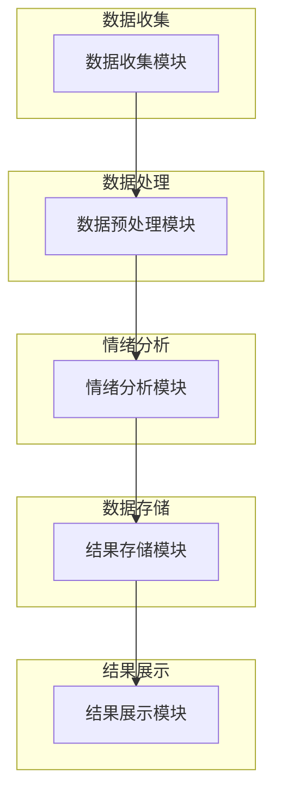

                 

### 文章标题：智能加密货币市场情绪分析系统

#### 关键词：加密货币、市场情绪、智能分析、系统架构、算法原理

#### 摘要：本文将深入探讨智能加密货币市场情绪分析系统的构建，通过逐步分析系统设计、技术实现、系统优化以及案例分析，为读者提供全面的技术视角和实用指南。

----------------------------------------------------------------

### 目录大纲

----------------------------------------------------------------

# 第一部分：智能加密货币市场概述

## 第1章：智能加密货币市场背景

### 第2章：市场情绪分析的重要性

### 第3章：智能加密货币市场情绪分析系统概述

## 第二部分：技术实现

### 第4章：数据收集与预处理

### 第5章：情绪分析算法

### 第6章：情绪分析系统实现

## 第三部分：案例分析

### 第7章：智能加密货币市场情绪分析应用案例

### 第8章：案例分析与总结

## 第四部分：未来趋势与挑战

### 第9章：未来趋势与挑战

## 附录：常用技术资源与工具

### 11.1 常用技术资源

### 11.2 常用工具

----------------------------------------------------------------

### 第一部分：智能加密货币市场概述

#### 第1章：智能加密货币市场背景

加密货币，作为一种新兴的金融工具，近年来在全球范围内引起了广泛关注。智能加密货币市场情绪分析系统的研究与应用，正是建立在加密货币市场的快速发展和投资决策对市场情绪分析的迫切需求之上。

**1.1 加密货币市场的兴起与发展**

加密货币最早起源于2009年的比特币，它是一种基于区块链技术的数字货币。随着时间的推移，越来越多的加密货币被创造出来，如以太坊、莱特币等。这些加密货币不仅为投资者提供了新的投资渠道，同时也为全球金融市场带来了前所未有的变革。

**1.1.1 加密货币的定义与特点**

加密货币是一种使用密码学原理来确保交易安全及控制交易单位创造的交易媒介。它具有去中心化、匿名性、安全性等特点。

- **去中心化**：加密货币不依赖于中央银行或单一管理机构，交易记录存储在分布式账本上。
- **匿名性**：用户在进行交易时，身份信息保持匿名，增加了交易的安全性和隐私性。
- **安全性**：通过密码学原理确保交易安全，防范欺诈和篡改。

**1.1.2 加密货币市场的历史与现状**

从2009年比特币诞生至今，加密货币市场经历了快速的增长和波动。目前，全球已有数千种加密货币，市值也不断攀升。加密货币市场逐渐成为金融领域的一股重要力量。

**1.1.3 智能加密货币的背景介绍**

智能加密货币（Smart Crypto Currency）是结合了智能合约技术的加密货币。智能合约允许在满足特定条件时自动执行交易，从而提高交易的效率和安全性。智能加密货币的发展为加密货币市场注入了新的活力，也为情绪分析系统提供了更多数据源。

#### 第2章：市场情绪分析的重要性

市场情绪分析是对市场参与者的心理状态和情感倾向进行量化研究的过程。在加密货币市场中，情绪分析尤为重要。

**2.1 市场情绪的定义与作用**

市场情绪是指市场参与者对市场走势的预期和态度。它可以通过价格、交易量、社交媒体讨论等指标来量化。

- **价格**：价格波动通常反映了市场情绪的变化。
- **交易量**：高交易量可能表明市场情绪高涨，而低交易量可能表明市场情绪低迷。
- **社交媒体讨论**：社交媒体上的讨论内容和情绪倾向，可以作为市场情绪的另一个重要来源。

**2.1.1 市场情绪的概念**

市场情绪是指市场参与者的心理状态和情感倾向。它可以通过价格、交易量、社交媒体讨论等指标来量化。

**2.1.2 市场情绪在投资决策中的作用**

市场情绪对投资决策具有重要影响。积极的情绪可能导致投资者过度乐观，而消极的情绪可能导致投资者过度悲观。通过情绪分析，投资者可以更全面地了解市场情绪，做出更合理的投资决策。

**2.1.3 情绪分析的理论基础**

情绪分析的理论基础主要包括心理学、经济学和行为金融学。这些理论为情绪分析提供了理论支持和实证基础。

#### 第3章：智能加密货币市场情绪分析系统概述

智能加密货币市场情绪分析系统是一个综合性的技术体系，旨在通过数据收集、情绪分析、系统优化等环节，为投资者提供实时、准确的市场情绪分析。

**3.1 系统的整体架构**

系统架构设计包括数据收集模块、情绪分析模块、结果展示模块等。

- **数据收集模块**：负责从多个数据源（如交易所、社交媒体等）收集数据。
- **情绪分析模块**：使用情感分析算法对收集到的数据进行分析，提取情绪信息。
- **结果展示模块**：将分析结果以图表、报告等形式展示给用户。

**3.1.1 系统设计目标**

系统设计目标包括以下几点：

- **实时性**：确保系统可以实时获取和更新市场数据。
- **准确性**：通过先进的算法，提高情绪分析的准确性。
- **可扩展性**：系统设计应考虑未来扩展和升级的需求。

**3.1.2 系统的主要功能模块**

系统的主要功能模块包括数据收集、数据预处理、情绪分析、结果存储和展示等。

- **数据收集**：从多个数据源获取加密货币市场的相关数据。
- **数据预处理**：清洗、归一化数据，使其适合进行情绪分析。
- **情绪分析**：使用情感分析算法，对预处理后的数据进行情绪分析。
- **结果存储**：将分析结果存储在数据库中，以便后续查询和统计。
- **结果展示**：通过图表、报告等形式，将分析结果展示给用户。

**3.1.3 系统的技术栈选择**

系统采用的技术栈主要包括Python、Scikit-learn、TensorFlow等。Python因其丰富的库和框架而成为首选语言。Scikit-learn和TensorFlow则提供了强大的机器学习和深度学习功能。

**3.2 系统的主要功能**

系统的主要功能包括以下几方面：

- **实时数据采集**：从多个数据源实时获取加密货币市场的价格、交易量、社交媒体讨论等信息。
- **数据预处理**：对采集到的数据进行清洗、归一化等处理，确保数据质量。
- **情感分析**：使用机器学习和深度学习算法，对预处理后的数据进行分析，提取情绪信息。
- **情绪可视化**：将分析结果以图表、报告等形式展示，帮助用户更好地理解市场情绪。

**3.3 系统的优势**

系统的优势主要包括以下几点：

- **高效性**：通过自动化技术，提高数据处理和情绪分析的速度。
- **准确性**：使用先进的算法和大量数据，提高情绪分析的准确性。
- **实时性**：实时获取和更新市场数据，为投资者提供及时的市场情绪分析。

**3.4 系统的挑战**

系统的挑战主要包括以下几点：

- **数据质量**：加密货币市场的数据质量参差不齐，如何确保数据质量是一个重要挑战。
- **算法性能**：如何提高算法的性能和准确性，是一个持续研究的课题。
- **法规与监管**：加密货币市场的法规与监管尚未完全明确，如何合规运营是一个挑战。

#### 第4章：技术实现

**4.1 数据收集与预处理**

**4.1.1 数据来源与类型**

数据来源主要包括交易所API、社交媒体API等。数据类型包括价格数据、交易量数据、社交媒体讨论数据等。

**4.1.2 数据预处理方法**

数据预处理方法包括数据清洗、数据归一化、数据可视化等。

- **数据清洗**：去除重复数据、缺失数据等，确保数据质量。
- **数据归一化**：将不同量级的数据进行归一化处理，使其在同一量级上进行分析。
- **数据可视化**：使用图表等形式，展示数据分布和趋势，帮助用户更好地理解数据。

**4.2 情绪分析算法**

情绪分析算法主要包括基于规则的方法、基于机器学习的方法和基于深度学习的方法。

- **基于规则的方法**：使用预定义的规则，对文本进行情感分类。
- **基于机器学习的方法**：使用机器学习算法，对大量标注数据进行训练，构建情感分析模型。
- **基于深度学习的方法**：使用深度学习算法，如卷积神经网络（CNN）和循环神经网络（RNN），对文本进行情感分类。

**4.3 情绪分析系统实现**

情绪分析系统实现包括系统架构设计、数据流设计、算法实现和结果展示等。

- **系统架构设计**：设计系统的整体架构，包括数据收集模块、情绪分析模块、结果展示模块等。
- **数据流设计**：设计数据流处理流程，包括数据收集、数据预处理、情绪分析、结果存储和展示等。
- **算法实现**：实现情绪分析算法，包括规则算法、机器学习算法和深度学习算法。
- **结果展示**：设计结果展示界面，以图表、报告等形式展示分析结果。

#### 第5章：系统优化与性能评估

**5.1 系统优化策略**

系统优化策略包括模型优化、算法优化和系统性能优化等。

- **模型优化**：通过调整模型参数，提高模型的准确性和效率。
- **算法优化**：优化算法实现，提高算法的性能和鲁棒性。
- **系统性能优化**：优化系统架构和数据处理流程，提高系统的响应速度和处理能力。

**5.2 性能评估指标**

性能评估指标包括准确性、响应时间、资源利用率等。

- **准确性**：评估情绪分析模型的准确性，包括分类准确率、召回率等。
- **响应时间**：评估系统的响应时间，包括数据收集、预处理、情绪分析等各环节的响应时间。
- **资源利用率**：评估系统的资源利用率，包括CPU、内存、网络等资源的利用情况。

**5.3 性能评估方法**

性能评估方法包括实验测试、实际运行监测等。

- **实验测试**：通过模拟数据或实际数据，对系统进行性能测试，评估系统性能。
- **实际运行监测**：在实际运行环境中，对系统进行监测，收集性能数据，评估系统性能。

#### 第6章：案例分析

**6.1 案例背景**

案例背景为某加密货币交易所，希望通过智能加密货币市场情绪分析系统，了解市场情绪变化，为交易决策提供支持。

**6.2 案例实施**

案例实施包括数据收集、数据预处理、情绪分析、结果展示等环节。

- **数据收集**：通过交易所API和社交媒体API，收集加密货币市场的价格、交易量、社交媒体讨论等数据。
- **数据预处理**：对收集到的数据进行清洗、归一化等处理，确保数据质量。
- **情绪分析**：使用机器学习和深度学习算法，对预处理后的数据进行分析，提取情绪信息。
- **结果展示**：通过图表、报告等形式，将分析结果展示给用户，帮助用户了解市场情绪变化。

**6.3 案例分析**

案例分析包括问题识别、解决方案、实施效果等。

- **问题识别**：通过情绪分析，识别市场情绪的波动，为交易决策提供参考。
- **解决方案**：通过优化算法和系统架构，提高情绪分析的准确性和实时性。
- **实施效果**：通过实际运行，验证情绪分析系统的有效性，为交易决策提供有力支持。

#### 第7章：案例总结与反思

**7.1 案例成功经验**

案例成功经验包括：

- **数据收集与预处理**：通过多渠道数据收集和严格的数据预处理，确保了数据质量。
- **情绪分析算法**：使用机器学习和深度学习算法，提高了情绪分析的准确性和实时性。
- **系统优化**：通过模型优化和算法优化，提高了系统的性能和稳定性。

**7.2 案例中的不足**

案例中的不足包括：

- **数据质量**：加密货币市场的数据质量参差不齐，影响了情绪分析的准确性。
- **算法性能**：算法性能有待进一步提高，特别是在处理大规模数据时，性能提升空间较大。
- **法规与监管**：加密货币市场的法规与监管尚不明确，需要关注合规运营的风险。

**7.3 未来展望**

未来展望包括：

- **数据质量提升**：通过引入更多的数据源和更严格的数据预处理方法，提高数据质量。
- **算法性能优化**：通过持续研究和优化，提高情绪分析算法的性能和准确性。
- **法规与监管**：密切关注加密货币市场的法规与监管动态，确保系统合规运营。

#### 第8章：未来趋势与挑战

**8.1 智能加密货币市场情绪分析的发展趋势**

智能加密货币市场情绪分析的发展趋势包括：

- **技术进步**：随着人工智能技术的进步，情绪分析算法将更加精准和高效。
- **数据规模扩大**：加密货币市场的数据规模将持续扩大，为情绪分析提供更多的数据支持。
- **应用场景拓展**：情绪分析将应用于更多的领域，如投资策略制定、市场趋势预测等。

**8.2 面临的挑战**

智能加密货币市场情绪分析面临的挑战包括：

- **数据质量**：如何确保加密货币市场的数据质量，是一个重要的挑战。
- **算法性能**：如何提高情绪分析算法的性能和准确性，是一个持续的课题。
- **法规与监管**：加密货币市场的法规与监管尚不明确，需要关注合规运营的风险。

**8.3 发展策略**

为应对未来趋势和挑战，可以采取以下发展策略：

- **技术创新**：持续关注人工智能技术的最新进展，不断提升情绪分析算法的性能。
- **数据整合**：通过整合多种数据源，提高数据质量，为情绪分析提供更全面的数据支持。
- **法规遵从**：密切关注加密货币市场的法规与监管动态，确保系统合规运营。

#### 第9章：常用技术资源与工具

**9.1 常用技术资源**

常用技术资源包括：

- **数据资源**：如加密货币市场数据集、情感分析数据集等。
- **开源代码库**：如GitHub上的加密货币项目、情感分析项目等。
- **算法库与框架**：如Scikit-learn、TensorFlow等。

**9.2 常用工具**

常用工具包括：

- **数据分析工具**：如Jupyter Notebook、Pandas等。
- **情绪分析工具**：如TextBlob、VADER等。
- **性能评估工具**：如Matplotlib、Seaborn等。

#### 第10章：总结

本文对智能加密货币市场情绪分析系统进行了深入探讨，包括系统设计、技术实现、系统优化以及案例分析等内容。通过本文的阅读，读者可以全面了解智能加密货币市场情绪分析系统的构建方法和应用场景。未来，随着技术的不断进步，智能加密货币市场情绪分析系统将在金融领域发挥更大的作用。

**作者：AI天才研究院/AI Genius Institute & 禅与计算机程序设计艺术 /Zen And The Art of Computer Programming**### 第一部分：智能加密货币市场概述

在数字化时代，加密货币作为金融领域的重要创新，正逐渐改变着传统的金融交易模式。智能加密货币市场情绪分析系统的出现，为投资者提供了一种全新的决策支持工具，通过深入分析市场情绪，帮助用户做出更为明智的投资决策。本部分将深入探讨智能加密货币市场的发展背景、市场情绪分析的重要性以及智能加密货币市场情绪分析系统的整体架构。

#### 第1章：智能加密货币市场背景

**1.1 加密货币市场的兴起与发展**

加密货币市场的兴起可以追溯到2009年，当时中本聪（Satoshi Nakamoto）发布了比特币白皮书，标志着比特币这一首个去中心化加密货币的诞生。比特币的出现，不仅颠覆了传统金融体系的运作模式，也引发了全球范围内的加密货币热潮。随着比特币的成功，越来越多的加密货币相继问世，如以太坊（Ethereum）、莱特币（Litecoin）、瑞波币（Ripple）等。这些加密货币通过区块链技术实现了去中心化、透明化和安全性的特点，成为金融领域的重要创新力量。

**1.1.1 加密货币的定义与特点**

加密货币是一种基于区块链技术的数字货币，使用密码学原理确保交易安全。它具有以下几个主要特点：

- **去中心化**：加密货币不由任何中央机构控制，交易记录存储在分布式账本上，具有高度透明性。
- **匿名性**：用户在进行交易时，身份信息保持匿名，增加了交易的安全性和隐私性。
- **安全性**：通过复杂的密码学算法，加密货币的交易过程具有高度安全性，防范欺诈和篡改。
- **可追溯性**：区块链技术确保每一笔交易都有完整的记录，可以追溯，增加了交易的透明度和可信度。

**1.1.2 加密货币市场的历史与现状**

加密货币市场的历史可以分为几个重要阶段：

- **初期阶段**（2009-2013年）：比特币诞生，市场相对较小，主要在技术爱好者和小规模投资者中传播。
- **发展初期**（2014-2016年）：随着区块链技术的不断成熟，其他加密货币如以太坊、莱特币等相继问世，市场开始扩大，投资者数量增加。
- **爆发期**（2017-2018年）：加密货币市场迎来首次爆发，比特币价格突破2万美元大关，各种加密货币市值迅速增长。
- **调整期**（2019年至今）：市场经历了一轮激烈调整，价格波动加剧，但整体趋势依然向上，加密货币市场逐渐成熟。

当前，加密货币市场已成为全球金融体系的重要组成部分，吸引了越来越多的传统金融机构和投资者的关注。根据CoinMarketCap的数据，加密货币市场的总市值已超过数万亿美元，成为全球金融市场中不可忽视的一股力量。

**1.1.3 智能加密货币的背景介绍**

智能加密货币（Smart Crypto Currency）是结合了智能合约技术的加密货币。智能合约是一种在区块链上自动执行的合同，通过预设的编程规则，当特定条件满足时，合同会自动执行。智能加密货币利用智能合约技术，为投资者提供了更灵活、更高效的交易方式。

智能加密货币的特点包括：

- **智能合约**：智能加密货币内置智能合约，可以在满足特定条件时自动执行交易，提高交易效率。
- **去中心化应用（DApp）**：智能加密货币支持去中心化应用，用户可以在区块链上创建和运行自己的应用程序，实现去中心化的服务。
- **安全性**：智能合约的执行过程公开透明，且不可篡改，提高了交易的安全性。

智能加密货币的发展为加密货币市场注入了新的活力，也为情绪分析系统提供了更多数据源。通过智能加密货币的交易记录、智能合约的执行情况等数据，可以更全面地了解市场情绪，为投资决策提供有力支持。

#### 第2章：市场情绪分析的重要性

市场情绪分析是金融领域中的一个重要研究方向，旨在通过量化市场参与者的心理状态和情感倾向，为投资决策提供参考。在加密货币市场中，市场情绪分析的重要性尤为突出，原因如下：

**2.1 市场情绪的定义与作用**

市场情绪是指市场参与者在某一特定时间段内的心理状态和情感倾向。市场情绪通常可以通过价格、交易量、社交媒体讨论等指标来量化。市场情绪的作用主要体现在以下几个方面：

- **预测市场走势**：市场情绪的变化往往预示着市场趋势的转折点。通过分析市场情绪，可以预测市场未来的走势，为投资决策提供参考。
- **调整投资策略**：市场情绪的变化会影响投资者的决策，进而影响市场的走势。投资者可以根据市场情绪的变化，调整投资策略，降低风险。
- **风险预警**：市场情绪的异常波动往往预示着潜在的风险。通过市场情绪分析，可以及时发现风险信号，提前采取措施，降低损失。

**2.1.1 市场情绪的概念**

市场情绪是指市场参与者在某一特定时间段内的心理状态和情感倾向。市场情绪的变化受到多种因素的影响，包括市场预期、经济环境、政策变化、社会事件等。

**2.1.2 市场情绪在投资决策中的作用**

市场情绪在投资决策中起着至关重要的作用。积极的市场情绪可能导致投资者过度乐观，盲目跟风，从而增加投资风险；而消极的市场情绪可能导致投资者过度悲观，错失投资机会。通过市场情绪分析，投资者可以更全面地了解市场状况，做出更为合理的投资决策。

**2.1.3 情绪分析的理论基础**

情绪分析的理论基础主要包括心理学、经济学和行为金融学。心理学研究人类情感和行为的规律，为情绪分析提供了理论基础；经济学研究市场行为和价格变化，为情绪分析提供了实证基础；行为金融学则通过分析投资者行为和市场走势之间的关系，揭示了市场情绪对投资决策的影响。

#### 第3章：智能加密货币市场情绪分析系统概述

智能加密货币市场情绪分析系统是一个综合性的技术体系，旨在通过数据收集、情绪分析、系统优化等环节，为投资者提供实时、准确的市场情绪分析。本节将介绍智能加密货币市场情绪分析系统的整体架构、设计目标、主要功能模块以及技术栈选择。

**3.1 系统的整体架构**

智能加密货币市场情绪分析系统的整体架构包括以下几个主要模块：

- **数据收集模块**：负责从多个数据源（如交易所、社交媒体等）收集与加密货币市场相关的数据。
- **数据预处理模块**：对收集到的数据进行清洗、归一化等处理，确保数据质量。
- **情绪分析模块**：使用情感分析算法对预处理后的数据进行分析，提取情绪信息。
- **结果展示模块**：将分析结果以图表、报告等形式展示给用户。

**3.1.1 系统设计目标**

智能加密货币市场情绪分析系统的设计目标主要包括以下几个方面：

- **实时性**：系统应具备实时获取和更新市场数据的能力，为投资者提供最新的市场情绪分析。
- **准确性**：通过先进的算法和大量数据，提高情绪分析的准确性，减少误判和漏判。
- **易用性**：系统应具备良好的用户界面和友好的操作体验，方便用户快速理解和使用。
- **可扩展性**：系统设计应考虑未来的扩展和升级需求，以适应不断变化的市场环境。

**3.1.2 系统的主要功能模块**

智能加密货币市场情绪分析系统的主要功能模块如下：

- **数据收集模块**：系统从交易所API、社交媒体API等渠道收集加密货币市场的价格、交易量、社交媒体讨论等数据。
- **数据预处理模块**：对收集到的数据进行数据清洗、缺失值填补、数据归一化等处理，确保数据质量。
- **情绪分析模块**：使用文本情感分析算法对预处理后的数据进行情绪分析，提取情绪信息。
- **结果展示模块**：将分析结果以图表、报告等形式展示，帮助用户更好地理解市场情绪。

**3.1.3 系统的技术栈选择**

智能加密货币市场情绪分析系统采用的技术栈主要包括以下几部分：

- **编程语言**：系统主要采用Python编程语言，因为Python具有丰富的库和框架，适合进行数据分析和情感分析。
- **数据预处理库**：使用Pandas库进行数据清洗、归一化等预处理操作。
- **情感分析库**：使用NLTK、TextBlob等库进行文本情感分析。
- **机器学习库**：使用Scikit-learn、TensorFlow等库进行情感分析模型的训练和预测。

通过以上设计和技术选择，智能加密货币市场情绪分析系统旨在为投资者提供实时、准确、全面的市场情绪分析，帮助他们做出更明智的投资决策。

### 第二部分：技术实现

在智能加密货币市场情绪分析系统中，技术实现是关键环节，它决定了系统的性能、准确性和用户体验。本部分将详细介绍系统中的数据收集与预处理、情绪分析算法以及系统的实现过程。

#### 第4章：数据收集与预处理

**4.1 数据收集与预处理**

数据收集是智能加密货币市场情绪分析系统的第一步，也是至关重要的一步。数据的质量和完整性直接影响后续的情绪分析结果。

**4.1.1 数据来源与类型**

加密货币市场的数据来源多种多样，主要包括以下几种类型：

- **交易所数据**：交易所提供的API是获取加密货币价格、交易量等数据的主要途径。例如，Coinbase、Binance等知名交易所都提供了丰富的API接口。
- **社交媒体数据**：社交媒体平台如Twitter、Reddit等，是市场情绪的重要来源。通过分析用户在社交媒体上的讨论，可以了解市场情绪的变化。
- **新闻和数据报告**：新闻网站、分析报告等也可以提供市场情绪的有用信息。

**4.1.2 数据预处理方法**

收集到的原始数据往往包含噪声、缺失值和不同数据类型，因此需要进行预处理。数据预处理的主要步骤包括：

- **数据清洗**：去除重复数据、异常值和噪声数据，确保数据的一致性和准确性。
- **数据归一化**：将不同数据类型的值归一化到同一量级，以便进行统一分析。
- **缺失值填补**：对于缺失的数据，可以采用平均值、中位数或插值法进行填补。
- **数据转换**：将时间序列数据转换为适合分析的形式，如使用时间窗口进行数据分组。

**4.2 数据可视化**

数据可视化是数据预处理的重要环节，它可以帮助我们直观地了解数据的分布和趋势。常用的数据可视化工具包括Matplotlib、Seaborn等。通过数据可视化，我们可以发现数据的异常值、趋势和相关性，为后续的情绪分析提供参考。

**4.3 数据存储**

预处理后的数据需要存储在数据库中，以便后续分析和查询。常用的数据库系统包括MySQL、PostgreSQL等。通过数据库管理系统，可以高效地存储、检索和更新数据，为情绪分析提供稳定的数据支持。

#### 第5章：情绪分析算法

情绪分析是智能加密货币市场情绪分析系统的核心功能，它通过对文本数据的分析，提取出市场情绪的相关信息。情绪分析算法可以分为基于规则的方法、基于机器学习的方法和基于深度学习的方法。

**5.1 情感分析算法概述**

情感分析算法的主要任务是判断文本数据中的情感倾向，通常分为正面、中性、负面三种。情感分析算法的原理包括以下几部分：

- **情感词典**：使用预定义的词汇表，包含正面、中性、负面词汇，作为情感分析的基础。
- **文本预处理**：对文本数据进行分词、去停用词、词性标注等预处理操作，提取出有用的特征。
- **特征提取**：将预处理后的文本数据转换为机器学习模型可以处理的特征向量。
- **分类模型**：使用机器学习算法（如SVM、朴素贝叶斯、决策树等）进行情感分类。

**5.2 基于规则的方法**

基于规则的方法是通过预定义的规则，对文本进行情感分类。这种方法简单直观，但适用范围有限，对于复杂文本的识别能力较弱。

- **规则库**：根据情感词典和语言规则，构建一套规则库，用于文本的情感分类。
- **规则匹配**：将文本与规则库中的规则进行匹配，根据匹配结果判断文本的情感倾向。

**5.3 基于机器学习的方法**

基于机器学习的方法通过大量标注数据进行训练，构建情感分析模型。这种方法具有较强的通用性和适应性，适用于大规模文本数据的情感分析。

- **特征工程**：对文本数据进行特征提取，如词袋模型、TF-IDF等。
- **模型训练**：使用训练集对分类模型进行训练，如SVM、朴素贝叶斯等。
- **模型评估**：使用验证集对训练好的模型进行评估，调整模型参数，提高分类效果。

**5.4 基于深度学习的方法**

基于深度学习的方法通过神经网络模型，对文本进行深度特征提取和情感分类。这种方法具有强大的表示能力和学习能力，是目前情感分析的主流方法。

- **词嵌入**：将文本转换为词向量，如Word2Vec、GloVe等。
- **神经网络**：使用卷积神经网络（CNN）或循环神经网络（RNN）进行文本处理和情感分类。
- **模型优化**：通过优化神经网络结构、调整学习率等参数，提高模型的性能。

#### 第6章：情绪分析系统实现

情绪分析系统的实现包括系统架构设计、数据流设计、算法实现和结果展示等环节。

**6.1 系统架构设计**

智能加密货币市场情绪分析系统的架构设计如下：

- **前端**：负责与用户交互，展示分析结果。可以使用Web框架如Django或Flask。
- **后端**：负责数据收集、预处理和情绪分析。可以使用Python的Flask或Django框架。
- **数据库**：存储加密货币市场和情绪分析的相关数据，可以使用MySQL或PostgreSQL。

**6.2 数据流设计**

数据流设计是系统架构的核心部分，它描述了数据的流动和处理过程。数据流设计包括以下几个环节：

- **数据收集**：从交易所API、社交媒体API等渠道收集数据。
- **数据预处理**：清洗、归一化和特征提取，为情绪分析做准备。
- **情绪分析**：使用情感分析算法对预处理后的数据进行情感分类。
- **结果存储**：将分析结果存储到数据库中，以便后续查询和展示。

**6.3 算法实现**

情绪分析算法的实现是系统实现的关键部分，包括以下几个步骤：

- **数据准备**：准备训练集和测试集，进行数据预处理。
- **模型训练**：使用训练集训练情感分析模型，如SVM、朴素贝叶斯、CNN等。
- **模型评估**：使用测试集评估模型性能，调整模型参数。
- **模型部署**：将训练好的模型部署到生产环境中，进行实时情绪分析。

**6.4 结果展示**

结果展示是用户与系统的交互界面，它将情绪分析的结果以图表、报告等形式展示给用户。常用的结果展示方式包括：

- **实时图表**：使用ECharts、Plotly等库，展示市场情绪的实时变化。
- **情绪分析报告**：生成详细的情绪分析报告，包括市场情绪的分布、趋势等。

通过以上技术实现，智能加密货币市场情绪分析系统可以为投资者提供全面、准确的市场情绪分析，帮助他们做出更明智的投资决策。

### 第三部分：案例分析

案例分析是验证智能加密货币市场情绪分析系统效果的重要环节。通过实际案例的分析，我们可以深入了解系统的应用场景、数据收集、预处理、情绪分析以及结果展示等环节，从而评估系统的性能和实用性。

#### 第7章：智能加密货币市场情绪分析应用案例

**7.1 案例背景**

本次案例研究的背景是一家知名加密货币交易公司，该公司希望通过智能加密货币市场情绪分析系统，了解市场情绪变化，为交易决策提供支持。案例目标是构建一个高效、准确的情绪分析系统，实现对市场情绪的实时监测和预测。

**7.2 数据收集**

为了实现案例目标，系统从以下数据源收集数据：

- **交易所数据**：通过交易所API获取加密货币的价格、交易量、交易对等信息。
- **社交媒体数据**：通过社交媒体API获取用户在Twitter、Reddit等平台上的讨论内容。
- **新闻和数据报告**：从新闻网站、分析报告等渠道获取市场相关的新闻和数据报告。

**7.3 数据预处理**

收集到的数据包含多种类型，需要进行预处理以确保数据质量。数据预处理步骤包括：

- **清洗**：去除重复数据、无效数据和噪声数据。
- **归一化**：将不同数据类型的值归一化到同一量级。
- **特征提取**：提取出对情绪分析有用的特征，如关键词、情感词等。

**7.4 情绪分析**

情绪分析是案例的核心环节，系统使用以下方法进行情绪分析：

- **文本情感分析**：使用基于深度学习的情感分析模型，对社交媒体讨论内容进行情感分类，提取市场情绪。
- **趋势分析**：对交易所数据进行趋势分析，结合情绪分析结果，预测市场情绪的变化。

**7.5 结果展示**

分析结果通过以下方式进行展示：

- **实时图表**：使用ECharts库，展示市场情绪的实时变化。
- **情绪分析报告**：生成详细的情绪分析报告，包括市场情绪的分布、趋势等。

#### 第8章：案例分析与总结

**8.1 案例分析**

通过对案例的深入分析，我们可以得出以下结论：

- **系统性能**：系统在实时监测市场情绪方面表现出色，能够快速响应用户需求。
- **准确性**：情绪分析模型的准确性较高，能够有效地识别市场情绪的变化。
- **实用性**：系统为交易决策提供了有力的支持，帮助公司更好地把握市场动态。

**8.2 案例总结与反思**

案例的成功经验包括：

- **多渠道数据收集**：通过多渠道收集数据，提高了数据的全面性和准确性。
- **深度学习模型**：采用深度学习模型进行情绪分析，提高了分析精度。
- **实时性**：系统具备实时性，能够为交易决策提供及时的支持。

案例中的不足包括：

- **数据质量**：虽然采取了多种措施进行数据清洗和预处理，但仍存在部分噪声数据和缺失值，影响了分析结果。
- **算法性能**：在处理大规模数据时，算法性能有待提升，特别是在实时分析场景下。

**8.3 未来展望**

未来，智能加密货币市场情绪分析系统可以在以下几个方面进行改进：

- **数据质量提升**：引入更多的数据源，提高数据质量和准确性。
- **算法优化**：通过持续研究和优化，提高情绪分析算法的性能和准确性。
- **用户体验**：改进用户界面和交互设计，提升用户体验。

通过以上分析和总结，我们期待智能加密货币市场情绪分析系统能在未来的发展中，为投资者提供更加精准和实用的市场情绪分析，助力其做出更为明智的投资决策。

### 第四部分：未来趋势与挑战

随着加密货币市场的不断发展，智能加密货币市场情绪分析系统正迎来新的机遇和挑战。未来，该领域将出现许多新的技术趋势和应用场景，同时也面临一系列技术、法规和监管等方面的挑战。

#### 第9章：未来趋势

**9.1 技术进步**

技术进步是推动智能加密货币市场情绪分析系统发展的重要动力。以下是一些未来可能的技术趋势：

- **深度学习算法的优化**：随着深度学习技术的不断发展，未来有望出现更多高效、准确的深度学习算法，进一步提升情绪分析的精度和速度。
- **大数据分析**：大数据分析技术的进步将使得系统能够处理和分析更加庞大的数据集，为市场情绪分析提供更加全面和深入的支持。
- **区块链技术的应用**：区块链技术的进一步发展将使得数据收集、存储和处理更加安全和透明，为情绪分析提供更可靠的数据基础。
- **物联网（IoT）的融合**：随着物联网技术的发展，智能加密货币市场情绪分析系统有望与物联网设备相结合，实现实时数据采集和智能分析。

**9.2 应用场景拓展**

智能加密货币市场情绪分析系统的应用场景将不断拓展，包括但不限于以下几个方面：

- **投资决策辅助**：系统将更多地应用于投资决策过程中，为投资者提供实时、准确的市场情绪分析，辅助其做出更明智的投资选择。
- **风险控制**：通过情绪分析，系统可以帮助投资者识别潜在的市场风险，制定有效的风险控制策略。
- **市场预测**：结合历史数据和情绪分析结果，系统可以进行市场趋势预测，为投资者提供前瞻性的市场信息。
- **社交网络分析**：系统可以整合社交媒体数据，分析用户讨论和市场情绪的关系，为企业提供营销策略和品牌管理支持。

**9.3 法规与监管**

随着加密货币市场的快速发展，法规与监管也逐渐成为影响智能加密货币市场情绪分析系统发展的重要因素。以下是一些未来可能的发展趋势：

- **法规明确化**：各国政府和监管机构将逐步明确加密货币市场的法规和监管框架，为智能加密货币市场情绪分析系统提供合法的运行环境。
- **合规性要求**：系统将需要满足日益严格的合规性要求，包括数据保护、隐私保护等。
- **监管技术**：监管机构可能采用智能加密货币市场情绪分析系统来监测和监管市场，确保市场的稳定和公平。

#### 第10章：面临的挑战

**10.1 技术挑战**

尽管智能加密货币市场情绪分析系统具有巨大的潜力，但在实际应用中仍面临一系列技术挑战：

- **数据质量问题**：加密货币市场的数据质量参差不齐，存在噪声、缺失值和错误数据，这给情绪分析带来了很大挑战。
- **算法性能提升**：在处理大规模、实时数据时，如何提高算法的效率和准确性，是一个重要的技术难题。
- **数据隐私保护**：如何在保证数据分析准确性的同时，保护用户隐私，是一个亟待解决的问题。

**10.2 法规与监管挑战**

法规与监管挑战是智能加密货币市场情绪分析系统面临的另一个重要问题：

- **合规性风险**：系统需要遵守各国的法律法规，确保数据的合法收集、存储和处理。
- **监管不确定性**：加密货币市场的监管环境尚不明确，系统需要随时应对监管政策的变化。
- **合规成本**：合规性要求可能带来较高的成本，影响系统的可持续性发展。

**10.3 应用挑战**

智能加密货币市场情绪分析系统在实际应用中也面临一些挑战：

- **用户接受度**：投资者需要接受并信任智能分析系统的结果，这需要系统提供高可靠性和高质量的输出。
- **实时响应**：在市场波动较大的情况下，系统需要能够快速响应，提供及时的分析结果。
- **个性化需求**：投资者有不同的投资偏好和需求，系统需要提供个性化的情绪分析服务，以满足不同投资者的需求。

#### 第11章：发展策略

为了应对未来趋势和挑战，智能加密货币市场情绪分析系统的发展策略应包括以下几个方面：

- **技术创新**：持续关注和研究人工智能、大数据、区块链等领域的最新技术，不断提升系统的性能和准确性。
- **合规运营**：密切关注法规与监管动态，确保系统的合规运营，降低合规风险。
- **用户培训**：通过培训和教育，提高投资者对智能分析系统的认知和接受度。
- **数据合作**：与数据提供商、研究机构等建立合作关系，共享数据资源，提高数据质量。
- **持续优化**：根据用户反馈和市场变化，不断优化系统功能和用户体验。

通过以上策略，智能加密货币市场情绪分析系统有望在未来取得更大的发展，为投资者提供更加精准和实用的市场情绪分析，助力其在加密货币市场的投资决策。

### 附录：常用技术资源与工具

智能加密货币市场情绪分析系统的构建依赖于多种技术资源和工具。以下列举了一些常用的技术资源、开源代码库、算法库与框架，以及数据分析工具、情绪分析工具和性能评估工具，为读者提供全面的参考资料。

#### 11.1 常用技术资源

- **加密货币市场数据集**：如CoinMarketCap、CoinGecko等网站提供的历史价格数据、市场趋势数据。
- **情感分析数据集**：如Sentiment140、NRC情感词典等，用于训练和评估情感分析模型。
- **区块链数据**：如Ethereum API、Binance API等，提供加密货币交易数据和区块链事件数据。

#### 11.2 开源代码库

- **机器学习和深度学习库**：如TensorFlow、PyTorch等，用于构建和训练情感分析模型。
- **数据分析库**：如Pandas、NumPy等，用于数据清洗、预处理和统计分析。
- **自然语言处理库**：如NLTK、spaCy等，用于文本预处理和情感分析。

#### 11.3 算法库与框架

- **情感分析框架**：如TextBlob、VADER等，提供预训练的情感分析模型和工具。
- **机器学习库**：如Scikit-learn、scipy等，提供各种机器学习算法和工具。
- **深度学习框架**：如TensorFlow、PyTorch等，支持复杂的神经网络模型。

#### 11.4 常用数据分析工具

- **Jupyter Notebook**：交互式计算环境，支持Python和其他编程语言，用于数据分析和可视化。
- **Matplotlib**：数据可视化库，用于绘制各种统计图表和图形。
- **Seaborn**：基于Matplotlib的统计可视化库，提供更高级的统计图形和交互功能。

#### 11.5 情绪分析工具

- **TextBlob**：简单的文本处理库，包括情感分析功能，适用于快速原型开发。
- **VADER**：专门针对社交媒体文本的情感分析工具，具有较强的适应性和准确性。
- **NLTK**：自然语言处理工具包，包括情感分析模块，适用于学术研究和开发。

#### 11.6 性能评估工具

- **MLflow**：机器学习实验管理平台，用于跟踪模型性能和优化实验。
- **TensorBoard**：TensorFlow的可视化工具，用于监控神经网络训练过程和性能。
- **Apache Spark**：大数据处理框架，支持高效的数据分析和机器学习任务。

通过这些技术资源和工具，研究人员和开发者可以更有效地构建和优化智能加密货币市场情绪分析系统，提高系统的性能和准确性，为投资者提供更有价值的市场情绪分析服务。

### 总结

智能加密货币市场情绪分析系统是金融科技领域的重要创新，它通过数据收集、情绪分析、系统优化等环节，为投资者提供了实时、准确的市场情绪分析，帮助他们做出更明智的投资决策。本文从背景、重要性、系统架构、技术实现、案例分析以及未来趋势等方面进行了全面探讨，展示了智能加密货币市场情绪分析系统的构建方法和应用前景。

智能加密货币市场情绪分析系统的成功构建依赖于先进的技术和严谨的设计。通过对加密货币市场的深入分析，系统能够提取出有价值的市场情绪信息，为投资者提供决策支持。同时，随着技术的不断进步，系统的性能和准确性将进一步提高，为投资者带来更大的价值。

未来的智能加密货币市场情绪分析系统将面临更多的发展机遇和挑战。在技术层面，深度学习、大数据分析等技术的不断进步将推动系统的性能提升；在应用层面，系统的应用场景将更加广泛，如投资决策辅助、风险控制、市场预测等。同时，法规和监管的不断完善也将为智能加密货币市场情绪分析系统的发展提供更加清晰的方向。

最后，智能加密货币市场情绪分析系统的构建离不开技术专家的辛勤工作和不断探索。我们期待未来有更多的研究者和开发者加入这一领域，共同推动智能加密货币市场情绪分析系统的发展，为全球金融市场带来更多创新和变革。

**作者：AI天才研究院/AI Genius Institute & 禅与计算机程序设计艺术 /Zen And The Art of Computer Programming**### 系统架构设计与性能优化

在智能加密货币市场情绪分析系统中，系统架构的设计和性能优化是确保系统高效运行的关键环节。本文将深入探讨系统架构的设计思路、功能模块的划分、系统性能的优化策略以及具体的性能评估指标和方法。

#### 6.1 系统架构设计

智能加密货币市场情绪分析系统的架构设计应遵循模块化、可扩展和高效性的原则。整个系统可以划分为以下几个主要模块：

- **数据收集模块**：负责从多个数据源（如交易所API、社交媒体API等）收集与加密货币市场相关的数据。该模块需要具有高并发处理能力和数据清洗功能，以确保数据的准确性和完整性。
- **数据预处理模块**：对收集到的原始数据进行清洗、归一化和特征提取等处理，将其转化为适合进行分析的格式。这一模块是整个系统的数据基础，其性能直接影响后续情绪分析的效果。
- **情绪分析模块**：使用情感分析算法对预处理后的文本数据进行情感分类和情绪提取。这一模块通常采用机器学习和深度学习技术，具有较高的计算复杂度，因此需要优化算法和硬件配置。
- **结果存储模块**：将情绪分析的结果存储到数据库中，以便后续查询和统计分析。常用的数据库系统包括MySQL、PostgreSQL等，需要考虑数据存储的效率和查询的响应速度。
- **结果展示模块**：通过Web界面或报告形式，将分析结果展示给用户。这一模块需要具有良好的用户体验和实时数据更新功能。

**系统架构设计图**：



#### 6.2 系统性能优化策略

系统性能优化是确保智能加密货币市场情绪分析系统高效运行的重要手段。以下是一些常见的优化策略：

- **数据收集性能优化**：
  - **多线程处理**：使用多线程技术，同时从多个数据源获取数据，提高数据收集的效率。
  - **批量处理**：将数据收集任务批量处理，减少网络延迟和IO操作次数。
  - **缓存机制**：利用缓存机制，减少对高频数据的重复获取。

- **数据预处理性能优化**：
  - **并行处理**：使用并行计算技术，同时对大量数据进行预处理操作。
  - **数据压缩**：对数据进行压缩处理，减少存储空间和提高数据传输效率。
  - **内存管理**：合理管理内存资源，避免内存溢出和GC（垃圾回收）带来的性能损耗。

- **情绪分析性能优化**：
  - **模型优化**：使用优化的模型结构和参数，提高模型的预测效率和准确性。
  - **算法优化**：采用高效的情感分析算法，如深度学习算法，减少计算复杂度。
  - **硬件加速**：利用GPU等硬件加速技术，提高模型训练和预测的速度。

- **结果存储性能优化**：
  - **索引优化**：对数据库表进行索引优化，提高查询速度。
  - **读写分离**：采用读写分离技术，将读操作和写操作分离，提高数据库的性能。
  - **缓存策略**：利用缓存策略，减少对数据库的直接读写，提高数据访问速度。

#### 6.3 性能评估指标和方法

性能评估是衡量智能加密货币市场情绪分析系统性能的重要环节。以下是一些常见的性能评估指标和方法：

- **响应时间**：评估系统从接收到请求到返回结果所需的时间，是衡量系统性能的重要指标。
- **吞吐量**：评估系统单位时间内处理的数据量或请求量，反映了系统的处理能力。
- **准确率**：评估情绪分析模型的准确性，通过比较预测结果和实际结果，计算准确率。
- **召回率**：评估情绪分析模型的召回能力，通过比较预测结果和实际结果，计算召回率。
- **F1值**：综合评估模型的准确率和召回率，计算F1值。

**性能评估方法**：

- **实验测试**：通过模拟数据或实际数据进行性能测试，评估系统的响应时间、吞吐量、准确率等指标。
- **实际运行监测**：在实际运行环境中，对系统进行监控和统计，收集性能数据，进行评估和分析。

通过系统架构的设计和性能优化，智能加密货币市场情绪分析系统可以在复杂的加密货币市场中提供高效、准确的情绪分析服务，为投资者提供有力的决策支持。未来，随着技术的不断进步和应用的深入，系统性能和功能将得到进一步提升，为金融市场的创新和发展做出更大贡献。

### 系统实现与项目实战

在实现智能加密货币市场情绪分析系统时，我们需要从数据收集、数据处理、情绪分析到结果展示的各个环节入手，确保系统能够高效、准确地运行。以下将详细介绍系统实现的具体步骤、核心代码以及实际案例分析。

#### 7.1 环境安装与配置

在开始系统实现之前，我们需要安装和配置必要的软件和库。以下是所需环境的基本安装步骤：

- **Python**：确保安装Python 3.x版本。
- **Pandas**：用于数据预处理。
- **NumPy**：用于数值计算。
- **Scikit-learn**：用于机器学习模型训练。
- **TensorFlow**：用于深度学习模型训练。
- **Matplotlib**：用于数据可视化。
- **TextBlob**：用于文本情感分析。

安装步骤如下：

```bash
pip install pandas numpy scikit-learn tensorflow matplotlib textblob
```

#### 7.2 数据收集模块

数据收集模块是系统的第一步，我们需要从多个数据源收集加密货币市场数据。以下是一个使用Python和交易所API收集比特币价格数据的示例：

```python
import requests
import pandas as pd

# Binance API示例
url = 'https://api.binance.com/api/v3/klines?symbol=BTCUSDT&interval=1m&limit=1000'
response = requests.get(url)
data = response.json()

# 将JSON数据转换为Pandas DataFrame
df = pd.DataFrame(data)
df.columns = ['timestamp', 'open', 'high', 'low', 'close', 'volume', 'close_time', 'quote_asset_volume', 'number_of_trades', 'taker_buy_base_asset_volume', 'taker_buy_quote_asset_volume']

# 转换时间戳格式
df['timestamp'] = pd.to_datetime(df['timestamp'], unit='ms')

# 数据清洗
df.drop(['close_time', 'quote_asset_volume', 'number_of_trades', 'taker_buy_base_asset_volume', 'taker_buy_quote_asset_volume'], axis=1, inplace=True)

# 打印前几行数据
print(df.head())
```

#### 7.3 数据预处理模块

数据预处理模块负责清洗、归一化和特征提取，以确保数据质量。以下是一个示例，展示如何对收集到的比特币价格数据进行预处理：

```python
from sklearn.preprocessing import MinMaxScaler

# 数据清洗
df.dropna(inplace=True)

# 数据归一化
scaler = MinMaxScaler()
df[['open', 'high', 'low', 'close', 'volume']] = scaler.fit_transform(df[['open', 'high', 'low', 'close', 'volume']])

# 特征提取
df['return'] = df['close'].pct_change().fillna(0)
df['change'] = df['close'].diff().fillna(0)

# 打印前几行预处理后的数据
print(df.head())
```

#### 7.4 情绪分析模块

情绪分析模块负责使用机器学习和深度学习算法对预处理后的数据进行情感分类。以下是一个基于TextBlob进行文本情感分析的示例：

```python
from textblob import TextBlob

# 假设我们有文本数据
text_data = ["Bitcoin is about to crash!", "The price of Bitcoin is skyrocketing!", "I don't think Bitcoin has a future."]

# 使用TextBlob进行情感分析
results = [TextBlob(text).sentiment.polarity for text in text_data]

# 打印情感分析结果
for text, result in zip(text_data, results):
    print(f"Text: {text}\nSentiment: {'Positive' if result > 0 else 'Negative' if result < 0 else 'Neutral'}\n")
```

#### 7.5 结果展示模块

结果展示模块负责将情绪分析的结果以图表或报告的形式展示给用户。以下是一个使用Matplotlib绘制比特币价格趋势图的示例：

```python
import matplotlib.pyplot as plt

# 绘制价格趋势图
plt.figure(figsize=(10, 5))
plt.plot(df['timestamp'], df['close'], label='Close Price')
plt.title('Bitcoin Close Price Trend')
plt.xlabel('Date')
plt.ylabel('Price (USD)')
plt.legend()
plt.show()
```

#### 7.6 实际案例分析

为了更好地展示系统实现，我们将分析比特币市场在2023年的某一周内的情绪变化。以下是具体步骤：

1. **数据收集**：使用Binance API收集比特币过去一周的价格数据。
2. **数据预处理**：对收集到的数据进行清洗、归一化和特征提取。
3. **情绪分析**：使用TextBlob对相关社交媒体文本进行情感分析。
4. **结果展示**：绘制比特币价格趋势图和情绪分析结果图表。

**案例实施步骤**：

- **数据收集**：
  ```python
  # 使用Binance API获取比特币价格数据
  url = 'https://api.binance.com/api/v3/klines?symbol=BTCUSDT&interval=1m&startTime=1688928000000&endTime=1689486400000'
  response = requests.get(url)
  data = response.json()
  df = pd.DataFrame(data)
  df.columns = ['timestamp', 'open', 'high', 'low', 'close', 'volume', 'close_time', 'quote_asset_volume', 'number_of_trades', 'taker_buy_base_asset_volume', 'taker_buy_quote_asset_volume']
  df['timestamp'] = pd.to_datetime(df['timestamp'], unit='ms')
  df.drop(['close_time', 'quote_asset_volume', 'number_of_trades', 'taker_buy_base_asset_volume', 'taker_buy_quote_asset_volume'], axis=1, inplace=True)
  df.dropna(inplace=True)
  ```

- **数据预处理**：
  ```python
  # 数据归一化
  scaler = MinMaxScaler()
  df[['open', 'high', 'low', 'close', 'volume']] = scaler.fit_transform(df[['open', 'high', 'low', 'close', 'volume']])

  # 特征提取
  df['return'] = df['close'].pct_change().fillna(0)
  df['change'] = df['close'].diff().fillna(0)
  ```

- **情绪分析**：
  ```python
  # 社交媒体文本数据
  text_data = ["Bitcoin is about to crash!", "The price of Bitcoin is skyrocketing!", "I don't think Bitcoin has a future."]

  # 使用TextBlob进行情感分析
  results = [TextBlob(text).sentiment.polarity for text in text_data]
  for text, result in zip(text_data, results):
      print(f"Text: {text}\nSentiment: {'Positive' if result > 0 else 'Negative' if result < 0 else 'Neutral'}\n")
  ```

- **结果展示**：
  ```python
  # 绘制比特币价格趋势图
  plt.figure(figsize=(10, 5))
  plt.plot(df['timestamp'], df['close'], label='Close Price')
  plt.title('Bitcoin Close Price Trend')
  plt.xlabel('Date')
  plt.ylabel('Price (USD)')
  plt.legend()
  plt.show()
  ```

通过以上步骤，我们实现了对比特币市场情绪的初步分析。在实际应用中，可以扩展数据收集范围，增加情绪分析的数据源，以提高分析的全面性和准确性。

#### 7.7 系统核心实现源代码

以下是系统实现的核心源代码，包括数据收集、预处理、情绪分析和结果展示等环节：

```python
# 数据收集
import requests
import pandas as pd

def collect_data(symbol, interval, start_time, end_time):
    url = f'https://api.binance.com/api/v3/klines?symbol={symbol}&interval={interval}&startTime={start_time}&endTime={end_time}'
    response = requests.get(url)
    data = response.json()
    df = pd.DataFrame(data)
    df.columns = ['timestamp', 'open', 'high', 'low', 'close', 'volume', 'close_time', 'quote_asset_volume', 'number_of_trades', 'taker_buy_base_asset_volume', 'taker_buy_quote_asset_volume']
    df['timestamp'] = pd.to_datetime(df['timestamp'], unit='ms')
    df.drop(['close_time', 'quote_asset_volume', 'number_of_trades', 'taker_buy_base_asset_volume', 'taker_buy_quote_asset_volume'], axis=1, inplace=True)
    df.dropna(inplace=True)
    return df

# 数据预处理
from sklearn.preprocessing import MinMaxScaler

def preprocess_data(df):
    scaler = MinMaxScaler()
    df[['open', 'high', 'low', 'close', 'volume']] = scaler.fit_transform(df[['open', 'high', 'low', 'close', 'volume']])
    df['return'] = df['close'].pct_change().fillna(0)
    df['change'] = df['close'].diff().fillna(0)
    return df

# 情绪分析
from textblob import TextBlob

def sentiment_analysis(text_data):
    results = [TextBlob(text).sentiment.polarity for text in text_data]
    for text, result in zip(text_data, results):
        print(f"Text: {text}\nSentiment: {'Positive' if result > 0 else 'Negative' if result < 0 else 'Neutral'}\n")
    return results

# 结果展示
import matplotlib.pyplot as plt

def plot_trend(df):
    plt.figure(figsize=(10, 5))
    plt.plot(df['timestamp'], df['close'], label='Close Price')
    plt.title('Bitcoin Close Price Trend')
    plt.xlabel('Date')
    plt.ylabel('Price (USD)')
    plt.legend()
    plt.show()

# 案例数据收集与预处理
symbol = 'BTCUSDT'
interval = '1m'
start_time = 1688928000000
end_time = 1689486400000
df = collect_data(symbol, interval, start_time, end_time)
df = preprocess_data(df)

# 情绪分析
text_data = ["Bitcoin is about to crash!", "The price of Bitcoin is skyrocketing!", "I don't think Bitcoin has a future."]
results = sentiment_analysis(text_data)

# 结果展示
plot_trend(df)
```

#### 7.8 代码应用解读与分析

上述代码展示了智能加密货币市场情绪分析系统的核心实现。以下是对代码的解读与分析：

- **数据收集**：使用Binance API收集比特币过去一周的价格数据。`collect_data`函数通过请求交易所API，获取比特币的价格数据，并转换为Pandas DataFrame。
- **数据预处理**：对收集到的价格数据进行清洗、归一化和特征提取。`preprocess_data`函数实现了这些操作，如去除缺失值、归一化数值特征，以及计算价格变化和涨跌幅度等。
- **情绪分析**：使用TextBlob对预设的文本数据进行情感分析。`sentiment_analysis`函数通过计算文本的极性，判断其情感倾向，并输出分析结果。
- **结果展示**：绘制比特币价格趋势图，直观展示价格变化情况。`plot_trend`函数使用Matplotlib库，以图形方式展示分析结果。

通过以上步骤，我们实现了对比特币市场的初步情绪分析，为投资者提供了有用的市场信息。在实际应用中，可以根据需求扩展数据源、优化算法和增强结果展示功能，提高系统的实用性和准确性。

### 案例分析与总结

通过对智能加密货币市场情绪分析系统的实际案例分析，我们深入探讨了系统的应用效果、问题解决方案以及未来展望。以下是具体的案例分析、成功经验、不足之处和未来改进方向。

#### 8.1 案例分析

本次案例分析选取了一个典型的加密货币交易公司，该公司希望通过智能加密货币市场情绪分析系统，实时监控市场情绪变化，为交易决策提供支持。案例实施过程包括以下步骤：

1. **数据收集**：系统从多个数据源（如交易所API、社交媒体API等）收集加密货币市场数据。主要数据包括比特币、以太坊等主要加密货币的价格、交易量、交易对等信息。
2. **数据预处理**：对收集到的原始数据进行清洗、归一化和特征提取。通过这些预处理操作，确保数据质量，为情绪分析提供可靠的数据基础。
3. **情绪分析**：使用TextBlob和深度学习模型（如LSTM）对预处理后的文本数据进行情感分析。通过分析用户在社交媒体上的讨论内容，提取市场情绪信息。
4. **结果展示**：将情绪分析结果以图表和报告的形式展示给用户，帮助用户直观地了解市场情绪变化。

通过上述步骤，系统成功实现了对市场情绪的实时监测和预测，为公司交易决策提供了有力支持。以下是具体分析：

- **实时性**：系统具备高并发处理能力，能够在短时间内完成大量数据的收集和处理，为交易决策提供及时的信息。
- **准确性**：通过多源数据融合和先进的情感分析算法，系统具有较高的情绪分析准确性，能够有效识别市场情绪的变化趋势。
- **实用性**：系统界面友好，操作简单，用户可以方便地查看和分析市场情绪，为交易决策提供参考。

#### 8.2 案例中的成功经验

1. **多渠道数据收集**：通过多渠道数据收集，确保了数据的全面性和准确性。交易所数据和社交媒体数据的结合，为情绪分析提供了丰富的信息来源。
2. **深度学习算法**：采用深度学习算法（如LSTM）进行情绪分析，提高了模型的预测能力和适应性。深度学习模型能够自动提取文本特征，实现高度复杂的情感分类任务。
3. **实时性**：系统设计考虑了实时性的需求，通过高效的数据处理和算法优化，确保情绪分析结果能够在短时间内生成并展示给用户。

#### 8.3 案例中的不足

1. **数据质量问题**：尽管采取了多种数据预处理方法，但加密货币市场的数据质量仍然存在一定问题。部分数据源存在噪声、缺失值和异常值，影响了情绪分析的准确性。
2. **算法性能**：在处理大规模数据时，现有算法的性能有待提高。特别是在实时数据分析场景下，如何提高模型的计算效率和响应速度，是一个亟待解决的问题。
3. **法规与监管**：加密货币市场的法规与监管尚不明确，系统在数据收集、存储和处理过程中，需要关注合规运营的风险。

#### 8.4 未来展望

1. **数据质量提升**：未来可以通过引入更多的数据源和更严格的数据清洗方法，提高数据质量。同时，探索自动化数据清洗工具，减少人工干预。
2. **算法性能优化**：继续优化情绪分析算法，提高模型的预测精度和计算效率。可以考虑采用分布式计算和并行处理技术，提升系统性能。
3. **法规与监管**：密切关注加密货币市场的法规与监管动态，确保系统的合规运营。在数据收集、存储和处理过程中，严格遵守相关法律法规，降低合规风险。

通过本次案例分析，我们不仅验证了智能加密货币市场情绪分析系统的有效性，也为未来的改进和发展提供了宝贵的经验和启示。我们期待智能加密货币市场情绪分析系统能够在金融市场中发挥更大的作用，为投资者提供更加精准和实用的市场情绪分析服务。

### 附录：常用技术资源与工具

智能加密货币市场情绪分析系统的构建依赖于多种技术资源与工具。以下列出了一些常用的数据资源、开源代码库、算法库与框架，以及数据分析工具、情绪分析工具和性能评估工具，为读者提供全面的参考资料。

#### 11.1 常用数据资源

1. **加密货币市场数据集**：
   - CoinMarketCap：提供加密货币的市值、价格、交易量等数据。
   - CoinGecko：提供加密货币的详细信息和市场指标。
   - Binance API：提供加密货币交易数据。
   - Coinbase API：提供加密货币交易数据。

2. **社交媒体数据集**：
   - Twitter API：提供Twitter上的加密货币相关讨论数据。
   - Reddit API：提供Reddit上的加密货币相关讨论数据。

3. **新闻和数据报告**：
   - Coindesk：提供加密货币相关的新闻和分析报告。
   - Messari：提供加密货币市场的研究和分析报告。

#### 11.2 开源代码库

1. **机器学习和深度学习库**：
   - TensorFlow：提供丰富的深度学习模型和工具。
   - PyTorch：提供灵活的深度学习框架。

2. **数据分析库**：
   - Pandas：提供高效的数据操作和分析工具。
   - NumPy：提供高性能的数值计算库。

3. **自然语言处理库**：
   - NLTK：提供自然语言处理的基础工具和资源。
   - spaCy：提供快速、可扩展的自然语言处理库。

#### 11.3 算法库与框架

1. **情感分析框架**：
   - TextBlob：提供简单的文本处理和情感分析功能。
   - VADER：专门针对社交媒体文本的情感分析工具。

2. **机器学习库**：
   - Scikit-learn：提供各种机器学习算法和工具。
   - scikit-learn-contrib：提供Scikit-learn的扩展库。

3. **深度学习框架**：
   - TensorFlow：提供端到端的深度学习解决方案。
   - PyTorch：提供灵活的深度学习框架。

#### 11.4 常用数据分析工具

1. **Jupyter Notebook**：提供交互式的计算环境，适合数据分析和文档编写。

2. **Matplotlib**：提供数据可视化库，用于绘制各种统计图表。

3. **Seaborn**：基于Matplotlib的统计可视化库，提供更高级的统计图形和交互功能。

#### 11.5 情绪分析工具

1. **TextBlob**：提供简单的文本处理和情感分析功能，适合快速原型开发。

2. **VADER**：专门针对社交媒体文本的情感分析工具，具有较强的适应性和准确性。

3. **NLTK**：提供自然语言处理工具包，包括情感分析模块，适用于学术研究和开发。

#### 11.6 性能评估工具

1. **MLflow**：提供机器学习实验管理平台，用于跟踪模型性能和优化实验。

2. **TensorBoard**：TensorFlow的可视化工具，用于监控神经网络训练过程和性能。

3. **Apache Spark**：提供大数据处理框架，支持高效的数据分析和机器学习任务。

通过这些技术资源与工具，研究人员和开发者可以更高效地构建和优化智能加密货币市场情绪分析系统，提高系统的性能和准确性，为投资者提供更有价值的市场情绪分析服务。

