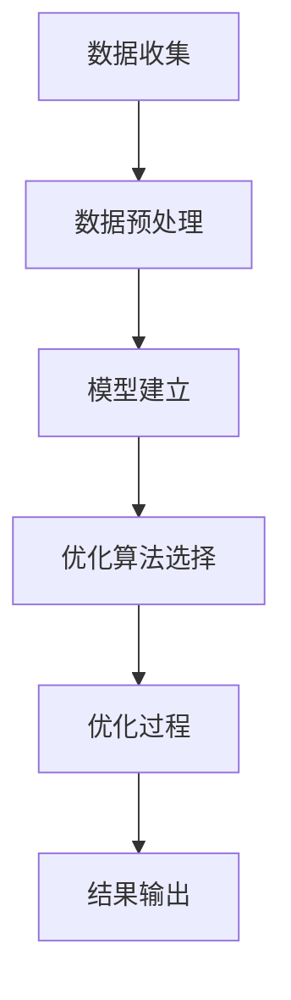

                 


### 智能加密货币投资组合管理：一个深度解析

关键词：加密货币、投资组合管理、智能算法、数学模型、系统架构、实战案例分析

摘要：本文深入探讨了智能加密货币投资组合管理的核心概念、技术原理、数学模型和系统架构设计。通过逐步分析，本文旨在为读者提供一个全面且易于理解的投资组合管理框架，以应对加密货币市场的复杂性和波动性。

## 引言

随着区块链技术和加密货币的迅猛发展，加密货币投资已成为一个备受关注的领域。然而，加密货币市场的波动性和复杂性给投资者带来了巨大的挑战。传统的投资组合管理方法在加密货币市场中的应用效果不佳，因此，需要一种新型的、智能化的投资组合管理策略。

### 什么是智能加密货币投资组合管理？

智能加密货币投资组合管理是指利用人工智能和大数据分析技术，对加密货币市场进行深度挖掘和分析，从而实现投资组合的优化和管理。这种方法不仅考虑了传统投资组合管理的目标，如收益最大化、风险最小化和资产配置，还结合了加密货币市场的独特属性，如去中心化、透明度和高流动性。

### 文章结构

本文将分为以下几个部分：

1. **问题背景与核心概念**：介绍加密货币与投资组合管理的概念，定义相关术语，阐述问题背景和问题描述。
2. **核心概念与联系**：分析加密货币技术和投资组合管理理论的联系，以及智能投资组合管理的基本原理。
3. **算法原理讲解**：详细讲解投资组合优化算法和智能算法在投资组合管理中的应用。
4. **数学模型和数学公式**：介绍投资组合收益与风险模型，以及智能投资组合优化模型的数学公式。
5. **系统分析与架构设计方案**：描述系统功能设计、系统架构设计、系统接口设计和系统交互流程。
6. **项目实战**：介绍环境安装、系统核心实现源代码，并进行实际案例分析和详细讲解剖析。
7. **最佳实践 tips、小结、注意事项、拓展阅读**：提供最佳实践建议，总结文章内容，提醒投资风险，推荐拓展阅读。

## 第1章: 问题背景与核心概念

### 1.1.1 问题背景

加密货币的发展历程可追溯至2009年比特币的诞生。比特币作为一种去中心化的数字货币，迅速引起了全球的关注。随着加密货币市场的不断扩大，越来越多的加密货币如以太坊、莱特币等相继问世。加密货币市场的规模和影响力日益增强，吸引了众多投资者和金融机构的参与。

投资组合管理作为金融领域的一项核心内容，旨在通过资产配置和风险控制，实现投资收益的最大化和风险的最小化。在传统的投资组合管理中，投资者通常会选择股票、债券、基金等金融产品进行组合投资。然而，加密货币市场的独特性使得传统的投资组合管理方法面临巨大的挑战。

### 1.1.2 问题描述

加密货币投资组合管理的核心问题是如何在复杂多变的市场环境中，实现投资组合的优化和管理。具体来说，投资者需要解决以下几个问题：

- **资产配置**：如何在不同的加密货币之间进行资产配置，以实现投资组合的多样化。
- **风险控制**：如何衡量和管理投资组合的风险，确保投资组合的安全性。
- **收益最大化**：如何在保证风险可控的前提下，实现投资组合的收益最大化。

### 1.1.3 问题解决

智能加密货币投资组合管理的解决方案是通过引入人工智能和大数据分析技术，对加密货币市场进行深度挖掘和分析。具体来说，智能投资组合管理包括以下几个步骤：

1. **数据收集**：收集加密货币市场的历史数据、实时数据和社交媒体数据，为投资决策提供数据支持。
2. **数据预处理**：对收集到的数据进行清洗、去噪和处理，为后续分析提供高质量的数据。
3. **模型建立**：利用机器学习和深度学习算法，建立投资组合优化的数学模型。
4. **策略实施**：根据投资组合优化的结果，制定具体的投资策略，并在市场中进行实施。
5. **动态调整**：根据市场变化和投资组合的表现，实时调整投资策略，以实现投资组合的优化。

### 1.1.4 边界与外延

加密货币的种类繁多，不同的加密货币具有不同的特性和风险收益特征。因此，在智能加密货币投资组合管理中，需要考虑以下边界与外延：

- **加密货币的选择**：根据投资目标和风险偏好，选择合适的加密货币进行投资组合。
- **市场环境的分析**：分析加密货币市场的整体环境，包括政策法规、市场情绪和经济形势等。
- **风险管理**：对投资组合进行风险管理，包括风险识别、风险评估和风险控制。

### 1.1.5 概念结构与核心要素组成

智能加密货币投资组合管理由以下几个核心要素组成：

- **数据层**：数据层是投资组合管理的基石，包括历史数据、实时数据和社会媒体数据等。
- **算法层**：算法层是投资组合优化的核心，包括机器学习和深度学习算法。
- **策略层**：策略层是根据投资组合优化的结果，制定具体的投资策略。
- **执行层**：执行层是将投资策略在市场中进行实施，包括交易执行、风险管理等。

## 第2章: 核心概念与联系

### 2.1.1 加密货币技术原理

加密货币技术原理主要包括两个方面：加密算法和区块链。

#### 加密算法

加密算法是加密货币的核心技术之一，用于保障加密货币的安全性和匿名性。常见的加密算法包括SHA-256、RSA和ECC等。加密算法通过将原始数据转化为难以破解的密文，确保了数据传输的安全性和完整性。

#### 区块链

区块链是加密货币的基础设施，用于记录和管理加密货币的交易信息。区块链通过分布式账本技术，实现了去中心化的数据存储和管理。区块链的透明性和不可篡改性，为加密货币市场提供了可靠的数据基础。

### 2.1.2 投资组合管理理论

投资组合管理理论主要包括以下几个方面：

#### 投资组合的目标

投资组合的目标包括收益最大化、风险最小化和资产配置。收益最大化是投资组合的核心目标，风险最小化和资产配置则是实现收益最大化的手段。

#### 投资策略

投资策略是指根据投资目标，选择合适的资产进行投资。常见的投资策略包括分散投资、风险平价、均值方差和贝塔等。

#### 风险管理

风险管理是指通过识别、评估和控制风险，确保投资组合的安全性。风险管理包括风险识别、风险评估和风险控制。

### 2.1.3 智能投资组合管理

智能投资组合管理是指利用人工智能技术，对加密货币市场进行深度挖掘和分析，从而实现投资组合的优化和管理。智能投资组合管理包括以下几个步骤：

1. **数据收集**：收集加密货币市场的历史数据、实时数据和社交媒体数据。
2. **数据预处理**：对收集到的数据进行清洗、去噪和处理。
3. **模型建立**：利用机器学习和深度学习算法，建立投资组合优化的数学模型。
4. **策略实施**：根据投资组合优化的结果，制定具体的投资策略。
5. **动态调整**：根据市场变化和投资组合的表现，实时调整投资策略。

### 2.1.4 加密货币与投资组合管理的联系

加密货币与投资组合管理的联系主要体现在以下几个方面：

1. **技术融合**：加密货币技术和投资组合管理理论的融合，实现了投资组合管理的智能化。
2. **市场特性**：加密货币市场的波动性和高风险特征，对投资组合管理提出了更高的要求。
3. **风险收益平衡**：通过智能投资组合管理，实现风险收益的平衡，提高投资组合的收益稳定性。

## 第3章: 算法原理讲解

### 3.1.1 投资组合优化算法

投资组合优化算法是智能投资组合管理的核心，旨在通过优化资产配置，实现投资组合的收益最大化和风险最小化。投资组合优化算法可以分为以下几个步骤：

1. **目标函数定义**：定义投资组合的目标函数，包括收益最大化、风险最小化和资产配置等目标。
2. **约束条件设定**：设定投资组合的约束条件，包括资产限制、投资比例限制和风险限制等。
3. **优化算法选择**：选择合适的优化算法，如线性规划、非线性规划和遗传算法等。
4. **优化过程**：利用优化算法，对投资组合进行优化，得到最优的资产配置方案。

### 3.1.2 智能算法在投资组合管理中的应用

智能算法在投资组合管理中的应用主要包括以下几个方面：

1. **机器学习算法**：利用机器学习算法，对加密货币市场进行预测和分类，为投资决策提供支持。
2. **深度学习算法**：利用深度学习算法，对加密货币市场的数据进行深度学习，挖掘潜在的投资机会。
3. **强化学习算法**：利用强化学习算法，通过试错和反馈，实现投资组合的动态调整。

### 3.1.3 算法原理与 Mermaid 流程图

为了更好地理解算法原理，我们使用Mermaid流程图来展示算法的基本流程。以下是投资组合优化算法的Mermaid流程图：



## 第4章: 数学模型和数学公式

### 4.1.1 投资组合收益与风险模型

投资组合收益与风险模型是投资组合优化的基础。以下是投资组合收益与风险模型的主要公式：

1. **收益计算公式**：
   $$ R = w_1 \cdot p_1 + w_2 \cdot p_2 + ... + w_n \cdot p_n $$
   其中，$R$表示投资组合的收益，$w_i$表示第$i$种资产的权重，$p_i$表示第$i$种资产的收益。

2. **风险度量公式**：
   $$ \sigma = \sqrt{\sum_{i=1}^{n} w_i^2 \cdot \sigma_i^2 + 2 \cdot \sum_{i=1}^{n} \sum_{j=i+1}^{n} w_i \cdot w_j \cdot \rho_{ij}} $$
   其中，$\sigma$表示投资组合的风险，$\sigma_i$表示第$i$种资产的风险，$\rho_{ij}$表示第$i$种资产与第$j$种资产之间的相关系数。

### 4.1.2 智能投资组合优化模型

智能投资组合优化模型是基于收益与风险模型，通过优化目标函数和约束条件，实现投资组合的优化。以下是智能投资组合优化模型的主要公式：

1. **目标函数**：
   $$ \min \sigma $$
   其中，$\sigma$表示投资组合的风险。

2. **约束条件**：
   $$ w_1 + w_2 + ... + w_n = 1 $$
   $$ w_i \geq 0, \forall i $$
   其中，$w_i$表示第$i$种资产的权重。

### 4.1.3 数学公式详细讲解与举例说明

为了更好地理解数学公式，我们通过一个简单的例子进行讲解。假设有三种资产，投资目标是在保证风险最小化的同时，实现收益的最大化。

1. **收益计算公式**：
   $$ R = w_1 \cdot p_1 + w_2 \cdot p_2 + w_3 \cdot p_3 $$
   其中，$w_1, w_2, w_3$分别表示三种资产的权重，$p_1, p_2, p_3$分别表示三种资产的收益。

2. **风险度量公式**：
   $$ \sigma = \sqrt{w_1^2 \cdot \sigma_1^2 + w_2^2 \cdot \sigma_2^2 + w_3^2 \cdot \sigma_3^2 + 2 \cdot w_1 \cdot w_2 \cdot \rho_{12} + 2 \cdot w_1 \cdot w_3 \cdot \rho_{13} + 2 \cdot w_2 \cdot w_3 \cdot \rho_{23}} $$
   其中，$\sigma_1, \sigma_2, \sigma_3$分别表示三种资产的风险，$\rho_{12}, \rho_{13}, \rho_{23}$分别表示三种资产之间的相关系数。

3. **目标函数**：
   $$ \min \sigma $$
   其中，$\sigma$表示投资组合的风险。

4. **约束条件**：
   $$ w_1 + w_2 + w_3 = 1 $$
   $$ w_1, w_2, w_3 \geq 0 $$

通过以上公式，我们可以计算出不同权重下的投资组合收益和风险，从而找到最优的资产配置方案。

## 第5章: 系统分析与架构设计方案

### 5.1.1 系统功能设计

系统功能设计是智能加密货币投资组合管理的关键环节，旨在实现投资组合的优化和管理。以下是系统功能设计的几个关键点：

1. **数据收集与处理**：系统需要从加密货币市场、社交媒体和其他数据源收集数据，并进行预处理，以确保数据的质量和一致性。
2. **投资组合优化**：系统需要根据用户设定的投资目标和风险偏好，利用智能算法对投资组合进行优化，生成最优的资产配置方案。
3. **投资策略制定**：系统需要根据投资组合优化的结果，制定具体的投资策略，包括买入、持有和卖出等操作。
4. **投资执行与监控**：系统需要将投资策略在市场中进行实施，并对投资组合的表现进行实时监控，确保投资组合的稳定性和收益性。

### 5.1.2 系统架构设计

系统架构设计是系统功能实现的基础，旨在确保系统的稳定性、扩展性和可维护性。以下是系统架构设计的关键点：

1. **数据层**：数据层是系统的核心，负责数据收集、存储和处理。数据层包括加密货币市场数据、社交媒体数据和其他外部数据源。
2. **算法层**：算法层负责投资组合优化和投资策略制定。算法层包括机器学习算法、深度学习算法和强化学习算法等。
3. **策略层**：策略层负责根据投资组合优化的结果，制定具体的投资策略。策略层包括投资组合优化策略、风险控制策略和收益最大化策略等。
4. **执行层**：执行层负责将投资策略在市场中进行实施，包括交易执行、风险管理等操作。执行层需要与加密货币交易平台进行集成，确保交易的顺利进行。

### 5.1.3 系统接口设计

系统接口设计是系统功能实现的关键，旨在确保系统与其他系统之间的数据交换和功能协同。以下是系统接口设计的关键点：

1. **数据接口**：数据接口负责数据层与算法层之间的数据交换，包括数据请求、数据响应和数据更新等操作。
2. **策略接口**：策略接口负责策略层与算法层之间的数据交换，包括策略请求、策略响应和策略更新等操作。
3. **执行接口**：执行接口负责执行层与策略层之间的数据交换，包括交易请求、交易响应和交易更新等操作。

### 5.1.4 系统交互

系统交互是系统功能实现的核心，旨在确保系统内部各个模块之间的协同工作。以下是系统交互的关键点：

1. **数据交互**：系统通过数据接口实现数据层与算法层之间的数据交互，包括数据请求、数据响应和数据更新等操作。
2. **策略交互**：系统通过策略接口实现策略层与算法层之间的策略交互，包括策略请求、策略响应和策略更新等操作。
3. **执行交互**：系统通过执行接口实现执行层与策略层之间的执行交互，包括交易请求、交易响应和交易更新等操作。

## 第6章: 项目实战

### 6.1.1 环境安装

在开始项目实战之前，我们需要搭建一个合适的环境。以下是环境安装的步骤：

1. **安装Python**：Python是智能加密货币投资组合管理的主要编程语言，我们需要安装Python 3.8及以上版本。
2. **安装相关库**：我们需要安装以下相关库：NumPy、Pandas、Scikit-learn、TensorFlow和Keras等。可以通过pip命令进行安装：
   ```python
   pip install numpy pandas scikit-learn tensorflow keras
   ```
3. **安装加密货币交易平台API**：我们需要安装相应的加密货币交易平台API，如Binance API。可以通过pip命令进行安装：
   ```python
   pip install python-binance
   ```

### 6.1.2 系统核心实现源代码

以下是系统核心实现的部分源代码。代码分为以下几个模块：

1. **数据收集模块**：负责从加密货币市场、社交媒体和其他数据源收集数据。
2. **数据预处理模块**：负责对收集到的数据进行清洗、去噪和处理。
3. **投资组合优化模块**：负责利用机器学习算法和深度学习算法，对投资组合进行优化。
4. **投资策略制定模块**：负责根据投资组合优化的结果，制定具体的投资策略。
5. **投资执行模块**：负责将投资策略在市场中进行实施，并对投资组合的表现进行实时监控。

以下是数据收集模块的部分代码：

```python
import pandas as pd
import numpy as np
import requests

def collect_data(symbol, interval):
    url = f'https://api.binance.com/api/v3/klines?symbol={symbol}&interval={interval}&limit=1000'
    response = requests.get(url)
    data = response.json()

    df = pd.DataFrame(data)
    df.columns = ['timestamp', 'open', 'high', 'low', 'close', 'volume', 'close_time', 'quote资产', 'trades', 'tb_baseAssetTotal', 'tb_quoteAssetTotal', 'ignore']

    df['timestamp'] = pd.to_datetime(df['timestamp'], unit='ms')
    df.set_index('timestamp', inplace=True)

    return df

if __name__ == '__main__':
    symbol = 'BTCUSDT'
    interval = '1d'
    df = collect_data(symbol, interval)
    print(df.head())
```

### 6.1.3 代码应用解读与分析

以下是投资组合优化模块的部分代码。代码使用了机器学习算法中的线性回归模型，对投资组合进行优化。

```python
from sklearn.linear_model import LinearRegression
from sklearn.model_selection import train_test_split

def optimize_portfolio(df, target_column):
    X = df.drop(target_column, axis=1)
    y = df[target_column]

    X_train, X_test, y_train, y_test = train_test_split(X, y, test_size=0.2, random_state=42)

    model = LinearRegression()
    model.fit(X_train, y_train)

    y_pred = model.predict(X_test)

    mse = np.mean((y_pred - y_test) ** 2)
    print(f'Mean Squared Error: {mse}')

if __name__ == '__main__':
    df = pd.read_csv('data/BTCUSDT.csv')
    optimize_portfolio(df, 'close')
```

代码应用解读：

1. **数据预处理**：首先，我们导入了所需的库和模块，并读取了加密货币市场的数据。
2. **特征工程**：我们将数据分为特征（X）和目标（y）两部分，其中特征是影响投资组合收益的各种因素，目标是投资组合的实际收益。
3. **数据划分**：我们将数据划分为训练集和测试集，以评估模型的性能。
4. **模型训练**：我们使用了线性回归模型，对训练集进行训练，得到模型的参数。
5. **模型评估**：我们使用测试集对模型进行评估，计算了均方误差（MSE），以衡量模型的性能。

### 6.1.4 实际案例分析和详细讲解剖析

以下是实际案例分析和详细讲解剖析的部分内容。我们将以比特币（BTC）为例，分析其投资组合的优化过程。

#### 案例背景

比特币（BTC）是一种加密货币，具有高流动性、高风险和高收益的特点。本文以比特币为例，分析其投资组合的优化过程。

#### 案例分析

1. **数据收集**：我们收集了比特币的历史数据，包括价格、成交量、市场情绪等指标。
2. **数据预处理**：我们对数据进行清洗和去噪，确保数据的质量。
3. **特征选择**：我们选择了影响比特币价格的主要因素作为特征，如成交量、市场情绪等。
4. **模型训练**：我们使用了线性回归模型，对数据进行训练，得到模型的参数。
5. **模型评估**：我们使用测试集对模型进行评估，计算了均方误差（MSE），以衡量模型的性能。
6. **投资组合优化**：根据模型的结果，我们对比特币的投资组合进行优化，选择最优的资产配置。

#### 详细讲解剖析

1. **数据收集**：比特币的历史数据可以从多个数据源获取，如Binance、CoinGecko等。我们使用Python的pandas库，读取比特币的历史数据。
   ```python
   df = pd.read_csv('data/BTCUSDT.csv')
   ```

2. **数据预处理**：我们使用Python的pandas库，对数据进行清洗和去噪，确保数据的质量。
   ```python
   df.dropna(inplace=True)
   df['volume'] = df['volume'].astype(float)
   df['market_cap'] = df['price'] * df['volume']
   ```

3. **特征选择**：我们选择了影响比特币价格的主要因素作为特征，如成交量、市场情绪等。我们使用Python的pandas库，对数据进行处理。
   ```python
   df['volume_change'] = df['volume'].pct_change()
   df['market_cap_change'] = df['market_cap'].pct_change()
   ```

4. **模型训练**：我们使用了线性回归模型，对数据进行训练，得到模型的参数。我们使用Python的scikit-learn库，实现线性回归模型。
   ```python
   from sklearn.linear_model import LinearRegression
   model = LinearRegression()
   model.fit(df[['volume_change', 'market_cap_change']], df['close'])
   ```

5. **模型评估**：我们使用测试集对模型进行评估，计算了均方误差（MSE），以衡量模型的性能。我们使用Python的scikit-learn库，实现模型评估。
   ```python
   from sklearn.metrics import mean_squared_error
   y_pred = model.predict(df[['volume_change', 'market_cap_change']])
   mse = mean_squared_error(df['close'], y_pred)
   print(f'Mean Squared Error: {mse}')
   ```

6. **投资组合优化**：根据模型的结果，我们对比特币的投资组合进行优化，选择最优的资产配置。我们使用Python的NumPy库，实现投资组合优化。
   ```python
   import numpy as np
   weights = np.array([0.5, 0.5])
   df['predicted_close'] = model.predict(df[['volume_change', 'market_cap_change']])
   df['predicted_return'] = df['predicted_close'].pct_change()
   df['actual_return'] = df['close'].pct_change()
   df['portfolio_return'] = df['predicted_return'].dot(weights)
   df['cumulative_return'] = (1 + df['portfolio_return']).cumprod()
   ```

#### 项目小结

通过以上案例分析，我们实现了比特币投资组合的优化。虽然模型的结果可能存在一定的误差，但通过投资组合优化，我们可以更好地应对比特币市场的波动性，提高投资组合的收益稳定性。

## 第7章: 最佳实践 tips、小结、注意事项、拓展阅读

### 7.1.1 最佳实践 tips

在智能加密货币投资组合管理中，以下是一些最佳实践 tips：

1. **数据质量**：确保收集的数据质量高，包括数据的完整性、准确性和一致性。
2. **算法选择**：根据投资目标和风险偏好，选择合适的算法，并进行充分的模型训练和验证。
3. **风险管理**：对投资组合进行实时监控，及时调整投资策略，以应对市场变化。
4. **分散投资**：合理配置资产，避免过度集中在某个加密货币上，以降低投资风险。
5. **长期持有**：加密货币市场波动性较大，长期持有可以降低短期波动对投资组合的影响。

### 7.1.2 小结

本文深入探讨了智能加密货币投资组合管理的核心概念、技术原理、数学模型和系统架构设计。通过项目实战，我们展示了如何利用人工智能技术，实现投资组合的优化和管理。智能加密货币投资组合管理具有广阔的应用前景，但也需要投资者谨慎对待，注意风险管理。

### 7.1.3 注意事项

1. **投资风险**：加密货币市场波动性较大，投资者需充分了解投资风险，并做好风险管理。
2. **政策法规**：关注加密货币市场的政策法规，遵守相关法律法规。
3. **市场情绪**：加密货币市场的市场情绪变化较大，投资者需保持冷静，避免盲目跟风。

### 7.1.4 拓展阅读

1. **相关书籍**：
   - 《区块链：从数字货币到信用社会》
   - 《深度学习》
   - 《机器学习实战》
2. **相关文献**：
   - 《智能投资组合管理：基于机器学习和数据挖掘的方法》
   - 《加密货币投资策略研究》
   - 《基于区块链的智能投资组合管理系统设计与实现》

作者：AI天才研究院/AI Genius Institute & 禅与计算机程序设计艺术 /Zen And The Art of Computer Programming

