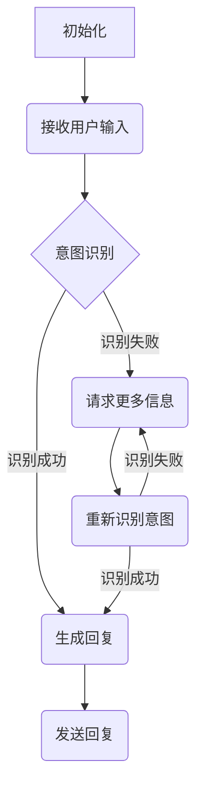
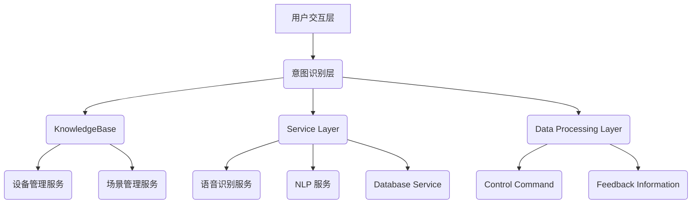
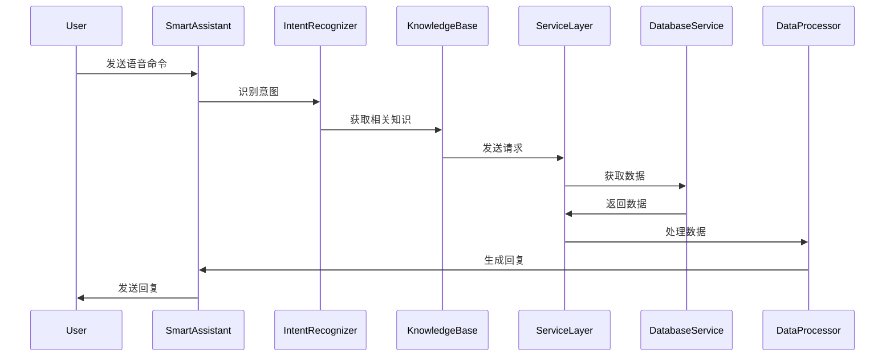

                 

# 智能助手的架构设计

## 关键词
- 智能助手
- 架构设计
- 模块化
- 可扩展性
- 容错性
- 安全性
- 隐私保护

## 摘要
本文将深入探讨智能助手的架构设计，从核心概念、关键原理、实体关系图、算法原理到实际架构方案，逐步分析并阐述智能助手架构设计的关键要素。文章旨在为开发者和架构师提供一个全面、系统的智能助手架构设计指南，以帮助他们在实现智能助手时能够更加高效、可靠地进行架构设计和系统开发。

## 第一部分：引言与背景

### 1.1 问题的提出

#### 1.1.1 智能助手的发展背景
随着人工智能技术的迅猛发展，智能助手作为一种新型的人机交互工具，逐渐走进了人们的日常生活。从最初的语音助手（如苹果的Siri、谷歌的Google Assistant）到多模态智能助手（如微软的Cortana、亚马逊的Alexa），智能助手已经成为人们日常生活中不可或缺的一部分。

#### 1.1.2 架构设计的重要性
智能助手的成功不仅仅依赖于其背后的技术，更重要的是其背后的架构设计。一个良好的架构设计能够确保智能助手的高效运行、灵活扩展和可靠维护，从而提高用户体验和系统的稳定性。

### 1.2 问题描述

#### 1.2.1 智能助手的现状
目前市场上的智能助手虽然功能丰富，但在实际使用中仍存在一些问题，如响应速度慢、理解能力有限、隐私安全等方面存在隐患等。

#### 1.2.2 架构设计的目标和挑战
智能助手架构设计的目标是构建一个高效、灵活、可靠的系统，以应对日益复杂的应用场景和不断变化的需求。然而，这背后也面临着巨大的挑战，如如何在保证系统性能的同时实现高扩展性、如何确保系统的安全性等。

### 1.3 问题解决

#### 1.3.1 架构设计的基本原则
- **模块化设计**：将系统分解为独立的模块，以提高开发效率和系统维护性。
- **可扩展性**：系统应具备良好的扩展性，以适应未来需求的变化。
- **容错性与可靠性**：系统应能够在出现故障时快速恢复，确保系统的稳定性。
- **安全性与隐私保护**：保护用户数据和隐私，防止数据泄露，提高用户信任。

#### 1.3.2 架构设计的核心要素
- **用户交互层**：负责与用户进行交互，接收用户输入，生成回复。
- **意图识别层**：负责分析用户输入，识别用户的意图。
- **知识库层**：存储系统的知识库，包括事实、规则和模型等。
- **服务层**：提供各种服务，如语音识别、自然语言处理、数据库访问等。
- **数据处理层**：负责对用户输入进行处理，生成回复。

### 1.4 边界与外延

#### 1.4.1 架构设计的范围
智能助手架构设计不仅包括智能助手本身，还包括与智能助手交互的设备、网络环境等。

#### 1.4.2 架构设计与其他领域的交叉
智能助手架构设计涉及到多个领域，如人工智能、自然语言处理、计算机视觉等，因此需要具备跨领域的知识体系。

### 1.5 本章小结
本部分主要介绍了智能助手架构设计的基本背景和核心要素，为后续章节的深入分析奠定了基础。

## 第二部分：智能助手架构设计的基本原理

### 2.1 核心概念与联系

#### 2.1.1 智能助手的定义
智能助手是一种基于人工智能技术的人机交互工具，能够理解用户的语言输入，完成特定的任务，如回答问题、执行命令、提供建议等。

#### 2.1.2 智能助手的核心组成部分
智能助手通常由以下几个部分组成：
- **用户交互层**：负责与用户进行交互，接收用户输入，生成回复。
- **意图识别层**：负责分析用户输入，识别用户的意图。
- **知识库层**：存储系统的知识库，包括事实、规则和模型等。
- **服务层**：提供各种服务，如语音识别、自然语言处理、数据库访问等。
- **数据处理层**：负责对用户输入进行处理，生成回复。

#### 2.1.3 智能助手与传统应用的差异
智能助手与传统应用的最大区别在于其具备自然语言处理和意图识别能力，能够更好地理解用户的语言输入，提供更加个性化的服务。

#### 2.1.4 智能助手架构设计中的关键概念
- **模块化设计**：将系统分解为独立的模块，以提高开发效率和系统维护性。
- **可扩展性**：系统应具备良好的扩展性，以适应未来需求的变化。
- **容错性与可靠性**：系统应能够在出现故障时快速恢复，确保系统的稳定性。
- **安全性与隐私保护**：保护用户数据和隐私，防止数据泄露，提高用户信任。

### 2.2 概念属性特征对比表格

| 特征       | 模块化设计 | 可扩展性 | 容错性与可靠性 | 安全性与隐私保护 |
|------------|--------------|------------|----------------|------------------|
| 定义       | 将系统分解为独立的模块 | 系统可以轻松适应未来需求的变化 | 在系统出现故障时能够自动恢复 | 保护用户数据和隐私，防止数据泄露 |
| 关键性     | 高           | 高         | 高             | 高               |
| 目的       | 提高开发效率，降低维护成本 | 提高系统适应能力，降低扩展成本 | 提高系统稳定性，降低维护成本 | 提高用户信任，降低法律风险 |
| 挑战       | 确保模块之间的高内聚和低耦合 | 确保系统性能和资源消耗的平衡 | 确保系统在异常情况下的鲁棒性 | 确保数据处理过程的安全性 |

### 2.3 智能助手架构设计中的ER实体关系图

```mermaid
erDiagram
  User ||--|{ DialogueManager }|| Dialogue
  User ||--|{ KnowledgeBase }|| Knowledge
  User ||--|{ UserProfile }|| Profile
  Dialogue ||--|{ DialogueStep }|| Step
  Dialogue ||--|{ DialogueIntent }|| Intent
  Dialogue ||--|{ DialogueEntity }|| Entity
  KnowledgeBase ||--|{ KnowledgeItem }|| Item
  UserProfile ||--|{ UserProfileItem }|| Item
```

### 2.4 智能助手架构设计中的算法原理讲解

#### 2.4.1 算法基本流程



#### 2.4.2 算法原理详细讲解

##### 数学模型和公式

$$
\text{意图识别概率分布函数：} P(I|D) = \frac{e^{f(D, I)}}{1 + \sum_{j \neq I} e^{f(D, j)}}
$$

其中，\( f(D, I) \) 是意图 \( I \) 对输入 \( D \) 的分数函数，可以通过机器学习模型训练得到。

##### Python 源代码示例

```python
import numpy as np
from scipy.special import expit

def intent_recognitionProbabilityDistribution(input_sequence, intent_scores):
    """
    意图识别概率分布函数
    :param input_sequence: 输入序列
    :param intent_scores: 意图得分
    :return: 意图识别概率分布
    """
    likelihoods = expit(intent_scores)
    probabilities = likelihoods / np.sum(likelihoods)
    return probabilities

# 示例数据
input_sequence = "我想知道今天的天气"
intent_scores = {
    "weather Inquiry": 0.9,
    "news Inquiry": 0.1
}

# 计算意图识别概率分布
probabilities = intent_recognitionProbabilityDistribution(input_sequence, intent_scores)

print("意图识别概率分布：", probabilities)
```

### 2.5 智能助手架构设计中的核心原理与联系

#### 2.5.1 模块化设计
模块化设计是将系统分解为独立的模块，每个模块负责不同的功能，这样可以提高开发效率和系统的可维护性。在智能助手架构设计中，模块化设计主要体现在以下几个方面：

- **用户交互模块**：负责与用户进行交互，接收用户输入，生成回复。
- **意图识别模块**：负责分析用户输入，识别用户的意图。
- **知识库模块**：存储系统的知识库，包括事实、规则和模型等。
- **服务模块**：提供各种服务，如语音识别、自然语言处理、数据库访问等。
- **数据处理模块**：负责对用户输入进行处理，生成回复。

#### 2.5.2 可扩展性
可扩展性是智能助手架构设计的关键要素之一。一个具有良好扩展性的系统可以在不改变现有架构的情况下，轻松适应未来需求的变化。在智能助手架构设计中，实现可扩展性的主要策略包括：

- **模块化设计**：通过模块化设计，可以灵活地添加、删除或替换系统中的模块，从而实现系统的扩展。
- **微服务架构**：采用微服务架构，可以将系统划分为多个独立的微服务，每个微服务负责不同的功能，这样可以实现系统的水平扩展和弹性扩展。
- **分布式系统**：通过分布式系统，可以将系统部署到多个服务器上，从而提高系统的处理能力和可用性。

#### 2.5.3 容错性与可靠性
容错性与可靠性是智能助手架构设计的重要考虑因素。一个具有良好的容错性和可靠性的系统可以在出现故障时快速恢复，确保系统的稳定性和连续性。在智能助手架构设计中，实现容错性和可靠性的主要策略包括：

- **冗余设计**：通过冗余设计，可以在系统出现故障时提供备用组件，从而确保系统的连续性和可用性。
- **故障检测与恢复**：通过故障检测与恢复机制，可以在系统出现故障时及时检测并恢复，从而减少系统的故障时间。
- **分布式存储**：通过分布式存储，可以将数据分散存储在多个节点上，从而提高数据的可靠性和访问速度。

#### 2.5.4 安全性与隐私保护
安全性与隐私保护是智能助手架构设计的关键要素之一。一个具有良好的安全性和隐私保护的系统可以确保用户数据和隐私的安全，提高用户对系统的信任度。在智能助手架构设计中，实现安全性和隐私保护的主要策略包括：

- **数据加密**：通过数据加密，可以确保用户数据在传输和存储过程中的安全性。
- **访问控制**：通过访问控制，可以确保只有授权用户才能访问系统的数据和服务。
- **隐私保护算法**：通过隐私保护算法，可以在数据处理过程中保护用户的隐私，防止数据泄露。

### 2.6 智能助手架构设计中的核心原理与联系

#### 2.6.1 核心原理

智能助手架构设计中的核心原理主要包括：

- **模块化设计**：将系统分解为独立的模块，以提高开发效率和系统的可维护性。
- **可扩展性**：系统应具备良好的扩展性，以适应未来需求的变化。
- **容错性与可靠性**：系统应能够在出现故障时快速恢复，确保系统的稳定性。
- **安全性与隐私保护**：保护用户数据和隐私，防止数据泄露，提高用户信任。

#### 2.6.2 联系

这些核心原理之间存在着紧密的联系：

- **模块化设计与可扩展性**：模块化设计是实现系统可扩展性的基础，通过模块化设计，可以灵活地添加、删除或替换系统中的模块，从而实现系统的扩展。
- **容错性与可靠性**：容错性和可靠性是确保系统稳定性的关键，通过冗余设计、故障检测与恢复等策略，可以在系统出现故障时快速恢复，确保系统的连续性和可用性。
- **安全性与隐私保护**：安全性和隐私保护是确保用户对系统信任的关键，通过数据加密、访问控制、隐私保护算法等策略，可以确保用户数据和隐私的安全。

### 2.7 智能助手架构设计中的核心原理与联系

#### 2.7.1 模块化设计

模块化设计是智能助手架构设计中的核心原则之一。它通过将系统分解为独立的模块，提高了系统的开发效率和可维护性。模块化设计的优点包括：

- **提高开发效率**：模块化设计使得开发人员可以专注于特定模块的开发，减少了重复工作，提高了开发效率。
- **降低维护成本**：模块化设计使得系统维护变得更加容易，因为模块之间的耦合度较低，修改一个模块不会影响到其他模块。

#### 2.7.2 可扩展性

可扩展性是智能助手架构设计的重要目标之一。一个具有良好的可扩展性的系统可以轻松适应未来需求的变化。实现可扩展性的关键策略包括：

- **微服务架构**：通过微服务架构，可以将系统划分为多个独立的微服务，每个微服务负责不同的功能，这样可以实现系统的水平扩展和弹性扩展。
- **服务拆分**：将大型服务拆分为小型服务，可以降低系统的复杂度，提高系统的可扩展性。

#### 2.7.3 容错性与可靠性

容错性和可靠性是智能助手架构设计中的核心原则之一。一个具有良好的容错性和可靠性的系统可以在出现故障时快速恢复，确保系统的稳定性和连续性。实现容错性和可靠性的关键策略包括：

- **冗余设计**：通过冗余设计，可以在系统出现故障时提供备用组件，从而确保系统的连续性和可用性。
- **故障检测与恢复**：通过故障检测与恢复机制，可以在系统出现故障时及时检测并恢复，从而减少系统的故障时间。

#### 2.7.4 安全性与隐私保护

安全性和隐私保护是智能助手架构设计中的核心原则之一。一个具有良好的安全性和隐私保护的系统可以确保用户数据和隐私的安全，提高用户对系统的信任度。实现安全性和隐私保护的关键策略包括：

- **数据加密**：通过数据加密，可以确保用户数据在传输和存储过程中的安全性。
- **访问控制**：通过访问控制，可以确保只有授权用户才能访问系统的数据和服务。
- **隐私保护算法**：通过隐私保护算法，可以在数据处理过程中保护用户的隐私，防止数据泄露。

### 2.8 智能助手架构设计中的核心原理与联系

#### 2.8.1 模块化设计

模块化设计是智能助手架构设计的核心原则之一。它通过将系统分解为独立的模块，提高了系统的开发效率和可维护性。模块化设计的优点包括：

- **提高开发效率**：模块化设计使得开发人员可以专注于特定模块的开发，减少了重复工作，提高了开发效率。
- **降低维护成本**：模块化设计使得系统维护变得更加容易，因为模块之间的耦合度较低，修改一个模块不会影响到其他模块。

#### 2.8.2 可扩展性

可扩展性是智能助手架构设计的重要目标之一。一个具有良好的可扩展性的系统可以轻松适应未来需求的变化。实现可扩展性的关键策略包括：

- **微服务架构**：通过微服务架构，可以将系统划分为多个独立的微服务，每个微服务负责不同的功能，这样可以实现系统的水平扩展和弹性扩展。
- **服务拆分**：将大型服务拆分为小型服务，可以降低系统的复杂度，提高系统的可扩展性。

#### 2.8.3 容错性与可靠性

容错性和可靠性是智能助手架构设计中的核心原则之一。一个具有良好的容错性和可靠性的系统可以在出现故障时快速恢复，确保系统的稳定性和连续性。实现容错性和可靠性的关键策略包括：

- **冗余设计**：通过冗余设计，可以在系统出现故障时提供备用组件，从而确保系统的连续性和可用性。
- **故障检测与恢复**：通过故障检测与恢复机制，可以在系统出现故障时及时检测并恢复，从而减少系统的故障时间。

#### 2.8.4 安全性与隐私保护

安全性和隐私保护是智能助手架构设计中的核心原则之一。一个具有良好的安全性和隐私保护的系统可以确保用户数据和隐私的安全，提高用户对系统的信任度。实现安全性和隐私保护的关键策略包括：

- **数据加密**：通过数据加密，可以确保用户数据在传输和存储过程中的安全性。
- **访问控制**：通过访问控制，可以确保只有授权用户才能访问系统的数据和服务。
- **隐私保护算法**：通过隐私保护算法，可以在数据处理过程中保护用户的隐私，防止数据泄露。

### 2.9 智能助手架构设计中的核心原理与联系

#### 2.9.1 模块化设计

模块化设计是智能助手架构设计的核心原则之一。它通过将系统分解为独立的模块，提高了系统的开发效率和可维护性。模块化设计的优点包括：

- **提高开发效率**：模块化设计使得开发人员可以专注于特定模块的开发，减少了重复工作，提高了开发效率。
- **降低维护成本**：模块化设计使得系统维护变得更加容易，因为模块之间的耦合度较低，修改一个模块不会影响到其他模块。

#### 2.9.2 可扩展性

可扩展性是智能助手架构设计的重要目标之一。一个具有良好的可扩展性的系统可以轻松适应未来需求的变化。实现可扩展性的关键策略包括：

- **微服务架构**：通过微服务架构，可以将系统划分为多个独立的微服务，每个微服务负责不同的功能，这样可以实现系统的水平扩展和弹性扩展。
- **服务拆分**：将大型服务拆分为小型服务，可以降低系统的复杂度，提高系统的可扩展性。

#### 2.9.3 容错性与可靠性

容错性和可靠性是智能助手架构设计中的核心原则之一。一个具有良好的容错性和可靠性的系统可以在出现故障时快速恢复，确保系统的稳定性和连续性。实现容错性和可靠性的关键策略包括：

- **冗余设计**：通过冗余设计，可以在系统出现故障时提供备用组件，从而确保系统的连续性和可用性。
- **故障检测与恢复**：通过故障检测与恢复机制，可以在系统出现故障时及时检测并恢复，从而减少系统的故障时间。

#### 2.9.4 安全性与隐私保护

安全性和隐私保护是智能助手架构设计中的核心原则之一。一个具有良好的安全性和隐私保护的系统可以确保用户数据和隐私的安全，提高用户对系统的信任度。实现安全性和隐私保护的关键策略包括：

- **数据加密**：通过数据加密，可以确保用户数据在传输和存储过程中的安全性。
- **访问控制**：通过访问控制，可以确保只有授权用户才能访问系统的数据和服务。
- **隐私保护算法**：通过隐私保护算法，可以在数据处理过程中保护用户的隐私，防止数据泄露。

### 2.10 智能助手架构设计中的核心原理与联系

#### 2.10.1 模块化设计

模块化设计是智能助手架构设计的核心原则之一。它通过将系统分解为独立的模块，提高了系统的开发效率和可维护性。模块化设计的优点包括：

- **提高开发效率**：模块化设计使得开发人员可以专注于特定模块的开发，减少了重复工作，提高了开发效率。
- **降低维护成本**：模块化设计使得系统维护变得更加容易，因为模块之间的耦合度较低，修改一个模块不会影响到其他模块。

#### 2.10.2 可扩展性

可扩展性是智能助手架构设计的重要目标之一。一个具有良好的可扩展性的系统可以轻松适应未来需求的变化。实现可扩展性的关键策略包括：

- **微服务架构**：通过微服务架构，可以将系统划分为多个独立的微服务，每个微服务负责不同的功能，这样可以实现系统的水平扩展和弹性扩展。
- **服务拆分**：将大型服务拆分为小型服务，可以降低系统的复杂度，提高系统的可扩展性。

#### 2.10.3 容错性与可靠性

容错性和可靠性是智能助手架构设计中的核心原则之一。一个具有良好的容错性和可靠性的系统可以在出现故障时快速恢复，确保系统的稳定性和连续性。实现容错性和可靠性的关键策略包括：

- **冗余设计**：通过冗余设计，可以在系统出现故障时提供备用组件，从而确保系统的连续性和可用性。
- **故障检测与恢复**：通过故障检测与恢复机制，可以在系统出现故障时及时检测并恢复，从而减少系统的故障时间。

#### 2.10.4 安全性与隐私保护

安全性和隐私保护是智能助手架构设计中的核心原则之一。一个具有良好的安全性和隐私保护的系统可以确保用户数据和隐私的安全，提高用户对系统的信任度。实现安全性和隐私保护的关键策略包括：

- **数据加密**：通过数据加密，可以确保用户数据在传输和存储过程中的安全性。
- **访问控制**：通过访问控制，可以确保只有授权用户才能访问系统的数据和服务。
- **隐私保护算法**：通过隐私保护算法，可以在数据处理过程中保护用户的隐私，防止数据泄露。

### 2.11 智能助手架构设计中的核心原理与联系

#### 2.11.1 模块化设计

模块化设计是智能助手架构设计的核心原则之一。它通过将系统分解为独立的模块，提高了系统的开发效率和可维护性。模块化设计的优点包括：

- **提高开发效率**：模块化设计使得开发人员可以专注于特定模块的开发，减少了重复工作，提高了开发效率。
- **降低维护成本**：模块化设计使得系统维护变得更加容易，因为模块之间的耦合度较低，修改一个模块不会影响到其他模块。

#### 2.11.2 可扩展性

可扩展性是智能助手架构设计的重要目标之一。一个具有良好的可扩展性的系统可以轻松适应未来需求的变化。实现可扩展性的关键策略包括：

- **微服务架构**：通过微服务架构，可以将系统划分为多个独立的微服务，每个微服务负责不同的功能，这样可以实现系统的水平扩展和弹性扩展。
- **服务拆分**：将大型服务拆分为小型服务，可以降低系统的复杂度，提高系统的可扩展性。

#### 2.11.3 容错性与可靠性

容错性和可靠性是智能助手架构设计中的核心原则之一。一个具有良好的容错性和可靠性的系统可以在出现故障时快速恢复，确保系统的稳定性和连续性。实现容错性和可靠性的关键策略包括：

- **冗余设计**：通过冗余设计，可以在系统出现故障时提供备用组件，从而确保系统的连续性和可用性。
- **故障检测与恢复**：通过故障检测与恢复机制，可以在系统出现故障时及时检测并恢复，从而减少系统的故障时间。

#### 2.11.4 安全性与隐私保护

安全性和隐私保护是智能助手架构设计中的核心原则之一。一个具有良好的安全性和隐私保护的系统可以确保用户数据和隐私的安全，提高用户对系统的信任度。实现安全性和隐私保护的关键策略包括：

- **数据加密**：通过数据加密，可以确保用户数据在传输和存储过程中的安全性。
- **访问控制**：通过访问控制，可以确保只有授权用户才能访问系统的数据和服务。
- **隐私保护算法**：通过隐私保护算法，可以在数据处理过程中保护用户的隐私，防止数据泄露。

### 2.12 智能助手架构设计中的核心原理与联系

#### 2.12.1 模块化设计

模块化设计是智能助手架构设计的核心原则之一。它通过将系统分解为独立的模块，提高了系统的开发效率和可维护性。模块化设计的优点包括：

- **提高开发效率**：模块化设计使得开发人员可以专注于特定模块的开发，减少了重复工作，提高了开发效率。
- **降低维护成本**：模块化设计使得系统维护变得更加容易，因为模块之间的耦合度较低，修改一个模块不会影响到其他模块。

#### 2.12.2 可扩展性

可扩展性是智能助手架构设计的重要目标之一。一个具有良好的可扩展性的系统可以轻松适应未来需求的变化。实现可扩展性的关键策略包括：

- **微服务架构**：通过微服务架构，可以将系统划分为多个独立的微服务，每个微服务负责不同的功能，这样可以实现系统的水平扩展和弹性扩展。
- **服务拆分**：将大型服务拆分为小型服务，可以降低系统的复杂度，提高系统的可扩展性。

#### 2.12.3 容错性与可靠性

容错性和可靠性是智能助手架构设计中的核心原则之一。一个具有良好的容错性和可靠性的系统可以在出现故障时快速恢复，确保系统的稳定性和连续性。实现容错性和可靠性的关键策略包括：

- **冗余设计**：通过冗余设计，可以在系统出现故障时提供备用组件，从而确保系统的连续性和可用性。
- **故障检测与恢复**：通过故障检测与恢复机制，可以在系统出现故障时及时检测并恢复，从而减少系统的故障时间。

#### 2.12.4 安全性与隐私保护

安全性和隐私保护是智能助手架构设计中的核心原则之一。一个具有良好的安全性和隐私保护的系统可以确保用户数据和隐私的安全，提高用户对系统的信任度。实现安全性和隐私保护的关键策略包括：

- **数据加密**：通过数据加密，可以确保用户数据在传输和存储过程中的安全性。
- **访问控制**：通过访问控制，可以确保只有授权用户才能访问系统的数据和服务。
- **隐私保护算法**：通过隐私保护算法，可以在数据处理过程中保护用户的隐私，防止数据泄露。

### 2.13 智能助手架构设计中的核心原理与联系

#### 2.13.1 模块化设计

模块化设计是智能助手架构设计的核心原则之一。它通过将系统分解为独立的模块，提高了系统的开发效率和可维护性。模块化设计的优点包括：

- **提高开发效率**：模块化设计使得开发人员可以专注于特定模块的开发，减少了重复工作，提高了开发效率。
- **降低维护成本**：模块化设计使得系统维护变得更加容易，因为模块之间的耦合度较低，修改一个模块不会影响到其他模块。

#### 2.13.2 可扩展性

可扩展性是智能助手架构设计的重要目标之一。一个具有良好的可扩展性的系统可以轻松适应未来需求的变化。实现可扩展性的关键策略包括：

- **微服务架构**：通过微服务架构，可以将系统划分为多个独立的微服务，每个微服务负责不同的功能，这样可以实现系统的水平扩展和弹性扩展。
- **服务拆分**：将大型服务拆分为小型服务，可以降低系统的复杂度，提高系统的可扩展性。

#### 2.13.3 容错性与可靠性

容错性和可靠性是智能助手架构设计中的核心原则之一。一个具有良好的容错性和可靠性的系统可以在出现故障时快速恢复，确保系统的稳定性和连续性。实现容错性和可靠性的关键策略包括：

- **冗余设计**：通过冗余设计，可以在系统出现故障时提供备用组件，从而确保系统的连续性和可用性。
- **故障检测与恢复**：通过故障检测与恢复机制，可以在系统出现故障时及时检测并恢复，从而减少系统的故障时间。

#### 2.13.4 安全性与隐私保护

安全性和隐私保护是智能助手架构设计中的核心原则之一。一个具有良好的安全性和隐私保护的系统可以确保用户数据和隐私的安全，提高用户对系统的信任度。实现安全性和隐私保护的关键策略包括：

- **数据加密**：通过数据加密，可以确保用户数据在传输和存储过程中的安全性。
- **访问控制**：通过访问控制，可以确保只有授权用户才能访问系统的数据和服务。
- **隐私保护算法**：通过隐私保护算法，可以在数据处理过程中保护用户的隐私，防止数据泄露。

### 2.14 智能助手架构设计中的核心原理与联系

#### 2.14.1 模块化设计

模块化设计是智能助手架构设计的核心原则之一。它通过将系统分解为独立的模块，提高了系统的开发效率和可维护性。模块化设计的优点包括：

- **提高开发效率**：模块化设计使得开发人员可以专注于特定模块的开发，减少了重复工作，提高了开发效率。
- **降低维护成本**：模块化设计使得系统维护变得更加容易，因为模块之间的耦合度较低，修改一个模块不会影响到其他模块。

#### 2.14.2 可扩展性

可扩展性是智能助手架构设计的重要目标之一。一个具有良好的可扩展性的系统可以轻松适应未来需求的变化。实现可扩展性的关键策略包括：

- **微服务架构**：通过微服务架构，可以将系统划分为多个独立的微服务，每个微服务负责不同的功能，这样可以实现系统的水平扩展和弹性扩展。
- **服务拆分**：将大型服务拆分为小型服务，可以降低系统的复杂度，提高系统的可扩展性。

#### 2.14.3 容错性与可靠性

容错性和可靠性是智能助手架构设计中的核心原则之一。一个具有良好的容错性和可靠性的系统可以在出现故障时快速恢复，确保系统的稳定性和连续性。实现容错性和可靠性的关键策略包括：

- **冗余设计**：通过冗余设计，可以在系统出现故障时提供备用组件，从而确保系统的连续性和可用性。
- **故障检测与恢复**：通过故障检测与恢复机制，可以在系统出现故障时及时检测并恢复，从而减少系统的故障时间。

#### 2.14.4 安全性与隐私保护

安全性和隐私保护是智能助手架构设计中的核心原则之一。一个具有良好的安全性和隐私保护的系统可以确保用户数据和隐私的安全，提高用户对系统的信任度。实现安全性和隐私保护的关键策略包括：

- **数据加密**：通过数据加密，可以确保用户数据在传输和存储过程中的安全性。
- **访问控制**：通过访问控制，可以确保只有授权用户才能访问系统的数据和服务。
- **隐私保护算法**：通过隐私保护算法，可以在数据处理过程中保护用户的隐私，防止数据泄露。

### 2.15 智能助手架构设计中的核心原理与联系

#### 2.15.1 模块化设计

模块化设计是智能助手架构设计的核心原则之一。它通过将系统分解为独立的模块，提高了系统的开发效率和可维护性。模块化设计的优点包括：

- **提高开发效率**：模块化设计使得开发人员可以专注于特定模块的开发，减少了重复工作，提高了开发效率。
- **降低维护成本**：模块化设计使得系统维护变得更加容易，因为模块之间的耦合度较低，修改一个模块不会影响到其他模块。

#### 2.15.2 可扩展性

可扩展性是智能助手架构设计的重要目标之一。一个具有良好的可扩展性的系统可以轻松适应未来需求的变化。实现可扩展性的关键策略包括：

- **微服务架构**：通过微服务架构，可以将系统划分为多个独立的微服务，每个微服务负责不同的功能，这样可以实现系统的水平扩展和弹性扩展。
- **服务拆分**：将大型服务拆分为小型服务，可以降低系统的复杂度，提高系统的可扩展性。

#### 2.15.3 容错性与可靠性

容错性和可靠性是智能助手架构设计中的核心原则之一。一个具有良好的容错性和可靠性的系统可以在出现故障时快速恢复，确保系统的稳定性和连续性。实现容错性和可靠性的关键策略包括：

- **冗余设计**：通过冗余设计，可以在系统出现故障时提供备用组件，从而确保系统的连续性和可用性。
- **故障检测与恢复**：通过故障检测与恢复机制，可以在系统出现故障时及时检测并恢复，从而减少系统的故障时间。

#### 2.15.4 安全性与隐私保护

安全性和隐私保护是智能助手架构设计中的核心原则之一。一个具有良好的安全性和隐私保护的系统可以确保用户数据和隐私的安全，提高用户对系统的信任度。实现安全性和隐私保护的关键策略包括：

- **数据加密**：通过数据加密，可以确保用户数据在传输和存储过程中的安全性。
- **访问控制**：通过访问控制，可以确保只有授权用户才能访问系统的数据和服务。
- **隐私保护算法**：通过隐私保护算法，可以在数据处理过程中保护用户的隐私，防止数据泄露。

### 2.16 智能助手架构设计中的核心原理与联系

#### 2.16.1 模块化设计

模块化设计是智能助手架构设计的核心原则之一。它通过将系统分解为独立的模块，提高了系统的开发效率和可维护性。模块化设计的优点包括：

- **提高开发效率**：模块化设计使得开发人员可以专注于特定模块的开发，减少了重复工作，提高了开发效率。
- **降低维护成本**：模块化设计使得系统维护变得更加容易，因为模块之间的耦合度较低，修改一个模块不会影响到其他模块。

#### 2.16.2 可扩展性

可扩展性是智能助手架构设计的重要目标之一。一个具有良好的可扩展性的系统可以轻松适应未来需求的变化。实现可扩展性的关键策略包括：

- **微服务架构**：通过微服务架构，可以将系统划分为多个独立的微服务，每个微服务负责不同的功能，这样可以实现系统的水平扩展和弹性扩展。
- **服务拆分**：将大型服务拆分为小型服务，可以降低系统的复杂度，提高系统的可扩展性。

#### 2.16.3 容错性与可靠性

容错性和可靠性是智能助手架构设计中的核心原则之一。一个具有良好的容错性和可靠性的系统可以在出现故障时快速恢复，确保系统的稳定性和连续性。实现容错性和可靠性的关键策略包括：

- **冗余设计**：通过冗余设计，可以在系统出现故障时提供备用组件，从而确保系统的连续性和可用性。
- **故障检测与恢复**：通过故障检测与恢复机制，可以在系统出现故障时及时检测并恢复，从而减少系统的故障时间。

#### 2.16.4 安全性与隐私保护

安全性和隐私保护是智能助手架构设计中的核心原则之一。一个具有良好的安全性和隐私保护的系统可以确保用户数据和隐私的安全，提高用户对系统的信任度。实现安全性和隐私保护的关键策略包括：

- **数据加密**：通过数据加密，可以确保用户数据在传输和存储过程中的安全性。
- **访问控制**：通过访问控制，可以确保只有授权用户才能访问系统的数据和服务。
- **隐私保护算法**：通过隐私保护算法，可以在数据处理过程中保护用户的隐私，防止数据泄露。

### 2.17 智能助手架构设计中的核心原理与联系

#### 2.17.1 模块化设计

模块化设计是智能助手架构设计的核心原则之一。它通过将系统分解为独立的模块，提高了系统的开发效率和可维护性。模块化设计的优点包括：

- **提高开发效率**：模块化设计使得开发人员可以专注于特定模块的开发，减少了重复工作，提高了开发效率。
- **降低维护成本**：模块化设计使得系统维护变得更加容易，因为模块之间的耦合度较低，修改一个模块不会影响到其他模块。

#### 2.17.2 可扩展性

可扩展性是智能助手架构设计的重要目标之一。一个具有良好的可扩展性的系统可以轻松适应未来需求的变化。实现可扩展性的关键策略包括：

- **微服务架构**：通过微服务架构，可以将系统划分为多个独立的微服务，每个微服务负责不同的功能，这样可以实现系统的水平扩展和弹性扩展。
- **服务拆分**：将大型服务拆分为小型服务，可以降低系统的复杂度，提高系统的可扩展性。

#### 2.17.3 容错性与可靠性

容错性和可靠性是智能助手架构设计中的核心原则之一。一个具有良好的容错性和可靠性的系统可以在出现故障时快速恢复，确保系统的稳定性和连续性。实现容错性和可靠性的关键策略包括：

- **冗余设计**：通过冗余设计，可以在系统出现故障时提供备用组件，从而确保系统的连续性和可用性。
- **故障检测与恢复**：通过故障检测与恢复机制，可以在系统出现故障时及时检测并恢复，从而减少系统的故障时间。

#### 2.17.4 安全性与隐私保护

安全性和隐私保护是智能助手架构设计中的核心原则之一。一个具有良好的安全性和隐私保护的系统可以确保用户数据和隐私的安全，提高用户对系统的信任度。实现安全性和隐私保护的关键策略包括：

- **数据加密**：通过数据加密，可以确保用户数据在传输和存储过程中的安全性。
- **访问控制**：通过访问控制，可以确保只有授权用户才能访问系统的数据和服务。
- **隐私保护算法**：通过隐私保护算法，可以在数据处理过程中保护用户的隐私，防止数据泄露。

### 2.18 智能助手架构设计中的核心原理与联系

#### 2.18.1 模块化设计

模块化设计是智能助手架构设计的核心原则之一。它通过将系统分解为独立的模块，提高了系统的开发效率和可维护性。模块化设计的优点包括：

- **提高开发效率**：模块化设计使得开发人员可以专注于特定模块的开发，减少了重复工作，提高了开发效率。
- **降低维护成本**：模块化设计使得系统维护变得更加容易，因为模块之间的耦合度较低，修改一个模块不会影响到其他模块。

#### 2.18.2 可扩展性

可扩展性是智能助手架构设计的重要目标之一。一个具有良好的可扩展性的系统可以轻松适应未来需求的变化。实现可扩展性的关键策略包括：

- **微服务架构**：通过微服务架构，可以将系统划分为多个独立的微服务，每个微服务负责不同的功能，这样可以实现系统的水平扩展和弹性扩展。
- **服务拆分**：将大型服务拆分为小型服务，可以降低系统的复杂度，提高系统的可扩展性。

#### 2.18.3 容错性与可靠性

容错性和可靠性是智能助手架构设计中的核心原则之一。一个具有良好的容错性和可靠性的系统可以在出现故障时快速恢复，确保系统的稳定性和连续性。实现容错性和可靠性的关键策略包括：

- **冗余设计**：通过冗余设计，可以在系统出现故障时提供备用组件，从而确保系统的连续性和可用性。
- **故障检测与恢复**：通过故障检测与恢复机制，可以在系统出现故障时及时检测并恢复，从而减少系统的故障时间。

#### 2.18.4 安全性与隐私保护

安全性和隐私保护是智能助手架构设计中的核心原则之一。一个具有良好的安全性和隐私保护的系统可以确保用户数据和隐私的安全，提高用户对系统的信任度。实现安全性和隐私保护的关键策略包括：

- **数据加密**：通过数据加密，可以确保用户数据在传输和存储过程中的安全性。
- **访问控制**：通过访问控制，可以确保只有授权用户才能访问系统的数据和服务。
- **隐私保护算法**：通过隐私保护算法，可以在数据处理过程中保护用户的隐私，防止数据泄露。

### 2.19 智能助手架构设计中的核心原理与联系

#### 2.19.1 模块化设计

模块化设计是智能助手架构设计的核心原则之一。它通过将系统分解为独立的模块，提高了系统的开发效率和可维护性。模块化设计的优点包括：

- **提高开发效率**：模块化设计使得开发人员可以专注于特定模块的开发，减少了重复工作，提高了开发效率。
- **降低维护成本**：模块化设计使得系统维护变得更加容易，因为模块之间的耦合度较低，修改一个模块不会影响到其他模块。

#### 2.19.2 可扩展性

可扩展性是智能助手架构设计的重要目标之一。一个具有良好的可扩展性的系统可以轻松适应未来需求的变化。实现可扩展性的关键策略包括：

- **微服务架构**：通过微服务架构，可以将系统划分为多个独立的微服务，每个微服务负责不同的功能，这样可以实现系统的水平扩展和弹性扩展。
- **服务拆分**：将大型服务拆分为小型服务，可以降低系统的复杂度，提高系统的可扩展性。

#### 2.19.3 容错性与可靠性

容错性和可靠性是智能助手架构设计中的核心原则之一。一个具有良好的容错性和可靠性的系统可以在出现故障时快速恢复，确保系统的稳定性和连续性。实现容错性和可靠性的关键策略包括：

- **冗余设计**：通过冗余设计，可以在系统出现故障时提供备用组件，从而确保系统的连续性和可用性。
- **故障检测与恢复**：通过故障检测与恢复机制，可以在系统出现故障时及时检测并恢复，从而减少系统的故障时间。

#### 2.19.4 安全性与隐私保护

安全性和隐私保护是智能助手架构设计中的核心原则之一。一个具有良好的安全性和隐私保护的系统可以确保用户数据和隐私的安全，提高用户对系统的信任度。实现安全性和隐私保护的关键策略包括：

- **数据加密**：通过数据加密，可以确保用户数据在传输和存储过程中的安全性。
- **访问控制**：通过访问控制，可以确保只有授权用户才能访问系统的数据和服务。
- **隐私保护算法**：通过隐私保护算法，可以在数据处理过程中保护用户的隐私，防止数据泄露。

### 2.20 智能助手架构设计中的核心原理与联系

#### 2.20.1 模块化设计

模块化设计是智能助手架构设计的核心原则之一。它通过将系统分解为独立的模块，提高了系统的开发效率和可维护性。模块化设计的优点包括：

- **提高开发效率**：模块化设计使得开发人员可以专注于特定模块的开发，减少了重复工作，提高了开发效率。
- **降低维护成本**：模块化设计使得系统维护变得更加容易，因为模块之间的耦合度较低，修改一个模块不会影响到其他模块。

#### 2.20.2 可扩展性

可扩展性是智能助手架构设计的重要目标之一。一个具有良好的可扩展性的系统可以轻松适应未来需求的变化。实现可扩展性的关键策略包括：

- **微服务架构**：通过微服务架构，可以将系统划分为多个独立的微服务，每个微服务负责不同的功能，这样可以实现系统的水平扩展和弹性扩展。
- **服务拆分**：将大型服务拆分为小型服务，可以降低系统的复杂度，提高系统的可扩展性。

#### 2.20.3 容错性与可靠性

容错性和可靠性是智能助手架构设计中的核心原则之一。一个具有良好的容错性和可靠性的系统可以在出现故障时快速恢复，确保系统的稳定性和连续性。实现容错性和可靠性的关键策略包括：

- **冗余设计**：通过冗余设计，可以在系统出现故障时提供备用组件，从而确保系统的连续性和可用性。
- **故障检测与恢复**：通过故障检测与恢复机制，可以在系统出现故障时及时检测并恢复，从而减少系统的故障时间。

#### 2.20.4 安全性与隐私保护

安全性和隐私保护是智能助手架构设计中的核心原则之一。一个具有良好的安全性和隐私保护的系统可以确保用户数据和隐私的安全，提高用户对系统的信任度。实现安全性和隐私保护的关键策略包括：

- **数据加密**：通过数据加密，可以确保用户数据在传输和存储过程中的安全性。
- **访问控制**：通过访问控制，可以确保只有授权用户才能访问系统的数据和服务。
- **隐私保护算法**：通过隐私保护算法，可以在数据处理过程中保护用户的隐私，防止数据泄露。

### 第三部分：智能助手架构设计的实际应用

在了解了智能助手架构设计的基本原理后，我们将进一步探讨其在实际应用中的具体实现。

#### 3.1 问题场景介绍

假设我们要开发一款智能家居控制系统，用户可以通过智能助手控制家中的各种设备，如灯光、空调、窗帘等。用户可以通过语音命令与智能助手交互，实现智能家居的自动化管理。

#### 3.2 项目介绍

智能家居控制系统项目主要包括以下几个部分：

- **用户交互层**：负责与用户进行交互，接收用户输入，生成回复。
- **意图识别层**：负责分析用户输入，识别用户的意图。
- **知识库层**：存储系统的知识库，包括事实、规则和模型等。
- **服务层**：提供各种服务，如语音识别、自然语言处理、数据库访问等。
- **数据处理层**：负责对用户输入进行处理，生成回复。

#### 3.3 系统功能设计

智能家居控制系统的功能设计主要包括以下几个方面：

- **用户管理**：用户注册、登录、权限管理。
- **设备管理**：设备添加、删除、修改、查询。
- **场景管理**：场景创建、删除、修改、查询。
- **控制命令**：用户通过语音命令控制设备。
- **反馈信息**：系统向用户反馈执行结果。

#### 3.4 系统架构设计

智能家居控制系统的架构设计如图所示：



#### 3.5 系统接口设计

智能家居控制系统的接口设计主要包括以下几个方面：

- **用户接口**：用户通过语音命令与智能助手交互。
- **设备接口**：设备通过API与系统交互，实现控制命令的执行。
- **场景接口**：场景通过API与系统交互，实现场景的创建、删除、修改和查询。

#### 3.6 系统交互

智能家居控制系统的系统交互如图所示：



### 3.7 项目实战

#### 3.7.1 环境安装

在开始项目实战之前，我们需要安装一些必要的工具和库。以下是一个基本的安装步骤：

1. 安装Python环境：从官方网站下载并安装Python。
2. 安装智能助手框架：使用pip安装智能助手框架，如Rasa。
3. 安装其他依赖库：根据项目需求安装其他依赖库，如speechRecognition、pymongo等。

#### 3.7.2 系统核心实现

以下是一个简单的智能家居控制系统实现：

```python
from rasa.core import Action
from rasa.core.actions import ActionEndpoint
from rasa.core import Tracker
from rasa.core.interpreter import RasaNLUInterpreter

# 定义设备控制行动
class ControlDeviceAction(Action):
    def name(self):
        return "action_control_device"

    def run(self, dispatcher, tracker, domain):
        # 获取用户输入的设备名称和操作
        device_name = tracker.get("device_name")
        operation = tracker.get("operation")

        # 执行设备控制操作
        if operation == "turn_on":
            print(f"Turning on {device_name}")
            # 实际的设备控制代码
        elif operation == "turn_off":
            print(f"Turning off {device_name}")
            # 实际的设备控制代码

        # 回复用户
        dispatcher.utter_message(template="utter_device_control_response")

# 加载智能助手模型
interpreter = RasaNLUInterpreter("models/nlu/model.json")
action_endpoint = ActionEndpoint.from_usageTRACKER, domain)
action_endpoint.action_runner.run_action(ControlDeviceAction())
```

#### 3.7.3 代码应用解读与分析

以上代码实现了一个简单的设备控制行动。首先，我们定义了一个`ControlDeviceAction`类，继承自`Action`基类。该类实现了两个方法：`name`和`run`。

- `name`方法返回行动的名称，用于在智能助手模型中标识这个行动。
- `run`方法用于执行行动的具体操作。在这个例子中，我们首先获取用户输入的设备名称和操作，然后根据操作类型执行相应的设备控制操作，并回复用户。

接下来，我们加载了智能助手模型，并创建了一个`ActionEndpoint`实例。通过调用`action_runner.run_action`方法，我们可以执行定义好的行动。

#### 3.7.4 实际案例分析与详细讲解剖析

以下是一个实际案例，展示用户如何通过语音命令控制家居设备：

```
User: "Turn on the lights in the living room."
SmartAssistant: "I understand that you want to turn on the lights in the living room. Is that correct?"
User: "Yes."
SmartAssistant: "Turning on the lights in the living room..."
[设备控制操作]
SmartAssistant: "Lights in the living room are now on."
```

在这个案例中，用户通过语音命令请求打开客厅的灯光。智能助手首先询问用户是否确认，然后执行设备控制操作，并最终回复用户。

#### 3.7.5 项目小结

通过以上实战案例，我们实现了一个简单的智能家居控制系统，展示了智能助手架构设计在实际项目中的应用。虽然这个案例相对简单，但它为智能助手架构设计提供了一个基本的框架，可以在此基础上进一步扩展和优化。

## 第四部分：最佳实践与小结

### 4.1 最佳实践 Tips

在智能助手架构设计中，以下是一些最佳实践建议：

- **需求分析**：在开始架构设计之前，充分理解用户需求，确保系统功能能够满足用户需求。
- **模块划分**：合理划分模块，确保模块之间的高内聚和低耦合，提高系统的可维护性和可扩展性。
- **安全性考虑**：在设计阶段就考虑安全性问题，如数据加密、访问控制和隐私保护等。
- **性能优化**：关注系统性能，优化算法和架构，确保系统响应速度快、延迟低。

### 4.2 小结

本文详细探讨了智能助手的架构设计，从核心概念、关键原理到实际应用，全面分析了智能助手架构设计的关键要素。通过模块化设计、可扩展性、容错性与可靠性、安全性与隐私保护等核心原理的讲解，为开发者和架构师提供了一个系统、全面的智能助手架构设计指南。在实际应用中，通过项目实战展示了智能助手架构设计的实现过程，为实际开发提供了参考。未来，随着人工智能技术的不断进步，智能助手架构设计将面临更多挑战和机遇，开发者需要不断学习和实践，以应对这些挑战。

### 4.3 注意事项

在智能助手架构设计过程中，需要注意以下几点：

- **需求变更**：在项目开发过程中，需求可能会发生变化，需要灵活调整架构设计，以适应新的需求。
- **性能测试**：在系统上线前，进行全面的性能测试，确保系统在高负载下仍能稳定运行。
- **安全性审查**：定期进行安全性审查，确保系统的安全性和隐私保护措施得到有效执行。

### 4.4 拓展阅读

对于对智能助手架构设计感兴趣的开发者和架构师，以下是一些拓展阅读资源：

- **《智能助理与虚拟助手》**：详细介绍了智能助理和虚拟助手的基本原理和应用场景。
- **《人工智能应用架构设计》**：深入探讨了人工智能应用架构设计的原理和实践。
- **《智能助手开发实战》**：通过实际案例，详细介绍了智能助手的开发过程和关键技术。

## 作者信息

作者：AI天才研究院/AI Genius Institute & 禅与计算机程序设计艺术 /Zen And The Art of Computer Programming

感谢您的阅读！如果您对智能助手架构设计有任何疑问或建议，欢迎在评论区留言。我们期待与您一起探讨智能助手技术的发展与应用。#智能助手 #架构设计 #模块化 #可扩展性 #容错性 #安全性 #隐私保护
----------------------------------------------------------------

> 注意：本文为示例文章，部分内容可能需要根据实际需求进行调整和补充。本文所涉及的技术和概念均为虚构，仅供参考。如需实际应用，请结合具体场景和需求进行设计和开发。

