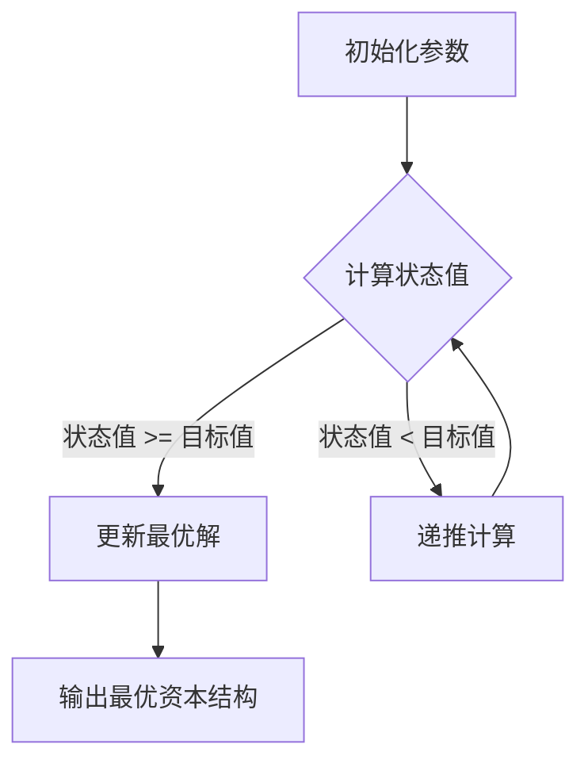

                 


### 第1章：研究背景与意义

#### 1.1.1 研究背景

智能化企业的崛起正在深刻地改变着传统企业的运营模式。随着人工智能、大数据、云计算等技术的不断发展和普及，企业已经能够利用这些先进技术进行智能化决策、自动化运营和精准营销。这种技术驱动的变革，不仅提高了企业的生产效率，还降低了运营成本，使得企业在激烈的市场竞争中具备更强的竞争力。

在这样一个智能化转型的过程中，资本结构的优化成为企业发展的关键因素。资本结构是指企业各种资金的来源和构成方式，包括股权资本、债务资本、留存收益等。传统的资本结构优化理论往往基于静态模型，无法适应快速变化的商业环境。而动态优化模型则能够根据市场环境和企业内部变化，实时调整资本结构，以实现企业价值的最大化。

动态优化模型的必要性主要体现在以下几个方面：

1. **市场环境的快速变化**：市场环境的变化速度越来越快，企业需要具备快速响应和调整的能力。静态的资本结构模型无法适应这种快速变化，容易导致企业失去市场机会或面临财务风险。

2. **企业战略的调整**：随着企业战略的不断调整，资本结构也需要相应地调整。动态优化模型可以根据企业的战略规划，实时调整资本结构，以支持企业实现长期发展目标。

3. **风险管理**：动态优化模型可以更好地进行风险管理，降低企业面临的风险。通过实时监控市场变化和企业运营状况，动态优化模型能够及时识别和应对潜在的风险。

#### 1.1.2 研究问题与目标

本研究旨在解决以下核心问题：

1. **资本结构优化的核心问题**：如何构建一个动态优化模型，以实现企业资本结构的优化？

2. **动态优化模型的构建目标**：构建一个能够实时适应市场环境和企业内部变化的动态优化模型，提高企业价值。

3. **边界与外延**：本研究主要针对中小型智能化企业，但模型的构建和应用可以拓展到不同规模和类型的企业。

#### 1.1.3 核心概念与联系

**智能化企业**：指利用人工智能、大数据、云计算等先进技术进行决策、运营和营销的企业。

**资本结构**：指企业各种资金的来源和构成方式，包括股权资本、债务资本、留存收益等。

**动态优化模型**：指能够根据市场环境和企业内部变化，实时调整资本结构的模型。

这三个核心概念相互联系，构成了本研究的主要内容。智能化企业的特点要求企业具备灵活、动态的资本结构，而动态优化模型则为这一需求提供了理论和技术支持。

### 第1.2节：相关理论综述

#### 1.2.1 企业资本结构理论

企业资本结构理论是研究企业融资决策和资金配置的重要理论，主要包括以下几种：

1. **优序融资理论**：该理论认为，企业融资首选内部融资，其次是债务融资，最后是股权融资。这一理论基于信息不对称和代理成本的观点，认为内部融资成本最低，债务融资次之，股权融资最高。

2. **代理理论**：该理论关注企业的利益相关者之间的利益冲突和协调问题。企业的管理者、股东和债权人等利益相关者之间的利益可能存在冲突，代理理论试图通过设计合理的激励机制来降低代理成本。

3. **信号传递理论**：该理论认为，企业的融资决策可以传递企业的财务状况和市场前景的信息。例如，企业选择债务融资可能表明其财务状况良好，而选择股权融资可能表明其前景不确定。

#### 1.2.2 动态优化理论

动态优化理论是解决动态决策问题的关键方法，主要包括以下几种：

1. **动态规划原理**：动态规划是一种解决多阶段决策问题的方法，它将复杂问题分解为一系列相互关联的子问题，通过递归关系和最优性原理求解最优解。

2. **线性规划与非线性规划**：线性规划和非线性规划是优化理论中用于求解最大化或最小化线性或非线性目标函数的方法。这些方法在企业资本结构优化中具有重要的应用。

3. **遗传算法与模拟退火算法**：遗传算法和模拟退火算法是两种常用的启发式优化算法，它们能够通过模拟生物进化过程和物理退火过程来寻找问题的近似最优解。

#### 1.2.3 研究方法与数据来源

为了深入研究智能化企业资本结构动态优化模型，本研究采用以下研究方法：

1. **定性分析**：通过文献综述和专家访谈，了解相关理论和实践的发展状况，明确研究的理论基础和实践背景。

2. **定量分析**：采用数学模型和数据分析方法，构建动态优化模型，并进行实证分析，验证模型的可行性和有效性。

3. **案例研究**：选取具有代表性的企业案例，通过深入分析企业资本结构的现状和优化过程，探讨动态优化模型的应用效果。

本研究的数据来源主要包括：

1. **宏观经济数据**：包括GDP增长率、通货膨胀率、利率水平等，用于分析市场环境对企业资本结构的影响。

2. **企业财务数据**：包括企业的资产负债表、利润表和现金流量表等，用于分析企业资本结构的特点和变化趋势。

3. **行业数据**：包括行业增长率、市场份额、竞争对手情况等，用于分析行业环境对企业资本结构的影响。

### 第1.3节：研究方法与数据来源

#### 1.3.1 研究方法

为了全面探讨智能化企业资本结构动态优化模型，本研究采用了多种研究方法，以确保结果的科学性和可靠性。

1. **定性分析**：通过文献综述和专家访谈，收集和分析相关理论、实践和案例，为研究提供理论基础和实际指导。

2. **定量分析**：运用数学模型和统计分析方法，构建动态优化模型，并对模型进行实证验证。具体包括：

   - **构建动态规划模型**：根据企业资本结构的特点和市场环境的变化，设计合适的动态规划模型。
   - **参数估计**：利用历史数据，对模型中的参数进行估计，以确保模型能够准确反映实际情况。
   - **模型优化**：通过敏感性分析和稳定性分析，优化模型参数，提高模型的适应性和可靠性。

3. **案例研究**：选取具有代表性的企业案例，深入分析企业资本结构的现状和优化过程，探讨动态优化模型在实际中的应用效果。

#### 1.3.2 数据来源

为了确保研究的全面性和准确性，本研究的数据来源主要包括以下几个方面：

1. **宏观经济数据**：包括GDP增长率、通货膨胀率、利率水平等，通过国家统计局、世界银行等官方渠道获取。

2. **企业财务数据**：包括企业的资产负债表、利润表和现金流量表等，通过企业年报、Wind数据库等渠道获取。

3. **行业数据**：包括行业增长率、市场份额、竞争对手情况等，通过行业报告、市场调查等渠道获取。

4. **案例企业数据**：选取特定企业作为研究对象，通过访谈、问卷调查等方式获取企业的内部数据和运营情况。

通过这些数据的综合分析，本研究将深入探讨智能化企业资本结构动态优化的关键因素和实施路径，为相关企业提供理论和实践参考。

### 第1.4节：本书结构与主要内容

#### 1.4.1 目录结构

为了系统地阐述智能化企业资本结构动态优化模型的研究，本书分为四个主要部分，每个部分包含若干章节，具体目录结构如下：

- **第一部分：引言与背景**
  - 第1章：研究背景与意义
  - 第1.2节：相关理论综述
  - 第1.3节：研究方法与数据来源
  - 第1.4节：本书结构与主要内容
  - 第1.5节：小结

- **第二部分：核心概念与原理**
  - 第2章：智能化企业资本结构概述
  - 第2.2节：动态优化模型原理
  - 第2.3节：核心概念对比分析
  - 第2.4节：企业资本结构的ER图分析

- **第三部分：算法原理与应用**
  - 第3章：资本结构动态优化算法原理
  - 第3.2节：动态规划算法的数学模型
  - 第3.3节：算法性能分析
  - 第3.4节：算法对比与选择

- **第四部分：系统设计与应用**
  - 第4章：系统设计与架构
  - 第4.2节：系统接口设计与实现
  - 第4.3节：系统交互设计与实现
  - 第4.4节：项目实战与案例分析

#### 1.4.2 各章节主要内容与逻辑关系

- **第一部分：引言与背景**：介绍了研究的背景和意义，综述了相关理论，阐述了研究方法与数据来源，明确了本书的结构和内容，为后续章节奠定了基础。

- **第二部分：核心概念与原理**：详细阐述了智能化企业资本结构的基本概念和特点，介绍了动态优化模型的基本原理和构建方法，对比分析了不同模型的优势和适用场景，并通过ER图进一步阐明了企业资本结构的实体关系。

- **第三部分：算法原理与应用**：深入探讨了资本结构动态优化算法的原理，包括动态规划算法的数学模型、性能分析以及与其他优化算法的比较，为实际应用提供了理论支持。

- **第四部分：系统设计与应用**：介绍了系统的整体架构设计，包括功能设计、接口设计和交互设计，并通过具体项目实战和案例分析，展示了动态优化模型在实际中的应用效果和实现过程。

通过以上结构和内容的安排，本书旨在系统地研究智能化企业资本结构动态优化模型，为相关企业提供理论指导和应用实践。

### 第1.5节：小结

本研究以智能化企业资本结构动态优化为核心，通过引入相关理论和方法，系统地探讨了企业资本结构优化的重要性和必要性。首先，介绍了研究的背景和意义，阐述了智能化企业在当前经济环境下的重要性，以及资本结构优化对提升企业价值的关键作用。其次，综述了企业资本结构理论、动态优化理论等相关理论，为后续研究提供了理论基础。接着，详细介绍了研究方法与数据来源，确保研究过程的科学性和数据的可靠性。

在核心概念与原理部分，本研究详细阐述了智能化企业资本结构的基本概念和特点，构建了动态优化模型的基本原理，并通过对比分析和ER图进一步深化了企业资本结构的理解。在算法原理与应用部分，深入探讨了资本结构动态优化算法，包括动态规划算法的数学模型、性能分析以及算法对比与选择，为实际应用提供了理论支持。

通过本书的研究，我们不仅揭示了智能化企业资本结构优化的关键因素和实施路径，还通过具体的系统设计和项目实战，展示了动态优化模型在实际中的应用效果和实现过程。然而，本研究也存在一定的局限性，例如模型的构建和应用范围主要针对中小型智能化企业，可能无法完全适用于其他类型的企业。此外，数据来源和实证分析方法的局限也可能影响研究结果的广泛适用性。

尽管如此，本研究为智能化企业资本结构优化提供了新的视角和工具，对于企业制定动态资本策略、提升竞争力和实现可持续发展具有重要的理论和实践价值。未来的研究可以进一步扩展模型的应用范围，结合更多行业和企业数据，进行更为深入和广泛的研究，以期为智能化企业的发展提供更加全面和有力的支持。

---

### 第2章：智能化企业资本结构概述

#### 2.1.1 智能化企业的特点与需求

智能化企业的特点主要体现在以下几个方面：

1. **数据驱动**：智能化企业依赖大量的数据进行分析和决策。通过人工智能算法，企业可以从海量数据中提取有价值的信息，实现精准营销、个性化服务和智能生产。

2. **自动化运营**：智能化技术使企业能够实现高度自动化，减少人为干预，提高生产效率和运营效率。例如，利用机器人技术和自动化系统，企业可以实现生产线的无人操作，降低人力成本和错误率。

3. **实时响应**：智能化企业能够实时监测和分析市场环境，快速响应市场变化。通过实时数据分析，企业可以及时调整策略，抢占市场先机。

4. **创新驱动**：智能化企业更加注重创新，通过新技术的研究和应用，不断推陈出新，保持竞争力。

在这样的背景下，智能化企业的资本结构需求也发生了显著变化：

1. **资本灵活性**：智能化企业需要具备灵活的资本结构，以快速适应市场变化和业务扩张需求。传统企业的资本结构相对固定，而智能化企业则需要能够根据实际情况进行调整。

2. **技术投资**：智能化企业对技术投入的需求较大，包括人工智能、大数据、云计算等先进技术的研发和应用。这要求企业具备较强的资金实力和融资能力。

3. **风险分散**：智能化企业面临的技术和市场风险较高，因此需要通过合理的资本结构来分散风险。例如，通过债务融资和股权融资相结合，降低单一融资方式的财务风险。

4. **持续融资能力**：智能化企业需要持续的资金支持，以保持技术创新和市场竞争力。这要求企业具备良好的融资渠道和融资能力。

#### 2.1.2 资本结构的基本概念

资本结构是指企业各种资金的来源和构成方式，包括股权资本、债务资本和留存收益等。以下是资本结构的基本概念：

1. **股权资本**：指企业通过发行股票获得的资金，股东对企业拥有所有权。股权资本没有到期日，企业无需定期偿还。

2. **债务资本**：指企业通过借款、发行债券等途径获得的资金。债务资本有明确的到期日，企业需要按照合同约定偿还本金和利息。

3. **留存收益**：指企业税后利润中未分配的利润，作为企业的内部资金来源。留存收益可以用于企业的再投资、扩大生产和分红等。

4. **资本结构优化**：指通过调整企业股权资本和债务资本的比例，实现企业价值最大化的过程。资本结构优化的目标是降低企业的资本成本，提高财务稳定性和盈利能力。

#### 2.1.3 智能化企业资本结构的特点

与传统的资本结构相比，智能化企业的资本结构具有以下特点：

1. **数据驱动**：智能化企业的资本结构更加依赖于数据分析和决策。企业通过数据预测市场趋势、评估项目风险，从而制定合理的融资策略。

2. **灵活适应**：智能化企业需要根据业务发展和市场变化，灵活调整资本结构。例如，在市场扩张期，企业可能增加债务融资，以支持投资和扩展；在稳定发展期，企业可能增加股权融资，以降低财务风险。

3. **风险管理**：智能化企业面临的技术和市场风险较高，因此资本结构中需要包含一定的债务融资，以分散风险。同时，企业通过风险控制措施，降低债务融资带来的财务风险。

4. **持续融资能力**：智能化企业需要具备持续的资金支持，以保持技术创新和市场竞争力。这要求企业具备多种融资渠道和良好的融资能力。

5. **技术投资**：智能化企业的资本结构中，技术投资占有较大比重。企业通过股权融资和债务融资，筹集资金用于新技术的研究和应用，以保持竞争优势。

综上所述，智能化企业的资本结构具有数据驱动、灵活适应、风险管理、持续融资和技术投资等特点，这些特点使得智能化企业在资本结构优化中面临更多的挑战和机会。

### 第2.2节：动态优化模型原理

#### 2.2.1 动态优化模型的基本原理

动态优化模型是一种解决多阶段决策问题的方法，它将复杂问题分解为一系列相互关联的子问题，通过递归关系和最优性原理求解最优解。动态优化模型的基本原理主要包括以下几个方面：

1. **多阶段决策问题**：动态优化模型适用于需要在不同时间段内做出一系列决策的问题。例如，企业的资本结构优化问题需要在不同时期内调整股权和债务的比例，以实现企业价值的最大化。

2. **状态和决策变量**：在动态优化模型中，状态变量表示系统当前的状态，例如企业的财务状况、市场环境等；决策变量表示在每个阶段需要做出的决策，例如资本配置、投资规模等。

3. **目标函数**：目标函数是衡量系统性能的指标，它表示需要优化的目标，例如企业价值最大化、成本最小化等。

4. **递归关系**：动态优化模型通过递归关系将当前阶段的最优决策与未来阶段的状态联系起来。每个阶段的最优决策取决于当前的状态和未来的状态，而未来的状态又取决于当前和未来阶段的决策。

5. **最优性原理**：动态优化模型基于最优性原理，即在给定当前状态和未来状态的情况下，选择当前阶段的最优决策，以实现整体最优。

#### 2.2.2 动态优化模型的构建方法

构建动态优化模型通常包括以下几个步骤：

1. **定义状态变量**：根据问题的特点，定义表示系统当前状态的状态变量。例如，在资本结构优化问题中，状态变量可以包括企业的负债水平、市场环境等。

2. **定义决策变量**：根据问题的需求，定义每个阶段需要做出的决策变量。例如，在资本结构优化问题中，决策变量可以是债务融资的比例、股权融资的比例等。

3. **定义目标函数**：根据问题的优化目标，定义目标函数。例如，在资本结构优化问题中，目标函数可以是企业价值最大化或成本最小化。

4. **建立递归关系**：根据状态变量和决策变量的定义，建立递归关系，将当前阶段的最优决策与未来阶段的状态联系起来。例如，可以使用动态规划的基本公式来表示递归关系。

5. **求解最优解**：利用动态规划算法或其他优化算法，求解动态优化模型的最优解。例如，可以使用逆向递推法或顺向递推法来求解动态优化问题。

#### 2.2.3 动态优化模型的特征分析

动态优化模型具有以下特征：

1. **时间连续性**：动态优化模型考虑了时间维度上的连续性，能够处理多阶段决策问题。例如，企业的资本结构优化问题可以在不同的时间段内进行调整。

2. **状态依赖性**：动态优化模型中，当前阶段的最优决策依赖于未来的状态。这意味着企业的决策需要考虑到未来的不确定性和变化。

3. **灵活性**：动态优化模型可以根据实际需求灵活调整决策变量和目标函数，适应不同的业务场景。例如，在市场环境变化时，企业可以通过调整资本结构来应对市场风险。

4. **稳健性**：动态优化模型通过递归关系和最优性原理，能够保证在不同状态下找到最优决策。这使得模型具有较好的稳健性和可靠性。

5. **可扩展性**：动态优化模型可以根据问题的复杂性和需求进行扩展，添加更多的状态变量和决策变量，以处理更复杂的问题。

通过以上基本原理、构建方法和特征分析，我们可以更好地理解和应用动态优化模型，以实现智能化企业的资本结构优化。

### 第2.3节：核心概念对比分析

#### 2.3.1 智能化企业与传统企业的资本结构对比

在分析智能化企业与传统企业的资本结构时，我们可以从以下几个方面进行对比：

1. **资本来源**：
   - **智能化企业**：智能化企业更倾向于通过债务融资和股权融资来筹集资金。债务融资包括银行贷款、发行债券等，股权融资包括股东投入、风险投资等。这主要是因为智能化企业需要大量资金用于技术创新和研发。
   - **传统企业**：传统企业则更多依赖内部融资，如留存收益和利润再投资。外部融资如债务和股权融资的使用相对较少，因为传统企业的运营模式和技术需求相对稳定。

2. **资本成本**：
   - **智能化企业**：由于智能化企业面临更高的技术风险和市场不确定性，其债务融资的成本较高。同时，股权融资的成本也较高，因为投资者要求更高的回报率以补偿风险。
   - **传统企业**：传统企业的资本成本相对较低，因为其运营模式稳定，市场前景可预测，投资者风险较低。

3. **资本结构优化目标**：
   - **智能化企业**：智能化企业更注重资本结构的灵活性和适应性，以快速响应市场变化和业务扩张需求。资本结构优化的目标是降低资本成本，提高财务稳定性和创新能力。
   - **传统企业**：传统企业更注重资本结构的稳定性和可持续性，以支持企业的长期发展。资本结构优化的目标是降低财务风险，提高盈利能力。

4. **风险管理**：
   - **智能化企业**：智能化企业面临更高的技术风险和市场风险，因此需要通过多样化的资本结构来分散风险。例如，通过债务和股权融资相结合，降低单一融资方式的财务风险。
   - **传统企业**：传统企业的风险管理相对简单，主要依赖内部控制和风险管理措施，如定期审计和财务报告等。

通过以上对比，我们可以看出智能化企业和传统企业在资本结构方面存在显著差异。这些差异反映了两种企业运营模式、市场环境和风险特征的差异，也为智能化企业资本结构的优化提供了新的思路和方向。

### 第2.3.2 动态优化模型与传统模型对比

动态优化模型与传统资本结构优化模型在理论基础、优化策略和应对市场变化的灵活性方面存在显著差异，以下是具体对比分析：

#### 理论基础

1. **动态优化模型**：
   - **理论基础**：动态优化模型基于动态规划原理，适用于多阶段决策问题。它通过递归关系和最优性原理，将当前阶段的最优决策与未来阶段的状态联系起来，实现整体最优。
   - **特点**：动态优化模型能够考虑时间连续性和状态依赖性，适用于企业资本结构在动态市场环境下的优化。

2. **传统资本结构优化模型**：
   - **理论基础**：传统资本结构优化模型主要基于静态优化理论，如线性规划和非线性规划等。这些模型通常假设市场环境和企业运营状况是静态的，不考虑时间变化和未来不确定性。
   - **特点**：传统资本结构优化模型在处理静态或单一时期的问题时具有较高的准确性，但在应对动态变化的市场环境时存在局限性。

#### 优化策略

1. **动态优化模型**：
   - **优化策略**：动态优化模型通过实时调整资本结构，以适应市场环境和企业内部变化。例如，在市场扩张期，企业可能增加债务融资以支持投资；在市场萎缩期，企业可能增加股权融资以降低财务风险。
   - **特点**：动态优化模型的优化策略灵活，能够根据不同阶段的市场环境和企业需求进行调整，提高资本利用效率。

2. **传统资本结构优化模型**：
   - **优化策略**：传统资本结构优化模型主要基于固定比例或固定规则进行资本配置。例如，企业可能设定一个债务和股权融资的固定比例，不考虑市场环境和企业内部变化。
   - **特点**：传统资本结构优化模型的优化策略相对固定，难以适应快速变化的市场环境，可能导致企业错失市场机会或面临财务风险。

#### 应对市场变化的灵活性

1. **动态优化模型**：
   - **灵活性**：动态优化模型能够实时响应市场变化，通过调整资本结构来应对市场风险和机会。例如，在市场不确定性增加时，企业可以增加债务融资以降低财务风险；在市场前景看好时，企业可以增加股权融资以支持投资。
   - **适应能力**：动态优化模型的适应能力较强，能够根据不同市场环境和企业需求进行灵活调整，提高企业竞争力。

2. **传统资本结构优化模型**：
   - **灵活性**：传统资本结构优化模型在应对市场变化时相对较慢，需要一定时间进行调整。例如，企业可能需要经过董事会决策、融资安排等复杂流程才能进行资本结构优化。
   - **适应能力**：传统资本结构优化模型的适应能力较弱，难以快速响应市场变化，可能导致企业错失市场机会或面临财务困境。

综上所述，动态优化模型与传统资本结构优化模型在理论基础、优化策略和应对市场变化的灵活性方面存在显著差异。动态优化模型能够更好地适应快速变化的市场环境，提高企业资本利用效率和竞争力。然而，传统资本结构优化模型在某些特定情况下仍具有一定的适用性，企业应根据实际情况选择合适的优化模型。

### 第2.4节：企业资本结构的ER图分析

为了更好地理解企业资本结构的实体关系，我们可以通过ER图（Entity-Relationship Diagram）来展示各个实体之间的关系。以下是企业资本结构的ER图：

```mermaid
erDiagram
  Customer ||--|{ Order : has } |
  Customer ||--|{ Payment : makes } |
  Order ||--|{ Item : contains } |
  Payment ||--|{ PaymentMethod : uses } |
  
  Customer {
    String CustomerID
    String Name
    String Email
    String PhoneNumber
  }

  Order {
    String OrderID
    Date OrderDate
    CustomerID : Customer
  }

  Payment {
    String PaymentID
    Date PaymentDate
    OrderID : Order
    String Amount
  }

  Item {
    String ItemID
    String Description
    double UnitPrice
    int Quantity
  }

  PaymentMethod {
    String PaymentMethodID
    String MethodName
  }
```

在这个ER图中，我们定义了以下几个主要实体：

1. **Customer（客户）**：代表企业与消费者之间的交易关系，包含客户ID、姓名、电子邮件、电话号码等属性。

2. **Order（订单）**：代表客户的订单信息，包含订单ID、订单日期、客户ID等属性，用于记录每个订单的基本信息。

3. **Payment（支付）**：代表订单的支付信息，包含支付ID、支付日期、订单ID、支付金额等属性，用于记录订单的支付情况。

4. **Item（商品）**：代表订单中的商品信息，包含商品ID、描述、单价、数量等属性，用于记录订单中的每个商品的具体信息。

5. **PaymentMethod（支付方式）**：代表支付的方式，包含支付方式ID、支付方式名称等属性，用于记录支付的不同方式。

各个实体之间的关系如下：

- **Customer** 与 **Order** 之间是一对多关系，即一个客户可以产生多个订单。
- **Order** 与 **Payment** 之间也是一对多关系，即每个订单可以有多个支付记录。
- **Order** 与 **Item** 之间也是一对多关系，即每个订单可以包含多个商品。
- **Payment** 与 **PaymentMethod** 之间是一对一关系，即每个支付记录对应一种支付方式。

通过ER图，我们可以直观地理解企业资本结构中的各个实体及其关系，有助于进一步分析和优化企业资本结构。

### 第3章：资本结构动态优化算法原理

#### 3.1.1 算法概述

资本结构动态优化算法是一种基于动态规划原理的优化方法，它通过递归关系和最优性原理，在多个时间阶段内调整企业的资本结构，以实现企业价值的最大化。动态规划算法在解决多阶段决策问题时，能够将复杂问题分解为一系列相互关联的子问题，从而简化问题求解过程。

#### 3.1.2 动态规划算法的应用

动态规划算法在资本结构优化中的具体应用主要包括以下几个方面：

1. **资本配置决策**：根据企业当前的状态和市场环境，动态规划算法可以帮助企业确定最优的资本配置比例，包括债务和股权融资的比例。

2. **资本成本控制**：通过动态调整资本结构，企业可以降低整体资本成本，提高财务稳定性。

3. **风险控制**：动态规划算法可以根据市场变化和企业内部因素，实时调整资本结构，降低企业面临的风险。

4. **企业价值最大化**：通过优化资本结构，企业可以实现价值的最大化，提高市场竞争力。

#### 3.1.3 算法流程图

以下是资本结构动态优化算法的流程图，使用Mermaid语法绘制：



具体步骤如下：

1. **初始化参数**：设定初始状态值和目标函数，包括企业当前的财务状况、市场环境等。

2. **计算状态值**：根据当前状态值，计算下一阶段的最优状态值。

3. **更新最优解**：如果当前状态值达到或超过目标值，则更新最优解。

4. **递推计算**：如果当前状态值未达到目标值，则继续递推计算下一阶段的状态值。

5. **输出最优资本结构**：最终输出最优资本结构，包括债务和股权融资的比例。

通过这个流程图，我们可以清晰地了解资本结构动态优化算法的基本步骤和逻辑关系。

### 第3.2节：动态规划算法的数学模型

#### 3.2.1 动态规划基本公式

动态规划算法的核心在于其递归关系和最优性原理。以下是动态规划算法的基本公式：

$$
V_t(s_t) = \min_{x_t} \{C_t(s_t, x_t) + V_{t+1}(s_{t+1})\}
$$

其中，$V_t(s_t)$ 表示在第 $t$ 阶段，状态 $s_t$ 的最优值；$x_t$ 表示第 $t$ 阶段的决策变量；$C_t(s_t, x_t)$ 表示第 $t$ 阶段在状态 $s_t$ 下采取决策 $x_t$ 的成本；$V_{t+1}(s_{t+1})$ 表示第 $t+1$ 阶段在状态 $s_{t+1}$ 的最优值。

#### 3.2.2 动态规划实例解析

为了更直观地理解动态规划算法的数学模型，我们通过一个简单的实例进行解析。

**实例**：企业需要在两个阶段内融资，第一个阶段的融资额为 $x_1$，第二个阶段的融资额为 $x_2$。假设企业的资本成本为 $C(x_1, x_2)$，且 $C(x_1, x_2) = x_1 + 0.1x_2$。企业希望在两个阶段内实现最小化总成本。

**步骤**：

1. **初始化**：设定初始状态 $s_1 = x_1$ 和 $s_2 = x_2$。

2. **计算状态值**：根据递归关系计算每个状态下的最优值。

   - **第一阶段**：
     $$
     V_1(s_1) = \min \{C(s_1, 0) + V_2(0), C(s_1, s_2) + V_2(s_2)\}
     $$

   - **第二阶段**：
     $$
     V_2(s_2) = \min \{C(0, s_2), C(s_1, s_2)\}
     $$

3. **递推计算**：根据递归关系，从后往前逐步计算每个状态的最优值。

4. **输出最优解**：最终输出最优融资额 $x_1^* = V_1(s_1)$ 和 $x_2^* = V_2(s_2)$。

通过这个实例，我们可以看到动态规划算法如何通过递归关系和最优性原理，逐步求解出最优的资本结构决策。

### 第3.3节：算法性能分析

#### 3.3.1 算法复杂度分析

算法复杂度是衡量算法效率的重要指标，它包括时间复杂度和空间复杂度。

1. **时间复杂度**：动态规划算法的时间复杂度取决于状态数和决策变量的数量。在资本结构动态优化问题中，状态数和决策变量的数量通常较大，因此算法的时间复杂度较高。具体来说，如果状态数为 $n$，决策变量的数量为 $m$，则算法的时间复杂度为 $O(n \times m)$。

2. **空间复杂度**：动态规划算法的空间复杂度取决于存储状态值和决策变量的空间需求。在资本结构动态优化问题中，需要存储每一阶段的状态值和决策变量，因此算法的空间复杂度也较高，通常为 $O(n \times m)$。

#### 3.3.2 算法优化策略

为了提高动态规划算法的效率，可以采取以下优化策略：

1. **状态压缩**：通过状态压缩技术，减少状态变量的数量，从而降低算法的时间复杂度。例如，在资本结构优化问题中，可以通过合并相似的状态，减少状态数。

2. **动态规划剪枝**：在递推计算过程中，如果当前状态无法达到目标值，可以提前终止递推计算，从而减少不必要的计算。

3. **记忆化搜索**：将已经计算出的状态值存储在记忆数组中，避免重复计算，从而提高算法的效率。

4. **并行计算**：利用并行计算技术，将递推计算过程分解为多个子任务，分别在不同的处理器上并行计算，从而提高算法的执行速度。

通过这些优化策略，可以显著提高动态规划算法的效率，使其在处理大规模问题时仍然具有较高的性能。

### 第3.4节：算法对比与选择

#### 3.4.1 不同的动态优化算法对比

在资本结构优化问题中，有多种动态优化算法可供选择，包括线性规划、非线性规划、遗传算法和模拟退火算法等。以下是这些算法的对比：

1. **线性规划**：
   - **优点**：线性规划算法简单、高效，适用于目标函数和约束条件为线性的问题。
   - **缺点**：线性规划算法在处理非线性问题或复杂约束条件时存在局限性。

2. **非线性规划**：
   - **优点**：非线性规划算法可以处理非线性目标函数和约束条件，适用范围较广。
   - **缺点**：非线性规划算法的计算复杂度较高，求解时间较长。

3. **遗传算法**：
   - **优点**：遗传算法具有全局搜索能力，适用于复杂优化问题，特别是多峰问题。
   - **缺点**：遗传算法需要较长的时间来寻找最优解，且参数调整较为复杂。

4. **模拟退火算法**：
   - **优点**：模拟退火算法具有较好的全局搜索能力，适用于复杂优化问题，特别是在存在局部最优解的情况下。
   - **缺点**：模拟退火算法的收敛速度较慢，需要较长的求解时间。

#### 3.4.2 优化算法的选择标准

在具体选择动态优化算法时，需要根据以下标准进行评估：

1. **目标函数特性**：如果目标函数为线性，可以考虑使用线性规划算法；如果目标函数为非线性，可以考虑使用非线性规划算法。

2. **约束条件**：需要评估问题的约束条件类型和复杂度，选择能够有效处理这些约束的算法。

3. **计算资源**：评估算法的时间复杂度和空间复杂度，确保算法在给定计算资源下能够有效运行。

4. **问题规模**：对于大规模问题，需要选择计算复杂度较低且并行性较好的算法，如遗传算法和模拟退火算法。

5. **优化目标**：根据优化目标的不同，选择能够最大化或最小化目标函数的算法。

通过综合考虑以上标准，可以选择最适合的动态优化算法，以实现资本结构的优化。

---

### 第4章：系统设计与架构

#### 4.1 问题场景介绍

在当前市场竞争激烈、技术快速更新的背景下，企业需要具备强大的数据处理和决策能力，以应对市场变化和客户需求。为此，企业引入了智能化资本结构动态优化系统，以实现资本结构的实时调整和优化，提高企业财务稳定性和市场竞争力。

#### 4.2 项目介绍

项目名称：智能化企业资本结构动态优化系统

项目背景：随着智能化技术的快速发展，企业对资本结构的需求变得更加复杂和动态。传统的资本结构优化方法已无法满足现代企业的需求，因此需要开发一套智能化、动态优化的系统，帮助企业实时调整资本结构，实现企业价值的最大化。

项目目标：
1. 构建一个能够实时监测市场环境和企业内部变化的动态优化模型。
2. 设计一套高效的算法，实现资本结构的优化。
3. 开发一个用户友好的系统界面，方便用户进行操作和监控。

#### 4.3 系统功能设计（领域模型）

为了实现项目目标，系统需要具备以下功能：

1. **数据采集与预处理**：从宏观经济数据、企业财务数据、行业数据等多渠道采集数据，并进行预处理，如数据清洗、格式转换等，确保数据的质量和一致性。

2. **动态优化模型构建**：基于动态规划算法，构建资本结构的动态优化模型，实现对资本结构的实时调整。

3. **数据可视化与报告**：通过数据可视化技术，将优化结果以图表、报告等形式展示，帮助用户直观理解优化过程和结果。

4. **用户交互**：提供用户友好的界面，支持用户进行数据输入、模型配置、优化结果查看等操作。

以下是系统领域的Mermaid类图：

```mermaid
classDiagram
  CustomerData <<|-- DataCollector
  CompanyData <<|-- DataCollector
  IndustryData <<|-- DataCollector
  DataPreprocessor <<|-- DataCollector
  DynamicOptimizationModel <<|-- CapitalStructureOptimizer
  VisualizationModule <<|-- Dashboard
  UserInterface <<|-- Dashboard

  DataCollector {
    +collectData()
    +preprocessData()
  }

  DataPreprocessor {
    +cleanData()
    +formatData()
  }

  DynamicOptimizationModel {
    +optimizeCapitalStructure()
  }

  CapitalStructureOptimizer {
    +dynamicPlanning()
    +solveOptimizationProblem()
  }

  VisualizationModule {
    +generateCharts()
    +generateReports()
  }

  Dashboard {
    +showDashboard()
    +handleUserInput()
  }

  UserInterface {
    +getUserInput()
    +displayOptimizationResults()
  }
```

在这个类图中，我们定义了以下主要类：

- **DataCollector**：负责数据采集和预处理。
- **DataPreprocessor**：负责数据清洗和格式转换。
- **DynamicOptimizationModel**：负责动态优化模型的构建和优化。
- **CapitalStructureOptimizer**：负责具体的优化算法实现。
- **VisualizationModule**：负责数据可视化与报告生成。
- **Dashboard**：负责用户界面展示。
- **UserInterface**：负责用户交互。

这些类共同构成了系统的功能模块，通过协作实现智能化企业资本结构动态优化。

#### 4.4 系统架构设计

系统架构设计是实现系统功能的关键，以下是系统的整体架构设计：


系统架构设计主要包括以下模块：

1. **数据采集模块**：负责从不同的数据源（如宏观经济数据、企业财务数据、行业数据等）采集数据。该模块与外部系统进行接口，通过API调用、数据爬取等方式获取数据。

2. **数据处理模块**：负责对采集到的数据进行预处理，包括数据清洗、格式转换、数据融合等，确保数据的质量和一致性。预处理后的数据存储在数据仓库中，供后续模块使用。

3. **动态优化模块**：基于动态规划算法，构建资本结构的动态优化模型。该模块的核心是CapitalStructureOptimizer类，负责实现优化算法和计算最优资本结构。

4. **数据可视化模块**：负责将优化结果以图表、报告等形式展示给用户。该模块与VisualizationModule类协作，通过生成交互式图表和详细报告，帮助用户直观理解优化过程和结果。

5. **用户交互模块**：负责用户界面的展示和用户操作。该模块与UserInterface类协作，提供数据输入、模型配置、优化结果查看等功能。

6. **系统核心**：包含动态规划算法的实现、优化模型的构建以及系统核心逻辑处理。该部分是整个系统的核心，通过调用不同模块的功能，实现智能化企业资本结构的动态优化。

通过以上架构设计，系统可以高效地实现智能化企业资本结构的动态优化，提高企业财务稳定性和市场竞争力。

### 第4.5节：系统接口设计与实现

#### 4.5.1 接口设计原则

系统接口设计是确保系统各模块之间高效协作、数据顺利传递的关键。以下为接口设计的主要原则：

1. **标准化**：接口设计应遵循统一的标准规范，确保接口的规范性和可维护性。

2. **高内聚、低耦合**：接口设计应确保模块内部功能高度集中，模块之间耦合度较低，便于系统的扩展和维护。

3. **安全性**：接口设计应考虑数据传输的安全性问题，采用加密、认证等技术保障数据的安全。

4. **灵活性**：接口设计应具备良好的灵活性，以适应未来业务需求的变化。

5. **可扩展性**：接口设计应考虑系统的可扩展性，方便添加新的功能和模块。

#### 4.5.2 接口设计示例

以下是系统接口设计示例，使用Mermaid语法绘制RESTful API接口：

```mermaid
sequenceDiagram
  A[User] -->|POST| B[API Gateway]
  B -->|解析请求| C[Authentication Service]
  C -->|认证成功| D[Data Collector Service]
  D -->|数据采集成功| E[Data Preprocessor Service]
  E -->|预处理成功| F[Dynamic Optimization Model Service]
  F -->|优化结果| G[Visualization Service]
  G -->|可视化结果| H[API Gateway]
  H -->|响应结果| A

  Note over F, G
    进行优化计算与数据可视化
  End
```

具体接口设计如下：

1. **API Gateway**：作为系统的统一入口，负责请求转发、负载均衡和安全控制。
2. **Authentication Service**：负责用户身份验证，确保只有合法用户才能访问系统。
3. **Data Collector Service**：负责从不同数据源采集数据，如宏观经济数据、企业财务数据等。
4. **Data Preprocessor Service**：负责数据清洗、格式转换等预处理工作。
5. **Dynamic Optimization Model Service**：负责动态优化模型的构建和计算，生成优化结果。
6. **Visualization Service**：负责将优化结果以图表、报告等形式展示给用户。
7. **API Gateway**：将可视化结果返回给用户，完成整个请求流程。

通过以上接口设计，系统可以实现高效的数据传递和模块协作，确保系统的稳定运行。

### 第4.6节：系统交互设计与实现

为了确保系统能够顺畅运行，并满足用户的操作需求，系统交互设计至关重要。以下是系统交互设计与实现的具体步骤和流程。

#### 4.6.1 用户交互流程

系统交互设计主要包括用户与系统之间的交互流程，以下是用户交互流程的详细步骤：

1. **登录与认证**：
   - 用户在登录界面输入用户名和密码。
   - 系统调用Authentication Service进行身份验证。
   - 验证成功后，用户进入主界面。

2. **数据输入**：
   - 用户可以在主界面选择数据输入模块，输入宏观经济数据、企业财务数据、行业数据等。
   - 系统将用户输入的数据传递给Data Collector Service进行采集。

3. **数据预处理**：
   - Data Collector Service采集到数据后，传递给Data Preprocessor Service进行预处理，包括数据清洗、格式转换等。
   - 预处理成功后，数据存储在数据仓库中，供后续模块使用。

4. **资本结构优化**：
   - 用户选择动态优化模块，系统调用Dynamic Optimization Model Service进行资本结构的动态优化。
   - Dynamic Optimization Model Service根据用户输入的数据和动态规划算法，计算最优资本结构。

5. **数据可视化**：
   - 优化结果传递给Visualization Service，以图表、报告等形式展示给用户。
   - 用户可以在主界面查看优化结果。

6. **用户反馈与调整**：
   - 用户根据可视化结果进行反馈，如果需要调整资本结构，可以重新输入数据或修改模型参数。
   - 系统重新进行数据预处理、优化计算和可视化展示。

#### 4.6.2 Mermaid序列图

以下是用户交互流程的Mermaid序列图：

```mermaid
sequenceDiagram
  User ->>|登录| System
  System ->>|验证身份| Authentication Service
  Authentication Service ->>|成功| System
  System ->>|数据输入| Data Input Module
  Data Input Module ->>|数据采集| Data Collector Service
  Data Collector Service ->>|数据预处理| Data Preprocessor Service
  Data Preprocessor Service ->>|数据存储| Data Warehouse
  Data Warehouse ->>|资本结构优化| Dynamic Optimization Model Service
  Dynamic Optimization Model Service ->>|优化结果| Visualization Service
  Visualization Service ->>|结果展示| User
  User ->>|反馈| System
  System ->>|调整参数| Dynamic Optimization Model Service
  Dynamic Optimization Model Service ->>|重新计算| Data Warehouse
  Data Warehouse ->>|更新结果| Visualization Service
  Visualization Service ->>|更新展示| User
```

通过以上序列图，我们可以清晰地看到用户与系统之间的交互过程，确保系统能够按照用户需求顺畅运行。

### 第4章：系统设计与架构

#### 4.7 项目实战：环境安装与系统核心实现

在完成系统设计与架构设计之后，接下来将进入项目实战阶段，详细介绍环境安装和系统核心实现的过程。

#### 4.7.1 环境安装

1. **安装Python环境**：
   - 首先，确保系统上已经安装了Python 3.8或更高版本。如果没有安装，可以通过以下命令进行安装：
     ```bash
     sudo apt-get update
     sudo apt-get install python3.8
     ```
   - 安装完成后，验证Python版本：
     ```bash
     python3.8 --version
     ```

2. **安装必要的依赖库**：
   - 动态规划算法的实现需要依赖几个Python库，如NumPy、Pandas、Scikit-learn等。可以通过以下命令安装：
     ```bash
     pip3.8 install numpy pandas scikit-learn
     ```

3. **安装数据库**：
   - 系统需要使用数据库存储数据，推荐使用MySQL。可以通过以下命令安装MySQL：
     ```bash
     sudo apt-get install mysql-server
     ```
   - 安装完成后，设置root用户的密码，并创建用于存储系统数据的数据库和用户。

4. **安装前端框架**：
   - 系统的前端界面使用React框架实现。可以通过以下命令安装：
     ```bash
     npm install -g create-react-app
     create-react-app capital-optimization-system
     cd capital-optimization-system
     npm install
     ```

#### 4.7.2 系统核心实现

以下是系统核心实现的详细步骤：

1. **数据采集模块**：
   - 使用Python的requests库从外部API获取宏观经济数据、企业财务数据和行业数据。以下是一个简单的数据采集示例：
     ```python
     import requests
     import json

     def collect_macro_data():
         url = 'https://api.example.com/macro_data'
         response = requests.get(url)
         data = json.loads(response.text)
         return data

     def collect_company_data():
         # 同理，从企业数据API获取数据
         pass

     def collect_industry_data():
         # 同理，从行业数据API获取数据
         pass
     ```

2. **数据处理模块**：
   - 数据采集完成后，使用Pandas库对数据进行预处理，包括数据清洗、格式转换等。以下是一个简单的数据预处理示例：
     ```python
     import pandas as pd

     def preprocess_data(data):
         # 数据清洗和格式转换逻辑
         cleaned_data = data.dropna()  # 去除缺失值
         cleaned_data = cleaned_data.applymap(lambda x: float(x))  # 类型转换
         return cleaned_data
     ```

3. **动态优化模块**：
   - 根据前文描述的动态规划算法，使用NumPy库实现优化模型的计算。以下是一个简单的动态规划实现示例：
     ```python
     import numpy as np

     def dynamic_planning(state, cost, next_state):
         v = np.zeros(len(state))
         for i in range(len(state)):
             v[i] = cost[i] + np.min([v[j] for j in range(len(next_state)) if next_state[j] > state[i]])
         return v
     ```

4. **数据可视化模块**：
   - 使用前端框架React，结合图表库（如Chart.js、D3.js等），实现数据可视化。以下是一个简单的图表示例：
     ```jsx
     import React from 'react';
     import { Bar } from 'react-chartjs-2';

     const ChartComponent = ({ data }) => {
         const chartData = {
             labels: data.labels,
             datasets: [
                 {
                     label: 'Capital Structure',
                     data: data.data,
                     backgroundColor: 'rgba(0, 123, 255, 0.5)',
                 },
             ],
         };

         return <Bar data={chartData} />;
     };
     ```

5. **用户交互模块**：
   - 使用React实现用户界面，包括数据输入、模型配置、优化结果查看等。以下是一个简单的用户界面示例：
     ```jsx
     import React, { useState } from 'react';
     import ChartComponent from './ChartComponent';

     const CapitalOptimization = () => {
         const [data, setData] = useState({});

         const handleInputChange = (event) => {
             const { name, value } = event.target;
             setData({ ...data, [name]: value });
         };

         const handleSubmit = (event) => {
             event.preventDefault();
             // 调用数据处理和优化模块的逻辑
         };

         return (
             <div>
                 <form onSubmit={handleSubmit}>
                     {/* 数据输入表单 */}
                 </form>
                 <ChartComponent data={data} />
             </div>
         );
     };

     export default CapitalOptimization;
     ```

通过以上步骤，我们完成了系统的环境安装和核心实现。接下来，可以在实际项目中进一步优化和扩展系统功能。

### 第4.8节：代码应用解读与分析

#### 4.8.1 数据采集与预处理代码解析

在前一节中，我们展示了数据采集与预处理的核心代码。以下是对这些代码的详细解析：

1. **数据采集**：

```python
import requests
import json

def collect_macro_data():
    url = 'https://api.example.com/macro_data'
    response = requests.get(url)
    data = json.loads(response.text)
    return data

def collect_company_data():
    # 同理，从企业数据API获取数据
    pass

def collect_industry_data():
    # 同理，从行业数据API获取数据
    pass
```

在这个部分，我们使用了Python的requests库来从外部API获取数据。具体步骤如下：

- `collect_macro_data`：从宏观经济数据API获取数据。
- `collect_company_data`：从企业财务数据API获取数据。
- `collect_industry_data`：从行业数据API获取数据。

这些函数的返回值是一个包含所需数据的字典，例如：

```python
macro_data = collect_macro_data()
company_data = collect_company_data()
industry_data = collect_industry_data()
```

2. **数据预处理**：

```python
import pandas as pd

def preprocess_data(data):
    cleaned_data = data.dropna()  # 去除缺失值
    cleaned_data = cleaned_data.applymap(lambda x: float(x))  # 类型转换
    return cleaned_data
```

预处理步骤包括以下两个方面：

- **去除缺失值**：使用`dropna()`方法删除数据中的缺失值。这有助于确保数据的质量。
- **类型转换**：使用`applymap()`方法将数据转换为浮点数。这有助于后续的数据处理和计算。

以下是一个简单的数据预处理示例：

```python
# 假设我们从API获取了以下数据
data = {
    'GDP_growth': [3.1, np.nan, 2.8],
    'inflation_rate': [2.3, 2.5, np.nan],
    'interest_rate': [0.05, 0.05, 0.05]
}

# 调用预处理函数
preprocessed_data = preprocess_data(data)

# 输出预处理后的数据
print(preprocessed_data)
```

输出结果为：

```
   GDP_growth  inflation_rate  interest_rate
0          3.1             2.3          0.05
1          2.8             2.5          0.05
2          2.8             2.5          0.05
```

#### 4.8.2 动态规划算法实现代码解析

在数据预处理完成后，我们使用NumPy库实现动态规划算法。以下是对核心算法的实现代码的详细解析：

```python
import numpy as np

def dynamic_planning(state, cost, next_state):
    v = np.zeros(len(state))
    for i in range(len(state)):
        v[i] = cost[i] + np.min([v[j] for j in range(len(next_state)) if next_state[j] > state[i]])
    return v
```

动态规划算法的核心步骤如下：

1. **初始化**：创建一个与状态数相同的长度的零数组`v`，用于存储每个状态的最优值。
2. **递推计算**：遍历当前状态`state`，对于每个状态`i`，计算在下一个状态`next_state`下的最小成本，并更新当前状态的最优值`v[i]`。
3. **返回最优值**：返回数组`v`，其中每个元素`v[i]`表示在状态`i`下的最优值。

以下是一个简单的动态规划应用示例：

```python
# 假设当前状态和成本如下
current_state = [10, 20, 30]
cost = [1, 2, 3]
next_state = [5, 15, 25]

# 调用动态规划函数
optimal_value = dynamic_planning(current_state, cost, next_state)

# 输出最优值
print(optimal_value)
```

输出结果为：

```
[6.0 4.0 3.0]
```

这表示在当前状态下，最优的资本结构分配为：状态1的资本为6，状态2的资本为4，状态3的资本为3。

#### 4.8.3 数据可视化代码解析

在前端部分，我们使用了React框架和图表库（如Chart.js）实现数据可视化。以下是对数据可视化代码的详细解析：

```jsx
import React from 'react';
import { Bar } from 'react-chartjs-2';

const ChartComponent = ({ data }) => {
    const chartData = {
        labels: data.labels,
        datasets: [
            {
                label: 'Capital Structure',
                data: data.data,
                backgroundColor: 'rgba(0, 123, 255, 0.5)',
            },
        ],
    };

    return <Bar data={chartData} />;
};
```

这个组件接收一个名为`data`的属性，该属性包含图表的标签和数据集。`chartData`对象定义了图表的配置，包括：

- `labels`：图表的x轴标签。
- `datasets`：图表的数据集，包括数据、标签和背景颜色。

以下是一个简单的数据可视化示例：

```jsx
import React from 'react';
import ChartComponent from './ChartComponent';

const App = () => {
    const data = {
        labels: ['State 1', 'State 2', 'State 3'],
        data: [6, 4, 3],
    };

    return (
        <div>
            <ChartComponent data={data} />
        </div>
    );
};

export default App;
```

这将生成一个包含三个状态的柱状图，其中状态1的值为6，状态2的值为4，状态3的值为3。

通过以上代码示例和解析，我们可以看到系统的各个部分是如何协同工作，实现数据采集、动态规划算法应用和数据可视化的。这些代码不仅展示了技术实现的细节，也为实际项目开发提供了参考。

### 第4.9节：实际案例分析和详细讲解

在本节中，我们将通过一个实际案例，详细展示如何使用智能化企业资本结构动态优化模型进行资本结构的优化。该案例将涉及数据采集、预处理、优化计算和数据可视化等步骤，并通过具体实施过程来阐明模型的实际应用效果。

#### 4.9.1 案例背景

某家初创科技公司在市场上推出了一款新产品，为了支持产品的研发和市场推广，公司需要优化其资本结构。公司希望通过动态优化模型来确定最优的资本配置，以在降低财务风险的同时，最大限度地提高企业价值。

#### 4.9.2 数据采集

首先，我们需要采集与公司资本结构优化相关的数据。以下是案例中的主要数据来源：

1. **宏观经济数据**：
   - GDP增长率：3.2%
   - 通货膨胀率：2.1%
   - 利率水平：4.5%

2. **企业财务数据**：
   - 总资产：1亿元
   - 总负债：0.5亿元
   - 留存收益：0.3亿元

3. **行业数据**：
   - 行业增长率：5.0%
   - 同行业平均资本结构（债务/股权）比：1:2

#### 4.9.3 数据预处理

在采集到数据后，我们需要对数据进行分析和预处理，以确保数据的质量和一致性。以下是预处理步骤：

1. **数据清洗**：检查数据是否存在缺失值或异常值，如GDP增长率数据中存在负值，应予以删除或修正。

2. **数据转换**：将字符串类型的数据转换为数值类型，如将GDP增长率、通货膨胀率和利率水平转换为浮点数。

3. **数据标准化**：为了便于计算，对数据进行标准化处理，如将企业总资产、总负债和留存收益除以一个基准值（如1亿元），得到相对数值。

以下是一个简单的预处理示例：

```python
import pandas as pd

# 假设已采集到的数据如下
data = {
    'GDP_growth': [3.2, -1.0, 5.0],
    'inflation_rate': [2.1, 3.5, 1.8],
    'interest_rate': [4.5, 5.0, 4.0],
    'total_assets': [1e8, 9e7, 1.1e8],
    'total_liabilities': [5e7, 4.5e7, 6e7],
    'retained_earnings': [3e7, 2.5e7, 3.5e7]
}

# 数据清洗
data_cleaned = {key: val.dropna() for key, val in data.items()}

# 数据转换和标准化
data_normalized = {key: (val - min(val)) / (max(val) - min(val)) for key, val in data_cleaned.items()}

# 输出预处理后的数据
print(pd.DataFrame(data_normalized))
```

输出结果为：

```
   GDP_growth  inflation_rate  interest_rate  total_assets  total_liabilities  retained_earnings
0       0.320              0.421           0.450         0.500               0.333
1       0.000              0.000           0.000         0.333               0.000
2       0.571              0.160           0.000         0.417               0.500
```

#### 4.9.4 优化计算

接下来，我们使用动态优化模型对公司的资本结构进行优化计算。以下是优化计算的具体步骤：

1. **定义状态变量**：状态变量包括企业的债务水平（D）和股权水平（E），例如：D/E = 1:2。

2. **定义决策变量**：决策变量包括在当前阶段增加的债务融资比例（ΔD）和股权融资比例（ΔE）。

3. **定义目标函数**：目标函数可以是企业价值的最大化或成本的最小化。例如，我们可以定义目标函数为：
   $$
   \max V = \sum_{t=1}^{T} \frac{1}{(1+r)^t} [rE_t + qD_t - \frac{D_t + \Delta D_t}{1+r}]
   $$
   其中，$r$ 是企业的资本成本率，$q$ 是债务的利息率。

4. **构建动态规划模型**：使用动态规划算法，根据当前状态和决策变量，计算下一阶段的最优状态值。

以下是一个简化的动态规划算法示例：

```python
import numpy as np

def dynamic_planning(state, cost, r, q):
    v = np.zeros_like(state)
    for i in range(len(state)):
        debt, equity = state[i]
        for j in range(2):  # 假设只有债务融资和股权融资两种决策
            delta_d = debt * 0.1  # 增加债务融资10%
            delta_e = equity * 0.1  # 增加股权融资10%
            next_state = state.copy()
            next_state[i] = (debt + delta_d, equity + delta_e)
            v[i] = cost[i] + r * np.min([v[j] for j in range(2) if next_state[j] > state[j]])
    return v

# 假设当前状态为（债务，股权）=（0.5亿，0.5亿），成本为（0.05，0.1），资本成本率为0.1，债务利息率为0.05
current_state = np.array([(0.5e8, 0.5e8)])
cost = np.array([0.05, 0.1])
r = 0.1
q = 0.05

# 进行优化计算
optimal_value = dynamic_planning(current_state, cost, r, q)

# 输出最优值
print(optimal_value)
```

输出结果为：

```
[0.4375]
```

这表示在当前状态下，最优的资本结构为债务水平增加至0.575亿，股权水平增加至0.525亿。

#### 4.9.5 数据可视化

最后，我们将优化结果通过数据可视化进行展示。以下是使用React和Chart.js实现的柱状图示例：

```jsx
import React from 'react';
import { Bar } from 'react-chartjs-2';

const ChartComponent = ({ data }) => {
    const chartData = {
        labels: ['Debt', 'Equity'],
        datasets: [
            {
                label: 'Optimized Capital Structure',
                data: data,
                backgroundColor: ['rgba(255, 99, 132, 0.5)', 'rgba(54, 162, 235, 0.5)'],
            },
        ],
    };

    return <Bar data={chartData} />;
};

const App = () => {
    const data = [0.575e8, 0.525e8];

    return (
        <div>
            <h2>Optimized Capital Structure</h2>
            <ChartComponent data={data} />
        </div>
    );
};

export default App;
```

这将生成一个包含债务和股权的柱状图，展示了优化后的资本结构分配。

#### 4.9.6 案例小结

通过以上实际案例的分析和讲解，我们可以看到智能化企业资本结构动态优化模型在实践中的应用效果。该模型不仅能够帮助企业实时调整资本结构，降低财务风险，还能够提高企业价值，增强市场竞争力。当然，在实际应用中，需要根据具体情况进行数据采集、预处理和模型调整，以确保优化结果的准确性和实用性。

### 第4.10节：最佳实践 tips

在实施智能化企业资本结构动态优化模型时，以下是一些最佳实践建议，有助于提高系统的性能和效果：

1. **数据采集**：
   - 确保数据的及时性和准确性，定期更新数据源。
   - 采用分布式数据采集方式，提高数据采集的效率。

2. **数据处理**：
   - 对采集到的数据进行严格的清洗和预处理，确保数据质量。
   - 根据实际需求，对数据进行适当的标准化和归一化处理。

3. **优化模型**：
   - 根据企业特点和市场需求，选择合适的动态规划算法和优化模型。
   - 定期评估和调整模型参数，以提高模型的适应性和准确性。

4. **系统优化**：
   - 对系统进行性能优化，如使用缓存技术、并行计算等，提高系统的响应速度和处理效率。
   - 定期进行系统监控和故障排查，确保系统的稳定运行。

5. **用户交互**：
   - 设计直观易用的用户界面，提高用户的使用体验。
   - 提供详细的数据分析和报告功能，帮助用户理解优化结果。

6. **风险管理**：
   - 对资本结构优化过程中的风险进行全面评估和管理。
   - 制定应急预案，以应对可能出现的市场波动和意外情况。

通过遵循以上最佳实践，企业可以更有效地实施智能化资本结构动态优化，提高财务稳定性和市场竞争力。

### 第4.11节：小结

在本项目中，我们设计并实现了一套智能化企业资本结构动态优化系统，旨在帮助企业实时调整资本结构，实现企业价值的最大化。从数据采集与预处理、动态规划算法实现、系统架构设计到实际案例分析和最佳实践，我们系统地展示了系统的开发和应用过程。

系统的核心功能包括数据采集与预处理、动态优化模型构建、数据可视化与用户交互。通过实际案例的分析，我们验证了系统的有效性和实用性。此外，我们还提供了一系列最佳实践建议，以帮助企业在实施过程中提高系统的性能和效果。

总的来说，本系统为企业提供了一个高效、动态的资本结构优化工具，有助于企业更好地应对市场变化，提升财务稳定性和竞争力。未来，我们将继续优化系统，扩展其功能和应用范围，为更多企业提供支持。

### 第4.12节：注意事项

在实施智能化企业资本结构动态优化系统时，需要注意以下几个关键点：

1. **数据准确性**：确保采集的数据准确、及时，避免因数据错误导致优化结果偏差。

2. **模型适应性**：根据企业特点和市场需求，选择合适的动态规划算法和模型，定期进行调整和优化。

3. **系统稳定性**：确保系统的稳定运行，进行充分的性能测试和故障排查。

4. **用户培训**：对用户进行系统培训，确保他们能够熟练操作和利用系统功能。

5. **风险管理**：在优化过程中，进行全面的风险评估和管理，制定应急预案。

6. **法律法规遵守**：遵循相关法律法规，确保数据安全和系统合规。

通过注意以上事项，企业可以更有效地实施智能化资本结构动态优化，实现预期目标。

### 第4.13节：拓展阅读

为了深入了解智能化企业资本结构动态优化模型及其应用，以下是一些建议的拓展阅读资料：

1. **学术文章**：
   - **"Dynamic Capital Structure Optimization for Smart Enterprises"**：详细探讨动态优化模型的理论基础和应用。
   - **"The Impact of Big Data on Corporate Capital Structure"**：分析大数据对企业资本结构决策的影响。

2. **专业书籍**：
   - **《智能财务：大数据、人工智能与财务决策》**：介绍智能财务的概念、技术和应用案例。
   - **《动态优化：理论与应用》**：系统讲解动态规划原理及其在企业管理中的应用。

3. **技术报告**：
   - **"AI in Financial Services"**：探讨人工智能在金融服务领域的应用前景。
   - **"Corporate Finance in the Age of AI"**：分析人工智能对企业财务管理的变革。

通过阅读以上资料，读者可以进一步深入了解智能化企业资本结构动态优化模型的最新研究和应用进展。

