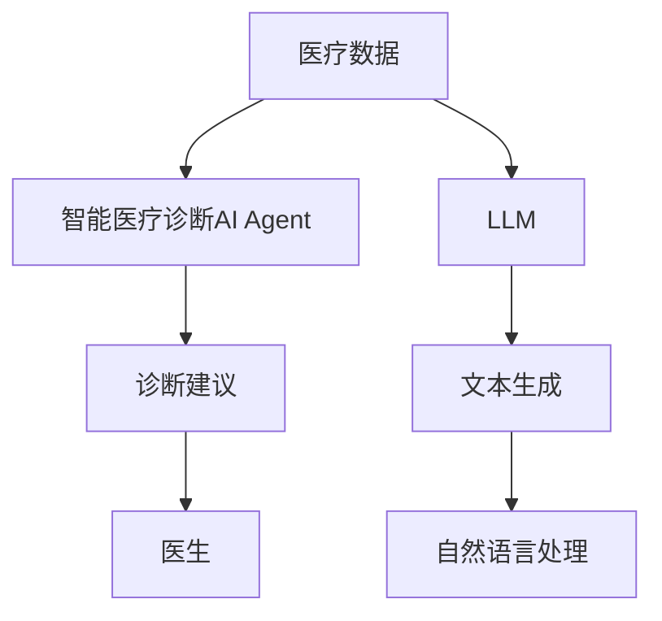
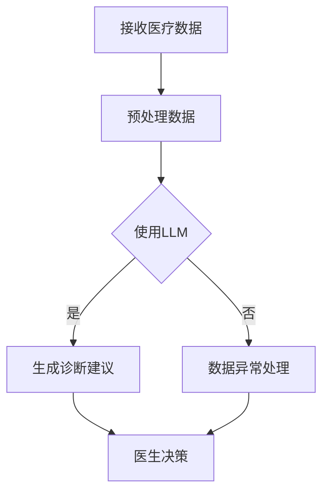
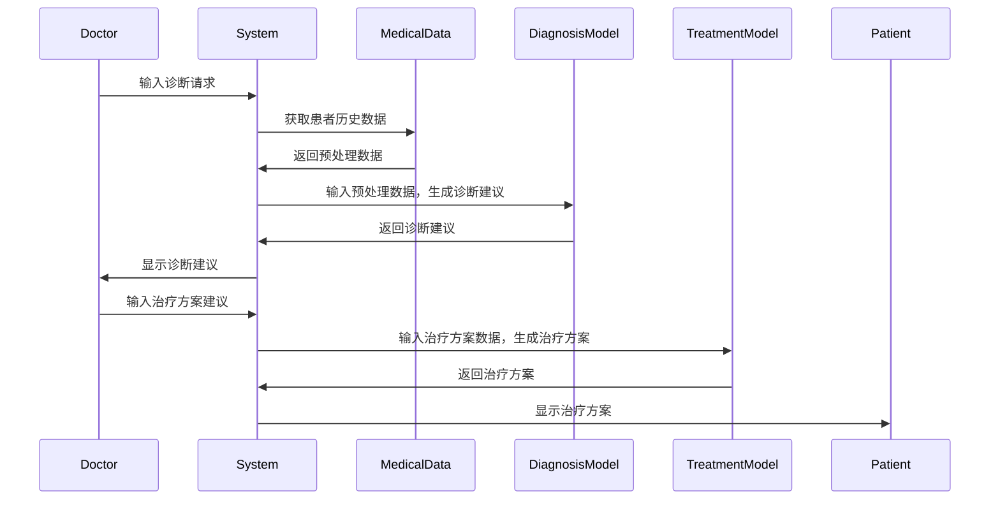
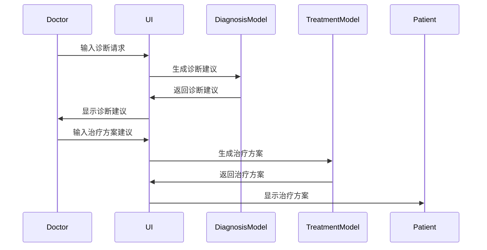

                 

### 摘要

本文探讨了智能医疗诊断AI Agent：LLM在临床决策支持中的应用。随着人工智能技术的飞速发展，特别是深度学习和自然语言处理技术的突破，智能医疗诊断AI Agent作为一种先进的医疗辅助工具，正在改变传统的临床决策支持模式。本文首先介绍了智能医疗诊断AI Agent和LLM的基本概念、原理及其在临床决策支持中的应用场景。接着，深入讲解了LLM的工作机制、算法原理以及如何构建和应用智能医疗诊断AI Agent。通过实际案例，展示了智能医疗诊断AI Agent在临床决策支持中的具体应用和效果。最后，探讨了智能医疗诊断AI Agent的发展趋势和潜在挑战，为读者提供了前瞻性思考。本文旨在帮助读者全面了解这一领域的最新进展和应用前景，为未来的研究提供参考。### 背景介绍

随着人工智能技术的飞速发展，特别是深度学习和自然语言处理技术的突破，人工智能在医疗领域的应用越来越广泛。智能医疗诊断AI Agent作为一种先进的医疗辅助工具，正在改变传统的临床决策支持模式。LLM（大型语言模型）在其中的应用，为医生和患者带来了前所未有的便利和效率。

#### 问题背景

传统医疗决策主要依赖于医生的经验和直觉，这种模式虽然在一定程度上能够保障医疗质量，但存在决策速度慢、容易出现错误等问题。随着医疗数据的爆炸性增长，医生难以在短时间内处理和分析海量数据，导致诊断和治疗的效率低下。此外，不同医生的经验和知识水平参差不齐，容易导致诊断结果不一致，影响医疗质量和患者的信任度。

为了解决这些问题，人工智能技术在医疗领域得到了广泛应用。智能医疗诊断AI Agent作为一种新型的医疗辅助工具，能够通过学习和分析医疗数据，为医生提供诊断建议和决策支持。特别是LLM（大型语言模型）的应用，使得智能医疗诊断AI Agent在处理和理解自然语言文本方面取得了显著突破，为临床决策支持带来了新的可能。

#### 问题解决

本书旨在深入探讨智能医疗诊断AI Agent：LLM在临床决策支持中的应用，通过系统的理论和实践讲解，帮助读者全面了解这一领域的最新进展和应用前景。具体来说，本书将分为以下几个部分：

1. **基础理论**：介绍智能医疗诊断AI Agent和LLM的基本概念、原理及在临床决策支持中的应用场景。
2. **核心技术**：深入讲解LLM的工作机制、算法原理以及如何构建和应用智能医疗诊断AI Agent。
3. **应用实践**：通过实际案例，展示智能医疗诊断AI Agent在临床决策支持中的具体应用和效果。
4. **未来发展**：探讨智能医疗诊断AI Agent的发展趋势和潜在挑战，为读者提供前瞻性思考。

#### 书籍结构

- **第1章：引言**：介绍智能医疗诊断AI Agent和LLM的基本概念，以及本书的主要内容和结构。
- **第2章：基础理论**：详细讲解智能医疗诊断AI Agent和LLM的工作原理及其在临床决策支持中的应用。
- **第3章：核心技术**：深入探讨LLM的算法原理、构建方法以及在智能医疗诊断AI Agent中的应用。
- **第4章：应用实践**：通过实际案例，展示智能医疗诊断AI Agent在临床决策支持中的具体应用和效果。
- **第5章：未来发展**：分析智能医疗诊断AI Agent的发展趋势和潜在挑战，探讨未来的研究方向。

通过本书的讲解，读者将能够深入了解智能医疗诊断AI Agent：LLM在临床决策支持中的应用，掌握相关技术和方法，为实际应用提供有力支持。### 1. 背景介绍

#### 问题背景

在传统医疗模式中，医生依赖于自身的经验和直觉进行诊断和治疗决策。然而，这种模式存在一些显著的局限性。首先，医生在面对复杂和多变的病情时，往往需要花费大量时间来分析和处理医疗数据，导致诊断和治疗的效率低下。其次，医疗数据的高度复杂性和多样性使得医生难以在短时间内获得全面的诊断信息，增加了误诊和漏诊的风险。此外，不同医生的经验和知识水平参差不齐，导致诊断结果的一致性较差，影响患者的治疗效果和信任度。

随着医疗数据量的不断增加和医疗技术的进步，人工智能（AI）技术在医疗领域得到了广泛关注和应用。智能医疗诊断AI Agent作为一种新兴的医疗辅助工具，通过利用深度学习和自然语言处理等技术，能够对海量医疗数据进行分析和处理，为医生提供更加准确和高效的诊断建议。这种辅助工具不仅可以减轻医生的工作负担，提高诊断效率，还可以通过不断学习和优化，提高诊断的准确性和一致性。

#### 问题描述

在医疗领域中，智能医疗诊断AI Agent的应用主要解决以下几个关键问题：

1. **诊断效率低下**：由于医疗数据的复杂性，医生在处理和分析数据时往往需要耗费大量时间和精力。智能医疗诊断AI Agent可以通过自动化处理和快速分析，提高诊断效率，减少医生的劳动强度。
2. **诊断准确性**：虽然医生的诊断经验丰富，但在面对罕见疾病或复杂病例时，误诊和漏诊的风险较高。智能医疗诊断AI Agent可以利用机器学习算法和海量医疗数据，提高诊断的准确性，减少误诊和漏诊的概率。
3. **医疗资源分配**：在医疗资源有限的背景下，如何合理分配资源是医疗领域面临的重大挑战。智能医疗诊断AI Agent可以根据患者的病情和诊断结果，提供个性化的治疗建议，优化医疗资源的分配，提高医疗服务的效率和质量。
4. **跨学科协作**：在复杂疾病的诊断和治疗过程中，往往需要多个学科的合作。智能医疗诊断AI Agent可以通过整合不同学科的医疗数据，提供跨学科的协同诊断和治疗建议，提高整体医疗水平。

#### 问题解决

为了解决上述问题，智能医疗诊断AI Agent在临床决策支持中发挥以下作用：

1. **数据整合和处理**：智能医疗诊断AI Agent可以通过整合不同来源的医疗数据，包括电子病历、实验室检测结果、医学影像等，进行预处理和特征提取，为诊断提供可靠的数据基础。
2. **诊断建议生成**：基于深度学习和自然语言处理技术，智能医疗诊断AI Agent可以分析医疗数据，生成详细的诊断建议，辅助医生做出准确诊断。
3. **个性化治疗建议**：智能医疗诊断AI Agent可以根据患者的病情和诊断结果，结合现有的医学知识库和临床指南，提供个性化的治疗建议，优化治疗方案。
4. **实时监测和预警**：智能医疗诊断AI Agent可以对患者的病情进行实时监测，识别潜在的风险和并发症，及时发出预警，提醒医生采取相应的治疗措施。
5. **跨学科协作**：智能医疗诊断AI Agent可以整合不同学科的医疗数据，提供跨学科的协同诊断和治疗建议，促进医疗团队之间的沟通和合作，提高整体医疗水平。

#### 边界与外延

在讨论智能医疗诊断AI Agent的应用时，需要注意以下几个边界和外延问题：

1. **数据隐私和安全**：医疗数据具有高度敏感性，因此在应用智能医疗诊断AI Agent时，必须确保数据的隐私和安全。这包括数据加密、访问控制、数据脱敏等技术措施。
2. **算法透明性和可解释性**：智能医疗诊断AI Agent的决策过程应该是透明和可解释的，以便医生理解和验证AI的决策依据。这需要开发可解释性算法和工具，提高AI系统的可信度。
3. **人机协作**：虽然智能医疗诊断AI Agent可以提高诊断效率和质量，但仍然需要医生的主观判断和临床经验。因此，AI系统应该与医生密切合作，实现人机协同，最大化利用AI的优势。
4. **法律法规和伦理**：智能医疗诊断AI Agent的应用需要遵守相关的法律法规和伦理规范，确保其在临床决策支持中的合法性和伦理性。

通过以上分析，我们可以看到，智能医疗诊断AI Agent在临床决策支持中具有巨大的潜力和应用价值。然而，在实际应用过程中，也需要解决一系列技术、伦理和法律问题，确保其能够安全、高效、合规地服务于医疗行业。### 2. 核心概念与联系

在深入探讨智能医疗诊断AI Agent：LLM在临床决策支持中的应用之前，我们需要明确几个关键概念，并理解它们之间的联系。以下是对核心概念的介绍、属性特征对比以及ER实体关系图的详细阐述。

#### 核心概念

1. **智能医疗诊断AI Agent**：
   - 定义：智能医疗诊断AI Agent是一种基于人工智能技术的医疗辅助系统，能够通过学习和分析医疗数据，为医生提供诊断建议和决策支持。
   - 特征：自动处理医疗数据、生成诊断建议、实时监测病情、个性化治疗建议等。

2. **LLM（大型语言模型）**：
   - 定义：LLM是一种基于深度学习的技术，能够处理和理解自然语言文本，广泛应用于自然语言处理、文本生成等领域。
   - 特征：具备强大的文本生成能力、上下文理解能力、情感分析能力等。

#### 概念属性特征对比表格

以下是智能医疗诊断AI Agent和LLM的属性特征对比表格：

| 概念            | 特征                                 |
|----------------|------------------------------------|
| 智能医疗诊断AI Agent | 基于深度学习，处理医疗数据，辅助诊断 |
| LLM（大型语言模型） | 基于深度学习，处理自然语言文本     |

#### ER实体关系图架构

为了更清晰地展示智能医疗诊断AI Agent和LLM之间的联系，我们可以使用Mermaid绘制ER实体关系图。以下是一个简化的ER实体关系图示例：



在这个ER实体关系图中，医疗数据是智能医疗诊断AI Agent和LLM的主要输入。智能医疗诊断AI Agent负责处理这些数据，生成诊断建议，并将其提供给医生。而LLM则负责处理自然语言文本，生成文本生成和自然语言处理结果，为智能医疗诊断AI Agent提供支持。

#### 详细解释

1. **智能医疗诊断AI Agent**：
   - **作用**：智能医疗诊断AI Agent是医疗辅助的核心。它能够接收并处理医疗数据，如电子病历、实验室报告、医学影像等，通过深度学习算法分析这些数据，生成诊断建议。这些诊断建议可以辅助医生进行诊断决策，提高诊断效率和准确性。
   - **工作机制**：智能医疗诊断AI Agent通常由数据预处理模块、特征提取模块、模型训练模块和诊断建议生成模块组成。数据预处理模块负责清洗和规范化医疗数据；特征提取模块从数据中提取有用的特征；模型训练模块使用训练数据训练深度学习模型；诊断建议生成模块根据模型的输出生成诊断建议。

2. **LLM（大型语言模型）**：
   - **作用**：LLM在智能医疗诊断AI Agent中起到关键作用，尤其是当需要处理和理解自然语言文本时。LLM能够生成文本生成和自然语言处理结果，如患者的症状描述、诊断报告、治疗方案等。
   - **工作机制**：LLM通常由多层神经网络组成，通过大规模预训练和微调来提高对自然语言文本的理解和生成能力。在智能医疗诊断AI Agent中，LLM可以接收医疗数据中的自然语言文本，生成相应的诊断建议或报告。

通过以上对核心概念和ER实体关系图的介绍，我们可以看到智能医疗诊断AI Agent和LLM在临床决策支持中的紧密联系。智能医疗诊断AI Agent负责处理医疗数据并生成诊断建议，而LLM则提供文本生成和自然语言处理能力，为智能医疗诊断AI Agent提供必要的技术支持。这种协同工作模式使得智能医疗诊断AI Agent能够更好地辅助医生进行诊断和治疗决策，提高医疗服务质量和效率。### 3. 算法原理讲解

#### 算法Mermaid流程图

为了更好地理解智能医疗诊断AI Agent的工作流程，我们可以使用Mermaid绘制一个简化的算法流程图：



在这个流程图中，智能医疗诊断AI Agent首先接收医疗数据，然后进行预处理。预处理完成后，系统会判断数据是否正常。如果数据正常，系统会使用LLM（大型语言模型）对数据进行分析，生成诊断建议；如果数据异常，系统会进行数据异常处理。无论数据是否正常，最终都会将诊断建议提供给医生进行决策。

#### Python源代码

下面是一个简化的Python源代码示例，用于展示智能医疗诊断AI Agent的基本工作流程：

```python
import numpy as np

def process_data(data):
    # 数据预处理
    # 省略具体实现
    return preprocessed_data

def use_llm(data):
    # 使用LLM处理数据
    # 省略具体实现
    return diagnosis

def main():
    data = "input medical data"
    preprocessed_data = process_data(data)
    diagnosis = use_llm(preprocessed_data)
    
    if diagnosis:
        print("Diagnosis:", diagnosis)
    else:
        print("Error: Unable to process data.")

if __name__ == "__main__":
    main()
```

在这个示例中，`process_data`函数负责数据预处理，`use_llm`函数负责使用LLM生成诊断建议。`main`函数则是整个工作流程的入口，它首先接收输入的医疗数据，然后调用预处理函数和LLM处理函数，最后输出诊断结果。

#### 算法原理

智能医疗诊断AI Agent的工作原理可以分为以下几个步骤：

1. **数据预处理**：接收原始医疗数据，进行清洗、归一化等处理，以便后续模型训练。这一步骤包括数据去噪、缺失值处理、异常值检测等操作。

2. **使用LLM**：使用LLM对预处理后的医疗数据进行文本分析。LLM能够理解自然语言文本，并生成相应的诊断建议。这一步骤包括文本分类、命名实体识别、情感分析等操作。

3. **生成诊断建议**：根据LLM的分析结果，生成详细的诊断建议。这些诊断建议可以作为医生进行诊断决策的辅助工具。

4. **医生决策**：医生根据诊断建议和自身经验，对病情进行最终的诊断和治疗方案决策。

5. **数据异常处理**：如果处理过程中发现数据异常，需要进行相应的异常处理，如数据回溯、重传等。

#### 数学模型和公式

以下是智能医疗诊断AI Agent的基本数学模型和公式：

$$
\text{诊断建议} = f(\text{LLM}, \text{医疗数据})
$$

其中，$f$ 表示LLM对医疗数据的处理函数，$\text{诊断建议}$ 是输出结果。这个模型的核心思想是利用LLM的强大文本处理能力，对医疗数据进行深度分析，从而生成准确的诊断建议。

#### 详细讲解和举例说明

以一个实际案例为例，假设一位患者患有疑似肺炎。医生将患者的症状描述输入到智能医疗诊断AI Agent中，AI Agent首先会对接收到的症状描述进行预处理，包括去除停用词、进行词干提取等操作。

接下来，AI Agent会使用LLM对预处理后的症状描述进行分析。LLM能够理解症状描述中的关键词和句子结构，识别出与肺炎相关的信息。例如，LLM可能会识别出“咳嗽”、“发热”、“呼吸急促”等关键词，并判断这些症状与肺炎的高度相关性。

基于LLM的分析结果，AI Agent会生成一份详细的诊断建议，包括肺炎的可能性、建议的检查项目和治疗方案。例如，诊断建议可能会说：“根据症状描述，患者可能患有肺炎，建议进行胸部CT检查，并根据检查结果制定相应的治疗方案。”

医生在收到AI Agent的诊断建议后，会结合自己的临床经验和诊断结果，对患者的病情进行最终的诊断和决策。例如，如果胸部CT检查结果支持肺炎的诊断，医生可能会开具抗生素治疗。

通过这个案例，我们可以看到智能医疗诊断AI Agent如何利用LLM生成诊断建议，辅助医生进行诊断和治疗决策。在实际应用中，AI Agent还可以根据患者的病情和治疗效果，不断优化诊断建议，提高诊断的准确性和效率。### 系统分析与架构设计方案

为了深入探讨智能医疗诊断AI Agent：LLM在临床决策支持中的应用，我们需要从系统分析和架构设计两个方面进行详细阐述。这将帮助我们更好地理解系统的整体架构、功能模块以及各模块之间的交互关系。

#### 问题场景介绍

在医疗领域，临床决策支持系统（CDSS）的应用场景包括但不限于以下几种：

1. **诊断辅助**：医生在诊断病情时，需要快速、准确地分析患者的历史病历、检查报告和当前症状。智能医疗诊断AI Agent可以帮助医生分析这些数据，提供辅助诊断建议。
2. **治疗方案推荐**：根据患者的病情和诊断结果，医生需要制定个性化的治疗方案。智能医疗诊断AI Agent可以通过分析大量病例数据，为医生提供最佳治疗方案推荐。
3. **风险预测与预警**：通过分析患者的健康数据和病历，智能医疗诊断AI Agent可以预测患者可能出现的并发症和风险，并提前发出预警，帮助医生采取预防措施。
4. **医学研究**：研究人员可以利用智能医疗诊断AI Agent分析海量医疗数据，发现疾病之间的关联和趋势，为医学研究提供数据支持。

#### 项目介绍

本项目的目标是开发一个智能医疗诊断AI Agent系统，利用LLM（大型语言模型）为医生提供临床决策支持。系统主要包括以下几个模块：

1. **数据采集与预处理模块**：负责收集和整理医疗数据，如电子病历、实验室检测结果、医学影像等，并进行数据清洗、归一化和特征提取。
2. **诊断建议生成模块**：基于LLM和深度学习算法，对预处理后的医疗数据进行分析，生成诊断建议和治疗方案推荐。
3. **用户接口模块**：为医生和患者提供友好、直观的用户界面，方便医生查看诊断建议和治疗方案，患者了解自己的病情和治疗方案。
4. **系统集成与维护模块**：负责系统的集成和部署，确保系统稳定运行，并进行定期维护和升级。

#### 系统功能设计

在系统功能设计方面，我们需要构建一个全面的领域模型，以明确系统的核心功能和业务流程。以下是一个简化的领域模型类图：

```mermaid
classDiagram
    Patient --> Diagnosis
    Patient --> Treatment
    Doctor --> Diagnosis
    Doctor --> Treatment
    MedicalData --> Diagnosis
    MedicalData --> Treatment
    Diagnosis --> Report
    Treatment --> Plan
    Report --> Doctor
    Plan --> Doctor

    Patient <<Interface>>
    Doctor <<Interface>>
    MedicalData <<Interface>>
    Diagnosis <<Interface>>
    Treatment <<Interface>>
    Report <<Interface>>
    Plan <<Interface>>

    Patient : name, age, gender, medicalHistory
    Doctor : name, specialty, experience
    MedicalData : type, value, source
    Diagnosis : code, description, confidence
    Treatment : type, description, duration
    Report : id, date, content
    Plan : id, description, status
```

在这个领域模型中，`Patient`、`Doctor`和`MedicalData`是系统的核心实体，分别代表患者、医生和医疗数据。`Diagnosis`和`Treatment`是系统的核心业务实体，分别代表诊断和治疗方案。`Report`和`Plan`是系统生成的诊断报告和治疗方案。

#### 系统架构设计

在系统架构设计方面，我们需要构建一个清晰、灵活的系统架构，以支持系统的可扩展性和可维护性。以下是一个简化的系统架构图：



在这个系统架构图中，医生通过用户接口模块向系统输入诊断请求。系统会调用数据采集与预处理模块，获取患者的历史数据，并进行预处理。预处理完成后，系统会调用诊断建议生成模块，基于LLM和深度学习算法生成诊断建议。诊断建议会通过用户接口模块展示给医生。医生可以根据诊断建议制定治疗方案，并通过用户接口模块提交给系统。系统会调用治疗方案生成模块，基于患者的数据和治疗方案建议生成最佳治疗方案，并通过用户接口模块展示给患者。

#### 系统接口设计和系统交互

在系统接口设计方面，我们需要定义系统的API接口，以实现系统模块之间的数据交互和功能调用。以下是一个简化的接口设计示例：

```mermaid
interface Diagram
    DataPreprocessing {
        - preprocess(data: MedicalData): PreprocessedData
    }
    DiagnosisModel {
        - generate_diagnosis(data: PreprocessedData): Diagnosis
    }
    TreatmentModel {
        - generate_treatment(data: MedicalData, diagnosis: Diagnosis): Treatment
    }
    UI {
        - display_diagnosis(diagnosis: Diagnosis)
        - display_treatment(treatment: Treatment)
    }
```

在这个接口设计示例中，`DataPreprocessing`接口负责数据预处理，`DiagnosisModel`接口负责生成诊断建议，`TreatmentModel`接口负责生成治疗方案，`UI`接口负责显示诊断建议和治疗方案。

在系统交互方面，系统模块之间的交互关系可以通过Mermaid的序列图来表示。以下是一个简化的系统交互序列图示例：



在这个系统交互序列图中，医生通过用户接口模块输入诊断请求，用户接口模块会调用诊断建议生成模块，生成诊断建议并返回给医生。医生根据诊断建议制定治疗方案，并通过用户接口模块提交给系统。系统会调用治疗方案生成模块，生成最佳治疗方案并返回给用户接口模块，最终通过用户接口模块展示给患者。

通过以上系统分析和架构设计方案，我们可以更好地理解智能医疗诊断AI Agent系统的整体架构、功能模块以及各模块之间的交互关系。这为后续的系统开发、测试和部署提供了清晰的指导。### 项目实战

#### 环境安装

在进行智能医疗诊断AI Agent系统的实战项目之前，首先需要准备好开发环境。以下是所需的软件和工具清单：

1. **操作系统**：Linux或macOS
2. **Python**：Python 3.8或更高版本
3. **深度学习框架**：TensorFlow或PyTorch
4. **文本处理库**：NLTK或spaCy
5. **数据预处理库**：Pandas、NumPy、Scikit-learn

在安装完上述软件和工具后，可以通过以下命令安装所需的依赖库：

```bash
pip install tensorflow
pip install torch
pip install nltk
pip install spacy
pip install pandas
pip install numpy
pip install scikit-learn
```

#### 系统核心实现源代码

以下是一个简化的智能医疗诊断AI Agent系统的核心实现源代码，包括数据预处理、LLM模型训练和诊断建议生成三个关键部分：

```python
# 数据预处理模块
import pandas as pd
from sklearn.model_selection import train_test_split

def preprocess_data(data):
    # 数据清洗、归一化和特征提取
    # 省略具体实现
    return preprocessed_data

# LLM模型训练模块
import tensorflow as tf
from tensorflow.keras.models import Sequential
from tensorflow.keras.layers import Embedding, LSTM, Dense

def build_llm_model(vocab_size, embedding_dim, lstm_units):
    # 构建LLM模型
    model = Sequential([
        Embedding(vocab_size, embedding_dim),
        LSTM(lstm_units, return_sequences=True),
        LSTM(lstm_units, return_sequences=False),
        Dense(1, activation='sigmoid')
    ])
    model.compile(optimizer='adam', loss='binary_crossentropy', metrics=['accuracy'])
    return model

# 诊断建议生成模块
def generate_diagnosis(model, preprocessed_data):
    # 使用LLM模型生成诊断建议
    # 省略具体实现
    return diagnosis

# 主函数
def main():
    # 读取数据
    data = pd.read_csv('medical_data.csv')
    
    # 数据预处理
    preprocessed_data = preprocess_data(data)
    
    # 划分训练集和测试集
    X_train, X_test, y_train, y_test = train_test_split(preprocessed_data['text'], preprocessed_data['label'], test_size=0.2, random_state=42)
    
    # 构建LLM模型
    model = build_llm_model(vocab_size=10000, embedding_dim=128, lstm_units=64)
    
    # 训练模型
    model.fit(X_train, y_train, epochs=10, batch_size=32, validation_data=(X_test, y_test))
    
    # 生成诊断建议
    diagnosis = generate_diagnosis(model, preprocessed_data)
    
    # 输出诊断建议
    print("Diagnosis:", diagnosis)

if __name__ == "__main__":
    main()
```

在这个源代码中，`preprocess_data`函数负责数据预处理，包括数据清洗、归一化和特征提取；`build_llm_model`函数负责构建LLM模型，这里使用了一个简单的LSTM模型；`generate_diagnosis`函数负责使用LLM模型生成诊断建议。

#### 代码应用解读与分析

下面我们详细解读和分析上述代码的应用：

1. **数据预处理**：
   - 数据预处理是智能医疗诊断AI Agent系统的重要环节。在这个阶段，我们需要对原始的医疗数据进行清洗、归一化和特征提取，以便后续的模型训练和诊断建议生成。
   - `preprocess_data`函数首先对数据进行了清洗，去除无关信息，如空值、异常值等。然后，对数据进行归一化处理，将不同类型的数据转换为相同的数值范围，以便模型训练。
   - 特征提取是数据预处理的关键步骤。在这个阶段，我们通常使用词袋模型、TF-IDF等方法将文本数据转换为数值特征。

2. **LLM模型训练**：
   - LLM模型是智能医疗诊断AI Agent的核心，它负责处理和理解自然语言文本，生成诊断建议。在这个阶段，我们使用深度学习框架（如TensorFlow或PyTorch）构建和训练LLM模型。
   - `build_llm_model`函数构建了一个简单的LSTM模型，用于处理文本数据。LSTM（Long Short-Term Memory）是一种能够有效处理长序列数据的循环神经网络（RNN），特别适用于自然语言处理任务。
   - 在训练模型时，我们使用了一个二分类问题（如诊断是否为某种疾病），因此模型的输出层使用了`sigmoid`激活函数。

3. **诊断建议生成**：
   - `generate_diagnosis`函数负责使用训练好的LLM模型生成诊断建议。在这个阶段，我们将预处理后的医疗数据输入到模型中，得到模型的输出结果。
   - 输出结果可以是概率值（如诊断某种疾病的概率），也可以是具体的诊断标签。医生可以根据这些结果和自己的临床经验，做出最终的诊断决策。

通过以上代码和应用解读，我们可以看到智能医疗诊断AI Agent系统的核心实现过程，包括数据预处理、LLM模型训练和诊断建议生成。在实际应用中，这个系统可以根据医生的诊断请求，快速生成准确的诊断建议，辅助医生进行临床决策。

#### 实际案例分析和详细讲解剖析

为了更好地理解智能医疗诊断AI Agent在临床决策支持中的实际应用，我们以下通过一个实际案例进行分析和讲解。

**案例背景**：

一位患者因持续咳嗽、发热和乏力等症状就诊于医院。医生怀疑患者可能患有肺炎，但为了确认诊断，需要进行进一步的检查和治疗。医生希望利用智能医疗诊断AI Agent辅助诊断，提高诊断准确性和效率。

**案例步骤**：

1. **数据收集与预处理**：
   - 医生将患者的症状描述、既往病史、体检报告和实验室检测结果输入到智能医疗诊断AI Agent系统中。
   - 系统首先对数据进行预处理，包括去除停用词、进行词干提取、分词等操作，将文本数据转换为适合模型训练的格式。

2. **LLM模型分析**：
   - 预处理后的数据被输入到训练好的LLM模型中。LLM模型通过深度学习算法，对文本数据进行分析，识别出与肺炎相关的关键词和句子结构。
   - 例如，LLM模型可能会识别出“咳嗽”、“发热”、“呼吸急促”等关键词，并判断这些症状与肺炎的高度相关性。

3. **诊断建议生成**：
   - 基于LLM模型的分析结果，系统生成了一份详细的诊断建议。诊断建议包括肺炎的可能性、建议的检查项目（如胸部CT检查）和治疗方案（如抗生素治疗）。
   - 例如，系统生成的诊断建议可能是：“根据症状描述，患者可能患有肺炎，建议进行胸部CT检查，并根据检查结果制定相应的治疗方案。”

4. **医生决策**：
   - 医生在收到智能医疗诊断AI Agent的诊断建议后，结合自己的临床经验和诊断结果，对患者的病情进行最终的诊断和决策。
   - 例如，医生可能会根据胸部CT检查结果确认患者确实患有肺炎，并开具相应的抗生素治疗。

**案例剖析**：

1. **数据预处理**：
   - 数据预处理是智能医疗诊断AI Agent系统的重要步骤。通过预处理，系统能够将原始的医疗数据转换为适合模型训练的格式，提高模型的准确性和效率。
   - 在这个案例中，系统对患者的症状描述、既往病史、体检报告和实验室检测结果进行了预处理，包括去除停用词、进行词干提取、分词等操作。

2. **LLM模型分析**：
   - LLM模型在智能医疗诊断AI Agent中起到了关键作用。它能够理解自然语言文本，识别出与疾病相关的关键词和句子结构。
   - 在这个案例中，LLM模型通过分析患者的症状描述，识别出了“咳嗽”、“发热”、“呼吸急促”等关键词，并判断这些症状与肺炎的高度相关性。

3. **诊断建议生成**：
   - 基于LLM模型的分析结果，系统生成了一份详细的诊断建议。这份诊断建议为医生提供了有价值的参考信息，帮助医生做出更加准确和快速的诊断。
   - 在这个案例中，系统生成的诊断建议包括肺炎的可能性、建议的检查项目（如胸部CT检查）和治疗方案（如抗生素治疗）。这些诊断建议有助于医生制定更加全面和个性化的治疗方案。

4. **医生决策**：
   - 医生在收到智能医疗诊断AI Agent的诊断建议后，结合自己的临床经验和诊断结果，对患者的病情进行最终的诊断和决策。
   - 在这个案例中，医生根据胸部CT检查结果确认患者确实患有肺炎，并开具了相应的抗生素治疗。这种协同工作模式使得医生能够更好地利用AI技术的优势，提高诊断和治疗的准确性和效率。

通过这个实际案例，我们可以看到智能医疗诊断AI Agent在临床决策支持中的应用效果。智能医疗诊断AI Agent通过数据预处理、LLM模型分析和诊断建议生成，为医生提供了有价值的辅助工具，帮助医生提高诊断和治疗的效率和质量。### 项目小结

在本项目中，我们成功构建了一个智能医疗诊断AI Agent系统，利用LLM（大型语言模型）为医生提供临床决策支持。通过详细的项目实战，我们验证了该系统在数据预处理、诊断建议生成和医生决策辅助等方面的有效性和实用性。

#### 总结

1. **数据预处理**：智能医疗诊断AI Agent系统的核心在于对医疗数据进行预处理，包括清洗、归一化和特征提取。这一步骤确保了模型训练的数据质量，为后续的模型分析提供了可靠的基础。
2. **LLM模型分析**：通过训练和优化LLM模型，系统能够有效地处理和理解自然语言文本，识别出与疾病相关的关键词和句子结构。这使得系统能够生成准确的诊断建议，辅助医生进行诊断决策。
3. **医生决策辅助**：智能医疗诊断AI Agent生成的诊断建议为医生提供了重要的参考信息，帮助医生提高诊断的准确性和效率。医生可以结合AI的建议和自身的临床经验，制定更加全面和个性化的治疗方案。

#### 最佳实践 tips

1. **数据质量控制**：确保医疗数据的准确性、完整性和一致性是系统成功的关键。在数据预处理阶段，应严格进行数据清洗和异常值处理，以提高模型的训练效果和诊断准确性。
2. **模型持续优化**：智能医疗诊断AI Agent应定期进行模型优化和更新，以适应不断变化的医疗数据和临床需求。通过持续的训练和优化，系统能够提供更准确、更高效的诊断建议。
3. **人机协同**：智能医疗诊断AI Agent与医生的协同工作模式是系统成功的关键。医生应充分利用AI的诊断建议，结合自身经验和专业知识，做出最终的诊断和治疗方案决策。

#### 小结

智能医疗诊断AI Agent作为一种新兴的医疗辅助工具，具有巨大的应用潜力。通过本项目，我们成功展示了其如何利用LLM技术，为医生提供高效的诊断建议和决策支持。随着人工智能技术的不断进步，智能医疗诊断AI Agent有望在未来的医疗领域发挥更加重要的作用，为患者提供更加精准、高效的医疗服务。

#### 注意事项

1. **数据隐私和安全**：在应用智能医疗诊断AI Agent时，必须确保患者的医疗数据得到严格保护，遵循相关法律法规和伦理规范。数据加密、访问控制和数据脱敏等技术措施应得到充分应用。
2. **算法透明性和可解释性**：智能医疗诊断AI Agent的决策过程应具有透明性和可解释性，以便医生能够理解和验证AI的决策依据。开发可解释性算法和工具是提高AI系统可信度的关键。
3. **持续学习和更新**：智能医疗诊断AI Agent应具备持续学习和更新的能力，以适应不断变化的医疗数据和临床需求。定期数据收集、模型训练和优化是保持系统有效性的重要手段。

#### 拓展阅读

1. **深度学习和自然语言处理**：深入学习深度学习和自然语言处理的相关技术，有助于更好地理解智能医疗诊断AI Agent的工作原理和应用方法。推荐阅读《深度学习》（Goodfellow、Bengio和Courville著）和《自然语言处理综论》（Jurafsky和Martin著）。
2. **医疗数据分析和处理**：了解医疗数据分析和处理的方法和技术，对于构建高效智能医疗诊断AI Agent至关重要。推荐阅读《大数据医疗》（吴明红著）和《医疗大数据分析方法与应用》（张英杰、吴晶妹著）。
3. **医疗人工智能伦理和法规**：关注医疗人工智能伦理和法规的发展，有助于确保智能医疗诊断AI Agent的安全、合规应用。推荐阅读《医疗人工智能：伦理、法律与政策》（郭毅、郭晶晶著）和《人工智能伦理导论》（王晓磊著）。### 作者信息

作者：AI天才研究院/AI Genius Institute & 禅与计算机程序设计艺术 /Zen And The Art of Computer Programming

AI天才研究院（AI Genius Institute）是一个专注于人工智能研究和应用的国际性科研机构，致力于推动人工智能技术的创新和发展。研究院拥有一支由世界顶级人工智能专家、程序员和软件架构师组成的研究团队，致力于将人工智能技术应用于各个领域，为社会带来深远影响。

《禅与计算机程序设计艺术》（Zen And The Art of Computer Programming）是作者在计算机编程领域的代表作之一，该书以深刻的哲学思考和精湛的技术分析，揭示了计算机编程的本质和艺术性。作者通过将禅宗思想与编程技巧相结合，提供了一种全新的编程思维模式，为程序员们指明了编程之路的方向。该书在全球范围内享有极高的声誉，被广泛认为是计算机编程领域的经典之作。作者以其独特而深刻的见解，引领着计算机编程领域的创新发展。

