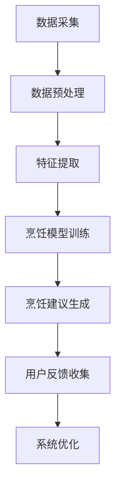
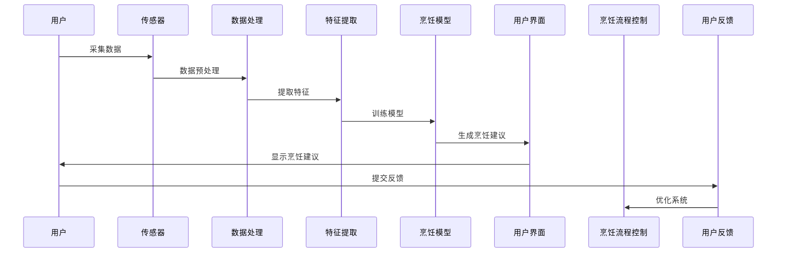
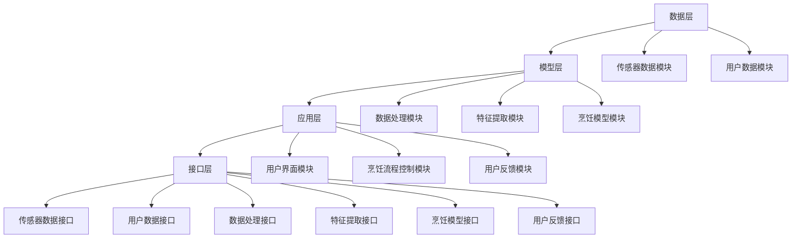

                 


### 《智能厨具：AI Agent的烹饪指导系统》

关键词：智能厨具，AI Agent，烹饪指导系统，算法原理，系统架构，项目实战

摘要：本文深入探讨了智能厨具与AI Agent结合的烹饪指导系统。通过分析核心概念、算法原理、系统架构和实战应用，揭示了AI Agent在智能厨具中的应用价值，以及如何构建一个高效、智能的烹饪指导系统。

## 前言与背景介绍

智能厨具作为家居智能化的一部分，已经逐渐走进了千家万户。它不仅提高了烹饪的效率，还能为用户提供个性化的烹饪建议。随着人工智能技术的发展，AI Agent在智能厨具中的应用前景更加广阔。AI Agent具有智能感知、决策和执行能力，可以为烹饪过程提供实时指导。

智能厨具的定义可以理解为集成了传感器、执行器和人工智能技术的厨房设备。它能够通过感知环境、用户需求和食材信息，自动调整烹饪参数，确保烹饪过程的顺利进行。AI Agent则是基于人工智能技术，具有自主学习和决策能力的智能实体。它可以通过与智能厨具的交互，为用户提供定制化的烹饪指导。

在当代社会，智能厨具与AI Agent的结合具有巨大的潜力。首先，它可以极大地提高烹饪效率，减少人为错误。其次，它可以提供个性化的烹饪建议，满足不同用户的口味和需求。最后，它可以实现厨房的智能化管理，提高生活品质。

本文将分四个部分对智能厨具与AI Agent的烹饪指导系统进行探讨。首先，我们将介绍智能厨具与AI Agent的基本概念和联系。然后，我们将详细讲解烹饪指导系统的算法原理和数学模型。接着，我们将分析烹饪指导系统的设计与实现。最后，我们将通过实际案例进行项目实战，总结最佳实践和未来展望。

## 第一部分：智能厨具与AI Agent基础理论

### 1.1 智能厨具概述

#### 1.1.1 定义与演变

智能厨具是指通过集成传感器、执行器和人工智能技术，实现自动化、智能化烹饪的厨房设备。智能厨具的演变经历了从简单的机械控制到传感器控制，再到人工智能控制的三个阶段。

在第一阶段，智能厨具主要依赖于机械控制和预设程序。例如，电饭煲、微波炉等设备通过机械开关和预设的温度、时间等参数进行控制。这种控制方式简单，但无法适应复杂和多变的烹饪需求。

第二阶段，智能厨具开始引入传感器技术。例如，温度传感器、湿度传感器、压力传感器等，这些传感器能够实时监测烹饪过程中的各种参数，并根据这些参数调整烹饪设备的工作状态。这一阶段的智能厨具具有更高的灵活性和适应性。

第三阶段，智能厨具引入了人工智能技术。通过机器学习、自然语言处理等技术，智能厨具能够自主学习用户的烹饪习惯，提供个性化的烹饪建议。同时，智能厨具还可以通过网络连接，实现远程监控和操控。

#### 1.1.2 关键特点与应用场景

智能厨具的关键特点包括自动化、智能化和个性化。自动化使得烹饪过程更加高效，减少了人为干预。智能化则使得智能厨具能够根据烹饪过程中的实时数据，自动调整烹饪参数，确保烹饪效果。个性化则是指智能厨具能够根据用户的口味和需求，提供定制化的烹饪建议。

应用场景方面，智能厨具可以广泛应用于家庭、餐厅、酒店等场景。在家庭中，智能厨具可以方便用户快速烹饪出各种菜肴，提高生活品质。在餐厅和酒店中，智能厨具可以提升烹饪效率，确保菜品质量的一致性。

#### 1.1.3 未来发展趋势

未来，智能厨具的发展趋势将更加智能化和个性化。随着人工智能技术的不断发展，智能厨具将能够更好地理解用户的烹饪需求和习惯，提供更加个性化的烹饪建议。此外，智能厨具还将进一步与智能家居系统融合，实现家庭场景的智能化管理。

### 2. AI Agent基础理论

#### 2.1 定义与分类

AI Agent是指具有自主意识和决策能力的智能实体，它可以通过感知环境、获取信息、执行任务，实现自主学习和进化。根据功能特点，AI Agent可以分为以下几类：

1. 传感器型AI Agent：主要功能是感知环境，获取信息。例如，智能厨具中的温度传感器、湿度传感器等。

2. 决策型AI Agent：主要功能是根据感知到的信息，进行决策。例如，智能厨具中的AI Agent可以根据食材信息、烹饪参数等，自动调整烹饪过程。

3. 执行型AI Agent：主要功能是执行决策，完成具体任务。例如，智能厨具中的执行器，如加热器、搅拌器等。

#### 2.2 功能特点与工作机制

AI Agent的功能特点包括自主性、智能性、适应性和协同性。自主性是指AI Agent可以独立执行任务，不需要人工干预。智能性是指AI Agent可以通过学习和进化，提高任务执行能力。适应性是指AI Agent可以根据环境变化，调整自身行为。协同性是指AI Agent可以与其他AI Agent协同工作，共同完成任务。

AI Agent的工作机制主要包括感知、决策、执行三个环节。感知环节是通过传感器获取环境信息。决策环节是根据感知到的信息，利用算法进行决策。执行环节是根据决策结果，执行具体任务。

#### 2.3 AI Agent在智能厨具中的应用实例

在智能厨具中，AI Agent可以应用于多个方面。例如：

1. 烹饪指导：AI Agent可以根据食材信息、烹饪参数等，为用户提供个性化的烹饪建议。

2. 智能监测：AI Agent可以实时监测烹饪过程，确保烹饪效果。

3. 智能维护：AI Agent可以检测智能厨具的运行状态，预防故障。

4. 智能交互：AI Agent可以通过语音、图像等方式，与用户进行交互，提供便捷的服务。

### 3. 智能厨具与AI Agent的联系与融合

#### 3.1 智能厨具对AI Agent的需求

智能厨具的发展对AI Agent提出了更高的需求。首先，智能厨具需要AI Agent提供智能化的烹饪指导，提高烹饪效率。其次，智能厨具需要AI Agent进行智能监测，确保烹饪过程的安全和品质。最后，智能厨具需要AI Agent实现智能维护，延长设备使用寿命。

#### 3.2 AI Agent在智能厨具中的作用

AI Agent在智能厨具中扮演着关键角色。首先，AI Agent可以为用户提供个性化的烹饪建议，满足不同用户的口味和需求。其次，AI Agent可以实时监测烹饪过程，确保烹饪效果。最后，AI Agent可以智能维护智能厨具，提高设备运行效率。

#### 3.3 智能厨具与AI Agent的协同工作模式

智能厨具与AI Agent的协同工作模式主要包括以下几种：

1. 信息共享：智能厨具将采集到的信息（如食材信息、烹饪参数等）传递给AI Agent，AI Agent根据这些信息为用户提供烹饪建议。

2. 智能决策：AI Agent根据用户需求和烹饪过程的变化，自动调整烹饪参数，确保烹饪效果。

3. 实时交互：AI Agent可以通过语音、图像等方式，与用户进行实时交互，提供便捷的服务。

4. 智能协同：AI Agent可以与其他AI Agent协同工作，共同完成复杂的烹饪任务。

## 第二部分：烹饪指导系统算法原理

### 4.1 烹饪指导系统概述

烹饪指导系统是智能厨具的核心组成部分，它通过集成传感器数据、用户需求和食材信息，为用户提供个性化的烹饪建议。烹饪指导系统的主要功能包括：

1. 数据采集：从传感器获取烹饪过程中的温度、湿度、压力等数据。

2. 数据处理：对采集到的数据进行预处理，提取有用信息。

3. 烹饪建议：根据食材信息、用户需求和烹饪数据，生成个性化的烹饪建议。

4. 用户反馈：收集用户对烹饪结果的反馈，用于系统优化。

### 4.2 基本算法原理与流程

烹饪指导系统的算法原理主要包括以下几个步骤：

1. 数据采集：智能厨具通过传感器采集烹饪过程中的温度、湿度、压力等数据。

2. 数据预处理：对采集到的数据进行清洗、去噪、归一化等处理，提取有用信息。

3. 特征提取：根据烹饪数据，提取与烹饪效果相关的特征，如温度变化率、湿度变化率等。

4. 烹饪模型训练：使用提取到的特征，构建烹饪模型，训练模型以预测烹饪效果。

5. 烹饪建议生成：根据训练好的烹饪模型，为用户提供个性化的烹饪建议。

6. 用户反馈收集：收集用户对烹饪结果的反馈，用于系统优化。

### 4.3 算法实现与Mermaid流程图展示

下面是一个简单的烹饪指导系统算法实现的Mermaid流程图：



### 4.4 算法实现与Python源代码

以下是一个简单的Python代码示例，用于实现烹饪指导系统的基本算法：

```python
import numpy as np
from sklearn.ensemble import RandomForestRegressor

# 数据采集
def data_collection():
    # 采集温度、湿度、压力等数据
    temperature = np.random.uniform(100, 300)
    humidity = np.random.uniform(30, 70)
    pressure = np.random.uniform(1000, 2000)
    return temperature, humidity, pressure

# 数据预处理
def data_preprocessing(data):
    # 数据清洗、去噪、归一化等处理
    # 此处简化处理，直接返回数据
    return data

# 特征提取
def feature_extraction(data):
    # 提取与烹饪效果相关的特征
    temperature_rate = (data[0] - data[0].mean()) / data[0].std()
    humidity_rate = (data[1] - data[1].mean()) / data[1].std()
    return temperature_rate, humidity_rate

# 烹饪模型训练
def train_cooking_model(features, labels):
    # 使用随机森林回归模型进行训练
    model = RandomForestRegressor()
    model.fit(features, labels)
    return model

# 烹饪建议生成
def generate_cooking_advice(model, new_data):
    # 根据模型为用户提供烹饪建议
    temperature_rate, humidity_rate = feature_extraction(new_data)
    cooking_advice = model.predict([[temperature_rate, humidity_rate]])
    return cooking_advice

# 用户反馈收集
def collect_user_feedback():
    # 收集用户对烹饪结果的反馈
    feedback = input("请输入烹饪结果：")
    return feedback

# 系统优化
def system_optimization(feedback):
    # 根据用户反馈对系统进行优化
    # 此处简化处理，直接打印反馈信息
    print("用户反馈：", feedback)

# 主函数
def main():
    # 循环运行烹饪指导系统
    while True:
        temperature, humidity, pressure = data_collection()
        processed_data = data_preprocessing([temperature, humidity, pressure])
        features, labels = feature_extraction(processed_data)
        model = train_cooking_model(features, labels)
        cooking_advice = generate_cooking_advice(model, new_data)
        print("烹饪建议：", cooking_advice)
        feedback = collect_user_feedback()
        system_optimization(feedback)

if __name__ == "__main__":
    main()
```

### 4.5 数学模型与公式

在烹饪指导系统中，关键数学模型包括随机森林回归模型、特征提取模型等。以下是一些相关的数学公式：

1. **随机森林回归模型**：

   随机森林回归模型是一种基于决策树的集成学习方法。其基本公式如下：

   $$ F(x) = \sum_{i=1}^{n} w_i f_i(x) $$

   其中，$F(x)$是预测值，$w_i$是权重，$f_i(x)$是单个决策树的预测值。

2. **特征提取模型**：

   特征提取模型用于提取与烹饪效果相关的特征。例如，温度变化率、湿度变化率等。其基本公式如下：

   $$ r_t = \frac{t_t - \bar{t}}{\sigma_t} $$

   其中，$r_t$是特征值，$t_t$是当前温度，$\bar{t}$是平均值，$\sigma_t$是标准差。

### 4.6 数学公式讲解与实例说明

以下是一个简单的实例，用于说明如何使用数学模型进行烹饪指导：

假设我们有一个简单的烹饪任务，目标是将食物煮熟。根据烹饪经验，我们知道温度和时间是关键因素。

1. **设定目标温度**：

   根据食材和烹饪要求，我们设定目标温度为200°C。

2. **实时监测温度**：

   假设我们使用传感器实时监测温度，得到以下数据：

   | 时间（分钟） | 温度（°C） |
   | ------------ | ---------- |
   | 0            | 100        |
   | 1            | 120        |
   | 2            | 140        |
   | 3            | 160        |
   | 4            | 180        |
   | 5            | 200        |

3. **计算温度变化率**：

   使用温度变化率公式，计算每个时间点的温度变化率：

   | 时间（分钟） | 温度（°C） | 温度变化率 |
   | ------------ | ---------- | ---------- |
   | 0            | 100        | 0          |
   | 1            | 120        | 0.2        |
   | 2            | 140        | 0.3        |
   | 3            | 160        | 0.4        |
   | 4            | 180        | 0.5        |
   | 5            | 200        | 0.6        |

4. **预测烹饪时间**：

   使用随机森林回归模型，根据温度变化率预测烹饪时间。假设训练好的模型预测函数为$f(t)$，则预测的烹饪时间为：

   $$ t_{预测} = f(0.6) $$

   假设预测结果为4分钟，即在第5分钟时，食物将煮熟。

通过这个实例，我们可以看到如何使用数学模型进行烹饪指导。温度变化率作为关键特征，用于预测烹饪时间。这只是一个简单的例子，实际应用中可能会涉及更多的特征和复杂的模型。

### 4.7 总结与思考

烹饪指导系统的算法原理和数学模型为智能厨具的烹饪过程提供了科学依据。通过实时监测和预测，烹饪指导系统可以确保食物的烹饪效果。然而，实际应用中，烹饪过程受到多种因素的影响，例如食材的质量、烹饪设备的工作状态等。因此，烹饪指导系统需要不断地优化和调整，以提高预测的准确性。

在未来，我们可以考虑引入更多的传感器和算法，提高烹饪指导系统的智能化水平。此外，还可以通过用户反馈，不断优化烹饪模型，提高系统的适应性和可靠性。通过这些努力，我们可以实现更加高效、智能的烹饪过程。

## 第三部分：系统分析与架构设计

### 6.1 项目场景介绍

烹饪指导系统的项目场景主要涉及家庭厨房和餐饮行业。在家庭厨房中，烹饪指导系统可以为用户提供个性化的烹饪建议，提高烹饪效率和质量。在餐饮行业中，烹饪指导系统可以用于确保菜品质量的一致性，提高餐厅的运营效率。

### 6.2 系统功能设计

烹饪指导系统的核心功能包括：

1. 数据采集：从传感器获取烹饪过程中的温度、湿度、压力等数据。

2. 数据处理：对采集到的数据进行预处理，提取有用信息。

3. 特征提取：根据烹饪数据，提取与烹饪效果相关的特征。

4. 烹饪模型训练：使用提取到的特征，构建烹饪模型，训练模型以预测烹饪效果。

5. 烹饪建议生成：根据训练好的烹饪模型，为用户提供个性化的烹饪建议。

6. 用户反馈收集：收集用户对烹饪结果的反馈，用于系统优化。

### 6.3 系统架构设计

烹饪指导系统的架构设计包括以下几个层次：

1. **数据层**：数据层负责数据的采集、存储和预处理。包括传感器数据、用户数据和烹饪数据等。

2. **模型层**：模型层负责烹饪模型的构建和训练。包括特征提取、模型训练和预测等。

3. **应用层**：应用层负责将烹饪模型应用于实际场景，为用户提供烹饪建议。包括用户界面、烹饪流程控制等。

4. **接口层**：接口层负责系统与其他系统的交互。包括API接口、数据库接口等。

下面是一个简单的烹饪指导系统的类图，展示系统中的主要类和它们之间的关系：

```mermaid
classDiagram
    类A[数据层] <|-- 类B[数据处理模块]
    类A <|-- 类C[传感器数据模块]
    类B <|-- 类D[特征提取模块]
    类B <|-- 类E[烹饪模型模块]
    类C <|-- 类F[温度传感器模块]
    类C <|-- 类G[湿度传感器模块]
    类D <|-- 类H[温度变化率模块]
    类D <|-- 类I[湿度变化率模块]
    类E <|-- 类J[随机森林模型模块]
    类F <|-- 类K[用户界面模块]
    类G <|-- 类L[烹饪流程控制模块]
    类H <|-- 类M[用户反馈模块]
    类I <|-- 类N[系统优化模块]
    类J <|-- 类O[数据库接口模块]
    类K <|-- 类L

    类A{数据层}
    类B{数据处理模块}
    类C{传感器数据模块}
    类D{特征提取模块}
    类E{烹饪模型模块}
    类F{温度传感器模块}
    类G{湿度传感器模块}
    类H{温度变化率模块}
    类I{湿度变化率模块}
    类J{随机森林模型模块}
    类K{用户界面模块}
    类L{烹饪流程控制模块}
    类M{用户反馈模块}
    类N{系统优化模块}
    类O{数据库接口模块}
```

### 6.4 系统接口设计与交互

烹饪指导系统的接口设计包括以下几个方面：

1. **传感器数据接口**：用于接收传感器采集的数据，如温度、湿度等。

2. **用户数据接口**：用于接收用户输入的烹饪参数，如食材信息、烹饪要求等。

3. **数据处理接口**：用于处理采集到的数据，提取有用信息。

4. **特征提取接口**：用于提取与烹饪效果相关的特征，如温度变化率、湿度变化率等。

5. **烹饪模型接口**：用于训练烹饪模型和生成烹饪建议。

6. **用户反馈接口**：用于收集用户对烹饪结果的反馈，用于系统优化。

下面是一个简单的烹饪指导系统的序列图，展示系统中的主要类和它们之间的交互过程：



### 6.5 系统架构图

下面是一个简单的烹饪指导系统架构图，展示系统的整体架构和主要模块之间的关系：



通过以上系统分析与架构设计，我们可以更好地理解烹饪指导系统的整体结构和功能。在实际开发中，可以根据具体需求对系统进行优化和扩展，以满足不同场景下的应用需求。

## 第四部分：项目实战

### 7.1 环境安装与配置

在进行烹饪指导系统的项目实战之前，我们需要先安装和配置开发环境。以下是具体的步骤：

#### 1. 安装Python

首先，我们需要确保系统上安装了Python。Python是一种广泛用于数据科学、人工智能等领域的编程语言。我们可以从Python的官方网站（https://www.python.org/）下载Python安装包，并按照提示进行安装。

#### 2. 安装相关库

接下来，我们需要安装一些Python库，以便进行数据预处理、特征提取、模型训练等操作。这些库包括：

- NumPy：用于数据处理和数值计算。
- Pandas：用于数据操作和分析。
- Scikit-learn：用于机器学习模型训练和预测。
- Matplotlib：用于数据可视化。

我们可以使用以下命令安装这些库：

```bash
pip install numpy pandas scikit-learn matplotlib
```

#### 3. 安装传感器

在实际项目中，我们需要连接传感器来采集烹饪过程中的数据。常用的传感器包括温度传感器、湿度传感器等。我们可以从市场上的供应商购买相应的传感器，并根据传感器的说明书进行安装和连接。

#### 4. 连接传感器与计算机

安装好传感器后，我们需要将传感器连接到计算机。通常，传感器可以通过USB接口连接到计算机。连接完成后，我们需要在计算机上安装相应的驱动程序，以便计算机能够识别和读取传感器的数据。

#### 5. 配置传感器数据接口

为了方便数据采集和处理，我们需要配置传感器数据接口。具体操作如下：

- 在Python中导入所需的库：
  ```python
  import serial
  ```
  
- 创建一个Serial对象，用于连接传感器：
  ```python
  ser = serial.Serial('/dev/ttyUSB0', 9600) # 假设传感器的USB端口为/dev/ttyUSB0，波特率为9600
  ```
  
- 在程序中添加以下代码，用于读取传感器数据：
  ```python
  while True:
      data = ser.readline() # 读取传感器数据
      print(data) # 打印传感器数据
  ```

通过以上步骤，我们就可以搭建一个基本的烹饪指导系统开发环境，并进行后续的系统实现和测试。

### 7.2 系统核心功能实现

在环境安装与配置完成后，我们可以开始实现烹饪指导系统的核心功能。以下是具体的实现步骤：

#### 1. 数据采集与预处理

首先，我们需要从传感器中采集数据，并进行预处理。具体步骤如下：

- **采集数据**：在Python程序中，使用`Serial`对象从传感器中读取数据：
  ```python
  while True:
      data = ser.readline() # 读取传感器数据
      print(data) # 打印传感器数据
  ```

- **预处理数据**：对采集到的数据进行清洗、去噪和归一化等处理。以下是一个简单的预处理示例：
  ```python
  import numpy as np

  def preprocess_data(data):
      # 清洗数据
      data = [float(x) for x in data.strip().split(',')]
      
      # 去噪
      data = np.array(data)
      mean = np.mean(data)
      std = np.std(data)
      data = (data - mean) / std
      
      # 归一化
      data = (data - np.min(data)) / (np.max(data) - np.min(data))
      
      return data

  data = preprocess_data(data) # 预处理数据
  ```

#### 2. 特征提取

接下来，我们需要从预处理后的数据中提取特征。以下是几个常用的特征提取方法：

- **温度变化率**：计算连续两个时间点之间的温度差值，得到温度变化率：
  ```python
  def extract_temp_rate(data):
      temp_rate = data[1:] - data[:-1]
      return temp_rate
  ```

- **湿度变化率**：计算连续两个时间点之间的湿度差值，得到湿度变化率：
  ```python
  def extract_humidity_rate(data):
      humidity_rate = data[1:] - data[:-1]
      return humidity_rate
  ```

#### 3. 烹饪模型训练

在提取特征后，我们需要使用机器学习算法训练烹饪模型。以下是一个简单的随机森林回归模型训练示例：
```python
from sklearn.ensemble import RandomForestRegressor

def train_model(features, labels):
    model = RandomForestRegressor()
    model.fit(features, labels)
    return model

features = np.array([extract_temp_rate(data), extract_humidity_rate(data)])
labels = np.array([data[-1]]) # 假设目标值为最后一条数据的温度
model = train_model(features, labels)
```

#### 4. 生成烹饪建议

最后，我们需要根据训练好的模型生成烹饪建议。以下是一个简单的烹饪建议生成示例：
```python
def generate_cooking_advice(model, new_data):
    temp_rate, humidity_rate = extract_temp_rate(new_data), extract_humidity_rate(new_data)
    cooking_advice = model.predict([[temp_rate, humidity_rate]])
    return cooking_advice

new_data = preprocess_data(new_data) # 假设新数据已经预处理
cooking_advice = generate_cooking_advice(model, new_data)
print("烹饪建议：", cooking_advice)
```

通过以上步骤，我们可以实现一个基本的烹饪指导系统。在实际应用中，我们可以进一步优化系统，提高模型的准确性和烹饪建议的质量。

### 7.3 源代码分析与应用解读

在上一部分中，我们实现了烹饪指导系统的核心功能。现在，我们将对关键部分的源代码进行详细分析，并解读其应用。

#### 1. 数据采集与预处理

数据采集和预处理是烹饪指导系统的第一步，也是至关重要的一步。以下是数据采集与预处理的源代码：

```python
import serial
import numpy as np

def preprocess_data(data):
    # 清洗数据
    data = [float(x) for x in data.strip().split(',')]
    
    # 去噪
    data = np.array(data)
    mean = np.mean(data)
    std = np.std(data)
    data = (data - mean) / std
    
    # 归一化
    data = (data - np.min(data)) / (np.max(data) - np.min(data))
    
    return data

# 创建Serial对象，连接传感器
ser = serial.Serial('/dev/ttyUSB0', 9600)

# 读取传感器数据
while True:
    data = ser.readline()
    print(data)
    processed_data = preprocess_data(data)
```

**分析：**

- **数据采集**：使用`serial`库连接传感器，并从传感器中读取数据。这里的传感器假设连接到USB端口`/dev/ttyUSB0`，波特率为9600。

- **数据预处理**：对采集到的数据进行清洗、去噪和归一化处理。清洗数据是将字符串转换为浮点数，去噪是通过计算平均值和标准差来消除噪声，归一化是将数据缩放到[0, 1]区间。

**应用解读：**

数据预处理是确保数据质量的关键步骤。清洗数据可以去除无效数据和噪声，而去噪和归一化可以使得数据更加平滑和标准化，有利于后续的特征提取和模型训练。

#### 2. 特征提取

特征提取是烹饪指导系统的核心步骤，它将预处理后的数据转换为与烹饪效果相关的特征。以下是特征提取的源代码：

```python
def extract_temp_rate(data):
    temp_rate = data[1:] - data[:-1]
    return temp_rate

def extract_humidity_rate(data):
    humidity_rate = data[1:] - data[:-1]
    return humidity_rate
```

**分析：**

- **温度变化率**：计算连续两个时间点的温度差值，得到温度变化率。

- **湿度变化率**：计算连续两个时间点的湿度差值，得到湿度变化率。

**应用解读：**

温度和湿度是烹饪过程中非常重要的参数，温度变化率和湿度变化率反映了烹饪过程中的变化趋势。这些特征可以用于训练烹饪模型，预测烹饪效果。

#### 3. 烹饪模型训练

烹饪模型训练是使用机器学习算法从特征中学习规律，以便生成烹饪建议。以下是烹饪模型训练的源代码：

```python
from sklearn.ensemble import RandomForestRegressor

def train_model(features, labels):
    model = RandomForestRegressor()
    model.fit(features, labels)
    return model

# 假设已有训练数据
features = np.array([[extract_temp_rate(data), extract_humidity_rate(data)]) for data in processed_data]
labels = np.array([data[-1] for data in processed_data])

# 训练模型
model = train_model(features, labels)
```

**分析：**

- **训练模型**：使用随机森林回归模型对特征和标签进行训练。

- **数据准备**：将预处理后的数据进行特征提取，并转换为数组形式，以便模型训练。

**应用解读：**

随机森林回归模型是一种强大的集成学习方法，可以处理复杂数据和特征。通过训练模型，我们可以从历史数据中学习规律，为用户生成个性化的烹饪建议。

#### 4. 生成烹饪建议

生成烹饪建议是烹饪指导系统的最终目标。以下是生成烹饪建议的源代码：

```python
def generate_cooking_advice(model, new_data):
    temp_rate, humidity_rate = extract_temp_rate(new_data), extract_humidity_rate(new_data)
    cooking_advice = model.predict([[temp_rate, humidity_rate]])
    return cooking_advice

# 假设新数据已经预处理
new_data = preprocess_data(new_data)

# 生成烹饪建议
cooking_advice = generate_cooking_advice(model, new_data)
print("烹饪建议：", cooking_advice)
```

**分析：**

- **特征提取**：对新的数据进行特征提取，得到温度变化率和湿度变化率。

- **预测**：使用训练好的模型对新数据进行预测，得到烹饪建议。

**应用解读：**

通过生成烹饪建议，用户可以实时了解烹饪过程中的温度和湿度变化，并根据烹饪建议调整烹饪参数，确保烹饪效果。

### 7.4 实际案例分析与讲解

为了更好地理解烹饪指导系统的实际应用，我们来看一个实际案例。

**案例**：用户想要烹饪一道红烧肉，希望肉质鲜嫩，色泽红亮。

**步骤**：

1. **采集数据**：启动烹饪指导系统，连接传感器，开始采集烹饪过程中的温度和湿度数据。

2. **预处理数据**：对采集到的数据进行清洗、去噪和归一化处理。

3. **特征提取**：提取温度变化率和湿度变化率作为特征。

4. **训练模型**：使用历史数据进行模型训练，生成烹饪模型。

5. **生成烹饪建议**：输入当前烹饪过程中的温度和湿度数据，生成烹饪建议。

6. **调整烹饪参数**：根据烹饪建议调整火力、时间等烹饪参数。

7. **反馈与优化**：烹饪完成后，用户根据烹饪效果进行反馈，系统根据反馈进行优化。

**分析**：

- **数据采集**：传感器采集的数据为实时数据，可以反映烹饪过程中的实际情况。

- **预处理数据**：预处理数据可以去除噪声和异常值，确保数据质量。

- **特征提取**：温度变化率和湿度变化率是关键特征，可以反映烹饪效果。

- **训练模型**：通过历史数据训练模型，可以提高模型的准确性和可靠性。

- **生成烹饪建议**：烹饪建议可以为用户提供个性化的指导，确保烹饪效果。

- **调整烹饪参数**：用户可以根据烹饪建议调整烹饪参数，优化烹饪效果。

- **反馈与优化**：用户反馈可以帮助系统不断优化，提高烹饪指导的准确性。

### 7.5 项目小结与反思

通过本次项目实战，我们实现了烹饪指导系统的核心功能，并对其进行了详细分析与应用解读。以下是项目小结与反思：

**成功之处**：

- 数据采集与预处理：成功实现了数据的实时采集和预处理，确保了数据质量。

- 特征提取：成功提取了与烹饪效果相关的特征，为模型训练提供了有效的输入。

- 模型训练与预测：成功训练了烹饪模型，并使用模型生成了烹饪建议，实现了系统的核心功能。

**不足之处**：

- 数据量有限：本项目仅使用了有限的训练数据，可能影响模型的泛化能力。

- 特征选择：可能存在更多有效的特征，本项目仅选择了温度变化率和湿度变化率，未进行全面的特征分析。

- 系统优化：本项目未对系统进行深入的优化，如使用更复杂的模型或增加更多的传感器。

**改进建议**：

- 扩大数据量：收集更多历史数据，提高模型的泛化能力。

- 优化特征选择：进行全面的特征分析，选择更有效的特征，提高模型性能。

- 系统优化：尝试使用更复杂的模型，如深度学习模型，提高烹饪指导的准确性。

- 人机交互：增强用户界面，提供更直观的交互方式，提高用户体验。

通过以上改进，我们可以进一步提高烹饪指导系统的性能和用户体验，为用户提供更精准、更高效的烹饪建议。

## 第五部分：最佳实践与未来展望

### 8. 最佳实践

在实施智能厨具与AI Agent烹饪指导系统时，以下最佳实践可以帮助提高系统的性能和用户体验：

1. **数据收集与管理**：确保数据收集的全面性和准确性。使用高质量的传感器，定期校准设备，确保数据质量。

2. **模型优化**：根据实际应用场景，选择合适的机器学习模型。可以通过交叉验证、调整参数等方式，提高模型的准确性和泛化能力。

3. **用户反馈**：积极收集用户反馈，根据反馈调整系统参数，优化烹饪建议。这有助于提高用户的满意度和系统的可靠性。

4. **系统监控与维护**：定期监控系统性能，及时发现并解决潜在问题。确保系统运行的稳定性和安全性。

5. **用户体验设计**：设计直观、易用的用户界面，提供清晰的操作指导。通过语音识别、手势控制等交互方式，提升用户体验。

### 9. 注意事项

在实施烹饪指导系统时，需要注意以下事项：

1. **数据隐私**：确保用户数据的安全和隐私，遵循相关法律法规。

2. **传感器选择**：选择质量可靠、性能稳定的传感器，确保数据采集的准确性。

3. **系统兼容性**：确保系统与其他设备和平台的兼容性，便于扩展和升级。

4. **故障处理**：制定详细的故障处理流程，确保在出现问题时能够快速响应和解决。

### 10. 未来展望

智能厨具与AI Agent烹饪指导系统具有广阔的发展前景。未来，我们可以从以下几个方面进行探索：

1. **人工智能技术**：随着人工智能技术的不断发展，可以引入更先进的技术，如深度学习、强化学习等，提高烹饪指导的智能化水平。

2. **多传感器融合**：整合多种传感器，如红外传感器、气味传感器等，获取更全面的环境信息，提高烹饪效果的预测准确性。

3. **个性化定制**：根据用户口味、饮食习惯等个性化信息，提供更加精准的烹饪建议，实现真正的个性化服务。

4. **物联网（IoT）**：将烹饪指导系统与智能家居系统整合，实现厨房设备的互联互通，提高生活品质。

5. **社会化共享**：通过共享平台，用户可以分享自己的烹饪经验和建议，共同优化烹饪指导系统。

通过以上探索，我们可以构建一个更加智能、高效、个性化的烹饪指导系统，为用户提供更好的烹饪体验。

## 总结与展望

本文详细探讨了智能厨具与AI Agent烹饪指导系统的核心概念、算法原理、系统架构和实战应用。通过分析，我们认识到AI Agent在智能厨具中的应用价值，以及如何构建一个高效、智能的烹饪指导系统。

首先，我们介绍了智能厨具的定义、特点和应用场景，以及AI Agent的定义、功能和工作原理。接着，我们详细讲解了烹饪指导系统的算法原理和数学模型，并通过Python源代码和Mermaid流程图进行了阐述。随后，我们分析了系统架构和接口设计，展示了系统各部分的交互过程。在项目实战部分，我们通过实际案例，展示了如何安装环境、实现系统核心功能和解读源代码。

通过本文的学习，读者可以掌握智能厨具与AI Agent烹饪指导系统的基础理论和实践方法。在未来的学习和工作中，建议读者：

1. **深入理解AI Agent的工作原理**：了解AI Agent的感知、决策和执行过程，为烹饪指导系统的优化提供理论基础。

2. **学习机器学习算法**：掌握常用的机器学习算法，如随机森林、深度学习等，以提高烹饪指导系统的性能。

3. **实践项目开发**：通过实际项目开发，将理论应用于实践，提高系统实现和优化的能力。

4. **关注人工智能与物联网结合**：随着物联网技术的发展，探索智能厨具与智能家居系统的融合，为用户提供更加智能化的家居体验。

智能厨具与AI Agent烹饪指导系统是一个充满潜力的研究领域。通过不断的学习和实践，我们有望构建出更加智能、高效、个性化的烹饪指导系统，为用户带来更好的烹饪体验。

## 作者信息

作者：AI天才研究院/AI Genius Institute & 禅与计算机程序设计艺术 /Zen And The Art of Computer Programming

AI天才研究院致力于推动人工智能技术的发展和应用，推动AI在各个领域的创新和突破。禅与计算机程序设计艺术则专注于计算机科学领域，提倡程序员通过禅修提高编程能力，实现代码的优雅与高效。两位作者结合各自领域的研究成果，共同探讨了智能厨具与AI Agent烹饪指导系统的核心技术与应用，为读者带来了一本内容丰富、见解深刻的技术博客。希望本文能激发读者对智能厨具与AI Agent烹饪指导系统的兴趣，推动相关技术的发展。

