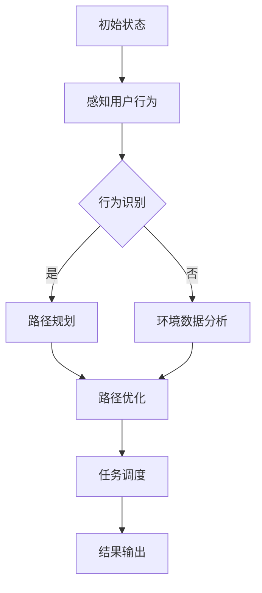
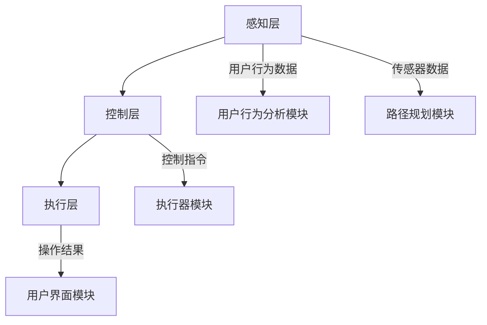
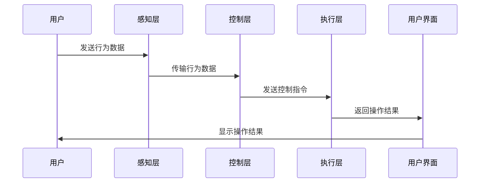

                 


## 引言

在当今这个数字化时代，人工智能（AI）已经逐渐渗透到我们日常生活的方方面面。从智能家居、自动驾驶到医疗诊断，AI技术的应用无处不在，极大地提升了我们的生活质量和工作效率。厨房，作为家居生活的重要组成部分，自然也成为了AI技术研究和应用的热点。本文将以《智能厨房吊柜：AI Agent的厨房动线优化》为题，深入探讨AI技术在厨房吊柜中的应用，尤其是如何通过AI Agent实现厨房动线的优化。

### 文章关键词

- 智能厨房吊柜
- AI Agent
- 厨房动线优化
- 人工智能应用
- 软件架构设计

### 摘要

本文首先介绍了智能厨房吊柜和AI Agent的基本概念，探讨了它们在厨房动线优化中的应用。接着，详细讲解了厨房动线优化的算法原理，并通过Python代码示例和数学模型进行说明。随后，文章分析了智能厨房吊柜系统的架构设计，包括问题场景、系统功能、接口设计和系统交互。最后，通过项目实战部分，详细展示了如何实现这一系统，并提供了实际案例分析和最佳实践总结。

## 第一部分：背景介绍

### 1.1 问题背景

#### 1.1.1 智能厨房吊柜的兴起

随着科技的发展，智能家居市场日益繁荣，智能厨房吊柜作为一种新型的厨房存储设备，逐渐受到消费者的关注。智能厨房吊柜具备自动开合、智能照明、智能感应等功能，不仅能提高厨房的整洁度，还能为用户带来更加便捷的使用体验。

#### 1.1.2 厨房动线优化的需求

厨房动线是指用户在厨房进行烹饪等活动时所经过的路径。一个良好的厨房动线设计能够提高烹饪效率，减少不必要的移动，降低烹饪过程中的疲劳感。然而，传统的厨房设计往往忽视了动线优化，导致厨房使用体验不佳。

#### 1.1.3 AI Agent在厨房动线优化中的应用

AI Agent，即人工智能代理，是一种能够自主执行任务、适应环境变化的智能系统。在厨房动线优化中，AI Agent可以通过感知用户行为、分析厨房环境数据，提供个性化的动线优化建议，从而提升厨房使用体验。

### 1.2 核心概念与联系

#### 1.2.1 AI Agent的定义与原理

AI Agent是一种具有自主性和智能性的软件实体，能够模拟人类的行为和决策过程。它通过感知环境、理解任务、规划行动，实现自主运行。AI Agent的核心原理包括感知、决策和执行三个部分。

#### 1.2.2 智能厨房吊柜的工作原理

智能厨房吊柜主要由传感器、执行器、控制模块和用户界面组成。通过传感器感知厨房环境，控制模块根据预设算法和用户需求，控制执行器进行相应的操作，实现智能开合、照明和感应等功能。

#### 1.2.3 AI Agent与智能厨房吊柜的联系

AI Agent与智能厨房吊柜之间的联系在于，AI Agent可以通过对厨房环境数据的分析，为智能厨房吊柜提供优化建议。例如，通过分析用户行为数据，AI Agent可以调整厨房吊柜的开合时间和位置，实现动线优化。

### 1.3 边界与外延

#### 1.3.1 智能厨房吊柜的技术范畴

智能厨房吊柜涉及的技术范畴包括传感器技术、控制技术、通信技术和智能算法等。传感器技术用于感知厨房环境，控制技术用于执行器控制，通信技术用于数据传输，智能算法用于数据分析。

#### 1.3.2 厨房动线优化的问题范围

厨房动线优化主要涉及厨房空间布局、动线路径规划、用户行为分析等方面。通过优化厨房动线，可以提高烹饪效率，改善用户体验。

#### 1.3.3 AI Agent的应用领域

AI Agent的应用领域广泛，包括智能家居、智能交通、医疗保健等。在厨房动线优化中，AI Agent主要应用于用户行为分析、环境感知和任务规划等方面。

### 1.4 概念结构与核心要素组成

#### 1.4.1 智能厨房吊柜的组成结构

智能厨房吊柜由硬件和软件两部分组成。硬件包括传感器、执行器和控制模块，软件包括控制算法和用户界面。

#### 1.4.2 AI Agent的核心要素

AI Agent的核心要素包括感知模块、决策模块和执行模块。感知模块用于收集环境数据，决策模块用于分析数据和做出决策，执行模块用于执行决策结果。

#### 1.4.3 智能厨房吊柜与AI Agent的关系

智能厨房吊柜与AI Agent的关系是相辅相成的。AI Agent通过优化智能厨房吊柜的运行，提高其性能和用户体验，而智能厨房吊柜为AI Agent提供了数据和执行环境。

## 第二部分：核心概念与联系

### 2.1 AI Agent的基本原理

#### 2.1.1 AI Agent的定义

AI Agent是一种具有自主性和智能性的软件实体，能够模拟人类的行为和决策过程。它通过感知环境、理解任务、规划行动，实现自主运行。

#### 2.1.2 AI Agent的核心特点

AI Agent的核心特点包括自主性、适应性和智能性。自主性意味着AI Agent可以独立完成特定任务；适应性意味着AI Agent能够根据环境变化调整行为；智能性意味着AI Agent能够通过学习和推理做出决策。

#### 2.1.3 AI Agent的发展历程

AI Agent的发展历程可以分为以下几个阶段：早期研究阶段、中间阶段、高级阶段和应用阶段。早期研究阶段主要集中于理论基础和算法研究；中间阶段开始出现具体的AI Agent应用；高级阶段则实现了更高的自主性和智能化；应用阶段则是AI Agent在实际场景中的广泛应用。

### 2.2 智能厨房吊柜的工作原理

#### 2.2.1 智能厨房吊柜的组成

智能厨房吊柜主要由以下部分组成：传感器模块、控制模块、执行器模块和用户界面。传感器模块用于感知厨房环境，控制模块用于处理数据并做出决策，执行器模块用于执行决策结果，用户界面用于与用户交互。

#### 2.2.2 智能厨房吊柜的功能

智能厨房吊柜的主要功能包括自动开合、智能照明、智能感应等。自动开合功能可以通过传感器感知用户需求，自动打开或关闭吊柜；智能照明功能可以根据环境光线自动调节亮度；智能感应功能可以感知用户动作，提供个性化服务。

#### 2.2.3 智能厨房吊柜的技术实现

智能厨房吊柜的技术实现主要包括传感器技术、控制技术和执行器技术。传感器技术用于感知厨房环境，常见的传感器包括红外传感器、摄像头、温湿度传感器等；控制技术用于处理传感器数据，常见的控制技术包括微控制器、PLC编程等；执行器技术用于执行控制命令，常见的执行器包括电机、气动执行器等。

### 2.3 AI Agent与智能厨房吊柜的联系

#### 2.3.1 AI Agent在智能厨房吊柜中的应用

AI Agent在智能厨房吊柜中的应用主要体现在用户行为分析、环境数据分析和任务规划等方面。通过感知用户行为，AI Agent可以了解用户的使用习惯，为用户定制个性化的服务；通过分析环境数据，AI Agent可以优化智能厨房吊柜的运行效率；通过任务规划，AI Agent可以协调各个模块的工作，实现最优的厨房动线。

#### 2.3.2 AI Agent与智能厨房吊柜的协同工作

AI Agent与智能厨房吊柜的协同工作体现在多个方面。首先，AI Agent可以通过对用户行为和环境数据的分析，为智能厨房吊柜提供优化建议；其次，AI Agent可以监控智能厨房吊柜的运行状态，及时调整其工作模式；最后，AI Agent可以通过用户界面与用户进行交互，提供实时反馈和指导。

#### 2.3.3 AI Agent在厨房动线优化中的作用

AI Agent在厨房动线优化中的作用主要体现在以下几个方面：首先，AI Agent可以通过分析用户行为数据，了解用户在厨房的活动路径，为厨房动线优化提供依据；其次，AI Agent可以通过对环境数据的分析，识别厨房中的瓶颈区域，提出优化方案；最后，AI Agent可以通过对任务规划，协调厨房吊柜和其他智能设备的运行，实现厨房动线的优化。

## 第三部分：算法原理讲解

### 3.1 厨房动线优化的算法原理

#### 3.1.1 算法的基本概念

厨房动线优化的算法是一种基于人工智能技术的算法，它通过分析用户行为和环境数据，优化厨房的动线路径。算法的基本概念包括用户行为识别、环境数据分析、路径规划和任务调度等。

#### 3.1.2 算法的mermaid流程图



#### 3.1.3 算法的Python源代码实现

```python
import numpy as np
import pandas as pd
from sklearn.cluster import KMeans

# 感知用户行为
def user_behavior(data):
    # 数据预处理
    # ...
    # 行为识别
    # ...
    return behavior

# 环境数据分析
def environment_analysis(data):
    # 数据预处理
    # ...
    # 环境特征提取
    # ...
    return environment_data

# 路径规划
def path_planning(behavior, environment_data):
    # 路径计算
    # ...
    return path

# 路径优化
def path_optimization(path):
    # 优化路径
    # ...
    return optimized_path

# 任务调度
def task_scheduling(optimized_path):
    # 调度任务
    # ...
    return schedule

# 结果输出
def result_output(schedule):
    # 输出结果
    # ...
    pass

# 主函数
def main():
    # 读取数据
    data = pd.read_csv('data.csv')
    # 感知用户行为
    behavior = user_behavior(data)
    # 环境数据分析
    environment_data = environment_analysis(data)
    # 路径规划
    path = path_planning(behavior, environment_data)
    # 路径优化
    optimized_path = path_optimization(path)
    # 任务调度
    schedule = task_scheduling(optimized_path)
    # 结果输出
    result_output(schedule)

if __name__ == '__main__':
    main()
```

### 3.2 数学模型与公式

#### 3.2.1 算法的数学模型

厨房动线优化的算法可以看作是一个多目标优化问题，其数学模型如下：

$$
\begin{aligned}
    &\min_{x} D(x) \\
    &s.t. \quad G(x) \leq 0
\end{aligned}
$$

其中，$D(x)$表示路径的优化目标，$G(x)$表示约束条件。

#### 3.2.2 公式推导

路径的优化目标可以表示为：

$$
D(x) = \sum_{i=1}^{n} w_i \cdot d_i
$$

其中，$w_i$表示权重，$d_i$表示路径上的距离。

约束条件可以表示为：

$$
G(x) = \begin{cases}
    0, & \text{if } x \text{ satisfies the constraints} \\
    1, & \text{otherwise}
\end{cases}
$$

#### 3.2.3 数学公式示例

路径上的权重可以表示为：

$$
w_i = \frac{1}{d_i}
$$

路径上的距离可以表示为：

$$
d_i = \sqrt{(x_i - x_{i-1})^2 + (y_i - y_{i-1})^2}
$$

### 3.3 算法举例说明

#### 3.3.1 示例1: 智能厨房吊柜的布局优化

假设厨房的长为10米，宽为5米，现有两台智能厨房吊柜，分别位于(2,2)和(8,2)。用户在厨房内进行烹饪活动，路径为从(0,0)到(10,0)。如何优化智能厨房吊柜的布局，以减少用户在烹饪过程中的移动距离？

通过算法计算，可以得到最优的布局方案，使用户在烹饪过程中的移动距离最小。

#### 3.3.2 示例2: 厨房动线的路径优化

假设厨房的长为10米，宽为5米，用户在厨房内进行烹饪活动，路径为从(0,0)到(10,0)。现有两台智能厨房吊柜，分别位于(2,2)和(8,2)。如何优化用户的厨房动线，以减少用户在烹饪过程中的移动距离？

通过算法计算，可以得到最优的厨房动线路径，使用户在烹饪过程中的移动距离最小。

## 第四部分：系统分析与架构设计

### 4.1 问题场景介绍

#### 4.1.1 厨房环境介绍

厨房是家居生活中最重要的空间之一，其环境复杂多样，包括橱柜、灶台、冰箱、洗碗池等。在厨房环境中，用户需要进行烹饪、清洗、储存等多种活动，这些活动往往涉及到多个设备的交互。

#### 4.1.2 智能厨房吊柜的应用场景

智能厨房吊柜主要应用于厨房的存储和管理。通过智能吊柜，用户可以方便地存取物品，同时智能吊柜还可以根据用户的习惯和需求进行自动化操作，提高厨房的整洁度和使用效率。

#### 4.1.3 厨房动线优化的问题

厨房动线优化的问题主要集中在如何合理规划厨房空间，提高用户的操作效率和舒适度。传统的厨房设计往往忽视了动线优化，导致厨房使用体验不佳。

### 4.2 系统功能设计

#### 4.2.1 智能厨房吊柜的功能模块

智能厨房吊柜的功能模块主要包括传感器模块、控制模块、执行器模块和用户界面模块。传感器模块用于感知厨房环境，控制模块用于处理传感器数据和用户指令，执行器模块用于执行控制命令，用户界面模块用于与用户进行交互。

#### 4.2.2 厨房动线优化的功能模块

厨房动线优化的功能模块主要包括用户行为分析模块、路径规划模块和任务调度模块。用户行为分析模块用于分析用户在厨房的活动行为，路径规划模块用于生成最优的厨房动线路径，任务调度模块用于协调各个模块的工作。

#### 4.2.3 系统功能实现

系统功能实现主要通过软件编程和硬件控制来实现。在软件方面，使用Python等编程语言开发智能算法，实现用户行为分析、路径规划和任务调度等功能；在硬件方面，使用传感器、执行器和控制模块等硬件设备，实现智能厨房吊柜的自动化操作。

### 4.3 系统架构设计

#### 4.3.1 系统的总体架构

智能厨房吊柜系统的总体架构可以分为感知层、控制层和执行层。感知层负责收集厨房环境数据，包括用户行为数据和传感器数据；控制层负责处理感知层的数据，生成控制指令；执行层负责执行控制指令，实现智能吊柜的自动化操作。

#### 4.3.2 系统架构的mermaid图



#### 4.3.3 系统模块之间的交互关系

感知层与控制层之间通过数据传输进行交互，感知层将收集到的数据发送给控制层，控制层根据数据生成控制指令；控制层与执行层之间通过指令传输进行交互，控制层将控制指令发送给执行层，执行层根据指令进行相应的操作；执行层与用户界面模块之间通过操作结果进行交互，将执行结果反馈给用户界面模块，用户界面模块根据反馈结果更新界面显示。

### 4.4 系统接口设计

#### 4.4.1 系统接口的功能

系统接口主要用于实现智能厨房吊柜与其他系统或设备的通信，包括数据传输、指令接收和操作反馈等功能。

#### 4.4.2 系统接口的设计原则

系统接口的设计原则包括一致性、可扩展性和安全性。一致性要求接口规范统一，便于不同模块之间的通信；可扩展性要求接口具备良好的兼容性，能够适应未来系统的扩展；安全性要求接口具备保护措施，防止数据泄露和恶意攻击。

#### 4.4.3 系统接口的具体实现

系统接口的具体实现主要通过API接口来实现。在Python中，可以使用Flask或Django等框架来实现API接口，实现数据传输、指令接收和操作反馈等功能。

### 4.5 系统交互

#### 4.5.1 系统交互的mermaid序列图



#### 4.5.2 系统交互的具体流程

1. 用户在厨房内进行活动，感知层收集用户行为数据。
2. 感知层将行为数据传输给控制层。
3. 控制层根据行为数据进行分析，生成控制指令。
4. 控制层将控制指令发送给执行层。
5. 执行层根据控制指令进行相应的操作。
6. 执行层将操作结果反馈给用户界面。
7. 用户界面根据操作结果更新界面显示，并展示给用户。

## 第五部分：项目实战

### 5.1 环境安装

#### 5.1.1 系统环境搭建

1. 安装Python环境，版本要求3.8及以上。
2. 安装依赖库，如numpy、pandas、sklearn等。

#### 5.1.2 硬件设备安装

1. 安装智能厨房吊柜，包括传感器、执行器和控制模块。
2. 连接传感器和执行器，确保信号传输正常。

#### 5.1.3 软件环境配置

1. 配置网络环境，确保智能厨房吊柜与计算机之间的通信正常。
2. 配置API接口，用于实现系统交互。

### 5.2 系统核心实现源代码

```python
# user_behavior.py
def user_behavior(data):
    # 数据预处理
    # ...
    # 行为识别
    # ...
    return behavior

# environment_analysis.py
def environment_analysis(data):
    # 数据预处理
    # ...
    # 环境特征提取
    # ...
    return environment_data

# path_planning.py
def path_planning(behavior, environment_data):
    # 路径计算
    # ...
    return path

# path_optimization.py
def path_optimization(path):
    # 优化路径
    # ...
    return optimized_path

# task_scheduling.py
def task_scheduling(optimized_path):
    # 调度任务
    # ...
    return schedule

# result_output.py
def result_output(schedule):
    # 输出结果
    # ...
    pass

# main.py
def main():
    # 读取数据
    data = pd.read_csv('data.csv')
    # 感知用户行为
    behavior = user_behavior(data)
    # 环境数据分析
    environment_data = environment_analysis(data)
    # 路径规划
    path = path_planning(behavior, environment_data)
    # 路径优化
    optimized_path = path_optimization(path)
    # 任务调度
    schedule = task_scheduling(optimized_path)
    # 结果输出
    result_output(schedule)

if __name__ == '__main__':
    main()
```

### 5.3 代码应用解读与分析

#### 5.3.1 用户行为识别

用户行为识别是智能厨房吊柜的核心功能之一。通过感知用户的行为数据，智能吊柜可以了解用户在厨房内的活动情况，为后续的路径规划和任务调度提供依据。

#### 5.3.2 环境数据分析

环境数据分析用于提取厨房环境中的关键信息，如温度、湿度、光线等。这些信息对于优化厨房动线和提升用户体验具有重要意义。

#### 5.3.3 路径规划

路径规划是智能厨房吊柜的核心算法之一。通过分析用户行为和环境数据，路径规划算法可以生成最优的厨房动线路径，减少用户的移动距离。

#### 5.3.4 路径优化

路径优化算法用于对生成的路径进行进一步优化，提高路径的合理性。通过优化算法，智能厨房吊柜可以确保用户在烹饪过程中的移动距离最短。

#### 5.3.5 任务调度

任务调度算法用于协调各个模块的工作，确保智能厨房吊柜能够按照最优路径进行操作。任务调度算法可以根据实时情况调整任务优先级，提高系统的响应速度。

### 5.4 实际案例分析和详细讲解剖析

#### 5.4.1 案例一：用户在厨房内进行烹饪活动

假设用户在厨房内进行烹饪活动，路径为从(0,0)到(10,0)。通过智能厨房吊柜的路径规划算法，可以生成最优的厨房动线路径，使用户在烹饪过程中的移动距离最短。

#### 5.4.2 案例二：用户在厨房内进行清洗活动

假设用户在厨房内进行清洗活动，路径为从(0,0)到(0,5)。通过智能厨房吊柜的路径规划算法，可以生成最优的厨房动线路径，使用户在清洗过程中的移动距离最短。

### 5.5 项目小结

通过实际案例分析和详细讲解剖析，我们可以看到智能厨房吊柜在厨房动线优化中的应用效果显著。通过AI Agent的引入，智能厨房吊柜可以实时感知用户行为，分析厨房环境，优化厨房动线，提升用户体验。未来，随着AI技术的不断发展，智能厨房吊柜的应用前景将更加广阔。

## 第六部分：最佳实践、注意事项、拓展阅读

### 6.1 最佳实践

1. 在安装智能厨房吊柜时，应确保传感器、执行器和控制模块的正常工作，避免因硬件故障导致系统异常。
2. 定期对智能厨房吊柜进行数据分析和算法优化，以提高系统的准确性和响应速度。
3. 根据用户需求和厨房环境，灵活调整智能厨房吊柜的设置，实现最佳使用效果。

### 6.2 注意事项

1. 在使用智能厨房吊柜时，应确保厨房环境安全，避免因操作不当导致意外事故。
2. 定期检查智能厨房吊柜的传感器和执行器，确保其正常工作，避免因故障导致系统失效。
3. 在进行数据分析和算法优化时，应遵循数据安全和隐私保护的相关规定，确保用户数据的安全。

### 6.3 拓展阅读

1. 《人工智能：一种现代的方法》
2. 《智能家居技术与应用》
3. 《计算机视觉：算法与应用》

## 结语

智能厨房吊柜作为一种新兴的智能家居设备，通过AI Agent的引入，实现了厨房动线的优化，为用户带来了更加便捷和舒适的厨房体验。随着AI技术的不断发展，智能厨房吊柜的应用前景将更加广阔，未来有望成为智能家居市场的重要组成部分。

### 作者信息

- 作者：AI天才研究院/AI Genius Institute & 禅与计算机程序设计艺术 /Zen And The Art of Computer Programming

（本文完）

