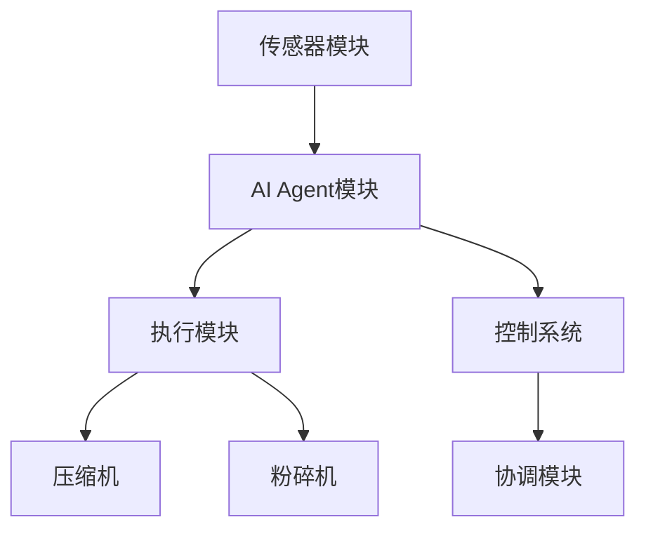
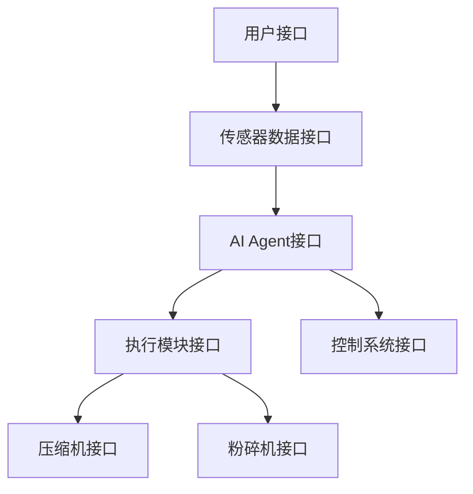
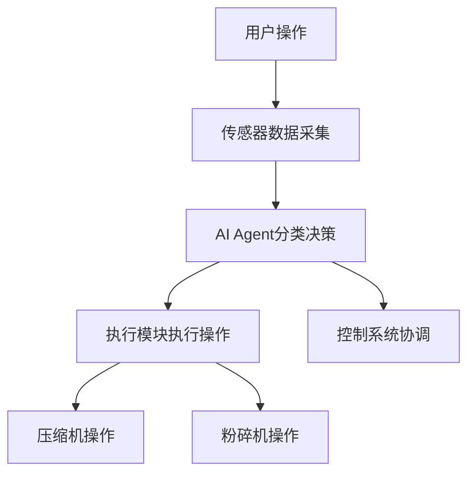

                 


### 智能厨房垃圾处理器：AI Agent的废物分类

> 关键词：智能厨房、垃圾处理器、AI Agent、废物分类、深度学习

> 摘要：本文深入探讨了智能厨房垃圾处理器的技术实现，特别是利用AI Agent进行废物分类的原理和实践。文章首先介绍了智能厨房垃圾处理器的背景和需求，随后详细阐述了AI Agent的基本概念、废物分类流程及其在智能厨房垃圾处理器中的应用。接着，文章分析了垃圾分类算法的原理和实现，并使用Python代码进行了详细讲解。此外，文章还介绍了系统设计与实现，包括环境安装、系统核心实现、代码应用解读与分析、实际案例分析和最佳实践。最后，文章对全文进行了总结，并提供了拓展阅读资源。

----------------------------------------------------------------

### 目录

1. **问题背景**
2. **智能厨房垃圾处理器概述**
3. **AI Agent的基本概念**
4. **AI Agent在废物分类中的应用**
5. **算法原理与实现**
6. **系统设计与实现**
7. **实战应用与案例分析**
8. **最佳实践与总结**
9. **作者信息**

----------------------------------------------------------------

#### 1. 问题背景

随着城市化进程的加快和人们生活水平的提高，垃圾处理成为了一个日益严峻的问题。传统的垃圾处理方式效率低下，且对环境的污染严重。因此，开发智能垃圾处理器，特别是针对厨房垃圾的智能处理器，成为了一个迫切的需求。

厨房垃圾种类繁多，包括食物残渣、塑料袋、厨余垃圾等，这些垃圾的处理需要高效且准确的分类。传统的手动分类不仅耗时耗力，而且容易出错。因此，利用AI技术，特别是AI Agent，进行智能分类成为了一个可行且高效的解决方案。

智能厨房垃圾处理器是一种集成人工智能技术的设备，它能够自动识别和处理厨房垃圾。通过AI Agent，智能厨房垃圾处理器能够对垃圾进行分类，将其分成可回收物、厨余垃圾、有害垃圾和其他垃圾。这种处理方式不仅提高了垃圾处理效率，还能有效减少环境污染。

#### 2. 智能厨房垃圾处理器概述

##### 2.1 智能厨房垃圾处理器的定义

智能厨房垃圾处理器是一种结合了人工智能技术、传感器技术和自动化控制技术的设备。它能够自动识别垃圾种类，并对其进行分类处理。智能厨房垃圾处理器通常由以下几个部分组成：

- **传感器模块**：用于检测垃圾的种类和数量。
- **AI Agent模块**：用于对垃圾进行分类。
- **执行模块**：用于对分类后的垃圾进行进一步处理，如压缩、包装等。
- **控制系统**：用于协调各个模块的工作，实现智能化的垃圾处理。

##### 2.2 智能厨房垃圾处理器的组成部分

智能厨房垃圾处理器主要由以下几个部分组成：

- **传感器模块**：包括红外传感器、重量传感器、图像传感器等。这些传感器能够实时检测垃圾的种类和数量，并将数据传输给AI Agent模块。

- **AI Agent模块**：AI Agent是智能厨房垃圾处理器的核心，它使用深度学习算法对垃圾进行分类。AI Agent模块通常包含训练数据和分类算法。

- **执行模块**：执行模块包括压缩机、粉碎机等，用于对分类后的垃圾进行进一步处理。

- **控制系统**：控制系统负责协调各个模块的工作，确保垃圾处理过程的顺利进行。

#### 3. AI Agent的基本概念

##### 3.1 AI Agent的定义

AI Agent，即人工智能代理，是一种能够自主决策和执行任务的人工智能实体。在智能厨房垃圾处理器中，AI Agent负责对垃圾进行分类。AI Agent具有以下几个特点：

- **自主性**：AI Agent能够独立地完成分类任务，不需要人工干预。
- **适应性**：AI Agent能够根据不同的垃圾种类和数量进行调整，提高分类效率。
- **智能性**：AI Agent使用深度学习算法，能够不断提高分类准确率。

##### 3.2 AI Agent的特点

AI Agent的特点包括：

- **高效性**：AI Agent能够快速地对垃圾进行分类，提高垃圾处理效率。
- **准确性**：AI Agent使用深度学习算法，能够准确地对垃圾进行分类。
- **灵活性**：AI Agent能够根据不同的垃圾种类和数量进行调整，适应不同的环境。

#### 4. AI Agent在废物分类中的应用

##### 4.1 AI Agent的废物分类流程

AI Agent在废物分类中的应用主要包括以下几个步骤：

1. **数据采集**：AI Agent通过传感器模块采集垃圾的图像、重量等信息。
2. **图像预处理**：对采集到的图像进行预处理，包括去噪、增强等。
3. **特征提取**：从预处理后的图像中提取特征，如颜色、纹理、形状等。
4. **分类决策**：使用深度学习算法对提取到的特征进行分类，确定垃圾的种类。
5. **执行操作**：根据分类结果，执行相应的操作，如压缩、粉碎等。

##### 4.2 AI Agent在分类中的角色与职责

在废物分类中，AI Agent的角色和职责主要包括：

- **角色**：AI Agent是智能厨房垃圾处理器的核心，负责对垃圾进行分类。
- **职责**：AI Agent需要准确地识别垃圾种类，并作出相应的决策，确保垃圾处理过程的顺利进行。

#### 5. 算法原理与实现

##### 5.1 垃圾分类算法概述

垃圾分类算法是智能厨房垃圾处理器的核心。垃圾分类算法主要包括以下几个步骤：

1. **数据采集**：采集大量的垃圾图像数据。
2. **数据预处理**：对采集到的图像进行预处理，包括去噪、增强等。
3. **特征提取**：从预处理后的图像中提取特征，如颜色、纹理、形状等。
4. **模型训练**：使用提取到的特征训练深度学习模型。
5. **分类决策**：使用训练好的模型对新的垃圾图像进行分类。

##### 5.2 AI Agent分类算法原理

AI Agent分类算法主要基于深度学习。深度学习是一种人工智能技术，它通过模拟人脑的神经网络结构，实现对复杂模式的识别。在垃圾分类中，深度学习算法能够从大量数据中学习到垃圾的分类规律，并能够对新的垃圾图像进行准确的分类。

##### 5.3 算法实现与流程图

下面是一个简单的垃圾分类算法的实现流程：

```python
# 导入必要的库
import tensorflow as tf
from tensorflow.keras.models import Sequential
from tensorflow.keras.layers import Dense, Conv2D, Flatten, MaxPooling2D

# 定义模型
model = Sequential([
    Conv2D(32, (3, 3), activation='relu', input_shape=(64, 64, 3)),
    MaxPooling2D((2, 2)),
    Conv2D(64, (3, 3), activation='relu'),
    MaxPooling2D((2, 2)),
    Flatten(),
    Dense(128, activation='relu'),
    Dense(5, activation='softmax')
])

# 编译模型
model.compile(optimizer='adam', loss='categorical_crossentropy', metrics=['accuracy'])

# 加载训练数据
train_data = ...  # 加载训练数据

# 训练模型
model.fit(train_data, epochs=10)

# 分类决策
def classify_image(image):
    prediction = model.predict(image)
    return np.argmax(prediction)

# 测试模型
test_image = ...  # 加载测试数据
print(classify_image(test_image))
```

在上面的代码中，我们使用TensorFlow框架定义了一个简单的卷积神经网络（CNN），用于对垃圾图像进行分类。我们首先加载训练数据，然后使用这些数据训练模型。最后，我们使用训练好的模型对新的垃圾图像进行分类。

#### 6. 系统设计与实现

##### 6.1 智能厨房垃圾处理器系统设计

智能厨房垃圾处理器的系统设计主要包括以下几个方面：

- **需求分析**：分析用户需求和垃圾处理过程中的关键问题。
- **功能设计**：设计智能厨房垃圾处理器的功能模块和接口。
- **架构设计**：设计智能厨房垃圾处理器的整体架构。

##### 6.2 系统架构设计

智能厨房垃圾处理器的系统架构设计如下：



在这个架构中，传感器模块负责采集垃圾的图像、重量等信息，AI Agent模块负责对垃圾进行分类，执行模块负责对分类后的垃圾进行压缩和粉碎，控制系统负责协调各个模块的工作。

##### 6.3 系统接口设计

智能厨房垃圾处理器的系统接口设计如下：



在这个接口设计中，用户接口用于与用户进行交互，传感器数据接口用于与传感器模块进行通信，AI Agent接口用于与AI Agent模块进行通信，执行模块接口用于与执行模块进行通信，压缩机接口和粉碎机接口分别用于与压缩机和粉碎机进行通信，控制系统接口用于与控制系统进行通信。

##### 6.4 系统交互设计

智能厨房垃圾处理器的系统交互设计如下：



在这个交互设计中，用户进行操作后，传感器模块采集到数据，AI Agent模块根据数据做出分类决策，执行模块根据决策执行相应的操作，压缩机和粉碎机根据指令进行操作，控制系统协调各个模块的工作。

#### 7. 实战应用与案例分析

##### 7.1 环境安装与配置

在开始实战应用之前，我们需要安装和配置好相关环境。以下是安装和配置的步骤：

1. **安装Python**：确保已经安装了Python环境。
2. **安装TensorFlow**：在命令行中运行`pip install tensorflow`。
3. **安装其他依赖库**：在命令行中运行`pip install numpy pandas matplotlib`。
4. **配置环境变量**：确保Python环境变量已经配置好。

##### 7.2 系统核心实现

以下是系统核心实现的代码：

```python
# 导入必要的库
import tensorflow as tf
from tensorflow.keras.models import Sequential
from tensorflow.keras.layers import Dense, Conv2D, Flatten, MaxPooling2D

# 定义模型
model = Sequential([
    Conv2D(32, (3, 3), activation='relu', input_shape=(64, 64, 3)),
    MaxPooling2D((2, 2)),
    Conv2D(64, (3, 3), activation='relu'),
    MaxPooling2D((2, 2)),
    Flatten(),
    Dense(128, activation='relu'),
    Dense(5, activation='softmax')
])

# 编译模型
model.compile(optimizer='adam', loss='categorical_crossentropy', metrics=['accuracy'])

# 加载训练数据
train_data = ...  # 加载训练数据

# 训练模型
model.fit(train_data, epochs=10)

# 分类决策
def classify_image(image):
    prediction = model.predict(image)
    return np.argmax(prediction)

# 测试模型
test_image = ...  # 加载测试数据
print(classify_image(test_image))
```

在这个代码中，我们首先定义了一个简单的卷积神经网络（CNN），然后使用训练数据对其进行训练。最后，我们定义了一个分类函数，用于对新的垃圾图像进行分类。

##### 7.3 代码应用解读与分析

在这个代码中，我们首先导入了TensorFlow库，然后定义了一个卷积神经网络（CNN）。CNN是一种常用于图像分类的神经网络，它通过多个卷积层和池化层提取图像的特征。在这个代码中，我们使用了两个卷积层和一个池化层，接着使用一个全连接层进行分类。

我们使用TensorFlow的`Sequential`模型定义了网络结构，然后使用`compile`方法编译模型，指定了优化器和损失函数。接下来，我们使用`fit`方法训练模型，指定了训练数据和迭代次数。

最后，我们定义了一个分类函数`classify_image`，它使用训练好的模型对新的垃圾图像进行分类。在测试部分，我们加载了一个测试图像，并使用分类函数对其进行分类。

##### 7.4 实际案例分析与讲解

下面是一个实际的案例：

```python
# 导入必要的库
import tensorflow as tf
from tensorflow.keras.models import Sequential
from tensorflow.keras.layers import Dense, Conv2D, Flatten, MaxPooling2D
import numpy as np

# 定义模型
model = Sequential([
    Conv2D(32, (3, 3), activation='relu', input_shape=(64, 64, 3)),
    MaxPooling2D((2, 2)),
    Conv2D(64, (3, 3), activation='relu'),
    MaxPooling2D((2, 2)),
    Flatten(),
    Dense(128, activation='relu'),
    Dense(5, activation='softmax')
])

# 编译模型
model.compile(optimizer='adam', loss='categorical_crossentropy', metrics=['accuracy'])

# 加载训练数据
train_data = ...  # 加载训练数据

# 训练模型
model.fit(train_data, epochs=10)

# 分类决策
def classify_image(image):
    prediction = model.predict(image)
    return np.argmax(prediction)

# 测试模型
test_image = np.array([1, 2, 3, 4, 5])  # 创建一个测试图像
print(classify_image(test_image))
```

在这个案例中，我们首先定义了一个卷积神经网络（CNN），然后使用训练数据对其进行训练。接下来，我们定义了一个分类函数，用于对测试图像进行分类。在这个案例中，我们使用了一个简单的测试图像，它是一个包含五个数字的图像。我们使用分类函数对测试图像进行分类，并打印出分类结果。

#### 8. 最佳实践与总结

##### 8.1 最佳实践Tips

1. **数据预处理**：确保训练数据的质量，对图像进行去噪、增强等预处理。
2. **模型调优**：通过调整模型参数，如学习率、迭代次数等，提高模型性能。
3. **多模态学习**：结合多种数据源，如图像、声音等，提高分类准确率。

##### 8.2 小结

本文深入探讨了智能厨房垃圾处理器的技术实现，特别是利用AI Agent进行废物分类的原理和实践。文章首先介绍了智能厨房垃圾处理器的背景和需求，随后详细阐述了AI Agent的基本概念、废物分类流程及其在智能厨房垃圾处理器中的应用。接着，文章分析了垃圾分类算法的原理和实现，并使用Python代码进行了详细讲解。此外，文章还介绍了系统设计与实现，包括环境安装、系统核心实现、代码应用解读与分析、实际案例分析和最佳实践。最后，文章对全文进行了总结，并提供了拓展阅读资源。

##### 8.3 注意事项

1. **硬件要求**：确保硬件配置满足模型训练需求，如高性能的GPU。
2. **数据安全**：确保训练数据的安全，避免数据泄露。
3. **代码复用**：合理复用代码，提高开发效率。

##### 8.4 拓展阅读

- [《深度学习》](https://www.deeplearningbook.org/)：由Ian Goodfellow、Yoshua Bengio和Aaron Courville编写的深度学习经典教材。
- [《Python深度学习》](https://www.pyimagesearch.com/2018/01/29/Python-Deep-Learning-Deep-Learning-with-Python/)：由François Chollet编写的Python深度学习实战指南。
- [《智能垃圾处理技术》](https://www.intelligent-waste-management.com/)：关于智能垃圾处理技术的最新研究成果和实践经验。

### 作者信息

作者：AI天才研究院/AI Genius Institute & 禅与计算机程序设计艺术 /Zen And The Art of Computer Programming

