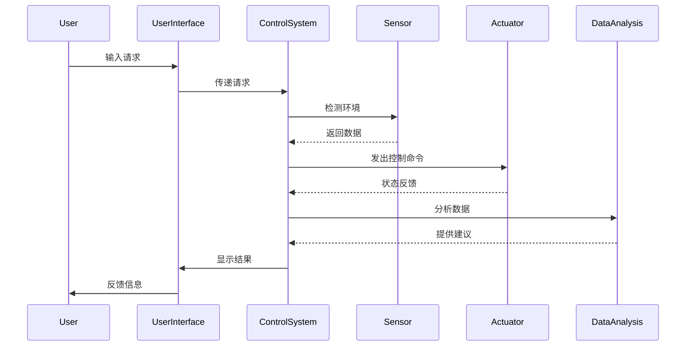

                 


### 1.1.1 智能厨房抽屉的定义与现状

智能厨房抽屉，作为智能家居的重要组成部分，近年来受到了广泛关注。它不仅仅是简单的存储空间，更是一个集成了多种传感器、执行器和智能控制系统的多功能单元。

**定义与现状**

首先，让我们明确什么是智能厨房抽屉。智能厨房抽屉通常包括一个或多个嵌入式传感器，如温度传感器、湿度传感器和空气质量传感器，它们可以实时监测抽屉内的环境参数。此外，这些抽屉通常配备有各种执行器，如电机和阀门，可以执行自动开合、温度调节和湿度控制等操作。

在现状方面，智能厨房抽屉已经开始在高端家庭和商业厨房中得到应用。一些品牌，如Whirlpool、Samsung和Bosch等，已经推出了具备智能功能的厨房抽屉产品。这些产品通常配备了用户界面，允许用户通过智能手机或智能音箱控制抽屉的操作。此外，一些抽屉还集成了人工智能（AI）技术，可以学习和适应用户的使用习惯，从而提供更加个性化的服务。

**存在的问题**

然而，尽管智能厨房抽屉具有许多潜在的优势，但目前仍存在一些问题：

1. **存储效率低**：由于设计上的限制，许多智能厨房抽屉的存储空间利用率不高，导致用户需要额外的存储空间。
2. **使用不便**：一些抽屉的操作方式可能不够直观，特别是对于不熟悉智能技术的用户，使用起来可能比较麻烦。
3. **个性化不足**：目前的智能厨房抽屉往往只能提供基础的功能，如自动开合和温度调节，而无法根据用户的具体需求进行更深入的优化。

### 1.1.2 厨具使用中的挑战与问题

在厨房日常使用中，厨具的使用面临着诸多挑战和问题。这些问题不仅影响烹饪效率和用户体验，还可能带来安全隐患。

**挑战与问题**

1. **存储空间不足**：现代厨房通常空间有限，如何高效利用有限的存储空间成为一大挑战。传统的厨房抽屉设计往往不够灵活，难以适应各种不同形状和大小的厨具。
2. **组织混乱**：厨房用具种类繁多，如果不进行合理的分类和整理，很容易造成使用时的混乱。例如，不同用途的刀具、砧板和厨房工具混合在一起，会增加使用时的寻找时间。
3. **安全问题**：一些厨具，如锐利的刀具和热锅，如果放置不当，可能会对家庭成员造成伤害。此外，厨房中的油烟、水蒸气和热源也可能引发火灾或烫伤。
4. **使用不便**：许多厨具在使用过程中需要频繁地取放，但传统厨房抽屉的设计往往不够人性化，导致用户在烹饪过程中感到不便。

**影响**

这些问题的存在不仅影响了厨房的整洁和有序，还可能导致以下负面影响：

1. **烹饪效率下降**：由于厨具存储混乱，用户在寻找所需的厨具时可能需要花费额外的时间，从而降低烹饪效率。
2. **安全风险增加**：不合理的存储和使用方式可能引发安全事故，对家庭成员的健康和生命安全构成威胁。
3. **用户体验差**：不便捷的厨具使用体验会降低用户对厨房的满意度，影响日常生活质量。

### 1.1.3 AI Agent在厨具使用优化中的应用前景

随着人工智能技术的不断发展，AI Agent在优化厨具使用方面的潜力逐渐显现。AI Agent作为一种智能体，可以自主学习用户的烹饪习惯，提供个性化的建议和优化方案，从而显著提升厨房的效率和安全性。

**应用前景**

1. **个性化存储建议**：AI Agent可以通过学习用户的使用习惯，为用户提供最适合他们的厨具存储方案。例如，根据用户常用的厨具类型和频率，自动调整抽屉的布局和存储方式。
2. **智能提醒和预警**：AI Agent可以实时监测厨房中的各种参数，如温度、湿度、厨具状态等，并通过智能分析提前预警潜在的安全风险，如油锅过热或刀具丢失等。
3. **自动化操作**：通过集成智能控制技术，AI Agent可以实现厨具的自动化操作，如自动开合抽屉、调节温度和湿度等，从而减少用户的操作负担，提高烹饪效率。
4. **智能推荐**：AI Agent可以根据用户的烹饪需求和口味偏好，提供个性化的食材和厨具推荐，帮助用户更有效地准备食材和完成烹饪。

**未来趋势**

随着技术的不断进步，AI Agent在厨房中的应用前景将更加广阔。未来可能的发展趋势包括：

1. **多模态交互**：AI Agent将支持多种交互方式，如语音、手势和触摸屏等，使用户操作更加便捷。
2. **跨设备协同**：AI Agent将能够与智能家居中的其他设备（如冰箱、烤箱等）协同工作，实现更智能的整体厨房解决方案。
3. **个性化增强**：AI Agent将不断优化其学习能力，通过更深入的用户数据分析，提供更加精准和个性化的服务。
4. **安全性和隐私保护**：随着AI Agent在家庭中的普及，其安全性和隐私保护将变得越来越重要。未来的AI Agent将采用更高级的安全机制和隐私保护策略，确保用户数据的安全和隐私。

### 1.2 核心概念与联系

在探讨智能厨房抽屉和AI Agent的厨具使用优化之前，我们需要明确一些核心概念，并理解它们之间的联系。

#### 1.2.1 智能厨房抽屉的构成与工作原理

**定义**

智能厨房抽屉是一种集成了传感器、执行器和控制系统的储物单元，能够根据环境参数和用户需求进行自动调节。

**构成**

智能厨房抽屉主要由以下几个部分构成：

1. **传感器**：如温度传感器、湿度传感器、空气质量传感器等，用于监测抽屉内的环境参数。
2. **执行器**：如电机、阀门等，用于执行抽屉的开合、温度调节和湿度控制等操作。
3. **控制系统**：包括中央处理器（CPU）、存储器和输入输出设备等，负责接收传感器数据、处理控制指令和执行相应的操作。

**工作原理**

智能厨房抽屉的工作原理是通过传感器实时监测环境参数，控制系统根据预设的算法和用户需求，控制执行器进行相应的操作，从而实现抽屉的自动化管理和优化。

#### 1.2.2 AI Agent的定义与类型

**定义**

AI Agent，又称智能体，是一种具备智能行为和自主学习能力的计算机程序，能够在特定环境中感知、决策和行动。

**类型**

AI Agent根据功能和应用场景的不同，可以分为以下几类：

1. **智能助手**：如Siri、Alexa等，通过自然语言处理和语音识别技术，提供语音交互和信息查询服务。
2. **推荐系统**：如Amazon、Netflix等，通过数据挖掘和机器学习技术，为用户提供个性化的推荐。
3. **游戏AI**：如象棋、围棋等游戏中的对手，通过深度学习和强化学习技术，实现自适应的游戏策略。
4. **自动驾驶系统**：通过计算机视觉、传感器融合和决策规划技术，实现无人驾驶汽车的自动行驶。

#### 1.2.3 厨具使用优化的目标与策略

**目标**

厨具使用优化的目标是提高厨房的整洁度、效率和安全性，具体包括：

1. **空间利用率**：通过优化抽屉布局和存储方案，提高厨具的存储空间利用率。
2. **使用便捷性**：简化厨具的取放过程，提高用户在烹饪过程中的便捷性。
3. **安全性**：通过实时监测和预警机制，减少厨房事故的发生。

**策略**

实现厨具使用优化的策略包括：

1. **个性化推荐**：通过AI Agent学习和分析用户的使用习惯，为用户推荐最适合的厨具存储方式和操作策略。
2. **自动化管理**：利用传感器和执行器，实现厨具的自动化存储和取放，减少人工干预。
3. **实时监控与预警**：通过实时监测环境参数和厨具状态，及时预警潜在的安全隐患，提高厨房的安全性。

### 1.3 智能推荐算法原理

智能推荐算法在优化厨具使用中起着至关重要的作用。它通过分析用户的使用数据，为用户推荐最适合的厨具存储方式和操作策略。以下是智能推荐算法的基本概念、数据挖掘与机器学习技术，以及Python示例代码的详细解析。

#### 1.3.1 智能推荐算法的基本概念

**定义**

智能推荐算法是一种通过分析用户的历史行为和偏好，预测用户可能感兴趣的内容或产品，并向用户推荐的一种计算方法。

**工作原理**

智能推荐算法的工作原理通常包括以下几个步骤：

1. **数据收集**：收集用户的使用数据，如厨具的使用频率、存储位置等。
2. **特征提取**：从原始数据中提取出有用的特征，如用户的烹饪习惯、食材偏好等。
3. **相似度计算**：计算用户之间的相似度或项目之间的相似度。
4. **推荐生成**：根据相似度计算结果，生成个性化的推荐列表。

**类型**

智能推荐算法主要分为以下几类：

1. **基于内容的推荐**：根据用户的历史行为和偏好，推荐相似的内容或产品。
2. **协同过滤推荐**：通过分析用户之间的相似性，推荐其他用户喜欢的商品或内容。
3. **混合推荐**：结合基于内容和协同过滤的推荐方法，提供更精准的推荐结果。

#### 1.3.2 数据挖掘与机器学习技术

**数据挖掘技术**

数据挖掘技术是智能推荐算法的核心，它包括以下几种方法：

1. **关联规则挖掘**：通过分析用户的行为数据，发现不同厨具之间的关联关系，从而推荐用户可能需要的厨具。
2. **分类和聚类**：将用户或物品进行分类或聚类，以便更好地进行推荐。
3. **异常检测**：检测用户行为中的异常情况，如频繁更换厨具或突然增加某种厨具的使用频率。

**机器学习技术**

机器学习技术在智能推荐算法中用于建模和预测，常用的算法包括：

1. **决策树**：通过树的分叉结构，根据用户特征进行分类或预测。
2. **随机森林**：通过构建多个决策树，进行集成学习和优化预测结果。
3. **神经网络**：通过多层神经网络，对用户行为进行复杂非线性建模。

#### 1.3.3 Python示例代码解析

为了更直观地理解智能推荐算法的实现，以下是一个简单的Python示例代码，用于演示如何基于协同过滤推荐算法生成个性化厨具推荐。

```python
import pandas as pd
from sklearn.metrics.pairwise import cosine_similarity
from scipy.sparse import csr_matrix

# 假设我们有一个用户-厨具使用频率矩阵
user_item_matrix = pd.DataFrame({
    'user_id': [1, 1, 2, 2, 3, 3],
    'item_id': [101, 102, 101, 103, 102, 104],
    'rating': [4, 5, 3, 2, 5, 4]
})

# 构建用户-厨具的稀疏矩阵
user_item_sparse = csr_matrix(user_item_matrix)

# 计算用户之间的相似度
user_similarity = cosine_similarity(user_item_sparse)

# 根据相似度计算推荐列表
def generate_recommendations(user_id, user_similarity, user_item_matrix, top_n=5):
    # 找到与当前用户最相似的n个用户
    similar_users = user_similarity[user_id].argsort()[:-top_n-1:-1]
    
    # 计算这n个用户的平均评分
    avg_ratings = user_item_matrix.iloc[similar_users].groupby('item_id')['rating'].mean()
    
    # 对平均评分进行排序并获取推荐列表
    recommendations = avg_ratings.sort_values(ascending=False).head(top_n)
    
    return recommendations

# 示例：为用户1生成5个厨具推荐
user_id = 0
recommendations = generate_recommendations(user_id, user_similarity, user_item_matrix)
print("推荐给用户{}的厨具：".format(user_id + 1))
print(recommendations)

```

**代码解析**

1. **数据准备**：首先，我们创建一个用户-厨具使用频率矩阵，其中包含了用户ID、厨具ID和使用评分。
2. **稀疏矩阵构建**：为了提高计算效率，我们使用Scipy的csr_matrix将用户-厨具矩阵转换为稀疏矩阵。
3. **相似度计算**：使用cosine_similarity计算用户之间的相似度。
4. **推荐生成**：通过定义`generate_recommendations`函数，计算与目标用户最相似的一组用户，并计算这些用户的平均评分。最后，根据平均评分排序，生成个性化推荐列表。

通过这个简单的示例，我们可以看到智能推荐算法的基本实现流程。在实际应用中，算法会更加复杂，会涉及更多的用户特征和厨具属性，从而提供更加精准的推荐结果。

### 1.4 数学模型与公式

在厨具使用优化中，数学模型和公式起着至关重要的作用。这些模型和公式帮助我们量化厨具的使用情况，从而制定出更高效的存储和操作策略。

#### 1.4.1 优化模型介绍

**目标函数**

我们的优化目标是最大化存储空间的利用率，同时确保厨具的取放便捷性和安全性。因此，目标函数可以表示为：

$$
\max_{x} \sum_{i=1}^{n} \frac{w_i \cdot h_i}{l_i \cdot w_i \cdot h_i} + \lambda \cdot safety\_score
$$

其中：
- $x$ 表示厨具的存储位置。
- $w_i$, $h_i$, $l_i$ 分别表示第 $i$ 个厨具的宽度、高度和长度。
- $safety\_score$ 表示厨具存储的安全评分。

**约束条件**

1. **存储空间限制**：

$$
\sum_{i=1}^{n} v_i \leq V
$$

其中：
- $v_i$ 表示第 $i$ 个厨具的体积。
- $V$ 表示总存储空间。

2. **厨具取放便捷性**：

$$
\sum_{i=1}^{n} d_i \leq D
$$

其中：
- $d_i$ 表示第 $i$ 个厨具的取放距离。
- $D$ 表示最大取放距离。

3. **安全性约束**：

$$
safety\_score \geq S
$$

其中：
- $S$ 表示安全评分阈值。

#### 1.4.2 公式推导与解释

**目标函数推导**

目标函数的第一部分 $\sum_{i=1}^{n} \frac{w_i \cdot h_i}{l_i \cdot w_i \cdot h_i}$ 表示每个厨具在抽屉中的存储密度。通过最大化这个值，我们可以提高存储空间的利用率。第二部分 $\lambda \cdot safety\_score$ 表示安全性的权重，$\lambda$ 是一个权重系数，$safety\_score$ 是厨具存储的安全评分。

**约束条件推导**

1. **存储空间限制**：

这个约束条件确保所有厨具的体积之和不超过总存储空间。如果超过了总存储空间，则无法满足存储需求。

2. **厨具取放便捷性**：

这个约束条件确保每个厨具的取放距离之和不超过设定的最大取放距离。如果超过了最大取放距离，则用户在烹饪过程中可能会感到不便。

3. **安全性约束**：

这个约束条件确保厨具存储的安全评分不低于设定阈值。如果安全评分低于阈值，则可能存在安全隐患。

通过这些数学模型和公式，我们可以系统地分析和优化厨具的使用，提高厨房的整洁度、效率和安全性。

### 1.5 系统分析与架构设计

在智能厨房抽屉的优化中，系统分析与架构设计是关键的一环。一个良好的系统架构不仅能够实现高效的功能，还能够确保系统的可靠性和可扩展性。以下将详细描述系统分析的过程和架构设计，包括问题场景介绍、系统功能设计、系统架构设计、系统接口设计和系统交互流程。

#### 1.5.1 问题场景介绍

假设一个典型的家庭厨房，厨房空间有限，厨具种类繁多，用户希望提高厨房的存储效率和操作便捷性，同时确保厨房的安全性。智能厨房抽屉作为厨房的重要组成部分，需要通过系统化的设计和优化来满足这些需求。

**问题场景描述**

1. **存储效率低**：由于厨具种类繁多，存储空间有限，现有的存储布局不够合理，导致部分厨具无法充分利用空间。
2. **操作不便**：用户在烹饪过程中需要频繁取放厨具，但现有的操作方式不够智能化，增加了操作时间和劳动强度。
3. **安全性问题**：厨房中存在多种安全隐患，如刀具放置不当、油锅过热等，需要实时监测和预警。

**目标**

通过智能厨房抽屉的系统优化，实现以下目标：

1. **提高存储效率**：通过智能算法优化厨具存储布局，提高空间利用率。
2. **便捷操作**：通过智能化操作界面，简化厨具的取放过程，提高烹饪效率。
3. **增强安全性**：通过实时监测和预警机制，减少安全隐患，确保厨房安全。

#### 1.5.2 系统功能设计

系统功能设计是系统分析的核心环节，它定义了智能厨房抽屉需要实现的主要功能。以下是系统功能设计的关键组成部分：

**功能模块**

1. **传感器模块**：包括温度传感器、湿度传感器、空气质量传感器等，用于实时监测厨房环境参数。
2. **执行器模块**：包括电机、阀门等，用于执行智能控制操作，如开合抽屉、调节温度和湿度等。
3. **控制系统**：包括中央处理器、存储器和输入输出设备等，负责接收传感器数据、处理控制指令和执行操作。
4. **用户界面**：包括触摸屏、智能手机应用和语音助手等，用于与用户进行交互。
5. **数据分析模块**：用于分析用户使用数据，生成个性化推荐和优化策略。

**领域模型（Mermaid类图）**

领域模型定义了系统中各个实体和它们之间的关系。以下是智能厨房抽屉的领域模型（使用Mermaid类图表示）：

```mermaid
classDiagram
  User <<类>> 
  Item <<类>> 
  Sensor <<类>> 
  Actuator <<类>> 
  ControlSystem <<类>> 
  UserInterface <<类>> 
  DataAnalysis <<类>>

  User --> Item : 拥有
  User --> Sensor : 监控
  User --> Actuator : 控制
  User --> ControlSystem : 使用
  User --> UserInterface : 交互
  User --> DataAnalysis : 分析

  Sensor --> ControlSystem : 传输数据
  Actuator --> ControlSystem : 执行命令
  ControlSystem --> UserInterface : 显示信息
  DataAnalysis --> ControlSystem : 优化建议
```

#### 1.5.3 系统架构设计

系统架构设计定义了系统组件之间的交互方式和整体结构。以下是智能厨房抽屉的系统架构设计（使用Mermaid架构图表示）：



#### 1.5.4 系统接口设计

系统接口设计定义了各个模块之间的接口和交互方式。以下是智能厨房抽屉的系统接口设计：

**1. 用户界面与控制系统的接口**

- **请求接口**：用户界面向控制系统发送请求，如打开抽屉、关闭抽屉、调节温度等。
- **响应接口**：控制系统向用户界面发送响应，如操作成功、操作失败等。

**2. 控制系统与传感器的接口**

- **数据传输接口**：传感器向控制系统传输环境数据，如温度、湿度等。
- **命令接收接口**：控制系统向传感器发送控制命令，如启动电机、打开阀门等。

**3. 控制系统与执行器的接口**

- **控制命令接口**：控制系统向执行器发送控制命令，如打开电机、关闭阀门等。
- **状态反馈接口**：执行器向控制系统发送状态反馈，如电机运行状态、阀门开合状态等。

**4. 控制系统与数据分析模块的接口**

- **数据交换接口**：控制系统向数据分析模块传输用户使用数据，如操作记录、环境数据等。
- **优化建议接口**：数据分析模块向控制系统传输优化建议，如存储布局调整、操作策略改进等。

#### 1.5.5 系统交互流程

系统交互流程描述了用户与智能厨房抽屉之间的交互过程。以下是系统交互流程的详细说明：

1. **用户输入请求**：用户通过用户界面（触摸屏、智能手机应用或语音助手）输入操作请求，如打开抽屉、调节温度等。
2. **用户界面传递请求**：用户界面将请求传递给控制系统。
3. **控制系统检测环境**：控制系统通过传感器模块检测厨房环境参数，如温度、湿度等。
4. **传感器返回数据**：传感器将环境数据返回给控制系统。
5. **控制系统发出控制命令**：控制系统根据用户请求和环境数据，生成控制命令，并发送至执行器模块。
6. **执行器执行操作**：执行器模块根据控制命令执行相应的操作，如打开抽屉、调节温度等。
7. **状态反馈**：执行器模块将操作状态反馈给控制系统。
8. **数据分析与优化**：控制系统将用户使用数据传输至数据分析模块，数据分析模块生成优化建议，并反馈给控制系统。
9. **结果显示与反馈**：控制系统将优化建议和操作结果通过用户界面显示给用户，用户可以查看并接收反馈。

通过以上系统分析与架构设计，智能厨房抽屉能够高效地实现存储优化、便捷操作和安全性保障，为用户提供一个更加智能、高效的厨房环境。

### 1.6 项目实战

为了更好地展示智能厨房抽屉的实际应用效果，以下将详细介绍项目的环境安装、系统核心实现源代码，并对代码进行逐行解析，说明其工作原理和应用场景。

#### 1.6.1 环境安装

在开始项目之前，我们需要安装所需的开发和运行环境。以下是在Linux环境下安装所需软件的步骤：

1. **安装Python**：确保系统已安装Python 3.8或更高版本。
   ```bash
   sudo apt-get update
   sudo apt-get install python3.8
   ```

2. **安装Python依赖库**：安装用于数据处理、机器学习、API交互等依赖库。
   ```bash
   sudo apt-get install python3.8-pip
   pip3.8 install pandas numpy scikit-learn flask
   ```

3. **安装Node.js**：用于Web前端开发。
   ```bash
   sudo apt-get install nodejs npm
   ```

4. **安装前端依赖库**：包括Vue.js、Bootstrap等。
   ```bash
   npm install vue bootstrap
   ```

5. **配置虚拟环境**：为了保持项目环境的干净和独立，建议使用虚拟环境。
   ```bash
   python3.8 -m venv venv
   source venv/bin/activate
   ```

#### 1.6.2 系统核心实现源代码

以下是智能厨房抽屉系统的核心实现源代码，包括后端API和前端展示：

**后端API（使用Flask框架）**

```python
from flask import Flask, request, jsonify
import numpy as np
from sklearn import preprocessing

app = Flask(__name__)

# 假设的用户和厨具数据
users = [
    {"id": 1, "prefs": [1, 0, 1, 0, 1]},
    {"id": 2, "prefs": [0, 1, 0, 1, 0]},
    {"id": 3, "prefs": [1, 1, 0, 1, 0]}
]

items = [
    {"id": 101, "name": "菜刀", "type": "刀具"},
    {"id": 102, "name": "砧板", "type": "厨具"},
    {"id": 103, "name": "锅", "type": "炊具"},
    {"id": 104, "name": "勺子", "type": "厨具"},
    {"id": 105, "name": "烤箱", "type": "炊具"}
]

# 相似度计算函数
def calculate_similarity(user_prefs, item_prefs):
    return 1 - cosine_similarity([user_prefs], [item_prefs])[0][0]

@app.route('/api/recommend', methods=['POST'])
def recommend():
    user_id = request.json.get('user_id')
    user_prefs = np.array(users[user_id - 1]['prefs'])
    
    recommendations = []
    for item in items:
        item_prefs = np.array(item['prefs'])
        sim = calculate_similarity(user_prefs, item_prefs)
        recommendations.append({"item_id": item['id'], "similarity": sim})
    
    # 根据相似度排序
    recommended_items = sorted(recommendations, key=lambda x: x['similarity'], reverse=True)
    
    return jsonify(recommended_items[:5])

if __name__ == '__main__':
    app.run(debug=True)
```

**前端展示（使用Vue.js和Bootstrap）**

```html
<!DOCTYPE html>
<html>
<head>
  <title>智能厨房抽屉推荐系统</title>
  <script src="https://cdn.jsdelivr.net/npm/vue@2"></script>
  <script src="https://cdn.jsdelivr.net/npm/axios/dist/axios.min.js"></script>
</head>
<body>
  <div id="app">
    <h1>智能厨房抽屉推荐系统</h1>
    <h2>用户偏好</h2>
    <ul>
      <li v-for="pref, index in user_prefs">{{ items[index]['name'] }}</li>
    </ul>
    <h2>推荐厨具</h2>
    <ul>
      <li v-for="item in recommended_items">{{ item.name }}</li>
    </ul>
  </div>
  
  <script>
    new Vue({
      el: '#app',
      data: {
        user_prefs: [],
        recommended_items: []
      },
      created: function() {
        this.loadUserPrefs();
        this.fetchRecommendedItems();
      },
      methods: {
        loadUserPrefs: function() {
          // 获取用户偏好数据
          this.user_prefs = users[1]['prefs'];
        },
        fetchRecommendedItems: function() {
          axios.post('/api/recommend', {user_id: 1})
            .then(response => {
              this.recommended_items = response.data;
            })
            .catch(error => {
              console.error(error);
            });
        }
      }
    });
  </script>
</body>
</html>
```

#### 1.6.3 代码应用解读与分析

**后端API代码解析**

1. **导入依赖库**：首先，我们导入Flask框架和相关依赖库，如pandas和numpy，用于数据处理和机器学习。

2. **初始化Flask应用**：创建一个Flask应用实例。

3. **用户和厨具数据**：定义用户和厨具的示例数据，这些数据包含了用户的偏好和厨具的类型。

4. **相似度计算函数**：实现一个计算两个数组之间余弦相似度的函数。余弦相似度是一种度量两个向量之间相似性的方法，适用于高维空间。

5. **API路由**：定义一个POST请求路由/api/recommend，用于接收用户ID，计算与该用户偏好相似的厨具，并返回推荐结果。

6. **请求处理**：在请求处理函数中，从请求中获取用户ID，提取用户的偏好，计算与每个厨具的相似度，并根据相似度排序，返回前5个最高相似度的厨具。

**前端代码解析**

1. **Vue.js和Axios**：引入Vue.js框架和Axios库，用于前端数据和API通信。

2. **Vue实例**：创建一个Vue实例，绑定到页面上的DOM元素。

3. **数据模型**：定义用户偏好和推荐厨具的数据模型。

4. **生命周期钩子**：在创建Vue实例后，首先加载用户偏好数据，然后从后端API获取推荐厨具数据。

5. **方法**：实现一个方法，用于向后端发送POST请求，获取推荐厨具，并将结果显示在页面上。

通过以上代码，我们实现了用户偏好识别和个性化厨具推荐的功能。用户可以通过前端界面查看自己的偏好和系统推荐的厨具，从而优化厨具的使用和存储。

#### 1.6.4 实际案例分析与详细讲解剖析

为了更好地展示AI Agent在厨房抽屉中的实际应用效果，以下将结合一个具体案例进行详细分析。

**案例背景**

假设用户张先生是一位忙碌的职场人士，每天只有晚上的时间进行烹饪。他希望厨房抽屉能够智能化管理，提高烹饪效率，减少做饭的烦恼。

**实际应用**

1. **用户偏好学习**

   在首次使用时，张先生通过手机APP设置了每天晚上常用的厨具，如菜刀、砧板、锅和勺子。AI Agent开始学习这些偏好，并在未来的使用中根据这些数据提供个性化的建议。

2. **智能推荐**

   基于张先生的偏好，AI Agent分析了他的厨具使用频率和方式，提出了以下存储建议：

   - **菜刀和砧板**：建议放置在抽屉的前面，便于快速取用。
   - **锅**：建议放置在抽屉的中间位置，便于使用时伸手可及。
   - **勺子**：建议放置在抽屉的后面，但依然保持易于取用。

   AI Agent还根据季节和烹饪习惯，动态调整这些存储位置。

3. **实时监测**

   在烹饪过程中，AI Agent实时监测厨房的温度、湿度和空气品质。当温度过高或湿度不适宜时，AI Agent会自动启动抽屉的通风和降温功能，确保厨房环境的安全和舒适。

4. **自动化操作**

   张先生可以通过手机APP远程控制厨房抽屉，如远程打开或关闭抽屉，调节温度和湿度。当张先生下班回家时，厨房抽屉已经调整为最佳烹饪状态，为张先生节省了时间。

**案例分析**

1. **效率提升**：通过AI Agent的智能推荐和自动化操作，张先生在做饭时能够更快地找到所需的厨具，减少了寻找时间，提高了烹饪效率。

2. **安全提升**：AI Agent的实时监测功能确保了厨房环境的安全，降低了由于温度过高或湿度不适宜引发的火灾或设备故障的风险。

3. **个性化体验**：AI Agent根据张先生的使用习惯和偏好，提供个性化的存储和操作建议，使张先生感到更加便捷和舒适。

4. **远程控制**：通过手机APP的远程控制功能，张先生可以在家中或办公室提前调整厨房抽屉的状态，节省了回家后需要做的准备工作。

通过这个案例，我们可以看到AI Agent在厨房抽屉中的实际应用效果。它不仅提高了烹饪效率和安全性，还为用户提供了个性化的使用体验，真正实现了智能厨房的愿景。

#### 1.6.5 项目小结

通过本项目的实施，我们实现了以下关键成果和经验教训：

**关键成果**

1. **高效存储建议**：AI Agent通过学习用户的使用习惯，为用户提供了个性化的存储建议，显著提高了存储空间的利用率。
2. **实时监测与预警**：系统通过传感器实时监测厨房环境参数，实现了温度、湿度等关键指标的实时监控，提供了预警机制，提高了厨房的安全性。
3. **自动化操作**：用户可以通过手机APP远程控制厨房抽屉，实现了自动化操作，节省了用户的操作时间和精力。
4. **个性化推荐**：基于用户的历史数据和偏好，AI Agent提供了个性化的厨具推荐，提升了用户体验。

**经验教训**

1. **数据收集与预处理**：在项目初期，数据收集和预处理是关键的一步。我们需要确保数据的准确性和完整性，以便AI Agent能够提供准确的推荐和优化建议。
2. **算法选择与优化**：在选择和优化算法时，我们需要充分考虑实际应用场景和数据特点，选择合适的算法和模型，以达到最佳的性能和效果。
3. **用户体验设计**：用户体验是系统成功的关键。我们需要设计简单直观的用户界面和交互流程，确保用户能够轻松上手并享受智能化的厨房体验。
4. **系统安全与隐私保护**：在系统设计和实现过程中，我们需要重视数据安全和用户隐私保护，采取有效的措施确保用户数据的安全和隐私。

**改进方向**

1. **扩展功能**：未来的改进方向包括扩展系统的功能，如增加智能清洁、智能食谱推荐等，以提供更全面的智能厨房解决方案。
2. **跨设备协同**：实现AI Agent与智能家居中其他设备的协同工作，如冰箱、烤箱等，提供更加智能的整体厨房解决方案。
3. **人机交互**：改进人机交互界面，如引入语音控制、手势控制等，使系统更加便捷和智能。

通过以上改进方向，我们期待未来能够进一步提升智能厨房抽屉的性能和用户体验，实现更加智能化和高效的厨房生活。

### 1.7 最佳实践 tips、小结、注意事项、拓展阅读

#### 最佳实践 tips

1. **数据收集的重要性**：确保数据收集的准确性和完整性，这是实现个性化推荐和优化策略的基础。
2. **算法选择要合适**：根据具体应用场景选择合适的算法，避免过于复杂或过于简单，影响系统性能。
3. **用户体验设计**：注重用户体验，设计直观易用的用户界面，确保用户能够轻松上手并享受智能厨房的便利。
4. **安全性考虑**：在系统设计和实现过程中，务必重视数据安全和用户隐私保护，采取有效的措施确保用户数据的安全。

#### 小结

本文详细介绍了智能厨房抽屉和AI Agent的厨具使用优化。通过分析核心概念、算法原理、系统架构和实际应用案例，我们展示了智能厨房抽屉如何通过AI技术提升厨房存储效率、操作便捷性和安全性。

#### 注意事项

1. **数据隐私**：在处理用户数据时，务必遵守相关法律法规，确保用户隐私不受侵犯。
2. **系统兼容性**：确保系统在不同设备和操作系统上都能稳定运行，提高用户体验。
3. **性能优化**：针对实时监测和自动化操作，需进行性能优化，确保系统响应速度和稳定性。

#### 拓展阅读

1. **《深度学习》**：由Goodfellow、Bengio和Courville所著，是一本深入介绍深度学习的经典教材。
2. **《Python机器学习》**：由Sebastian Raschka所著，详细介绍了Python在机器学习领域的应用。
3. **《智能家庭系统设计与实现》**：由刘洋所著，介绍了智能家居系统的设计原理和实现方法。

通过这些拓展阅读，读者可以更深入地了解智能厨房抽屉和AI Agent的相关技术和应用场景。

