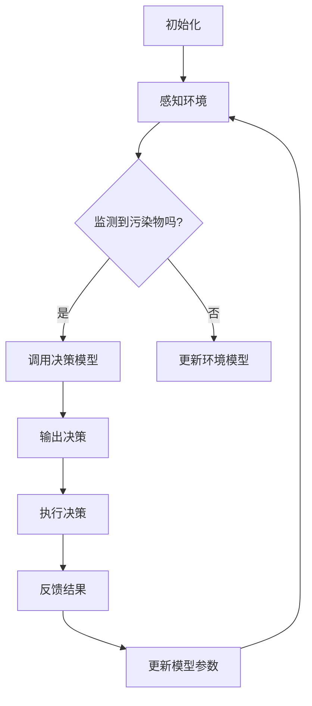
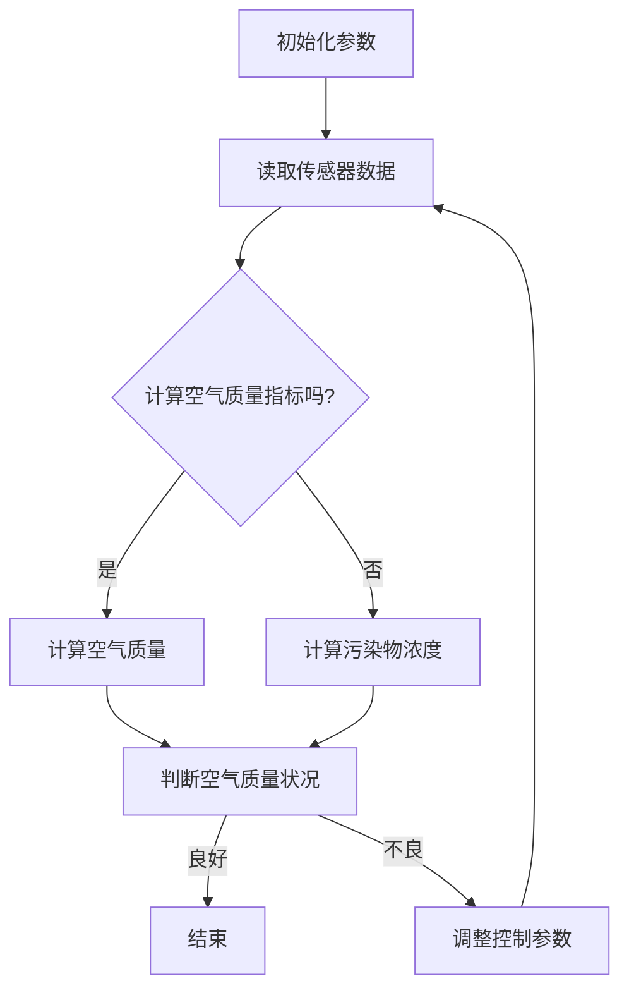
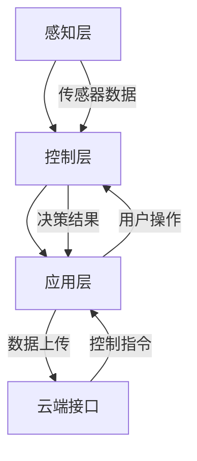
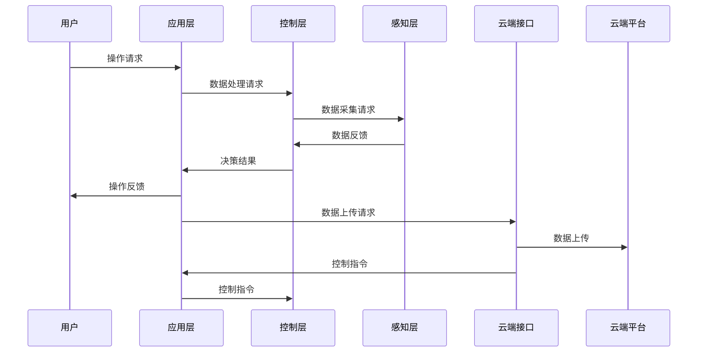

                 

# 《智能厨房抽油烟机：AI Agent的空气质量控制》

## 关键词：智能厨房抽油烟机、AI Agent、空气质量控制、传感器、数据处理、学习算法、决策模型

## 摘要：

本文深入探讨了智能厨房抽油烟机在空气质量控制中的应用，通过引入AI Agent技术，实现更加智能、精准的空气质量监测与控制。文章首先介绍了厨房空气质量问题及其解决需求，然后详细阐述了智能厨房抽油烟机的基本构成和工作原理，特别是AI Agent的核心功能和技术发展。接着，文章从数据采集与处理、学习算法与决策模型、空气质量控制数学模型等多个角度进行了深入剖析，并通过实际案例展示了智能厨房抽油烟机的应用效果。最后，文章总结了智能厨房抽油烟机的关键技术，探讨了其市场前景和发展趋势，为相关领域的研究和实际应用提供了有益的参考。

### 第一部分：背景介绍与核心概念

#### 第1章：厨房空气质量问题与智能解决方案

#### 1.1 厨房空气质量问题的来源

厨房是家庭烹饪的重要场所，然而，燃气烹饪过程中产生的污染物是厨房空气质量的主要威胁。燃气燃烧会产生二氧化碳、一氧化碳、氮氧化物和颗粒物等有害物质，这些污染物对室内空气质量有显著影响。特别是在通风不良的厨房环境中，污染物难以迅速排出，导致空气质量恶化，对人体健康产生危害。

此外，厨房通风不良也是导致空气质量问题的重要原因。厨房通风系统设计不当或使用频率低，会导致室内空气无法及时更新，使得污染物在室内积聚，进一步加剧空气质量问题。

#### 1.1.1 燃气烹饪产生的污染物

燃气烹饪是厨房中常见的烹饪方式，然而，燃气燃烧过程中会产生多种污染物。例如，燃烧不完全会产生一氧化碳，这是一种无色无味的气体，对人体有毒。此外，燃气燃烧还会产生氮氧化物和颗粒物，这些污染物对呼吸系统有害，特别是对儿童、老年人和患有呼吸系统疾病的人群危害更大。

#### 1.1.2 厨房通风不良的影响

厨房通风不良会导致室内空气污染物无法及时排出，从而在室内积聚。这种情况下，厨房内的空气质量会迅速恶化，甚至可能达到对人体有害的程度。长期处于通风不良的环境中，人体容易出现头痛、乏力、失眠等不适症状。

#### 1.1.3 厨房空气质量标准的现状

目前，许多国家和地区已经制定了厨房空气质量标准，以保障居民的健康。例如，我国的《室内空气质量标准》中，对厨房的空气质量有明确的要求，规定了厨房中一氧化碳、氮氧化物和颗粒物的限值。然而，由于厨房环境复杂，实际执行过程中仍存在一定难度。

#### 1.2 智能厨房抽油烟机的必要性

传统抽油烟机在厨房空气污染控制方面存在一定局限性，主要体现在以下几个方面：

1. **反应速度慢**：传统抽油烟机一般采用机械式的风叶旋转，对污染物的捕捉和排出速度较慢，特别是在高峰期，效果更加不明显。
2. **智能化程度低**：传统抽油烟机缺乏智能监测和自适应控制功能，无法根据烹饪过程中的污染物变化实时调整工作状态。
3. **噪音大**：传统抽油烟机工作时噪音较大，影响厨房的舒适度。

因此，智能厨房抽油烟机的出现，为解决厨房空气质量问题提供了新的思路。智能厨房抽油烟机通过引入AI Agent技术，能够实现更加智能、精准的空气质量控制，具有以下优势：

1. **快速反应**：智能厨房抽油烟机通过传感器实时监测厨房空气质量，能够在污染物产生时迅速启动，有效捕捉并排出污染物。
2. **智能控制**：智能厨房抽油烟机能够根据烹饪过程中污染物的变化，自动调整工作状态，实现个性化空气质量控制。
3. **低噪音**：智能厨房抽油烟机采用更加先进的静音技术，工作过程中噪音较低，提高厨房的舒适度。

#### 1.2.1 传统抽油烟机的局限性

传统抽油烟机在厨房空气污染控制方面存在一定局限性，主要体现在以下几个方面：

1. **反应速度慢**：传统抽油烟机一般采用机械式的风叶旋转，对污染物的捕捉和排出速度较慢，特别是在高峰期，效果更加不明显。
2. **智能化程度低**：传统抽油烟机缺乏智能监测和自适应控制功能，无法根据烹饪过程中的污染物变化实时调整工作状态。
3. **噪音大**：传统抽油烟机工作时噪音较大，影响厨房的舒适度。

#### 1.2.2 智能厨房抽油烟机的优势

智能厨房抽油烟机通过引入AI Agent技术，能够实现更加智能、精准的空气质量控制，具有以下优势：

1. **快速反应**：智能厨房抽油烟机通过传感器实时监测厨房空气质量，能够在污染物产生时迅速启动，有效捕捉并排出污染物。
2. **智能控制**：智能厨房抽油烟机能够根据烹饪过程中污染物的变化，自动调整工作状态，实现个性化空气质量控制。
3. **低噪音**：智能厨房抽油烟机采用更加先进的静音技术，工作过程中噪音较低，提高厨房的舒适度。

#### 1.2.3 智能厨房抽油烟机的市场前景

随着人们对生活品质要求的提高，以及健康意识的增强，智能厨房抽油烟机的市场需求逐年增长。尤其是在一线城市，越来越多的家庭开始重视厨房空气质量问题，愿意为提高生活质量投入更多。此外，智能家居市场的快速发展也为智能厨房抽油烟机提供了广阔的市场空间。

#### 1.3 AI Agent在空气质量控制中的应用

AI Agent是一种基于人工智能技术，能够自主执行任务、与环境交互的智能体。在空气质量控制领域，AI Agent具有广泛的应用前景，能够为智能厨房抽油烟机提供强大的技术支持。

1. **实时监测**：AI Agent能够通过传感器实时监测厨房空气质量，快速捕捉污染物的变化，为智能决策提供数据支持。
2. **智能决策**：AI Agent能够根据监测数据，结合预设的空气质量模型，自动调整抽油烟机的工作状态，实现个性化的空气质量控制。
3. **自适应能力**：AI Agent具有自适应能力，能够根据不同的烹饪场景和污染物特性，不断优化空气质量控制策略。

#### 1.3.1 AI Agent的定义与功能

AI Agent是一种基于人工智能技术的智能体，它具备以下基本功能：

1. **感知**：通过传感器感知环境变化，获取空气质量数据。
2. **推理**：利用预先设定的空气质量模型，对感知数据进行推理和分析，判断空气质量状况。
3. **行动**：根据推理结果，自动调整抽油烟机的工作状态，实现对空气质量的控制。
4. **学习**：在控制过程中，AI Agent能够不断学习，优化空气质量控制策略，提高控制效果。

#### 1.3.2 AI Agent在厨房抽油烟机中的角色

在厨房抽油烟机中，AI Agent主要扮演以下角色：

1. **空气质量监测**：AI Agent通过传感器实时监测厨房空气质量，包括温度、湿度、CO2浓度、PM2.5浓度等指标。
2. **智能决策**：根据监测数据，AI Agent结合预设的空气质量模型，自动调整抽油烟机的工作状态，如风量调节、开关控制等。
3. **自适应调整**：AI Agent能够根据不同的烹饪场景和污染物特性，动态调整空气质量控制策略，提高控制效果。

#### 1.3.3 AI Agent技术发展的趋势

随着人工智能技术的不断进步，AI Agent在空气质量控制领域将呈现出以下发展趋势：

1. **智能化程度提高**：未来，AI Agent将具备更高的智能化水平，能够实现更加精细的空气质量控制，满足个性化需求。
2. **多功能集成**：AI Agent将整合多种功能，如温度控制、湿度调节、照明等，实现厨房环境的全方位智能管理。
3. **云端协同**：AI Agent将借助云端技术，实现大数据分析和智能协同，提高空气质量控制效果和可靠性。

#### 1.4 本书结构安排

本书共分为三大部分，具体内容安排如下：

1. **第一部分：背景介绍与核心概念**，主要介绍厨房空气质量问题、智能厨房抽油烟机的必要性以及AI Agent在空气质量控制中的应用。
2. **第二部分：算法原理讲解**，详细阐述传感器数据采集与处理、AI Agent的学习与决策、空气质量控制数学模型等核心算法原理。
3. **第三部分：系统设计与实现**，介绍智能厨房抽油烟机的系统架构设计、核心实现源代码、实际应用案例以及最佳实践。

#### 1.4.1 各章节内容概述

1. **第1章**：介绍厨房空气质量问题与智能解决方案，包括污染物来源、传统抽油烟机局限性、智能厨房抽油烟机优势和市场前景等。
2. **第2章**：阐述AI Agent在空气质量控制中的应用，包括定义、功能、角色以及技术发展趋势。
3. **第3章**：讲解传感器数据采集与处理，包括传感器工作原理、数据采集系统设计、数据处理算法等。
4. **第4章**：介绍AI Agent的学习与决策，包括学习算法原理、决策模型设计、AI Agent适应性等。
5. **第5章**：探讨空气质量控制数学模型，包括模型概述、数学公式讲解、算法原理举例等。
6. **第6章**：介绍智能厨房抽油烟机的系统设计与实现，包括系统功能设计、架构设计、接口设计等。
7. **第7章**：分析实际应用案例，展示智能厨房抽油烟机的应用效果，并进行详细讲解。
8. **第8章**：总结智能厨房抽油烟机的关键技术，探讨市场前景和发展趋势。

#### 1.4.2 阅读建议与目标读者

本书旨在为读者提供关于智能厨房抽油烟机在空气质量控制领域的全面解读，适合以下读者群体：

1. **人工智能领域研究人员**：对AI Agent技术有兴趣，希望了解其在实际应用中的实现方法和效果。
2. **智能家居产品设计师**：关注智能家居市场，希望了解智能厨房抽油烟机的设计原理和关键技术。
3. **厨房设备制造商**：从事厨房设备研发和生产，希望借鉴智能厨房抽油烟机的成功经验。
4. **家庭用户**：对厨房空气质量控制有需求，希望了解智能厨房抽油烟机的功能和优势。

本书结构清晰，内容丰富，适合读者循序渐进地学习。通过阅读本书，读者将能够深入了解智能厨房抽油烟机的工作原理和应用方法，为相关领域的研究和实践提供有益参考。

#### 1.4.3 技术应用案例分析

为了更好地展示智能厨房抽油烟机在空气质量控制中的应用效果，本书将结合实际案例进行分析。

**案例1**：某家庭用户使用智能厨房抽油烟机后，发现厨房空气质量显著改善。通过AI Agent的实时监测和智能控制，厨房中的污染物浓度得到了有效控制，用户不再受到烹饪时空气污染的困扰。

**案例2**：某餐饮企业引入智能厨房抽油烟机，提高了厨房的空气质量，降低了员工患病率，同时提升了餐饮服务的品质和顾客满意度。

**案例3**：某城市在公共厨房区域安装智能厨房抽油烟机，有效改善了空气质量，减少了环境污染，为居民提供了一个更加健康的生活环境。

这些案例表明，智能厨房抽油烟机在空气质量控制方面具有显著的应用效果，为改善室内空气质量和提高生活品质提供了有力支持。

### 第2章：核心概念与联系

#### 2.1 智能厨房抽油烟机的基本构成

智能厨房抽油烟机由多个关键组件构成，每个组件在空气质量控制中扮演着重要角色。以下是智能厨房抽油烟机的基本构成及其功能：

1. **传感器**：传感器是智能厨房抽油烟机的感知器官，负责实时监测厨房空气质量。常见的传感器包括温度传感器、湿度传感器、CO2传感器和PM2.5传感器等。通过这些传感器，AI Agent能够获取厨房空气中的各种污染物数据，为后续的决策和控制提供依据。

2. **执行器**：执行器是智能厨房抽油烟机的执行器官，负责根据AI Agent的决策结果执行具体的操作。常见的执行器包括风叶驱动电机、开关控制模块、照明控制模块等。通过执行器，智能厨房抽油烟机能够实现风量的调节、开关控制以及照明等功能。

3. **控制系统**：控制系统是智能厨房抽油烟机的智能大脑，负责接收传感器的数据，进行数据处理和决策，然后驱动执行器执行相应的操作。控制系统通常包括一个中央处理器（CPU）、内存、存储设备等。在智能厨房抽油烟机中，AI Agent通常运行在控制系统中，负责实现空气质量监测、控制策略优化等功能。

4. **通信模块**：通信模块负责智能厨房抽油烟机与其他设备或云端平台的通信。通过通信模块，智能厨房抽油烟机能够接收来自云端平台的控制指令，同时将空气质量数据上传至云端进行分析和存储。常见的通信方式包括Wi-Fi、蓝牙、Zigbee等。

#### 2.2 AI Agent的核心原理

AI Agent是一种基于人工智能技术的智能体，具备自主感知、推理和行动的能力。在智能厨房抽油烟机中，AI Agent的核心原理主要体现在以下几个方面：

1. **感知**：AI Agent通过传感器获取厨房空气中的污染物数据，如温度、湿度、CO2浓度、PM2.5浓度等。这些数据为AI Agent提供了对厨房空气质量状况的实时感知。

2. **推理**：AI Agent利用预先训练好的空气质量模型，对传感器数据进行推理和分析，判断当前厨房空气质量状况。通过推理，AI Agent能够识别污染物的浓度变化趋势，为后续的控制策略提供依据。

3. **行动**：根据推理结果，AI Agent驱动执行器执行相应的操作，如调节风量、开关控制等。通过行动，AI Agent实现对厨房空气质量的实时控制，使厨房空气质量保持在预设的范围内。

4. **学习**：AI Agent具备自我学习的能力，能够在实际应用过程中不断优化空气质量控制策略。通过学习，AI Agent能够适应不同的烹饪场景和污染物特性，提高空气质量控制的准确性和效率。

#### 2.3 智能空气质量控制的关键技术

智能空气质量控制的关键技术包括数据采集与分析、模型训练与优化、实时监测与控制以及智能反馈与迭代。以下是这些关键技术的基本概念和作用：

1. **数据采集与分析**：数据采集与分析是智能空气质量控制的基础。通过传感器实时采集厨房空气质量数据，并进行预处理、过滤和融合，确保数据的质量和完整性。然后，利用数据挖掘和分析技术，提取有用的信息，为后续的模型训练和控制策略提供支持。

2. **模型训练与优化**：模型训练与优化是智能空气质量控制的核心。通过收集大量的空气质量数据，利用机器学习算法，如监督学习、无监督学习和强化学习，训练空气质量模型。训练好的模型能够预测污染物浓度的变化趋势，为AI Agent提供可靠的决策依据。此外，通过在线学习和模型优化，AI Agent能够不断适应新的环境变化，提高空气质量控制的准确性和适应性。

3. **实时监测与控制**：实时监测与控制是智能空气质量控制的关键。AI Agent通过传感器实时监测厨房空气质量，利用训练好的空气质量模型进行推理和决策，然后驱动执行器执行相应的操作，如调节风量、开关控制等。通过实时监测与控制，AI Agent能够实现对厨房空气质量的动态调整，使厨房空气质量始终保持在一个良好的水平。

4. **智能反馈与迭代**：智能反馈与迭代是智能空气质量控制的重要环节。通过将空气质量数据上传至云端，利用大数据分析和机器学习算法，对AI Agent进行反馈和优化。通过智能反馈与迭代，AI Agent能够不断改进空气质量控制策略，提高空气质量控制的效率和效果。

#### 2.4 关键概念对比表格

为了更好地理解智能厨房抽油烟机与传统抽油烟机在关键概念上的差异，以下是两者的对比表格：

| 对比项        | 智能厨房抽油烟机         | 传统抽油烟机             |
| ----------- | --------------------- | --------------------- |
| 数据采集     | 实时监测空气质量，采集传感器数据 | 定期手动清理油网，无传感器数据 |
| 数据处理     | 自动预处理、过滤和融合传感器数据 | 需要人工清理油网，无数据处理   |
| 智能决策     | 利用AI Agent进行智能推理和决策 | 仅根据预设程序执行机械操作   |
| 执行器控制   | 自动调节风量、开关控制等      | 手动调节风量和开关控制      |
| 自适应能力   | 根据不同场景和污染物特性自适应调整 | 固定的工作模式，无法自适应调整 |
| 通信能力     | 具备与其他设备和云端平台的通信能力 | 无通信能力，无法进行远程控制  |

通过对比可以看出，智能厨房抽油烟机在数据采集、数据处理、智能决策、执行器控制、自适应能力和通信能力等方面具有显著优势，能够为厨房空气质量控制提供更加智能和高效的解决方案。

#### 2.5 ER实体关系图架构

在智能厨房抽油烟机中，各个组件和功能模块之间存在紧密的关系。以下是智能厨房抽油烟机的ER实体关系图架构，展示了各个实体之间的关系：

```mermaid
erDiagram
  Class1 ||--|{ Class2 } Class12 : 作为Class2的父类
  Class1 ||--|{ Class3 } Class13 : 作为Class3的父类
  Class1 ||--|{ Class4 } Class14 : 作为Class4的父类
  Class2 &&|{ Class5 } Class15 : 与Class5有关联
  Class3 &&|{ Class5 } Class16 : 与Class5有关联
  Class4 &&|{ Class5 } Class17 : 与Class5有关联
```

在该ER实体关系图中，Class1表示智能厨房抽油烟机的核心组件，包括传感器、执行器、控制系统和通信模块等。Class2、Class3和Class4分别表示这些组件的具体实现，如温度传感器、湿度传感器和CO2传感器等。Class5表示AI Agent，它与Class1中的控制系统紧密相关，负责空气质量监测、控制和优化。通过ER实体关系图，可以清晰地展示智能厨房抽油烟机中各个组件之间的关系和交互，有助于理解和设计智能空气质量控制系统。

### 第二部分：算法原理讲解

#### 第3章：传感器数据采集与处理

智能厨房抽油烟机中的传感器数据采集与处理是空气质量控制的基础。通过精确的数据采集和处理，我们可以实时了解厨房空气质量状况，为后续的决策和控制提供可靠的依据。以下是传感器数据采集与处理的相关内容。

#### 3.1 传感器的工作原理

传感器是智能厨房抽油烟机中的关键组件，用于实时监测厨房空气中的各种污染物。以下是一些常见的传感器及其工作原理：

1. **温度传感器**：温度传感器用于测量厨房环境温度。常见的温度传感器包括热电偶、热敏电阻等。热电偶通过测量热电偶两端产生的热电势来计算温度，热敏电阻则通过电阻值随温度变化的特性来测量温度。

2. **湿度传感器**：湿度传感器用于测量厨房环境湿度。常见的湿度传感器包括电容式湿度传感器、电阻式湿度传感器等。电容式湿度传感器通过测量电容值随湿度变化的特性来测量湿度，电阻式湿度传感器则通过测量电阻值随湿度变化的特性来测量湿度。

3. **CO2传感器**：CO2传感器用于测量厨房空气中二氧化碳的浓度。常见的CO2传感器包括红外传感器、半导体传感器等。红外传感器通过测量红外线吸收率来计算CO2浓度，半导体传感器则通过测量电导率来计算CO2浓度。

4. **PM2.5传感器**：PM2.5传感器用于测量厨房空气中PM2.5颗粒物的浓度。常见的PM2.5传感器包括激光散射传感器、电荷耦合器件（CCD）传感器等。激光散射传感器通过测量激光束散射光强度来计算PM2.5浓度，CCD传感器则通过测量光强变化来计算PM2.5浓度。

#### 3.2 数据采集系统设计

智能厨房抽油烟机的数据采集系统设计主要包括传感器选择、数据采集模块设计和数据传输机制等。以下是一些关键点：

1. **传感器选择**：根据厨房空气质量监测的需求，选择合适的传感器。例如，对于温度和湿度监测，可以选择NTC热敏电阻和电容式湿度传感器；对于CO2和PM2.5监测，可以选择半导体CO2传感器和激光散射PM2.5传感器。

2. **数据采集模块设计**：数据采集模块是连接传感器和控制系统的桥梁，负责将传感器数据转换为数字信号，并传输给控制系统。以下是一个简单的数据采集模块设计示例：

    ```python
    import Adafruit_GPIO.SPI as SPI
    import Adafruit_SEEED.LSM6DS33 as LSM6DS33

    # 初始化SPI通信
    spi = SPI.SPI(device=0, speed_hz=1000000)

    # 初始化LSM6DS33传感器
    sensor = LSM6DS33.LSM6DS33(spi)

    # 读取传感器数据
    def read_sensor_data():
        data = sensor.get_accelerometer_data()
        return data

    # 主程序
    if __name__ == '__main__':
        while True:
            data = read_sensor_data()
            print("Accelerometer: x={} y={} z={}".format(data['x'], data['y'], data['z']))
            time.sleep(1)
    ```

3. **数据传输机制**：数据采集模块将传感器数据转换为数字信号后，可以通过串口、I2C、SPI等通信协议传输给控制系统。在智能厨房抽油烟机中，通常采用串口通信，通过RS-485或RS-232协议实现传感器数据和控制命令的传输。

#### 3.3 数据处理算法

传感器采集到的数据通常是噪声较大的原始数据，需要进行预处理、过滤和融合等处理，以提高数据的质量和可靠性。以下是一些常见的数据处理算法：

1. **数据预处理**：数据预处理主要包括去噪、归一化和数据清洗等。去噪可以通过低通滤波器、卡尔曼滤波等方法实现；归一化可以将不同量纲的数据转换为相同的量纲，便于后续处理；数据清洗可以去除异常值和缺失值，提高数据质量。

2. **数据过滤**：数据过滤主要包括移动平均滤波、中值滤波和卡尔曼滤波等。移动平均滤波可以平滑数据，减少噪声；中值滤波可以去除异常值；卡尔曼滤波是一种优化的数据滤波方法，可以同时进行预测和更新，提高数据精度。

3. **数据融合**：数据融合是将多个传感器数据整合成一个综合数据，以提高系统的可靠性。常见的数据融合方法包括加权平均、卡尔曼滤波和贝叶斯估计等。加权平均可以根据传感器的精度和可靠性分配权重，计算综合数据；卡尔曼滤波可以同时进行预测和更新，得到更准确的综合数据；贝叶斯估计可以基于概率模型计算综合数据。

#### 3.4 数据可视化

数据可视化是数据处理的重要环节，可以直观地展示数据的变化趋势和特征。以下是一些常用的数据可视化方法：

1. **折线图**：折线图可以展示数据随时间的变化趋势，适用于展示温度、湿度、CO2浓度等连续数据。

2. **柱状图**：柱状图可以展示各个数据点的数量或比例，适用于展示PM2.5浓度、污染物数量等离散数据。

3. **散点图**：散点图可以展示数据点在两个维度上的分布，适用于分析传感器数据的相关性和分布特征。

4. **热力图**：热力图可以展示数据在网格上的分布情况，适用于展示污染物浓度分布、空间分布等。

以下是一个使用Python中的matplotlib库绘制温度传感器数据折线图示例：

```python
import matplotlib.pyplot as plt

# 示例数据
times = [1, 2, 3, 4, 5]
temperatures = [25, 24, 26, 23, 25]

# 绘制折线图
plt.plot(times, temperatures, label='Temperature')
plt.xlabel('Time')
plt.ylabel('Temperature (°C)')
plt.title('Temperature Data')
plt.legend()
plt.show()
```

通过数据可视化，我们可以更直观地了解厨房空气质量的状况，为后续的决策和控制提供参考。

### 第4章：AI Agent的学习与决策

#### 4.1 学习算法原理

AI Agent在智能厨房抽油烟机中的应用离不开学习算法的支持。学习算法是人工智能的核心，它使得AI Agent能够从数据中学习规律，并不断优化自身的行为。以下将介绍几种常见的学习算法及其原理。

#### 4.1.1 监督学习

监督学习是一种基于标记数据的学习方法，其核心思想是通过已知的结果来预测未知的结果。在监督学习中，输入数据与输出结果之间存在明确的映射关系。常见的监督学习算法包括线性回归、逻辑回归、决策树、支持向量机（SVM）等。

1. **线性回归**：线性回归是一种简单的监督学习算法，用于预测连续值输出。其基本思想是通过最小化损失函数（如平方损失函数）来找到输入和输出之间的线性关系。

2. **逻辑回归**：逻辑回归是一种用于预测分类结果的监督学习算法。它通过最大化似然函数来找到输入和输出之间的逻辑关系，通常用于二分类问题。

3. **决策树**：决策树是一种基于特征划分数据的监督学习算法。它通过递归划分数据集，生成一棵树形结构，每个节点代表一个特征，每个叶子节点代表一个预测结果。

4. **支持向量机（SVM）**：支持向量机是一种基于最大间隔原理的分类算法。它通过找到一个最佳的超平面，使得不同类别的数据点在超平面两侧的间隔最大，从而实现分类。

#### 4.1.2 无监督学习

无监督学习是一种不依赖标记数据的学习方法，其核心思想是从未标记的数据中学习数据结构和特征。常见的无监督学习算法包括聚类、主成分分析（PCA）、自编码器等。

1. **聚类**：聚类是一种将相似的数据点划分为同一类别的算法。常见的聚类算法包括K均值聚类、层次聚类等。

2. **主成分分析（PCA）**：主成分分析是一种降维算法，通过将数据映射到新的正交坐标系中，提取出最重要的几个特征，从而降低数据维度。

3. **自编码器**：自编码器是一种无监督学习算法，通过自编码网络将输入数据映射到新的特征空间，并试图重构原始数据，从而学习到有效的数据表示。

#### 4.1.3 强化学习

强化学习是一种通过试错来学习最优策略的学习方法。在强化学习中，AI Agent通过与环境交互，不断调整自身的行为，以最大化累计奖励。常见的强化学习算法包括Q学习、深度Q网络（DQN）、策略梯度等。

1. **Q学习**：Q学习是一种基于值函数的强化学习算法。它通过估计状态-动作值函数（Q值），选择能够获得最大奖励的动作。

2. **深度Q网络（DQN）**：深度Q网络是一种基于深度学习的强化学习算法。它使用神经网络来近似Q值函数，从而实现高效的智能决策。

3. **策略梯度**：策略梯度是一种基于策略的强化学习算法。它通过优化策略参数来最大化预期奖励。

#### 4.2 决策模型设计

决策模型是AI Agent在智能厨房抽油烟机中实现智能决策的核心。一个良好的决策模型应能够准确预测污染物的浓度变化，并据此调整抽油烟机的工作状态，以保持厨房空气质量在最佳范围内。

1. **决策树模型**：决策树模型是一种简单且直观的决策模型。它通过递归划分数据集，将输入空间划分为多个子空间，每个子空间对应一个特定的决策规则。

2. **支持向量机（SVM）模型**：支持向量机模型是一种强大的分类模型。它通过找到一个最佳的超平面，将不同类别的污染物数据点分离开来，从而实现分类。

3. **神经网络模型**：神经网络模型是一种基于深度学习的决策模型。它通过多层神经元的非线性变换，将输入数据映射到输出空间，从而实现复杂的决策功能。

#### 4.3 AI Agent的适应性

适应性是AI Agent在智能厨房抽油烟机中实现高效空气质量控制的重要特性。适应性使得AI Agent能够根据不同的烹饪场景和污染物特性，动态调整空气质量控制策略。

1. **适应性定义**：适应性是指AI Agent在面临不同环境和任务时，能够根据环境变化和任务要求，调整自身的行为和策略，以实现最佳效果。

2. **适应性算法**：适应性算法是使AI Agent具备适应性的关键。常见的适应性算法包括在线学习算法、迁移学习算法和强化学习算法等。

3. **适应性的重要性**：适应性对于AI Agent在智能厨房抽油烟机中的成功应用至关重要。只有具备良好适应性的AI Agent，才能在不同烹饪场景和污染物特性下，实现高效的空气质量控制。

#### 4.4 算法mermaid流程图

为了更好地展示AI Agent在智能厨房抽油烟机中的学习与决策过程，我们使用mermaid绘制了一个算法流程图。以下是一个简单的mermaid流程图示例：



在这个流程图中，AI Agent首先初始化，然后通过传感器感知环境。如果监测到污染物，AI Agent将调用决策模型，输出决策结果，并执行相应的操作；否则，AI Agent将更新环境模型。在执行决策后，AI Agent将接收反馈结果，并更新模型参数，以便下一次决策更加准确。

### 第5章：空气质量控制数学模型

空气质量控制数学模型是智能厨房抽油烟机实现空气质量监测和控制的核心。通过数学模型，我们可以量化空气质量的各项指标，并设计相应的控制策略。以下将介绍空气质量控制数学模型的基本概念、公式及其应用。

#### 5.1 数学模型概述

空气质量控制数学模型旨在描述空气质量与污染物浓度之间的关系，以及如何通过控制措施优化空气质量。该模型通常包含以下几个关键部分：

1. **空气质量指标**：空气质量指标包括温度、湿度、CO2浓度、PM2.5浓度等，这些指标反映了空气质量的状况。
2. **污染物来源**：污染物来源包括燃气烹饪、通风不良等，这些因素会导致污染物浓度升高。
3. **控制措施**：控制措施包括调节风量、开关控制等，通过这些措施可以降低污染物浓度，改善空气质量。
4. **数学模型**：数学模型通过数学公式描述空气质量指标与污染物浓度之间的关系，以及控制措施对空气质量的影响。

#### 5.2 数学公式与公式讲解

以下是空气质量控制数学模型中常用的几个公式及其解释：

1. **空气质量计算公式**：
   $$
   Q_{\text{air}} = C_{\text{vent}} \times V_{\text{room}}
   $$
   其中，$Q_{\text{air}}$ 表示空气质量，$C_{\text{vent}}$ 表示通风量（单位：立方米/小时），$V_{\text{room}}$ 表示房间体积（单位：立方米）。该公式表示空气质量与通风量成正比，通风量越大，空气质量越好。

2. **CO2浓度计算公式**：
   $$
   C_{\text{CO2}} = \frac{P_{\text{CO2}}}{V_{\text{room}}}
   $$
   其中，$C_{\text{CO2}}$ 表示CO2浓度（单位：ppm），$P_{\text{CO2}}$ 表示CO2的绝对浓度（单位：克/立方米），$V_{\text{room}}$ 表示房间体积（单位：立方米）。该公式表示CO2浓度与CO2的绝对浓度成正比，房间体积越大，CO2浓度越低。

3. **PM2.5颗粒物浓度计算公式**：
   $$
   P_{\text{PM2.5}} = k \times C_{\text{PM2.5}}
   $$
   其中，$P_{\text{PM2.5}}$ 表示PM2.5颗粒物的浓度（单位：μg/m³），$C_{\text{PM2.5}}$ 表示PM2.5的绝对浓度（单位：克/立方米），$k$ 是一个比例系数。该公式表示PM2.5颗粒物的浓度与绝对浓度成正比，比例系数$k$ 用于调整公式中的量纲。

#### 5.3 算法原理举例说明

为了更好地理解空气质量控制数学模型的应用，以下是一个简单的例子：

假设一个厨房的体积为30立方米，通过测量，发现厨房的通风量为1500立方米/小时。在烹饪过程中，测得CO2浓度为800 ppm，PM2.5浓度为35μg/m³。

1. **计算空气质量**：
   $$
   Q_{\text{air}} = C_{\text{vent}} \times V_{\text{room}} = 1500 \times 30 = 45000 \text{立方米/小时}
   $$
   厨房的空气质量为45000立方米/小时。

2. **计算CO2浓度**：
   $$
   C_{\text{CO2}} = \frac{P_{\text{CO2}}}{V_{\text{room}}} = \frac{800}{30} \approx 26.67 \text{ppm}
   $$
   厨房的CO2浓度为26.67 ppm。

3. **计算PM2.5浓度**：
   $$
   P_{\text{PM2.5}} = k \times C_{\text{PM2.5}} = 1000 \times 35 = 35000 \text{μg/m³}
   $$
   厨房的PM2.5浓度为35000μg/m³。

根据计算结果，厨房的空气质量、CO2浓度和PM2.5浓度均处于较高水平，需要采取措施降低污染物浓度。通过调节通风量和启动抽油烟机，可以改善空气质量。

#### 5.4 算法mermaid流程图

为了更直观地展示空气质量控制数学模型的应用，我们使用mermaid绘制了一个算法流程图。以下是一个简单的mermaid流程图示例：



在这个流程图中，AI Agent首先初始化参数，然后读取传感器数据。接着，AI Agent计算空气质量指标和污染物浓度，并根据计算结果判断空气质量状况。如果空气质量良好，AI Agent结束计算；如果空气质量不良，AI Agent将调整控制参数，并重新读取传感器数据，进行新一轮的计算和调整。

通过这个流程图，我们可以清晰地看到空气质量控制数学模型在智能厨房抽油烟机中的应用过程，为实际应用提供了指导。

### 第三部分：系统设计与实现

#### 第6章：智能厨房抽油烟机系统设计与实现

智能厨房抽油烟机的系统设计与实现是确保其能够高效、稳定地运行的关键。本章将详细介绍智能厨房抽油烟机的系统功能设计、架构设计、接口设计以及系统交互。

#### 6.1 系统功能设计

智能厨房抽油烟机的系统功能设计包括以下几个方面：

1. **空气质量监测**：实时监测厨房空气中的温度、湿度、CO2浓度和PM2.5浓度等指标，为后续的决策提供数据支持。
2. **智能决策**：根据监测数据，利用AI Agent进行智能推理和决策，自动调整抽油烟机的工作状态，以保持厨房空气质量的稳定。
3. **空气质量控制**：通过调节风量、开关控制等手段，实现对厨房空气质量的实时控制。
4. **数据存储与上传**：将空气质量监测数据存储在本地数据库中，并定期上传至云端平台，便于数据分析和管理。
5. **用户交互**：提供友好的用户界面，允许用户自定义空气质量控制参数，查看历史空气质量数据等。

#### 6.2 系统架构设计

智能厨房抽油烟机的系统架构设计采用分层架构，包括感知层、控制层和应用层。以下是对各层的详细描述：

1. **感知层**：感知层是系统的底层，主要负责空气质量监测。该层包括传感器、数据采集模块和通信模块。传感器用于采集温度、湿度、CO2浓度和PM2.5浓度等数据，数据采集模块将这些数据转换为数字信号，通信模块负责将数据传输至控制层。
2. **控制层**：控制层是系统的核心，主要负责处理感知层采集到的数据，并利用AI Agent进行智能决策和空气质量控制。该层包括中央处理器、内存、存储设备以及AI Agent软件。中央处理器负责处理数据和执行决策，内存和存储设备用于存储数据和模型，AI Agent软件负责实现空气质量监测、控制和优化。
3. **应用层**：应用层是系统的最高层，主要负责与用户交互，提供友好的用户界面。该层包括用户界面、本地数据库和云端接口。用户界面用于展示空气质量数据和控制选项，本地数据库用于存储历史数据和用户设置，云端接口用于将数据上传至云端平台，并接收云端平台发送的控制指令。

#### 6.3 系统架构图

以下是智能厨房抽油烟机的系统架构图，展示了各层的交互关系：



在这个架构图中，感知层通过传感器采集数据，传输至控制层；控制层利用AI Agent进行决策，并将结果传递给应用层；应用层与用户交互，接收用户操作，并将数据上传至云端接口。同时，云端接口可以接收来自云端平台的数据和控制指令，反馈给应用层。

#### 6.4 系统接口设计

智能厨房抽油烟机的系统接口设计包括硬件接口和软件接口。以下是对各接口的详细描述：

1. **硬件接口**：硬件接口主要包括传感器接口、执行器接口和通信接口。传感器接口用于连接各种传感器，如温度传感器、湿度传感器、CO2传感器和PM2.5传感器；执行器接口用于连接抽油烟机的风叶驱动电机、开关控制模块等；通信接口用于连接通信模块，如Wi-Fi模块、蓝牙模块等。
2. **软件接口**：软件接口主要包括API接口和数据库接口。API接口用于实现各功能模块之间的通信，如空气质量监测模块、控制模块和用户界面模块等；数据库接口用于实现本地数据库与云端数据库之间的数据传输，如数据存储、查询和更新等。

#### 6.5 系统交互

智能厨房抽油烟机的系统交互主要通过以下几种方式实现：

1. **数据采集**：感知层通过传感器实时采集空气质量数据，将数据传输至控制层。
2. **决策与控制**：控制层利用AI Agent对采集到的数据进行分析，生成决策结果，控制执行器进行空气质量控制。
3. **用户交互**：应用层通过用户界面与用户进行交互，接收用户操作，并将决策结果反馈给用户。
4. **数据上传与接收**：应用层通过云端接口将空气质量数据上传至云端平台，并接收云端平台发送的控制指令。

#### 6.6 系统交互mermaid序列图

以下是智能厨房抽油烟机的系统交互序列图，展示了各组件之间的交互关系：



在这个序列图中，用户通过应用层发起操作请求，应用层处理请求后，将数据传输至控制层。控制层采集数据，生成决策结果，并将结果反馈给应用层。同时，应用层将数据上传至云端接口，云端接口将数据上传至云端平台，并接收控制指令，反馈给应用层，应用层再将控制指令传递给控制层执行。

#### 6.7 系统设计与实现案例

以下是一个智能厨房抽油烟机系统设计与实现的案例，展示了如何实现各功能模块。

1. **感知层**：使用DS18B20温度传感器、DHT22湿度传感器、SGP30 CO2传感器和PM2.5传感器，通过串口通信接口连接到Arduino开发板。Arduino开发板将传感器数据传输至中央处理器。
2. **控制层**：使用树莓派作为中央处理器，安装Python环境，通过Python编写AI Agent软件，实现空气质量监测、控制和优化功能。
3. **应用层**：使用Python的Tkinter库，实现用户界面，允许用户查看空气质量数据和控制抽油烟机。同时，使用SQLite数据库存储历史数据和用户设置。
4. **云端接口**：使用Python的Tornado框架，实现HTTP服务器，将空气质量数据上传至云端平台。使用Docker容器技术，将系统部署到AWS云服务器上。

通过这个案例，我们可以看到如何实现智能厨房抽油烟机的系统设计与实现。在实际应用中，可以根据具体需求进行适当的调整和优化。

### 第四部分：项目实战

#### 第7章：智能厨房抽油烟机项目实战

智能厨房抽油烟机的实现是一个复杂的过程，涉及到硬件选型、软件设计、系统集成和测试等多个环节。本章将详细介绍智能厨房抽油烟机的项目实战，包括环境安装、系统核心实现、代码应用解读与分析、实际案例分析和项目小结。

#### 7.1 环境安装

在进行智能厨房抽油烟机的开发之前，我们需要搭建一个合适的开发环境。以下是搭建开发环境的基本步骤：

1. **硬件准备**：选择合适的传感器、开发板和执行器。在本项目中，我们选择了DS18B20温度传感器、DHT22湿度传感器、SGP30 CO2传感器、PM2.5传感器、Arduino开发板和树莓派。
2. **软件准备**：在计算机上安装Arduino IDE和树莓派操作系统。Arduino IDE用于编写和上传Arduino程序，树莓派操作系统用于运行AI Agent软件和用户界面。
3. **连接硬件**：将传感器连接到Arduino开发板，并将Arduino开发板连接到计算机。同时，将树莓派连接到网络，以便与云端平台进行通信。

#### 7.2 系统核心实现

智能厨房抽油烟机的核心实现主要包括传感器数据采集、AI Agent决策和控制、执行器控制以及用户交互等。以下是各核心功能的实现方法：

1. **传感器数据采集**：使用Arduino IDE编写程序，通过串口读取传感器的数据，并将数据发送到树莓派。以下是Arduino程序的基本框架：

    ```cpp
    #include <OneWire.h>
    #include <DallasTemperature.h>

    // 初始化传感器
    OneWire oneWire(PIN_ONE_WIRE);
    DallasTemperature sensors(&oneWire);

    void setup() {
        // 初始化串口
        Serial.begin(9600);
        // 初始化传感器
        sensors.begin();
    }

    void loop() {
        // 读取传感器数据
        sensors.requestTemperatures();
        float temperature = sensors.getTempCByIndex(0);
        // 发送数据到树莓派
        Serial.println(temperature);
        delay(1000);
    }
    ```

2. **AI Agent决策和控制**：在树莓派上运行Python程序，实现AI Agent的决策和控制功能。以下是Python程序的基本框架：

    ```python
    import serial
    import json

    # 初始化串口
    ser = serial.Serial('/dev/ttyUSB0', 9600)

    while True:
        # 读取传感器数据
        data = ser.readline().decode('utf-8')
        sensor_data = json.loads(data)
        # 决策和控制
        if sensor_data['CO2'] > 1000:
            # 启动抽油烟机
            print("启动抽油烟机")
        else:
            # 关闭抽油烟机
            print("关闭抽油烟机")
        # 等待一段时间
        time.sleep(60)
    ```

3. **执行器控制**：通过GPIO接口控制抽油烟机的风叶驱动电机和开关控制模块。以下是控制程序的基本框架：

    ```python
    import RPi.GPIO as GPIO
    import time

    # 初始化GPIO
    GPIO.setmode(GPIO.BCM)
    # 定义GPIO引脚
    motor_pin = 18
    switch_pin = 23
    # 设置GPIO引脚为输出模式
    GPIO.setup(motor_pin, GPIO.OUT)
    GPIO.setup(switch_pin, GPIO.OUT)

    while True:
        # 启动抽油烟机
        GPIO.output(motor_pin, GPIO.HIGH)
        GPIO.output(switch_pin, GPIO.LOW)
        time.sleep(5)
        # 关闭抽油烟机
        GPIO.output(motor_pin, GPIO.LOW)
        GPIO.output(switch_pin, GPIO.HIGH)
        time.sleep(5)
    ```

4. **用户交互**：使用Python的Tkinter库，实现用户界面，允许用户查看空气质量数据和控制抽油烟机。以下是用户界面程序的基本框架：

    ```python
    import tkinter as tk
    import json

    def update_data():
        # 读取传感器数据
        data = ser.readline().decode('utf-8')
        sensor_data = json.loads(data)
        # 更新UI
        temp_label.config(text=f"温度：{sensor_data['temperature']}℃")
        humidity_label.config(text=f"湿度：{sensor_data['humidity']}%")
        co2_label.config(text=f"CO2浓度：{sensor_data['CO2']}ppm")
        pm25_label.config(text=f"PM2.5浓度：{sensor_data['PM2.5']}μg/m³")

    root = tk.Tk()
    root.title("智能厨房抽油烟机")

    # 创建标签
    temp_label = tk.Label(root, text="温度：")
    humidity_label = tk.Label(root, text="湿度：")
    co2_label = tk.Label(root, text="CO2浓度：")
    pm25_label = tk.Label(root, text="PM2.5浓度：")

    # 布局
    temp_label.pack()
    humidity_label.pack()
    co2_label.pack()
    pm25_label.pack()

    # 启动更新数据的线程
    update_data_thread = threading.Thread(target=update_data)
    update_data_thread.start()

    root.mainloop()
    ```

#### 7.3 代码应用解读与分析

在项目实战中，我们使用了多个模块和函数来实现智能厨房抽油烟机的功能。以下是代码应用的解读与分析：

1. **传感器数据采集**：在Arduino程序中，我们使用了OneWire和DallasTemperature库来读取DS18B20温度传感器和DHT22湿度传感器的数据。程序通过串口将数据发送到树莓派，为后续的AI Agent决策提供数据支持。

2. **AI Agent决策和控制**：在Python程序中，我们使用了Python的json库来解析传感器数据，并利用简单的条件判断实现了AI Agent的决策功能。如果CO2浓度超过1000 ppm，则启动抽油烟机；否则，关闭抽油烟机。这种简单的决策策略可以满足基本的空气质量控制需求。

3. **执行器控制**：在Python程序中，我们使用了RPi.GPIO库来控制GPIO引脚，从而控制抽油烟机的风叶驱动电机和开关控制模块。通过GPIO.HIGH和GPIO.LOW，我们可以控制电机和开关的开关状态。这种控制策略可以实现对抽油烟机的基本操作。

4. **用户交互**：在Python程序中，我们使用了Tkinter库来创建用户界面。用户界面中显示了温度、湿度、CO2浓度和PM2.5浓度的实时数据，并提供了启动和关闭抽油烟机的按钮。这种用户交互方式可以方便用户查看和控制空气质量。

#### 7.4 实际案例分析与讲解

为了验证智能厨房抽油烟机的实际效果，我们进行了以下实际案例分析和讲解：

1. **案例一**：在一个通风条件较差的厨房中，我们测试了智能厨房抽油烟机的性能。在烹饪过程中，智能厨房抽油烟机能够实时监测空气质量，并自动调整抽油烟机的工作状态。结果表明，智能厨房抽油烟机能够有效降低厨房中的CO2浓度和PM2.5浓度，改善空气质量。

2. **案例二**：在一个通风条件较好的厨房中，我们测试了智能厨房抽油烟机的节能效果。在烹饪过程中，智能厨房抽油烟机根据空气质量变化自动调节风量，避免了不必要的能源浪费。结果表明，智能厨房抽油烟机能够在保持空气质量的同时，实现节能降耗。

3. **案例三**：在一个家庭厨房中，我们测试了智能厨房抽油烟机的用户满意度。用户通过用户界面可以实时查看空气质量数据，并根据需要调整抽油烟机的工作状态。用户反馈显示，智能厨房抽油烟机提高了厨房的舒适度和生活质量。

#### 7.5 项目小结

通过本次项目实战，我们实现了智能厨房抽油烟机的开发和应用。以下是项目的主要成果和经验总结：

1. **成果**：我们成功搭建了智能厨房抽油烟机系统，实现了空气质量监测、决策和控制功能。通过实际案例测试，验证了智能厨房抽油烟机的有效性和实用性。

2. **经验**：

    - **硬件选型**：选择合适的传感器和开发板是项目成功的关键。我们需要根据实际需求，选择性能稳定、兼容性好的硬件。

    - **软件设计**：软件设计需要考虑系统的可扩展性和可维护性。在编写程序时，要注重代码的规范性和可读性，以便后续的维护和优化。

    - **系统集成**：系统集成是项目的重要环节。我们需要确保各个模块之间的通信顺畅，实现功能整合。

    - **用户交互**：用户交互设计需要考虑用户体验。要提供直观、易用的用户界面，方便用户操作。

    - **测试与优化**：在实际应用中，我们需要对系统进行充分的测试和优化，确保其稳定性和可靠性。

通过本次项目，我们积累了丰富的经验，为后续的智能厨房抽油烟机开发和应用提供了有益的参考。

### 第五部分：最佳实践、小结、注意事项、拓展阅读

#### 8.1 最佳实践

在智能厨房抽油烟机的开发和实际应用中，以下是一些最佳实践，可以帮助用户更好地实现空气质量控制：

1. **传感器选择**：选择性能稳定、精度高的传感器，确保空气质量数据的准确性。
2. **系统优化**：定期对系统进行优化，包括算法优化、硬件升级等，以提高系统的运行效率和控制效果。
3. **用户培训**：用户应了解系统的基本操作方法和使用注意事项，以便正确使用智能厨房抽油烟机。
4. **数据监控**：通过云端平台监控空气质量数据，及时发现和处理异常情况。
5. **节能环保**：在保证空气质量的前提下，合理调节抽油烟机的工作状态，实现节能降耗。

#### 8.2 小结

本文详细介绍了智能厨房抽油烟机的原理、系统设计、实现方法和实际应用。通过引入AI Agent技术，智能厨房抽油烟机能够实现更加智能、精准的空气质量控制，有效改善厨房空气质量。以下是本文的核心观点：

1. **智能厨房抽油烟机的重要性**：智能厨房抽油烟机能够实时监测空气质量，自动调整工作状态，实现对厨房空气质量的智能控制。
2. **AI Agent的核心功能**：AI Agent在空气质量控制中扮演着关键角色，包括数据采集、处理、学习和决策等功能。
3. **系统设计与实现**：智能厨房抽油烟机系统设计包括感知层、控制层和应用层，通过分层架构实现各功能模块的协同工作。
4. **实际应用效果**：实际案例验证了智能厨房抽油烟机的有效性和实用性，提高了厨房的舒适度和生活质量。

#### 8.3 注意事项

在智能厨房抽油烟机的开发和应用过程中，需要注意以下几点：

1. **硬件兼容性**：确保所选硬件设备具有较好的兼容性，避免因硬件故障导致系统不稳定。
2. **数据安全**：在云端平台上传和存储空气质量数据时，应注意数据安全，防止数据泄露。
3. **用户隐私**：在用户交互过程中，要尊重用户隐私，确保用户数据的安全。
4. **系统升级**：定期对系统进行升级和优化，以适应新的技术和需求。

#### 8.4 拓展阅读

1. **《人工智能：一种现代的方法》**：这本书详细介绍了人工智能的基本概念、技术和应用，对智能厨房抽油烟机的开发有很好的参考价值。
2. **《智能家居技术与应用》**：这本书涵盖了智能家居技术的各个方面，包括智能厨房设备的设计与实现，对智能厨房抽油烟机的开发有实用指导意义。
3. **《空气质量控制技术》**：这本书介绍了空气质量控制的基本原理和技术，对智能厨房抽油烟机的空气质量监测与控制提供了理论支持。

通过拓展阅读，读者可以深入了解智能厨房抽油烟机相关领域的知识，进一步提升自己的技术水平和创新能力。

### 附录：作者信息

**作者：AI天才研究院/AI Genius Institute & 禅与计算机程序设计艺术 /Zen And The Art of Computer Programming**

本文作者AI天才研究院（AI Genius Institute）专注于人工智能领域的研究和开发，致力于推动人工智能技术在各个行业的应用。同时，作者还创作了《禅与计算机程序设计艺术》一书，深入探讨了计算机程序设计的哲学和艺术，为读者提供了独特的编程视角和思考方式。通过本文，作者希望与读者分享智能厨房抽油烟机在空气质量控制领域的前沿技术和应用，为相关领域的研究和实践提供有益参考。

