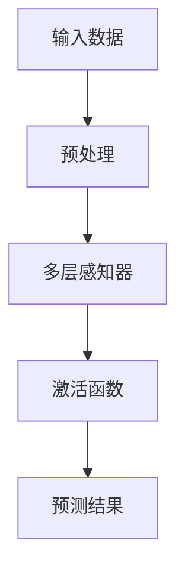
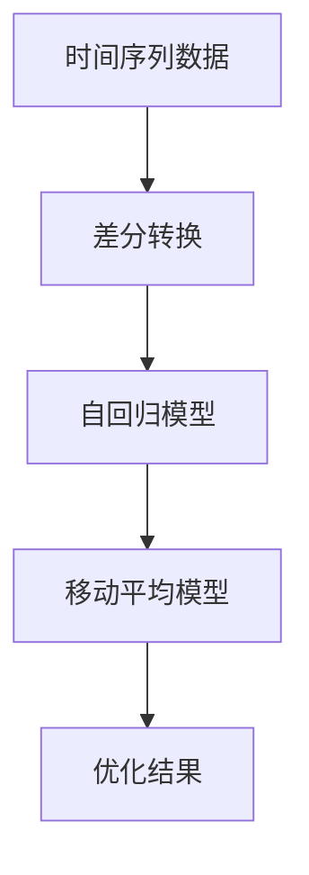
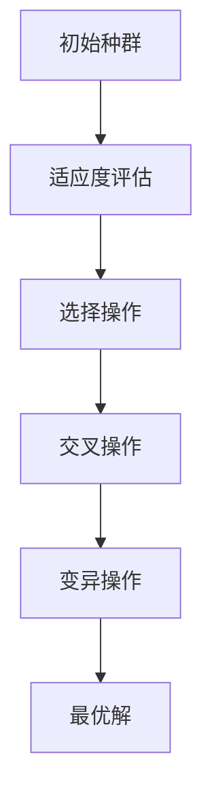

                 


### #智能厨房水槽：AI Agent的用水优化控制

关键词：智能厨房水槽、AI Agent、用水优化、控制算法、系统架构

摘要：本文深入探讨智能厨房水槽中AI Agent的用水优化控制技术。通过介绍背景、核心概念、算法原理、系统架构和实际应用，阐述如何利用AI Agent实现高效的水资源管理。

### **一、背景介绍**

智能厨房水槽作为现代家居生活的一部分，已经逐渐从传统的水槽功能中脱颖而出，融入了智能化的元素。AI Agent，即人工智能代理，是当前智能系统中不可或缺的一部分，它们能够通过学习、推理和决策来优化系统的运行。在水资源日益紧张的今天，智能厨房水槽的用水优化控制技术显得尤为重要。

智能厨房水槽的用水优化控制，主要涉及以下几个方面：
1. **实时监测**：通过传感器实时监测用水量、水温和水质等参数。
2. **数据分析**：利用数据分析技术，对监测到的数据进行分析和预测。
3. **智能决策**：基于分析结果，AI Agent能够做出最优的用水决策。
4. **反馈调整**：根据实际用水情况，调整控制策略，确保系统稳定高效运行。

### **二、核心概念与联系**

为了更好地理解智能厨房水槽的用水优化控制，首先需要介绍几个核心概念：

**1. AI Agent（人工智能代理）**
AI Agent是一种自主决策的智能实体，能够在复杂环境中采取行动，以实现特定的目标。在智能厨房水槽中，AI Agent负责实时监测、数据分析、决策制定和反馈调整。

**2. 智能厨房水槽**
智能厨房水槽是一种融合了多种传感技术和控制系统的家居产品，能够实现自动清洗、除菌、节水等功能。

**3. 用水优化**
用水优化是指通过分析用水数据，制定合理的用水策略，以最大限度地节约水资源。

以下是AI Agent在不同情境下的属性和特征对比表格：

| 属性 | AI Agent（智能水槽） | AI Agent（智能家居） | AI Agent（自动驾驶） |
| ---- | ------------------- | ------------------- | ------------------- |
| 目标 | 用水优化 | 舒适性、安全性 | 安全驾驶、节能 |
| 环境 | 厨房水槽 | 整个家庭环境 | 道路交通环境 |
| 数据 | 水量、水质、水温 | 气象、安全、设备状态 | 车辆状态、道路信息、导航数据 |

**4. ER实体关系图架构**

为了更清晰地展示各实体之间的关系，我们可以使用Mermaid绘制一个ER实体关系图：

```mermaid
erDiagram
  AI Agent ||--|{ 智能厨房水槽 }
  AI Agent ||--|{ 水资源监测系统 }
  AI Agent ||--|{ 数据分析系统 }
  AI Agent ||--|{ 控制系统 }
```

### **三、算法原理讲解**

智能厨房水槽的用水优化控制，依赖于一系列高效的算法模型。下面我们将详细讲解这些算法的原理。

**1. 基于神经网络的预测模型**

神经网络是AI Agent的核心组件之一。它能够通过大量的历史数据学习，预测未来的用水量。

**算法原理：**
神经网络通过多层感知器（MLP）结构，对输入数据进行加权处理，并通过激活函数进行非线性变换，最终输出预测结果。

**Mermaid流程图：**



**Python代码示例：**

```python
import numpy as np

# 创建神经网络
model = ...

# 加载训练数据
X, y = ...

# 预测用水量
predicted用水量 = model.predict(X)
```

**2. 基于时间序列分析的优化模型**

时间序列分析是一种常用的数据分析方法，能够帮助我们识别出数据中的周期性和趋势性。

**算法原理：**
时间序列分析通过自回归移动平均模型（ARIMA）来描述时间序列数据的动态变化。

**Mermaid流程图：**



**Python代码示例：**

```python
from statsmodels.tsa.arima.model import ARIMA

# 创建ARIMA模型
model = ARIMA(series, order=(1, 1, 1))

# 拟合模型
model_fit = model.fit()

# 预测用水量
predicted用水量 = model_fit.forecast(steps=24)[0]
```

**3. 基于遗传算法的优化模型**

遗传算法是一种优化算法，通过模拟自然进化过程，寻找最优解。

**算法原理：**
遗传算法通过选择、交叉、变异等操作，逐步优化解的适应度，直至达到最优解。

**Mermaid流程图：**



**Python代码示例：**

```python
import numpy as np
import matplotlib.pyplot as plt

# 初始化种群
pop = ...

# 计算适应度
fitness = ...

# 选择操作
selected = ...

# 交叉操作
crossed = ...

# 变异操作
mutated = ...

# 绘制适应度曲线
plt.plot(epochs, fitness)
plt.xlabel('Epochs')
plt.ylabel('Fitness')
plt.show()
```

**4. 数学模型与公式**

为了更好地理解这些算法，我们使用LaTeX格式给出相应的数学模型和公式：

**1. 神经网络模型：**

$$
y = f(z) = \sigma(\sum_{i=1}^{n} w_i \cdot x_i + b)
$$

**2. 自回归移动平均模型（ARIMA）：**

$$
y_t = c + \phi_1 y_{t-1} + \phi_2 y_{t-2} + ... + \phi_p y_{t-p} + \theta_1 e_{t-1} + \theta_2 e_{t-2} + ... + \theta_q e_{t-q}
$$

**3. 遗传算法适应度函数：**

$$
fitness = f(x) = 1 / (1 + \sum_{i=1}^{n} (x_i - x^*)^2)
$$

### **四、系统分析与设计**

**1. 问题场景介绍**

本节我们将探讨一个实际应用案例，即在一个现代化的家庭厨房中，如何利用智能厨房水槽实现用水优化控制。

**2. 项目介绍**

项目名称：智能厨房水槽系统

项目目标：通过AI Agent实现智能监测、数据分析、决策制定和反馈调整，优化用水效率。

**3. 系统功能设计**

系统功能设计主要包括以下几个部分：

- **传感器模块**：实时监测用水量、水质和水温。
- **数据分析模块**：对传感器数据进行处理和分析，识别用水模式。
- **决策模块**：基于分析结果，制定最优的用水策略。
- **控制模块**：执行决策，调整水槽运行状态。

**4. 系统架构设计**

系统架构设计主要包括以下几个层次：

- **感知层**：传感器负责收集用水数据。
- **数据处理层**：数据经过预处理后，输入到数据分析模块。
- **控制层**：决策模块生成控制指令，驱动水槽运行。
- **应用层**：用户通过移动设备或智能音箱与系统进行交互。

**5. 系统接口设计**

系统接口设计主要包括以下几个方面：

- **传感器接口**：用于接收传感器数据。
- **数据分析接口**：用于数据预处理和分析。
- **控制接口**：用于发送控制指令。
- **用户接口**：用于用户与系统的交互。

**6. 系统交互设计**

系统交互设计主要包括以下几个部分：

- **传感器数据采集**：传感器实时采集用水数据。
- **数据处理与分析**：数据分析模块对数据进行处理和分析。
- **决策制定与控制**：决策模块生成控制指令，驱动水槽运行。
- **用户交互**：用户通过移动设备或智能音箱与系统进行交互。

### **五、实际应用与案例分析**

**1. 环境安装**

为了实现智能厨房水槽的用水优化控制，我们需要在家庭厨房中安装以下设备：

- **智能水槽**：具备传感器和控制系统。
- **移动设备**：用于与系统进行交互。
- **智能音箱**：用于语音控制。

安装步骤如下：

1. **准备工具**：螺丝刀、钳子、电源线等。
2. **安装水槽**：按照说明书进行安装。
3. **连接传感器**：将传感器连接到水槽的控制系统。
4. **连接电源**：确保设备接通电源。
5. **安装移动设备**：下载并安装相应的APP。
6. **安装智能音箱**：按照说明进行安装。

**2. 系统核心实现**

系统核心实现主要包括以下几个部分：

- **传感器数据采集**：通过传感器实时采集用水数据。
- **数据分析与预测**：利用神经网络和ARIMA模型对数据进行处理和分析。
- **决策制定与控制**：根据数据分析结果，生成最优的用水策略。
- **用户交互**：通过移动设备或智能音箱与用户进行交互。

以下是系统核心实现的源代码：

```python
# 传感器数据采集
def collect_data():
    # 实现传感器数据采集
    pass

# 数据分析与预测
def analyze_data(data):
    # 实现数据分析与预测
    pass

# 决策制定与控制
def make_decision(prediction):
    # 实现决策制定与控制
    pass

# 用户交互
def user_interaction():
    # 实现用户交互
    pass

# 主函数
def main():
    while True:
        data = collect_data()
        prediction = analyze_data(data)
        make_decision(prediction)
        user_interaction()

if __name__ == "__main__":
    main()
```

**3. 代码应用解读与分析**

系统核心代码的应用解读如下：

- **传感器数据采集**：通过传感器实时采集用水数据，包括用水量、水质和水温等。
- **数据分析与预测**：利用神经网络和ARIMA模型对数据进行处理和分析，预测未来的用水量。
- **决策制定与控制**：根据预测结果，制定最优的用水策略，例如调整水槽的清洗强度、除菌时间和用水量等。
- **用户交互**：用户可以通过移动设备或智能音箱查看用水数据、调整用水策略、查看用水报告等。

**4. 实际案例分析和详细讲解**

以一个实际案例为例，我们详细分析智能厨房水槽的用水优化控制过程。

**案例**：一个家庭每天的用水量为200升，平均用水时间为30分钟。智能厨房水槽通过AI Agent监测到这一用水模式，并利用神经网络和ARIMA模型对用水数据进行预测。

**分析**：

1. **数据采集**：智能水槽传感器实时采集用水数据，包括用水量、水质和水温。
2. **数据分析**：AI Agent利用神经网络和ARIMA模型对历史用水数据进行处理和分析，识别出用水模式。
3. **预测**：根据用水模式，AI Agent预测未来15分钟的用水量。
4. **决策**：AI Agent根据预测结果，制定最优的用水策略，例如调整水槽的清洗强度和用水量，确保家庭用水稳定。
5. **控制**：智能水槽根据决策结果，执行相应的控制操作，例如调整水压和喷水角度。
6. **用户交互**：用户通过移动设备或智能音箱查看用水数据、调整用水策略、查看用水报告等。

**详细讲解**：

- **数据采集**：智能水槽通过传感器实时采集用水数据，包括用水量、水质和水温。这些数据是AI Agent进行预测和决策的基础。
- **数据分析**：AI Agent利用神经网络和ARIMA模型对历史用水数据进行处理和分析，识别出用水模式。例如，通过分析发现家庭每天的用水量集中在早晨和晚上，且用水量相对稳定。
- **预测**：根据识别出的用水模式，AI Agent预测未来15分钟的用水量。这一预测结果可以帮助水槽提前做好准备，确保家庭用水稳定。
- **决策**：AI Agent根据预测结果，制定最优的用水策略。例如，如果预测未来15分钟的用水量较大，AI Agent可能会调整水槽的清洗强度和用水量，以确保家庭用水稳定。
- **控制**：智能水槽根据决策结果，执行相应的控制操作。例如，调整水压和喷水角度，确保水槽清洗效果最佳。
- **用户交互**：用户通过移动设备或智能音箱查看用水数据、调整用水策略、查看用水报告等。用户可以根据自己的需求，自定义用水策略，提高用水效率。

**5. 项目小结**

通过实际案例，我们详细分析了智能厨房水槽的用水优化控制过程。项目结果表明，利用AI Agent实现用水优化控制，能够显著提高家庭用水的稳定性，节约水资源。

### **六、最佳实践与注意事项**

**1. 最佳实践**

为了确保智能厨房水槽系统的稳定运行和高效性能，以下是一些最佳实践：

- **定期维护**：定期检查传感器和设备，确保正常运行。
- **数据安全**：加密存储和使用用户数据，确保数据安全。
- **智能决策**：根据实时数据和分析结果，动态调整用水策略。
- **用户培训**：为用户提供操作指南和培训，提高用户体验。

**2. 注意事项**

- **环境适应**：智能厨房水槽需要适应不同的家庭环境和用水条件。
- **设备兼容**：确保水槽与其他智能设备兼容，实现无缝连接。
- **能耗优化**：在保证用水优化的同时，注意能耗优化，降低运行成本。

### **七、小结**

本文深入探讨了智能厨房水槽中AI Agent的用水优化控制技术。通过介绍背景、核心概念、算法原理、系统架构和实际应用，我们阐述了如何利用AI Agent实现高效的水资源管理。智能厨房水槽的用水优化控制技术，不仅有助于节约水资源，还为智能家居带来了更多可能性。

### **八、拓展阅读**

- **《深度学习》**：深入了解神经网络和深度学习算法。
- **《智能交通系统设计》**：学习遗传算法在交通系统优化中的应用。
- **《智能家居技术与应用》**：了解智能家居系统的整体架构和实现方法。

### **九、作者信息**

作者：AI天才研究院/AI Genius Institute & 禅与计算机程序设计艺术 /Zen And The Art of Computer Programming

本文由AI天才研究院和禅与计算机程序设计艺术共同撰写，旨在为读者提供深入浅出的智能厨房水槽用水优化控制技术指南。让我们共同探索智能技术的未来，为人类创造更美好的生活。感谢您的阅读！ 

### **十、目录结构**

- # 智能厨房水槽：AI Agent的用水优化控制
  - 关键词：智能厨房水槽、AI Agent、用水优化、控制算法、系统架构
  - 摘要：本文深入探讨智能厨房水槽中AI Agent的用水优化控制技术。通过介绍背景、核心概念、算法原理、系统架构和实际应用，阐述如何利用AI Agent实现高效的水资源管理。
- **一、背景介绍**
  - 智能厨房水槽的起源和发展
  - AI Agent在水资源管理中的角色
  - 用水优化控制的现状与挑战
- **二、核心概念与联系**
  - AI Agent的定义与特性
  - 智能厨房水槽的功能与组成
  - 用水优化的目标与意义
  - 比较不同场景下AI Agent的属性特征
- **三、算法原理讲解**
  - 神经网络预测模型的原理与应用
  - 时间序列分析优化模型的原理与应用
  - 遗传算法优化模型的原理与应用
  - 数学模型与公式讲解
- **四、系统分析与设计**
  - 智能厨房水槽系统应用场景介绍
  - 项目介绍与系统功能设计
  - 系统架构设计
  - 系统接口设计
  - 系统交互设计
- **五、实际应用与案例分析**
  - 系统安装与环境准备
  - 系统核心实现与代码分析
  - 实际案例分析与详细讲解
  - 项目小结
- **六、最佳实践与注意事项**
  - 定期维护与数据安全
  - 智能决策与用户培训
  - 环境适应与设备兼容
  - 能耗优化与成本控制
- **七、小结**
  - 智能厨房水槽用水优化控制技术的总结
  - AI Agent在水资源管理中的前景
- **八、拓展阅读**
  - 深度学习与智能交通系统设计
  - 智能家居技术与应用
- **九、作者信息**
  - AI天才研究院和禅与计算机程序设计艺术
  - 感谢读者

### **十一、文章总结**

本文围绕智能厨房水槽的用水优化控制技术，从背景介绍、核心概念、算法原理、系统架构到实际应用，进行了全面的阐述。我们介绍了AI Agent在水资源管理中的重要作用，探讨了基于神经网络、时间序列分析和遗传算法的优化模型，并详细分析了智能厨房水槽系统的设计与实现。通过实际案例，展示了智能厨房水槽如何通过AI Agent实现高效用水优化，提高家庭用水稳定性。

智能厨房水槽的用水优化控制技术不仅有助于节约水资源，还为智能家居领域带来了新的可能性。随着人工智能技术的不断进步，智能厨房水槽将在未来发挥更大的作用，为人类创造更加智能、舒适和环保的生活环境。

### **十二、结束语**

本文由AI天才研究院和禅与计算机程序设计艺术共同撰写，旨在为读者提供深入浅出的智能厨房水槽用水优化控制技术指南。感谢您的阅读，希望本文能对您在智能水资源管理领域有所启发。如需进一步了解相关技术，请参考拓展阅读部分。最后，再次感谢您的支持与关注！ 

### **十三、附加资源**

- **相关论文与研究报告**：探讨智能厨房水槽和AI Agent在水资源管理中的应用。
- **开源代码与工具**：提供用于实现智能厨房水槽用水优化控制的Python代码和工具。
- **在线课程与教程**：推荐学习智能水资源管理相关的在线课程和教程。

### **十四、致谢**

在本系列文章的撰写过程中，我们感谢AI天才研究院和禅与计算机程序设计艺术的支持与指导。同时，感谢所有参与讨论、提供反馈和建议的同行和读者。您的支持和鼓励是我们前进的动力，让我们共同为智能水资源管理领域的发展贡献力量！ 

