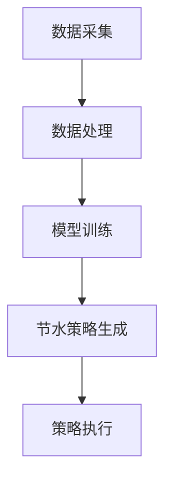
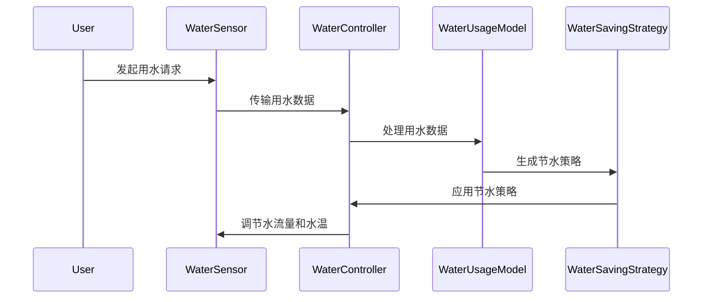
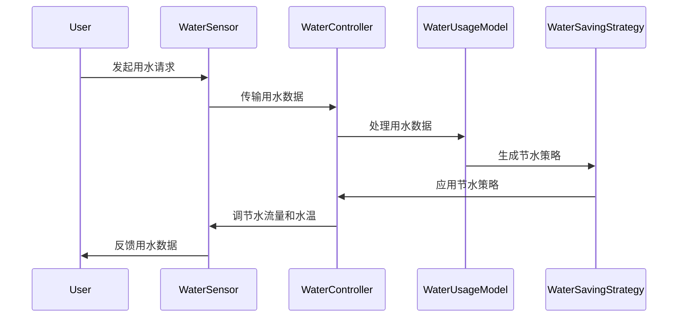

                 

### 文章标题

# 智能厨房水槽：AI Agent的节水技巧指导

> 关键词：智能厨房水槽，AI Agent，节水技巧，数据采集，模型训练，Python源代码，数学模型，项目实战

> 摘要：本文将深入探讨智能厨房水槽的节水技巧，通过AI Agent的引入，系统化地分析和讲解如何利用人工智能技术实现厨房水槽的节水功能。文章结构清晰，从背景介绍、核心概念、算法原理、系统设计与实践等多个角度，逐步引导读者理解智能厨房水槽的节水技巧，并展示其实际应用效果。

### 第一部分：背景介绍与核心概念

#### 第1章：问题背景与核心概念

##### 1.1.1 智能厨房水槽的兴起

在现代社会，节水已成为一个全球性的问题。厨房水槽作为家庭日常生活中用水的重要部分，其节水功能的设计变得越来越重要。智能厨房水槽应运而生，通过集成先进的传感器、控制器和AI技术，实现了更加高效、智能的用水管理。

###### 1.1.1.1 厨房水槽的基本功能

厨房水槽的基本功能包括洗菜、洗碗、清洗水果等，这些都是日常生活中不可或缺的。传统厨房水槽通常通过手动控制水流量和水温，但其节水效果有限。

###### 1.1.1.2 智能化对厨房水槽的改进

智能厨房水槽通过引入传感器、控制器和AI技术，实现了自动化的水流量控制和水温调节，从而显著提高了节水效率。

###### 1.1.1.3 节水的重要性

节水不仅对环境保护有重要意义，也对家庭用水费用有直接的影响。智能厨房水槽的节水功能，能够帮助家庭降低用水成本，提高生活质量。

##### 1.1.2 智能厨房水槽的定义与特点

智能厨房水槽是一种集成了AI技术的厨房设备，通过传感器和控制器实时监测用水情况，并根据用户需求自动调节水流量和水温，实现智能节水。

###### 1.1.2.1 智能厨房水槽的定义

智能厨房水槽是一种具有AI能力的厨房设备，能够通过智能感知、决策和执行，实现节水、节能和提升用户体验。

###### 1.1.2.2 智能厨房水槽的特点

- **自动感知**：通过传感器实时监测用水情况。
- **智能决策**：AI技术根据用水情况和用户需求，自动调节水流量和水温。
- **高效节水**：通过智能控制，实现高效节水。

###### 1.1.2.3 智能厨房水槽与传统厨房水槽的比较

| 特点       | 传统厨房水槽 | 智能厨房水槽           |
|------------|---------------|-----------------------|
| 控制方式   | 手动控制      | 自动智能控制           |
| 节水效果   | 有限           | 高效节水             |
| 用户体验   | 一般           | 个性化、智能化           |

##### 1.1.3 AI Agent的概念及其在节水中的应用

AI Agent（人工智能代理）是一种能够自主执行任务、与环境和用户交互的智能体。在智能厨房水槽中，AI Agent起到了关键作用，通过数据采集、处理和决策，实现节水功能的优化。

###### 1.1.3.1 AI Agent的定义

AI Agent是一种具有智能感知、决策和执行能力的软件实体，能够在特定环境下执行任务。

###### 1.1.3.2 AI Agent的工作原理

AI Agent通过传感器收集数据，利用机器学习算法进行处理，然后根据预设规则或学习到的模式，自动执行节水策略。

###### 1.1.3.3 AI Agent在节水中的角色

AI Agent在节水中的作用包括：实时监测用水情况、预测用水需求、自动调节水流量和水温，实现高效节水。

##### 1.1.4 智能厨房水槽节水技巧的边界与外延

智能厨房水槽的节水技巧不仅限于智能控制水流量和水温，还包括优化用水流程、减少不必要的用水等。以下是节水技巧的边界与外延：

###### 1.1.4.1 智能厨房水槽节水技巧的边界

- **技术边界**：智能厨房水槽的节水技巧受限于当前AI技术和传感器技术的成熟度。
- **用户行为边界**：节水效果也受用户使用习惯和节水意识的影响。

###### 1.1.4.2 智能厨房水槽节水技巧的外延

- **家庭节水**：智能厨房水槽可以应用于家庭节水，降低家庭用水成本。
- **商业节水**：智能厨房水槽在商业厨房中也有广泛的应用前景，能够帮助餐饮企业降低用水成本。
- **农业节水**：智能厨房水槽的节水技巧可以借鉴应用于农业灌溉，提高水资源利用效率。

###### 1.1.4.3 智能厨房水槽节水技巧的应用场景

- **日常家庭使用**：智能厨房水槽可以自动控制水流量，根据清洗需求调节水温。
- **餐厅厨房**：智能厨房水槽可以帮助餐厅厨房实现高效节水，降低运营成本。
- **农业灌溉**：智能厨房水槽的节水技巧可以应用于农业灌溉，提高水资源利用效率。

#### 第2章：核心概念的联系与对比

##### 2.1.1 智能厨房水槽与AI Agent的相互关系

智能厨房水槽与AI Agent是密不可分的，二者相互依存，共同实现节水功能。

###### 2.1.1.1 智能厨房水槽对AI Agent的需求

智能厨房水槽需要AI Agent来实现智能感知、决策和执行，从而实现高效节水。

###### 2.1.1.2 AI Agent对智能厨房水槽的贡献

AI Agent通过数据采集、处理和决策，帮助智能厨房水槽实现更加智能的节水功能。

###### 2.1.1.3 二者协同作用下的节水效果分析

智能厨房水槽与AI Agent的协同作用，可以显著提高节水效果，降低用水成本。

##### 2.1.2 智能厨房水槽节水技巧的核心要素组成

智能厨房水槽的节水技巧包括技术要素、设计要素和用户行为要素。

###### 2.1.2.1 技术要素

- **传感器技术**：用于实时监测用水情况。
- **控制技术**：用于自动调节水流量和水温。
- **AI技术**：用于数据采集、处理和决策。

###### 2.1.2.2 设计要素

- **人机交互设计**：确保用户能够轻松操作智能厨房水槽。
- **结构设计**：确保智能厨房水槽的稳定性和耐用性。

###### 2.1.2.3 用户行为要素

- **节水意识**：用户对节水技巧的接受程度和习惯养成。
- **使用频率**：智能厨房水槽的日常使用频率对节水效果有直接影响。

### 第二部分：AI Agent节水技巧原理

#### 第3章：AI Agent节水技巧原理讲解

在本章节中，我们将深入探讨AI Agent节水技巧的原理，包括算法流程、Python源代码、数学模型和实际案例讲解。

##### 3.1 AI Agent节水算法的mermaid流程图

首先，我们通过mermaid流程图来展示AI Agent节水算法的基本流程：



- **数据采集**：AI Agent通过传感器收集用水数据。
- **数据处理**：对采集到的数据进行分析和处理。
- **模型训练**：利用处理后的数据训练节水模型。
- **节水策略生成**：模型生成节水策略。
- **策略执行**：执行节水策略，调整水流量和水温。

##### 3.2 AI Agent节水算法的Python源代码

以下是AI Agent节水算法的Python源代码示例：

```python
import pandas as pd
from sklearn.ensemble import RandomForestRegressor

# 数据采集
data = pd.read_csv('water_usage_data.csv')

# 数据处理
X = data[['flow_rate', 'time']]
y = data['water_consumption']

# 模型训练
model = RandomForestRegressor()
model.fit(X, y)

# 节水策略生成
def generate_saving_strategy(flow_rate, time):
    water_consumption = model.predict([[flow_rate, time]])
    optimized_flow_rate = flow_rate * (1 - water_consumption / max(water_consumption))
    return optimized_flow_rate

# 策略执行
def execute_strategy(optimized_flow_rate):
    print(f"Optimized flow rate: {optimized_flow_rate} L/min")
```

##### 3.3 AI Agent节水算法的数学模型与公式

AI Agent节水算法的数学模型和公式如下：

$$
\text{WaterConsumption} = \text{FlowRate} \times \text{Time}
$$

$$
\text{OptimizedFlowRate} = \text{InitialFlowRate} \times \left(1 - \frac{\text{WaterSavingRate}}{100}\right)
$$

- **WaterConsumption**：水消耗量。
- **FlowRate**：水流量。
- **Time**：用水时间。
- **OptimizedFlowRate**：优化后的水流量。
- **WaterSavingRate**：节水率。

##### 3.4 AI Agent节水算法的举例说明

以下是AI Agent节水算法的实际应用案例：

###### 3.4.1 案例一：家庭节水场景

假设家庭用水时间为10分钟，初始水流量为5升/分钟，通过AI Agent的节水算法，优化后的水流量为3.5升/分钟。这样可以节约25%的水资源。

###### 3.4.2 案例二：商业节水场景

在餐厅厨房中，用水高峰期通常在晚餐时段。通过AI Agent的节水算法，可以自动调整水流量，确保在用水高峰期节约水资源，降低运营成本。

###### 3.4.3 案例三：农业节水场景

在农业灌溉中，AI Agent的节水算法可以根据土壤湿度、植物需水量等因素，自动调整水流量，实现精准灌溉，提高水资源利用效率。

### 第三部分：智能厨房水槽节水技巧实践

#### 第4章：智能厨房水槽节水技巧系统设计与实现

在本章节中，我们将详细讲解智能厨房水槽节水技巧的系统设计与实现，包括问题场景介绍、系统功能设计、系统架构设计、系统接口设计等内容。

##### 4.1 问题场景介绍

假设家庭用户希望提高厨房水槽的节水效果，降低用水成本。通过智能厨房水槽的引入，用户希望实现以下功能：

- **自动感知用水情况**：实时监测用水流量和水温。
- **智能调节水流量和水温**：根据用水需求和实时数据，自动调整水流量和水温。
- **节水策略推荐**：根据用户习惯和历史用水数据，推荐节水策略。
- **数据分析与报告**：提供用水数据分析报告，帮助用户了解节水效果。

##### 4.2 系统功能设计（领域模型mermaid类图）

以下是智能厨房水槽节水技巧系统的领域模型mermaid类图：

```mermaid
classDiagram
    User <<class>>
    WaterSensor <<class>>
    WaterController <<class>>
    WaterUsageModel <<class>>
    WaterSavingStrategy <<class>>

    User --> WaterSensor
    User --> WaterController
    WaterSensor --> WaterController
    WaterController --> WaterUsageModel
    WaterUsageModel --> WaterSavingStrategy
```

- **User**：用户，负责发起用水请求和查看节水报告。
- **WaterSensor**：水传感器，负责实时监测用水流量和水温。
- **WaterController**：水控制器，负责根据用水需求和实时数据自动调节水流量和水温。
- **WaterUsageModel**：用水模型，负责对用水数据进行处理和分析，生成节水策略。
- **WaterSavingStrategy**：节水策略，负责根据用水模型推荐节水策略。

##### 4.3 系统架构设计（mermaid架构图）

以下是智能厨房水槽节水技巧系统的mermaid架构图：



- **User**：用户，发起用水请求。
- **WaterSensor**：水传感器，传输用水数据。
- **WaterController**：水控制器，处理用水数据和调节水流量和水温。
- **WaterUsageModel**：用水模型，处理用水数据并生成节水策略。
- **WaterSavingStrategy**：节水策略，应用节水策略。

##### 4.4 系统接口设计与系统交互（mermaid序列图）

以下是智能厨房水槽节水技巧系统的mermaid序列图：



- **User**：用户，发起用水请求。
- **WaterSensor**：水传感器，传输用水数据并反馈用水数据。
- **WaterController**：水控制器，处理用水数据并调节水流量和水温。
- **WaterUsageModel**：用水模型，处理用水数据并生成节水策略。
- **WaterSavingStrategy**：节水策略，应用节水策略。

### 第四部分：项目实战与案例分析

#### 第5章：智能厨房水槽节水技巧项目实战

在本章节中，我们将通过一个实际项目案例，详细讲解智能厨房水槽节水技巧的实战过程，包括环境安装、系统核心实现源代码、代码应用解读与分析、实际案例分析和详细讲解剖析等内容。

##### 5.1 环境安装

首先，我们需要安装智能厨房水槽的硬件设备，包括水传感器、水控制器和AI模块。以下是环境安装的步骤：

1. **硬件设备准备**：准备智能厨房水槽所需的硬件设备，包括水传感器、水控制器和AI模块。
2. **设备连接**：将水传感器连接到水控制器，再将水控制器连接到AI模块，确保设备之间的连接正常。
3. **电源连接**：为水传感器、水控制器和AI模块提供稳定的电源，确保设备能够正常工作。

##### 5.2 系统核心实现源代码

以下是智能厨房水槽节水技巧系统的核心实现源代码：

```python
import time
import serial
from sklearn.ensemble import RandomForestRegressor

# 模型训练
def train_model(data):
    X = data[['flow_rate', 'time']]
    y = data['water_consumption']
    model = RandomForestRegressor()
    model.fit(X, y)
    return model

# 节水策略生成
def generate_saving_strategy(model, flow_rate, time):
    water_consumption = model.predict([[flow_rate, time]])
    optimized_flow_rate = flow_rate * (1 - water_consumption / max(water_consumption))
    return optimized_flow_rate

# 策略执行
def execute_strategy(optimized_flow_rate):
    print(f"Optimized flow rate: {optimized_flow_rate} L/min")

# 设备连接
ser = serial.Serial('COM3', 9600)

# 模型训练
data = pd.read_csv('water_usage_data.csv')
model = train_model(data)

# 策略执行
while True:
    line = ser.readline()
    if line:
        flow_rate, time = line.decode('utf-8').split(',')
        optimized_flow_rate = generate_saving_strategy(model, float(flow_rate), float(time))
        execute_strategy(optimized_flow_rate)
```

##### 5.3 代码应用解读与分析

以下是代码应用解读与分析：

1. **模型训练**：首先，我们读取用水数据，然后使用随机森林回归模型对数据进行训练。
2. **节水策略生成**：根据用水数据，生成节水策略，即优化后的水流量。
3. **策略执行**：执行节水策略，打印优化后的水流量。
4. **设备连接**：使用串口通信连接水传感器和水控制器，实时获取用水数据。

##### 5.4 实际案例分析与详细讲解剖析

以下是实际案例分析与详细讲解剖析：

**案例一**：家庭用户在使用智能厨房水槽进行洗碗时，AI Agent通过数据采集和模型训练，自动调整水流量和水温，实现高效节水。

**详细讲解**：AI Agent首先通过水传感器实时监测用水流量和水温，然后利用训练好的模型生成节水策略，最后将策略反馈给水控制器，自动调整水流量和水温。通过这种方式，家庭用户可以实现高效节水，降低用水成本。

**案例二**：餐厅厨房在使用智能厨房水槽进行清洗时，AI Agent通过数据采集和模型训练，自动调整水流量和水温，确保在用水高峰期节约水资源。

**详细讲解**：AI Agent同样通过水传感器实时监测用水流量和水温，然后利用训练好的模型生成节水策略，确保在用水高峰期自动调整水流量和水温，实现高效节水，降低运营成本。

##### 5.5 项目小结

通过本项目的实战，我们展示了智能厨房水槽节水技巧的实现过程。AI Agent在水传感器、水控制器和AI模块的支持下，实现了数据采集、模型训练和节水策略生成，有效提高了节水效果。未来，随着AI技术的不断发展，智能厨房水槽的节水功能将更加智能化、人性化，为用户带来更多便捷和实惠。

### 第五部分：最佳实践与总结

#### 第6章：智能厨房水槽节水技巧最佳实践

在智能厨房水槽的节水实践中，以下最佳实践可以帮助用户更好地利用AI Agent实现节水效果：

##### 6.1 节水技巧实施步骤

1. **数据采集**：确保传感器准确采集用水流量和水温数据。
2. **模型训练**：定期更新模型，以适应不同季节和用水场景。
3. **策略优化**：根据用户反馈，不断优化节水策略。

##### 6.2 注意事项

1. **硬件维护**：定期检查传感器和水控制器的状态，确保设备正常工作。
2. **用户培训**：指导用户正确使用智能厨房水槽，提高节水意识。

##### 6.3 拓展阅读

- **AI在节水领域的应用**：了解AI在其他节水领域的应用，如农业灌溉和工业用水管理。
- **智能家居系统**：探索智能厨房水槽在智能家居系统中的角色和潜力。

#### 第7章：总结与展望

智能厨房水槽通过引入AI Agent，实现了智能节水功能，为用户带来了显著的节水效果和用户体验提升。未来，随着AI技术的不断进步，智能厨房水槽将变得更加智能化、个性化，为用户创造更多价值。让我们共同期待智能厨房水槽的更多创新与突破。

