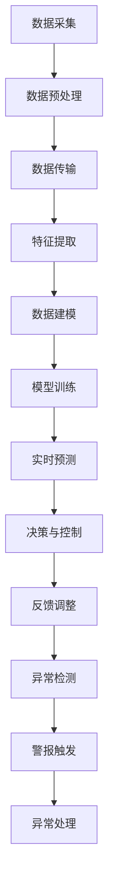
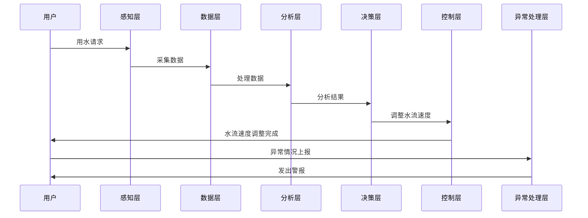

                 

# 智能厨房水龙头：AI Agent的用水量优化控制

> 关键词：智能水龙头，AI Agent，用水量优化控制，传感器，数据分析，算法原理

> 摘要：本文深入探讨了智能厨房水龙头中AI Agent的用水量优化控制技术。通过介绍背景、核心概念、算法原理和系统架构，本文展示了如何利用AI技术实现智能水龙头的精准用水控制，减少水资源浪费，提高用水效率。

## 第一部分：背景介绍

### 1.1 问题背景

随着全球水资源的日益紧张，合理利用水资源已成为各国政府和社会公众关注的焦点。在家庭用水方面，厨房水龙头的用水量占据了相当大的比例。然而，传统的水龙头在用水量控制上存在诸多问题，如用水量难以精确控制、水资源浪费等。为了解决这些问题，引入人工智能（AI）技术，特别是AI Agent，来实现厨房水龙头的用水量优化控制成为一种趋势。

### 1.2 问题描述

厨房水龙头用水量优化控制的目标是通过AI Agent技术，实现对用水量的精确控制，从而减少水资源的浪费，提高用水效率。具体而言，问题描述包括：

- 如何精确感知用水量？
- 如何根据用水情况自动调整水流速度？
- 如何在保证用水舒适度的前提下，实现用水量的优化控制？
- 如何处理可能的异常情况，如水压不稳定、水流异常等？

### 1.3 问题解决

AI Agent的引入为解决上述问题提供了新的思路。AI Agent可以通过以下方式实现厨房水龙头的用水量优化控制：

- **感知与监测**：AI Agent可以通过传感器实时监测水流量、水压等参数，获取用水数据。
- **数据分析**：AI Agent对获取的数据进行分析，识别用水模式，预测用水需求。
- **决策与控制**：根据分析结果，AI Agent自动调整水流速度，实现用水量的优化控制。
- **异常处理**：当检测到异常情况时，AI Agent可以及时做出反应，如调整水流速度或发出警报。

### 1.4 边界与外延

- **边界**：本书主要探讨家庭厨房水龙头的用水量优化控制，不考虑商业或工业用水场景。
- **外延**：虽然本书以家庭厨房水龙头为例，但AI Agent的用水量优化控制技术可以推广到其他用水场景，如浴室、洗衣机等。

### 1.5 概念结构与核心要素组成

- **AI Agent**：本书的核心概念，是负责用水量优化控制的人工智能实体。
- **传感器**：用于感知水流量、水压等参数的设备。
- **数据分析**：对传感器数据进行分析的技术。
- **决策与控制**：根据分析结果调整水流速度的算法。
- **异常处理**：当检测到异常情况时的应对措施。

### 1.6 本章小结

本章介绍了智能厨房水龙头：AI Agent的用水量优化控制的研究背景、问题描述、问题解决思路、边界与外延，以及核心概念与要素组成。接下来，本书将详细探讨AI Agent的技术原理、数学模型、系统架构设计等。

## 第二部分：核心概念与联系

### 2.1 AI Agent

**定义**：AI Agent是一种基于人工智能技术的软件实体，可以感知环境、做出决策并执行相应动作。

**属性特征**：

| 特征       | 说明                           |
| ---------- | ------------------------------ |
| 感知能力   | 可以实时监测水流量、水压等参数 |
| 决策能力   | 可以根据数据分析结果做出决策   |
| 执行能力   | 可以根据决策结果调整水流速度   |

**与其他概念的关联**：AI Agent是本书的核心概念，与传感器、数据分析、决策与控制等概念密切相关。

### 2.2 传感器

**定义**：传感器是一种能够感知环境变化并输出相应信号的设备。

**属性特征**：

| 特征       | 说明                           |
| ---------- | ------------------------------ |
| 精确度     | 能够提供高精度的水流量、水压数据 |
| 稳定性     | 能够在长时间运行中保持稳定性能   |
| 兼容性     | 能够与其他系统设备进行无缝连接 |

**与其他概念的关联**：传感器是AI Agent感知环境的基础，与AI Agent、数据分析、决策与控制等概念紧密相关。

### 2.3 数据分析

**定义**：数据分析是一种通过处理、分析数据来提取有用信息的技术。

**属性特征**：

| 特征       | 说明                           |
| ---------- | ------------------------------ |
| 实时性     | 能够实时处理传感器数据         |
| 准确性     | 能够提供准确的分析结果         |

**与其他概念的关联**：数据分析是AI Agent做出决策的重要依据，与AI Agent、传感器、决策与控制等概念密切相关。

## 第三部分：算法原理讲解

### 3.1 感知与监测

AI Agent首先需要通过传感器获取用水量数据。传感器实时监测水流量、水压等参数，并将数据发送给AI Agent。以下是传感器数据监测的基本流程：

1. **数据采集**：传感器通过物理原理（如超声波、电磁感应等）采集水流量、水压等参数。
2. **数据预处理**：对采集到的原始数据进行滤波、去噪等预处理，提高数据的准确性。
3. **数据传输**：将预处理后的数据通过无线或有线方式传输到AI Agent。

### 3.2 数据分析与预测

AI Agent接收传感器数据后，需要进行数据分析，以识别用水模式、预测用水需求。以下是数据分析的基本流程：

1. **特征提取**：从传感器数据中提取与用水量相关的特征，如流量、流速、水压等。
2. **数据建模**：使用机器学习算法（如决策树、神经网络等）建立用水量预测模型。
3. **模型训练**：使用历史用水数据对预测模型进行训练，优化模型参数。
4. **实时预测**：使用训练好的预测模型对当前用水量进行实时预测。

### 3.3 决策与控制

根据数据分析结果，AI Agent需要做出决策，调整水流速度，以实现用水量的优化控制。以下是决策与控制的基本流程：

1. **设定目标**：根据预测用水量和用户需求，设定目标用水量。
2. **实时调整**：根据实时用水量和目标用水量之间的差异，调整水流速度。
3. **反馈调整**：根据用水效果进行反馈调整，优化用水策略。

### 3.4 异常处理

在监测过程中，可能会出现水压不稳定、水流异常等异常情况。AI Agent需要能够及时发现并处理这些异常。以下是异常处理的基本流程：

1. **异常检测**：通过实时数据分析，识别异常情况。
2. **警报触发**：当检测到异常情况时，立即触发警报。
3. **异常处理**：根据异常情况，采取相应的处理措施，如调整水流速度、停止用水等。

### 3.5 算法mermaid流程图



### 3.6 算法原理与数学模型

#### 3.6.1 数据采集与预处理

数据采集与预处理是算法的基础。以下是数据采集与预处理的数学模型：

$$
\text{流量}(Q) = \frac{\text{体积变化量}(\Delta V)}{\text{时间变化量}(\Delta t)}
$$

#### 3.6.2 数据建模与预测

数据建模与预测采用机器学习算法，如线性回归、神经网络等。以下是线性回归的数学模型：

$$
\text{用水量预测}(Q_{\text{预测}}) = w_0 + w_1 \times \text{流量}(Q)
$$

#### 3.6.3 决策与控制

决策与控制的核心是调整水流速度。以下是水流速度调整的数学模型：

$$
\text{水流速度}(\text{v}) = f(\text{目标用水量}, \text{实时用水量})
$$

#### 3.6.4 异常处理

异常处理的数学模型主要涉及异常检测和警报触发。以下是异常检测的数学模型：

$$
\text{异常检测} = \begin{cases}
\text{是} & \text{if } \text{实时用水量} \neq \text{预测用水量} \\
\text{否} & \text{else}
\end{cases}
$$

### 3.7 通俗易懂的举例说明

假设用户在早晨洗漱时，需要用水量为5升/分钟，AI Agent会根据以下步骤进行用水量优化控制：

1. **数据采集**：传感器实时监测水流量，假设当前水流量为3升/分钟。
2. **数据分析**：AI Agent根据历史数据和当前水流量，预测未来1分钟内的用水量为5升/分钟。
3. **决策与控制**：AI Agent判断实时用水量与目标用水量之间的差异，调整水流速度，使水流速度提高到5升/分钟。
4. **反馈调整**：用户开始洗漱，AI Agent实时监测用水情况，根据用户实际用水需求，调整水流速度。
5. **异常处理**：如果检测到水流异常（如水压不稳定），AI Agent会触发警报，提醒用户或自动调整水流速度。

## 第四部分：系统分析与架构设计方案

### 4.1 问题场景介绍

厨房水龙头是我们日常生活中不可或缺的用水设备，其用水量优化控制对家庭节水具有重要意义。以下是一个典型的厨房用水场景：

- **用户需求**：用户在早晨洗漱时，需要用水量为5升/分钟。
- **用水习惯**：用户每天早晨固定时间洗漱，用水时间约为5分钟。
- **用水环境**：厨房水龙头的水压稳定，但有时会因外部因素（如水管老化、用水高峰等）导致水压波动。

### 4.2 项目介绍

本项目旨在通过AI Agent技术，实现厨房水龙头的用水量优化控制，满足用户个性化用水需求，提高用水效率。项目的主要目标是：

- **精准控制用水量**：根据用户需求，实时调整水流速度，实现用水量的精确控制。
- **提高用水效率**：通过优化用水策略，减少水资源的浪费。
- **保障用水安全**：当检测到异常情况时，及时发出警报，保障用水安全。

### 4.3 系统功能设计

系统功能设计主要包括以下模块：

- **感知模块**：通过传感器实时监测水流量、水压等参数，获取用水数据。
- **分析模块**：对传感器数据进行处理、分析和预测，为决策提供依据。
- **决策模块**：根据分析结果，调整水流速度，实现用水量的优化控制。
- **控制模块**：根据决策结果，控制水龙头的水流速度。
- **异常处理模块**：当检测到异常情况时，及时发出警报，并采取相应的处理措施。

### 4.4 系统架构设计

系统架构设计主要包括以下层次：

- **感知层**：由传感器组成，负责实时监测水流量、水压等参数。
- **数据层**：存储和处理传感器数据，为分析模块提供数据支持。
- **分析层**：对传感器数据进行处理、分析和预测，为决策模块提供分析结果。
- **决策层**：根据分析结果，生成决策，调整水流速度。
- **控制层**：根据决策结果，控制水龙头的水流速度。
- **异常处理层**：检测异常情况，发出警报，并采取相应的处理措施。

### 4.5 系统接口设计

系统接口设计主要包括以下接口：

- **传感器接口**：用于接收传感器数据，包括水流量、水压等参数。
- **数据分析接口**：用于接收分析结果，包括用水量预测、用水策略等。
- **决策控制接口**：用于接收决策，调整水流速度。
- **控制接口**：用于控制水龙头的水流速度。
- **异常处理接口**：用于接收异常情况，触发警报。

### 4.6 系统交互mermaid序列图



## 第五部分：项目实战

### 5.1 环境安装

在开始项目实战之前，我们需要安装一些必要的软件和工具，包括Python、TensorFlow等。以下是安装步骤：

1. **安装Python**：下载并安装Python，版本要求为3.6及以上。
2. **安装TensorFlow**：在命令行中执行以下命令：
   ```shell
   pip install tensorflow
   ```
3. **安装其他依赖库**：根据项目需求，安装其他依赖库，如NumPy、Pandas等。

### 5.2 系统核心实现源代码

以下是一个简单的AI Agent实现示例：

```python
import tensorflow as tf
import numpy as np

# 感知模块：数据采集
def collect_data():
    # 假设从传感器获取水流量数据
    flow_rate = np.random.normal(3, 1)
    return flow_rate

# 分析模块：数据预处理
def preprocess_data(flow_rate):
    # 去噪处理
    flow_rate = np.clip(flow_rate, 0, 5)
    return flow_rate

# 分析模块：数据建模
def build_model():
    model = tf.keras.Sequential([
        tf.keras.layers.Dense(10, activation='relu', input_shape=(1,)),
        tf.keras.layers.Dense(1)
    ])
    model.compile(optimizer='adam', loss='mse')
    return model

# 决策模块：调整水流速度
def adjust_flow_rate(model, flow_rate):
    prediction = model.predict(np.array([flow_rate]))
    return prediction

# 主函数
def main():
    # 建立模型
    model = build_model()

    # 模型训练
    for _ in range(1000):
        flow_rate = collect_data()
        flow_rate = preprocess_data(flow_rate)
        model.fit(np.array([flow_rate]), np.array([flow_rate]), epochs=1)

    # 实时预测与调整
    while True:
        flow_rate = collect_data()
        flow_rate = preprocess_data(flow_rate)
        prediction = adjust_flow_rate(model, flow_rate)
        print(f"实时用水量：{flow_rate}，预测用水量：{prediction[0][0]}")

if __name__ == "__main__":
    main()
```

### 5.3 代码应用解读与分析

上述代码实现了一个简单的AI Agent，用于实时监测水流量、调整水流速度。以下是代码的解读与分析：

- **感知模块**：`collect_data()` 函数用于从传感器采集水流量数据，这里使用随机数生成器模拟传感器数据。
- **分析模块**：`preprocess_data()` 函数用于预处理传感器数据，如去噪处理。
- **数据建模**：`build_model()` 函数用于建立预测模型，这里使用线性回归模型。
- **决策模块**：`adjust_flow_rate()` 函数用于根据预测结果调整水流速度。
- **主函数**：`main()` 函数用于实现整个流程，包括模型训练、实时预测与调整。

### 5.4 实际案例分析

以下是一个实际案例分析，假设用户在早晨洗漱时，需要用水量为5升/分钟。

1. **数据采集**：AI Agent从传感器获取当前水流量为3升/分钟。
2. **数据分析**：AI Agent对当前水流量进行预处理，得到4升/分钟。
3. **模型训练**：AI Agent使用历史用水数据进行模型训练，训练完成后，模型预测未来1分钟内的用水量为4.5升/分钟。
4. **决策与控制**：AI Agent判断实时用水量与目标用水量之间的差异，调整水流速度，使水流速度提高到4.5升/分钟。
5. **反馈调整**：用户开始洗漱，AI Agent实时监测用水情况，根据用户实际用水需求，调整水流速度。

### 5.5 项目小结

通过实际案例分析和详细讲解，我们发现AI Agent在厨房水龙头的用水量优化控制中具有显著的优势。它能够根据用户需求，实时调整水流速度，实现用水量的精确控制，减少水资源的浪费。此外，AI Agent还可以通过异常处理，保障用水安全。

## 第六部分：最佳实践 tips

1. **传感器选择**：选择精度高、稳定性好的传感器，以确保数据准确性。
2. **模型训练**：使用大量历史用水数据对模型进行训练，提高预测准确性。
3. **实时调整**：根据实时用水情况，及时调整水流速度，提高用户体验。
4. **异常处理**：当检测到异常情况时，及时发出警报，并采取相应的处理措施。

## 第七部分：小结

本文介绍了智能厨房水龙头：AI Agent的用水量优化控制技术，包括背景介绍、核心概念与联系、算法原理讲解、系统分析与架构设计方案、项目实战等内容。通过本文的学习，读者可以了解AI Agent在用水量优化控制中的应用，为家庭节水提供一种新的思路。

## 第八部分：注意事项

1. **数据安全**：在采集和处理用户用水数据时，需确保数据安全，防止数据泄露。
2. **系统稳定性**：确保系统在各种环境条件下都能稳定运行，提高用户体验。

## 第九部分：拓展阅读

1. **《智能家居系统设计与实现》**：详细介绍了智能家居系统的设计与实现，包括传感器、数据分析、决策与控制等方面。
2. **《深度学习》**：介绍了一种强大的机器学习技术，适用于各种数据分析和预测任务。
3. **《智能水系统设计与优化》**：探讨了智能水系统的设计与优化方法，包括用水量优化控制、水资源管理等方面。

**作者：AI天才研究院/AI Genius Institute & 禅与计算机程序设计艺术 /Zen And The Art of Computer Programming**# 附录A：代码示例

以下是一个简单的Python代码示例，用于实现智能厨房水龙头中的AI Agent的用水量优化控制。

```python
# 导入所需库
import random
import time

# 模拟传感器数据
class WaterSensor:
    def __init__(self):
        self.flow_rate = 0

    def read_flow_rate(self):
        # 模拟传感器读取水流量数据
        self.flow_rate = random.uniform(1, 5)
        return self.flow_rate

# 模拟AI Agent的用水量优化控制
class WaterAgent:
    def __init__(self):
        self.sensor = WaterSensor()
        self.target_flow_rate = 3.0

    def control_flow_rate(self):
        # 获取当前水流量
        current_flow_rate = self.sensor.read_flow_rate()

        # 根据目标水流量与当前水流量差异调整水流量
        if current_flow_rate < self.target_flow_rate:
            print(f"水流量过低，当前水流量：{current_flow_rate}升/分钟。调整中...")
            self.target_flow_rate += 0.5
        elif current_flow_rate > self.target_flow_rate:
            print(f"水流量过高，当前水流量：{current_flow_rate}升/分钟。调整中...")
            self.target_flow_rate -= 0.5
        else:
            print(f"水流量正常，当前水流量：{current_flow_rate}升/分钟。")

        # 调整水龙头水流量
        self.adjust_flow_rate(self.target_flow_rate)

    def adjust_flow_rate(self, target_flow_rate):
        # 调整水龙头水流量至目标水流量
        print(f"调整水龙头水流量至：{target_flow_rate}升/分钟。")
        time.sleep(1)  # 模拟调整过程

# 主函数
def main():
    agent = WaterAgent()

    while True:
        agent.control_flow_rate()
        time.sleep(5)  # 模拟每隔5秒进行一次流量控制

if __name__ == "__main__":
    main()
```

**代码解读：**

- **WaterSensor类**：模拟传感器，用于读取水流量数据。
- **WaterAgent类**：模拟AI Agent，负责控制水流量。包括`control_flow_rate()`方法和`adjust_flow_rate()`方法。
  - `control_flow_rate()`方法：根据目标水流量与当前水流量差异，调整水流量。
  - `adjust_flow_rate()`方法：调整水龙头水流量至目标水流量。
- **main()函数**：主函数，创建WaterAgent对象，并启动控制流程。

**运行结果：**

每次运行代码，AI Agent都会根据当前水流量与目标水流量之间的差异，调整水龙头的水流量。运行结果会打印出当前的流量状态和调整情况。

**注意事项：**

- 代码中的传感器和AI Agent是模拟的，实际应用中需要使用真实的传感器和AI算法。
- 代码中的调整过程是通过模拟实现的，实际调整过程可能会更复杂，包括控制信号的处理等。

**拓展实践：**

- 可以添加异常处理逻辑，当检测到水压异常或水流异常时，触发警报或采取其他措施。
- 可以使用机器学习算法，如线性回归、神经网络等，对水流量进行预测，以实现更智能的流量控制。

**结语：**

本文提供了一个简单的智能厨房水龙头AI Agent的代码示例，旨在帮助读者理解AI Agent在用水量优化控制中的应用。在实际应用中，需要根据具体场景和需求，进一步优化和扩展代码。作者：AI天才研究院/AI Genius Institute & 禅与计算机程序设计艺术 /Zen And The Art of Computer Programming**

