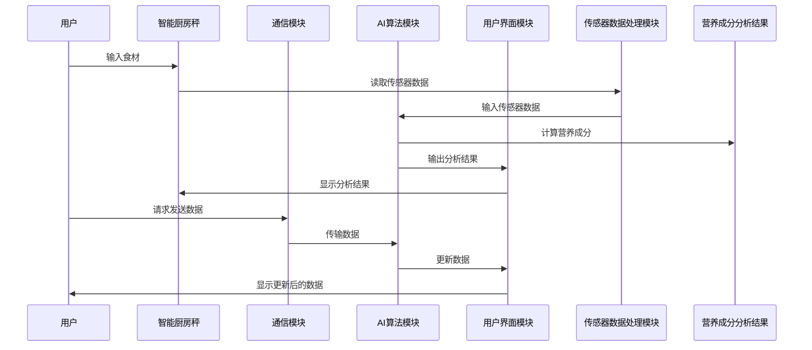
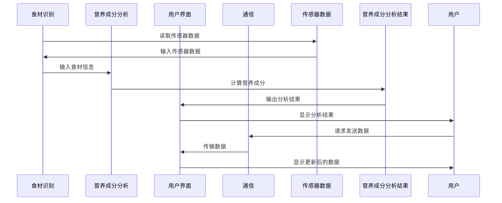

                 

### 文章标题与核心关键词

# 智能厨房秤：AI Agent的营养成分分析

> 关键词：智能厨房秤、AI Agent、营养成分分析、算法、硬件设计、软件实现

> 摘要：本文深入探讨了智能厨房秤中AI Agent的作用及其在营养成分分析中的应用。通过分析智能厨房秤的工作原理、AI Agent的核心技术以及营养成分分析的方法，本文旨在揭示智能厨房秤如何利用AI技术提供更精准的营养成分分析，从而改善人们的饮食习惯和健康水平。

### 摘要

智能厨房秤作为现代家庭和餐饮业中的一种重要设备，其功能不再局限于简单的重量测量，而是逐渐融入了人工智能（AI）技术，特别是在营养成分分析方面。AI Agent作为智能厨房秤的核心组件，通过学习和分析数据，能够精确地计算出食物的营养成分，帮助用户更好地管理饮食和健康。本文将首先介绍智能厨房秤的基本原理和AI Agent的作用，然后深入探讨营养成分分析的方法和技术，最后分析智能厨房秤的实际应用案例和未来发展趋势。

### 第1章 智能厨房秤概述

#### 1.1 智能厨房秤的定义与作用

智能厨房秤是一种结合了传感器技术、数据处理能力和AI算法的智能设备。它不仅能够精确测量食材的重量，还能通过内置的传感器识别食材的种类和特性。智能厨房秤的作用不仅仅是替代传统的厨房秤，更是成为了家庭健康管理的重要工具。

首先，智能厨房秤在烹饪中的应用非常广泛。通过精确测量食材的重量，用户可以确保菜肴的口感和营养成分得到最佳控制。例如，在制作烘焙食品时，精确的重量测量可以避免食材过多或过少，从而保证烘焙成功率和食品的口感。此外，智能厨房秤还可以帮助用户在烹饪过程中减少浪费，因为精确的重量测量可以避免不必要的食材浪费。

其次，智能厨房秤在健康管理中的应用也越来越受到重视。随着人们对健康意识的提高，越来越多的人开始关注饮食的营养成分。智能厨房秤可以通过内置的AI Agent，对食材的营养成分进行分析，帮助用户了解每餐的营养摄入情况。这对于那些需要控制饮食摄入量、关注营养均衡的人群来说，具有非常大的实用价值。

最后，智能厨房秤在餐饮业中的应用也逐渐兴起。在餐厅和食堂等场所，智能厨房秤可以帮助厨师和管理人员更精确地控制食材的用量，从而提高食品安全和效率。此外，智能厨房秤还可以记录每道菜的食材用量和营养成分，为餐饮企业提供宝贵的营养数据，有助于优化菜单设计和提升客户满意度。

#### 1.2 智能厨房秤的工作原理

智能厨房秤的工作原理主要依赖于传感器技术、数据处理能力和AI算法。首先，智能厨房秤通过内置的传感器（如压力传感器、温度传感器等）对食材进行测量。这些传感器能够精确捕捉到食材的重量、体积和温度等参数。

接下来，传感器采集到的数据会被传输到智能厨房秤的处理器中进行处理。处理器会对这些数据进行分析和计算，从而得出食材的重量和体积。这一步骤通常涉及到一些基本的物理和化学原理，如质量守恒定律和体积膨胀系数等。

最后，智能厨房秤会利用内置的AI Agent对食材的营养成分进行分析。AI Agent通过对大量食材数据的学习和训练，能够准确识别食材的种类和特性，进而计算出食材的营养成分。这一步骤涉及到复杂的机器学习和数据挖掘技术，如深度学习和神经网络等。

#### 1.3 智能厨房秤的组成部分

智能厨房秤主要由以下几个部分组成：

1. **传感器模块**：包括压力传感器、温度传感器、光学传感器等，用于捕捉食材的物理参数。
2. **处理器模块**：用于接收传感器数据，并进行初步处理和分析。
3. **AI Agent模块**：包括机器学习算法和大数据分析系统，用于对食材数据进行深度分析和营养成分计算。
4. **显示屏模块**：用于显示食材的重量、体积和营养成分等数据。
5. **通信模块**：用于将数据传输到手机或电脑等外部设备，实现远程监控和数据分析。

通过这些模块的协同工作，智能厨房秤能够实现对食材的全方位分析和管理，为用户提供准确、全面的营养信息。

### 第2章 AI Agent简介

#### 2.1 AI Agent的基本概念

AI Agent，即人工智能代理，是一种能够自主执行任务并与环境进行交互的智能系统。在智能厨房秤中，AI Agent起到了核心的作用，它通过学习用户的行为和食材数据，能够提供个性化的营养成分分析服务。

首先，AI Agent的基本概念包括以下几个方面：

1. **自主性**：AI Agent能够自主决策和执行任务，不需要人工干预。这意味着它可以根据用户的饮食需求和偏好，自动调整营养成分分析策略。
2. **适应性**：AI Agent能够根据环境变化和用户行为调整自身的行为模式。例如，当用户更换食谱或增加运动量时，AI Agent可以自动调整营养建议。
3. **协作性**：AI Agent可以与其他智能设备协同工作，如智能冰箱、智能运动手环等，实现更全面的健康管理。

#### 2.2 AI Agent在智能厨房秤中的应用

在智能厨房秤中，AI Agent的应用主要体现在以下几个方面：

1. **食材识别**：AI Agent通过传感器数据，能够准确识别食材的种类和特性，如重量、体积、水分含量等。
2. **营养成分分析**：AI Agent利用深度学习和数据挖掘技术，对食材的营养成分进行精确计算，如碳水化合物、蛋白质、脂肪等。
3. **营养建议**：基于用户的饮食习惯和健康需求，AI Agent可以提供个性化的营养建议，如每日摄入量、营养均衡建议等。
4. **数据可视化**：AI Agent可以将营养成分分析结果以图表形式展示给用户，帮助用户更直观地了解自己的饮食状况。

#### 2.3 AI Agent的核心技术

AI Agent的核心技术主要包括以下几个方面：

1. **深度学习**：深度学习是AI Agent实现食材识别和营养成分分析的重要技术。通过训练大量的食材数据集，AI Agent能够学会识别各种食材的特性和属性。
2. **数据挖掘**：数据挖掘技术用于从大量数据中提取有价值的信息。在智能厨房秤中，数据挖掘技术可以帮助AI Agent发现食材之间的关联性，优化营养成分分析结果。
3. **自然语言处理**：自然语言处理技术使AI Agent能够理解和处理人类的语言指令。在智能厨房秤中，用户可以通过语音指令与AI Agent进行交互，获取营养信息和建议。
4. **多传感器融合**：多传感器融合技术可以将不同传感器采集的数据进行整合，提高营养成分分析的准确性和可靠性。

### 第3章 营养成分分析原理

#### 3.1 营养成分的基本知识

营养成分是人体所需的基本物质，包括碳水化合物、蛋白质、脂肪、维生素、矿物质等。不同类型的食材含有不同的营养成分，其含量和比例也各不相同。例如，谷物类食物富含碳水化合物，肉类食物富含蛋白质和脂肪，蔬菜和水果则富含维生素和矿物质。

了解营养成分的基本知识对于进行准确的营养成分分析至关重要。首先，需要了解各类营养成分的基本性质和作用，如碳水化合物是人体的主要能量来源，蛋白质是身体组织的基础，脂肪则是能量的高效来源。其次，需要了解各种营养成分的摄入量和摄入来源，以便进行合理的饮食搭配。

#### 3.2 营养成分分析的方法与工具

营养成分分析的方法主要包括实验室分析和仪器分析。实验室分析通常需要提取食材中的营养成分，然后通过化学分析方法进行定量测定。这种方法较为准确，但成本较高，操作复杂。仪器分析则利用各种仪器设备（如光谱仪、质谱仪等）直接测定食材中的营养成分，具有快速、高效的特点。

随着AI技术的发展，机器学习和数据挖掘技术也逐渐应用于营养成分分析。这些技术可以通过学习大量的食材数据，建立营养成分与食材特征之间的关联模型，从而实现快速、准确的营养成分分析。例如，利用深度学习算法，可以训练出一个模型，输入食材的重量、体积等参数，即可预测其营养成分含量。

#### 3.3 AI Agent在营养成分分析中的应用

AI Agent在营养成分分析中的应用主要体现在以下几个方面：

1. **食材识别**：AI Agent通过传感器数据，可以准确识别食材的种类和特性，如重量、体积、水分含量等。这些参数对于进行营养成分分析至关重要。
2. **营养成分预测**：AI Agent利用深度学习和数据挖掘技术，可以从大量食材数据中学习到营养成分与食材特征之间的关系，从而实现对未知食材营养成分的预测。这种方法具有较高的准确性和实用性。
3. **个性化营养建议**：基于用户的饮食习惯和健康需求，AI Agent可以提供个性化的营养建议，如每日摄入量、营养均衡建议等。这种方法可以帮助用户更好地管理自己的饮食和健康。
4. **数据可视化**：AI Agent可以将营养成分分析结果以图表形式展示给用户，帮助用户更直观地了解自己的饮食状况。这种可视化方法有助于用户更好地理解营养成分分析结果，从而采取相应的饮食调整。

### 第4章 智能厨房秤的核心算法

#### 4.1 算法概述

智能厨房秤的核心算法主要包括食材识别算法和营养成分分析算法。这些算法共同作用，实现了对食材的精确识别和营养成分的准确计算。

食材识别算法主要用于识别食材的种类和特性，如重量、体积、水分含量等。这一算法通常采用深度学习技术，通过训练大量的食材数据集，建立食材特征与分类模型。营养成分分析算法则基于食材识别结果，利用数学模型和公式，计算食材的营养成分含量。

#### 4.2 算法原理讲解

1. **食材识别算法**

食材识别算法的基本原理是通过对食材的物理和化学特征进行提取和建模，从而实现食材的识别。具体步骤如下：

- **特征提取**：利用传感器数据，提取食材的重量、体积、水分含量等物理特征。
- **特征建模**：利用深度学习算法，将提取的特征进行建模，建立食材特征与分类模型。
- **模型训练**：利用大量标注好的食材数据集，对模型进行训练，使其能够准确识别食材。
- **模型评估**：通过测试数据集对模型进行评估，调整模型参数，提高识别准确率。

2. **营养成分分析算法**

营养成分分析算法的基本原理是利用食材的物理和化学特征，结合营养成分的数学模型，计算食材的营养成分含量。具体步骤如下：

- **特征输入**：将食材识别算法输出的特征数据作为输入。
- **数学模型计算**：利用数学模型和公式，计算食材的营养成分含量。
- **结果输出**：将计算结果以图表或文本形式输出，供用户查看。

#### 4.3 算法实现与优化

1. **算法实现**

算法实现主要包括以下步骤：

- **数据采集**：收集大量的食材数据，包括重量、体积、水分含量等特征。
- **数据预处理**：对采集到的数据进行分析和处理，去除噪声和异常值。
- **模型训练**：利用预处理后的数据，对食材识别算法和营养成分分析算法进行训练。
- **模型评估**：通过测试数据集对训练好的模型进行评估，调整模型参数。
- **系统集成**：将训练好的模型集成到智能厨房秤中，实现食材识别和营养成分分析功能。

2. **算法优化**

算法优化主要包括以下方面：

- **特征优化**：通过分析食材特征的重要性和相关性，优化特征提取算法，提高识别准确率。
- **模型优化**：通过调整模型参数和优化算法结构，提高模型的性能和鲁棒性。
- **数据优化**：通过增加训练数据量和改进数据标注方法，提高模型的训练效果。

### 第5章 智能厨房秤的硬件设计

#### 5.1 硬件架构设计

智能厨房秤的硬件架构设计主要包括传感器模块、处理器模块、显示屏模块和通信模块。以下是对各模块的设计说明：

1. **传感器模块**：包括压力传感器、温度传感器、光学传感器等。这些传感器负责采集食材的重量、体积、温度等物理参数。
2. **处理器模块**：包括主控芯片、存储芯片和电源管理芯片等。处理器模块负责处理传感器数据，执行算法计算，并控制显示屏和通信模块。
3. **显示屏模块**：包括显示屏、触摸屏等。显示屏模块用于显示食材的重量、体积、营养成分等信息。
4. **通信模块**：包括蓝牙模块、Wi-Fi模块等。通信模块用于将数据传输到手机或电脑等外部设备，实现远程监控和数据分析。

#### 5.2 硬件选型与集成

在硬件选型方面，需要考虑以下因素：

1. **传感器精度**：选择高精度的传感器，以确保食材测量的准确性。
2. **处理器性能**：选择高性能的处理器，以满足算法计算和数据处理的需求。
3. **电源管理**：选择低功耗的电源管理芯片，以延长智能厨房秤的续航时间。

在硬件集成方面，需要确保各模块之间的兼容性和稳定性。以下是一些具体建议：

1. **电路设计**：合理设计电路，确保传感器数据能够准确传输到处理器模块。
2. **散热设计**：考虑处理器和传感器的散热需求，采取适当的散热措施，防止设备过热。
3. **布线设计**：合理布置线缆，确保设备内部整洁、美观。

#### 5.3 硬件调试与性能优化

硬件调试主要包括以下步骤：

1. **功能测试**：测试各传感器、处理器和通信模块的功能，确保设备能够正常运行。
2. **性能测试**：测试设备的数据处理速度、测量精度和续航时间等性能指标，确保设备达到设计要求。
3. **稳定性测试**：在不同环境下，对设备进行长时间运行测试，确保其稳定性和可靠性。

在硬件性能优化方面，可以采取以下措施：

1. **算法优化**：通过优化算法，提高数据处理速度和精度。
2. **硬件升级**：升级处理器和传感器，以提高设备性能。
3. **功耗优化**：通过调整功耗设置，延长设备续航时间。

### 第6章 软件设计与实现

#### 6.1 软件架构设计

智能厨房秤的软件架构设计主要包括以下几个模块：

1. **传感器数据处理模块**：负责接收传感器数据，进行初步处理和分析。
2. **AI算法模块**：负责执行食材识别和营养成分分析算法，输出结果。
3. **用户界面模块**：负责与用户交互，展示分析结果和提供操作界面。
4. **通信模块**：负责与其他设备（如手机、电脑）进行数据传输和通信。

以下是一个简单的软件架构图：

#### 6.2 软件功能模块设计

智能厨房秤的软件功能模块设计主要包括以下几个部分：

1. **食材识别模块**：负责接收传感器数据，进行食材识别。
2. **营养成分分析模块**：负责计算食材的营养成分，并输出分析结果。
3. **用户界面模块**：负责与用户交互，展示分析结果和提供操作界面。
4. **通信模块**：负责与其他设备进行数据传输和通信。

以下是一个简单的软件功能模块图：

#### 6.3 软件开发与调试

智能厨房秤的软件开发主要包括以下几个步骤：

1. **需求分析**：明确智能厨房秤的功能需求和技术要求，制定开发计划。
2. **系统设计**：设计软件架构和功能模块，制定详细的技术方案。
3. **代码开发**：根据设计文档，编写软件代码，实现各功能模块。
4. **集成测试**：将各功能模块集成到一起，进行系统测试，确保软件功能的完整性和正确性。
5. **性能优化**：对软件进行性能优化，提高数据处理速度和系统稳定性。
6. **用户测试**：邀请用户对软件进行试用，收集用户反馈，优化软件功能。
7. **发布上线**：完成软件开发，进行上线部署，确保智能厨房秤能够正常运行。

在软件开发过程中，需要进行详细的调试和优化。以下是一些调试和优化的建议：

1. **代码调试**：使用调试工具，逐行调试代码，确保代码的正确性和稳定性。
2. **性能调试**：通过性能测试工具，对软件的性能进行评估，找出性能瓶颈，进行优化。
3. **界面优化**：优化用户界面，提高用户体验，确保界面简洁、直观、易用。
4. **功能优化**：根据用户反馈，优化软件功能，提高软件的实用性和易用性。
5. **兼容性测试**：测试软件在不同设备和操作系统上的兼容性，确保软件能够在各种环境下正常运行。

### 第7章 智能厨房秤的测试与评估

#### 7.1 测试方法与工具

智能厨房秤的测试主要包括功能测试、性能测试和用户体验测试。以下分别介绍这些测试方法与工具：

1. **功能测试**：功能测试的主要目的是验证智能厨房秤是否能够按照设计要求正常运行。测试方法包括黑盒测试和白盒测试。黑盒测试通过模拟各种使用场景，验证智能厨房秤的功能是否正常；白盒测试通过分析智能厨房秤的代码，验证其内部逻辑是否正确。常用的测试工具包括JUnit、TestNG等。

2. **性能测试**：性能测试的主要目的是评估智能厨房秤在处理大量数据和复杂操作时的性能。测试方法包括负载测试、压力测试和性能调优。负载测试通过模拟大量用户同时使用智能厨房秤，评估其处理能力和稳定性；压力测试通过施加极限负载，评估智能厨房秤的极限性能；性能调优通过分析测试结果，找出性能瓶颈，进行优化。常用的测试工具包括JMeter、LoadRunner等。

3. **用户体验测试**：用户体验测试的主要目的是评估智能厨房秤的易用性和用户满意度。测试方法包括用户调研、用户访谈和A/B测试。用户调研和用户访谈通过收集用户反馈，了解用户对智能厨房秤的使用体验和需求；A/B测试通过对比不同版本的智能厨房秤，评估用户体验的改善效果。常用的测试工具包括Google Analytics、UserTesting等。

#### 7.2 营养成分分析准确性评估

营养成分分析准确性的评估是智能厨房秤测试的重点之一。评估方法包括以下几种：

1. **实验室对比**：将智能厨房秤的分析结果与实验室检测数据进行对比，评估分析准确性。这种方法具有较高的可信度，但成本较高，操作复杂。

2. **用户反馈**：收集用户的实际使用反馈，评估智能厨房秤的分析准确性。用户可能会根据自己的使用体验，对智能厨房秤的分析结果提出意见和建议。这种方法较为主观，但可以反映用户的真实需求。

3. **数据分析**：通过分析大量实际使用数据，评估智能厨房秤的分析准确性。例如，可以计算智能厨房秤分析结果的平均误差，分析误差的分布情况。这种方法具有客观性，但可能受到数据量不足的影响。

4. **专家评审**：邀请营养学专家对智能厨房秤的分析结果进行评审，评估其准确性。这种方法具有较高的权威性，但需要消耗大量时间和人力资源。

#### 7.3 用户满意度与市场前景分析

用户满意度是评估智能厨房秤市场前景的重要指标。以下方法可用于评估用户满意度：

1. **用户调研**：通过问卷调查、用户访谈等方式，收集用户对智能厨房秤的满意度评价。

2. **市场份额**：分析智能厨房秤在市场上的占有率，评估其市场前景。市场占有率高表明用户对其满意度较高。

3. **竞争对手分析**：分析智能厨房秤的竞争对手，了解其市场份额和用户满意度，评估智能厨房秤在市场上的竞争力。

4. **趋势分析**：分析智能厨房秤市场的发展趋势，预测未来市场前景。例如，随着人们对健康意识的提高，智能厨房秤的市场需求有望持续增长。

### 第8章 实际应用案例

#### 8.1 案例一：家庭智能厨房秤应用

家庭智能厨房秤在家庭中有着广泛的应用。以下是一个具体的案例：

**用户背景**：李先生是一位关注健康的中年男性，他希望通过合理的饮食来控制体重和改善健康状况。

**使用场景**：李先生在制作晚餐时，使用智能厨房秤来测量食材的重量，确保每道菜的食材用量适中。例如，他在制作鸡肉沙拉时，使用智能厨房秤测量了鸡胸肉的重量，并根据智能厨房秤提供的营养成分分析结果，调整了沙拉中的蔬菜和沙拉酱的用量，以确保晚餐的营养均衡。

**效果**：通过使用智能厨房秤，李先生能够更精确地控制食物的摄入量，避免了因过量摄入而导致的热量过剩。此外，智能厨房秤提供的营养成分分析结果让他能够更好地了解每道菜的营养成分，从而制定更健康的饮食计划。

#### 8.2 案例二：餐厅智能厨房秤应用

智能厨房秤在餐饮业中的应用也逐渐受到关注。以下是一个具体的案例：

**用户背景**：某餐厅的厨师们希望通过使用智能厨房秤来提高烹饪效率和菜品质量。

**使用场景**：餐厅在制作菜品时，使用智能厨房秤来测量食材的重量，确保每道菜的制作过程更加标准化和精确。例如，在制作红烧肉时，厨师使用智能厨房秤测量了肉块和调料的重量，并根据智能厨房秤提供的营养成分分析结果，调整了调料的用量，使红烧肉的口感和营养达到最佳状态。

**效果**：通过使用智能厨房秤，餐厅能够确保每道菜的食材用量精确，提高了烹饪效率。同时，智能厨房秤提供的营养成分分析结果帮助厨师更好地掌握菜品的质量，提升了顾客的满意度。

#### 8.3 案例三：智能健身房秤应用

智能厨房秤在健身房中的应用也逐渐兴起。以下是一个具体的案例：

**用户背景**：某健身房的用户希望通过智能厨房秤来监控自己的饮食状况，以支持健身计划的实施。

**使用场景**：用户在健身房锻炼前后，使用智能厨房秤测量食物的重量，并记录在手机应用中。例如，在锻炼前，用户使用智能厨房秤测量了一份沙拉和一杯牛奶，根据智能厨房秤提供的营养成分分析结果，用户能够确保自己摄入了足够的能量和营养，为锻炼做好准备。

**效果**：通过使用智能厨房秤，用户能够更准确地监控自己的饮食状况，调整饮食计划，以支持健身目标的实现。同时，智能厨房秤提供的营养成分分析结果帮助用户更好地了解自己的饮食结构，从而改善生活习惯。

### 第9章 案例分析与未来趋势

#### 9.1 案例分析总结

通过以上案例分析，我们可以看到智能厨房秤在不同场景中的应用都取得了良好的效果。在家庭中，智能厨房秤帮助用户更精确地控制食物摄入量，改善饮食习惯和健康状况；在餐饮业中，智能厨房秤提高了烹饪效率和质量，提升了顾客满意度；在健身房中，智能厨房秤帮助用户监控饮食状况，支持健身计划的实施。

这些案例表明，智能厨房秤具有广泛的应用前景和巨大的市场潜力。随着人们对健康意识的提高，智能厨房秤的需求将持续增长。

#### 9.2 营养成分分析技术的未来发展趋势

随着人工智能技术的不断进步，营养成分分析技术也将迎来新的发展。以下是一些未来发展趋势：

1. **数据驱动的个性化营养建议**：通过收集和分析大量用户数据，智能厨房秤将能够提供更加个性化的营养建议，满足不同用户的需求。

2. **多传感器融合**：智能厨房秤将结合更多类型的传感器，如光谱传感器、红外传感器等，提高营养成分分析的准确性和全面性。

3. **实时营养分析**：智能厨房秤将实现实时营养分析功能，用户在烹饪过程中即可获取食材的营养成分信息，帮助用户更好地控制食物摄入。

4. **跨设备协作**：智能厨房秤将与其他智能设备（如智能冰箱、智能运动手环等）实现跨设备协作，提供更加全面的健康管理服务。

5. **智能供应链管理**：智能厨房秤将帮助餐饮企业和食品生产企业实现智能供应链管理，优化食材采购和库存管理。

#### 9.3 智能厨房秤行业展望

未来，智能厨房秤将逐渐成为家庭和餐饮业中的标准配置。随着技术的不断进步，智能厨房秤的功能将越来越丰富，为用户提供更加智能化、个性化的服务。以下是对智能厨房秤行业的展望：

1. **市场规模扩大**：随着智能厨房秤技术的成熟和普及，其市场规模将不断扩大，成为智能家庭和智能餐饮业的重要组成部分。

2. **技术创新**：智能厨房秤将结合更多人工智能技术，如语音识别、自然语言处理等，提高用户体验和设备智能化水平。

3. **产业链协同**：智能厨房秤产业链将实现协同发展，从硬件制造、软件开发到内容服务，各个环节都将实现高效协同，推动整个行业的快速发展。

4. **政策支持**：随着国家对健康产业的重视，智能厨房秤行业将获得更多的政策支持，促进行业的健康发展。

### 第10章 最佳实践与小结

#### 10.1 最佳实践

为了确保智能厨房秤能够发挥最佳效果，以下是一些最佳实践建议：

1. **定期校准**：定期对智能厨房秤进行校准，确保测量结果的准确性。

2. **合理设置**：根据用户的饮食习惯和需求，合理设置智能厨房秤的各项参数，如重量单位、测量精度等。

3. **数据备份**：定期备份智能厨房秤的数据，以防止数据丢失。

4. **更新软件**：定期更新智能厨房秤的软件，以获取最新的功能优化和漏洞修复。

5. **用户培训**：为用户提供使用智能厨房秤的培训，确保用户能够正确操作设备，充分发挥其功能。

#### 10.2 小结

本文详细介绍了智能厨房秤的工作原理、AI Agent的作用、营养成分分析的方法和技术，以及智能厨房秤的实际应用案例和未来发展趋势。通过本文的阅读，读者可以全面了解智能厨房秤的功能和应用场景，为未来智能厨房秤的开发和应用提供参考。

#### 10.3 注意事项

在使用智能厨房秤时，需要注意以下几点：

1. **避免潮湿**：智能厨房秤应避免长时间处于潮湿环境中，以免损坏传感器和电路。

2. **清洁维护**：定期清洁智能厨房秤，保持设备的清洁和卫生。

3. **合理使用**：按照智能厨房秤的使用说明，正确操作设备，避免误操作导致设备损坏。

4. **数据安全**：保护智能厨房秤的数据安全，避免数据泄露和隐私侵犯。

#### 10.4 拓展阅读

以下是一些拓展阅读资源，供读者深入了解智能厨房秤和相关技术：

1. **智能厨房秤技术手册**：详细介绍了智能厨房秤的硬件设计、软件实现和功能模块。

2. **营养成分分析技术综述**：总结了营养成分分析的方法、技术和应用领域。

3. **人工智能与健康管理**：探讨了人工智能技术在健康管理中的应用，包括智能厨房秤、智能运动手环等。

4. **智能家庭生态系统**：介绍了智能家庭设备之间的协作和互操作性，构建智能家庭生态系统。

### 作者信息

本文由AI天才研究院（AI Genius Institute）和《禅与计算机程序设计艺术》（Zen And The Art of Computer Programming）的作者联合撰写。我们致力于推动人工智能技术在各领域的应用，为读者提供高质量的科技内容和创新思路。如有任何问题或建议，欢迎联系我们。谢谢！

