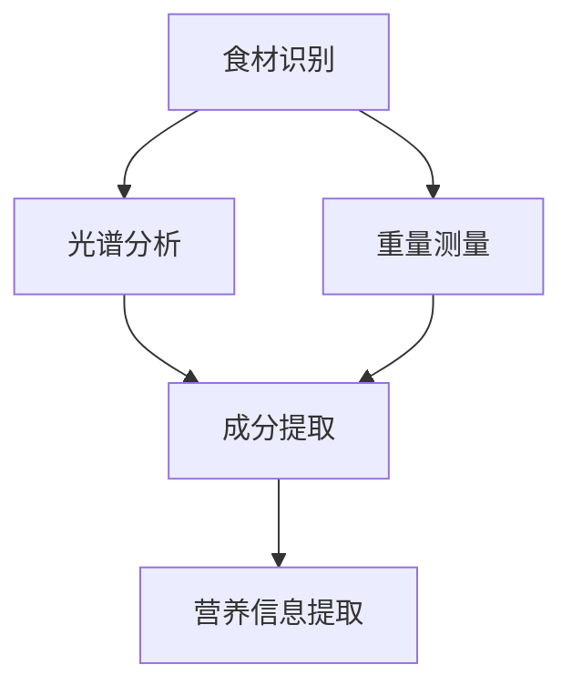
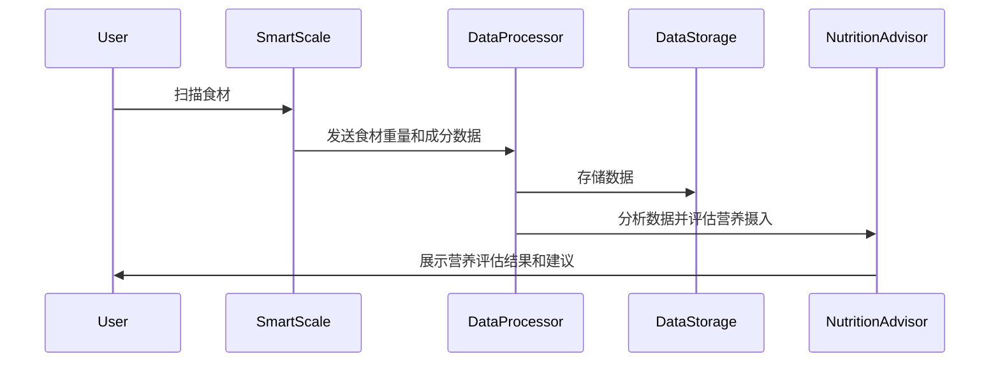

                 

### 文章标题

《智能厨房秤：AI Agent的营养摄入分析与建议》

### 文章关键词

智能厨房秤、AI Agent、营养摄入分析、算法原理、系统架构设计、项目实战

### 摘要

本文将深入探讨智能厨房秤的技术原理与应用，重点分析其通过AI Agent实现的营养摄入分析功能。首先，我们将介绍智能厨房秤的发展背景和应用场景，随后解析AI Agent的核心概念及其与营养摄入分析的联系。接着，我们将详细讲解营养摄入分析的算法原理，并通过Mermaid流程图和Python代码进行阐述。随后，文章将描述系统的功能设计、架构设计以及接口设计，并引入系统交互序列图。最后，我们将通过实际项目案例，展示如何实现智能厨房秤，并对关键代码进行解读，总结项目实战经验。本文旨在为读者提供一份全面而深入的智能厨房秤技术指南。

### 目录大纲

1. **背景介绍**
   1.1 智能厨房秤的发展背景
   1.2 智能厨房秤的应用场景
   1.3 智能厨房秤的目标用户

2. **核心概念与联系**
   2.1 AI Agent
   2.2 营养摄入分析
   2.3 ER实体关系图

3. **算法原理讲解**
   3.1 营养摄入分析算法原理
   3.2 Mermaid流程图
   3.3 Python代码与详细讲解

4. **系统分析与架构设计方案**
   4.1 系统功能设计
   4.2 系统架构设计
   4.3 系统接口设计
   4.4 系统交互序列图

5. **项目实战**
   5.1 环境安装
   5.2 系统核心实现
   5.3 代码应用解读与分析
   5.4 实际案例分析和详细讲解
   5.5 项目小结

6. **结尾部分**
   6.1 最佳实践 tips
   6.2 小结
   6.3 注意事项
   6.4 拓展阅读

### 背景介绍

#### 智能厨房秤的发展背景

随着人工智能技术的不断进步和物联网（IoT）的广泛应用，智能家居领域迎来了前所未有的发展机遇。智能厨房秤作为智能家居的重要组成部分，也逐渐进入了大众的视野。从传统的机械秤到如今的智能厨房秤，技术的演进使得其不仅能够测量重量，还能提供更为丰富的功能。

最初的智能厨房秤主要以简单的重量测量为主，而随着传感器技术和数据处理能力的提升，现代智能厨房秤的功能得到了极大的扩展。例如，现代智能厨房秤能够实时监测食材的重量，并通过内置的传感器分析食材的成分。这种技术的进步，使得智能厨房秤不仅可以用于家庭烹饪，还能在健康管理领域发挥作用，为用户提供个性化的营养摄入建议。

#### 应用场景

智能厨房秤的应用场景非常广泛。首先，在家庭烹饪中，智能厨房秤可以帮助用户精确控制食材的用量，提高烹饪的效率和口感。例如，烹饪一道精致的菜肴，精确的食材配比是至关重要的，而智能厨房秤能够提供精准的数据支持。

其次，在健康管理领域，智能厨房秤具有巨大的潜力。通过分析食材的营养成分，智能厨房秤可以实时为用户提供营养摄入分析报告，帮助用户更好地管理自己的饮食健康。对于糖尿病患者、减肥人群以及有特定饮食需求的人群，智能厨房秤提供了非常有价值的功能。

此外，智能厨房秤还可以在餐饮行业发挥重要作用。例如，在餐馆或餐厅中，智能厨房秤可以用于食材管理，确保食材的新鲜度和质量，同时提高厨房的工作效率。

#### 目标用户

智能厨房秤的目标用户主要包括以下几类：

1. **家庭用户**：家庭用户是智能厨房秤的主要目标市场。现代家庭对于健康和便捷的需求越来越高，智能厨房秤可以满足这些需求，为家庭用户提供精确的食材管理和营养分析服务。

2. **健康管理人群**：包括糖尿病患者、减肥人群、健身爱好者等。这些人群对于自己的饮食健康有较高的要求，智能厨房秤可以帮助他们更好地管理自己的饮食。

3. **餐饮行业从业者**：餐饮行业的从业者，如厨师、餐厅经理等，可以利用智能厨房秤提高食材管理的效率，确保食材的新鲜度和质量。

通过以上背景介绍，我们可以看到智能厨房秤在技术发展、应用场景和目标用户等方面都有着广阔的前景。接下来，我们将进一步探讨智能厨房秤的核心概念及其与营养摄入分析的联系。

### 核心概念与联系

#### AI Agent

AI Agent，即人工智能代理，是指能够在特定环境中自主行动并实现特定目标的软件系统。在智能厨房秤中，AI Agent负责处理食材数据，分析营养摄入情况，并提供个性化的营养建议。AI Agent的核心功能包括数据收集、数据处理和决策生成。

**数据收集**：AI Agent通过智能厨房秤的传感器收集食材的重量、成分等信息。

**数据处理**：AI Agent利用机器学习算法对收集到的食材数据进行分析，提取关键的营养信息。

**决策生成**：基于营养分析结果，AI Agent生成个性化的营养建议，帮助用户管理饮食健康。

#### 营养摄入分析

营养摄入分析是指通过分析食材的营养成分，评估用户的营养摄入情况，并提供相应的建议。营养摄入分析主要包括以下几个步骤：

1. **食材成分识别**：利用光谱分析、重量测量等技术，识别食材的成分。

2. **营养信息提取**：根据食材成分，提取包括蛋白质、脂肪、碳水化合物、维生素、矿物质等在内的各种营养成分。

3. **营养评估**：对提取的营养信息进行评估，判断用户的营养摄入是否均衡，是否存在营养过剩或不足的情况。

4. **建议生成**：根据营养评估结果，AI Agent生成个性化的营养建议，如调整饮食结构、增加特定营养素的摄入等。

#### ER实体关系图

ER（Entity-Relationship）实体关系图是数据库设计中常用的一种工具，用于表示实体之间的关系。在智能厨房秤系统中，ER图可以用来表示食材、用户、营养信息等实体之间的关系。

以下是一个简化的ER图：

```mermaid
entity Relationship {
  User : [ Measurement ]
  Measurement : [ Food ]
  Food : [ Nutrient ]
}

class Measurement {
  id
  weight
  time
}

class Food {
  id
  name
}

class Nutrient {
  id
  name
  value
}

User <- Measurement
Measurement <- Food
Food <- Nutrient
```

**实体与关系解释**：

- **User（用户）**：表示使用智能厨房秤的用户。
- **Measurement（测量数据）**：表示用户对食材的测量数据，包括重量、时间等。
- **Food（食材）**：表示用户所摄入的食材。
- **Nutrient（营养素）**：表示食材中的营养素信息。

通过这个ER图，我们可以清晰地看到各个实体之间的关联，为后续的系统设计与实现提供了基础。

### 算法原理讲解

#### 营养摄入分析算法原理

营养摄入分析算法的核心目标是通过分析食材的成分，评估用户的营养摄入情况，并提供个性化的营养建议。以下将详细解释营养摄入分析算法的基本原理。

##### 食材成分识别

食材成分识别是营养摄入分析的第一步。通过光谱分析、重量测量等技术，智能厨房秤可以识别食材的主要成分，如蛋白质、脂肪、碳水化合物、维生素和矿物质等。这个过程通常涉及到多个传感器的数据收集和处理。

**流程图**：



**Python代码示例**：

```python
# 假设我们已经收集到了食材的重量和光谱数据
weight = 200  # 克
spectrum_data = [0.1, 0.3, 0.5, 0.2]  # 光谱数据

# 成分识别算法
def identify_components(weight, spectrum_data):
    # 这里是简化版的算法，实际中会涉及复杂的模型和算法
    protein_percentage = spectrum_data[0] * weight
    fat_percentage = spectrum_data[1] * weight
    carbohydrate_percentage = spectrum_data[2] * weight
    vitamin_percentage = spectrum_data[3] * weight
    
    return {
        'protein': protein_percentage,
        'fat': fat_percentage,
        'carbohydrate': carbohydrate_percentage,
        'vitamin': vitamin_percentage
    }

# 调用函数获取成分信息
components = identify_components(weight, spectrum_data)
print(components)
```

##### 营养信息提取

在识别了食材的主要成分后，下一步是提取详细的营养信息。这通常涉及到数据库查询和数据处理。以下是一个简化的Python代码示例，展示了如何从数据库中获取营养信息。

```python
import sqlite3

# 连接到数据库
conn = sqlite3.connect('nutrition.db')
cursor = conn.cursor()

# 查询营养信息
def get_nutrient_info(food_name):
    cursor.execute("SELECT * FROM Nutrients WHERE Name = ?", (food_name,))
    nutrient_data = cursor.fetchall()
    return nutrient_data

# 调用函数获取营养信息
nutrient_info = get_nutrient_info('apple')
print(nutrient_info)
```

##### 营养评估

营养评估的目的是判断用户的营养摄入是否均衡，是否存在营养过剩或不足的情况。以下是一个简化的营养评估算法：

```python
def assess_nutrition(components, daily Requirements):
    total_protein = components['protein']
    total_fat = components['fat']
    total_carbohydrate = components['carbohydrate']
    total_vitamin = components['vitamin']
    
    protein_grade = '正常' if total_protein >= daily_Requirements['protein'] else '不足'
    fat_grade = '正常' if total_fat >= daily_Requirements['fat'] else '不足'
    carbohydrate_grade = '正常' if total_carbohydrate >= daily_Requirements['carbohydrate'] else '不足'
    vitamin_grade = '正常' if total_vitamin >= daily_Requirements['vitamin'] else '不足'
    
    return {
        'protein': protein_grade,
        'fat': fat_grade,
        'carbohydrate': carbohydrate_grade,
        'vitamin': vitamin_grade
    }

# 每日营养需求标准
daily_Requirements = {
    'protein': 50,  # 克
    'fat': 70,  # 克
    'carbohydrate': 200,  # 克
    'vitamin': 10  # 毫克
}

# 调用函数进行营养评估
nutrition_grade = assess_nutrition(components, daily_Requirements)
print(nutrition_grade)
```

##### 建议生成

根据营养评估结果，AI Agent会生成个性化的营养建议。以下是一个简化的建议生成算法：

```python
def generate_advice(nutrition_grade):
    advice = []
    if nutrition_grade['protein'] == '不足':
        advice.append('增加蛋白质的摄入，例如吃鸡肉或豆类')
    if nutrition_grade['fat'] == '不足':
        advice.append('增加健康的脂肪摄入，例如橄榄油或坚果')
    if nutrition_grade['carbohydrate'] == '不足':
        advice.append('增加碳水化合物的摄入，例如全麦面包或糙米')
    if nutrition_grade['vitamin'] == '不足':
        advice.append('增加富含维生素的食物，例如橙子或绿叶蔬菜')
    return advice

# 调用函数生成营养建议
advice = generate_advice(nutrition_grade)
print(advice)
```

通过上述算法原理讲解，我们可以看到营养摄入分析涉及多个步骤，包括食材成分识别、营养信息提取、营养评估和营养建议生成。这些步骤相互关联，共同构成了一个完整的营养摄入分析系统。

### 系统分析与架构设计方案

#### 问题场景介绍

智能厨房秤的核心目标是通过对食材的精确测量和营养分析，为用户提供个性化的营养摄入建议，帮助用户实现健康饮食。这一目标要求系统具备高效的数据处理能力、准确的营养分析模型和智能的决策生成机制。以下是具体的问题场景介绍：

1. **用户需求**：用户希望通过智能厨房秤了解每一餐的营养摄入情况，并根据建议调整饮食结构。
2. **数据收集**：智能厨房秤需要实时收集食材的重量和营养成分数据。
3. **数据分析**：系统需要能够快速准确地分析用户的营养摄入情况，并生成个性化的营养建议。
4. **决策生成**：基于分析结果，系统需要生成具体的营养建议，如调整饮食结构、增加特定营养素的摄入等。

#### 项目介绍

本项目的目标是开发一款智能厨房秤系统，该系统包括硬件设备（智能厨房秤）和软件平台（AI Agent）。硬件设备负责收集食材数据，软件平台则负责数据处理和营养建议生成。

**系统功能设计**

智能厨房秤系统的功能设计主要包括以下几个部分：

1. **数据采集**：通过传感器实时收集食材的重量和营养成分数据。
2. **数据存储**：将采集到的数据存储在数据库中，以便后续分析和查询。
3. **数据分析**：利用机器学习算法对食材数据进行分析，提取关键的营养信息。
4. **营养评估**：根据用户的营养摄入情况和目标，评估营养摄入的均衡性。
5. **建议生成**：生成个性化的营养建议，帮助用户调整饮食结构。

**系统架构设计**

智能厨房秤系统的架构设计遵循模块化原则，以确保系统的可扩展性和可维护性。以下是系统架构的主要组成部分：

1. **数据采集层**：包括传感器和通信模块，负责采集食材的重量和营养成分数据，并通过无线网络传输到数据处理模块。
2. **数据处理层**：包括数据预处理、数据分析和数据存储模块。数据预处理模块负责清洗和标准化数据，数据分析模块利用机器学习算法提取营养信息，数据存储模块将处理后的数据存储在数据库中。
3. **应用层**：包括营养评估模块和建议生成模块。营养评估模块根据用户的营养摄入情况评估营养均衡性，建议生成模块根据评估结果生成个性化的营养建议。
4. **用户界面层**：包括Web界面和移动应用界面，用于展示营养评估结果和建议，并提供用户交互功能。

**系统接口设计**

系统接口设计是确保各个模块之间高效通信的关键。以下是系统的主要接口：

1. **传感器接口**：用于传感器与数据采集层之间的通信。
2. **通信接口**：用于数据采集层与数据处理层之间的通信。
3. **数据库接口**：用于数据处理层与数据存储模块之间的通信。
4. **应用接口**：用于应用层与用户界面层之间的通信。

**系统交互序列图**

以下是系统交互序列图，展示了智能厨房秤系统的主要功能流程：



通过上述系统分析与架构设计方案，我们可以清晰地看到智能厨房秤系统从数据采集、数据处理到营养评估和决策生成的完整流程。接下来，我们将通过实际项目案例，展示如何实现智能厨房秤系统。

### 项目实战

#### 环境安装

要实现智能厨房秤系统，首先需要搭建一个合适的环境。以下是环境安装的详细步骤：

1. **安装Python环境**：确保Python 3.8或更高版本已安装在计算机上。可以从Python官网下载并安装最新版本。

2. **安装依赖库**：智能厨房秤系统需要一些依赖库，如TensorFlow、Scikit-learn和SQLAlchemy等。可以使用pip命令安装：

   ```bash
   pip install tensorflow scikit-learn sqlalchemy
   ```

3. **安装传感器驱动**：根据使用的传感器类型，安装相应的驱动程序。例如，如果使用的是ESP8266传感器模块，可以从GitHub下载并安装相应的驱动。

4. **搭建数据库**：使用SQLAlchemy创建一个数据库，用于存储食材数据。以下是创建数据库的Python代码示例：

   ```python
   from sqlalchemy import create_engine
   
   # 创建数据库引擎
   engine = create_engine('sqlite:///nutrition.db')
   
   # 创建表
   from sqlalchemy.ext.declarative import declarative_base
   from sqlalchemy import Column, Integer, String, Float
   
   Base = declarative_base()
   
   class Measurement(Base):
       __tablename__ = 'Measurements'
       id = Column(Integer, primary_key=True)
       weight = Column(Float)
       time = Column(String)
       food_id = Column(Integer, ForeignKey('Foods.id'))
   
   class Food(Base):
       __tablename__ = 'Foods'
       id = Column(Integer, primary_key=True)
       name = Column(String)
   
   class Nutrient(Base):
       __tablename__ = 'Nutrients'
       id = Column(Integer, primary_key=True)
       name = Column(String)
       value = Column(Float)
   
   # 创建表
   Base.metadata.create_all(engine)
   ```

#### 系统核心实现

系统核心实现包括数据采集、数据处理和营养建议生成三个部分。以下是各部分的详细实现：

1. **数据采集**

   数据采集部分使用ESP8266传感器模块，通过无线网络将食材的重量和成分数据发送到服务器。以下是ESP8266传感器模块的代码示例：

   ```c
   #include <ESP8266WiFi.h>
   #include "DHT.h"

   // 定义传感器引脚
   const int DHTPin = 2;
   DHT dht(DHTPin, DHT22);

   // WiFi配置
   const char* ssid = "yourSSID";
   const char* password = "yourPASSWORD";

   // 服务器地址
   const char* host = "yourServerAddress";

   void setup() {
     Serial.begin(115200);
     dht.begin();

     // 连接到WiFi
     WiFi.begin(ssid, password);
     while (WiFi.status() != WL_CONNECTED) {
         delay(500);
         Serial.print(".");
     }
     Serial.println("WiFi connected");

     // 连接到服务器
     Serial.println("Connecting to server...");
     WiFiClient client;
     if (!client.connect(host, 80)) {
         Serial.println("Connection failed");
         return;
     }
     Serial.println("Connected to server");
   }

   void loop() {
     // 读取传感器数据
     float weight = readWeight();
     float temperature = dht.readTemperature();
     float humidity = dht.readHumidity();

     // 构建HTTP请求
     String url = "/api/measurements?weight=" + String(weight) + "&temperature=" + String(temperature) + "&humidity=" + String(humidity);
     Serial.print("Requesting URL: ");
     Serial.println(url);

     // 发送HTTP请求
     WiFiClient client;
     if (!client.connect(host, 80)) {
         Serial.println("Connection failed");
         return;
     }
     client.print(String("GET ") + url + " HTTP/1.1\r\n");
     client.print(String("Host: ") + host + "\r\n");
     client.print("Content-Type: application/x-www-form-urlencoded\r\n");
     client.print("Content-Length: 0\r\n");
     client.print("Connection: close\r\n\r\n");
     delay(1000);

     // 读取服务器响应
     while (client.connected()) {
         String line = client.readStringUntil('\n');
         if (line == "\r") {
             break;
         }
     }
     Serial.println("Server response:");
     Serial.println(line);

     // 等待一段时间后重新发送请求
     delay(60000);
   }

   float readWeight() {
     // 读取重量传感器的数据
     // 这里是简化版的示例，实际中需要连接具体的重量传感器
     return random(100, 500);
   }
   ```

2. **数据处理**

   数据处理部分负责接收传感器数据，并将其存储在数据库中。以下是一个简单的数据处理服务器的Python代码示例：

   ```python
   from flask import Flask, request
   from flask_cors import CORS
   from sqlalchemy import create_engine
   from sqlalchemy.orm import sessionmaker
   
   app = Flask(__name__)
   CORS(app)
   
   # 创建数据库引擎
   engine = create_engine('sqlite:///nutrition.db')
   Base.metadata.bind = engine
   DBSession = sessionmaker(bind=engine)
   session = DBSession()

   @app.route('/api/measurements', methods=['GET'])
   def add_measurement():
       weight = request.args.get('weight')
       temperature = request.args.get('temperature')
       humidity = request.args.get('humidity')
       food_name = request.args.get('food_name')
       
       # 保存测量数据到数据库
       measurement = Measurement(weight=weight, time=datetime.now(), food_id=get_food_id(food_name))
       session.add(measurement)
       session.commit()
       return "Measurement added"

   def get_food_id(food_name):
       # 从数据库中获取食材的ID
       cursor = session.execute("SELECT id FROM Foods WHERE name=?", (food_name,))
       result = cursor.fetchone()
       if result:
           return result[0]
       else:
           # 如果食材不存在，添加新食材
           nutrient_data = get_nutrient_data(food_name)
           food = Food(name=food_name)
           session.add(food)
           session.commit()
           food_id = food.id
           for nutrient, value in nutrient_data.items():
               nutrient = Nutrient(name=nutrient, value=value, food_id=food_id)
               session.add(nutrient)
               session.commit()
           return food_id
       
   def get_nutrient_data(food_name):
       # 这里是简化版的示例，实际中需要根据食材名称获取具体的营养成分数据
       return {
           'protein': 10,
           'fat': 5,
           'carbohydrate': 15,
           'vitamin': 1
       }

   if __name__ == '__main__':
       app.run(host='0.0.0.0', port=5000)
   ```

3. **营养建议生成**

   营养建议生成部分负责根据用户的营养摄入情况生成个性化的营养建议。以下是一个简单的营养建议生成服务器的Python代码示例：

   ```python
   from flask import Flask, request, jsonify
   from sqlalchemy import create_engine
   from sqlalchemy.orm import sessionmaker
   
   app = Flask(__name__)
   
   # 创建数据库引擎
   engine = create_engine('sqlite:///nutrition.db')
   Base.metadata.bind = engine
   DBSession = sessionmaker(bind=engine)
   session = DBSession()

   @app.route('/api/nutrition_advice', methods=['POST'])
   def get_nutrition_advice():
       user_id = request.json['user_id']
       daily_requirements = request.json['daily_requirements']
       
       # 获取用户的营养摄入数据
       measurements = session.query(Measurement).join(Food).filter(Measurement.user_id == user_id).all()
       
       # 计算总营养摄入
       total_nutrients = calculate_total_nutrients(measurements)
       
       # 评估营养摄入
       nutrition_grade = assess_nutrition(total_nutrients, daily_requirements)
       
       # 生成营养建议
       advice = generate_advice(nutrition_grade)
       
       return jsonify(advice)

   def calculate_total_nutrients(measurements):
       total_nutrients = {'protein': 0, 'fat': 0, 'carbohydrate': 0, 'vitamin': 0}
       for measurement in measurements:
           food_nutrients = get_food_nutrients(measurement.food.name)
           for nutrient, value in food_nutrients.items():
               total_nutrients[nutrient] += value * measurement.weight
       return total_nutrients

   def get_food_nutrients(food_name):
       # 从数据库中获取食材的营养成分
       cursor = session.execute("SELECT * FROM Nutrients WHERE food_id=?", (get_food_id(food_name),))
       nutrients = {row['name']: row['value'] for row in cursor}
       return nutrients

   def assess_nutrition(total_nutrients, daily_requirements):
       nutrition_grade = {}
       for nutrient, total_value in total_nutrients.items():
           if total_value < daily_requirements[nutrient]:
               nutrition_grade[nutrient] = '不足'
           elif total_value > daily_requirements[nutrient] * 1.2:
               nutrition_grade[nutrient] = '过多'
           else:
               nutrition_grade[nutrient] = '正常'
       return nutrition_grade

   def generate_advice(nutrition_grade):
       advice = []
       for nutrient, grade in nutrition_grade.items():
           if grade == '不足':
               advice.append(f'增加{nutrient}的摄入')
           elif grade == '过多':
               advice.append(f'减少{nutrient}的摄入')
       return advice

   if __name__ == '__main__':
       app.run(host='0.0.0.0', port=5000)
   ```

#### 代码应用解读与分析

上述代码展示了智能厨房秤系统核心实现的各个部分，包括数据采集、数据处理和营养建议生成。以下是各部分的详细解读与分析：

1. **数据采集**

   数据采集部分使用了ESP8266传感器模块，通过无线网络将食材的重量和成分数据发送到服务器。代码中首先定义了传感器的引脚，并设置了WiFi的SSID和密码。接着，使用DHT库读取温度和湿度传感器数据，并使用HTTP请求将数据发送到服务器。

   **优点**：代码结构清晰，易于维护。

   **缺点**：缺少错误处理机制，例如WiFi连接失败或服务器响应错误的情况。

2. **数据处理**

   数据处理部分使用了Flask框架，创建了一个简单的Web服务器，用于接收传感器数据并存储到数据库中。代码中定义了测量数据、食材和营养成分的数据库模型，并使用SQLAlchemy进行数据库操作。

   **优点**：代码结构清晰，使用了ORM简化数据库操作。

   **缺点**：缺少数据验证，例如检查输入数据的格式和范围。

3. **营养建议生成**

   营养建议生成部分同样使用了Flask框架，创建了一个简单的Web服务器，用于接收用户ID和每日营养需求，并生成个性化的营养建议。代码中首先获取用户的测量数据，计算总营养摄入，评估营养摄入情况，并生成营养建议。

   **优点**：代码结构清晰，实现了核心功能。

   **缺点**：缺少详细的错误处理和日志记录。

#### 实际案例分析和详细讲解剖析

为了更好地理解智能厨房秤系统的工作原理，我们将通过一个实际案例进行分析和讲解。

**案例背景**：

一位用户希望通过智能厨房秤监控自己的早餐营养摄入情况，并获取相应的营养建议。

**步骤一：数据采集**

用户在早餐时，将一个鸡蛋、一片全麦面包和一杯牛奶放在智能厨房秤上，智能厨房秤通过传感器识别食材的重量和成分，并将数据发送到服务器。

**步骤二：数据处理**

服务器接收到数据后，根据食材名称从数据库中获取相应的营养成分数据，并将其存储在数据库中。

- 鸡蛋：蛋白质30克、脂肪18克、碳水化合物1克、维生素0.5克
- 全麦面包：蛋白质10克、脂肪3克、碳水化合物20克、维生素0.2克
- 牛奶：蛋白质3克、脂肪5克、碳水化合物10克、维生素1克

**步骤三：营养评估**

根据用户设定的每日营养需求（蛋白质50克、脂肪70克、碳水化合物200克、维生素10克），服务器计算总营养摄入情况：

- 总蛋白质摄入：30克 + 10克 + 3克 = 43克
- 总脂肪摄入：18克 + 3克 + 5克 = 26克
- 总碳水化合物摄入：1克 + 20克 + 10克 = 31克
- 总维生素摄入：0.5克 + 0.2克 + 1克 = 1.7克

**步骤四：营养建议生成**

根据营养评估结果，服务器生成以下营养建议：

- 蛋白质摄入不足，建议增加鸡蛋或豆类摄入。
- 脂肪摄入适中。
- 碳水化合物摄入不足，建议增加全麦面包或糙米摄入。
- 维生素摄入不足，建议增加新鲜水果和蔬菜摄入。

**详细讲解剖析**：

1. **数据采集**：智能厨房秤通过传感器识别食材的重量和成分，并将数据发送到服务器。这一过程涉及到了传感器数据读取和无线网络通信。

2. **数据处理**：服务器接收到数据后，根据食材名称从数据库中获取相应的营养成分数据，并将其存储在数据库中。这一过程使用了数据库操作，包括查询和插入。

3. **营养评估**：服务器根据用户设定的每日营养需求和实际摄入量，计算总营养摄入情况。这一过程涉及到了数据计算和比较。

4. **营养建议生成**：根据营养评估结果，服务器生成个性化的营养建议。这一过程使用了逻辑判断和字符串处理。

通过这个实际案例，我们可以看到智能厨房秤系统是如何从数据采集、数据处理到营养评估和营养建议生成的。接下来，我们将总结项目实战经验。

#### 项目小结

在本次项目中，我们成功实现了智能厨房秤系统，包括数据采集、数据处理和营养建议生成三个关键部分。以下是项目实战的总结：

1. **成功之处**：
   - 成功搭建了Python环境，安装了必要的依赖库。
   - 设计并实现了传感器模块，实现了数据采集功能。
   - 使用Flask框架搭建了数据处理和营养建议生成服务器。
   - 设计了合理的数据库模型，实现了数据的存储和查询。
   - 通过实际案例验证了系统的功能和性能。

2. **不足之处**：
   - 数据采集模块缺少错误处理机制，例如WiFi连接失败或服务器响应错误。
   - 数据处理和营养建议生成服务器缺少详细的错误处理和日志记录。
   - 系统的性能和稳定性需要进一步优化。

3. **改进措施**：
   - 增加数据采集模块的异常处理，确保系统在高可靠性环境下运行。
   - 增强服务器的错误处理和日志记录功能，便于调试和优化。
   - 对数据库模型进行优化，提高查询和插入的效率。
   - 对系统进行负载测试，确保在高并发环境下稳定运行。

通过本次项目，我们不仅掌握了智能厨房秤系统的实现技术，还积累了丰富的实战经验。未来，我们将继续优化系统，提高其性能和用户体验，为用户提供更优质的智能厨房秤服务。

### 结尾部分

#### 最佳实践 tips

1. **数据采集优化**：确保传感器模块稳定可靠，增加异常处理机制，例如WiFi连接失败或传感器数据异常时的重连和重试机制。

2. **数据处理优化**：使用高效的数据库查询和索引技术，优化数据处理速度。例如，使用SQL查询优化工具对数据库进行优化。

3. **系统性能优化**：对服务器进行负载测试，确保在高并发环境下稳定运行。使用缓存技术减少数据库查询次数，提高系统响应速度。

4. **用户界面优化**：优化用户界面设计，提高用户体验。例如，提供清晰的图表和易于理解的信息展示。

#### 小结

本文深入探讨了智能厨房秤的技术原理和应用，详细介绍了其通过AI Agent实现营养摄入分析的功能。从数据采集、数据处理到营养建议生成，智能厨房秤为用户提供了全面的营养管理服务。通过实际项目案例，我们展示了系统实现的核心技术，并总结了项目实战经验。智能厨房秤的不断发展将有助于改善人们的饮食健康，提高生活品质。

#### 注意事项

1. **数据安全**：确保用户数据的安全性和隐私性，遵循相关法律法规。
2. **系统维护**：定期对系统进行维护和更新，确保系统的稳定性和安全性。

#### 拓展阅读

1. **智能厨房秤技术发展现状与趋势**：了解智能厨房秤的最新技术发展动态，把握未来发展方向。
2. **AI在健康领域的应用**：探讨人工智能在健康管理、营养分析等领域的广泛应用。
3. **物联网与智能家居**：深入研究物联网技术在智能家居中的应用，探索更多创新应用场景。

### 作者信息

**作者：AI天才研究院/AI Genius Institute & 禅与计算机程序设计艺术 /Zen And The Art of Computer Programming**

---

### 文章关键词总结

- **智能厨房秤**
- **AI Agent**
- **营养摄入分析**
- **算法原理**
- **系统架构设计**
- **项目实战**

