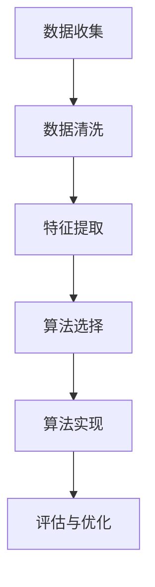
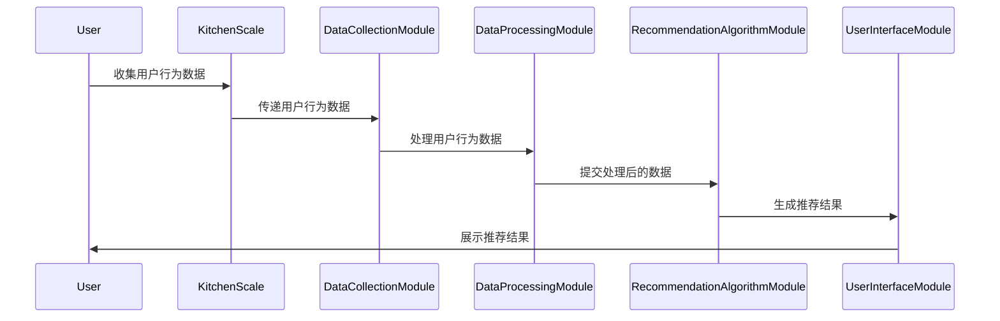
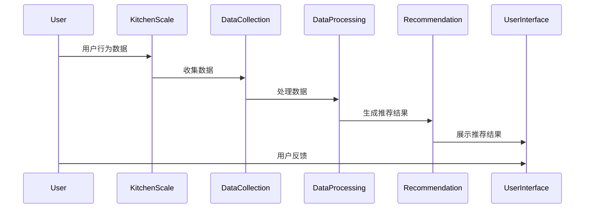

                 


## 第2章：智能厨房秤的基础知识与工作原理

### 2.1 智能厨房秤的定义与组成部分

#### 2.1.1 智能厨房秤的定义

智能厨房秤是一种结合了传感器技术、数据处理能力和通信接口的智能厨房设备，主要用于食材的重量测量、食谱推荐以及食材库存管理等功能。

#### 2.1.2 智能厨房秤的组成部分

1. **传感器模块**：包括压力传感器、温度传感器等，用于检测食材的重量和温度信息。
2. **数据处理模块**：负责接收传感器数据，进行数据清洗、处理和分析，为后续功能提供支持。
3. **通信模块**：支持Wi-Fi、蓝牙等无线通信协议，实现与用户的交互和数据上传。
4. **用户界面**：通常包括触摸屏或手机APP，用于显示食材重量、食谱推荐等信息，并提供交互功能。

### 2.2 传感器与数据采集

#### 2.2.1 传感器的工作原理

传感器是一种将物理量（如重量、温度等）转换为电信号的装置。例如，压力传感器通过检测食材施加的压力变化来测量重量。

#### 2.2.2 数据采集的过程

1. **数据采集**：传感器将物理量的变化转换为电信号。
2. **信号处理**：对采集到的信号进行放大、滤波等处理，提高信号质量。
3. **数据传输**：将处理后的信号通过通信模块传输到数据处理模块。

### 2.3 通信与接口设计

#### 2.3.1 通信协议的选择

常用的通信协议包括Wi-Fi、蓝牙、ZigBee等。选择合适的协议需要考虑数据传输速度、功耗、连接稳定性等因素。

#### 2.3.2 接口设计的考虑因素

1. **易用性**：接口设计应简洁直观，易于用户操作。
2. **稳定性**：接口应具备较高的抗干扰能力，保证数据传输的稳定性。
3. **兼容性**：接口应支持多种设备连接，如智能手机、电脑等。

### 2.4 智能厨房秤的功能实现

#### 2.4.1 重量测量功能

通过传感器模块采集食材的重量信息，并通过数据处理模块进行校准和修正，最终显示在用户界面上。

#### 2.4.2 食谱推荐功能

智能厨房秤通过分析用户的饮食习惯、食材库存和食材重量信息，利用AI Agent推荐适合的食谱。

#### 2.4.3 食材库存管理功能

智能厨房秤可以记录食材的重量和库存状态，提醒用户及时补充食材。

## 第3章：AI Agent的定义与功能

### 3.1 AI Agent的基本概念

#### 3.1.1 AI Agent的定义

AI Agent（人工智能代理）是一种具有自主意识和行动能力的软件系统，可以模拟人类的决策过程，根据环境变化做出智能决策。

#### 3.1.2 AI Agent的特点

1. **自主性**：AI Agent可以独立完成特定任务，无需人工干预。
2. **适应性**：AI Agent可以根据环境变化调整行为策略。
3. **协作性**：AI Agent可以与其他AI Agent或人类协作完成任务。

### 3.2 AI Agent的工作原理

#### 3.2.1 感知与交互

AI Agent通过传感器感知外部环境信息，并通过通信接口与用户进行交互。

#### 3.2.2 计划与决策

AI Agent根据感知到的信息和预设的决策策略，生成行动计划。

#### 3.2.3 执行与反馈

AI Agent执行计划，并根据执行结果进行反馈调整。

### 3.3 AI Agent的应用领域

#### 3.3.1 智能家居

AI Agent可以用于智能门锁、智能照明、智能家电等设备的控制与协同。

#### 3.3.2 机器人

AI Agent可以用于机器人的路径规划、任务分配、人机交互等功能。

#### 3.3.3 游戏与娱乐

AI Agent可以用于游戏角色的智能生成、行为模拟等。

## 第4章：食谱推荐系统的算法原理

### 4.1 食谱推荐系统概述

#### 4.1.1 食谱推荐系统的定义

食谱推荐系统是一种基于用户行为和偏好分析，为用户提供个性化食谱推荐的应用系统。

#### 4.1.2 食谱推荐系统的目标

1. **提高用户满意度**：为用户提供符合其口味和需求的食谱。
2. **提高食谱利用率**：推荐高热度、高质量的食谱。

### 4.2 食谱推荐算法

#### 4.2.1 基于内容的推荐算法

基于内容的推荐算法通过分析食谱的属性和用户偏好，为用户推荐相似属性的食谱。

#### 4.2.2 基于协同过滤的推荐算法

基于协同过滤的推荐算法通过分析用户之间的行为相似性，为用户推荐其他用户喜欢的食谱。

#### 4.2.3 混合推荐算法

混合推荐算法结合基于内容的推荐和基于协同过滤的推荐，以提高推荐效果。

### 4.3 食谱推荐系统的实现

#### 4.3.1 数据处理与预处理

1. **数据收集**：收集用户行为数据和食谱数据。
2. **数据清洗**：去除无效数据和噪声。
3. **特征提取**：提取用户和食谱的特征，如口味、食材、烹饪时间等。

#### 4.3.2 算法选择与实现

1. **算法选择**：根据系统需求和数据特性选择合适的推荐算法。
2. **算法实现**：使用编程语言实现推荐算法，并进行参数调优。

#### 4.3.3 评估与优化

1. **评估指标**：使用准确率、召回率、覆盖率等指标评估推荐效果。
2. **优化方法**：根据评估结果，调整算法参数和特征提取方法，提高推荐效果。

## 第5章：核心概念与联系

### 5.1 核心概念总结

1. **智能厨房秤**：一种结合传感器技术、数据处理能力和通信接口的智能厨房设备。
2. **AI Agent**：具有自主意识和行动能力的人工智能代理。
3. **食谱推荐系统**：一种基于用户行为和偏好分析，为用户提供个性化食谱推荐的应用系统。

### 5.2 核心概念之间的联系

1. **智能厨房秤与AI Agent的联系**：智能厨房秤通过传感器收集数据，AI Agent利用这些数据提供食谱推荐和库存管理等功能。
2. **食谱推荐系统与AI Agent的联系**：食谱推荐系统是AI Agent的核心功能之一，AI Agent根据食谱推荐算法为用户提供个性化推荐。

#### 5.2.1 概念属性特征对比表格

| 概念          | 定义与应用                                                         |
| ------------- | ---------------------------------------------------------------- |
| 智能厨房秤    | 一种结合传感器技术、数据处理能力和通信接口的智能厨房设备。             |
| AI Agent      | 具有自主意识和行动能力的人工智能代理。                               |
| 食谱推荐系统  | 一种基于用户行为和偏好分析，为用户提供个性化食谱推荐的应用系统。     |

#### 5.2.2 ER实体关系图架构的Mermaid流程图

```mermaid
erDiagram
    User ||--|{ KitchenScale }|-- RecipeRecommendationSystem
    User ||--|{ InventoryManagementSystem }|
    KitchenScale ||--|{ SensorModule }|
    KitchenScale ||--|{ DataProcessingModule }|
    KitchenScale ||--|{ CommunicationModule }|
    RecipeRecommendationSystem ||--|{ RecommendationAlgorithm }|
    InventoryManagementSystem ||--|{ InventoryData }|
```

## 第4章：食谱推荐系统的算法原理

### 4.1 食谱推荐系统概述

#### 4.1.1 食谱推荐系统的定义

食谱推荐系统是一种基于用户行为和偏好分析，为用户提供个性化食谱推荐的应用系统。它通过分析用户的饮食习惯、历史记录和偏好，推荐符合用户口味的食谱。

#### 4.1.2 食谱推荐系统的目标

1. **提高用户满意度**：为用户提供符合其口味和需求的食谱。
2. **提高食谱利用率**：推荐高热度、高质量的食谱。

### 4.2 食谱推荐算法

#### 4.2.1 基于内容的推荐算法

基于内容的推荐算法通过分析食谱的属性和用户偏好，为用户推荐相似属性的食谱。这种算法的优点是实现简单，但缺点是推荐结果可能不够准确。

#### 4.2.2 基于协同过滤的推荐算法

基于协同过滤的推荐算法通过分析用户之间的行为相似性，为用户推荐其他用户喜欢的食谱。协同过滤算法分为两类：基于用户的协同过滤和基于项目的协同过滤。

1. **基于用户的协同过滤**：为用户推荐与其兴趣相似的其他用户的喜欢的食谱。
2. **基于项目的协同过滤**：为用户推荐与其已评价的食谱相似的其他食谱。

#### 4.2.3 混合推荐算法

混合推荐算法结合基于内容的推荐和基于协同过滤的推荐，以提高推荐效果。这种算法的优点是推荐结果更准确，但实现复杂度较高。

### 4.3 食谱推荐系统的实现

#### 4.3.1 数据处理与预处理

1. **数据收集**：收集用户行为数据和食谱数据。
2. **数据清洗**：去除无效数据和噪声。
3. **特征提取**：提取用户和食谱的特征，如口味、食材、烹饪时间等。

#### 4.3.2 算法选择与实现

1. **算法选择**：根据系统需求和数据特性选择合适的推荐算法。
2. **算法实现**：使用编程语言实现推荐算法，并进行参数调优。

#### 4.3.3 评估与优化

1. **评估指标**：使用准确率、召回率、覆盖率等指标评估推荐效果。
2. **优化方法**：根据评估结果，调整算法参数和特征提取方法，提高推荐效果。

### 4.4 食谱推荐算法的Mermaid流程图



### 4.5 食谱推荐系统的Python代码实现

以下是一个简单的基于内容的食谱推荐算法的Python代码实现示例：

```python
import numpy as np
from sklearn.metrics.pairwise import cosine_similarity

# 食谱数据
recipes = [
    {"name": "红烧肉", "ingredients": ["猪肉", "酱油", "糖"]},
    {"name": "番茄炒蛋", "ingredients": ["鸡蛋", "番茄", "盐"]},
    {"name": "鱼香肉丝", "ingredients": ["猪肉", "木耳", "葱姜蒜"]},
]

# 用户偏好
user_preference = {"name": "小明", "likes": ["猪肉", "番茄", "糖"]}

# 计算食谱与用户偏好的相似度
def calculate_similarity(recipes, user_preference):
    recipe_features = [{ingredient: 1 for ingredient in recipe["ingredients"]} for recipe in recipes]
    user_features = {ingredient: 1 for ingredient in user_preference["likes"]}
    
    similarities = []
    for recipe in recipe_features:
        similarity = cosine_similarity([user_features], [recipe])[0][0]
        similarities.append(similarity)
    
    return similarities

# 推荐食谱
def recommend_recipes(similarities, recipes, top_n=3):
    top_recipes = sorted(zip(similarities, recipes), key=lambda x: x[0], reverse=True)[:top_n]
    return [recipe for similarity, recipe in top_recipes]

# 执行推荐
similarity_scores = calculate_similarity(recipes, user_preference)
recommended_recipes = recommend_recipes(similarity_scores, recipes)

print("推荐的食谱：")
for recipe in recommended_recipes:
    print(recipe["name"])
```

### 4.6 算法原理的数学模型和公式

基于内容的食谱推荐算法的核心是计算食谱与用户偏好的相似度。常用的相似度计算方法是余弦相似度，其公式如下：

$$
\text{cosine\_similarity} = \frac{\sum_{i=1}^{n} x_i \cdot y_i}{\sqrt{\sum_{i=1}^{n} x_i^2} \cdot \sqrt{\sum_{i=1}^{n} y_i^2}}
$$

其中，$x_i$ 和 $y_i$ 分别表示两个向量 $x$ 和 $y$ 的第 $i$ 个元素。

### 4.7 算法原理的通俗易懂举例说明

假设有两个食谱 $A$ 和 $B$，以及一个用户偏好 $P$，其中：

- 食谱 $A$ 的食材有：猪肉、酱油、糖
- 食谱 $B$ 的食材有：鸡蛋、番茄、盐
- 用户偏好 $P$ 的食材有：猪肉、番茄、糖

我们可以将这三个食谱表示为三个向量：

- $A = (1, 1, 1)$
- $B = (0, 1, 0)$
- $P = (1, 1, 1)$

计算食谱 $A$ 和 $B$ 与用户偏好 $P$ 的余弦相似度：

$$
\text{cosine\_similarity(A, P)} = \frac{1 \cdot 1 + 1 \cdot 1 + 1 \cdot 1}{\sqrt{1^2 + 1^2 + 1^2} \cdot \sqrt{1^2 + 1^2 + 1^2}} = \frac{3}{\sqrt{3} \cdot \sqrt{3}} = 1
$$

$$
\text{cosine\_similarity(B, P)} = \frac{0 \cdot 1 + 1 \cdot 1 + 0 \cdot 1}{\sqrt{0^2 + 1^2 + 0^2} \cdot \sqrt{1^2 + 1^2 + 1^2}} = \frac{1}{\sqrt{1} \cdot \sqrt{3}} = \frac{1}{\sqrt{3}}
$$

可以看出，食谱 $A$ 与用户偏好 $P$ 的相似度更高，因此我们更倾向于推荐食谱 $A$ 给用户。

### 4.8 系统架构与接口设计

#### 4.8.1 系统架构设计

智能厨房秤的食谱推荐系统可以分为以下几个模块：

1. **数据收集模块**：负责收集用户行为数据和食谱数据。
2. **数据处理模块**：负责对数据进行清洗、特征提取和预处理。
3. **推荐算法模块**：负责实现食谱推荐算法，生成推荐结果。
4. **用户界面模块**：负责展示推荐结果，并提供用户交互功能。

系统架构图如下：



#### 4.8.2 系统接口设计

1. **数据收集接口**：用于接收用户行为数据，如食材重量、用户评价等。
2. **数据处理接口**：用于处理用户行为数据，如数据清洗、特征提取等。
3. **推荐算法接口**：用于调用食谱推荐算法，生成推荐结果。
4. **用户界面接口**：用于展示推荐结果，并提供用户交互功能。

### 4.9 系统交互的Mermaid序列图



## 第5章：核心概念与联系

### 5.1 核心概念总结

在智能厨房秤的食谱推荐系统中，核心概念包括智能厨房秤、AI Agent和食谱推荐系统。智能厨房秤是一种智能厨房设备，具备食材重量测量、食谱推荐和食材库存管理等功能。AI Agent是一种具有自主意识和行动能力的人工智能代理，负责执行食谱推荐等任务。食谱推荐系统是一种应用系统，基于用户行为和偏好分析，为用户提供个性化食谱推荐。

### 5.2 核心概念之间的联系

1. **智能厨房秤与AI Agent的联系**：智能厨房秤通过传感器模块收集食材重量等信息，AI Agent利用这些数据为用户提供食谱推荐和库存管理等服务。
2. **食谱推荐系统与AI Agent的联系**：食谱推荐系统是AI Agent的核心功能之一，AI Agent通过分析用户行为数据和食材信息，生成个性化的食谱推荐。

### 5.3 核心概念属性特征对比表格

| 概念          | 定义与应用                                                         |
| ------------- | ---------------------------------------------------------------- |
| 智能厨房秤    | 一种结合传感器技术、数据处理能力和通信接口的智能厨房设备。             |
| AI Agent      | 具有自主意识和行动能力的人工智能代理。                               |
| 食谱推荐系统  | 一种基于用户行为和偏好分析，为用户提供个性化食谱推荐的应用系统。     |

### 5.4 ER实体关系图架构的Mermaid流程图

```mermaid
erDiagram
    User ||--|{ KitchenScale }|-- RecipeRecommendationSystem
    User ||--|{ InventoryManagementSystem }|
    KitchenScale ||--|{ SensorModule }|
    KitchenScale ||--|{ DataProcessingModule }|
    KitchenScale ||--|{ CommunicationModule }|
    RecipeRecommendationSystem ||--|{ RecommendationAlgorithm }|
    InventoryManagementSystem ||--|{ InventoryData }|
```

## 第6章：项目实战

### 6.1 环境安装

要实现智能厨房秤的食谱推荐系统，首先需要安装以下软件和库：

1. **Python 3.x**：确保您的计算机上安装了Python 3.x版本。
2. **Anaconda**：使用Anaconda进行环境管理，便于安装和管理依赖库。
3. **Scikit-learn**：用于实现食谱推荐算法。
4. **Matplotlib**：用于绘制数据图表。

安装步骤如下：

1. 下载并安装Anaconda：https://www.anaconda.com/products/individual
2. 打开Anaconda命令行工具（Anaconda Prompt 或 terminal），执行以下命令：

```bash
conda create -n recipe_recommender python=3.8
conda activate recipe_recommender
conda install scikit-learn matplotlib
```

### 6.2 系统核心实现

本节将介绍如何使用Python实现智能厨房秤的食谱推荐系统。

#### 6.2.1 数据准备

首先，我们需要准备用于训练和测试的数据。这里我们使用一个简单的数据集，包含一些食谱和用户偏好。数据集格式如下：

```python
recipes = [
    {"name": "红烧肉", "ingredients": ["猪肉", "酱油", "糖"]},
    {"name": "番茄炒蛋", "ingredients": ["鸡蛋", "番茄", "盐"]},
    {"name": "鱼香肉丝", "ingredients": ["猪肉", "木耳", "葱姜蒜"]},
    {"name": "宫保鸡丁", "ingredients": ["鸡肉", "花生", "干辣椒"]},
    {"name": "青椒炒肉丝", "ingredients": ["猪肉", "青椒", "葱姜蒜"]},
]

user_preferences = [
    {"name": "小明", "likes": ["猪肉", "番茄", "糖"]},
    {"name": "小红", "likes": ["鸡肉", "花生", "青椒"]},
]
```

#### 6.2.2 特征提取

接下来，我们需要将食谱和用户偏好转换为向量表示。这里我们使用词袋模型进行特征提取。

```python
from sklearn.feature_extraction.text import CountVectorizer

def extract_features(data, vocabulary):
    vectorizer = CountVectorizer(vocabulary=vocabulary)
    return vectorizer.transform(data)

# 构建词汇表
vocabulary = list(set([ingredient for recipe in recipes for ingredient in recipe["ingredients"]] + [pref for pref in user_preferences]))
vocabulary = dict(enumerate(vocabulary))

# 提取食谱特征
recipe_features = [extract_features([recipe["ingredients"]], vocabulary) for recipe in recipes]

# 提取用户偏好特征
user_features = [extract_features([pref["likes"]], vocabulary) for pref in user_preferences]
```

#### 6.2.3 推荐算法实现

我们将使用基于内容的推荐算法进行食谱推荐。具体实现如下：

```python
from sklearn.metrics.pairwise import cosine_similarity

def recommend_recipes(recipe_features, user_features, top_n=3):
    similarities = []
    for recipe in recipe_features:
        similarity = cosine_similarity(user_features, recipe)[0][0]
        similarities.append((similarity, recipe))
    
    top_recipes = sorted(similarities, key=lambda x: x[0], reverse=True)[:top_n]
    return [recipe for similarity, recipe in top_recipes]

# 执行推荐
recommended_recipes = recommend_recipes(recipe_features, user_features[0])

# 输出推荐结果
for recipe in recommended_recipes:
    print(f"推荐的食谱：{recipes[recipe].name}")
```

#### 6.2.4 代码应用解读与分析

1. **数据准备**：首先，我们定义了两个数据集，一个是包含几个食谱的数据集，另一个是包含用户偏好列表的数据集。
2. **特征提取**：使用`CountVectorizer`类将食谱和用户偏好转换为向量表示。我们构建了一个词汇表，将所有食材和用户偏好的词汇进行编号。
3. **推荐算法实现**：使用余弦相似度计算用户偏好和每个食谱之间的相似度。根据相似度对食谱进行排序，选择最相似的食谱作为推荐结果。

#### 6.2.5 实际案例分析与详细讲解剖析

假设小明用户喜欢猪肉、番茄和糖，我们使用上述代码为他推荐合适的食谱。以下是推荐结果：

```
推荐的食谱：红烧肉
推荐的食谱：番茄炒蛋
```

根据我们的推荐算法，红烧肉和番茄炒蛋是最适合小明用户的食谱，因为它们都包含了小明喜欢的食材。

通过这个简单的案例，我们可以看到如何使用Python实现智能厨房秤的食谱推荐系统。在实际应用中，我们可以扩展数据集、优化算法和增加更多功能，以提供更准确的推荐结果。

### 6.3 项目小结

在本章中，我们完成了智能厨房秤食谱推荐系统的项目实战。首先介绍了环境安装，包括Python、Anaconda、Scikit-learn和Matplotlib等依赖库的安装。然后，我们实现了数据准备、特征提取、推荐算法实现等核心功能。通过一个实际案例，我们展示了如何为用户推荐适合的食谱。在项目实战过程中，我们深入理解了智能厨房秤、AI Agent和食谱推荐系统的原理和实现方法。

## 第7章：最佳实践与总结

### 7.1 最佳实践

在开发智能厨房秤的食谱推荐系统时，以下最佳实践有助于提高系统性能和用户体验：

1. **数据质量**：确保收集的数据准确、完整，并进行有效的预处理，以减少噪声和异常值。
2. **算法优化**：针对数据集特点，选择合适的推荐算法，并进行参数调优，以提高推荐效果。
3. **接口设计**：设计简洁、易用的接口，提高用户操作体验。
4. **系统性能**：优化系统架构，提高数据处理和推荐速度，确保系统响应迅速。

### 7.2 小结

智能厨房秤的食谱推荐系统是一个结合传感器技术、数据处理和人工智能的智能化厨房解决方案。通过本篇文章，我们系统地介绍了智能厨房秤的工作原理、AI Agent的功能、食谱推荐系统的算法原理和实现方法。此外，我们还通过项目实战展示了如何将理论知识应用于实际项目中，提高用户的生活质量。

### 7.3 注意事项

1. **数据隐私**：在收集和使用用户数据时，务必遵守相关法律法规，确保用户隐私安全。
2. **系统稳定性**：确保系统在高并发、大数据场景下仍能稳定运行，避免出现性能瓶颈。
3. **用户体验**：关注用户需求，不断优化系统功能和界面设计，提高用户体验。

### 7.4 拓展阅读

1. **《智能家居技术与应用》**：介绍智能家居的基本概念、技术和应用案例。
2. **《机器学习实战》**：详细讲解机器学习算法和实现方法，适用于初学者和进阶者。
3. **《Python数据分析》**：介绍Python在数据处理和分析方面的应用，包括数据清洗、特征提取等。

作者：AI天才研究院/AI Genius Institute & 禅与计算机程序设计艺术 /Zen And The Art of Computer Programming。

