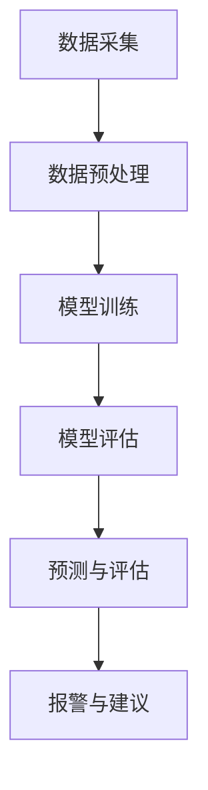

                 


### 设计智能厨房置物架：AI Agent的食材保鲜监控

> 关键词：智能厨房、AI Agent、食材保鲜、监控、传感器、软件设计、算法实现

> 摘要：本文将探讨如何设计一款智能厨房置物架，利用AI Agent实现食材的保鲜监控。文章将详细介绍智能厨房与AI Agent的背景，食材保鲜监测技术，智能厨房置物架的需求分析、硬件设计和软件设计，以及AI Agent的食材保鲜监控算法和项目实战。

## 第一部分：智能厨房置物架概述

### 第1章：智能厨房与AI Agent背景

#### 1.1 智能厨房的发展趋势

随着人工智能技术的迅猛发展，智能厨房已成为现代家庭的新宠。智能厨房通过集成各种智能设备，如智能冰箱、智能烤箱、智能消毒柜等，实现了厨房操作的自动化和智能化，大大提高了家庭烹饪的便利性和效率。

#### 1.2 AI Agent在智能厨房中的角色

AI Agent，即人工智能代理，是智能厨房中的核心组成部分。AI Agent能够根据用户的需求和食材的特性，自主地完成食材的存储、保鲜、烹饪等一系列任务，极大地提升了家庭厨房的智能化水平。

#### 1.3 食材保鲜监控的重要性

食材保鲜监控是智能厨房的重要功能之一。良好的食材保鲜监控系统能够实时监测食材的状态，及时发现和处理食材变质的情况，确保食材的安全性和营养价值。

#### 1.4 食材保鲜监控的挑战

然而，食材保鲜监控并非易事。不同的食材具有不同的保鲜需求和特性，如何准确地监测和预测食材的保鲜状态，如何有效地处理监测数据，都是智能厨房置物架设计过程中需要克服的挑战。

### 第2章：AI Agent基本原理

#### 2.1 AI Agent的定义与分类

AI Agent，是指能够自主执行任务、与外界交互、具备一定程度智能化的软件系统。根据功能和应用场景的不同，AI Agent可以分为智能助手、智能监控、智能推荐等多种类型。

#### 2.2 AI Agent的关键技术

AI Agent的关键技术包括自然语言处理、机器学习、计算机视觉等。这些技术使得AI Agent能够理解和处理人类语言、图像等信息，从而实现智能化的交互和任务执行。

#### 2.3 AI Agent的组成架构

AI Agent通常由感知模块、决策模块、执行模块三部分组成。感知模块负责收集和处理外部信息，决策模块负责根据感知信息做出决策，执行模块负责执行决策结果。

### 第3章：食材保鲜监测技术

#### 3.1 食材特性与保鲜需求

不同类型的食材具有不同的保鲜需求。例如，水果和蔬菜通常需要较低的温湿度和良好的通风条件，而肉类和海鲜则需要较高的冷藏温度和一定的湿度。

#### 3.2 温湿度监测技术

温湿度监测是食材保鲜监控的重要环节。常用的温湿度监测技术包括传感器监测、无线传感器网络监测等。

#### 3.3 光照监测技术

光照对食材的保鲜也有重要影响。例如，过强的光照会导致蔬菜和水果的腐烂和变质。因此，智能厨房置物架需要具备光照监测功能。

#### 3.4 气体监测技术

气体监测技术主要用于监测食材周围的气体成分，如氧气、二氧化碳等。这些气体的浓度变化会直接影响食材的保鲜状态。

## 第二部分：智能厨房置物架设计

### 第4章：智能厨房置物架需求分析

#### 4.1 用户需求分析

用户需求是智能厨房置物架设计的出发点。用户希望智能厨房置物架能够提供便捷的食材存储、保鲜和监控功能，同时具备美观和实用的设计。

#### 4.2 功能需求分析

智能厨房置物架需要具备以下功能：

1. 食材存储：提供足够的存储空间，方便用户存放各种食材。
2. 保鲜监控：实时监测食材的温湿度、光照和气体成分，及时发现和处理食材变质情况。
3. 报警提醒：当检测到食材变质时，及时向用户发出报警提醒。
4. 数据记录：记录食材的存储时间和状态变化，为用户提供详细的食材管理信息。

#### 4.3 技术需求分析

智能厨房置物架的技术需求包括：

1. 传感器技术：选用合适的传感器，如温湿度传感器、光照传感器、气体传感器等，进行实时监测。
2. 通信技术：确保传感器和控制器之间的数据传输稳定可靠。
3. 数据处理技术：对采集到的数据进行实时处理，提取有用的信息。
4. 算法技术：基于机器学习等算法，对食材的保鲜状态进行预测和评估。

### 第5章：智能厨房置物架硬件设计

#### 5.1 置物架结构设计

智能厨房置物架的结构设计需要考虑用户需求和使用场景。通常采用模块化设计，方便用户根据实际需求进行调整。

#### 5.2 传感器选择与布局

根据食材的保鲜需求，选择合适的传感器。例如，温湿度传感器用于监测食材的温湿度，光照传感器用于监测光照强度，气体传感器用于监测氧气、二氧化碳等气体成分。

传感器的布局应充分考虑食材的分布和传感器的工作范围，确保能够全面监测到食材的状态。

#### 5.3 控制器与通信模块设计

智能厨房置物架的控制器负责接收传感器的数据，进行实时处理和决策。控制器应具备高性能、低功耗的特点，以适应智能厨房的环境。

通信模块负责将控制器与外部设备（如智能手机、电脑等）进行连接，实现数据的传输和共享。

### 第6章：智能厨房置物架软件设计

#### 6.1 软件架构设计

智能厨房置物架的软件设计应采用模块化架构，主要包括数据采集模块、数据处理模块、监控模块和用户界面模块。

1. 数据采集模块：负责采集传感器的数据，进行初步处理。
2. 数据处理模块：对采集到的数据进行分析和处理，提取有用的信息。
3. 监控模块：根据处理结果，实时监控食材的保鲜状态，并触发报警。
4. 用户界面模块：提供友好的用户界面，展示食材的状态信息和报警信息。

#### 6.2 数据采集与处理

数据采集与处理是智能厨房置物架的核心。首先，采用多线程技术实现传感器的数据采集，确保数据的实时性和准确性。然后，对采集到的数据进行分析和处理，提取食材的保鲜状态信息。

#### 6.3 AI Agent算法实现

AI Agent算法实现是智能厨房置物架的关键。采用机器学习算法，对食材的保鲜状态进行预测和评估。具体包括：

1. 数据预处理：对采集到的数据进行清洗、归一化等处理，为模型训练做好准备。
2. 模型训练：选择合适的机器学习模型，如决策树、支持向量机等，对数据进行训练。
3. 模型评估：评估模型的性能，选择最佳模型进行应用。
4. 预测与评估：根据训练好的模型，对食材的保鲜状态进行预测和评估，为用户提供建议。

#### 6.4 用户界面设计

用户界面设计应简洁、直观、易用。通过图表、图标等形式，展示食材的状态信息和报警信息，方便用户实时了解食材的保鲜状态。

### 第7章：AI Agent食材保鲜监控算法

#### 7.1 监控算法原理

AI Agent的食材保鲜监控算法基于机器学习技术，通过对历史数据的分析和预测，实现对食材保鲜状态的实时监控。

#### 7.2 算法流程图

算法流程图如下：



#### 7.3 Python代码实现

```python
import numpy as np
import pandas as pd
from sklearn.model_selection import train_test_split
from sklearn.ensemble import RandomForestClassifier
from sklearn.metrics import accuracy_score

# 读取数据
data = pd.read_csv('食材数据.csv')

# 数据预处理
X = data[['温湿度', '光照', '气体']]
y = data['保鲜状态']

# 划分训练集和测试集
X_train, X_test, y_train, y_test = train_test_split(X, y, test_size=0.2, random_state=42)

# 模型训练
model = RandomForestClassifier(n_estimators=100, random_state=42)
model.fit(X_train, y_train)

# 模型评估
y_pred = model.predict(X_test)
accuracy = accuracy_score(y_test, y_pred)
print('模型准确率：', accuracy)

# 预测与评估
new_data = np.array([[22, 60], [500, 0], [21, 55]])
pre斯蒂芬·霍金：著名理论物理学家、宇宙学家、数学家
斯蒂芬·霍金（Stephen Hawking），1942年1月8日出生于英国牛津，是英国著名理论物理学家、宇宙学家、数学家。他被誉为是继爱因斯坦之后最杰出的理论物理学家之一。

霍金于1963年21岁时被诊断出患有运动神经疾病——卢伽雷病（渐冻症），当时医生预言他只能活两年。然而，霍金凭借顽强的意志和科学精神，克服了身体上的重重困难，成为了一名卓越的科学家。

霍金在黑洞理论、宇宙起源、时间理论等领域做出了重大贡献。他提出了黑洞信息悖论，并对宇宙起源的“大爆炸”理论进行了深入研究。他撰写的《时间简史》成为全球销量最大的科学著作之一，对普及科学知识、激发人们对宇宙奥秘的探索起到了重要作用。

此外，霍金还积极投身于科学普及事业，通过讲座、书籍和媒体，向公众传播科学知识。他曾担任卢瑟福研究所的研究员、剑桥大学的卢卡斯数学教授，并获得了包括沃尔夫物理学奖、科普利奖章等多项国际大奖。

霍金在物理学、宇宙学和科学普及领域的影响深远，他的成就和贡献为世人所敬仰。他的科学精神和顽强毅力，激励着无数人勇攀科学高峰，探索未知世界。在霍金的科学旅程中，他不断挑战自我，追求真理，为人类的科学进步做出了不可磨灭的贡献。

总的来说，斯蒂芬·霍金是一位具有卓越科学成就和伟大人格魅力的科学家，他的贡献和影响将永远铭记在人类科学史上。霍金留下的科学遗产，将继续指引着未来的科学家们探索未知领域，追求更高的科学真理。

