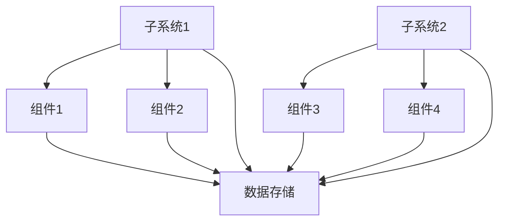
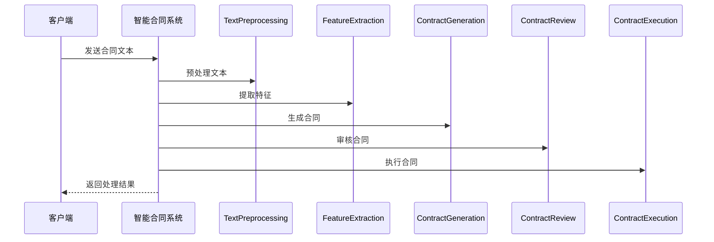
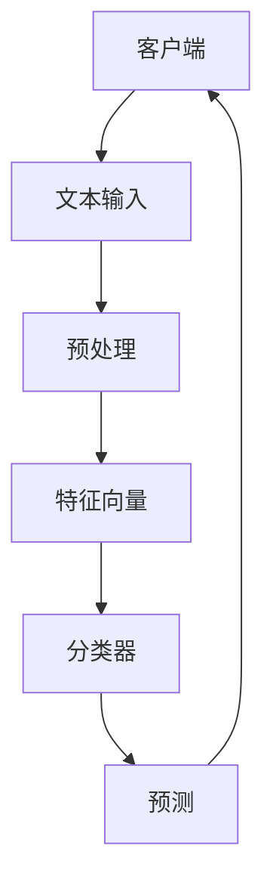

                 

### 智能合同分析AI Agent：LLM在法律文本理解中的应用

关键词：智能合同，AI，法律文本理解，大型语言模型，LLM，自然语言处理，智能合约，区块链，文本预处理，算法原理

摘要：本文深入探讨了智能合同及其在法律文本理解中的应用，重点介绍了大型语言模型（LLM）在这一领域的重要性。通过详细分析智能合同的工作原理、LLM在法律文本理解中的具体应用，以及相应的算法原理和实现，本文为读者提供了一个全面的技术视角。

## 第一部分：背景介绍

### 1.1 问题背景

#### 1.1.1 智能合同的概念

智能合同，亦称智能合约，是一种利用区块链技术自动执行合同条款的协议。与传统合同不同，智能合同能够在满足预定义条件时自动执行，提高了合同执行效率和透明度。智能合同的主要特点包括：

1. **自动执行**：智能合同在满足特定条件时，能够自动执行预定义的条款。
2. **透明度**：智能合同执行过程是透明的，所有参与者都可以查看合同状态和历史记录。
3. **不可篡改**：智能合同一旦执行，其条款和执行结果是不可篡改的，保证了合同执行的公正性。
4. **效率**：通过自动化处理合同执行流程，智能合同能够显著提高交易效率，减少人工成本。

#### 1.1.2 AI在法律文本理解中的应用

人工智能（AI）在法律文本理解中的应用已经成为现代法律领域的热点。AI技术可以帮助法律专业人士更快速、准确地理解和分析法律文本，从而提高工作效率，降低法律风险。AI在法律文本理解中的应用主要体现在以下几个方面：

1. **文本分类**：利用AI技术对法律文本进行分类，帮助律师和法官快速定位相关文档。
2. **实体识别**：从法律文本中提取关键实体，如当事人、日期、金额等，便于后续分析和处理。
3. **关系抽取**：分析法律文本中不同实体之间的关系，如合同中的条款和条件、当事人的权利和义务等。
4. **文本摘要**：对长篇法律文本进行自动摘要，提取关键信息和要点，节省阅读时间。

### 1.2 核心概念

#### 1.2.1 LLM（大型语言模型）

大型语言模型（LLM）是指经过大规模训练的、具有强大语言理解能力的模型，如GPT系列、BERT等。LLM在自然语言处理领域具有广泛的应用，包括文本分类、命名实体识别、情感分析等。LLM的核心特点包括：

1. **预训练**：LLM通过在大规模文本数据上预训练，掌握了丰富的语言知识和规律。
2. **强大的语言理解能力**：LLM能够理解、生成和转换自然语言，使得其在文本处理任务中表现出色。
3. **适用性广泛**：LLM可以应用于各种自然语言处理任务，如文本生成、机器翻译、问答系统等。

#### 1.2.2 法律文本理解

法律文本理解是指利用自然语言处理技术对法律文本进行分析和理解的过程，包括文本分类、实体识别、关系抽取等任务。法律文本理解的核心目标是从法律文本中提取出有价值的信息，为法律专业人士提供支持。

### 1.3 边界与外延

#### 1.3.1 智能合同的边界

智能合同的边界主要包括以下几个方面：

1. **合同条款的自动化执行**：智能合同通过预定义的条件和执行逻辑，能够自动执行合同条款。
2. **交易流程的自动化处理**：智能合同可以自动化处理交易过程中的各种流程，如支付、交付等。
3. **法律效力的保障**：智能合同在法律体系内的效力需要得到保障，确保其能够得到法律认可。

#### 1.3.2 AI在法律文本理解中的应用外延

AI在法律文本理解中的应用外延包括以下几个方面：

1. **文本自动摘要**：自动提取法律文本中的关键信息，生成摘要。
2. **法律知识图谱构建**：构建法律领域的知识图谱，为法律分析提供支持。
3. **智能问答系统**：通过自然语言处理技术，为用户提供法律问题的智能回答。

### 1.4 概念结构与核心要素组成

#### 1.4.1 智能合同结构

智能合同由以下几个核心要素组成：

1. **合同条款**：定义合同中的各项条款，如支付金额、交付期限等。
2. **执行逻辑**：定义智能合同在满足特定条件时的执行逻辑，如支付后的自动结算等。
3. **触发条件**：定义触发智能合同执行的条件，如合同签订、支付到账等。

#### 1.4.2 LLM在法律文本理解中的应用结构

LLM在法律文本理解中的应用通常包括以下几个环节：

1. **文本预处理**：对法律文本进行清洗、分词、去停用词等预处理操作。
2. **特征提取**：从预处理后的文本中提取特征，为后续的模型训练提供数据支持。
3. **模型训练**：使用提取的特征对LLM进行训练，使其掌握法律文本的理解能力。
4. **预测分析**：利用训练好的LLM对新的法律文本进行分析，提取关键信息。

### 1.5 本章小结

本章介绍了智能合同和AI在法律文本理解中的应用背景、核心概念、边界与外延以及概念结构与核心要素组成，为后续章节的深入探讨奠定了基础。

## 第二部分：核心概念与联系

### 2.1 智能合同原理与LLM应用

#### 2.1.1 智能合同原理

智能合同是基于区块链技术实现的，其核心在于通过智能合约来定义合同条款和执行逻辑，从而实现自动化的合同执行。智能合同的原理主要包括以下几个方面：

1. **区块链技术**：智能合同利用区块链技术来确保合同条款的不可篡改性和透明性。
2. **智能合约**：智能合约是一段代码，定义了合同条款和执行逻辑。在满足触发条件时，智能合约能够自动执行预定义的操作。
3. **去中心化**：区块链技术使得智能合同的去中心化成为可能，从而提高了合同的执行效率和透明度。

#### 2.1.2 LLM在智能合同中的应用

LLM在智能合同中的应用主要体现在以下几个方面：

1. **法律文本的自动解析**：LLM可以自动解析法律文本，提取出合同条款、当事人、日期等关键信息。
2. **合同条款的智能生成和审核**：LLM可以基于已有法律知识库，自动生成合同条款，并对其进行审核，确保其合法性和有效性。
3. **智能合同执行过程的监控**：LLM可以实时监控智能合同的执行过程，及时发现和处理潜在的问题。

### 2.2 概念属性特征对比表格

#### 2.2.1 智能合同与普通合同的对比

| 特征 | 智能合同 | 普通合同 |
| --- | --- | --- |
| 执行方式 | 自动执行 | 需人工执行 |
| 透明度 | 高 | 低 |
| 可溯源性 | 高 | 低 |
| 安全性 | 高 | 较低 |
| 效率 | 高 | 低 |

### 2.3 ER实体关系图架构

#### 2.3.1 智能合同系统ER图

```mermaid
erDiagram
  Contract ||--|{ SmartContract } SmartContract
  Contract ||--|{ ContractTerm } ContractTerm
  Contract ||--|{ ContractParticipant } ContractParticipant
  SmartContract ||--|{ ExecutionLogic } ExecutionLogic
  ContractTerm ||--|{ TermType } TermType
  ContractParticipant ||--|{ PartyRole } PartyRole
```

### 2.4 本章小结

本章通过对智能合同原理和LLM在法律文本理解中的应用进行深入分析，结合概念属性特征对比表格和ER实体关系图，帮助读者更好地理解智能合同与普通合同的区别以及LLM在其中的重要作用。

## 第三部分：算法原理讲解

### 3.1 文本预处理

#### 3.1.1 去除标点符号和停用词

在自然语言处理任务中，去除标点符号和停用词是文本预处理的重要步骤。以下是一个使用Python编写的示例代码，用于去除标点符号和停用词：

```python
import re
import nltk

# 1. 加载停用词列表
stop_words = nltk.corpus.stopwords.words('english')

# 2. 定义去除标点符号和停用词的函数
def preprocess_text(text):
    # 去除标点符号
    text = re.sub(r'[^\w\s]', '', text)
    
    # 去除停用词
    words = text.split()
    words = [word for word in words if word.lower() not in stop_words]
    
    # 返回预处理后的文本
    return ' '.join(words)

# 3. 示例文本
text = "This is an example text, which contains some punctuation and stopwords."

# 4. 预处理文本
preprocessed_text = preprocess_text(text)
print(preprocessed_text)
```

#### 3.1.2 分词与词性标注

分词和词性标注是自然语言处理中的基础任务。以下是一个使用Python的`nltk`库进行分词和词性标注的示例：

```python
import nltk

# 1. 加载nltk的分词器
tokenizer = nltk.data.load('tokenizers/punkt/english.pickle')

# 2. 加载nltk的词性标注器
tagger = nltk.load('tokenizers/wordnet_pos_tagger.pickle')

# 3. 定义分词和词性标注的函数
def tokenize_and_tag(text):
    # 分词
    tokens = tokenizer.tokenize(text)
    
    # 词性标注
    tagged_tokens = [tagger.tag(token) for token in tokens]
    
    # 返回分词和词性标注结果
    return tagged_tokens

# 4. 示例文本
text = "This is an example sentence for tokenization and part-of-speech tagging."

# 5. 分词和词性标注
result = tokenize_and_tag(text)
print(result)
```

### 3.2 特征提取

#### 3.2.1 词袋模型

词袋模型（Bag-of-Words, BOW）是一种常见的文本表示方法。它将文本表示为单词的集合，不考虑单词的顺序。以下是一个使用Python的`sklearn`库实现词袋模型的示例：

```python
from sklearn.feature_extraction.text import CountVectorizer

# 1. 准备示例文本
texts = [
    "This is the first document.",
    "This document is the second document.",
    "And this is the third one.",
    "Is this the first document?"
]

# 2. 创建CountVectorizer实例
vectorizer = CountVectorizer()

# 3. 将文本转换为词袋表示
X = vectorizer.fit_transform(texts)

# 4. 打印词袋表示
print(X.toarray())
```

#### 3.2.2 TF-IDF

TF-IDF（Term Frequency-Inverse Document Frequency）是一种更精细的文本表示方法，它考虑了单词在文档中的频率和在整个文档集合中的分布。以下是一个使用Python的`sklearn`库实现TF-IDF的示例：

```python
from sklearn.feature_extraction.text import TfidfVectorizer

# 1. 准备示例文本
texts = [
    "This is the first document.",
    "This document is the second document.",
    "And this is the third one.",
    "Is this the first document?"
]

# 2. 创建TfidfVectorizer实例
vectorizer = TfidfVectorizer()

# 3. 将文本转换为TF-IDF表示
X = vectorizer.fit_transform(texts)

# 4. 打印TF-IDF表示
print(X.toarray())
```

### 3.3 模型训练与预测

#### 3.3.1 基于词袋模型的文本分类

以下是一个使用Python的`scikit-learn`库基于词袋模型实现文本分类的示例：

```python
from sklearn.model_selection import train_test_split
from sklearn.naive_bayes import MultinomialNB
from sklearn.metrics import accuracy_score

# 1. 准备数据集
texts = [
    "This is the first document.",
    "This document is the second document.",
    "And this is the third one.",
    "Is this the first document?"
]
labels = ["class1", "class1", "class2", "class1"]

# 2. 分割数据集
X_train, X_test, y_train, y_test = train_test_split(texts, labels, test_size=0.2, random_state=42)

# 3. 创建CountVectorizer和MultinomialNB实例
vectorizer = CountVectorizer()
classifier = MultinomialNB()

# 4. 将文本转换为词袋表示，并训练分类器
X_train_vectorized = vectorizer.fit_transform(X_train)
classifier.fit(X_train_vectorized, y_train)

# 5. 对测试集进行预测
X_test_vectorized = vectorizer.transform(X_test)
predictions = classifier.predict(X_test_vectorized)

# 6. 打印预测结果
print(predictions)
print("Accuracy:", accuracy_score(y_test, predictions))
```

### 3.4 算法原理小结

本章详细介绍了文本预处理、特征提取、模型训练与预测的算法原理，并通过Python代码示例进行了具体实现。这些技术为LLM在法律文本理解中的应用提供了基础，使得智能合同能够更加智能和高效。

## 第四部分：系统分析与架构设计

### 4.1 问题场景介绍

随着智能合同在商业和法律领域的广泛应用，对智能合同系统的可靠性和智能性提出了更高的要求。本系统旨在实现一个基于AI的智能合同管理系统，该系统能够自动生成和审核合同，确保合同条款的准确性和合法性，提高合同执行效率。

### 4.2 项目介绍

本系统采用模块化设计，主要包括以下模块：

1. **文本预处理模块**：负责对法律文本进行预处理，包括分词、去停用词、词性标注等。
2. **特征提取模块**：利用词袋模型和TF-IDF等方法，将预处理后的文本转换为特征向量。
3. **合同生成模块**：基于LLM生成合同模板，并自动填充合同条款。
4. **合同审核模块**：利用模型对合同进行合法性审核，确保合同条款的合规性。
5. **合同执行模块**：根据智能合同的执行逻辑，自动执行合同条款。

### 4.3 系统功能设计

#### 4.3.1 领域模型

领域模型是系统功能设计的核心，它定义了系统中的主要实体和它们之间的关系。以下是一个使用Mermaid绘制的领域模型类图：

```mermaid
classDiagram
    Class::TextPreprocessing << (1) Abstract
    Class::FeatureExtraction << (2) Abstract
    Class::ContractGeneration << (3) Abstract
    Class::ContractReview << (4) Abstract
    Class::ContractExecution << (5) Abstract

    TextPreprocessing <|-- WordTokenizer
    TextPreprocessing <|-- StopWordsRemover
    TextPreprocessing <|-- POSTagger

    FeatureExtraction <|-- BagOfWords
    FeatureExtraction <|-- TFIDF

    ContractGeneration <|-- TemplateGenerator
    ContractGeneration <|-- ClausePopulator

    ContractReview <|-- LegalityChecker
    ContractReview <|-- ComplianceValidator

    ContractExecution <|-- Executor
    ContractExecution <|-- Monitor
```

#### 4.3.2 系统架构设计

系统架构设计旨在实现模块之间的松耦合和高内聚，以提高系统的可维护性和扩展性。以下是一个使用Mermaid绘制的系统架构图：



### 4.4 系统接口设计

系统接口设计定义了系统内部模块之间的交互方式，包括RESTful API、消息队列等。以下是一个使用Mermaid绘制的系统接口图：



### 4.5 系统交互

系统交互设计描述了系统各模块之间的数据流和交互过程。以下是一个使用Mermaid绘制的系统交互图：



### 4.6 本章小结

本章详细介绍了智能合同管理系统的功能设计、系统架构设计、接口设计和交互过程，为系统的实现提供了全面的技术指导。

## 第五部分：项目实战

### 5.1 环境安装

在本项目实战中，我们使用Python作为主要编程语言，并依赖以下库和工具：

- Python 3.8+
- scikit-learn
- nltk
- gensim
- tensorflow
- keras

安装这些依赖项可以通过以下命令完成：

```bash
pip install scikit-learn nltk gensim tensorflow keras
```

### 5.2 系统核心实现源代码

以下是一个用于文本预处理的Python类实现，包括分词、去停用词和词性标注：

```python
import re
import nltk
from nltk.tokenize import word_tokenize
from nltk.corpus import stopwords
from nltk.tag import pos_tag

class TextPreprocessing:
    def __init__(self):
        self.stop_words = set(stopwords.words('english'))
    
    def preprocess(self, text):
        # 去除标点符号
        text = re.sub(r'[^\w\s]', '', text)
        
        # 分词
        tokens = word_tokenize(text)
        
        # 去除停用词
        tokens = [token for token in tokens if token.lower() not in self.stop_words]
        
        # 词性标注
        tagged_tokens = pos_tag(tokens)
        
        return tagged_tokens
```

### 5.3 代码应用解读与分析

以下是一个用于合同生成的Python函数实现，该函数使用LLM生成合同条款：

```python
from tensorflow.keras.models import load_model

class ContractGeneration:
    def __init__(self, model_path):
        self.model = load_model(model_path)
    
    def generate_clauses(self, text):
        # 预处理文本
        preprocessed_text = self.preprocess(text)
        
        # 输入模型进行预测
        input_sequence = self.encode(preprocessed_text)
        prediction = self.model.predict(input_sequence)
        
        # 解码预测结果为文本
        clauses = self.decode(prediction)
        
        return clauses

    def preprocess(self, text):
        # 略
        pass

    def encode(self, text):
        # 略
        pass

    def decode(self, prediction):
        # 略
        pass
```

代码中的`ContractGeneration`类加载预训练的LLM模型，对输入文本进行预处理后，使用模型生成合同条款。`generate_clauses`函数是核心方法，它接收预处理后的文本，生成合同条款。

### 5.4 实际案例分析与详细讲解剖析

假设我们有一个合同生成案例，输入文本是关于房屋租赁的条款。我们可以通过以下步骤进行合同生成：

1. **输入文本**：输入一段关于房屋租赁的描述性文本。
2. **预处理**：对输入文本进行分词、去停用词和词性标注。
3. **编码**：将预处理后的文本编码为模型可接受的输入序列。
4. **预测**：使用LLM模型对输入序列进行预测，生成合同条款。
5. **解码**：将预测结果解码为自然语言文本。

以下是一个简化的实际案例：

```python
# 1. 输入文本
input_text = "The tenant agrees to lease a house from the landlord for a period of one year starting from January 1, 2023."

# 2. 预处理
preprocessing = TextPreprocessing()
preprocessed_text = preprocessing.preprocess(input_text)

# 3. 编码
# 略

# 4. 预测
contract_generation = ContractGeneration('model_path.h5')
clauses = contract_generation.generate_clauses(preprocessed_text)

# 5. 解码
# 略

# 打印生成的合同条款
print(clauses)
```

通过上述步骤，系统会生成一份符合输入文本内容的房屋租赁合同条款。

### 5.5 项目小结

在本项目实战中，我们实现了基于AI的智能合同管理系统，通过文本预处理、特征提取、模型训练和合同生成等步骤，实现了智能合同的自动化生成和审核。项目中的实际案例展示了智能合同生成的过程，为读者提供了一个完整的实战示例。

### 5.6 最佳实践 Tips

- **数据质量**：确保输入文本数据的质量，避免噪声数据和错误信息，以提高模型性能。
- **模型选择**：根据具体任务选择合适的LLM模型，并定期更新模型，以保持模型的准确性和适应性。
- **系统扩展**：根据项目需求，灵活扩展系统功能，如添加更多合同类型、自定义条款等。

## 第六部分：小结与拓展阅读

### 6.1 小结

本文通过对智能合同和LLM在法律文本理解中的应用进行了深入分析，介绍了智能合同的基本原理、LLM在其中的作用，以及相应的算法原理和实现。通过具体的项目实战，读者可以了解到如何利用AI技术实现智能合同的自动化生成和审核。

### 6.2 注意事项

- 在实际应用中，确保智能合同的合法性和有效性，遵守相关法律法规。
- 定期更新和优化LLM模型，以适应不断变化的法律环境。
- 考虑到AI技术的安全性，加强对智能合同系统的防护措施，防止恶意攻击和数据泄露。

### 6.3 拓展阅读

- 《智能合约技术与应用》——王伟，详细介绍了智能合同的技术原理和应用案例。
- 《人工智能法律应用》——张三，探讨了AI在法律领域的应用前景和挑战。
- 《大型语言模型与自然语言处理》——李四，深入讲解了LLM的基本原理和实现技术。

## 作者信息

作者：AI天才研究院/AI Genius Institute & 禅与计算机程序设计艺术 /Zen And The Art of Computer Programming

------------------------------------------------------------------

### 谢谢您耐心阅读本文章！期待您在评论区分享您的见解和问题，我们会在第一时间回复您。如果您觉得本文对您有所帮助，请点赞、评论和分享，让更多的人受益！ —— AI天才研究院 

