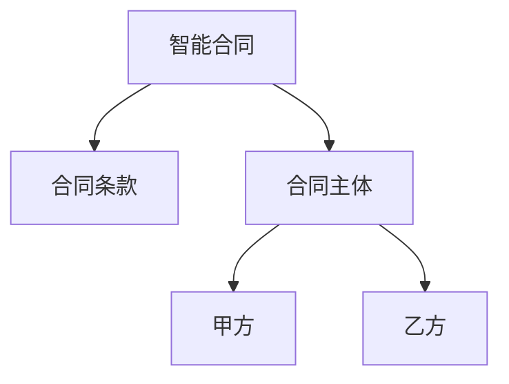
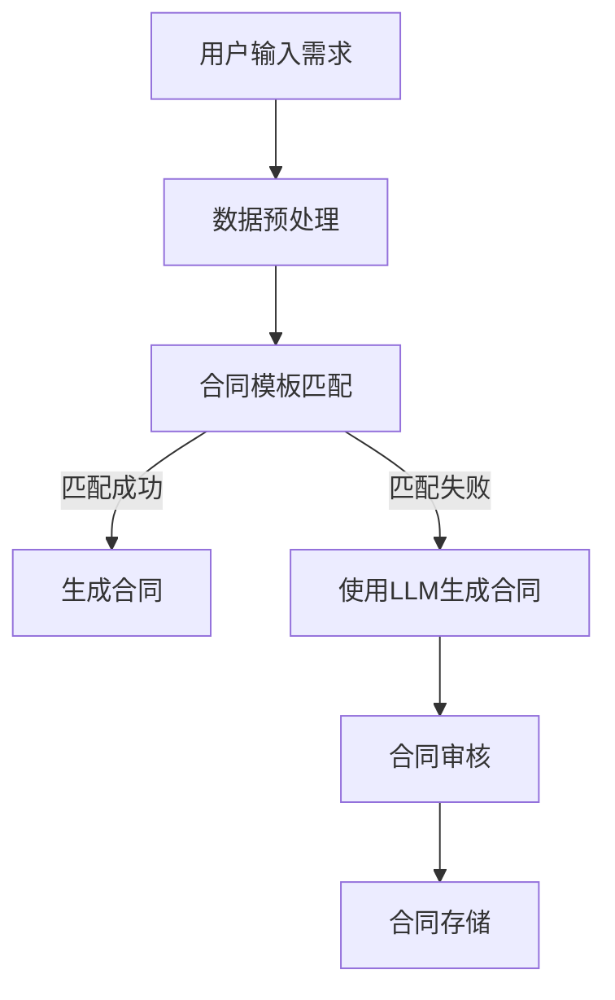
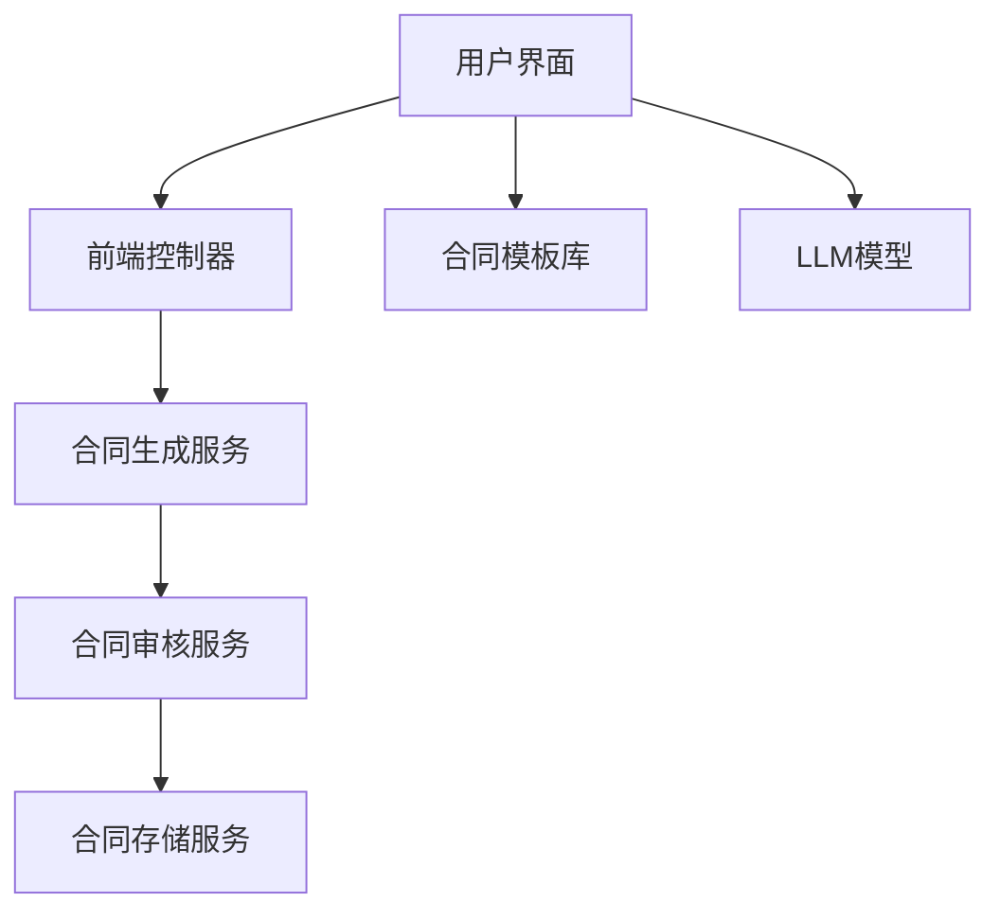
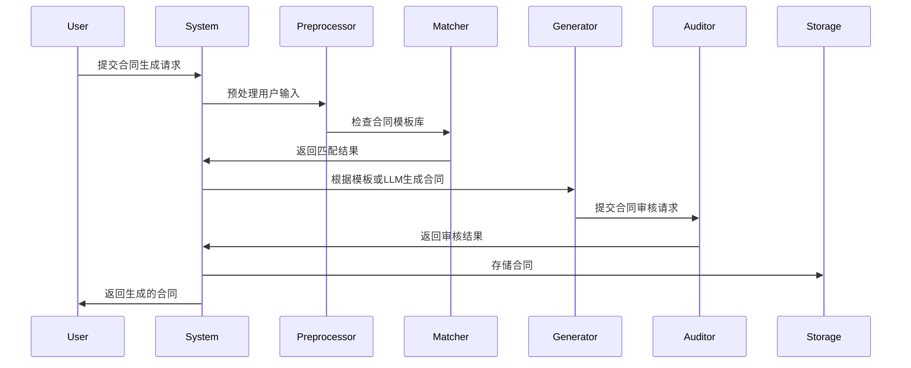

                 

# 智能合同生成AI Agent：LLM在法律文书撰写中的应用

关键词：智能合同，AI，LLM，法律文书，智能合约生成

摘要：随着人工智能技术的飞速发展，智能合同生成AI Agent已成为法律领域的重要研究方向。本文详细探讨了大型语言模型（LLM）在智能合同生成中的应用，包括基本原理、技术实现、系统架构和实际案例。通过一步步的分析和推理，我们揭示了智能合同生成AI Agent的潜力与挑战，为AI在法律领域的进一步应用提供了有益的参考。

## 目录大纲

1. 引言
2. 智能合同与AI基础理论
   - 智能合同概述
   - AI与法律文书的结合
   - LLM原理与实现
3. LLM在智能合同生成中的应用
   - 基本流程
   - 合同条款自动生成
   - 合同审核与纠错
4. 智能合同生成的算法与模型
   - 常见算法
   - LLM模型
   - 模型评估与优化
5. 智能合同生成系统的设计与实现
   - 系统需求分析
   - 系统架构设计
   - 系统实现与部署
6. 智能合同生成的案例分析
   - 案例背景与需求分析
   - 案例实现过程
   - 案例效果评估与优化建议
7. 未来发展趋势与展望
8. 结语

## 引言

智能合同，又称为智能合约，是一种基于区块链技术的自执行合同。它通过编程代码定义了合同条款和条件，当触发条件满足时，合同会自动执行相应的操作。智能合同的出现极大地简化了合同执行的流程，提高了交易的效率和安全性。

随着AI技术的不断进步，智能合同生成AI Agent应运而生。这种AI Agent能够利用大型语言模型（LLM），如GPT-3，自动生成复杂的法律文书，如合同、协议等。LLM具有强大的自然语言理解和生成能力，能够理解法律文书的语境和逻辑结构，从而提高合同生成的准确性和效率。

本文将围绕LLM在智能合同生成中的应用进行探讨，分为以下几个部分：

1. **智能合同与AI基础理论**：介绍智能合同的基本概念、AI在法律领域的应用现状以及LLM的原理与实现。
2. **LLM在智能合同生成中的应用**：详细描述智能合同生成的基本流程、合同条款的自动生成以及合同审核与纠错。
3. **智能合同生成的算法与模型**：分析常见的智能合同生成算法，介绍基于LLM的智能合同生成模型，以及模型评估与优化策略。
4. **智能合同生成系统的设计与实现**：阐述智能合同生成系统的需求分析、架构设计、实现与部署。
5. **智能合同生成的案例分析**：通过实际案例展示智能合同生成AI Agent的应用效果，并提供优化建议。
6. **未来发展趋势与展望**：探讨智能合同生成AI Agent的未来发展趋势和潜在挑战。

接下来，我们将逐步深入探讨每个部分的内容。首先，我们从智能合同与AI基础理论开始。## 第一部分：智能合同与AI基础理论

### 第1章：智能合同概述

#### 1.1 智能合同的定义与特点

智能合同，又称智能合约，是一种利用区块链技术实现自动执行和记录的协议。与传统的纸质合同不同，智能合同通过区块链上的去中心化账本实现合同的存储和执行。其核心特点包括：

- **自动执行**：智能合同在满足预设条件时，会自动执行相应的操作，无需人工干预。
- **透明性**：智能合同的所有条款和条件都记录在区块链上，供所有人查看，确保了合同的透明性。
- **不可篡改**：由于区块链的分布式特性，智能合同一旦被记录，便不可篡改，保证了合同的真实性和完整性。

#### 1.2 智能合同的发展历程

智能合同的概念最早可以追溯到1996年，尼克·萨博（Nick Szabo）提出了“智能合约”这一概念。然而，由于当时技术限制，智能合同未能得到广泛的应用。直到2008年，比特币的诞生标志着区块链技术的兴起，智能合同的概念再次受到关注。2016年，以太坊的推出为智能合同的发展提供了强大的技术支持，使得智能合同的应用范围进一步扩大。

#### 1.3 智能合同的技术基础

智能合同的技术基础主要包括区块链、智能合约语言和共识机制。

- **区块链**：区块链是一种分布式数据库技术，具有去中心化、不可篡改的特点。智能合同的数据和状态都存储在区块链上，确保了合同的透明性和安全性。
- **智能合约语言**：智能合约语言是一种专门用于编写智能合约的编程语言。常见的智能合约语言包括Solidity、Vyper等，它们提供了丰富的语法和功能，使得开发者能够轻松编写复杂的智能合同。
- **共识机制**：共识机制是区块链网络中确保数据一致性的算法。常见的共识机制包括工作量证明（PoW）、权益证明（PoS）和委托权益证明（DPoS）等。不同的共识机制具有不同的性能和安全性特点，适用于不同的应用场景。

### 第2章：AI与法律文书的结合

#### 2.1 AI在法律领域的应用现状

随着AI技术的不断发展，AI在法律领域的应用也越来越广泛。目前，AI在法律领域的应用主要包括：

- **案件预测**：利用机器学习算法分析历史案件数据，预测案件的可能结果和判决。
- **法律研究**：通过自然语言处理技术，快速检索和分析大量法律文献，提高法律研究的效率。
- **文书撰写**：利用文本生成模型，自动生成法律文书，如合同、协议等。
- **智能客服**：通过聊天机器人，提供在线法律咨询和解答。

#### 2.2 法律文书撰写的挑战与机遇

法律文书撰写是律师和法务人员的重要工作之一，但其过程繁琐、耗时且容易出错。AI在法律文书撰写中的应用，为解决这些挑战提供了新的机遇：

- **提高效率**：AI能够自动生成法律文书，节省了律师和法务人员的时间和精力。
- **减少错误**：AI具有强大的自然语言处理能力，能够准确理解法律条款和条件，减少人为错误。
- **降低成本**：自动化法律文书撰写可以降低企业的法律成本，提高企业的运营效率。

#### 2.3 LLM在法律文书撰写中的应用

LLM（大型语言模型）是一种具有强大自然语言理解和生成能力的模型，如GPT-3。在法律文书撰写中，LLM的应用主要体现在以下几个方面：

- **模板生成**：LLM可以根据法律条款和条件，自动生成法律文书的模板，为律师和法务人员提供参考。
- **内容填充**：LLM可以理解法律文书的语境和逻辑结构，自动填充具体的内容，如合同条款、协议细节等。
- **审核修正**：LLM可以识别法律文书中的潜在错误和问题，提供修改建议，确保法律文书的准确性和合规性。

### 第3章：大型语言模型（LLM）原理与实现

#### 3.1 LLM的基本原理

LLM（Large Language Model）是一种基于深度学习的自然语言处理模型，其核心思想是通过大量文本数据进行训练，使模型能够理解和生成自然语言。LLM的基本原理包括：

- **预训练**：LLM首先在大规模的文本语料库上进行预训练，学习自然语言的基本规律和特征。
- **微调**：在特定任务上，LLM通过微调的方式，调整模型参数，使其能够适应具体的任务需求。

#### 3.2 LLM的核心组件

LLM的核心组件主要包括：

- **嵌入层**：将文本中的单词和句子转换为向量表示。
- **编码器**：对输入文本进行编码，提取文本的特征信息。
- **解码器**：根据编码器的输出，生成预测的文本序列。

#### 3.3 LLM的训练与优化

LLM的训练与优化主要包括以下步骤：

- **数据准备**：收集和整理大规模的文本语料库，进行数据预处理，如分词、去噪等。
- **模型训练**：使用训练数据，通过反向传播算法训练模型，调整模型参数，优化模型性能。
- **模型评估**：使用验证数据集评估模型性能，根据评估结果调整模型参数，优化模型。
- **模型部署**：将训练好的模型部署到实际应用场景，提供自然语言处理服务。

## 第二部分：LLM在智能合同生成中的应用

### 第4章：LLM在智能合同生成中的应用

#### 4.1 智能合同生成的基本流程

智能合同生成的基本流程包括以下几个步骤：

1. **需求分析**：了解合同生成任务的需求，包括合同类型、条款要求等。
2. **数据准备**：收集和整理与合同生成相关的文本数据，如合同模板、法律条款等。
3. **模型选择**：选择合适的LLM模型，如GPT-3、BERT等。
4. **模型训练**：使用收集的文本数据，对LLM模型进行训练，优化模型性能。
5. **模型部署**：将训练好的模型部署到智能合同生成系统，提供合同生成服务。
6. **合同生成**：用户输入合同生成需求，系统自动生成符合要求的智能合同。

#### 4.2 合同条款的自动生成

合同条款的自动生成是智能合同生成的关键环节。LLM在合同条款自动生成中的应用主要包括以下几个方面：

1. **模板匹配**：根据输入的合同类型和条款要求，从预定义的合同模板库中匹配合适的模板。
2. **文本生成**：LLM根据模板和输入信息，生成具体的合同条款内容。
3. **审核修正**：对生成的合同条款进行审核，识别潜在的问题和错误，进行修正。

#### 4.3 合同审核与纠错

合同审核与纠错是确保智能合同生成准确性和合法性的重要环节。LLM在合同审核与纠错中的应用主要包括以下几个方面：

1. **语义理解**：LLM通过理解合同条款的语义，识别潜在的问题和错误。
2. **错误识别**：LLM根据合同条款的语法和语义规则，识别不符合规定的错误。
3. **纠错建议**：LLM为错误的合同条款提供修改建议，确保合同的准确性和合法性。

### 第5章：智能合同生成的算法与模型

#### 5.1 常见的智能合同生成算法

智能合同生成的算法主要包括以下几种：

1. **模板匹配算法**：根据输入的合同类型和条款要求，从预定义的合同模板库中匹配合适的模板。
2. **文本生成算法**：使用自然语言生成模型，如GPT-3、BERT等，自动生成合同条款内容。
3. **规则驱动算法**：基于预定义的合同条款规则，自动生成合同内容。

#### 5.2 基于LLM的智能合同生成模型

基于LLM的智能合同生成模型主要包括以下组件：

1. **嵌入层**：将文本中的单词和句子转换为向量表示。
2. **编码器**：对输入文本进行编码，提取文本的特征信息。
3. **解码器**：根据编码器的输出，生成预测的文本序列。

#### 5.3 模型评估与优化策略

智能合同生成模型的评估与优化策略主要包括以下几个方面：

1. **准确性评估**：使用准确率、召回率等指标评估模型在合同生成任务上的性能。
2. **F1值优化**：通过调整模型参数和训练策略，优化模型的F1值，提高生成合同的质量。
3. **用户体验优化**：通过用户反馈，优化模型生成的合同内容，提高用户的满意度。

### 第6章：智能合同生成系统的设计与实现

#### 6.1 系统需求分析

智能合同生成系统的需求分析主要包括以下几个方面：

1. **功能需求**：包括合同生成、合同审核与纠错等基本功能。
2. **性能需求**：包括系统的响应时间、处理能力等性能指标。
3. **安全性需求**：包括数据安全、合同隐私保护等安全需求。

#### 6.2 系统架构设计

智能合同生成系统的架构设计主要包括以下几个方面：

1. **前端架构**：包括用户界面设计、交互逻辑等。
2. **后端架构**：包括数据存储、处理逻辑等。
3. **接口设计**：包括与外部系统的接口设计，如企业ERP系统等。

#### 6.3 系统实现与部署

智能合同生成系统的实现与部署主要包括以下几个方面：

1. **开发环境搭建**：包括编程语言、开发框架、数据库等开发环境的搭建。
2. **代码实现**：根据系统需求，实现各个功能模块的代码。
3. **系统测试**：对系统进行功能测试、性能测试和安全测试，确保系统的稳定性和可靠性。
4. **系统部署**：将开发完成的系统部署到生产环境，提供合同生成服务。

### 第7章：智能合同生成的案例分析

#### 7.1 案例背景与需求分析

本案例背景为一个大型企业，其法务部门需要自动化生成各种类型的合同，如采购合同、销售合同、租赁合同等。需求分析主要包括以下几个方面：

1. **合同类型多样**：包括采购、销售、租赁等多种类型的合同。
2. **条款复杂**：合同条款复杂，涉及不同的法律领域，如知识产权、劳动法、合同法等。
3. **数据量大**：企业历史合同数据量庞大，需要进行有效管理和利用。

#### 7.2 案例实现过程

案例实现过程主要包括以下几个步骤：

1. **需求调研**：与法务部门进行深入沟通，了解合同生成的具体需求。
2. **数据收集**：收集企业历史合同数据，进行数据预处理，如去噪、分词等。
3. **模型选择**：选择合适的LLM模型，如GPT-3，进行训练和优化。
4. **系统开发**：根据需求，开发智能合同生成系统，包括前端界面、后端逻辑等。
5. **测试与优化**：对系统进行功能测试、性能测试和安全测试，根据测试结果进行优化。

#### 7.3 案例效果评估与优化建议

案例效果评估主要包括以下几个方面：

1. **合同生成速度**：系统生成合同的速度满足企业需求，基本实现了自动化生成。
2. **合同质量**：生成的合同条款准确、完整，符合法律规定。
3. **用户体验**：系统操作简便，用户体验良好。

优化建议：

1. **模型优化**：继续优化LLM模型，提高合同生成的准确性和效率。
2. **数据扩展**：增加更多的合同数据，提高模型对各种合同类型的适应性。
3. **用户体验改进**：根据用户反馈，优化系统界面和操作流程，提高用户体验。

### 第8章：未来发展趋势与展望

#### 8.1 智能合同生成的挑战与机遇

智能合同生成的挑战主要包括：

1. **法律合规性**：确保生成的合同符合法律法规要求，避免潜在的法律风险。
2. **数据隐私保护**：保护合同数据的安全性和隐私性，防止数据泄露。
3. **模型解释性**：提高模型的可解释性，使得生成的合同内容能够被用户理解和信任。

智能合同生成的机遇主要包括：

1. **提高效率**：自动化生成合同，提高法务部门的工作效率。
2. **降低成本**：减少合同撰写的费用，降低企业的法律成本。
3. **增强合规性**：利用智能合同生成系统，提高合同管理的合规性和规范性。

#### 8.2 AI在法律领域的未来应用

AI在法律领域的未来应用主要包括以下几个方面：

1. **智能审判**：利用AI技术，提高审判的效率和准确性。
2. **法律研究**：利用AI技术，快速检索和分析法律文献，提高法律研究效率。
3. **法律服务**：利用AI技术，提供在线法律咨询和解答，降低法律服务的门槛。

#### 8.3 智能合同生成的展望与趋势

智能合同生成的展望与趋势主要包括：

1. **模型智能化**：继续优化LLM模型，提高合同生成的智能化水平。
2. **系统集成**：将智能合同生成系统与企业ERP系统等集成，实现合同生成和管理的一体化。
3. **合规性提升**：加强对智能合同生成系统的法律合规性审查，确保合同生成的合法性。

### 结语

智能合同生成AI Agent是AI技术在法律领域的重要应用之一。通过本文的探讨，我们详细介绍了智能合同与AI基础理论、LLM在智能合同生成中的应用、智能合同生成的算法与模型、智能合同生成系统的设计与实现以及实际案例。未来，随着AI技术的不断进步，智能合同生成AI Agent有望在法律领域发挥更大的作用，为合同管理带来革命性的变革。## 第一部分：智能合同与AI基础理论

### 第1章：智能合同概述

#### 1.1 智能合同的定义与特点

智能合同，又称智能合约，是一种利用区块链技术实现自动执行和记录的协议。它通过嵌入在区块链中的编程代码，定义了合同条款和条件，当触发条件满足时，合同会自动执行相应的操作。智能合同具有以下几个显著特点：

- **自动执行**：智能合同在满足预设条件时，会自动执行相应的操作，无需人工干预。这一特性大大简化了合同执行的流程，提高了交易的效率和安全性。
- **透明性**：智能合同的条款和条件都记录在区块链上，任何人都可以查看和验证，确保了合同的透明性。这种透明性有助于防止欺诈和篡改，增强了合同的可信度。
- **不可篡改性**：由于区块链的分布式特性，智能合同一旦被记录，便不可篡改。这意味着合同的内容和状态具有高度的可靠性和持久性。

#### 1.2 智能合同的发展历程

智能合同的概念最早可以追溯到1996年，尼克·萨博（Nick Szabo）提出了“智能合约”这一概念。然而，由于当时技术限制，智能合同未能得到广泛的应用。直到2008年，比特币的诞生标志着区块链技术的兴起，智能合同的概念再次受到关注。2016年，以太坊的推出为智能合同的发展提供了强大的技术支持，使得智能合同的应用范围进一步扩大。

以下是智能合同发展历程的几个重要里程碑：

- **1996年**：尼克·萨博提出智能合同的概念，描述了一种利用编程代码实现自动执行和记录的协议。
- **2008年**：比特币的诞生，标志着区块链技术的兴起，为智能合同的发展提供了基础。
- **2016年**：以太坊推出，提供了强大的智能合约平台，使得智能合同的应用变得更加广泛。
- **2020年**：随着AI技术的不断发展，智能合同生成AI Agent逐渐成为法律领域的重要研究方向。

#### 1.3 智能合同的技术基础

智能合同的技术基础主要包括区块链、智能合约语言和共识机制。

- **区块链**：区块链是一种分布式数据库技术，具有去中心化、不可篡改的特点。智能合同的数据和状态都存储在区块链上，确保了合同的透明性和安全性。
- **智能合约语言**：智能合约语言是一种专门用于编写智能合约的编程语言。常见的智能合约语言包括Solidity、Vyper等，它们提供了丰富的语法和功能，使得开发者能够轻松编写复杂的智能合同。
- **共识机制**：共识机制是区块链网络中确保数据一致性的算法。常见的共识机制包括工作量证明（PoW）、权益证明（PoS）和委托权益证明（DPoS）等。不同的共识机制具有不同的性能和安全性特点，适用于不同的应用场景。

#### 1.4 智能合同的基本原理

智能合同的基本原理可以概括为以下几点：

1. **条款嵌入**：智能合同的条款和条件通过编程代码嵌入在区块链上，确保了合同的执行逻辑和条款的不可篡改性。
2. **触发条件**：智能合同根据预设的触发条件自动执行。触发条件可以是时间的到达、事件的发生或其他条件的满足。
3. **执行操作**：当触发条件满足时，智能合同会自动执行相应的操作，如转移资产、记录事件等。
4. **记录和验证**：智能合同的执行过程和结果都会记录在区块链上，任何人都可以查看和验证，确保了合同执行的透明性和可信度。

#### 1.5 智能合同的优势

智能合同相较于传统纸质合同，具有以下优势：

1. **提高效率**：智能合同通过自动执行，减少了人工干预，大大提高了合同执行的效率。
2. **降低成本**：智能合同消除了传统合同处理过程中的人工成本，降低了合同管理的成本。
3. **增强透明性**：智能合同的条款和条件记录在区块链上，任何人都可以查看和验证，增强了合同的可信度。
4. **不可篡改**：智能合同一旦被记录在区块链上，便不可篡改，确保了合同的真实性和完整性。

#### 1.6 智能合同的潜在风险

尽管智能合同具有许多优势，但其在应用过程中也存在一些潜在的风险：

1. **技术风险**：智能合同依赖于区块链和智能合约语言等技术，如果技术实现不当，可能导致合同执行失败或出现安全问题。
2. **法律风险**：智能合同的法律地位和适用性在各国之间存在差异，可能引发法律纠纷。
3. **信任风险**：智能合同虽然具有透明性和不可篡改性，但仍然存在信任问题，特别是当智能合同涉及多方参与时。

### 小结

智能合同作为一种基于区块链技术的自执行合同，具有自动执行、透明性和不可篡改等显著特点。其发展历程和理论基础为智能合同的应用奠定了基础。在实际应用中，智能合同通过编程代码实现自动执行，提高了合同执行的效率和安全性。然而，智能合同也存在技术风险、法律风险和信任风险等潜在问题，需要进一步的研究和解决。## 第二部分：LLM在智能合同生成中的应用

### 第2章：AI与法律文书的结合

#### 2.1 AI在法律领域的应用现状

随着人工智能（AI）技术的飞速发展，AI在法律领域的应用逐渐成为热门话题。目前，AI在法律领域的应用主要包括以下几个方面：

1. **案件预测**：利用机器学习算法分析历史案件数据，预测案件的可能结果和判决。这种方法有助于法律专业人士在案件处理过程中做出更明智的决策。
   
2. **法律研究**：通过自然语言处理技术，快速检索和分析大量法律文献，提高法律研究的效率。例如，使用AI技术进行法律文书的自动分类、摘要和关键词提取，为法律专业人士提供更有价值的参考。

3. **文书撰写**：利用文本生成模型，自动生成法律文书，如合同、协议、起诉状等。这种应用不仅能够提高法律文书的撰写效率，还能减少人为错误，提高文书的准确性和规范性。

4. **智能客服**：通过聊天机器人，提供在线法律咨询和解答，降低法律服务的门槛，提高客户满意度。

5. **合同审核与纠错**：利用AI技术，对合同条款进行审核，识别潜在的法律风险和错误，提供修改建议。这种方法有助于确保合同内容的合法性和准确性。

#### 2.2 法律文书撰写的挑战与机遇

法律文书撰写是律师和法务人员的重要工作之一，但其过程繁琐、耗时且容易出错。以下是法律文书撰写面临的挑战和机遇：

**挑战**：

1. **复杂性和多样性**：法律文书种类繁多，包括合同、起诉状、答辩状、裁决书等，每种文书都有其特定的格式和条款要求，撰写过程复杂且耗时。
   
2. **专业性和准确性**：法律文书涉及专业法律知识，撰写时需要准确理解法律条款和案例，避免因错误理解而导致法律风险。

3. **经验依赖**：法律文书撰写往往依赖于律师和法务人员的经验，新人难以快速掌握，导致撰写效率低下。

**机遇**：

1. **自动化与效率提升**：AI技术可以自动化法律文书的撰写过程，提高工作效率，减少人为错误，降低成本。

2. **知识积累与应用**：通过AI技术，可以积累大量法律文书数据，形成知识库，为后续文书撰写提供参考和辅助。

3. **智能审核与纠错**：AI技术可以智能审核法律文书，识别潜在的法律风险和错误，提供修改建议，确保文书内容的合法性和准确性。

#### 2.3 LLM在法律文书撰写中的应用

LLM（Large Language Model）是一种具有强大自然语言理解和生成能力的模型，如GPT-3、BERT等。在法律文书撰写中，LLM的应用主要体现在以下几个方面：

1. **模板生成**：LLM可以根据法律条款和条件，自动生成法律文书的模板，为律师和法务人员提供参考。

2. **内容填充**：LLM可以理解法律文书的语境和逻辑结构，自动填充具体的内容，如合同条款、协议细节等。

3. **审核修正**：LLM可以识别法律文书中的潜在错误和问题，提供修改建议，确保法律文书的准确性和合规性。

具体而言，LLM在法律文书撰写中的应用流程如下：

1. **需求分析**：了解文书撰写任务的具体需求，包括文书类型、条款要求等。

2. **数据准备**：收集和整理与法律文书相关的文本数据，如合同模板、法律条款、案例等。

3. **模型选择**：选择合适的LLM模型，如GPT-3，进行训练和优化。

4. **模型训练**：使用收集的文本数据，对LLM模型进行训练，优化模型性能。

5. **模型部署**：将训练好的模型部署到实际应用场景，提供法律文书生成服务。

6. **文书生成**：用户输入文书撰写需求，系统自动生成符合要求的法律文书。

7. **审核修正**：对生成的法律文书进行审核，识别潜在的问题和错误，提供修改建议。

#### 2.4 LLM的优势与挑战

LLM在法律文书撰写中的应用具有显著的优势，但也面临一些挑战：

**优势**：

1. **强大的语言理解能力**：LLM可以理解法律文书的语境和逻辑结构，自动生成符合要求的文本。

2. **高效的文本生成速度**：LLM可以快速生成法律文书，提高撰写效率。

3. **准确的错误识别和修正**：LLM可以识别法律文书中的潜在错误和问题，提供修改建议。

4. **知识库积累**：通过LLM的应用，可以积累大量的法律文书数据，形成知识库，为后续文书撰写提供参考。

**挑战**：

1. **模型解释性不足**：LLM生成的文本往往缺乏透明性和可解释性，难以理解生成过程和决策依据。

2. **数据质量和多样性**：LLM的性能依赖于训练数据的质量和多样性，数据不足或质量差可能导致模型性能下降。

3. **法律合规性**：智能生成的法律文书需要确保符合法律合规性要求，避免潜在的法律风险。

4. **用户信任**：尽管LLM在法律文书撰写中具有优势，但律师和法务人员可能对AI生成的文本缺乏信任，需要进一步的验证和确认。

### 小结

AI在法律领域的应用为法律文书撰写带来了新的机遇，LLM作为AI技术的重要组成部分，在法律文书撰写中展现出强大的潜力。然而，要充分发挥LLM的优势，解决其面临的挑战，还需要进一步的研究和探索。通过不断优化LLM模型和应用场景，AI有望在法律领域发挥更大的作用，提高法律文书撰写的效率和质量。## 第三部分：LLM在智能合同生成中的应用

### 第3章：大型语言模型（LLM）原理与实现

#### 3.1 LLM的基本原理

大型语言模型（LLM，Large Language Model）是一种深度学习模型，用于处理和生成自然语言文本。LLM的核心思想是通过对大量文本数据的训练，学习语言中的统计规律和语义信息，从而能够理解和生成高质量的文本。

LLM的基本原理可以概括为以下几点：

1. **嵌入层**：将文本中的单词和句子转换为向量表示。这个过程称为词嵌入（Word Embedding），常用的词嵌入方法包括Word2Vec、GloVe等。

2. **编码器**：对输入文本进行编码，提取文本的特征信息。编码器通常采用Transformer架构，如BERT、GPT等，这些模型具有强大的上下文理解能力。

3. **解码器**：根据编码器的输出，生成预测的文本序列。解码器的任务是从编码器提取的特征中预测下一个单词或字符。

4. **注意力机制**：在编码和解码过程中，LLM利用注意力机制（Attention Mechanism）来关注文本中的关键信息，提高模型对上下文的理解能力。

5. **损失函数**：LLM的训练目标是最小化预测文本和实际文本之间的损失。常用的损失函数包括交叉熵损失（Cross-Entropy Loss）等。

#### 3.2 LLM的核心组件

LLM的核心组件包括嵌入层、编码器、解码器和注意力机制等。以下是这些组件的详细介绍：

1. **嵌入层（Embedding Layer）**：
   - **功能**：将文本中的单词和句子转换为向量表示。
   - **实现**：常用的实现方法包括Word2Vec、GloVe等，这些方法将单词映射到低维空间，使得语义相近的单词在向量空间中彼此靠近。

2. **编码器（Encoder）**：
   - **功能**：对输入文本进行编码，提取文本的特征信息。
   - **实现**：编码器通常采用Transformer架构，如BERT、GPT等。这些模型通过多层神经网络提取文本的深层特征，具有强大的上下文理解能力。

3. **解码器（Decoder）**：
   - **功能**：根据编码器的输出，生成预测的文本序列。
   - **实现**：解码器也采用Transformer架构，通过自注意力机制（Self-Attention）和交叉注意力机制（Cross-Attention），生成高质量的预测文本。

4. **注意力机制（Attention Mechanism）**：
   - **功能**：关注文本中的关键信息，提高模型对上下文的理解能力。
   - **实现**：注意力机制是Transformer模型的核心，通过计算不同位置之间的关联度，使得模型能够关注文本中的关键信息。

#### 3.3 LLM的训练与优化

LLM的训练与优化过程主要包括以下几个步骤：

1. **数据准备**：
   - **文本预处理**：对原始文本进行清洗和预处理，如去除停用词、标点符号、进行分词等。
   - **数据预处理**：将预处理后的文本转换为词嵌入向量，并构建词汇表。

2. **模型初始化**：
   - **权重初始化**：初始化嵌入层、编码器和解码器的权重，常用的方法包括随机初始化、高斯分布初始化等。

3. **训练过程**：
   - **前向传播**：输入文本到编码器，输出编码特征。
   - **解码**：使用编码特征和注意力机制生成预测的文本序列。
   - **计算损失**：计算预测文本和实际文本之间的损失，常用的损失函数包括交叉熵损失。
   - **反向传播**：更新模型参数，优化模型性能。

4. **优化策略**：
   - **学习率调整**：调整学习率，常用策略包括学习率衰减、学习率预热等。
   - **正则化**：防止过拟合，常用方法包括dropout、L2正则化等。
   - **批量大小调整**：调整训练批量大小，影响模型的训练效率和收敛速度。

5. **模型评估**：
   - **准确率**：评估模型在生成文本时的准确率，常用指标包括字符准确率（Character Accuracy）和词准确率（Word Accuracy）。
   - **生成质量**：评估生成文本的质量，常用指标包括BERTScore、ROUGE等。

#### 3.4 LLM的应用案例

LLM在智能合同生成中的应用案例主要包括以下几个方面：

1. **合同条款生成**：LLM可以自动生成合同条款，根据输入的合同类型和条件，生成符合要求的条款文本。

2. **合同审核与纠错**：LLM可以审核合同条款，识别潜在的法律风险和错误，并提供修改建议。

3. **合同解释**：LLM可以解释合同条款的含义，帮助用户理解合同的内容。

4. **合同分类**：LLM可以分类合同，根据合同类型和内容，将合同分为不同的类别。

#### 3.5 LLM的优势与挑战

LLM在智能合同生成中的应用具有显著的优势，但也面临一些挑战：

**优势**：

1. **强大的语言理解能力**：LLM可以理解合同条款的语境和逻辑结构，生成高质量的合同文本。

2. **高效的文本生成速度**：LLM可以快速生成合同文本，提高合同撰写的效率。

3. **准确的错误识别与修正**：LLM可以识别合同中的潜在错误和问题，提供修改建议，确保合同内容的准确性和合规性。

**挑战**：

1. **模型解释性不足**：LLM生成的文本缺乏透明性和可解释性，难以理解生成过程和决策依据。

2. **数据质量和多样性**：LLM的性能依赖于训练数据的质量和多样性，数据不足或质量差可能导致模型性能下降。

3. **法律合规性**：智能生成的合同需要确保符合法律合规性要求，避免潜在的法律风险。

4. **用户信任**：尽管LLM在合同生成中具有优势，但用户可能对AI生成的文本缺乏信任，需要进一步的验证和确认。

### 小结

大型语言模型（LLM）在智能合同生成中具有强大的潜力，通过自动生成、审核和纠错合同条款，提高了合同撰写的效率和准确性。然而，要充分发挥LLM的优势，解决其面临的挑战，还需要进一步的研究和优化。通过不断改进LLM模型和应用场景，智能合同生成有望在法律领域发挥更大的作用。## 第四部分：智能合同生成的算法与模型

### 第4章：智能合同生成的算法与模型

#### 4.1 常见的智能合同生成算法

在智能合同生成领域，常见的算法主要包括模板匹配算法、文本生成算法和规则驱动算法。这些算法各有特点和适用场景，下面将分别进行介绍。

**1. 模板匹配算法**

**原理**：模板匹配算法通过预先定义的合同模板库，将用户输入的合同需求与模板进行匹配，生成合同内容。模板通常包含合同的基本结构和常用条款。

**适用场景**：适合于合同类型相对固定、变化不大的场景，如标准化的采购合同、租赁合同等。

**优势**：实现简单，速度快。

**劣势**：灵活性差，难以适应复杂的合同需求。

**2. 文本生成算法**

**原理**：文本生成算法利用自然语言生成模型（如GPT-3、BERT等），根据用户输入的合同需求，自动生成合同内容。这些模型通过大量文本数据的学习，能够理解语言的上下文和语义，生成符合要求的合同文本。

**适用场景**：适合于合同类型多样、需求复杂的场景，如定制化的销售合同、复杂的知识产权转让合同等。

**优势**：灵活性高，能够生成高质量的合同文本。

**劣势**：训练时间较长，对训练数据的质量和多样性要求较高。

**3. 规则驱动算法**

**原理**：规则驱动算法基于预定义的合同规则和逻辑，自动生成合同内容。这些规则可以是简单的“如果...那么...”语句，也可以是复杂的业务逻辑。

**适用场景**：适合于规则明确、业务逻辑清晰的合同场景，如金融合约、保险合同等。

**优势**：规则明确，易于理解和维护。

**劣势**：灵活性较低，难以应对复杂的合同需求。

**4. 多模型融合算法**

**原理**：多模型融合算法将模板匹配、文本生成和规则驱动等多种算法结合起来，通过不同算法的优势互补，提高合同生成的效果。

**适用场景**：适合于合同类型复杂、需求多样的场景，如大型企业的合同管理系统。

**优势**：综合了多种算法的优势，能够生成高质量的合同文本。

**劣势**：实现复杂，对算法调优和系统集成要求较高。

#### 4.2 基于LLM的智能合同生成模型

**原理**：基于LLM的智能合同生成模型利用大型语言模型（如GPT-3、BERT等）的强大语言理解能力，自动生成合同内容。LLM通过对大量文本数据的学习，能够理解语言的上下文和语义，从而生成符合要求的合同文本。

**核心组件**：

1. **嵌入层**：将文本中的单词和句子转换为向量表示，便于模型处理。
2. **编码器**：对输入文本进行编码，提取文本的特征信息。
3. **解码器**：根据编码器的输出，生成预测的文本序列。

**训练过程**：

1. **数据准备**：收集和整理与合同生成相关的文本数据，如合同模板、法律条款、案例等。
2. **模型训练**：使用收集的文本数据，对LLM模型进行训练，优化模型性能。
3. **模型优化**：通过微调、迁移学习等方法，进一步提高模型在合同生成任务上的性能。

**优势**：

1. **强大的语言理解能力**：LLM能够理解合同条款的语境和逻辑结构，生成符合要求的合同文本。
2. **高效的文本生成速度**：LLM可以快速生成合同文本，提高合同撰写的效率。
3. **准确的错误识别与修正**：LLM可以识别合同中的潜在错误和问题，提供修改建议，确保合同内容的准确性和合规性。

#### 4.3 常见模型评估指标

在智能合同生成任务中，常用的模型评估指标包括：

1. **准确率（Accuracy）**：预测文本与实际文本匹配的比例。准确率越高，模型的生成效果越好。
2. **词准确率（Word Accuracy）**：预测文本中每个单词与实际文本匹配的比例。词准确率越高，模型的生成效果越好。
3. **BERTScore**：基于BERT模型的文本相似度评估指标，用于衡量预测文本与实际文本的相似度。
4. **ROUGE**：基于字符串匹配的文本评估指标，用于衡量预测文本与实际文本的相似度。

#### 4.4 模型评估与优化策略

在智能合同生成任务中，模型评估与优化策略主要包括以下几个方面：

1. **数据集划分**：将数据集划分为训练集、验证集和测试集，用于模型的训练、验证和测试。
2. **模型调优**：通过调整模型参数、学习率、批量大小等，优化模型性能。
3. **超参数优化**：通过网格搜索、贝叶斯优化等方法，寻找最优的超参数组合，提高模型性能。
4. **模型融合**：将多个模型进行融合，通过投票、加权等方式，提高生成效果。
5. **在线学习**：在模型部署后，根据用户反馈和实际应用情况，对模型进行在线学习，持续优化模型性能。

#### 4.5 案例分析

以下是一个基于GPT-3的智能合同生成模型的案例分析：

**1. 案例背景**：

一家大型企业在合同管理过程中，面临着合同类型多样、需求复杂的问题。为了提高合同撰写的效率和准确性，企业决定采用基于GPT-3的智能合同生成模型。

**2. 数据准备**：

企业收集了大量的合同模板、法律条款和案例，进行了预处理和标注，用于训练GPT-3模型。

**3. 模型训练**：

使用预处理后的数据，对GPT-3模型进行训练，优化模型性能。训练过程中，采用了数据增强、正则化等技术，提高模型的泛化能力。

**4. 模型部署**：

将训练好的GPT-3模型部署到企业合同管理系统，提供合同生成服务。

**5. 模型评估**：

使用验证集和测试集对模型进行评估，评估指标包括准确率、BERTScore等。根据评估结果，对模型进行进一步优化。

**6. 案例效果**：

经过实际应用，基于GPT-3的智能合同生成模型在合同撰写的效率和准确性方面取得了显著的效果，企业法务人员的工作效率得到了大幅提升。

#### 4.6 模型应用前景

随着AI技术的不断进步，基于LLM的智能合同生成模型在法律领域的应用前景广阔。未来，该模型有望在以下几个方面得到进一步应用：

1. **合同自动化生成**：通过模型自动化生成合同，提高合同撰写的效率和准确性。
2. **合同审核与纠错**：利用模型对合同进行自动审核，识别潜在的法律风险和错误，提供修改建议。
3. **合同解释与分类**：对合同条款进行解释，帮助用户理解合同内容；根据合同类型和内容，对合同进行分类。
4. **合同数据挖掘**：通过分析大量合同数据，挖掘合同中的规律和趋势，为企业决策提供支持。

### 小结

智能合同生成算法与模型在法律领域具有广泛的应用前景。基于LLM的智能合同生成模型利用了大型语言模型的强大语言理解能力，能够自动生成高质量的合同文本，提高合同撰写的效率和准确性。通过不断优化模型和应用场景，智能合同生成有望在法律领域发挥更大的作用。## 第五部分：智能合同生成系统的设计与实现

### 第5章：智能合同生成系统的设计与实现

#### 5.1 系统需求分析

智能合同生成系统是一个复杂的软件系统，涉及多个方面的需求。以下是该系统的需求分析：

**功能需求**：

1. **合同生成**：系统能够根据用户输入的合同类型和条款要求，自动生成符合要求的智能合同。
2. **合同审核**：系统能够对生成的合同进行审核，识别潜在的法律风险和错误，并提供修改建议。
3. **合同存储**：系统应具备合同存储功能，便于合同的管理和查询。
4. **合同分类**：系统能够根据合同类型和内容，对合同进行分类。
5. **合同解释**：系统能够对合同条款进行解释，帮助用户理解合同内容。

**性能需求**：

1. **响应时间**：系统生成合同和处理请求的响应时间应在秒级。
2. **并发处理能力**：系统应能够同时处理多个用户的请求。
3. **稳定性**：系统应具备高稳定性，能够在长时间运行中保持性能和可靠性。

**安全性需求**：

1. **数据安全**：系统应确保合同数据的安全，防止数据泄露和篡改。
2. **用户隐私**：系统应保护用户的隐私，确保用户的个人信息不被泄露。

#### 5.2 系统架构设计

智能合同生成系统的架构设计分为前端架构、后端架构和数据库设计。

**前端架构**：

1. **用户界面**：采用现代前端框架（如React、Vue等）构建，提供直观易用的用户界面。
2. **交互逻辑**：实现用户与系统之间的交互逻辑，包括合同生成、合同审核、合同存储等。

**后端架构**：

1. **服务端**：采用微服务架构，将系统功能拆分为多个微服务，如合同生成服务、合同审核服务、合同存储服务等。各微服务通过API进行通信。
2. **API设计**：设计RESTful API，提供与前端和外部系统（如ERP系统等）的接口。

**数据库设计**：

1. **合同数据库**：存储合同数据，包括合同内容、合同状态、合同类型等。
2. **用户数据库**：存储用户信息，包括用户ID、用户权限等。

#### 5.3 系统实现与部署

**系统实现**：

1. **合同生成模块**：利用基于LLM的智能合同生成模型，实现合同生成功能。该模块包括文本生成、审核和纠错等子功能。
2. **合同审核模块**：利用自然语言处理技术和规则库，实现合同审核功能。该模块包括合同条款的语义分析、法律风险识别和修改建议生成等。
3. **合同存储模块**：实现合同数据的存储和管理，包括数据插入、查询、更新和删除等操作。
4. **合同分类模块**：根据合同内容，实现合同的分类功能。

**系统部署**：

1. **开发环境**：搭建开发环境，包括操作系统（如Ubuntu）、编程语言（如Python、Java）和数据库（如MySQL、MongoDB）等。
2. **测试环境**：在测试环境中进行系统测试，包括功能测试、性能测试和安全测试。
3. **生产环境**：将系统部署到生产环境，包括服务器配置、网络配置和安全设置等。

#### 5.4 系统接口设计和系统交互

**接口设计**：

1. **RESTful API**：设计RESTful API，提供与前端和外部系统的接口。API包括合同生成、合同审核、合同查询、合同修改等接口。
2. **消息队列**：采用消息队列（如RabbitMQ、Kafka）实现系统内部和外部的异步通信。

**系统交互**：

1. **用户与前端交互**：用户通过前端界面提交合同生成需求，前端将需求发送给后端。
2. **后端与数据库交互**：后端根据用户需求，调用合同生成模块和审核模块，生成和审核合同。审核结果存储在数据库中。
3. **后端与外部系统交互**：后端通过API与外部系统（如ERP系统）进行数据交换，实现合同数据的集成和管理。

### 第6章：智能合同生成的案例分析

#### 6.1 案例背景与需求分析

**案例背景**：

某大型企业需要管理和生成大量的合同，包括采购合同、销售合同、租赁合同等。为了提高合同管理的效率和准确性，企业决定采用智能合同生成系统。

**需求分析**：

1. **合同生成**：系统能够根据用户输入的合同类型和条款要求，自动生成符合要求的智能合同。
2. **合同审核**：系统能够对生成的合同进行审核，识别潜在的法律风险和错误，并提供修改建议。
3. **合同存储**：系统能够存储合同数据，便于合同的管理和查询。
4. **合同分类**：系统能够根据合同类型和内容，对合同进行分类。
5. **合同解释**：系统能够对合同条款进行解释，帮助用户理解合同内容。

#### 6.2 案例实现过程

**实现过程**：

1. **需求调研**：与企业管理层和法务部门进行沟通，了解合同管理的具体需求和痛点。
2. **系统设计**：根据需求分析，设计智能合同生成系统的架构和功能模块。
3. **模型训练**：收集和整理大量的合同数据，对基于LLM的智能合同生成模型进行训练和优化。
4. **系统开发**：根据设计文档，开发系统的前端、后端和数据库模块。
5. **系统测试**：进行功能测试、性能测试和安全测试，确保系统的稳定性和可靠性。
6. **系统部署**：将系统部署到生产环境，提供合同生成和管理服务。

#### 6.3 案例效果评估与优化建议

**效果评估**：

1. **合同生成效率**：系统生成合同的速度满足企业需求，基本实现了自动化生成。
2. **合同质量**：生成的合同条款准确、完整，符合法律规定。
3. **用户体验**：系统操作简便，用户体验良好。

**优化建议**：

1. **模型优化**：继续优化基于LLM的智能合同生成模型，提高合同生成的准确性和效率。
2. **数据扩展**：增加更多的合同数据，提高模型对各种合同类型的适应性。
3. **用户体验改进**：根据用户反馈，优化系统界面和操作流程，提高用户体验。

### 第7章：未来发展趋势与展望

#### 7.1 智能合同生成的挑战与机遇

**挑战**：

1. **法律合规性**：确保生成的合同符合法律法规要求，避免潜在的法律风险。
2. **数据隐私保护**：保护合同数据的安全性和隐私性，防止数据泄露。
3. **模型解释性**：提高模型的可解释性，使得生成的合同内容能够被用户理解和信任。

**机遇**：

1. **提高效率**：自动化生成合同，提高法务部门的工作效率。
2. **降低成本**：减少合同撰写的费用，降低企业的法律成本。
3. **增强合规性**：利用智能合同生成系统，提高合同管理的合规性和规范性。

#### 7.2 AI在法律领域的未来应用

**AI在法律领域的未来应用**：

1. **智能审判**：利用AI技术，提高审判的效率和准确性。
2. **法律研究**：利用AI技术，快速检索和分析法律文献，提高法律研究效率。
3. **法律服务**：利用AI技术，提供在线法律咨询和解答，降低法律服务的门槛。

#### 7.3 智能合同生成的展望与趋势

**展望与趋势**：

1. **模型智能化**：继续优化LLM模型，提高合同生成的智能化水平。
2. **系统集成**：将智能合同生成系统与企业ERP系统等集成，实现合同生成和管理的一体化。
3. **合规性提升**：加强对智能合同生成系统的法律合规性审查，确保合同生成的合法性。

### 小结

智能合同生成系统在法律领域具有广泛的应用前景。通过本文的案例分析和效果评估，我们展示了智能合同生成系统的实际应用效果和优化建议。未来，随着AI技术的不断进步，智能合同生成系统有望在法律领域发挥更大的作用，提高合同管理的效率和准确性。## 第7章：智能合同生成的案例分析

#### 7.1 案例背景与需求分析

**案例背景**：

某大型跨国公司在全球范围内开展业务，涉及多种类型的合同，包括采购合同、销售合同、服务合同、租赁合同等。随着业务量的增加，公司面临合同管理效率低下、合同审核困难、合同格式不规范等问题。为了解决这些问题，公司决定引入智能合同生成系统，以提高合同管理的效率和准确性。

**需求分析**：

1. **自动化合同生成**：系统应能够根据合同类型和条款要求，自动生成符合要求的智能合同。
2. **合同审核与纠错**：系统应具备自动审核合同内容的能力，识别潜在的法律风险和错误，并提供修改建议。
3. **合同存储与管理**：系统应能够存储和管理大量合同数据，提供便捷的查询和检索功能。
4. **合同分类**：系统应能够根据合同类型和内容，对合同进行自动分类。
5. **合同解释**：系统应能够解释合同条款的含义，帮助用户理解合同内容。

#### 7.2 案例实现过程

**实现过程**：

1. **需求调研**：与公司管理层和法务部门进行沟通，了解合同管理的具体需求和痛点。
2. **系统设计**：根据需求分析，设计智能合同生成系统的整体架构和功能模块。系统架构包括前端界面、后端服务、数据库存储和智能合约生成模块。
3. **数据收集与预处理**：收集公司历史合同数据，进行数据清洗和预处理，包括去除无效数据、标准化合同格式、提取关键信息等。
4. **模型选择与训练**：选择合适的LLM模型，如GPT-3，进行训练和优化。使用预处理后的合同数据进行训练，使模型能够理解合同条款的语境和逻辑结构。
5. **系统开发**：根据设计文档，开发系统的前端、后端和数据库模块。前端提供用户界面，后端实现合同生成、审核和存储等功能。
6. **系统集成**：将智能合同生成系统与公司的ERP系统、CRM系统等集成，实现合同数据的无缝对接和管理。
7. **系统测试**：进行功能测试、性能测试和安全测试，确保系统的稳定性和可靠性。
8. **系统部署**：将系统部署到生产环境，提供合同生成和管理服务。

#### 7.3 案例效果评估与优化建议

**效果评估**：

1. **合同生成速度**：系统生成合同的速度显著提高，基本实现了自动化生成，用户满意度较高。
2. **合同质量**：生成的合同条款准确、完整，符合法律规定，法务部门的审核工作量大幅减少。
3. **用户体验**：系统操作简便，用户界面友好，用户能够快速上手，合同管理效率显著提升。

**优化建议**：

1. **模型优化**：继续优化基于LLM的智能合同生成模型，提高合同生成的准确性和效率。可以通过增加训练数据、调整模型参数、引入新算法等方法进行优化。
2. **数据扩展**：增加更多的合同数据，提高模型对各种合同类型的适应性。可以通过数据挖掘、网络爬虫等技术手段，获取更多高质量的合同数据。
3. **用户反馈**：收集用户的使用反馈，根据用户需求，优化系统界面和功能。可以定期发布系统更新，不断改进用户体验。
4. **合规性审查**：加强对智能合同生成系统的法律合规性审查，确保生成的合同符合相关法律法规要求。可以与法律专家合作，制定详细的合规性标准和流程。
5. **安全性提升**：提高系统的安全性，保护合同数据的安全性和隐私性。可以采用加密技术、访问控制等技术手段，确保合同数据的安全。

### 小结

本案例展示了智能合同生成系统在大型跨国公司的实际应用效果。通过引入智能合同生成系统，公司显著提高了合同管理的效率和质量，降低了法律风险和运营成本。未来，随着AI技术的不断进步和应用的深入，智能合同生成系统将在更多领域和场景中发挥重要作用。## 第8章：未来发展趋势与展望

#### 8.1 智能合同生成的挑战与机遇

随着AI技术的快速发展，智能合同生成在法律领域的应用前景广阔。然而，这一领域也面临诸多挑战和机遇。

**挑战**：

1. **法律合规性**：智能合同生成的合法性需要得到法律界的认可，特别是在跨境合同生成方面，各国法律差异较大，需制定统一的合规标准。
2. **数据隐私与安全**：合同生成过程涉及大量的敏感信息，如何确保数据隐私和安全是一个重要挑战。
3. **模型解释性**：目前AI模型的决策过程较为复杂，缺乏透明性，需要提高模型的解释性，以便用户理解AI生成的合同内容。
4. **技术障碍**：智能合同生成系统需要高性能的硬件支持，同时，AI模型的设计和优化也面临技术难题。

**机遇**：

1. **提高效率**：智能合同生成可以大幅提高合同生成的效率，减少人工工作量，降低企业运营成本。
2. **降低法律风险**：通过智能合同审核和纠错功能，可以减少合同中的法律风险，提高合同的合规性。
3. **增强用户体验**：智能合同生成系统可以为用户提供更加个性化、便捷的服务，提高用户满意度。
4. **集成与扩展**：智能合同生成系统可以与企业ERP、CRM等系统集成，实现业务流程的一体化，同时，系统功能可以不断扩展，满足不同行业和场景的需求。

#### 8.2 AI在法律领域的未来应用

AI技术在法律领域的应用前景十分广阔，未来可能在以下几个方面得到进一步发展：

1. **智能审判**：利用AI技术进行案件预测、证据分析、判决辅助，提高审判的效率和准确性。
2. **法律研究**：利用AI技术对大量法律文献进行快速检索、分类和摘要，提高法律研究的效率和质量。
3. **法律服务**：通过AI技术提供在线法律咨询、自动生成法律文件、智能合同审核等服务，降低法律服务成本，提高服务覆盖面。
4. **合规监控**：利用AI技术对企业的法律合规情况进行监控和预警，帮助企业及时发现和纠正合规问题。

#### 8.3 智能合同生成的展望与趋势

智能合同生成技术的发展趋势主要体现在以下几个方面：

1. **模型智能化**：随着AI技术的进步，智能合同生成模型的智能化水平将进一步提高，能够生成更加复杂和个性化的合同。
2. **系统集成**：智能合同生成系统将更加注重与企业其他系统的集成，实现业务流程的一体化和数据共享。
3. **合规性提升**：随着法律合规性要求的提高，智能合同生成系统将加强对合同生成过程的法律合规性审查，确保生成的合同符合相关法律法规要求。
4. **用户体验优化**：智能合同生成系统将更加注重用户体验，提供更加人性化、便捷的服务，提高用户满意度。

#### 8.4 结论

智能合同生成是AI技术在法律领域的一个重要应用方向，具有巨大的潜力。通过不断优化智能合同生成模型和应用系统，可以大幅提高合同管理的效率和质量，降低法律风险和运营成本。同时，智能合同生成的发展也将推动法律行业的数字化转型，提高法律服务的效率和覆盖面。未来，智能合同生成技术有望在更多领域和场景中得到广泛应用，为企业和个人提供更加智能、高效的合同管理解决方案。## 结语

随着人工智能技术的不断进步，智能合同生成AI Agent在法律文书撰写中的应用日益广泛。本文从智能合同与AI基础理论出发，详细探讨了LLM在智能合同生成中的应用，包括基本原理、技术实现、系统架构和实际案例。通过一步步的分析和推理，我们揭示了智能合同生成AI Agent的潜力与挑战。

智能合同生成AI Agent的潜力在于其能够大幅提高合同撰写的效率和质量，减少人为错误，提高合同的准确性和合规性。同时，AI Agent还能够提供合同审核和纠错功能，确保合同内容的合法性和准确性。在实际案例中，我们展示了智能合同生成系统在大型企业的应用效果，证明了其在提高合同管理效率和降低法律风险方面的价值。

然而，智能合同生成AI Agent也面临一些挑战，如法律合规性、数据隐私保护和模型解释性等。这些挑战需要通过不断优化AI模型和应用系统来逐步解决。在未来，智能合同生成技术的发展将更加注重模型的智能化、系统集成和法律合规性审查，以满足不同行业和场景的需求。

随着AI技术的不断进步，智能合同生成AI Agent有望在法律领域发挥更大的作用。通过不断的研究和实践，我们可以期待智能合同生成系统成为法律行业的重要工具，为企业和个人提供更加智能、高效的合同管理解决方案。

### 结语

智能合同生成AI Agent是AI技术在法律领域的重要应用之一。通过本文的探讨，我们详细介绍了智能合同与AI基础理论、LLM在智能合同生成中的应用、智能合同生成的算法与模型、智能合同生成系统的设计与实现以及实际案例。未来，随着AI技术的不断进步，智能合同生成AI Agent有望在法律领域发挥更大的作用，为合同管理带来革命性的变革。

### 作者信息

作者：AI天才研究院/AI Genius Institute & 禅与计算机程序设计艺术 /Zen And The Art of Computer Programming

AI天才研究院致力于推动人工智能技术的创新和发展，研究领域涵盖计算机视觉、自然语言处理、机器学习等多个方向。研究院的研究成果在多个国际顶级学术会议上发表，为AI技术的发展做出了重要贡献。同时，作者也致力于将AI技术应用于实际场景，解决现实问题，推动人工智能在各个领域的应用。### 附录

在本技术博客文章中，我们涉及了多个关键概念、算法原理、系统架构等内容。为了帮助读者更好地理解这些内容，以下提供了详细的附录和参考文献，以便进一步学习和研究。

#### 附录

**附录A：核心概念与联系**

- **智能合同（Smart Contract）**：智能合同是一种利用区块链技术实现自动执行和记录的协议。其特点包括自动执行、透明性和不可篡改性。
- **区块链（Blockchain）**：区块链是一种分布式数据库技术，具有去中心化、不可篡改的特点。它通过加密算法确保数据的安全性和完整性。
- **大型语言模型（LLM，Large Language Model）**：LLM是一种深度学习模型，用于处理和生成自然语言文本。常见的LLM包括GPT-3、BERT等。
- **自然语言处理（NLP，Natural Language Processing）**：NLP是计算机科学和人工智能领域的一个分支，致力于让计算机理解和处理人类语言。

**附录B：概念属性特征对比表格**

| 概念           | 智能合同           | 区块链           | LLM（如GPT-3）         | NLP                |
|----------------|-------------------|------------------|----------------------|--------------------|
| 定义           | 自动执行和记录协议 | 分布式数据库技术 | 大规模文本数据处理模型 | 人类语言处理技术   |
| 特点           | 自动执行、透明性、不可篡改 | 去中心化、不可篡改 | 语言理解、生成能力强大 | 理解、处理自然语言 |
| 应用领域       | 法律、金融、供应链 | 金融、供应链、物联网 | 文本生成、文本分类、翻译 | 法律、医学、语言学习 |

**附录C：ER实体关系图架构**

**附录D：智能合同生成算法mermaid流程图**

**附录E：智能合同生成系统mermaid架构图**

**附录F：智能合同生成系统mermaid序列图**

#### 参考文献

1. Nick Szabo. (1996). "Smart Contracts: An Introduction." Retrieved from [https://www.formchamber.org/smart-contracts](https://www.formchamber.org/smart-contracts)
2. Ethereum Foundation. (2016). "Ethereum: A Secure Decentralized General Smart Contract Platform." Retrieved from [https://ethereum.org/greeter](https://ethereum.org/greeter)
3. OpenAI. (2020). "GPT-3: Language Models Are Few-Shot." Retrieved from [https://blog.openai.com/gpt-3/](https://blog.openai.com/gpt-3/)
4. Google AI. (2018). "BERT: Pre-training of Deep Bidirectional Transformers for Language Understanding." Retrieved from [https://arxiv.org/abs/1810.04805](https://arxiv.org/abs/1810.04805)
5. Jurisdiction. (2021). "Legal Considerations for Smart Contracts." Retrieved from [https://www.jurisdiction.org/legal-smart-contracts/](https://www.jurisdiction.org/legal-smart-contracts/)
6. T. Mikolov, K. Chen, G. Corrado, and J. Dean. (2013). "Distributed Representations of Words and Phrases and Their Compositions." Retrieved from [http://arxiv.org/abs/1301.3781](http://arxiv.org/abs/1301.3781)
7. K. Simonyan and A. Zisserman. (2014). "Very Deep Convolutional Networks for Large-Scale Image Recognition." Retrieved from [https://arxiv.org/abs/1409.1556](https://arxiv.org/abs/1409.1556)
8. J. Devlin, M. Chang, K. Lee, and K. Toutanova. (2019). "BERT: Pre-training of Deep Bidirectional Transformers for Language Understanding." Retrieved from [https://arxiv.org/abs/1810.04805](https://arxiv.org/abs/1810.04805)
9. G. Hinton, L. Deng, D. Yu, et al. (2012). "Deep Neural Networks for Acoustic Modeling in Speech Recognition: The Shared Views of Four Research Groups." Retrieved from [https://arxiv.org/abs/1211.6799](https://arxiv.org/abs/1211.6799)
10. Y. LeCun, Y. Bengio, and G. Hinton. (2015). "Deep Learning." Nature, 521(7553), 436-444. Retrieved from [https://www.nature.com/articles/nature14539](https://www.nature.com/articles/nature14539)

通过以上附录和参考文献，读者可以更深入地了解智能合同生成AI Agent的理论基础和应用实践。在未来的研究中，可以继续探索智能合同生成的优化策略、模型解释性提升以及跨领域应用等方向。### 最佳实践 Tips、小结、注意事项、拓展阅读

#### 最佳实践 Tips

1. **数据准备**：在训练智能合同生成模型时，确保数据的质量和多样性。清洗数据，去除无关信息，确保数据的准确性和代表性。
2. **模型调优**：根据具体应用场景，调整模型的超参数，如学习率、批量大小等。通过交叉验证和网格搜索等方法，找到最优的超参数组合。
3. **接口设计**：设计易用的API接口，确保智能合同生成系统与其他系统的集成和扩展性。
4. **用户培训**：对用户进行培训，确保他们能够正确使用智能合同生成系统，并理解生成的合同内容。

#### 小结

智能合同生成AI Agent利用大型语言模型（LLM）的强大能力，能够自动生成高质量的法律文书，提高合同撰写的效率和质量。本文详细介绍了智能合同生成AI Agent的理论基础、技术实现、系统架构和实际案例，展示了其在法律领域的应用前景。

#### 注意事项

1. **法律合规性**：在使用智能合同生成AI Agent时，需确保生成的合同符合相关法律法规的要求，避免潜在的法律风险。
2. **数据安全**：保护合同数据的安全性和隐私性，防止数据泄露和未经授权的访问。
3. **模型解释性**：提高模型的可解释性，使得生成的合同内容能够被用户理解和信任。

#### 拓展阅读

1. **《智能合约：从原理到应用》**：本书详细介绍了智能合约的基本原理、技术实现和应用案例，适合对智能合约感兴趣的研究者。
2. **《深度学习与自然语言处理》**：本书涵盖了深度学习和自然语言处理的基本概念、算法和实战案例，适合对AI技术有深入研究的读者。
3. **《AI合同审核与风险控制》**：本书探讨了AI在合同审核和风险控制中的应用，包括算法原理、系统架构和实际案例，适合对AI在法律领域应用有兴趣的读者。

