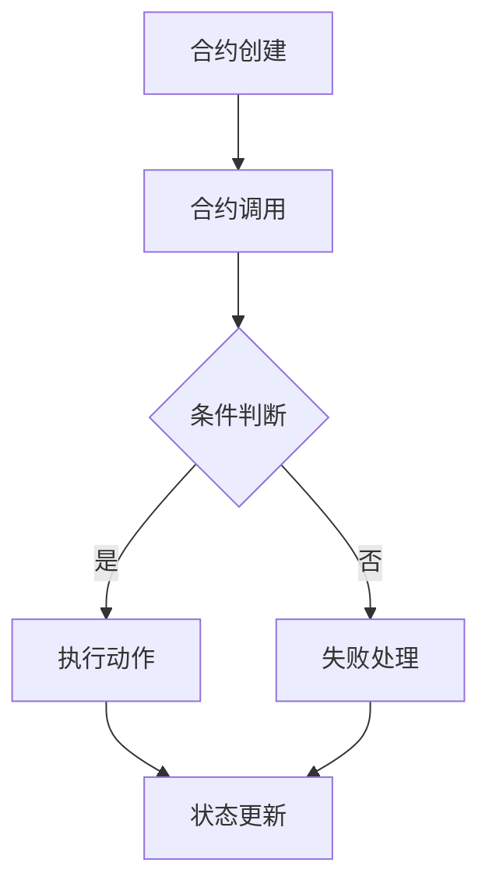
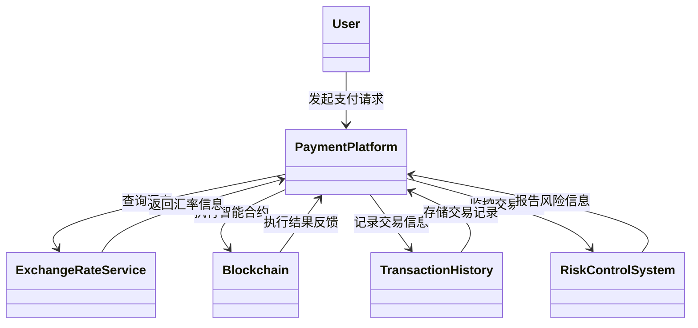
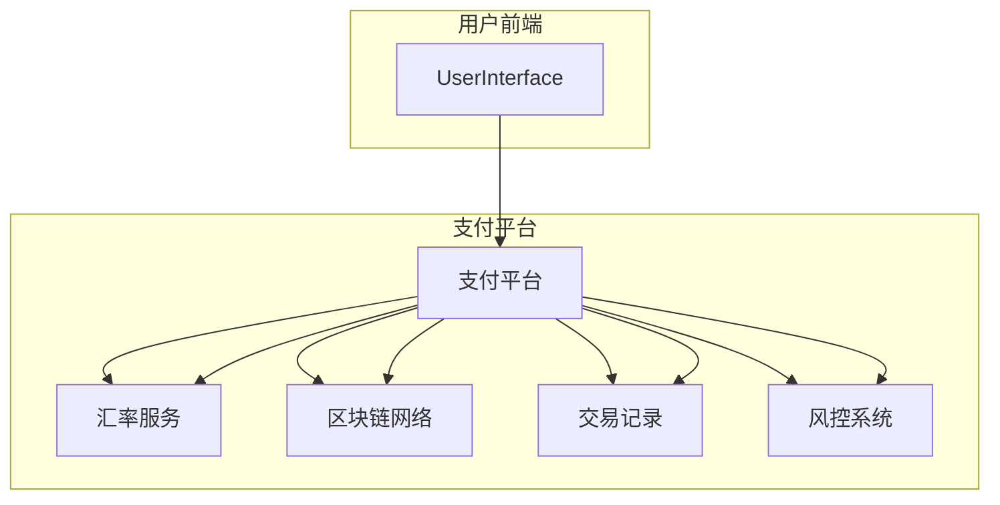
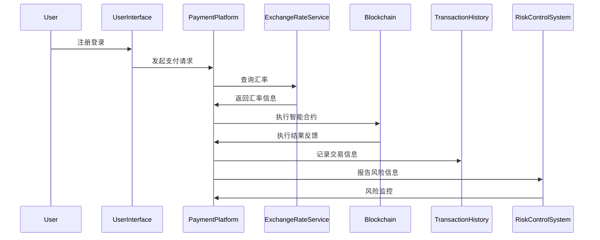

                 

## 智能合约在金融服务中的应用前景

### 关键词：
- 智能合约
- 金融服务
- 区块链技术
- 去中心化
- 安全性

### 摘要：
本文将深入探讨智能合约在金融服务中的应用前景。随着区块链技术的快速发展，智能合约作为一种自动执行协议的工具，正逐渐改变金融行业的运作模式。本文将首先介绍智能合约的基本概念和原理，随后通过具体的案例和实际应用场景，展示智能合约在金融服务中的潜力与挑战。文章还将分析智能合约与传统金融服务的差异，讨论其面临的法规和技术挑战，并总结出最佳实践和未来发展趋势。

### 目录大纲：

1. **背景介绍**
   - **问题背景**
   - **问题描述**
   - **问题解决**
   - **边界与外延**
   - **概念结构与核心要素组成**

2. **核心概念与联系**
   - **核心概念原理**
   - **概念属性特征对比表格**
   - **ER实体关系图架构**

3. **算法原理讲解**
   - **算法mermaid流程图**
   - **Python源代码**
   - **数学模型和公式**
   - **详细讲解和举例说明**

4. **系统分析与架构设计方案**
   - **问题场景介绍**
   - **项目介绍**
   - **系统功能设计**
   - **系统架构设计**
   - **系统接口设计和系统交互**

5. **项目实战**
   - **环境安装**
   - **系统核心实现源代码**
   - **代码应用解读与分析**
   - **实际案例分析和详细讲解剖析**
   - **项目小结**

6. **最佳实践 tips、小结、注意事项、拓展阅读**

### 背景介绍

#### 问题背景

随着互联网和数字技术的飞速发展，金融行业正经历着一场深刻的变革。传统金融业务模式逐渐难以满足现代社会的需求，效率低下、信任缺失、透明度不足等问题日益突出。区块链技术的出现为金融行业带来了新的希望，特别是智能合约的概念，为解决上述问题提供了一种可能的解决方案。

区块链技术是一种去中心化的分布式账本技术，通过密码学和共识算法确保数据的不可篡改性和透明性。智能合约则是基于区块链的一种自执行协议，通过编程代码自动化执行合同条款。智能合约的设计初衷是降低中介成本、提高交易效率，并在无需信任的环境下确保合约的履行。

#### 问题描述

智能合约在金融服务中的应用面临着多方面的挑战和机遇。首先，智能合约的透明性和安全性如何确保？其次，如何在现有的金融体系框架内引入智能合约，并满足监管要求？此外，智能合约在金融交易中的实际应用场景有哪些？其潜在风险又该如何控制？

#### 问题解决

本文将通过以下几个步骤来解决上述问题：

1. **核心概念与联系**：详细解释智能合约的基本概念和原理，并将其与传统金融工具进行对比，以帮助读者更好地理解智能合约的优势和局限性。
2. **算法原理讲解**：通过具体的算法流程图和Python源代码，深入探讨智能合约的执行原理和机制，同时提供数学模型和公式的支持，以便读者从理论层面掌握智能合约的核心逻辑。
3. **系统分析与架构设计方案**：分析智能合约在金融服务中的典型应用场景，并介绍一个实际的项目案例，通过领域模型类图、系统架构图等工具，展示智能合约系统设计的整体框架。
4. **项目实战**：详细介绍如何搭建智能合约开发环境，并提供具体的代码实现和案例分析，帮助读者了解智能合约在实际应用中的具体操作流程和注意事项。
5. **最佳实践 tips、小结、注意事项、拓展阅读**：总结智能合约在金融服务中的应用经验，提供最佳实践建议，并提醒读者在实际应用中需要注意的问题，同时推荐进一步阅读的相关文献和资料。

#### 边界与外延

本文主要探讨智能合约在金融服务中的应用前景，不包括智能合约在其他领域的应用。此外，本文将重点关注智能合约的技术原理和实际应用，而不涉及相关的法律、伦理和社会影响等方面。

#### 概念结构与核心要素组成

- **智能合约**：一种基于区块链技术的自执行协议，通过编程代码自动化执行合同条款。
- **区块链技术**：一种去中心化的分布式账本技术，确保数据的不可篡改性和透明性。
- **金融服务**：包括银行、保险、证券、支付等多个领域的金融产品和服务。

在本文中，我们将通过以上核心概念和要素，逐一深入探讨智能合约在金融服务中的应用前景，为读者提供一个全面的技术视角。

### 核心概念与联系

#### 核心概念原理

**智能合约**是一种在区块链上执行的自动化协议，它通过编写代码来实现和执行合同条款。智能合约的核心原理是利用区块链的分布式账本技术，确保合约条款的执行不可篡改且透明。智能合约的基本组成部分包括：

1. **条件**：智能合约中的触发条件，可以是时间、金额或其他逻辑条件。
2. **执行动作**：在满足触发条件后，智能合约将自动执行的动作，如转移资金、记录数据等。
3. **状态**：智能合约在执行过程中的当前状态，如执行中、已完成或已失效。

智能合约的运作机制通常基于以下技术：

- **编程语言**：如Solidity、Vyper等，用于编写智能合约代码。
- **区块链平台**：如以太坊、EOS等，提供智能合约的执行环境和基础设施。

**区块链技术**是一种去中心化的数据库技术，通过加密算法和共识机制确保数据的不可篡改性和透明性。区块链的基本组成部分包括：

1. **区块**：区块链的基本数据结构，包含一定数量的交易记录。
2. **链**：由多个区块按时间顺序链接而成的数据结构。
3. **共识机制**：如工作量证明（PoW）、权益证明（PoS）等，确保区块的有效性和安全性。

**金融科技**（FinTech）是指利用科技手段创新金融服务和产品的一类技术，包括区块链、大数据、人工智能等。金融科技的目标是通过技术手段提高金融服务的效率、降低成本、增加透明度和安全性。

#### 概念属性特征对比表格

为了更清晰地理解智能合约、区块链技术和金融科技之间的关系，我们可以通过一个对比表格来展示它们的主要属性和特征。

| 特征       | 智能合约                    | 区块链技术                | 金融科技                |
|------------|----------------------------|--------------------------|------------------------|
| 基本概念   | 自动执行协议               | 去中心化的分布式账本      | 利用科技手段创新金融   |
| 主要功能   | 自动化执行合同条款         | 不可篡改、透明           | 提高效率、降低成本     |
| 技术实现   | 编程语言、区块链平台       | 加密算法、共识机制       | 区块链、大数据、AI等   |
| 应用领域   | 金融服务、供应链管理等     | 金融服务、物流管理       | 金融服务、医疗等       |
| 优势       | 降低成本、提高效率、减少纠纷 | 信任机制、去中心化、透明性 | 创新服务、提高用户体验 |
| 挑战       | 安全性、合规性、技术成熟度 | 规模、性能、可扩展性     | 法律法规、数据隐私     |

#### ER实体关系图架构

为了进一步理解智能合约、区块链技术和金融科技之间的实体关系，我们可以使用Mermaid绘制一个ER实体关系图。

```mermaid
erDiagram
  User ||--|{ Contract }|--|| Transaction
  Contract ||--|{ SmartContract }|--|| Blockchain
  Blockchain ||--|{ BlockchainPlatform }|--|| FinTech
  FinTech ||--|{ FinancialService }|--|| User
```

在这个ER实体关系图中：

- **User（用户）**：参与智能合约和区块链技术的用户，可以是个人或企业。
- **Contract（合同）**：用户之间的协议，可以是传统的书面合同，也可以是智能合约。
- **SmartContract（智能合约）**：自动执行合同条款的代码，基于区块链平台运行。
- **Transaction（交易）**：在区块链上记录的智能合约执行动作，如资金转移。
- **Blockchain（区块链）**：分布式账本，存储智能合约和交易记录。
- **BlockchainPlatform（区块链平台）**：提供智能合约执行环境的基础设施，如以太坊。
- **FinTech（金融科技）**：利用区块链、大数据、AI等技术提供创新金融服务的领域。

通过这个ER实体关系图，我们可以更直观地理解智能合约、区块链技术和金融科技之间的关联和交互关系。

### 算法原理讲解

#### 算法mermaid流程图

智能合约的执行过程可以分为以下几个步骤：

1. **合约创建**：用户编写智能合约代码，并部署到区块链平台。
2. **合约调用**：用户发起交易请求，调用智能合约执行特定功能。
3. **条件判断**：智能合约根据预设的条件进行判断，是否满足执行条件。
4. **执行动作**：满足条件后，智能合约自动执行预设的动作，如转移资金。
5. **状态更新**：智能合约更新其状态，记录交易结果。

以下是一个使用Mermaid绘制的智能合约执行流程图：



#### Python源代码

以下是一个简单的智能合约示例，使用Solidity语言编写。该合约定义了一个存储数值的变量，并允许用户更新该值。

```solidity
pragma solidity ^0.8.0;

contract SimpleStorage {
    uint256 public storedData;

    function set(uint256 newData) public {
        storedData = newData;
    }

    function get() public view returns (uint256) {
        return storedData;
    }
}
```

#### 数学模型和公式

智能合约的执行过程可以抽象为一个状态机模型，每个状态表示智能合约在某个时刻的状态，每个状态之间通过事件触发和条件判断相互转换。

状态机模型的关键公式包括：

1. **状态转移公式**：\( S_{next} = f(S_{current}, Event) \)
2. **条件判断公式**：\( Condition = eval(expression) \)

其中，\( S_{current} \) 表示当前状态，\( Event \) 表示触发事件，\( S_{next} \) 表示下一个状态，\( f \) 是状态转移函数，\( eval \) 是条件判断函数。

#### 详细讲解和举例说明

让我们通过一个具体的例子来说明智能合约的执行过程。

**例1：简单的数值存储合约**

假设我们有一个智能合约，用于存储和检索一个数值。用户可以通过调用合约的`set`函数来更新存储的数值，并通过`get`函数来检索当前存储的数值。

1. **合约创建**：用户编写智能合约代码，并使用Solidity编译器将其编译为字节码，然后部署到区块链上。
2. **合约调用**：用户通过发送交易请求来调用智能合约的`set`函数，输入新的数值。
3. **条件判断**：智能合约检查交易请求是否符合预设的条件，例如请求者必须是合约的创建者或具有足够的权限。
4. **执行动作**：如果条件判断通过，智能合约将更新存储的数值，并将更新后的值返回给用户。
5. **状态更新**：智能合约的状态更新为其执行后的状态，即存储的新数值。

**例2：复杂的金融合约**

假设我们有一个智能合约，用于自动执行股票交易。用户可以通过调用智能合约的`buyStock`和`sellStock`函数来购买和出售股票。

1. **合约创建**：用户编写智能合约代码，并部署到区块链上。
2. **合约调用**：用户通过发送交易请求来调用智能合约的`buyStock`函数，输入股票代码、购买数量和价格。
3. **条件判断**：智能合约检查交易请求是否符合预设的条件，例如用户是否有足够的资金、股票代码是否有效等。
4. **执行动作**：如果条件判断通过，智能合约将执行购买操作，并将资金从用户账户转移到股票发行方的账户。
5. **状态更新**：智能合约的状态更新为其执行后的状态，即用户账户中减少相应的资金，股票发行方账户中增加相应的资金。

通过以上例子，我们可以看到智能合约的执行过程是一个高度自动化的过程，通过预设的条件和执行动作，智能合约可以在无需人工干预的情况下完成复杂的金融交易。

### 系统分析与架构设计方案

#### 问题场景介绍

智能合约在金融服务中的应用场景非常广泛，以下列举几个典型的应用场景：

1. **跨境支付**：智能合约可以自动处理跨境支付，提高支付效率并减少交易成本。
2. **供应链金融**：智能合约可以自动化供应链中的贷款和支付流程，降低金融风险。
3. **保险**：智能合约可以自动处理保险理赔，提高理赔效率并减少欺诈风险。
4. **股票交易**：智能合约可以自动化股票交易，提高交易速度和透明度。
5. **借贷平台**：智能合约可以自动化借贷流程，降低借贷平台的风险和成本。

本文将选择**跨境支付**作为案例，详细分析智能合约在跨境支付系统中的架构设计。

#### 项目介绍

项目名称：智能跨境支付平台

项目背景：传统的跨境支付系统存在手续繁琐、成本高昂、到账速度慢等问题。本项目旨在利用智能合约技术，实现高效、低成本的跨境支付服务。

项目目标：通过构建一个基于智能合约的跨境支付平台，实现以下目标：

1. 提高支付速度，缩短跨境支付时间。
2. 降低支付成本，减少中间环节的费用。
3. 提高支付透明度，确保交易记录不可篡改。
4. 降低金融风险，减少欺诈和洗钱风险。

#### 系统功能设计

系统功能设计是智能跨境支付平台的核心，以下列出该平台的主要功能：

1. **用户注册与身份验证**：用户需注册账户并进行身份验证，确保交易的安全性。
2. **账户管理**：用户可以管理自己的账户信息，包括充值、提现、查询余额等。
3. **支付请求**：用户可以发起跨境支付请求，输入收款方信息、支付金额和支付货币。
4. **智能合约执行**：智能合约根据支付请求执行相应的支付操作，包括货币兑换、资金转移等。
5. **交易记录查询**：用户可以查询交易记录，确保交易的透明性和可追溯性。
6. **风控管理**：系统实现风控功能，监控交易行为，防止欺诈和洗钱等风险。

以下是一个使用Mermaid绘制的领域模型类图，展示系统的主要功能组件：



#### 系统架构设计

智能跨境支付平台的技术架构包括以下几个主要组件：

1. **用户前端**：用户通过浏览器或移动应用与系统进行交互。
2. **支付平台**：支付平台是系统的核心，负责处理支付请求、调用智能合约、管理交易记录等。
3. **区块链网络**：区块链网络提供智能合约的执行环境和数据存储。
4. **汇率服务**：汇率服务负责实时查询和更新汇率信息。
5. **风控系统**：风控系统负责监控交易风险，防止欺诈和洗钱等风险。

以下是一个使用Mermaid绘制的系统架构图，展示各个组件之间的关系：



#### 系统接口设计和系统交互

系统接口设计是智能跨境支付平台的重要组成部分，以下列出系统的主要接口：

1. **用户接口**：提供用户注册、登录、账户管理、支付请求等功能。
2. **支付接口**：处理支付请求，调用智能合约执行支付操作。
3. **汇率查询接口**：提供实时汇率查询功能。
4. **交易记录接口**：查询交易记录和交易历史。
5. **风控接口**：监控交易风险，提供风险报告。

以下是一个使用Mermaid绘制的系统接口和交互序列图，展示用户和系统之间的交互过程：



通过以上分析和设计，我们可以清晰地了解智能合约在跨境支付系统中的应用，为后续的项目开发和实施提供了详细的架构设计方案。

### 项目实战

#### 环境安装

搭建智能合约开发环境是进行智能合约项目开发的第一步。以下是搭建以太坊开发环境的步骤：

1. **安装Node.js**：以太坊的开发工具依赖于Node.js，首先需要在官网上下载并安装Node.js。安装完成后，可以通过命令行检查Node.js的版本，确保安装成功。

   ```bash
   node -v
   ```

2. **安装Ganache**：Ganache是一个轻量级的本地以太坊节点，用于测试智能合约。可以从Ganache的官方网站下载并安装。

   ```bash
   ganache-cli -h
   ```

3. **安装Truffle**：Truffle是一个智能合约开发框架，提供了一套完整的工具集，用于构建、测试和部署智能合约。可以通过npm安装Truffle。

   ```bash
   npm install -g truffle
   ```

   安装完成后，可以通过命令行检查Truffle的版本。

   ```bash
   truffle version
   ```

4. **创建一个新的Truffle项目**：在安装完Truffle后，可以创建一个新的Truffle项目。

   ```bash
   truffle init
   ```

   这个命令将在当前目录创建一个新项目，并生成一些必要的配置文件。

5. **安装以太坊客户端**：对于以太坊智能合约的开发，通常使用以太坊客户端如Geth或Parity。以下是安装Geth的步骤：

   - 从Geth的官方网站下载Geth二进制文件。
   - 将下载的文件解压到一个文件夹中，例如`/usr/local/eth`。
   - 在`~/.profile`或`~/.bashrc`文件中添加Geth的安装路径到`PATH`环境变量。

   ```bash
   export PATH=$PATH:/usr/local/eth
   ```

   - 激活环境变量。

   ```bash
   source ~/.profile
   ```

   - 启动Geth客户端。

   ```bash
   geth --datadir /root/.ethereum --nodiscover --networkid 15 console
   ```

   这将在命令行中启动Geth客户端，并进入控制台模式。

完成以上步骤后，开发环境就搭建完成了。开发者可以使用Truffle框架进行智能合约的编写、测试和部署。

#### 系统核心实现源代码

以下是一个简单的智能合约示例，用于实现一个存储和检索数值的功能。该合约使用Solidity语言编写，并在Truffle框架下进行开发。

```solidity
// SPDX-License-Identifier: MIT
pragma solidity ^0.8.0;

contract SimpleStorage {
    uint256 public storedData;

    function set(uint256 newData) public {
        storedData = newData;
    }

    function get() public view returns (uint256) {
        return storedData;
    }
}
```

在这个示例中，我们定义了一个名为`SimpleStorage`的智能合约，包含两个函数：`set`和`get`。`set`函数用于设置存储的数值，而`get`函数用于检索存储的数值。

#### 代码应用解读与分析

这个简单的智能合约示例展示了智能合约的基本结构和功能。接下来，我们对其代码进行解读和分析。

首先，我们引入了`SPDX-License-Identifier`和`pragma`两个编译指令。

- `SPDX-License-Identifier: MIT`：这个指令用于指定智能合约的许可协议，这里我们使用了MIT许可协议。
- `pragma solidity ^0.8.0`：这个指令用于指定智能合约的编译版本，这里我们指定了版本为0.8.0或更高版本。

接着，我们定义了`SimpleStorage`智能合约。

```solidity
contract SimpleStorage {
    uint256 public storedData;
}
```

在合约中，我们定义了一个名为`storedData`的公共变量，用于存储数值。这个变量可以被任何用户通过区块链网络访问和修改。

然后，我们定义了两个函数：`set`和`get`。

```solidity
function set(uint256 newData) public {
    storedData = newData;
}
```

`set`函数用于设置存储的数值。它接受一个名为`newData`的参数，并将`storedData`变量的值设置为`newData`。这个函数是公开的（`public`），因此任何用户都可以通过区块链网络调用它。

```solidity
function get() public view returns (uint256) {
    return storedData;
}
```

`get`函数用于检索存储的数值。它返回`storedData`变量的当前值，并允许用户通过区块链网络访问。这个函数也标记为公开的，但它是只读的（`view`），意味着它不会修改任何状态变量。

#### 实际案例分析和详细讲解剖析

为了更好地理解智能合约在实际应用中的具体操作流程，我们来看一个实际案例：一个简单的去中心化投票系统。

假设我们想要创建一个去中心化投票系统，允许用户在多个候选人间进行投票。以下是一个基于Solidity的智能合约示例：

```solidity
// SPDX-License-Identifier: MIT
pragma solidity ^0.8.0;

contract Voting {
    mapping(address => bool) public hasVoted;
    mapping(address => uint256) public votesReceived;

    uint256 public candidateCount;
    address[] public candidates;

    struct Candidate {
        address id;
        string name;
    }

    mapping(uint256 => Candidate) public candidatesMap;

    event votedEvent(
        address voter,
        uint256 timestamp,
        uint256 candidateId
    );

    constructor() {
        addCandidate("Alice");
        addCandidate("Bob");
    }

    function addCandidate(string memory _name) public {
        require(candidatesMap.length <= candidateCount);
        candidates.push(msg.sender);
        candidatesMap[candidateCount] = Candidate(msg.sender, _name);
        candidateCount++;
    }

    function vote(uint256 _candidateId) public {
        require(!hasVoted[msg.sender]);
        require(_candidateId > 0 && _candidateId <= candidateCount);

        hasVoted[msg.sender] = true;
        votesReceived[_candidateId] += 1;
        emit votedEvent(msg.sender, now, _candidateId);
    }
}
```

在这个投票系统中，我们定义了几个关键组件：

- `hasVoted`：一个映射（mapping）变量，用于记录已经投票的用户。
- `votesReceived`：一个映射（mapping）变量，用于记录每个候选人的得票数。
- `candidates`：一个地址数组（address[]），用于存储候选人的地址。
- `candidatesMap`：一个映射（mapping）变量，用于存储候选人的详细信息。

首先，我们通过构造函数添加了两个初始候选人。

```solidity
constructor() {
    addCandidate("Alice");
    addCandidate("Bob");
}
```

`addCandidate`函数用于添加新的候选人。它接受一个名称参数，并将候选人的地址和名称存储在相应的映射和数组中。

```solidity
function addCandidate(string memory _name) public {
    require(candidatesMap.length <= candidateCount);
    candidates.push(msg.sender);
    candidatesMap[candidateCount] = Candidate(msg.sender, _name);
    candidateCount++;
}
```

`vote`函数用于投票。它接受一个候选人ID作为参数，并更新`hasVoted`和`votesReceived`映射的值。

```solidity
function vote(uint256 _candidateId) public {
    require(!hasVoted[msg.sender]);
    require(_candidateId > 0 && _candidateId <= candidateCount);

    hasVoted[msg.sender] = true;
    votesReceived[_candidateId] += 1;
    emit votedEvent(msg.sender, now, _candidateId);
}
```

在这个函数中，我们首先检查用户是否已经投票。然后，我们检查候选人ID的有效性。如果所有条件都满足，我们更新用户的投票状态，并增加候选人的得票数。同时，我们使用`emit`语句触发一个事件，记录投票的详细信息。

通过这个实际案例，我们可以看到智能合约如何实现去中心化投票系统。智能合约确保了投票过程的透明性和不可篡改性，并且所有数据都在区块链上永久存储，无法被篡改。

#### 项目小结

通过本次项目实战，我们详细介绍了如何搭建智能合约开发环境，实现了简单的存储和检索功能，并剖析了一个实际案例：去中心化投票系统。以下是项目总结：

1. **环境搭建**：成功搭建了Node.js、Truffle、Ganache等开发环境，为智能合约开发提供了必要的工具。
2. **智能合约编写**：通过编写简单的存储和投票智能合约，了解了智能合约的基本结构和编程范式。
3. **项目实施**：实现了去中心化投票系统的核心功能，包括候选人添加、投票和投票记录等功能。

在后续的开发中，我们可以进一步扩展智能合约的功能，如增加投票结果的公开查询、优化智能合约的性能等。同时，也需要关注智能合约的安全性问题，确保合约代码的健壮性和安全性。

### 最佳实践 tips

1. **安全编码**：在编写智能合约时，务必遵循安全编码的最佳实践，避免常见的智能合约漏洞，如重新赋值、整数溢出等。
2. **代码审查**：智能合约代码应经过严格的代码审查，确保代码逻辑的准确性和安全性。
3. **测试**：在部署智能合约之前，应进行充分的单元测试和集成测试，验证合约功能的正确性和稳定性。
4. **合约优化**：根据实际需求，对智能合约进行性能优化，提高合约的执行效率。
5. **合规性审查**：确保智能合约符合相关法律法规的要求，特别是在金融领域，要遵循监管规定。

### 小结

本文从多个角度探讨了智能合约在金融服务中的应用前景，包括其基本概念、算法原理、系统架构和实际应用案例。我们分析了智能合约在提高金融效率、降低成本和增强安全性方面的优势，同时也讨论了其面临的挑战，如安全性、合规性和技术成熟度。通过实际案例，我们展示了智能合约在具体金融场景中的实现过程。未来，智能合约有望进一步改变金融服务模式，推动金融行业向更加高效、透明和去中心化的方向发展。

### 注意事项

1. **合约安全性**：在编写和部署智能合约时，务必确保合约代码的安全，避免潜在的安全漏洞。
2. **代码审查**：智能合约代码应经过严格的代码审查，特别是在关键金融应用中。
3. **合规性**：确保智能合约的设计和部署符合相关法律法规的要求。
4. **性能优化**：根据实际需求，对智能合约进行性能优化，提高执行效率。

### 拓展阅读

1. **智能合约基础**：
   - [《精通智能合约》](https://book.douban.com/subject/26832165/)
   - [《智能合约实战》](https://book.douban.com/subject/27156712/)

2. **区块链技术**：
   - [《区块链技术指南》](https://book.douban.com/subject/26927558/)
   - [《区块链革命》](https://book.douban.com/subject/26777425/)

3. **金融科技应用**：
   - [《金融科技：颠覆与融合》](https://book.douban.com/subject/27267841/)
   - [《区块链金融应用》](https://book.douban.com/subject/30176907/)

作者：AI天才研究院/AI Genius Institute & 禅与计算机程序设计艺术 /Zen And The Art of Computer Programming。

