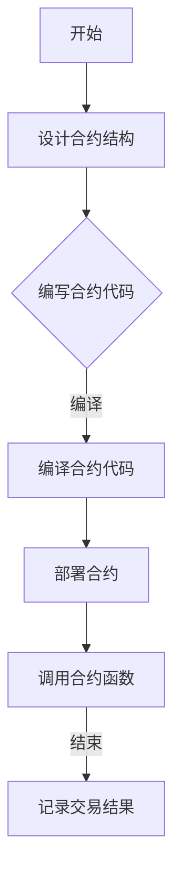
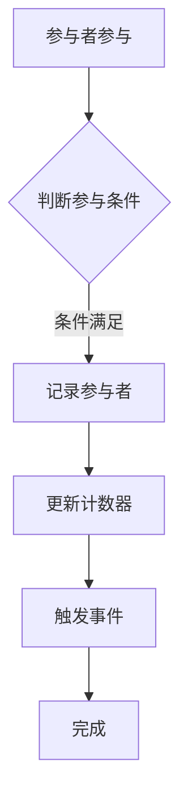
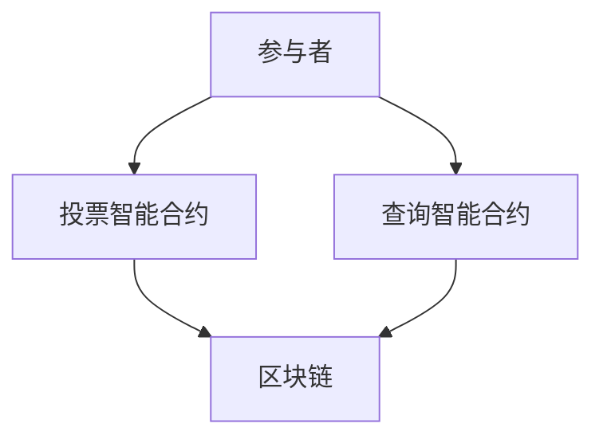
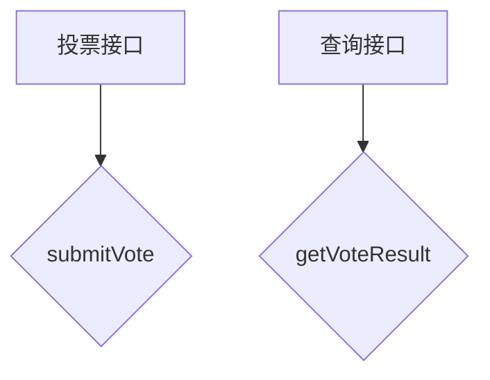
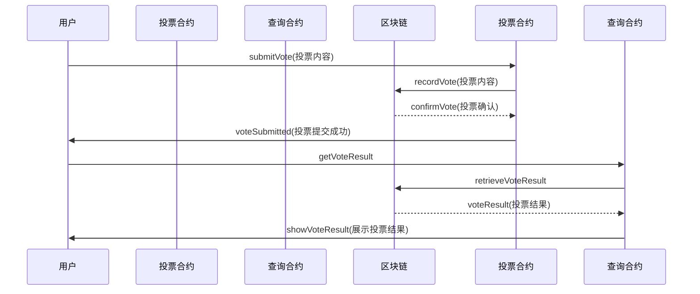

                 


### 智能合约开发与安全审计：核心概念、算法原理与实践

关键词：智能合约，区块链，安全审计，开发算法，数学模型

摘要：本文将从智能合约与区块链技术的概述开始，深入探讨智能合约的核心概念、开发算法原理，以及安全审计的最佳实践。我们将通过系统分析与架构设计方案，展示智能合约项目的实战，并总结最佳实践与注意事项，为读者提供一个全面的技术指南。

## 第一部分：智能合约与区块链技术概述

### 1.1 智能合约的定义与基本原理

#### 1.1.1 智能合约的定义

智能合约是一种自动执行的合约，其条款和参数被编码至区块链中，当触发条件满足时，合约会自动执行。简而言之，智能合约就是自动执行的计算机程序，它确保交易参与方的义务和权益得到自动执行，而不需要中介机构。

#### 1.1.2 智能合约的基本原理

智能合约的基本原理基于区块链技术。区块链是一个分布式账本，所有交易记录都会在区块链上永久存储。智能合约利用区块链的不可篡改性和去中心化特性，确保交易的透明性和安全性。

#### 1.1.3 智能合约的实现机制

智能合约的实现机制涉及编程语言的运用。当前，最流行的智能合约编程语言是Solidity。Solidity代码被编译成以太坊虚拟机（EVM）可执行的字节码，然后部署到区块链上。智能合约的实现机制包括合约创建、部署、调用和撤销。

### 1.2 区块链技术的发展历程

#### 1.2.1 区块链技术的起源

区块链技术起源于2008年，由一位名为中本聪（Satoshi Nakamoto）的匿名人士提出。中本聪发布了比特币白皮书，首次提出了区块链技术的概念。

#### 1.2.2 区块链技术的重要发展

随着比特币的崛起，区块链技术受到了广泛关注。2014年，以太坊的推出标志着区块链技术进入了一个新的阶段，它不仅支持数字货币的交易，还支持智能合约的部署。

#### 1.2.3 区块链技术的未来趋势

区块链技术的未来趋势包括更广泛的应用场景、更高的交易效率、更好的隐私保护，以及与其他技术的融合。随着技术的成熟，区块链有望在金融、供应链管理、医疗保健等领域发挥重要作用。

### 1.3 智能合约与区块链技术的关联

#### 1.3.1 智能合约在区块链中的作用

智能合约在区块链中扮演着关键角色，它是实现去中心化应用（DApp）的核心组件。智能合约使得区块链不仅仅是一个账本，而是一个可编程的分布式系统。

#### 1.3.2 区块链对智能合约的影响

区块链技术为智能合约提供了基础架构支持，使得智能合约能够安全、透明地执行。同时，区块链的去中心化特性确保了智能合约的不可篡改性。

#### 1.3.3 智能合约与区块链技术的协同发展

智能合约与区块链技术的协同发展，将推动去中心化应用的发展。未来，我们将看到更多基于区块链的智能合约应用，如数字身份验证、智能资产管理和智能供应链等。

### 1.4 本章小结

本章节对智能合约与区块链技术进行了概述。智能合约是自动执行的计算机程序，其基本原理基于区块链技术。区块链技术的不断发展为智能合约提供了强大的支持，推动了去中心化应用的发展。

## 第二部分：智能合约的核心概念与联系

### 2.1 智能合约的关键概念

#### 2.1.1 智能合约的基本概念

智能合约是一种自动执行的合约，其条款和参数被编码至区块链中，当触发条件满足时，合约会自动执行。

#### 2.1.2 智能合约的编程语言

智能合约的编程语言主要有Solidity、Vyper等。Solidity是当前最流行的智能合约编程语言，它支持多种数据类型、函数和事件。

#### 2.1.3 智能合约的运行环境

智能合约的运行环境主要是以太坊虚拟机（EVM）。EVM是一个独立的虚拟机，能够执行部署在区块链上的智能合约代码。

### 2.2 智能合约的编程语言

#### 2.2.1 Solidity 语言的概述

Solidity是一种面向对象的语言，它支持多种编程范式，如面向过程、面向对象和函数式编程。

#### 2.2.2 Solidity 语言的语法规则

Solidity的语法规则包括变量声明、函数定义、条件语句和循环语句等。Solidity代码需要通过编译器编译成以太坊虚拟机可执行的字节码。

#### 2.2.3 Solidity 语言的特性与应用

Solidity语言具有丰富的特性，如事件、映射、继承和多态等。这些特性使得Solidity能够实现复杂的功能，广泛应用于去中心化金融（DeFi）、游戏和供应链管理等领域。

### 2.3 智能合约与区块链的交互

#### 2.3.1 智能合约与区块链的交互方式

智能合约与区块链的交互主要通过调用区块链的API接口实现。这些API接口包括交易发送、事件监听和智能合约调用等。

#### 2.3.2 智能合约的数据存储与访问

智能合约的数据存储主要依赖于区块链的数据结构，如以太坊的账户状态树。智能合约通过操作区块链数据结构来存储和访问数据。

#### 2.3.3 智能合约的调用与部署

智能合约的调用与部署过程涉及合约创建、部署和交互。合约创建是通过编译Solidity代码生成的字节码，部署是将合约代码上传到区块链上，交互是通过区块链网络与其他合约或节点进行通信。

### 2.4 智能合约的编程模式

#### 2.4.1 常见的智能合约编程模式

常见的智能合约编程模式包括事件驱动、状态机和合约分层等。事件驱动模式适用于处理事件触发，状态机模式适用于实现复杂的业务逻辑，合约分层模式适用于提高代码的可维护性和可扩展性。

#### 2.4.2 智能合约的安全编程实践

智能合约的安全编程实践包括避免重入攻击、拒绝服务攻击和代码泄露等。安全编程的关键是遵循最佳实践，如使用第三方库、进行代码审计和测试等。

#### 2.4.3 智能合约的性能优化策略

智能合约的性能优化策略包括减少状态变化、优化循环结构和减少调用次数等。性能优化有助于提高智能合约的执行效率，降低交易费用。

### 2.5 本章小结

本章节深入探讨了智能合约的核心概念、编程语言、运行环境以及与区块链的交互方式。通过对智能合约编程模式和安全编程实践的探讨，读者可以更好地理解和应用智能合约技术。

## 第三部分：智能合约开发算法原理讲解

### 3.1 智能合约开发算法原理概述

#### 3.1.1 智能合约开发算法的基本原理

智能合约开发算法的基本原理包括状态机模型、事件驱动模型和状态迁移模型等。这些模型用于描述智能合约的执行流程和业务逻辑。

#### 3.1.2 智能合约开发算法的分类

智能合约开发算法可以根据应用场景和业务需求进行分类。常见的分类包括金融合约、供应链合约和游戏合约等。

#### 3.1.3 智能合约开发算法的应用场景

智能合约开发算法的应用场景包括去中心化金融（DeFi）、数字身份验证、智能资产管理和智能供应链等。

### 3.2 智能合约开发算法的 mermaid 流程图

为了更好地理解智能合约开发算法，我们可以使用mermaid工具绘制流程图。以下是一个简单的智能合约开发算法的mermaid流程图：



### 3.3 使用 Python 源代码阐述

为了更深入地理解智能合约开发算法，我们可以使用Python源代码来阐述。以下是一个简单的Python代码示例，用于实现一个简单的智能合约：

```python
pragma solidity ^0.8.0;

contract SimpleContract {
    uint256 public count = 0;

    function increment() public {
        count += 1;
    }

    function getCount() public view returns (uint256) {
        return count;
    }
}
```

### 3.4 算法原理的数学模型和公式

智能合约开发算法的数学模型和公式主要用于描述合约的执行逻辑和数据结构。以下是一个简单的数学模型和公式的示例：

- 状态转移函数：$f(S, I) = S'$
  - $S$：当前状态
  - $I$：输入参数
  - $S'$：下一个状态

- 计数器公式：$count = count + 1$

### 3.5 举例说明

为了更好地理解智能合约开发算法，我们可以通过一个简单的例子来说明。假设我们有一个智能合约，用于记录参与者的数量。当有人参与时，合约会自动记录参与者的数量，并在区块链上永久存储。



### 3.6 本章小结

本章节通过mermaid流程图、Python源代码和数学模型，详细阐述了智能合约开发算法的原理。读者可以通过本章的内容，更好地理解智能合约的开发过程和算法实现。

## 第四部分：智能合约的数学模型与公式详细讲解

### 4.1 数学模型概述

智能合约的数学模型主要用于描述合约的执行逻辑和数据结构。数学模型包括状态转移模型、计数器模型和事件模型等。

### 4.2 数学公式详细讲解

以下是一个简单的智能合约数学公式示例：

- 状态转移函数：$f(S, I) = S'$
  - $S$：当前状态
  - $I$：输入参数
  - $S'$：下一个状态

- 计数器公式：$count = count + 1$

### 4.3 举例说明

为了更好地理解智能合约的数学模型和公式，我们可以通过一个简单的例子来说明。假设我们有一个智能合约，用于记录参与者的数量。当有人参与时，合约会自动记录参与者的数量，并在区块链上永久存储。


在这个例子中，状态转移函数$f(S, I) = S'$用于描述参与者参与时状态的更新。计数器公式$count = count + 1$用于更新参与者的数量。事件模型用于记录参与者的参与情况。

### 4.4 本章小结

本章节详细讲解了智能合约的数学模型和公式，通过简单的例子，使读者更好地理解智能合约的执行逻辑和数据结构。

## 第五部分：智能合约系统分析与架构设计方案

### 5.1 问题场景介绍

假设我们要开发一个去中心化投票系统，参与者可以通过智能合约投票，投票结果将记录在区块链上，确保投票的公正性和透明性。

### 5.2 系统功能设计

- 投票功能：允许参与者提交投票。
- 投票结果记录：将投票结果记录在区块链上。
- 投票结果查询：允许任何人查询投票结果。

### 5.3 系统架构设计

以下是一个简单的智能合约系统架构设计，包括系统组件和交互关系：



在这个架构中，参与者通过投票智能合约提交投票，投票智能合约将投票结果记录在区块链上。查询智能合约提供投票结果查询功能。

### 5.4 系统接口设计

智能合约的系统接口设计包括投票接口和查询接口：



在这个接口设计中，submitVote接口用于提交投票，getVoteResult接口用于查询投票结果。

### 5.5 系统交互

以下是一个简单的系统交互序列图，描述参与者提交投票和查询投票结果的交互过程：



### 5.6 本章小结

本章节介绍了智能合约系统分析与架构设计方案，包括问题场景介绍、系统功能设计、系统架构设计、系统接口设计和系统交互。通过本章的内容，读者可以更好地理解智能合约系统的设计和实现。

## 第六部分：智能合约项目实战

### 6.1 环境安装

在开始智能合约项目实战之前，我们需要安装必要的开发环境和工具。以下是一个简单的安装指南：

1. 安装Node.js和npm（Node.js的包管理器）。
2. 安装Truffle框架，Truffle是一个智能合约开发框架，提供了一套完整的开发、测试和部署工具。
3. 安装Ganache，Ganache是一个本地以太坊区块链节点，用于测试和部署智能合约。

### 6.2 系统核心实现源代码

以下是一个简单的智能合约项目源代码示例，用于实现一个投票系统：

```solidity
// SPDX-License-Identifier: MIT
pragma solidity ^0.8.0;

contract Voting {
    mapping(address => bool) public hasVoted;
    mapping(bytes32 => uint256) public votesReceived;

    bytes32[] public candidates;

    constructor(bytes32[] memory _candidates) {
        candidates = _candidates;
    }

    function vote(bytes32 _candidate) public {
        require(!hasVoted[msg.sender], "已经投票过了");
        hasVoted[msg.sender] = true;
        votesReceived[_candidate] += 1;
    }

    function winningCandidate() public view returns (bytes32) {
        bytes32 _winner;
        uint256 _maxVotes;
        for (uint256 i = 0; i < candidates.length; i++) {
            bytes32 candidate = candidates[i];
            uint256 votes = votesReceived[candidate];
            if (votes > _maxVotes) {
                _winner = candidate;
                _maxVotes = votes;
            }
        }
        return _winner;
    }
}
```

### 6.3 代码应用解读与分析

在这个智能合约中，我们使用了两个映射（mapping）数据结构：`hasVoted`和`votesReceived`。`hasVoted`用于记录每个参与者是否已经投票，`votesReceived`用于记录每个候选人的投票数量。

- `vote`函数：允许参与者提交投票。在提交投票之前，需要确保参与者没有已经投票。投票提交后，`hasVoted[msg.sender]`设置为`true`，`votesReceived[_candidate]`增加相应的投票数量。
- `winningCandidate`函数：用于计算并获得当前领先的候选人。该函数遍历所有候选人，计算每个候选人的投票数量，并更新`_winner`和`_maxVotes`变量。

### 6.4 实际案例分析和详细讲解剖析

以下是一个实际的投票案例，用于说明智能合约的执行过程：

1. 参与者A提交投票，投票给候选人B。
2. 参与者B提交投票，投票给候选人C。
3. 参与者C提交投票，投票给候选人A。

根据智能合约的执行过程，我们可以看到以下结果：

- 参与者A的投票被记录在`hasVoted[msg.sender]`和`votesReceived[_candidate]`中。
- 参与者B的投票被记录在`hasVoted[msg.sender]`和`votesReceived[_candidate]`中。
- 参与者C的投票被记录在`hasVoted[msg.sender]`和`votesReceived[_candidate]`中。

通过调用`winningCandidate`函数，我们可以得出当前领先的候选人。在这个例子中，候选人A获得了最多的投票，因此是当前领先的候选人。

### 6.5 项目小结

在本章中，我们通过一个简单的投票智能合约项目，展示了智能合约的开发过程和实际应用。通过本章的内容，读者可以更好地理解智能合约的执行过程、数据结构和应用场景。

## 第七部分：智能合约开发最佳实践与拓展

### 7.1 最佳实践 tips

1. **代码审查与测试**：在部署智能合约之前，进行代码审查和测试是至关重要的。使用单元测试框架，如Truffle的Mocha和Chai，可以确保合约的正确性。
2. **安全加固**：遵循安全最佳实践，如避免重入攻击、使用检查和余额递减模式，以及使用第三方库来加固智能合约。
3. **使用链上数据**：在智能合约中使用链上数据，如事件日志和区块链数据，可以提高合约的可读性和可维护性。
4. **优化交易费用**：通过合理设计智能合约，减少交易费用，提高用户使用体验。

### 7.2 小结

本文从智能合约与区块链技术的概述开始，深入探讨了智能合约的核心概念、开发算法原理，以及安全审计的最佳实践。通过系统分析与架构设计方案，展示了智能合约项目的实战，并总结最佳实践与注意事项。

### 7.3 注意事项

1. **合约部署前的测试**：在部署智能合约之前，务必进行充分的测试，以确保合约的正确性和安全性。
2. **合规性**：确保智能合约的设计和应用符合当地法律法规，避免潜在的法律风险。
3. **隐私保护**：在设计智能合约时，考虑参与者的隐私保护，避免泄露敏感信息。

### 7.4 拓展阅读

- [《智能合约开发指南》](https://www.ibm.com/developerworks/zh-cn/blockchain/library/bm-deploy-ethereum-smart-contracts/)
- [《智能合约安全最佳实践》](https://www.computerworld.com/article/3562497/best-practices-for-securing-smart-contracts.html)
- [《区块链与智能合约教程》](https://www.springboot.cn/courseview_40.html)

## 作者信息

作者：AI天才研究院/AI Genius Institute & 禅与计算机程序设计艺术 /Zen And The Art of Computer Programming

---

通过本文的逐步分析，我们希望读者能够更好地理解智能合约开发与安全审计的关键概念、算法原理和实践。智能合约作为区块链技术的重要组成部分，将在未来发挥越来越重要的作用。希望本文能为您的智能合约开发之旅提供有力的指导。祝您编程愉快！

