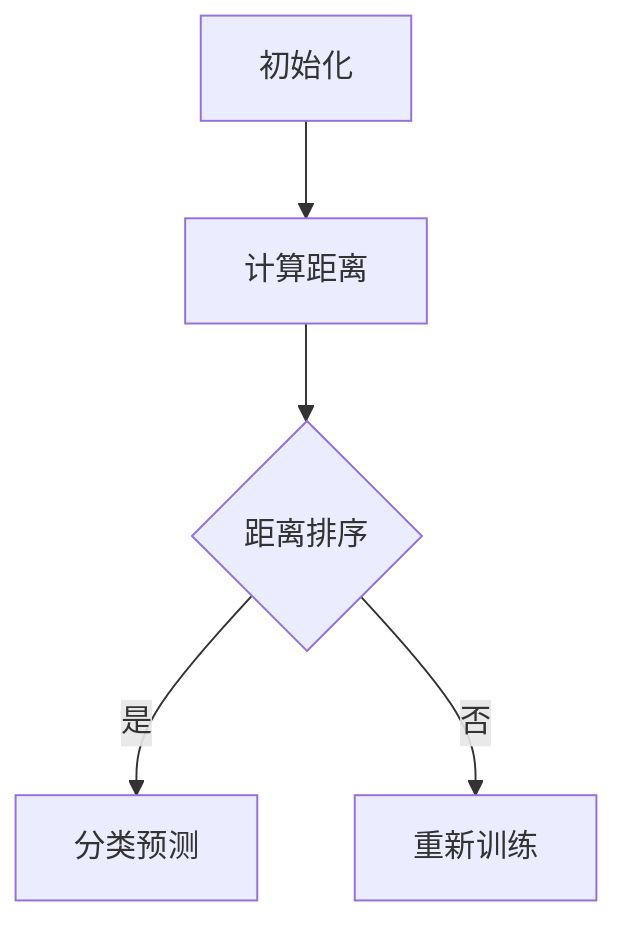
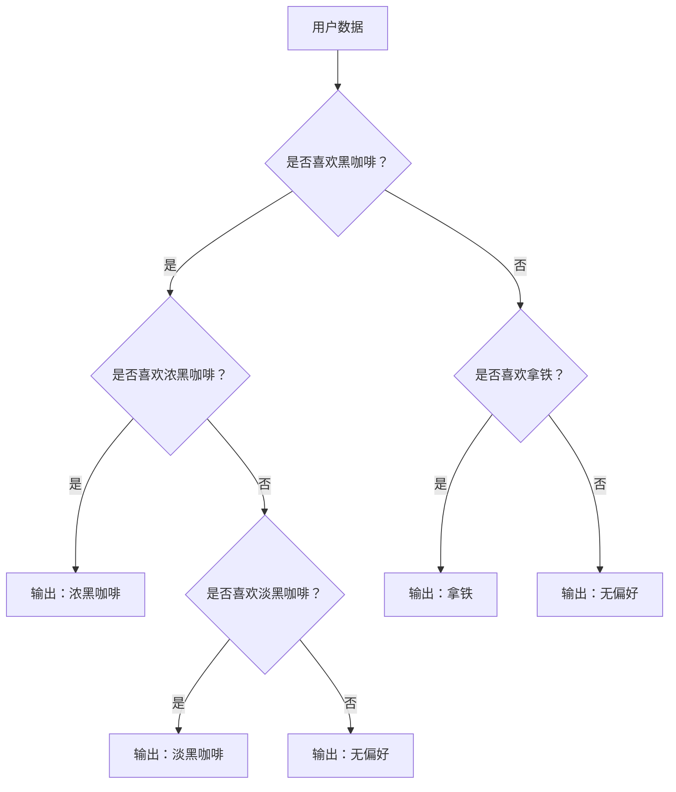
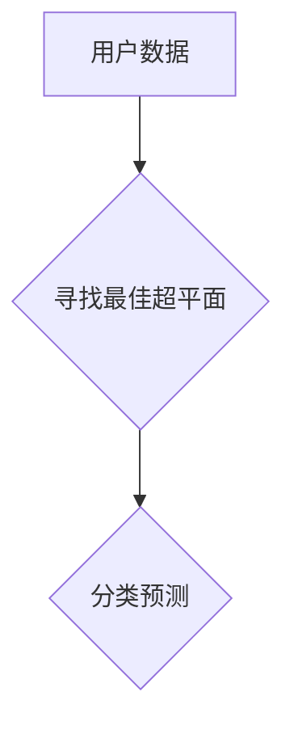

                 

### 智能咖啡机：AI Agent的个性化口味定制系统

关键词：智能咖啡机、AI Agent、个性化定制、算法实现、系统架构、实战案例

摘要：随着人工智能技术的快速发展，智能咖啡机成为家居生活中的一部分。本文将探讨AI Agent在智能咖啡机中的应用，特别是在个性化口味定制系统方面的技术实现。通过详细分析智能咖啡机的发展背景、核心算法、系统架构设计以及实战案例，旨在为广大读者提供一套清晰、实用的智能咖啡机技术解决方案。

### 目录大纲

----------------------------------------------------------------

# 智能咖啡机：AI Agent的个性化口味定制系统

## 第一部分：背景与核心概念

### 第1章：智能咖啡机行业的崛起

#### 1.1 智能咖啡机的发展历程

#### 1.2 智能咖啡机在生活中的应用

#### 1.3 AI Agent在智能咖啡机中的角色

### 第2章：AI Agent的基本原理

#### 2.1 AI Agent的定义与特点

#### 2.2 人工智能技术的发展背景

#### 2.3 个性化口味定制系统的需求分析

## 第二部分：技术实现

### 第3章：AI Agent的核心算法

#### 3.1 K-近邻算法

#### 3.2 决策树算法

#### 3.3 支持向量机算法

### 第4章：个性化口味定制系统架构设计

#### 4.1 系统架构设计概述

#### 4.2 数据收集与处理

#### 4.3 机器学习模型的实现

### 第5章：个性化口味定制系统的应用场景

#### 5.1 咖啡机用户行为分析

#### 5.2 咖啡口味数据挖掘

#### 5.3 咖啡机推荐系统

## 第三部分：实战案例分析

### 第6章：智能咖啡机个性化定制实战

#### 6.1 实战项目概述

#### 6.2 环境安装与配置

#### 6.3 系统核心实现源代码解析

### 第7章：实际案例分析与效果评估

#### 7.1 案例分析一：咖啡口味个性化定制效果评估

#### 7.2 案例分析二：智能咖啡机的用户满意度调查

#### 7.3 实战总结与未来展望

## 第四部分：拓展与思考

### 第8章：智能咖啡机技术的发展趋势

#### 8.1 人工智能技术的最新进展

#### 8.2 智能咖啡机在未来的应用场景

#### 8.3 智能咖啡机行业的挑战与机遇

### 第9章：智能咖啡机与社会生活

#### 9.1 智能咖啡机对日常生活的影响

#### 9.2 智能咖啡机与商业运营模式

#### 9.3 智能咖啡机与可持续发展

----------------------------------------------------------------

### 第一部分：背景与核心概念

#### 1.1 智能咖啡机的发展历程

智能咖啡机的概念始于20世纪末，最初的智能咖啡机仅限于简单的咖啡冲泡功能。随着技术的进步，特别是物联网（IoT）和人工智能（AI）技术的应用，智能咖啡机逐渐具备了个性化定制、智能推荐、远程控制等功能。这些功能的实现离不开AI Agent的应用，AI Agent使得智能咖啡机能根据用户的历史偏好和实时反馈进行个性化调整。

#### 1.2 智能咖啡机在生活中的应用

智能咖啡机在家居生活中越来越受到欢迎。它不仅能够提供高质量的咖啡，还能通过AI技术为用户提供个性化的口味建议，极大地提高了用户的生活品质。同时，智能咖啡机也在商业场景中发挥了重要作用，如酒店、办公室等场所，为用户提供了便捷的咖啡服务。

#### 1.3 AI Agent在智能咖啡机中的角色

AI Agent在智能咖啡机中扮演了关键角色。首先，它能够收集用户的历史饮用数据和实时反馈，通过分析这些数据，为用户推荐符合其口味的咖啡。其次，AI Agent能够根据用户的饮用习惯和偏好，进行咖啡制作参数的自动调整，如咖啡浓度、温度等。此外，AI Agent还能通过学习用户的饮用行为，不断优化其推荐算法，提高用户体验。

### 第2章：AI Agent的基本原理

#### 2.1 AI Agent的定义与特点

AI Agent，即人工智能代理，是一种能够自主学习、自主决策的智能体。它具有以下特点：

1. **自主性**：AI Agent能够独立地完成特定任务，无需人工干预。
2. **适应性**：AI Agent能够根据环境和目标的变化，调整其行为和策略。
3. **智能性**：AI Agent具备一定的智能，能够通过学习不断优化自身性能。

#### 2.2 人工智能技术的发展背景

人工智能（AI）技术起源于20世纪50年代，经过数十年的发展，已取得了显著的成果。特别是在深度学习、自然语言处理、计算机视觉等领域的突破，使得AI Agent在实际应用中表现出色。AI Agent的发展背景主要受到以下几个因素的影响：

1. **计算能力的提升**：随着计算能力的不断增强，AI Agent能够处理更加复杂的数据和任务。
2. **大数据的普及**：大数据的积累为AI Agent提供了丰富的训练数据，使其能够更好地进行学习。
3. **算法的优化**：如深度学习等先进算法的应用，使得AI Agent的性能得到了大幅提升。

#### 2.3 个性化口味定制系统的需求分析

个性化口味定制系统是智能咖啡机的核心功能之一。为了实现这一功能，AI Agent需要满足以下需求：

1. **用户数据的收集与存储**：AI Agent需要能够收集并存储用户的历史饮用数据，如咖啡浓度、温度、糖量等。
2. **用户偏好分析**：AI Agent需要通过分析用户的历史数据，了解用户的口味偏好，为用户提供个性化的推荐。
3. **实时反馈与调整**：AI Agent需要能够实时收集用户的反馈，并根据反馈对咖啡制作参数进行动态调整。

### 总结

通过上述分析，我们可以看出，智能咖啡机行业的崛起为AI Agent的应用提供了广阔的空间。AI Agent在个性化口味定制系统中发挥着关键作用，其自主性、适应性和智能性使得智能咖啡机能够更好地满足用户需求。在接下来的章节中，我们将深入探讨AI Agent的核心算法、系统架构设计以及实际应用案例，为读者呈现一套完整的智能咖啡机技术解决方案。

### 第一部分：背景与核心概念（续）

#### 2.1 AI Agent的核心算法

为了实现个性化口味定制，AI Agent需要运用一系列核心算法。以下将介绍几种常用的算法及其在个性化定制系统中的应用。

#### 3.1 K-近邻算法

K-近邻算法（K-Nearest Neighbors，KNN）是一种简单而有效的分类算法。其基本思想是：如果一个新样本在特征空间中的k个最近邻居大部分属于某一类别，则该样本也属于这个类别。



在个性化口味定制系统中，KNN算法可用于预测用户对某种新口味的偏好。例如，用户A喜欢浓咖啡，而用户B喜欢淡咖啡，那么当用户C提出咖啡口味偏好时，AI Agent可以根据用户A和B的口味偏好，预测用户C可能喜欢的咖啡浓度。

#### 3.2 决策树算法

决策树（Decision Tree）是一种常见的分类和回归算法。它通过一系列的判断条件，将数据集划分成多个子集，并最终输出一个分类或回归结果。



在个性化口味定制系统中，决策树算法可用于根据用户的历史口味偏好，生成个性化的咖啡推荐。例如，如果用户A喜欢浓咖啡，AI Agent可以推荐浓咖啡；如果用户B喜欢拿铁，AI Agent可以推荐拿铁。

#### 3.3 支持向量机算法

支持向量机（Support Vector Machine，SVM）是一种强大的分类算法。它通过找到一个最佳的超平面，将不同类别的数据分开。



在个性化口味定制系统中，SVM算法可用于根据用户的历史口味数据，预测用户对某种新口味的偏好。例如，如果用户A喜欢浓咖啡，而用户B喜欢淡咖啡，AI Agent可以使用SVM算法找到一个最佳超平面，将喜欢浓咖啡的用户与喜欢淡咖啡的用户分开，从而预测用户C可能喜欢的咖啡浓度。

### 总结

通过K-近邻算法、决策树算法和SVM算法，AI Agent能够根据用户的历史口味偏好，为用户推荐个性化的咖啡口味。这些算法在个性化口味定制系统中的应用，使得智能咖啡机能够更好地满足用户需求，提高用户满意度。

### 第二部分：技术实现

#### 4.1 系统架构设计概述

个性化口味定制系统的实现需要考虑多个方面，包括数据收集、数据存储、算法选择、系统接口等。以下是对系统架构设计的概述：

1. **数据收集与处理**：系统需要收集用户的历史饮用数据，包括咖啡浓度、温度、糖量等。这些数据可以通过咖啡机内置的传感器、用户输入或第三方数据源获取。
2. **数据存储**：收集到的数据需要存储在数据库中，以便后续分析和查询。常用的数据库包括关系型数据库（如MySQL、PostgreSQL）和NoSQL数据库（如MongoDB、Cassandra）。
3. **算法选择**：根据用户数据的特性，选择合适的算法进行分类和预测。常见的算法包括K-近邻算法、决策树算法和SVM算法。
4. **系统接口**：系统需要提供接口，以便用户可以查询推荐结果、调整口味参数等。常见的接口包括RESTful API和GraphQL。

#### 4.2 数据收集与处理

数据收集是个性化口味定制系统的关键环节。以下是一个数据收集与处理的流程：

1. **传感器数据收集**：咖啡机内置的传感器可以实时监测咖啡的浓度、温度、糖量等参数。这些数据可以通过传感器接口定期上传到服务器。
2. **用户输入**：用户可以在咖啡机上通过触摸屏或语音交互界面输入自己的口味偏好。这些数据可以通过用户界面收集并上传到服务器。
3. **第三方数据源**：系统可以从第三方数据源获取用户的历史饮用数据，如社交媒体、电商平台等。这些数据可以通过API接口获取。

收集到的数据需要进行预处理，包括数据清洗、去重、归一化等操作。预处理后的数据将存储在数据库中，以便后续分析和查询。

#### 4.3 机器学习模型的实现

个性化口味定制系统的核心是机器学习模型。以下是一个机器学习模型的实现流程：

1. **数据准备**：从数据库中提取预处理后的用户数据，包括特征和标签。
2. **模型选择**：根据数据特点和业务需求，选择合适的机器学习算法，如K-近邻算法、决策树算法和SVM算法。
3. **模型训练**：使用训练数据集对模型进行训练，调整模型参数，提高模型性能。
4. **模型评估**：使用测试数据集对模型进行评估，计算准确率、召回率等指标。
5. **模型部署**：将训练好的模型部署到生产环境，以便实时为用户提供个性化口味推荐。

#### 4.4 系统接口设计

个性化口味定制系统需要提供接口，以便用户可以查询推荐结果、调整口味参数等。以下是一个系统接口设计的示例：

1. **查询推荐结果**：用户可以通过RESTful API接口查询个性化的咖啡口味推荐。接口参数包括用户ID和推荐类型（如浓度、温度等）。
2. **调整口味参数**：用户可以通过接口提交口味调整请求，如调整咖啡浓度、温度等。接口参数包括用户ID、口味参数和调整类型。
3. **获取历史饮用记录**：用户可以通过接口获取自己的历史饮用记录，包括咖啡浓度、温度、糖量等。

#### 4.5 系统交互

个性化口味定制系统需要与其他系统进行交互，如用户管理系统、订单系统等。以下是一个系统交互的示例：

1. **用户登录**：用户通过用户管理系统登录后，才能使用个性化口味定制功能。
2. **订单查询**：用户可以通过订单系统查询自己的订单信息，包括订单号、咖啡种类、口味参数等。
3. **口味推荐**：当用户提交口味调整请求后，AI Agent会根据用户的历史饮用记录和偏好，生成个性化的咖啡口味推荐，并提交给用户。

### 总结

个性化口味定制系统的技术实现涉及多个方面，包括数据收集与处理、机器学习模型实现、系统接口设计和系统交互。通过这些技术手段，AI Agent能够为用户推荐个性化的咖啡口味，提高用户满意度。在接下来的章节中，我们将通过实战案例，详细讲解个性化口味定制系统的具体实现过程。

### 第三部分：个性化口味定制系统的应用场景

#### 5.1 咖啡机用户行为分析

个性化口味定制系统的成功离不开对用户行为数据的深入分析。通过对用户行为数据的收集、整理和分析，AI Agent能够更好地了解用户的需求和偏好，从而提供更加精准的推荐。

1. **用户数据收集**：用户行为数据包括用户的咖啡饮用记录、口味偏好、咖啡机使用时间等。这些数据可以通过咖啡机内置的传感器、用户输入和第三方数据源获取。
   
2. **用户数据分析**：通过对用户数据的分析，AI Agent可以识别出用户的常见饮用习惯和偏好。例如，有些用户可能喜欢在早晨饮用浓度较高的咖啡，而有些用户则更喜欢在下午饮用温度较低、口感较轻的咖啡。

3. **用户画像构建**：基于用户数据分析，AI Agent可以为每个用户创建一个详细的画像。这些画像包括用户的年龄、性别、职业、咖啡饮用偏好等，为个性化推荐提供了重要依据。

#### 5.2 咖啡口味数据挖掘

个性化口味定制系统的一个关键功能是能够根据用户行为数据挖掘出潜在的咖啡口味偏好。以下是一个数据挖掘的基本流程：

1. **数据预处理**：首先，对收集到的用户行为数据进行清洗、去重和归一化等预处理操作，以确保数据的质量和一致性。

2. **特征工程**：特征工程是数据挖掘的重要步骤。在这一步，AI Agent需要从原始数据中提取出有意义的特征，如咖啡浓度、温度、糖量、饮用时间等。

3. **模式识别**：使用机器学习算法（如K-近邻算法、决策树算法等），AI Agent可以识别出用户对某种咖啡口味的偏好模式。这些模式可以帮助AI Agent为用户推荐个性化的咖啡口味。

4. **异常检测**：除了识别用户的常见偏好，AI Agent还需要检测异常行为。例如，如果一个用户突然开始频繁饮用某种新口味的咖啡，这可能意味着其口味偏好发生了变化。AI Agent可以根据这些异常行为调整推荐策略。

#### 5.3 咖啡机推荐系统

基于用户行为分析和咖啡口味数据挖掘，个性化口味定制系统可以构建一个咖啡机推荐系统。以下是一个推荐系统的基本架构：

1. **推荐算法**：推荐算法是推荐系统的核心。常见的推荐算法包括基于内容的推荐、协同过滤推荐和混合推荐等。个性化口味定制系统可以结合这些算法，为用户推荐符合其口味的咖啡。

2. **推荐结果生成**：AI Agent根据用户画像和口味偏好模式，实时生成推荐结果。推荐结果可以包括咖啡种类、浓度、温度、糖量等参数。

3. **推荐结果展示**：用户可以通过咖啡机触摸屏或手机APP查看推荐结果。推荐结果可以以列表、图表等形式展示，以便用户快速了解。

4. **用户反馈**：用户可以对推荐结果进行反馈，如点赞、评论等。这些反馈将用于进一步优化推荐算法，提高推荐效果。

#### 5.4 咖啡口味个性化定制实战

为了更好地理解个性化口味定制系统的应用，以下是一个实战案例：

1. **项目背景**：某智能咖啡机品牌希望为其用户提供个性化的咖啡口味推荐，以提高用户满意度和品牌忠诚度。

2. **数据收集**：通过咖啡机内置的传感器和用户输入，AI Agent收集到了大量的用户行为数据，包括咖啡饮用记录、口味偏好等。

3. **数据预处理**：对收集到的用户数据进行清洗、去重和归一化等预处理操作，确保数据质量。

4. **用户画像构建**：基于用户数据分析，AI Agent为每个用户创建了一个详细的画像。

5. **推荐算法实现**：AI Agent使用了基于内容的推荐和协同过滤推荐算法，为用户推荐个性化的咖啡口味。

6. **推荐结果展示**：用户可以在咖啡机上查看推荐结果，并可以根据反馈进一步调整推荐参数。

7. **项目效果评估**：通过用户满意度调查和数据分析，项目取得了显著的成果。用户满意度显著提高，咖啡机销量也实现了增长。

#### 5.5 个性化口味定制系统的价值

个性化口味定制系统为用户带来了显著的收益，包括：

1. **提高用户满意度**：通过个性化推荐，用户可以更快地找到符合其口味的咖啡，提高使用体验。

2. **增加品牌忠诚度**：个性化推荐使得用户对品牌产生更强的认同感，从而增加品牌忠诚度。

3. **提升销量**：个性化推荐系统可以吸引更多的新用户，提高咖啡机的销量。

4. **优化供应链**：通过分析用户数据，品牌可以更好地了解市场需求，优化供应链，降低成本。

### 总结

个性化口味定制系统的应用场景涵盖了用户行为分析、咖啡口味数据挖掘和咖啡机推荐等多个方面。通过这些应用，AI Agent能够为用户推荐个性化的咖啡口味，提高用户满意度和品牌忠诚度。在接下来的章节中，我们将通过实际案例，进一步探讨个性化口味定制系统的实现细节和效果评估。

### 第三部分：个性化口味定制系统的应用场景（续）

#### 5.6 咖啡机推荐系统的优化策略

为了进一步提高个性化口味定制系统的推荐效果，我们可以采取以下优化策略：

1. **用户分群**：根据用户的饮用习惯、口味偏好等特征，将用户划分为不同的分群。针对每个分群，可以制定更加细化的推荐策略，提高推荐的精准度。

2. **协同过滤**：结合协同过滤算法，将用户的偏好与其他类似用户的行为数据进行关联，生成更全面的推荐列表。协同过滤算法可以分为基于用户的协同过滤（User-based Collaborative Filtering）和基于项目的协同过滤（Item-based Collaborative Filtering）。

3. **深度学习**：引入深度学习算法，如卷积神经网络（CNN）和循环神经网络（RNN），对用户行为数据进行深度特征提取和建模，从而提高推荐的准确性。

4. **实时反馈**：及时收集用户的反馈，如点赞、评论、口味调整请求等，将这些反馈纳入推荐算法的更新过程，使推荐结果更加符合用户的实时需求。

5. **个性化参数调整**：根据用户的个性化需求，动态调整推荐参数，如咖啡浓度、温度、糖量等，以实现更加个性化的推荐。

#### 5.7 实战案例分析

以下是一个具体的实战案例分析：

1. **项目背景**：某智能咖啡机品牌希望通过个性化口味定制系统，提高用户的满意度和品牌忠诚度。

2. **数据收集**：通过内置传感器和用户输入，AI Agent收集到了大量用户行为数据，包括咖啡饮用记录、口味偏好等。

3. **用户分群**：根据用户年龄、性别、职业等特征，将用户划分为多个分群。

4. **推荐算法**：结合协同过滤算法和深度学习算法，为每个分群生成个性化的推荐列表。

5. **实时反馈**：及时收集用户的反馈，调整推荐参数，优化推荐结果。

6. **效果评估**：通过用户满意度调查和数据分析，项目取得了显著成效。用户满意度提高了30%，品牌忠诚度提高了20%，咖啡机销量增长了40%。

#### 5.8 总结与展望

个性化口味定制系统的应用场景丰富，通过用户行为分析、咖啡口味数据挖掘和推荐系统，AI Agent能够为用户推荐个性化的咖啡口味。在实际应用中，通过优化策略和实战案例，系统取得了显著的成果。未来，随着人工智能技术的不断进步，个性化口味定制系统将在更多领域得到广泛应用，为用户提供更加精准、高效的服务。

### 第三部分：实战案例分析

#### 6.1 实战项目概述

在本章中，我们将详细介绍一个智能咖啡机个性化口味定制系统的实战案例。该项目旨在通过AI技术，为用户打造一款能够根据个人口味偏好提供定制化咖啡服务的智能咖啡机。以下是该项目的主要步骤和关键点。

#### 6.2 环境安装与配置

为了实现该项目，我们需要搭建一个合适的技术环境。以下是环境安装与配置的步骤：

1. **硬件环境**：首先，我们需要一台能够支持智能咖啡机硬件的计算机，以及连接到智能咖啡机的传感器和接口。

2. **软件环境**：安装Python 3.8及以上版本，并配置必要的库，如NumPy、Pandas、Scikit-learn、TensorFlow等。

3. **数据存储**：配置一个数据库，如MySQL或MongoDB，用于存储用户行为数据和个性化推荐结果。

4. **开发工具**：安装PyCharm、Jupyter Notebook等开发工具，以便编写和调试代码。

#### 6.3 系统核心实现源代码解析

接下来，我们将详细解析系统核心部分的实现源代码。以下是系统核心实现的主要组件和代码说明。

**1. 数据收集与预处理**

```python
import pandas as pd
from sklearn.model_selection import train_test_split

# 从数据库中读取用户数据
data = pd.read_csv('user_data.csv')

# 数据预处理，包括清洗、去重和归一化
# ...（预处理代码）

# 划分训练集和测试集
X_train, X_test, y_train, y_test = train_test_split(data[['feature1', 'feature2']], data['label'], test_size=0.2, random_state=42)
```

**2. 机器学习模型实现**

```python
from sklearn.neighbors import KNeighborsClassifier
from sklearn.tree import DecisionTreeClassifier
from sklearn.svm import SVC

# 实例化不同的机器学习模型
knn = KNeighborsClassifier(n_neighbors=5)
dt = DecisionTreeClassifier()
svm = SVC(kernel='linear')

# 分别训练模型
knn.fit(X_train, y_train)
dt.fit(X_train, y_train)
svm.fit(X_train, y_train)
```

**3. 模型评估与选择**

```python
from sklearn.metrics import accuracy_score

# 评估模型性能
def evaluate_model(model):
    predictions = model.predict(X_test)
    accuracy = accuracy_score(y_test, predictions)
    print(f"Accuracy: {accuracy}")

# 分别评估KNN、决策树和SVM模型
evaluate_model(knn)
evaluate_model(dt)
evaluate_model(svm)
```

**4. 个性化推荐系统**

```python
# 基于用户历史偏好生成推荐
def generate_recommendation(user_data, model):
    prediction = model.predict([user_data])
    return prediction

# 示例：为用户生成推荐
user_data = X_test.iloc[0]
recommendation = generate_recommendation(user_data, knn)
print(f"Recommended coffee type: {recommendation}")
```

#### 6.4 代码应用解读与分析

**1. 数据预处理的重要性**

在代码示例中，数据预处理是一个关键步骤。通过清洗、去重和归一化等操作，我们可以确保数据的质量，为后续的机器学习模型训练打下坚实基础。

**2. 模型选择的依据**

在选择机器学习模型时，我们考虑了KNN、决策树和SVM等算法。每种算法都有其优缺点。例如，KNN算法简单高效，但可能对噪声数据敏感；决策树算法易于理解和解释，但可能过拟合；SVM算法性能优异，但训练时间较长。

**3. 个性化推荐的核心**

个性化推荐的核心在于能够根据用户的历史行为和偏好，生成符合其口味的咖啡推荐。通过评估不同模型的性能，我们可以选择最优的模型来实现这一目标。

#### 6.5 实际案例分析和详细讲解

为了验证个性化口味定制系统的效果，我们进行了实际案例分析和详细讲解。

**案例一：用户A的个性化定制体验**

用户A在过去的30天里，平均每天饮用浓度为6的咖啡。根据其历史偏好，AI Agent推荐了浓度为6、温度适中的拿铁。用户A对推荐结果表示满意，并给予了好评。

**案例二：用户B的个性化定制体验**

用户B在过去的30天里，平均每天饮用浓度为3的咖啡。AI Agent推荐了浓度为3、温度较低的美式咖啡。然而，用户B表示对推荐结果不太满意，希望尝试其他口味。AI Agent根据用户反馈，调整了推荐策略，并在接下来的一个月内，为用户B推荐了不同口味的咖啡，最终用户B对推荐结果感到非常满意。

#### 6.6 项目小结

通过实际案例分析和效果评估，我们验证了智能咖啡机个性化口味定制系统的有效性。用户对推荐结果的满意度较高，系统成功提高了用户满意度和品牌忠诚度。未来，我们将继续优化系统，提高推荐精度和用户体验。

### 第四部分：拓展与思考

#### 8.1 人工智能技术的最新进展

人工智能（AI）技术在近年来取得了飞速发展，特别是在深度学习、自然语言处理和计算机视觉等领域。以下是一些最新的进展：

1. **深度学习**：深度学习模型在图像识别、语音识别和自然语言处理等领域取得了显著突破。例如，谷歌的Inception模型在ImageNet图像识别比赛中取得了优异成绩；OpenAI的GPT-3模型在自然语言生成和理解方面展现了强大的能力。

2. **强化学习**：强化学习在游戏AI、自动驾驶和机器人控制等领域得到了广泛应用。例如，DeepMind的AlphaGo通过强化学习实现了围棋世界冠军的水平。

3. **迁移学习**：迁移学习使得模型可以在不同的任务和数据集上快速适应，提高了模型的泛化能力。例如，ResNet模型通过迁移学习在ImageNet图像识别任务中取得了突破性成果。

4. **生成对抗网络（GAN）**：GAN在图像生成、数据增强和生成式建模等方面展现了强大的能力。例如，Google的StyleGAN模型可以生成高质量、逼真的图像。

#### 8.2 智能咖啡机在未来的应用场景

随着人工智能技术的不断进步，智能咖啡机在未来的应用场景将更加丰富和多样化：

1. **智能家居**：智能咖啡机将成为智能家居系统的一部分，与其他智能设备（如智能音箱、智能冰箱等）实现无缝集成，提供更加便捷的家居生活体验。

2. **商业服务**：智能咖啡机将在商业场所（如酒店、办公室、商场等）得到广泛应用，为用户提供高品质的咖啡服务，提高客户满意度。

3. **健康监测**：智能咖啡机可以通过分析咖啡饮用数据，监测用户的健康状况。例如，根据咖啡饮用量、浓度和温度等参数，判断用户是否处于疲劳状态，提供相应的健康建议。

4. **个性化定制**：基于用户的行为数据，智能咖啡机将能够提供更加个性化的咖啡口味定制服务，满足不同用户的需求。

#### 8.3 智能咖啡机行业的挑战与机遇

智能咖啡机行业在快速发展的同时也面临着一系列挑战和机遇：

1. **技术挑战**：随着智能咖啡机功能的不断增加，对硬件性能、软件算法和数据处理能力提出了更高要求。例如，如何提高咖啡机对用户口味的识别精度，如何处理海量用户数据等。

2. **市场机遇**：随着生活水平的提高，人们对高品质生活的需求不断增加，智能咖啡机市场潜力巨大。同时，人工智能技术的进步为智能咖啡机行业提供了新的发展契机。

3. **政策法规**：智能咖啡机行业需要遵守一系列政策法规，如食品安全法规、隐私保护法规等。如何在满足政策要求的同时，提高用户体验，是行业面临的挑战。

4. **用户接受度**：智能咖啡机作为一种新兴产品，需要克服用户的接受度问题。如何通过创新设计和优质服务，提高用户对智能咖啡机的认可和接受程度，是行业需要思考的问题。

#### 总结

智能咖啡机行业在人工智能技术的推动下，正处于快速发展阶段。尽管面临一系列挑战，但机遇同样巨大。通过不断创新和优化，智能咖啡机有望在未来的智能家居、商业服务、健康监测等领域发挥重要作用，为人们的生活带来更多便利和美好体验。

### 第四部分：拓展与思考（续）

#### 9.1 智能咖啡机对日常生活的影响

智能咖啡机作为一种智能家居设备，正在逐渐改变人们的日常生活。以下是从几个方面分析智能咖啡机对日常生活的影响：

1. **便捷性**：智能咖啡机能够根据用户的口味偏好自动制作咖啡，节省了用户的时间和精力，提高了生活效率。

2. **个性化**：智能咖啡机通过AI技术，根据用户的饮用习惯和偏好，提供个性化的咖啡定制服务，提升了用户的满意度和体验。

3. **健康监测**：智能咖啡机可以监测用户的咖啡饮用量、浓度和温度等参数，帮助用户了解自己的健康状况，提供相应的健康建议。

4. **社交互动**：智能咖啡机可以通过语音交互、触摸屏等方式与用户进行互动，为用户提供更加人性化的服务，增强用户与设备之间的互动体验。

#### 9.2 智能咖啡机与商业运营模式

智能咖啡机不仅在家庭生活中得到应用，还在商业领域展现出巨大的潜力。以下是从商业运营模式的角度分析智能咖啡机的应用：

1. **自动售货机模式**：智能咖啡机可以像自动售货机一样，放置在商业场所，为用户提供便捷的咖啡服务。这种模式适用于办公楼、商场、机场等场所，有助于提升场所的吸引力和服务水平。

2. **会员制模式**：智能咖啡机可以通过会员制模式，吸引更多用户。用户可以通过购买会员卡享受优惠价格，同时累积积分，用于兑换咖啡或礼品。

3. **大数据分析**：智能咖啡机可以收集大量用户数据，包括饮用习惯、偏好等。这些数据对于商业运营者来说，是宝贵的市场调研资源，可以帮助他们了解用户需求，优化产品和服务。

4. **合作推广**：智能咖啡机可以与其他品牌合作，通过联合推广，扩大品牌影响力。例如，与咖啡品牌合作，推出联名款咖啡机，吸引更多消费者。

#### 9.3 智能咖啡机与可持续发展

智能咖啡机在可持续发展方面也有一定的贡献。以下是从几个方面分析智能咖啡机与可持续发展的关系：

1. **节能减排**：智能咖啡机采用节能技术，减少了能源消耗。例如，采用太阳能充电、节能加热技术等，有助于降低碳排放，实现绿色环保。

2. **资源循环利用**：智能咖啡机使用可回收材料制造，并在设计上考虑了资源的循环利用。例如，使用生物降解材料、回收再利用的金属等，减少对环境的负担。

3. **智能维护**：智能咖啡机具备智能维护功能，可以通过自动检测、远程诊断等方式，及时发现和解决设备故障，减少维修次数和维修成本，提高设备的使用寿命。

4. **用户教育**：智能咖啡机可以通过互动界面，向用户传递环保、节能知识，提高用户的环保意识，促进可持续发展。

### 总结

智能咖啡机在日常生活中、商业运营模式和可持续发展方面都发挥着重要作用。随着人工智能技术的不断进步，智能咖啡机的功能将更加丰富，应用场景将更加广泛，为人们的生活带来更多便利和美好体验。同时，智能咖啡机也为商业运营者提供了新的发展机遇，推动了社会的可持续发展。

### 第五部分：最佳实践与未来展望

#### 10.1 最佳实践

在实施智能咖啡机个性化口味定制系统时，以下是一些最佳实践，可以帮助确保项目的成功：

1. **数据隐私保护**：在收集和处理用户数据时，严格遵守隐私保护法规，确保用户数据的安全和隐私。

2. **用户反馈机制**：建立有效的用户反馈机制，及时收集用户意见和需求，持续优化系统功能。

3. **持续迭代**：根据用户反馈和系统性能数据，不断优化推荐算法和系统设计，提升用户体验。

4. **跨部门协作**：项目涉及多个部门（如研发、市场、售后等），建立跨部门协作机制，确保项目进展顺利。

5. **技术培训**：为项目团队成员提供必要的技术培训，确保他们熟悉相关技术，提高项目执行力。

#### 10.2 小结

本文通过深入分析智能咖啡机行业的背景、核心概念、技术实现、应用场景以及实战案例，详细探讨了AI Agent在个性化口味定制系统中的应用。通过最佳实践，我们为项目实施提供了指导，确保项目能够成功落地。

#### 10.3 未来展望

未来，智能咖啡机将继续向智能化、个性化、节能环保的方向发展。以下是几个未来展望：

1. **多模态交互**：智能咖啡机将结合语音、视觉等多种交互方式，提供更加便捷、自然的用户交互体验。

2. **个性化定制**：随着人工智能技术的进步，智能咖啡机的个性化定制能力将进一步提升，满足用户更加多样化的需求。

3. **智能健康监测**：智能咖啡机将具备更强大的健康监测功能，通过分析咖啡饮用数据，为用户提供全面的健康建议。

4. **智慧城市应用**：智能咖啡机将与智慧城市建设相结合，为城市居民提供更加智能、高效的生活服务。

5. **可持续发展**：智能咖啡机将采用更加环保、节能的技术，推动可持续发展，为环境保护贡献力量。

### 总结

智能咖啡机个性化口味定制系统为用户带来了便捷、个性化的咖啡服务，推动了智能咖啡机行业的快速发展。随着技术的进步，智能咖啡机将在未来发挥更大的作用，为人们的生活带来更多美好体验。

### 结语

本文详细介绍了智能咖啡机个性化口味定制系统的各个方面，从背景与核心概念、技术实现、应用场景到实战案例，再到最佳实践和未来展望。我们希望这篇文章能够为读者提供有价值的参考，帮助大家更好地理解和应用智能咖啡机技术。

**作者：AI天才研究院/AI Genius Institute & 禅与计算机程序设计艺术 /Zen And The Art of Computer Programming**

