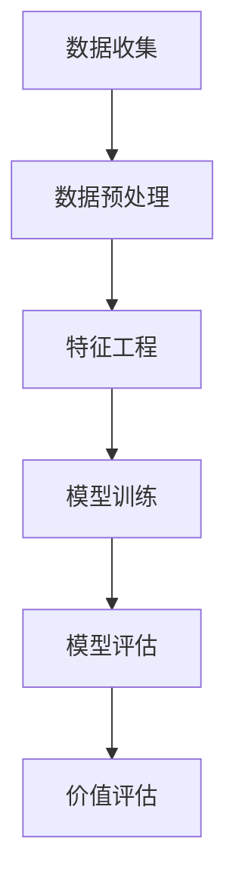

                 

### 引言与背景

在现代金融科技的快速发展中，智能商业银行正逐渐成为金融行业的新宠。智能商业银行不仅提升了银行服务的效率和便利性，还通过先进的技术手段深度挖掘客户价值，实现了个性化、精准化的金融服务。在这种背景下，本文将探讨智能商业银行客户价值分析的核心概念、原理、算法和实践，旨在为读者提供一份全面且深入的技术指南。

## 1.1 问题的背景

### 1.1.1 商业银行在当前经济环境中的重要性

商业银行作为现代金融体系的核心，其重要性不言而喻。在当前经济全球化、数字化和信息化的背景下，商业银行不仅承担着资金流转、风险管理和支付结算等传统职能，还通过金融创新和科技应用，推动着金融服务的转型升级。特别是在全球经济复苏乏力、金融市场波动加剧的背景下，商业银行的作用更加突出。它们通过提供多元化、个性化的金融产品和服务，帮助企业和个人应对风险，提高资金使用效率，从而促进经济的稳定和发展。

### 1.1.2 客户价值分析的概念及其重要性

客户价值分析（Customer Value Analysis）是指通过对客户数据进行深入分析和挖掘，以评估和预测客户的潜在价值，并据此制定相应的市场营销和客户关系管理策略。在智能商业银行中，客户价值分析具有至关重要的地位。首先，客户价值分析可以帮助银行了解不同客户群体的消费行为和需求特点，从而实现精准营销和个性化服务。其次，通过分析客户的生命周期价值（CLV），银行可以识别和培养高价值客户，提高客户满意度和忠诚度。此外，客户价值分析还能为银行的风险管理提供有力支持，降低客户流失率和信用风险。

### 1.1.3 智能商业银行的发展趋势

智能商业银行是金融科技与银行业务深度融合的产物。随着人工智能、大数据、区块链等技术的不断创新和应用，智能商业银行正展现出强大的发展潜力。首先，人工智能技术的应用使得银行能够通过自然语言处理、机器学习和智能推荐等技术手段，实现智能客服、智能投顾和智能风控等功能。其次，大数据分析技术的应用使得银行能够对海量客户数据进行深度挖掘，从而实现精准营销和个性化服务。此外，区块链技术的应用则可以提高金融交易的透明度和安全性，降低交易成本。总的来说，智能商业银行的发展趋势是数字化转型、智能化服务和安全性保障，这不仅提升了银行的服务质量和效率，也为客户带来了更加丰富和便捷的金融体验。

## 1.2 问题的描述

### 1.2.1 客户价值的定义与评估方法

客户价值是指客户在使用银行产品和服务过程中所创造的经济价值、社会价值和心理价值。具体来说，客户价值可以从以下几个方面进行评估：

1. **经济价值**：客户通过使用银行产品和服务所获得的直接收益，如存款利息、贷款利息收益、理财收益等。
2. **社会价值**：客户在银行生态系统中的地位和影响力，如客户的社会关系、品牌忠诚度、推荐度等。
3. **心理价值**：客户在使用银行产品和服务过程中的心理满足感和幸福感，如服务质量、用户体验、品牌形象等。

在评估客户价值时，银行通常采用以下几种方法：

1. **生命周期价值法（CLV）**：通过预测客户在未来一段时间内为银行带来的总收入，计算出客户的生命周期价值。
2. **净贡献值法（NPV）**：通过计算客户在生命周期内对银行的净贡献，评估客户的价值。
3. **行为分析法**：通过分析客户的消费行为、交易记录等数据，评估客户的价值。

### 1.2.2 智能商业银行客户价值分析的关键要素

智能商业银行客户价值分析的关键要素包括：

1. **数据收集**：银行需要收集大量的客户数据，包括交易记录、行为数据、社会关系数据等。
2. **数据预处理**：对收集到的数据进行清洗、去重、归一化等预处理，确保数据的质量和一致性。
3. **数据分析**：通过数据挖掘、机器学习等技术对预处理后的数据进行分析，提取有用的信息。
4. **价值评估**：根据分析结果，评估客户的潜在价值和贡献度。
5. **策略制定**：根据客户价值评估结果，制定相应的市场营销和客户关系管理策略。

### 1.2.3 智能商业银行客户价值分析面临的挑战

智能商业银行客户价值分析虽然具有巨大的潜力，但同时也面临诸多挑战：

1. **数据隐私与安全问题**：客户数据的收集、存储和使用过程中，存在数据泄露和滥用的风险。
2. **数据质量与一致性**：客户数据来源多样，数据质量参差不齐，需要有效管理和处理。
3. **算法偏见与透明度**：智能算法在处理数据时可能存在偏见，需要确保算法的透明度和可解释性。
4. **法律法规与合规性**：智能商业银行客户价值分析需要遵守相关的法律法规，如《数据安全法》、《个人信息保护法》等。

## 1.3 问题解决的思路

### 1.3.1 智能商业银行客户价值分析的步骤

智能商业银行客户价值分析主要包括以下步骤：

1. **需求分析**：明确客户价值分析的目标和需求。
2. **数据收集**：收集与客户价值相关的各类数据。
3. **数据预处理**：对收集到的数据进行清洗、去重、归一化等处理。
4. **数据分析**：使用数据挖掘、机器学习等技术对预处理后的数据进行分析。
5. **价值评估**：根据分析结果，评估客户的潜在价值和贡献度。
6. **策略制定**：根据客户价值评估结果，制定相应的市场营销和客户关系管理策略。
7. **实施监控**：对客户价值分析的结果进行实时监控和反馈，持续优化分析模型和策略。

### 1.3.2 智能化技术在客户价值分析中的应用

智能化技术是智能商业银行客户价值分析的核心驱动力。具体应用包括：

1. **人工智能**：通过自然语言处理、机器学习和深度学习等技术，实现自动化客户分类、风险评估、智能推荐等功能。
2. **大数据分析**：通过对海量客户数据的挖掘和分析，发现客户行为模式、需求变化等，提供精准的营销策略。
3. **区块链技术**：通过区块链技术实现数据的透明和可追溯，提高数据安全和信任度。

### 1.3.3 数据分析与挖掘在客户价值分析中的作用

数据分析和挖掘在客户价值分析中起着至关重要的作用。具体作用包括：

1. **客户细分**：通过数据分析，将客户按照不同的特征进行细分，为精准营销提供基础。
2. **需求预测**：通过分析客户的历史数据和当前行为，预测客户未来的需求和购买行为。
3. **风险控制**：通过数据分析，识别高风险客户和潜在欺诈行为，提高风险控制能力。
4. **个性化服务**：通过数据分析，了解客户需求和偏好，提供个性化的产品和服务，提高客户满意度。

## 1.4 边界与外延

### 1.4.1 智能商业银行客户价值分析的研究范围

智能商业银行客户价值分析的研究范围包括：

1. **客户价值评估**：研究客户价值的定义、评估方法和工具。
2. **智能化技术**：研究人工智能、大数据分析、区块链技术在客户价值分析中的应用。
3. **数据分析与挖掘**：研究数据分析与挖掘在客户价值分析中的作用和具体应用。
4. **市场营销策略**：研究基于客户价值分析的精准营销策略和客户关系管理。

### 1.4.2 智能商业银行客户价值分析的应用领域

智能商业银行客户价值分析的应用领域包括：

1. **零售银行业务**：研究如何通过客户价值分析提升零售银行业务的效率和服务质量。
2. **信用卡业务**：研究如何通过客户价值分析优化信用卡发卡策略、风险控制和个性化服务。
3. **理财业务**：研究如何通过客户价值分析提升理财产品的销售和客户忠诚度。
4. **中小企业金融**：研究如何通过客户价值分析为中小企业提供定制化的金融解决方案。

### 1.4.3 智能商业银行客户价值分析与其他研究领域的联系

智能商业银行客户价值分析与其他研究领域如风险管理、市场营销、数据挖掘等紧密相连。具体联系包括：

1. **风险管理**：通过客户价值分析，银行可以更好地识别和评估客户风险，提高风险管理能力。
2. **市场营销**：客户价值分析为银行提供了深入了解客户需求和行为的工具，有助于制定更有效的市场营销策略。
3. **数据挖掘**：客户价值分析中的数据挖掘技术可以应用于其他领域，如医疗、物流、零售等，为这些领域提供决策支持。

## 1.5 概念结构与核心要素组成

### 1.5.1 智能商业银行的定义与功能

智能商业银行是指通过引入人工智能、大数据、区块链等先进技术，实现银行业务智能化、数据化和服务化的银行。智能商业银行的主要功能包括：

1. **智能客服**：通过人工智能技术提供7*24小时在线客服，提高客户服务水平。
2. **智能投顾**：通过大数据分析和人工智能技术，为客户提供个性化的投资建议和理财方案。
3. **智能风控**：通过大数据分析和机器学习技术，实时监控和分析客户交易行为，防范风险。
4. **智能营销**：通过数据分析，实现精准营销，提高客户转化率和忠诚度。

### 1.5.2 客户价值的定义与分类

客户价值是指客户在使用银行产品和服务过程中所创造的经济价值、社会价值和心理价值。根据价值的来源和形式，客户价值可以分为以下几类：

1. **经济价值**：包括存款利息、贷款利息收益、理财收益等。
2. **社会价值**：包括客户的社会关系、品牌忠诚度、推荐度等。
3. **心理价值**：包括客户在使用银行产品和服务过程中的心理满足感和幸福感。

### 1.5.3 数据分析与挖掘的核心技术

数据分析与挖掘的核心技术包括：

1. **数据预处理**：包括数据清洗、去重、归一化等。
2. **数据挖掘算法**：包括关联规则挖掘、聚类分析、分类分析、异常检测等。
3. **机器学习**：包括监督学习、无监督学习、强化学习等。
4. **深度学习**：包括神经网络、卷积神经网络、循环神经网络等。

## 1.6 本章小结

本章对智能商业银行客户价值分析进行了全面的介绍，包括背景、问题描述、解决方案和边界与外延。通过本章的学习，读者可以了解智能商业银行的发展趋势和客户价值分析的重要性，掌握客户价值评估的方法和智能化技术、数据分析与挖掘的应用。在接下来的章节中，我们将深入探讨智能商业银行客户价值分析的核心概念、原理和实践，为读者提供更加详细和专业的技术指南。

----------------------------------------------------------------

## 第二部分: 智能商业银行客户价值分析的核心概念与原理

### 2.1 客户价值的定义与评估方法

客户价值（Customer Value）是指客户在金融交易或服务中，从银行产品或服务中获得的实际利益、心理满足感和社会地位提升等多方面的综合价值。客户价值的评估是智能商业银行实现精准营销和客户关系管理的基础。

#### 2.1.1 客户价值的定义

客户价值的定义可以从以下几个方面进行阐述：

1. **经济价值**：客户通过使用银行产品或服务获得的直接经济收益，如存款利息、贷款利息收益、理财产品收益等。
2. **社会价值**：客户在社会中的地位和影响力，包括客户的社会关系、品牌忠诚度、推荐度等。
3. **心理价值**：客户在体验银行产品或服务过程中的心理满足感和幸福感，包括服务质量、用户体验、品牌形象等。

#### 2.1.2 客户价值的评估方法

评估客户价值的方法主要包括以下几种：

1. **生命周期价值法（Customer Lifetime Value, CLV）**：生命周期价值法是一种预测客户在其生命周期内为银行带来的总收益的方法。其公式为：
   $$\text{CLV} = \sum_{t=1}^{T} \frac{\text{净利润}_{t}}{(1+r)^{t}}$$
   其中，$\text{净利润}_{t}$ 表示第 $t$ 年的净利润，$r$ 表示折现率，$T$ 表示预测期。

2. **净贡献值法（Net Present Value, NPV）**：净贡献值法是通过计算客户在其生命周期内对银行的净贡献来评估客户价值。其公式为：
   $$\text{NPV} = \sum_{t=1}^{T} \frac{\text{净利润}_{t}}{(1+r)^{t}}$$
   其中，$\text{净利润}_{t}$ 表示第 $t$ 年的净利润，$r$ 表示折现率，$T$ 表示预测期。

3. **行为分析法**：通过分析客户的消费行为、交易记录等数据，评估客户的潜在价值和贡献度。这通常涉及客户分类、行为模式识别和需求预测等技术。

#### 2.1.3 客户价值的评估工具

在评估客户价值时，银行可以借助多种工具和技术，如：

1. **客户关系管理系统（CRM）**：通过CRM系统收集和整合客户数据，进行数据分析和价值评估。
2. **数据挖掘工具**：如Python的Scikit-learn、R语言等，用于进行客户数据的挖掘和分析。
3. **机器学习平台**：如TensorFlow、PyTorch等，用于构建和训练机器学习模型，预测客户价值。

### 2.2 智能化技术在客户价值分析中的应用

智能化技术是提升智能商业银行客户价值分析效果的关键。以下是几种主要智能化技术的应用：

#### 2.2.1 人工智能在客户价值分析中的应用

人工智能（Artificial Intelligence, AI）在客户价值分析中的应用主要体现在以下几个方面：

1. **自然语言处理（Natural Language Processing, NLP）**：通过NLP技术，银行可以自动处理和分析客户反馈、评论等非结构化数据，从而了解客户需求和满意度。
2. **机器学习（Machine Learning, ML）**：通过机器学习算法，银行可以自动分类、预测和推荐，从而实现精准营销和个性化服务。
3. **深度学习（Deep Learning, DL）**：通过深度学习算法，银行可以处理大量复杂的客户数据，实现更高级的预测和决策。

#### 2.2.2 大数据分析在客户价值分析中的应用

大数据分析（Big Data Analysis）是智能商业银行客户价值分析的核心。大数据分析的应用主要包括：

1. **数据采集**：通过多种渠道收集客户数据，如交易数据、社交媒体数据、行为数据等。
2. **数据整合**：将不同来源的数据进行整合，构建完整的客户画像。
3. **数据挖掘**：使用数据挖掘技术，从海量数据中提取有价值的信息，如客户行为模式、需求变化等。

#### 2.2.3 区块链技术在客户价值分析中的应用

区块链技术（Blockchain Technology）在客户价值分析中的应用主要体现在以下几个方面：

1. **数据安全**：区块链技术的分布式账本特性可以提高客户数据的安全性和可信度，降低数据泄露和滥用的风险。
2. **透明度**：区块链技术的透明性可以提高客户对银行服务的信任度，增强客户价值感知。
3. **智能合约**：通过智能合约，银行可以自动执行合同条款，提高业务效率和准确性。

### 2.3 数据分析与挖掘在客户价值分析中的作用

数据分析与挖掘（Data Analysis and Mining）在客户价值分析中起着至关重要的作用。以下是数据分析与挖掘在客户价值分析中的几个关键作用：

#### 2.3.1 数据分析与挖掘的基本概念

数据分析与挖掘是指从大量数据中提取有价值的信息和知识的过程。基本概念包括：

1. **数据预处理**：包括数据清洗、去重、归一化等，确保数据质量。
2. **数据挖掘算法**：包括关联规则挖掘、聚类分析、分类分析、异常检测等，用于从数据中提取有价值的信息。
3. **数据可视化**：通过数据可视化技术，将数据分析和挖掘的结果以图形或图表形式展示，帮助决策者理解和利用数据。

#### 2.3.2 数据分析与挖掘的方法与技术

数据分析与挖掘的方法和技术包括：

1. **关联规则挖掘**：用于发现数据之间的关联关系，如客户购买行为之间的关联。
2. **聚类分析**：用于将相似的数据点归为一类，如客户分群。
3. **分类分析**：用于将数据分类到不同的类别，如客户分类。
4. **异常检测**：用于识别数据中的异常值或异常行为，如欺诈检测。

#### 2.3.3 数据分析与挖掘在客户价值分析中的实践应用

在客户价值分析中，数据分析与挖掘的实践应用包括：

1. **客户细分**：通过聚类分析和分类分析，将客户细分为不同的群体，为精准营销提供基础。
2. **需求预测**：通过时间序列分析和回归分析，预测客户未来的需求和购买行为。
3. **风险控制**：通过异常检测和分类分析，识别高风险客户和潜在欺诈行为，提高风险控制能力。
4. **个性化服务**：通过数据分析，了解客户需求和偏好，提供个性化的产品和服务，提高客户满意度。

### 2.4 核心概念属性特征对比表格

为了更好地理解客户价值、智能化技术和数据分析与挖掘的概念及其应用，下面提供了一个核心概念属性特征对比表格：

| 核心概念               | 定义                                                         | 应用场景                                       | 特征对比                                       |
|----------------------|------------------------------------------------------------|--------------------------------------------|--------------------------------------------|
| 客户价值（Customer Value） | 客户在使用银行产品和服务过程中所创造的经济价值、社会价值和心理价值 | 零售银行、信用卡、理财、中小企业金融     | 直接经济收益、社会影响力、心理满足感 |
| 智能化技术（Intelligent Technology） | 利用人工智能、大数据分析、区块链等先进技术实现智能化服务 | 智能客服、智能投顾、智能风控、智能营销 | 自动化、精准化、安全性 |
| 数据分析与挖掘（Data Analysis and Mining） | 从大量数据中提取有价值的信息和知识 | 客户细分、需求预测、风险控制、个性化服务 | 数据清洗、算法挖掘、结果可视化 |

### 2.5 ER实体关系图架构

为了更好地理解客户价值、智能化技术和数据分析与挖掘之间的关系，下面提供了ER实体关系图架构：

#### 2.5.1 客户价值的ER图

```mermaid
erDiagram
  Customer ||--|{ CustomerValue }
  CustomerValue ||--|{ EconomicValue }
  CustomerValue ||--|{ SocialValue }
  CustomerValue ||--|{ PsychologicalValue }
```

#### 2.5.2 智能化技术的ER图

```mermaid
erDiagram
  IntelligentTechnology ||--|{ ArtificialIntelligence }
  IntelligentTechnology ||--|{ BigDataAnalysis }
  IntelligentTechnology ||--|{ BlockchainTechnology }
```

#### 2.5.3 数据分析与挖掘的ER图

```mermaid
erDiagram
  DataAnalysisMining ||--|{ DataPreprocessing }
  DataAnalysisMining ||--|{ DataMiningAlgorithm }
  DataAnalysisMining ||--|{ DataVisualization }
```

## 2.6 本章小结

本章对智能商业银行客户价值分析的核心概念与原理进行了深入探讨，包括客户价值的定义与评估方法、智能化技术的应用以及数据分析与挖掘的核心技术。通过本章的学习，读者可以全面了解客户价值分析的基本原理和智能化技术的应用，为后续的算法原理和实践提供理论基础。

----------------------------------------------------------------

## 第三部分: 智能商业银行客户价值分析的算法原理与实践

### 3.1 客户价值分析算法原理

智能商业银行客户价值分析的算法原理主要基于客户数据的处理和分析，通过算法模型实现对客户价值的预测和评估。以下是几个关键算法原理的概述：

#### 3.1.1 客户价值分析算法的分类

客户价值分析算法可以大致分为以下几类：

1. **统计模型**：如回归分析、聚类分析等，主要用于客户细分和价值预测。
2. **机器学习模型**：如逻辑回归、决策树、随机森林等，用于客户行为预测和价值评估。
3. **深度学习模型**：如卷积神经网络（CNN）、循环神经网络（RNN）等，用于处理复杂的客户数据和高维特征。

#### 3.1.2 客户价值分析算法的基本原理

客户价值分析算法的基本原理主要包括以下几步：

1. **数据收集**：收集与客户价值相关的数据，包括交易记录、行为数据、社会关系数据等。
2. **数据预处理**：对收集到的数据进行清洗、去重、归一化等处理，确保数据质量。
3. **特征工程**：根据业务需求，提取和构造有用的特征，如客户购买频率、购买金额等。
4. **模型训练**：使用机器学习或深度学习算法，对预处理后的数据集进行训练，构建预测模型。
5. **模型评估**：使用验证集或测试集对模型进行评估，调整模型参数，提高预测准确性。
6. **价值评估**：使用训练好的模型对客户数据进行价值评估，为银行提供决策依据。

#### 3.1.3 客户价值分析算法的发展趋势

随着人工智能和大数据技术的发展，客户价值分析算法也在不断进步和优化。以下是一些发展趋势：

1. **多模态数据融合**：结合文本、图像、声音等多种数据类型，提高客户价值预测的准确性。
2. **实时计算与预测**：通过分布式计算和实时分析技术，实现实时客户价值评估和决策。
3. **自适应学习**：利用自适应学习算法，使模型能够自动调整和学习，提高预测的准确性和适应性。
4. **隐私保护**：在数据处理和分析过程中，注重隐私保护和数据安全，遵守相关法律法规。

### 3.2 算法原理讲解

为了更好地理解客户价值分析算法的基本原理，以下将详细讲解一种常见的算法——逻辑回归（Logistic Regression）。

#### 3.2.1 算法的基本概念

逻辑回归是一种广义线性模型，主要用于分类问题。在客户价值分析中，逻辑回归可以用来预测客户是否为高价值客户。逻辑回归的数学模型如下：

$$
\text{logit}(p) = \ln\left(\frac{p}{1-p}\right) = \beta_0 + \beta_1 x_1 + \beta_2 x_2 + \ldots + \beta_n x_n
$$

其中，$p$ 表示客户为高价值客户的概率，$x_1, x_2, \ldots, x_n$ 表示客户特征，$\beta_0, \beta_1, \beta_2, \ldots, \beta_n$ 是模型的参数。

#### 3.2.2 算法的数学模型和公式

逻辑回归的数学模型可以表示为：

$$
p = \frac{1}{1 + \exp(-(\beta_0 + \beta_1 x_1 + \beta_2 x_2 + \ldots + \beta_n x_n))}
$$

其中，$\exp$ 表示指数函数，$\beta_0, \beta_1, \beta_2, \ldots, \beta_n$ 是需要通过训练数据学习的参数。

在训练过程中，逻辑回归使用最大似然估计（Maximum Likelihood Estimation, MLE）来求解参数。最大似然估计的目标是最大化模型的似然函数：

$$
L(\theta) = \prod_{i=1}^{n} p(y_i | \theta)
$$

其中，$y_i$ 是第 $i$ 个样本的标签，$\theta = (\beta_0, \beta_1, \beta_2, \ldots, \beta_n)$ 是模型参数。

对数似然函数为：

$$
\ln L(\theta) = \sum_{i=1}^{n} \ln p(y_i | \theta)
$$

逻辑回归的优化目标是最小化对数似然函数的损失函数：

$$
J(\theta) = -\frac{1}{n} \sum_{i=1}^{n} \left[ y_i \ln p(y_i | \theta) + (1 - y_i) \ln (1 - p(y_i | \theta)) \right]
$$

其中，$y_i$ 是第 $i$ 个样本的标签，$p(y_i | \theta)$ 是模型预测的概率。

#### 3.2.3 算法的Mermaid流程图

以下是逻辑回归算法的Mermaid流程图：



#### 3.2.4 Python源代码实现

以下是一个简单的Python代码实现逻辑回归算法：

```python
import numpy as np
from sklearn.linear_model import LogisticRegression
from sklearn.model_selection import train_test_split
from sklearn.metrics import accuracy_score

# 数据准备
X = ...  # 特征数据
y = ...  # 标签数据

# 数据划分
X_train, X_test, y_train, y_test = train_test_split(X, y, test_size=0.2, random_state=42)

# 模型训练
model = LogisticRegression()
model.fit(X_train, y_train)

# 模型评估
y_pred = model.predict(X_test)
accuracy = accuracy_score(y_test, y_pred)
print(f"Accuracy: {accuracy}")
```

#### 3.2.5 代码应用解读与分析

上述代码首先导入所需的库，然后准备特征数据（X）和标签数据（y）。接着，使用`train_test_split`函数将数据集划分为训练集和测试集。之后，使用`LogisticRegression`类创建逻辑回归模型，并调用`fit`方法进行训练。最后，使用`predict`方法进行预测，并计算模型的准确率。

### 3.3 Python源代码实现

以下是一个使用Python实现的客户价值分析算法的示例代码：

```python
import pandas as pd
from sklearn.model_selection import train_test_split
from sklearn.preprocessing import StandardScaler
from sklearn.linear_model import LogisticRegression
from sklearn.metrics import accuracy_score, confusion_matrix

# 数据准备
data = pd.read_csv('customer_data.csv')
X = data.drop(['target'], axis=1)
y = data['target']

# 数据划分
X_train, X_test, y_train, y_test = train_test_split(X, y, test_size=0.2, random_state=42)

# 数据预处理
scaler = StandardScaler()
X_train = scaler.fit_transform(X_train)
X_test = scaler.transform(X_test)

# 模型训练
model = LogisticRegression()
model.fit(X_train, y_train)

# 模型评估
y_pred = model.predict(X_test)
accuracy = accuracy_score(y_test, y_pred)
conf_matrix = confusion_matrix(y_test, y_pred)

print(f"Accuracy: {accuracy}")
print(f"Confusion Matrix:\n{conf_matrix}")
```

#### 3.3.5 代码应用解读与分析

上述代码首先导入所需的库，并读取客户数据。接着，使用`train_test_split`函数将数据集划分为训练集和测试集。为了提高模型的性能，使用`StandardScaler`对数据进行归一化处理。然后，使用`LogisticRegression`类创建逻辑回归模型，并调用`fit`方法进行训练。最后，使用`predict`方法进行预测，并计算模型的准确率和混淆矩阵，以评估模型的性能。

### 3.4 举例说明

为了更好地理解客户价值分析算法的应用，以下是一个简单的案例。

#### 3.4.1 案例背景

某银行希望通过客户价值分析识别高价值客户，从而制定针对性的营销策略。该银行拥有以下客户数据：

- 年龄
- 收入
- 贷款金额
- 贷款期限
- 信用卡使用频率
- 信用卡消费总额

#### 3.4.2 案例分析与讲解

1. **数据准备**：将客户数据导入Pandas DataFrame，并划分为特征和标签。

2. **数据预处理**：对数据进行清洗和归一化处理。

3. **特征工程**：根据业务需求，提取和构造有用的特征，如贷款额度与收入比例、信用卡消费总额与年龄比例等。

4. **模型训练**：使用逻辑回归算法对训练数据进行训练。

5. **模型评估**：使用测试数据进行模型评估，计算准确率和混淆矩阵。

6. **结果分析**：根据模型预测结果，识别出高价值客户，并制定针对性的营销策略。

#### 3.4.3 案例总结

通过上述案例，我们可以看到客户价值分析算法在银行营销中的应用。通过准确识别高价值客户，银行可以优化资源分配，提高营销效果，从而实现更高的商业价值。

### 3.5 实际案例分析与详细讲解

#### 3.5.1 案例背景

某大型银行希望利用客户价值分析技术，优化其客户关系管理策略，提高客户满意度和忠诚度。该银行拥有以下数据：

- 客户基本信息：年龄、性别、职业、收入水平等。
- 财务数据：存款金额、贷款金额、信用卡消费总额等。
- 行为数据：访问次数、交易频率、产品使用情况等。

#### 3.5.2 案例分析与讲解

1. **数据收集与预处理**：首先，从银行数据库中提取客户数据，包括基本信息、财务数据和行为数据。然后，对数据进行清洗，去除缺失值和异常值，并进行归一化处理。

2. **特征工程**：根据业务需求，提取和构造特征，如客户的年龄与收入比、存款金额与贷款金额比、访问次数与交易频率比等。

3. **数据划分**：将数据集划分为训练集和测试集，通常使用70%-80%的数据进行训练，剩余的数据用于测试。

4. **模型选择与训练**：选择逻辑回归、随机森林和XGBoost等算法进行模型训练。使用交叉验证方法优化模型参数，提高预测准确性。

5. **模型评估**：使用测试数据对模型进行评估，计算准确率、召回率、F1值等指标，选择最优模型。

6. **客户价值评估**：使用训练好的模型对客户进行价值评估，将客户分为高价值客户、中等价值客户和低价值客户。

7. **营销策略制定**：根据客户价值评估结果，制定针对性的营销策略，如对高价值客户提供个性化理财产品、对中等价值客户进行优惠活动、对低价值客户进行挽留措施等。

#### 3.5.3 案例总结

通过上述案例分析，我们可以看到客户价值分析在实际应用中的重要作用。通过准确评估客户价值，银行可以优化资源分配，提高营销效果，从而实现更高的客户满意度和忠诚度。此外，客户价值分析还可以帮助银行发现潜在商机，提升整体竞争力。

## 3.6 本章小结

本章深入探讨了智能商业银行客户价值分析的算法原理与实践，包括算法的基本概念、数学模型和Python源代码实现，以及实际案例分析和讲解。通过本章的学习，读者可以掌握客户价值分析的核心算法原理，并了解如何在实践中应用这些算法，为智能商业银行的客户价值分析提供技术支持。

----------------------------------------------------------------

## 第四部分：智能商业银行客户价值分析的应用实践

### 4.1 银行业务背景

银行业务是指银行为满足社会各界的资金需求和金融需求，提供各种金融服务的一种经营活动。银行业务的演变和发展，反映了金融科技的应用和进步。在现代经济中，银行业务不仅仅是传统的基础金融活动，还涵盖了更多元化的金融服务和产品。

#### 4.1.1 银行业务的概述

银行业务主要包括以下几类：

1. **存款业务**：银行接受客户的存款，并根据存款期限和类型支付相应的利息。
2. **贷款业务**：银行向客户提供贷款，客户需要按期偿还本金和利息。
3. **结算业务**：银行为客户提供支付和结算服务，包括转账、汇款、信用卡支付等。
4. **投资与理财业务**：银行提供各种投资产品和理财服务，如基金、保险、理财产品等。
5. **其他业务**：包括财富管理、跨境金融服务、金融科技服务等。

#### 4.1.2 银行业务的发展趋势

随着科技的进步和金融市场的变化，银行业务正经历着一系列的发展趋势：

1. **数字化与智能化**：越来越多的银行开始运用人工智能、大数据分析、区块链等先进技术，提升业务效率和用户体验。
2. **线上与线下融合**：银行通过线上线下结合的方式，提供全方位的金融服务，满足客户的多元化需求。
3. **跨界合作**：银行为拓展业务，与互联网企业、科技公司等开展跨界合作，共同开发创新金融产品和服务。
4. **个性化与精准化**：通过客户数据分析，银行能够提供更加个性化和精准的金融服务，提高客户满意度和忠诚度。

#### 4.1.3 银行业务的挑战与机遇

银行业的挑战与机遇并存：

1. **监管压力**：随着金融监管的加强，银行需要遵守更多的法规和标准，提高合规性。
2. **市场竞争**：金融市场的竞争加剧，银行需要不断提升服务质量和创新能力，以吸引和留住客户。
3. **技术变革**：金融科技的发展为银行业带来了机遇，但同时也对银行的技术能力提出了更高的要求。
4. **客户需求变化**：客户对金融服务的要求越来越高，银行需要更加灵活和多样化的产品和服务来满足客户需求。

### 4.2 智能商业银行客户价值分析的应用场景

智能商业银行客户价值分析在银行业务中的应用非常广泛，以下是一些主要的应用场景：

#### 4.2.1 贷款

贷款是银行业务的核心之一，智能商业银行客户价值分析在贷款业务中的应用主要体现在以下几个方面：

1. **风险评估**：通过分析客户的信用历史、收入水平、还款能力等数据，评估客户的信用风险，提高贷款审批的准确性。
2. **个性化利率定价**：根据客户的信用评分和风险程度，制定个性化的贷款利率，优化贷款产品的收益和风险。
3. **精准营销**：通过客户行为分析和需求预测，向潜在高价值客户提供定制化的贷款产品和服务。

#### 4.2.2 信用卡

信用卡业务是银行的重要收入来源之一，智能商业银行客户价值分析在信用卡业务中的应用包括：

1. **风险控制**：通过分析客户的消费行为和信用历史，识别潜在的高风险客户，及时采取风险控制措施。
2. **个性化服务**：根据客户的消费偏好和需求，提供个性化的信用卡产品和服务，提高客户满意度和忠诚度。
3. **精准营销**：通过分析客户的消费数据，制定精准的营销策略，提高信用卡销售和客户转化率。

#### 4.2.3 理财业务

理财业务是银行提升客户价值的重要途径，智能商业银行客户价值分析在理财业务中的应用包括：

1. **产品推荐**：根据客户的投资偏好和风险承受能力，推荐合适的理财产品，提高产品销售和客户收益。
2. **风险控制**：通过分析市场数据和客户投资行为，预测市场风险和投资风险，制定有效的风险控制策略。
3. **个性化服务**：根据客户的投资目标和需求，提供定制化的理财规划和投资建议，提高客户满意度和忠诚度。

#### 4.2.4 中小企业金融

中小企业金融是银行服务的重要领域，智能商业银行客户价值分析在中小企业金融中的应用包括：

1. **信用评估**：通过分析企业的财务数据、经营状况和市场环境，评估企业的信用风险，提供个性化的贷款产品和服务。
2. **风险控制**：通过分析企业的交易数据和财务状况，识别潜在的风险因素，制定有效的风险控制措施。
3. **精准营销**：通过分析企业的需求和市场变化，提供定制化的金融解决方案，提高客户满意度和忠诚度。

### 4.3 实际案例与应用

以下是一个智能商业银行客户价值分析的实际案例与应用：

#### 案例背景

某大型商业银行希望优化其客户价值分析流程，提高贷款审批的效率和准确性。该银行积累了大量客户数据，包括信用记录、财务状况、行为数据等。

#### 案例分析与应用

1. **数据收集与预处理**：首先，从银行的数据库中提取客户数据，包括信用记录、财务状况、行为数据等。然后，对数据进行清洗，去除缺失值和异常值，并进行归一化处理。

2. **特征工程**：根据业务需求，提取和构造特征，如客户的信用评分、收入水平、贷款用途、还款能力等。

3. **模型选择与训练**：选择逻辑回归、决策树、随机森林等算法对训练数据进行训练。使用交叉验证方法优化模型参数，提高预测准确性。

4. **模型评估**：使用测试数据对模型进行评估，计算准确率、召回率、F1值等指标，选择最优模型。

5. **价值评估与决策**：使用训练好的模型对客户进行价值评估，根据评估结果制定贷款审批策略。对于高价值客户，提高贷款额度和利率优惠；对于高风险客户，严格控制贷款额度和利率。

6. **结果反馈与优化**：根据贷款审批的结果和客户反馈，不断优化模型和策略，提高客户满意度和忠诚度。

#### 案例总结

通过上述实际案例，我们可以看到智能商业银行客户价值分析在贷款业务中的应用效果显著。通过准确评估客户价值，银行能够优化贷款审批流程，提高审批效率和准确性，从而提高客户满意度和忠诚度，实现商业价值。

## 4.4 本章小结

本章详细介绍了智能商业银行客户价值分析在银行业务中的应用场景和实际案例。通过应用智能化技术和数据分析与挖掘，银行能够实现精准营销、风险评估和个性化服务，提高客户满意度和忠诚度，实现商业价值。智能商业银行客户价值分析的应用不仅提升了银行业务的效率和竞争力，也为客户带来了更好的金融体验。

