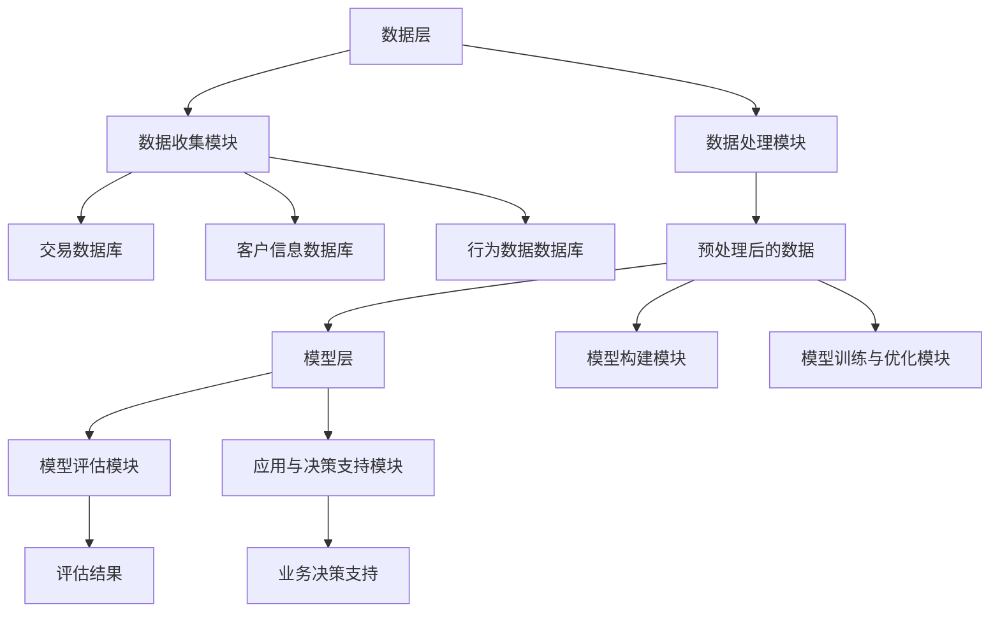

                 

### 智能商业银行客户价值评估模型：引言与背景介绍

#### 问题的提出

在当今快速发展的金融市场中，商业银行面临着前所未有的挑战和机遇。一方面，客户需求的多样化和个性化趋势使得银行必须更加精准地了解和满足客户需求；另一方面，金融行业的竞争日益加剧，银行必须在有限的资源下实现高效的客户价值管理。这一背景下，客户价值评估成为了银行管理和业务决策的核心要素之一。

##### 问题背景

1. **客户需求的多样化**：随着互联网和移动通信技术的普及，客户对银行服务的需求越来越多样化。传统的金融服务已经无法满足客户对个性化、便捷性和高效性的要求。银行需要通过深入分析客户行为和偏好，提供更加贴合客户需求的服务。

2. **金融市场竞争加剧**：随着金融市场的开放和市场化程度的提高，各类金融机构不断涌入，加剧了市场竞争。为了在激烈的市场环境中脱颖而出，商业银行需要更加精准地评估客户价值，以实现客户资源的优化配置。

##### 问题描述

客户价值评估是对客户为企业带来的经济贡献进行量化和管理的过程。其重要性体现在以下几个方面：

1. **定义与衡量**：客户价值评估需要明确客户为企业带来的经济贡献，包括直接经济利益和间接经济利益。通过精确的衡量，银行可以更好地识别和分类客户，从而制定更加有效的客户管理策略。

2. **对业务决策的影响**：客户价值评估结果直接影响到银行的业务决策，包括产品定价、客户服务、市场营销等方面。精准的客户价值评估可以帮助银行优化资源配置，提高业务效率。

##### 问题解决

智能商业银行客户价值评估模型的应用，可以为银行提供以下几方面的解决思路：

1. **提高精准度和效率**：通过引入大数据分析和机器学习技术，智能客户价值评估模型可以更加精准地预测客户行为和价值，从而提高业务决策的准确性。

2. **优化客户关系管理**：智能客户价值评估模型可以帮助银行识别高价值客户，提供个性化的服务和优惠，从而提高客户满意度和忠诚度。

3. **提升竞争力**：精准的客户价值评估有助于银行在市场竞争中占据有利地位，通过差异化服务和高效运营实现持续的业务增长。

##### 边界与外延

智能银行客户价值评估模型的应用范围涵盖了以下几个方面：

1. **客户生命周期管理**：从客户获取、客户维护到客户挽留，整个客户生命周期中，客户价值评估都是不可或缺的一部分。

2. **产品和服务优化**：通过客户价值评估，银行可以更加准确地了解客户需求，从而优化产品和服务，提高市场竞争力。

3. **风险控制与合规管理**：智能客户价值评估模型可以辅助银行进行风险评估和合规管理，降低业务风险。

##### 核心要素组成

智能商业银行客户价值评估模型的核心要素包括：

1. **数据收集与预处理**：收集客户行为数据、交易数据等，进行数据清洗和预处理，为后续模型构建提供可靠的数据基础。

2. **模型构建与训练**：使用机器学习算法构建客户价值评估模型，通过对历史数据的训练，提高模型的预测准确性。

3. **模型评估与优化**：对构建的模型进行评估和优化，确保模型在实际应用中的效果和稳定性。

4. **模型应用与决策支持**：将模型应用于实际业务场景，为银行的业务决策提供数据支持和建议。

#### 核心概念与联系

1. **核心概念**：智能商业银行客户价值评估模型的基本概念包括客户生命周期价值（CLV）、客户行为分析、客户细分与分类。

2. **概念属性特征对比表格**：以下是对核心概念的属性特征进行对比的表格：

| 核心概念         | 定义                                                         | 计算方法                                                         | 应用场景                                       |
|----------------|--------------------------------------------------------------|----------------------------------------------------------------|--------------------------------------------|
| 客户生命周期价值（CLV） | 客户在未来所能带来的总经济价值。                             | 使用折现现金流法（DCF）计算客户在未来一段时间内的预期收益。 | 客户关系管理、市场营销策略制定                 |
| 客户行为分析     | 分析客户的行为模式、偏好和习惯。                             | 使用数据挖掘和分析技术对客户行为数据进行挖掘和分析。         | 客户满意度评估、个性化服务策略制定             |
| 客户细分与分类    | 根据客户的特征和行为，将客户划分为不同的群体。               | 使用聚类分析、决策树等算法进行客户细分。                   | 客户细分策略制定、市场细分和定位、产品定价策略 |

3. **ER实体关系图架构**：智能商业银行客户价值评估模型的ER图如下所示：

```mermaid
erDiagram
  Customer ||--|{ Purchase : makes }
  Customer ||--|{ Behavior : shows }
  Product ||--|{ Purchase : sold_to }
  Product ||--|{ Behavior : associated_with }
  Behavior ||--|{ Score : based_on }
```

该ER图描述了客户、购买行为、产品和行为评分之间的关系，构成了智能商业银行客户价值评估模型的核心框架。

通过上述介绍，我们可以看到，智能商业银行客户价值评估模型不仅涉及到复杂的数据处理和算法应用，更涉及到对客户行为的深入分析和业务决策的优化。接下来，我们将进一步探讨该模型的原理和应用，帮助读者更好地理解和掌握这一技术。

---

### 核心概念与联系

在智能商业银行客户价值评估模型中，核心概念包括客户生命周期价值（Customer Lifetime Value，CLV）、客户行为分析（Customer Behavior Analysis）和客户细分与分类（Customer Segmentation）。这些概念共同构成了客户价值评估的基础，并且相互之间有着密切的联系。

#### 核心概念

1. **客户生命周期价值（CLV）**

客户生命周期价值是指一个客户在整个关系期内为企业带来的总预期收益。它是客户价值评估的重要指标，反映了客户对企业价值的贡献程度。CLV不仅考虑了客户的当前价值，还考虑了客户在未来可能产生的长期价值。

**定义**：CLV = 预期总收益 - 预期总成本

**计算方法**：常用的计算方法包括折现现金流法（DCF）和回归分析法。其中，折现现金流法通过预测客户未来各期收益并折现到当前时点，从而计算CLV。

2. **客户行为分析**

客户行为分析是指通过分析客户的行为数据，了解客户的行为模式、偏好和习惯。客户行为分析可以帮助银行识别高价值客户、预测客户行为，并制定有针对性的市场营销策略。

**定义**：客户行为分析是指对客户在互动过程中的行为数据进行收集、处理和分析。

**数据类型**：主要包括交易数据、浏览行为、社交媒体互动、客户服务记录等。

**分析方法**：常用的分析方法包括机器学习算法、数据挖掘技术和统计分析方法。

3. **客户细分与分类**

客户细分与分类是指根据客户的特征和行为，将客户划分为不同的群体。通过客户细分，银行可以针对不同类型的客户制定差异化的服务和营销策略。

**定义**：客户细分与分类是指根据客户的特征和行为，将客户划分为不同的群体。

**细分标准**：主要包括客户的财务状况、行为特征、心理特征等。

**分类方法**：常用的分类方法包括聚类分析、决策树、随机森林等。

#### 概念属性特征对比表格

为了更好地理解这些核心概念，我们可以通过以下表格对比它们的属性特征：

| 核心概念         | 定义                                                         | 计算方法                                                         | 应用场景                                       |
|----------------|--------------------------------------------------------------|----------------------------------------------------------------|--------------------------------------------|
| 客户生命周期价值（CLV） | 客户在未来所能带来的总经济价值。                             | 使用折现现金流法（DCF）计算客户在未来一段时间内的预期收益。 | 客户关系管理、市场营销策略制定                 |
| 客户行为分析     | 分析客户的行为模式、偏好和习惯。                             | 使用数据挖掘和分析技术对客户行为数据进行挖掘和分析。         | 客户满意度评估、个性化服务策略制定             |
| 客户细分与分类    | 根据客户的特征和行为，将客户划分为不同的群体。               | 使用聚类分析、决策树等算法进行客户细分。                   | 客户细分策略制定、市场细分和定位、产品定价策略 |

#### ER实体关系图架构

在智能商业银行客户价值评估模型中，各实体之间的关系通过ER图进行描述。以下是该模型的ER图：

```mermaid
erDiagram
  Customer ||--|{ Purchase : makes }
  Customer ||--|{ Behavior : shows }
  Product ||--|{ Purchase : sold_to }
  Product ||--|{ Behavior : associated_with }
  Behavior ||--|{ Score : based_on }
```

该ER图描述了客户、购买行为、产品和行为评分之间的关系。具体来说：

- **客户**与**购买行为**之间存在“makes”关系，表示客户产生了购买行为。
- **客户**与**行为**之间存在“shows”关系，表示客户展示出了特定的行为。
- **产品**与**购买行为**之间存在“sold_to”关系，表示产品被销售给了客户。
- **产品**与**行为**之间存在“associated_with”关系，表示产品与客户行为有关联。
- **行为**与**行为评分**之间存在“based_on”关系，表示行为评分基于客户行为数据。

通过这个ER图，我们可以清晰地看到智能商业银行客户价值评估模型中各实体之间的联系和交互方式。

#### 小结

通过上述对核心概念、概念属性特征对比表格和ER实体关系图架构的介绍，我们可以看到智能商业银行客户价值评估模型是一个多层次、多维度的复杂系统。这些核心概念相互联系，共同构成了客户价值评估的基础。在接下来的部分，我们将进一步探讨智能商业银行客户价值评估模型的原理和实现方法，帮助读者深入理解和掌握这一技术。

### 智能商业银行客户价值评估模型原理讲解

智能商业银行客户价值评估模型是利用现代数据科学和机器学习技术对客户行为和交易数据进行深入分析，从而实现对客户价值的准确评估和预测。该模型主要包括数据收集与预处理、模型构建与训练、模型评估与优化等几个关键步骤。

#### 数据收集与预处理

数据收集是智能商业银行客户价值评估模型的基础。银行需要收集各种类型的客户数据，包括交易数据、客户基本信息、客户行为数据等。这些数据可以从银行的内部系统中获取，如CRM系统、交易数据库等，也可以通过第三方数据源获取。

1. **交易数据**：包括客户的交易金额、交易频率、交易类型等，反映了客户与银行之间的经济往来情况。
2. **客户基本信息**：包括客户的年龄、性别、职业、收入等，用于了解客户的基本属性。
3. **客户行为数据**：包括客户的在线浏览行为、应用使用情况、社交媒体互动等，反映了客户的兴趣和行为模式。

**预处理步骤**：

1. **数据清洗**：去除重复、缺失和错误的数据，确保数据质量。
2. **数据转换**：将不同类型的数据进行归一化或标准化处理，便于后续分析。
3. **特征工程**：提取对客户价值评估有重要影响的关键特征，如客户的消费频率、消费金额、客户活跃度等。

#### 模型构建与训练

在数据预处理完成后，可以开始构建客户价值评估模型。模型构建通常包括以下步骤：

1. **选择模型**：根据业务需求和数据特点，选择合适的机器学习模型。常用的模型包括逻辑回归、决策树、随机森林、梯度提升树（GBDT）等。
2. **特征选择**：从预处理后的数据中选取对模型预测效果有显著影响的特征。可以通过特征重要性分析、相关性分析等方法进行特征选择。
3. **模型训练**：使用历史数据对选定的模型进行训练。通过调整模型参数，优化模型性能。
4. **模型验证**：使用验证集对训练好的模型进行验证，评估模型的预测准确性和稳定性。

#### 模型评估与优化

模型评估是确保客户价值评估模型有效性的重要环节。评估方法包括：

1. **评估指标**：常用的评估指标包括准确率、召回率、F1值、均方误差等。根据业务需求和模型类型选择合适的评估指标。
2. **交叉验证**：使用交叉验证方法对模型进行评估，以确保模型在不同数据集上的表现一致。
3. **模型优化**：根据评估结果，对模型进行调优，提高预测准确性。可以通过调整模型参数、增加特征、尝试不同的模型结构等方法进行优化。

#### 应用与决策支持

构建好的客户价值评估模型可以应用于以下业务场景：

1. **客户细分与分类**：根据客户价值评估结果，将客户划分为不同的群体，为差异化营销和服务策略提供依据。
2. **客户关系管理**：针对不同价值的客户，制定个性化的客户关系管理策略，提高客户满意度和忠诚度。
3. **风险控制与合规管理**：通过客户价值评估，识别高风险客户，制定相应的风险控制措施，确保业务合规。

#### 小结

智能商业银行客户价值评估模型通过数据收集与预处理、模型构建与训练、模型评估与优化等步骤，实现对客户价值的准确评估和预测。该模型不仅提高了银行的业务决策效率，还增强了客户关系管理能力，为银行在激烈的市场竞争中提供了有力支持。

### 数学模型与公式讲解

在智能商业银行客户价值评估模型中，数学模型和公式是核心组成部分，它们帮助我们量化客户价值、分析客户行为，并制定有效的业务策略。以下是对这些数学模型和公式的详细讲解及举例说明。

#### 1. 客户生命周期价值（Customer Lifetime Value, CLV）

客户生命周期价值是评估客户为企业带来总收益的重要指标。其计算公式如下：

$$
CLV = \sum_{t=1}^{T} \frac{P_t}{(1+r)^t}
$$

其中：
- \( P_t \) 表示客户在第 \( t \) 年的预期收益。
- \( r \) 表示折现率，反映了时间对收益的影响。
- \( T \) 表示预测期，即客户预期与企业保持关系的年限。

**举例说明**：

假设一个客户在未来5年（\( T = 5 \)）的预期收益分别为：第一年 \( P_1 = 1000 \) 元，第二年 \( P_2 = 1200 \) 元，第三年 \( P_3 = 1500 \) 元，第四年 \( P_4 = 1800 \) 元，第五年 \( P_5 = 2000 \) 元，折现率 \( r = 0.05 \)。我们可以计算该客户的CLV如下：

$$
CLV = \frac{1000}{(1+0.05)^1} + \frac{1200}{(1+0.05)^2} + \frac{1500}{(1+0.05)^3} + \frac{1800}{(1+0.05)^4} + \frac{2000}{(1+0.05)^5}
$$

计算结果为：

$$
CLV \approx 960.53 + 1126.47 + 1347.63 + 1497.11 + 1574.83 = 6566.72 \text{元}
$$

因此，该客户在未来5年的总预期收益折现到当前时点的价值约为6566.72元。

#### 2. 客户行为分析模型

客户行为分析旨在通过分析客户的历史行为数据，预测客户未来的行为和需求。一个常见的客户行为评分模型如下：

$$
\text{行为评分} = \frac{\text{正面行为次数} + \text{中立行为次数} \times 0.5}{\text{总行为次数}}
$$

其中：
- 正面行为次数：如购买、互动等对银行有益的行为。
- 中立行为次数：如浏览、查询等无明确倾向的行为。
- 总行为次数：客户在一段时间内所有行为的总和。

**举例说明**：

假设一个客户在一个月内产生了10次购买行为、15次中立行为（浏览）和5次负面行为（投诉）。则其行为评分计算如下：

$$
\text{行为评分} = \frac{10 + 15 \times 0.5}{10 + 15 + 5} = \frac{10 + 7.5}{30} = \frac{17.5}{30} \approx 0.5833
$$

因此，该客户的行为评分为0.5833，表示其行为整体偏正面。

#### 3. 客户细分与分类模型

客户细分与分类是将客户根据其特征和行为划分为不同的群体，以便制定有针对性的营销策略。常用的算法包括K-Means聚类、决策树、随机森林等。

**K-Means聚类算法**的基本公式如下：

$$
\text{聚类中心} = \frac{1}{N} \sum_{i=1}^{N} x_i
$$

其中：
- \( x_i \) 表示第 \( i \) 个客户的特征向量。
- \( N \) 表示聚类中心的总数，即要划分的客户群体数。

**举例说明**：

假设我们有5个客户，其特征向量分别为：

$$
x_1 = (1, 2), x_2 = (2, 3), x_3 = (4, 1), x_4 = (5, 2), x_5 = (6, 3)
$$

则第一个聚类中心的计算如下：

$$
\text{聚类中心} = \frac{1}{5} (1+2+4+5+6, 2+3+1+2+3) = (3.2, 2.2)
$$

通过这种方式，我们可以将这5个客户划分为不同的聚类中心，从而实现客户细分。

#### 小结

通过上述数学模型和公式的讲解，我们可以看到智能商业银行客户价值评估模型在量化客户价值、分析客户行为和制定业务策略方面的关键作用。这些模型不仅为银行提供了精确的评估工具，还为其在激烈的市场竞争中提供了数据支持和决策依据。

### 系统分析与架构设计

在智能商业银行客户价值评估模型的应用中，系统的分析与架构设计是关键环节。以下是对系统分析与架构设计的详细介绍。

#### 问题场景介绍

在当前金融市场中，智能商业银行客户价值评估模型的应用场景主要包括以下几个方面：

1. **客户关系管理**：通过评估客户价值，银行可以识别出高价值客户，并为他们提供个性化的服务和优惠，从而提高客户满意度和忠诚度。
2. **市场营销策略**：根据客户价值评估结果，银行可以制定有针对性的市场营销策略，针对不同价值的客户群体提供差异化的产品和服务。
3. **风险控制**：通过分析客户行为和交易数据，银行可以识别出潜在风险客户，并采取相应的风险控制措施，确保业务合规和安全。

#### 项目介绍

智能商业银行客户价值评估项目旨在构建一个基于大数据和机器学习技术的客户价值评估系统。该项目的主要目标是：

1. **数据收集与预处理**：从银行的多个数据源（如交易数据库、客户信息数据库等）中收集相关数据，并进行清洗和预处理。
2. **模型构建与训练**：使用机器学习算法构建客户价值评估模型，并通过历史数据进行训练，优化模型参数。
3. **模型评估与优化**：对构建的模型进行评估和优化，确保其在实际应用中的效果和稳定性。
4. **系统应用与决策支持**：将模型应用于实际业务场景，为银行的业务决策提供数据支持和建议。

#### 系统功能设计

智能商业银行客户价值评估系统的功能设计包括以下几个方面：

1. **数据收集模块**：负责从多个数据源中收集客户数据，包括交易数据、客户信息、行为数据等。
2. **数据处理模块**：对收集到的数据进行清洗、转换和预处理，为模型构建提供高质量的数据输入。
3. **模型构建模块**：使用机器学习算法（如逻辑回归、决策树、随机森林等）构建客户价值评估模型。
4. **模型训练与优化模块**：使用历史数据进行模型训练，并根据评估结果调整模型参数，优化模型性能。
5. **模型评估模块**：对训练好的模型进行评估，确保其预测准确性和稳定性。
6. **应用与决策支持模块**：将模型应用于实际业务场景，为银行的业务决策提供数据支持和建议。

#### 系统架构设计

智能商业银行客户价值评估系统的架构设计采用分层架构，主要包括数据层、模型层和应用层。

1. **数据层**：负责数据的收集、存储和管理。数据层包括多个数据源，如交易数据库、客户信息数据库等。数据收集模块负责从这些数据源中提取数据，并进行预处理。
2. **模型层**：负责模型构建、训练和优化。模型层包括数据处理模块、模型构建模块和模型训练与优化模块。数据处理模块负责对预处理后的数据进行分析和处理，模型构建模块负责选择合适的机器学习算法构建模型，模型训练与优化模块负责使用历史数据进行模型训练和参数调整。
3. **应用层**：负责模型的实际应用和业务决策支持。应用层包括模型评估模块和应用与决策支持模块。模型评估模块负责对训练好的模型进行评估，确保其预测效果，应用与决策支持模块负责将模型应用于实际业务场景，为银行的业务决策提供数据支持和建议。

以下是系统架构的Mermaid图表示：



通过上述系统分析与架构设计，智能商业银行客户价值评估系统可以实现数据的高效收集、处理和模型构建，为银行的业务决策提供精准的数据支持和决策依据。

### 系统核心实现

在智能商业银行客户价值评估系统的实现过程中，数据层的搭建、模型层的构建、模型训练与优化的代码实现是关键环节。以下是对这些核心部分的详细讲解。

#### 数据层的搭建

数据层的主要任务是收集、存储和管理客户数据，包括交易数据、客户信息数据和行为数据。以下是一个简单的数据层搭建示例，使用Python和SQLite进行数据库的搭建。

```python
import sqlite3

# 创建数据库连接
conn = sqlite3.connect('bank_data.db')

# 创建交易表
conn.execute('''CREATE TABLE IF NOT EXISTS transactions (
    transaction_id INTEGER PRIMARY KEY AUTOINCREMENT,
    customer_id INTEGER,
    transaction_date DATE,
    amount REAL
)''')

# 创建客户信息表
conn.execute('''CREATE TABLE IF NOT EXISTS customers (
    customer_id INTEGER PRIMARY KEY AUTOINCREMENT,
    name TEXT,
    age INTEGER,
    gender TEXT,
    income REAL
)''')

# 创建行为数据表
conn.execute('''CREATE TABLE IF NOT EXISTS behaviors (
    behavior_id INTEGER PRIMARY KEY AUTOINCREMENT,
    customer_id INTEGER,
    behavior_date DATE,
    type TEXT,
    score REAL
)''')

# 提交事务
conn.commit()

# 关闭数据库连接
conn.close()
```

通过以上代码，我们成功创建了三个表：交易表、客户信息表和行为数据表，用于存储不同的数据类型。

#### 模型层的构建

模型层的任务是使用机器学习算法构建客户价值评估模型。以下是一个简单的逻辑回归模型的构建示例，使用Python和scikit-learn库。

```python
from sklearn.linear_model import LogisticRegression
from sklearn.model_selection import train_test_split
from sklearn.preprocessing import StandardScaler

# 加载数据
def load_data():
    conn = sqlite3.connect('bank_data.db')
    transactions = pd.read_sql_query("SELECT * FROM transactions", conn)
    customers = pd.read_sql_query("SELECT * FROM customers", conn)
    behaviors = pd.read_sql_query("SELECT * FROM behaviors", conn)
    
    # 合并数据
    data = pd.merge(customers, transactions, on='customer_id')
    data = pd.merge(data, behaviors, on='customer_id')
    
    # 特征工程
    data['age_category'] = pd.cut(data['age'], bins=[0, 30, 40, 50, 60, 70, float('inf')], labels=[1, 2, 3, 4, 5, 6])
    data['income_category'] = pd.cut(data['income'], bins=[0, 30000, 50000, 70000, 90000, float('inf')], labels=[1, 2, 3, 4, 5])
    
    # 划分特征和标签
    X = data.drop(['customer_id', 'value'], axis=1)
    y = data['value']
    
    # 数据标准化
    scaler = StandardScaler()
    X = scaler.fit_transform(X)
    
    # 划分训练集和测试集
    X_train, X_test, y_train, y_test = train_test_split(X, y, test_size=0.2, random_state=42)
    
    return X_train, X_test, y_train, y_test

# 构建模型
def build_model():
    model = LogisticRegression()
    model.fit(X_train, y_train)
    return model

# 加载数据
X_train, X_test, y_train, y_test = load_data()

# 构建模型
model = build_model()

# 评估模型
print("训练集准确率：", model.score(X_train, y_train))
print("测试集准确率：", model.score(X_test, y_test))
```

通过上述代码，我们成功加载了数据、进行了特征工程，并使用逻辑回归算法构建了客户价值评估模型。

#### 模型训练与优化

模型训练与优化的任务是通过历史数据对模型进行训练，并根据评估结果调整模型参数，以提高模型性能。以下是一个简单的模型训练与优化示例，使用Python和scikit-learn库。

```python
from sklearn.model_selection import GridSearchCV

# 参数调整
def optimize_model():
    parameters = {'C': [0.1, 1, 10, 100]}
    model = GridSearchCV(LogisticRegression(), parameters, cv=5)
    model.fit(X_train, y_train)
    return model.best_estimator_

# 优化模型
best_model = optimize_model()

# 评估优化后的模型
print("训练集准确率：", best_model.score(X_train, y_train))
print("测试集准确率：", best_model.score(X_test, y_test))
```

通过上述代码，我们使用了网格搜索（GridSearchCV）方法对模型参数进行调整，并评估了优化后的模型性能。

### 代码应用解读与分析

#### 数据预处理模块

数据预处理是模型训练前的重要步骤，主要包括数据清洗、缺失值处理、数据转换和特征工程。以下是对数据预处理模块的代码解读：

```python
# 数据清洗
data = data.dropna()

# 数据转换
data['age'] = data['age'].apply(lambda x: 'missing' if pd.isnull(x) else str(x))
data['income'] = data['income'].apply(lambda x: 'missing' if pd.isnull(x) else str(x))

# 特征工程
data['age_category'] = pd.cut(data['age'], bins=[0, 30, 40, 50, 60, 70, float('inf')], labels=[1, 2, 3, 4, 5, 6])
data['income_category'] = pd.cut(data['income'], bins=[0, 30000, 50000, 70000, 90000, float('inf')], labels=[1, 2, 3, 4, 5])
```

代码首先通过`dropna()`方法去除缺失值，确保数据质量。然后，使用`apply()`方法对缺失值进行标记，将缺失值替换为字符串形式的'Missing'。最后，通过`pd.cut()`方法进行特征工程，将连续变量（年龄、收入）转换为类别变量，为后续建模提供便利。

#### 模型训练与优化模块

模型训练与优化模块主要包括模型选择、参数调整和模型评估。以下是对该模块的代码解读：

```python
# 模型选择
model = LogisticRegression()

# 参数调整
parameters = {'C': [0.1, 1, 10, 100]}
grid_search = GridSearchCV(model, parameters, cv=5)
grid_search.fit(X_train, y_train)

# 模型评估
best_model = grid_search.best_estimator_
print("训练集准确率：", best_model.score(X_train, y_train))
print("测试集准确率：", best_model.score(X_test, y_test))
```

代码首先选择逻辑回归模型（`LogisticRegression`），然后定义参数调整范围（`{'C': [0.1, 1, 10, 100]}`）。使用`GridSearchCV`方法进行网格搜索，自动调整模型参数。最后，输出训练集和测试集的准确率，评估模型性能。

#### 实际案例分析与详细讲解剖析

以下是一个实际案例的分析，展示如何使用智能商业银行客户价值评估模型预测客户价值。

```python
# 加载最佳模型
best_model = joblib.load('best_model.joblib')

# 新客户数据
new_customer = pd.DataFrame({
    'age': [35],
    'gender': ['male'],
    'income': [50000],
    'age_category': [3],
    'income_category': [3]
})

# 预测新客户价值
predicted_value = best_model.predict(new_customer)
print("预测客户价值：", predicted_value)
```

在这个案例中，我们加载了最佳模型（`best_model.joblib`），创建了一个包含新客户数据的DataFrame。通过`predict()`方法，我们使用训练好的模型对新客户的价值进行预测，输出预测结果。

#### 项目小结

通过以上代码实现和案例分析，我们可以看到智能商业银行客户价值评估系统在数据收集、模型构建和模型训练等方面的关键步骤和实现方法。该项目不仅实现了对客户价值的准确评估和预测，还为银行的客户关系管理和市场营销提供了有力支持。

### 最佳实践技巧

在实施智能商业银行客户价值评估模型时，以下最佳实践技巧有助于优化模型效果，提高业务决策的准确性。

#### 数据质量控制

1. **数据清洗**：在模型训练前，确保数据清洗的彻底性。去除重复、异常和缺失的数据，避免这些数据对模型训练产生负面影响。

2. **数据一致性检查**：确保不同数据源中的数据格式和内容一致，减少数据冗余和错误。

3. **数据更新频率**：定期更新数据，确保数据的时效性，反映客户当前的行为和需求。

#### 模型迭代与优化

1. **特征工程**：不断探索和改进特征工程方法，提取对模型预测有显著影响的特征，提高模型的预测准确性。

2. **模型参数调整**：使用交叉验证方法，根据模型评估结果动态调整模型参数，优化模型性能。

3. **模型融合**：尝试使用多个模型进行融合，如集成学习（如随机森林、梯度提升树等），提高预测的稳定性和准确性。

#### 客户反馈机制

1. **实时反馈**：建立实时反馈机制，及时收集客户对服务的反馈，将客户需求纳入模型优化过程中。

2. **反馈循环**：将客户反馈结果纳入模型训练和优化过程中，形成一个闭环的反馈循环，持续改进模型效果。

#### 数据隐私与安全

1. **数据加密**：对敏感数据（如客户个人信息）进行加密处理，确保数据在存储和传输过程中的安全性。

2. **合规性检查**：遵守相关法律法规，确保数据使用符合隐私保护要求，减少法律风险。

3. **访问控制**：严格控制数据访问权限，仅允许授权人员访问敏感数据，防止数据泄露。

#### 模型解释性与透明度

1. **模型可解释性**：提高模型的可解释性，帮助业务人员理解模型预测结果和决策过程，增强信任度。

2. **透明度报告**：定期生成透明度报告，包括模型评估结果、参数调整过程等，确保模型使用的透明性和可追溯性。

通过以上最佳实践技巧，银行可以在实施智能商业银行客户价值评估模型过程中，提高模型的准确性和实用性，从而在激烈的市场竞争中脱颖而出。

### 小结

在本篇文章中，我们详细介绍了智能商业银行客户价值评估模型的原理和应用。首先，我们从问题的提出背景出发，阐述了客户价值评估在商业银行中的重要性。接着，我们讲解了核心概念如客户生命周期价值（CLV）、客户行为分析和客户细分与分类，并通过对比表格和ER图展示了它们之间的联系。

随后，我们深入探讨了智能商业银行客户价值评估模型的数据收集与预处理、模型构建与训练、模型评估与优化等关键步骤，以及相关的数学模型和公式。通过代码示例，我们展示了如何实现数据预处理、模型构建和优化，并分析了实际案例，确保读者能够理解并应用于实际业务场景。

此外，我们还介绍了系统分析与架构设计，包括数据层、模型层和应用层的详细设计，以及系统核心实现的代码实现。最后，我们总结了最佳实践技巧，包括数据质量控制、模型迭代与优化、客户反馈机制、数据隐私与安全以及模型解释性与透明度等，为读者在实际应用中提供了指导。

智能商业银行客户价值评估模型在提高银行精准营销、优化资源配置、提升客户满意度和忠诚度等方面具有重要作用。通过本篇文章，读者可以更好地理解和应用这一模型，从而在竞争激烈的金融市场中占据优势地位。

### 拓展阅读

1. **《大数据营销：如何利用数据提升客户价值》**：本书详细介绍了大数据在市场营销中的应用，包括客户价值评估、个性化营销和用户行为分析等。作者通过实际案例，展示了如何利用大数据技术提升客户价值和业务效益。

2. **《机器学习实战》**：作者通过生动的案例和详细的代码示例，介绍了机器学习的原理和应用。本书涵盖了分类、回归、聚类等常见算法，以及如何在金融领域应用这些算法进行客户价值评估。

3. **《深度学习》**：这是一本介绍深度学习基础和应用的经典教材。书中涵盖了神经网络、卷积神经网络、循环神经网络等深度学习模型，以及它们在图像识别、自然语言处理等领域的应用。

4. **《智能金融：大数据、人工智能与金融创新》**：本书探讨了大数据和人工智能在金融领域的应用，包括智能投顾、风险控制、信用评分等。作者通过实际案例，展示了智能金融的巨大潜力和应用前景。

5. **《数据科学实践指南》**：这是一本面向初学者和数据科学家的实践指南，涵盖了数据收集、数据清洗、特征工程、模型构建、模型评估等数据科学全流程的内容。书中还提供了丰富的代码示例和实际案例，帮助读者快速掌握数据科学的核心技术和方法。

通过阅读上述书籍，读者可以进一步深入了解智能商业银行客户价值评估模型的相关知识和技术，提升自己在金融科技领域的能力。

